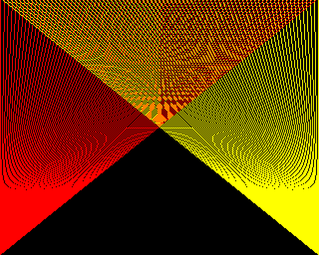

# Learn Python by Making

[](https://github.com/pmirvine/learn-python-by-making/actions/workflows/check.yml)

A project-based Python tutorial for people who can already program a little and want to know Python *properly*: the language, its idioms, and the way professionals work with it.

It's built on an old idea. In 1982 you could switch on a BBC Micro, type `MOVE 0,0 : DRAW 1279,1023`, and see a line. You typed, the machine answered with pictures and noises, and so you kept typing. This tutorial teaches Python that way: twenty-eight projects, each of which makes something you can see, hear or play with, from a guessing game to a home-made computer that boots to a `>` prompt and runs programs written in your own BASIC.



*Project 8: fourteen lines of Python, using `MOVE` and `DRAW` commands the reader writes themselves.*

## Who it's for

Someone who knows what a variable, a loop and a function are, from BBC BASIC, JavaScript, C#, Java, C or anywhere else, and is new to Python. The tutorial moves quickly over what such a reader already knows, and slowly over what's different: names and objects, mutability, iteration, the data model, decorators, generators, protocols, asyncio.

From the first project it also teaches the working habits: **uv**, **Git**, **VS Code**, **pytest**, **ruff**, type hints, packaging and CI. Each arrives when a project needs it, one new skill per chapter.

## What's in it

| Part | Projects | Python |
|---|---|---|
| **0 · Switching on** | The toolkit; Hello, Beeb | uv, Git, VS Code, the REPL |
| **1 · Console** | Hi-Lo, Turtle Sketchbook, Dice Lab, Codebreaker, a text adventure, Life, Fractal Factory | The core: objects and names, collections, functions, modules, exceptions, generators, closures |
| **2 · Pygame** | Mode 2 Sketchpad, Snake, Breakout, a sound synth, Asteroids, Life in Pixels, 3D wireframes, a sprite editor | Classes, the data model, protocols, composition |
| **3 · Interpreters** | Logo; Tiny BASIC | Decorators, structural pattern matching, typing in depth, CI |
| **4 · Web** | SVG Plotter, a teletext-style site generator, Flask, htmx, FastAPI | Templates, databases, HTTP, first async |
| **5 · TUI** | Rich dashboards; three Textual apps | Descriptors, asyncio, architecture |
| **6 · Shipping** | Ship It; the capstone; unguided briefs | Packaging, releases |

Three projects come back in new forms, so that the reader feels what good structure buys them: **Life** (terminal, then Pygame), the **text adventure** (console, then web, then TUI: one engine, three front ends) and **teletext** (one page model rendered as HTML, in the terminal, and as the capstone computer's text screen).

Every chapter follows the same pattern: *Predict* the output of a few snippets; *Build* the project in stages, committing at each; type in a short magazine-style *listing* and work out how it does it; hunt a planted *bug* by writing a failing test first; then *Challenges* in three sizes, Tweak, Extend and Invent.

### Progress

| | |
|---|---|
| Written | **Part 0** (How to use this tutorial · The toolkit · Project 0) · **Part 1, complete** (Hi-Lo, Turtle Sketchbook, Dice Lab, Codebreaker, The Colossal Cupboard, Life, Fractal Factory) · **Part 2, complete** (Mode 2 Sketchpad, Snake, Breakout, SOUND & ENVELOPE, Asteroids, Life in Pixels, Wireframe, Sprite Editor, and the Pyxel side quest) · **Part 3, complete** (Logo, Tiny BASIC) · **Part 4, so far**: SVG Plotter |
| In progress | Part 4: the web, from SVG to Flask, htmx and FastAPI |

[`docs/roadmap.md`](docs/roadmap.md) has the whole list. [`PLAN.md`](PLAN.md) has the curriculum in detail, the research behind it, and the decisions made along the way.

## Reading it

The tutorial is a website, built with [Zensical](https://zensical.org/) from the Markdown in `docs/`. To read it on your own machine you need [uv](https://docs.astral.sh/uv/getting-started/installation/) and nothing else:

```console
$ git clone https://github.com/pmirvine/learn-python-by-making.git
$ cd learn-python-by-making
$ uv run zensical serve
```

Then open <http://localhost:8000>. The chapters can be read on GitHub too, but the callout boxes and the macOS/Windows/Linux tabs only look right on the site.

## What's in the repository

```text
docs/          the chapters, in Markdown, and their images
projects/      the code for every project, laid out exactly as a reader's own project would be
  NN-name/
    stages/      the code as it stands at the end of each stage of the chapter
    bughunt/     the deliberately broken program for the chapter's bug hunt
    solutions/   solutions to the Tweak and Extend challenges
scripts/       tools that check and build the tutorial
tests/         tests for the projects that come before the tutorial teaches testing
PLAN.md        the curriculum, the research, and the decisions
STYLE.md       how the tutorial is written: voice, chapter structure, conventions
LEDGER.md      what each chapter actually taught and promised, so later chapters stay consistent
```

## How it's kept honest

A tutorial with broken code is worse than none, so everything here is tested, the prose included.

```console
$ uv run scripts/check_all.py
```

- **Every project** has its lockfile checked, is linted and formatted with ruff's default rules, and has its tests run, inside its own environment and from its own folder, just as a reader's copy would be.
- **Every stage snapshot, bug-hunt file and solution** is run. Pygame programs run without a display, using SDL's dummy video driver (`tests/headless.py`).
- **Every chapter** is checked by `scripts/check_docs.py`. Each code listing must match, verbatim, the file it claims to show. Each REPL session is run as a doctest. Each *Predict* snippet is executed, and what it prints is compared with the published answer.
- **Screenshots are generated** by script, never captured by hand, so they can't drift from the code.
- **CI** runs the lot on Linux and Windows for every push, and on macOS on demand.

One thing can't be tested that way: the installation instructions. The macOS ones were tested first-hand. The Windows and Linux ones come from each tool's documentation, and are marked as unverified in the text until somebody confirms them.

## Corrections

If you follow an instruction and it doesn't match what you see, or a listing doesn't behave as the chapter says, please open an issue. Say which chapter and which operating system.

## Licence

The text and images of the tutorial, under `docs/`, are licensed under [CC BY-SA 4.0](LICENSE-docs.md). All the code, in `projects/`, `scripts/`, `tests/` and in the chapters' listings, is under the [MIT licence](LICENSE).

"BBC" and "BBC Micro" are trademarks of the British Broadcasting Corporation. They're used here only to refer to the original machine. This project isn't affiliated with or endorsed by the BBC or anybody else.
