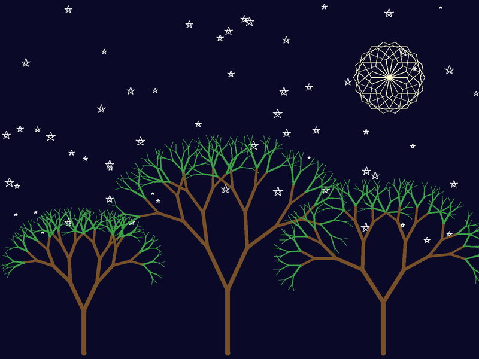
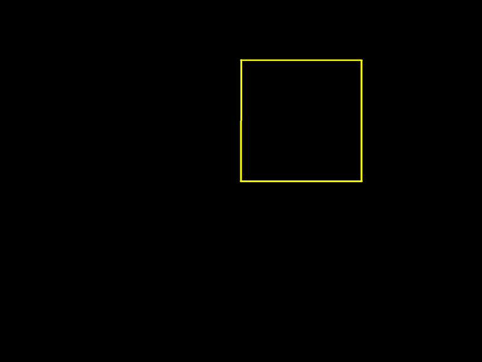
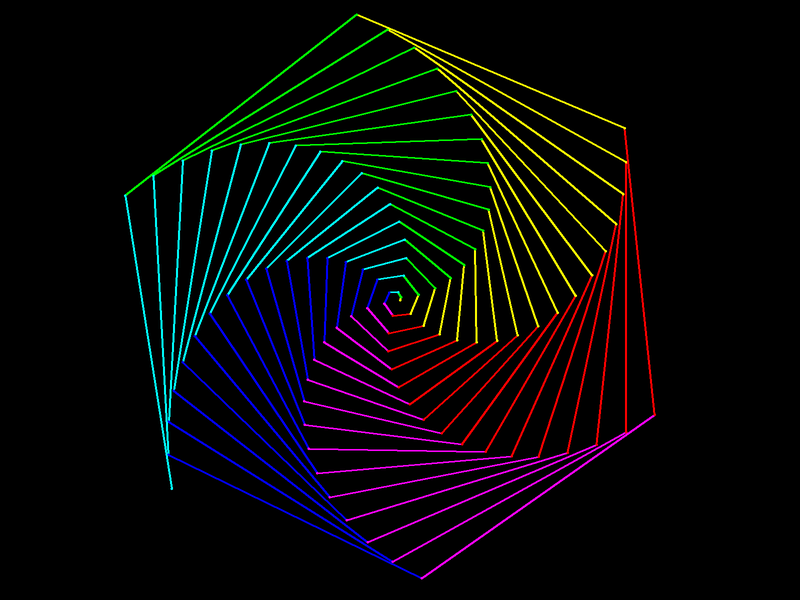
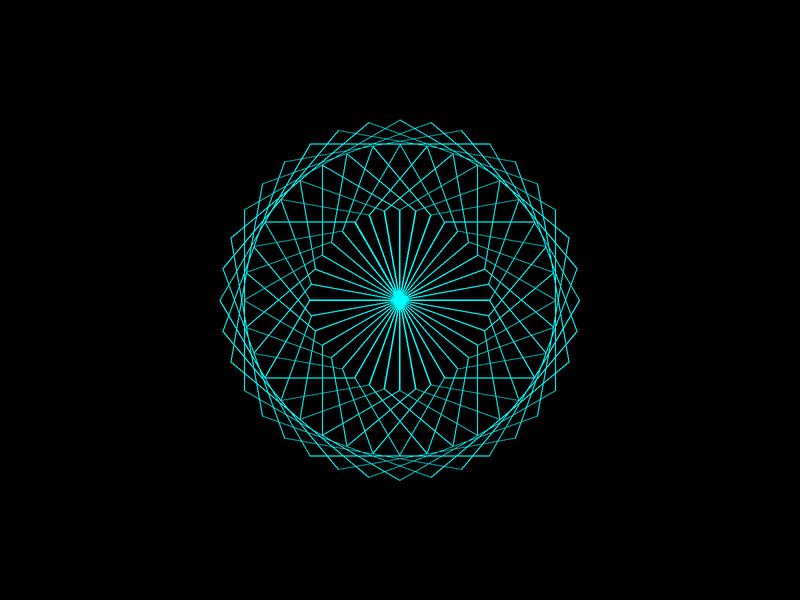
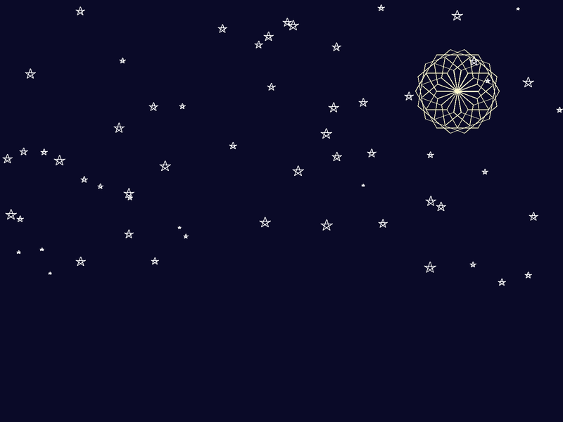
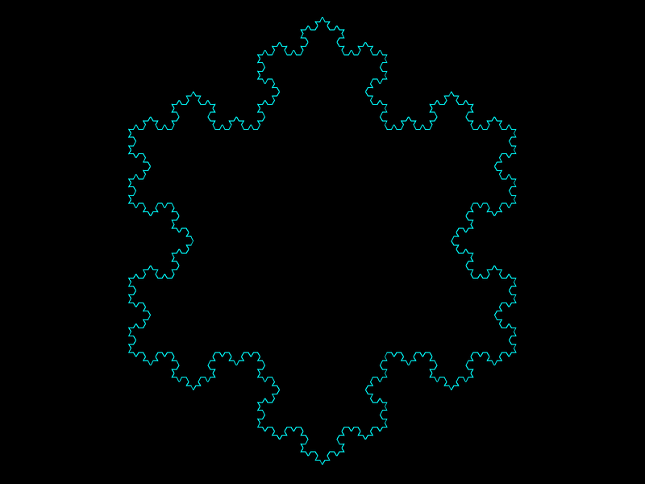
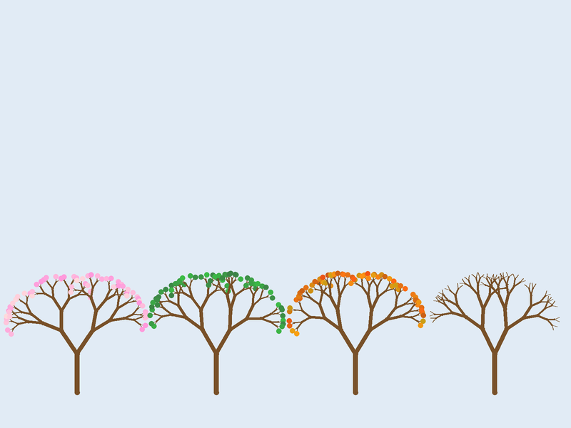

# Project 2 · Turtle Sketchbook

Time to draw something. Python comes with a turtle: a little arrow that walks round a window dragging a pen behind it. You tell it *forward a hundred, left ninety*, and it does, and you watch it happen. It's the quickest way there is to get a picture out of Python, and nothing needs installing.

With it, you'll fill a sketchbook: a rainbow spiral, a rosette, a sky full of stars, and finally a moonlit garden of trees, no two of which ever come out the same.



The turtle is here to teach you functions. You've written simple ones already. This chapter is about what Python's functions can do that you may not expect: default values, arguments passed by name, several results returned at once, and functions that call themselves. Along the way you'll meet the `for` loop properly, and tuples, and learn to use the debugger, which is the best tool there is for understanding what a function is up to.

| | |
|---|---|
| **You'll learn** | `for` and `range`; functions with parameters, defaults and keyword arguments; tuples, packing and unpacking; recursion and the call stack; more of `random` |
| **New tool skill** | The VS Code debugger: breakpoints, stepping, the Variables and Call Stack panels |
| **Time** | 3 hours |
| **Before you start** | [Project 1](p01-hi-lo.md) |

!!! info "Coming from BBC BASIC"
    If your school had a BBC Micro, it may well have had a *floor turtle* too: a perspex dome on wheels, wired to the computer, that trundled about on a sheet of paper with a felt-tip pen. The language that drove it was Logo, whose commands were `FORWARD 100` and `LEFT 90`. Python's `turtle` module is a direct descendant, and in Project 16 you'll write a Logo of your own.

## Predict

Four snippets. Guess first, as ever.

!!! question "Predict"
    ```python
    print(list(range(5)))
    print(list(range(2, 10, 3)))
    print(list(range(5, 0, -1)))
    ```

??? success "Answer"
    ```text
    [0, 1, 2, 3, 4]
    [2, 5, 8]
    [5, 4, 3, 2, 1]
    ```

    A range starts where you tell it, and stops *before* the end you give. Not one of those three contains its end value. Stage 1 explains why that's a good thing.

!!! question "Predict"
    ```python
    import random

    random.seed(1)


    def roll(sides=random.randint(1, 6)):
        return sides


    print(roll(), roll(), roll())
    ```

??? success "Answer"
    ```text
    2 2 2
    ```

    Three identical rolls, and it isn't luck. A default value is worked out **once**, at the moment the `def` statement runs, and not each time the function is called. (`random.seed(1)` makes the "random" numbers the same on every run, which is how this page can tell you it's a 2.) Stage 3 has the cure.

!!! question "Predict"
    ```python
    point = (3, 4)
    x, y = point
    print(x + y)

    a = (5)
    b = (5,)
    print(type(a).__name__, type(b).__name__)
    ```

??? success "Answer"
    ```text
    7
    int tuple
    ```

    It's the comma that makes a tuple, not the brackets. `(5)` is only a 5 in brackets. Stage 3.

!!! question "Predict"
    ```python
    def countdown(n):
        if n == 0:
            print("Lift off!")
            return
        countdown(n - 1)
        print(n)


    countdown(3)
    ```

??? success "Answer"
    ```text
    Lift off!
    1
    2
    3
    ```

    Backwards! Each call to `countdown` calls the next one *before* it prints its own number, so nothing is printed until the innermost call has finished, and then the numbers come out as the calls return, last one first. If that makes your head spin, good: Stage 4 will walk you through it in the debugger.

## Build

### Stage 1: A square, and then a spiral

Make the project:

```console
$ cd making
$ uv init --no-package turtle-sketchbook
$ cd turtle-sketchbook
$ code .
```

Leave `main.py` alone for now. Create a new file beside it, called `spiral.py`.

!!! warning "Gotcha"
    Don't call it `turtle.py`. When Python meets `import turtle`, it looks in your own folder first, finds *your* file, and imports that. Your program ends up importing itself. Recent versions of Python have at least learned to say what's happened:

    ```text
    AttributeError: module 'turtle' has no attribute 'Turtle' (consider renaming
    '/Users/you/making/turtle-sketchbook/turtle.py' since it has the same name as
    the standard library module named 'turtle' and prevents importing that standard
    library module).
    ```

    The same trap is set for `random.py`, `math.py`, `test.py`, and any other file you name after a module. Sooner or later everybody falls into it.

Start with the obvious way to draw a square:

<!-- listing: none -->
```python title="spiral.py"
import turtle

screen = turtle.Screen()
screen.setup(800, 600)
screen.bgcolor("black")

pen = turtle.Turtle()
pen.color("yellow")
pen.pensize(3)

pen.forward(200)
pen.left(90)
pen.forward(200)
pen.left(90)
pen.forward(200)
pen.left(90)
pen.forward(200)
pen.left(90)

screen.mainloop()
```

!!! example "Run it"
    ```console
    $ uv run spiral.py
    ```

    A window opens, and an arrowhead draws a yellow square, one side at a time. Close the window to end the program.

    

`turtle.Screen()` gives you the window, and `turtle.Turtle()` gives you a turtle to draw in it. Both are objects, with methods behind the dot, like the strings of Project 1. The turtle starts in the middle of the window, at `(0, 0)`, facing right. `forward` takes a distance in pixels, and `left` an angle in degrees. `screen.mainloop()` keeps the window open until you close it. Without that line the program would finish, and the window would vanish, the moment the drawing was done.

The same two lines, four times over, is no way to live. You need a loop that goes round four times:

<!-- listing: projects/02-turtle-sketchbook/stages/stage1_square.py -->
```python title="spiral.py"
for _ in range(4):
    pen.forward(200)
    pen.left(90)
```

#### `for` loops over things

If you've come from BASIC or C, you'll be expecting `for` to be a counting loop, with a start, an end and a step. It's nothing of the kind. Python's `for` means *for each thing in this collection of things*: it takes the items one at a time, ties your loop variable to each in turn, and runs the body.

```pycon
>>> for colour in ("red", "green", "blue"):
...     print(colour.upper())
...
RED
GREEN
BLUE
```

There's no counter, and no index. The loop hands you the items themselves. (That bracketed list of strings is a *tuple*. They're properly introduced in Stage 3.)

So what do you do when you really do want to count? You loop over a collection of numbers, and `range` makes one to order:

```pycon
>>> for n in range(3):
...     print(n)
...
0
1
2
```

`range(3)` isn't a loop construct. It's an object that stands for the numbers 0, 1, 2, and `for` loops over it as it would over anything else. To see all of a range at once, turn it into a list:

```pycon
>>> list(range(5))
[0, 1, 2, 3, 4]
>>> list(range(1, 5))
[1, 2, 3, 4]
>>> list(range(0, 360, 90))
[0, 90, 180, 270]
>>> list(range(10, 0, -2))
[10, 8, 6, 4, 2]
```

With one argument, that's where to stop. With two, start and stop. With three, start, stop and step.

Look closely at where those stop. **A range includes its start and excludes its end.** `range(1, 5)` has no 5 in it. That's the promise made in Project 1, and it's one of the most pervasive conventions in Python: slices, which you'll meet in Project 3, work the same way, and so does nearly everything else with a start and an end. (`randint`, you'll remember, is the black sheep.)

It feels wrong for about a week. Then you notice what it buys you:

- `range(n)` has exactly `n` numbers in it, and `range(a, b)` has `b - a`. No more "plus one, or is it minus one?"
- Ranges that share an end fit together with no gap and no overlap: `range(0, 5)` and then `range(5, 10)`.
- `range(len(something))` gives exactly the valid positions in `something`, because counting starts at nought.

!!! info "Coming from BBC BASIC"
    `FOR I% = 1 TO 4` runs for 1, 2, 3 and 4. The nearest Python is `for i in range(1, 5)`, and that 5 will make you wince for a while. More often you don't care what the numbers *are*, only how many there are, and then `range(4)` is both shorter and clearer. There's no `NEXT`, of course. The loop's body is whatever is indented.

The square's loop is called `_`. That's an ordinary name, used by convention for *a value I have to accept but am not going to use*. The body never looks at the counter, and the underscore tells the next reader so.

#### A loop variable that earns its keep

In this loop, by contrast, the variable is the whole point. Replace the square with a spiral, in which every side is longer than the one before. Here's the whole of `spiral.py`:

<!-- listing: projects/02-turtle-sketchbook/spiral.py -->
```python title="spiral.py"
import turtle

COLOURS = ("red", "yellow", "green", "cyan", "blue", "magenta")

screen = turtle.Screen()
screen.setup(800, 600)
screen.bgcolor("black")

pen = turtle.Turtle()
pen.speed(0)
pen.pensize(2)

for step in range(100):
    pen.color(COLOURS[step % len(COLOURS)])
    pen.forward(step * 3)
    pen.left(61)

screen.mainloop()
```

!!! example "Run it"
    

    `pen.speed(0)` means *as fast as you can*. Oddly, 1 is the slowest and 10 is fast, but 0 is fastest of all.

Turning by 60° each time would give a hexagon. Turning by 61° gives a hexagon that doesn't quite close up, and that's where the twist comes from. It's worth ten minutes of your life to try other angles: 59, 89, 91, 121, 144, 170.

`COLOURS[step % len(COLOURS)]` picks the colours in rotation. Square brackets fetch an item by position, counting from nought. `len` says how many items there are, six. And there's the clock-face `%` from Project 1, turning 0, 1, 2… 99 into 0, 1, 2, 3, 4, 5, 0, 1, 2… Six colours and a turn of about a sixth of a circle: that's why each arm of the spiral is a single colour.

!!! tip "Pythonic"
    With `range(len(…))` in your hand, you'll be tempted to write every loop like this:

    ```python
    for i in range(len(COLOURS)):
        print(COLOURS[i])
    ```

    It's the loop you'd write in C, and it works. But `i` is just a middle-man. If you want the items, ask for the items:

    ```python
    for colour in COLOURS:
        print(colour)
    ```

    Whenever you find yourself typing `range(len(`, stop and ask whether you actually need the numbers. The spiral does: `step` sets the length of each side. Most loops don't. (And for the times you want the item *and* its position, Project 3 has something better.)

!!! success "Checkpoint"
    ```console
    $ git add .
    $ git commit -m "Draw a rainbow spiral"
    ```

### Stage 2: Functions that take instructions

A square is a special case of a *regular polygon*: some number of equal sides, with the same turn at every corner. The turns have to add up to one full circle, so each of them is 360° divided by the number of sides. That's an idea that deserves a name and some parameters, and the sketchbook proper starts here. Replace the contents of `main.py`:

<!-- listing: projects/02-turtle-sketchbook/stages/stage2.py -->
```python title="main.py"
"""Turtle Sketchbook: pictures drawn by a turtle."""

import turtle


def polygon(pen, sides, length=100):
    """Draw a regular polygon, ending where it started, facing the same way."""
    for _ in range(sides):
        pen.forward(length)
        pen.left(360 / sides)


def rosette(pen, petals, sides=4, length=100):
    """Draw a ring of polygons, turning a little between each."""
    for _ in range(petals):
        polygon(pen, sides, length)
        pen.left(360 / petals)


def main():
    screen = turtle.Screen()
    screen.setup(800, 600)
    screen.bgcolor("black")

    pen = turtle.Turtle()
    pen.speed(0)
    pen.color("cyan")

    rosette(pen, 36, sides=6, length=90)

    screen.mainloop()


if __name__ == "__main__":
    main()
```

!!! example "Run it"
    ```console
    $ uv run main.py
    ```

    

    Thirty-six hexagons, each turned ten degrees from the last. It was an expensive toy called a Spirograph that made patterns like this in the 1970s. Yours cost nothing.

There are three things to take from those two small functions.

#### Default values

`length=100` in the `def` line gives `length` a *default*. Callers who don't mention it get 100:

```python
polygon(pen, 3)         # a triangle with sides of 100
polygon(pen, 3, 250)    # a bigger one
```

The parameters with defaults have to come after the ones without. That stands to reason, since otherwise Python couldn't tell which arguments you'd left out.

#### Keyword arguments

Look at the call in `main`: `rosette(pen, 36, sides=6, length=90)`. Two of its arguments are passed by *position*, as in any language: the first goes to `pen`, the second to `petals`. The other two are passed by *name*. You can do that with any parameter of any Python function, whether or not it has a default, and named arguments can come in any order:

```python
rosette(pen, 36, 6, 90)                         # which number was which, again?
rosette(pen, 36, sides=6, length=90)            # ah
rosette(pen, length=90, petals=36, sides=6)     # any order you like, once they're named
rosette(pen, 12, length=150)                    # skip sides, and get its default
```

The last of those is where the two features combine. You can leave out any parameter that has a default and name the ones you want. Try doing that with positional arguments alone.

The first line is legal too, and it's a riddle. Is that 36 petals with 6 sides, or 6 petals with 36? Six months from now you won't remember. A good working rule: pass the one or two *obvious* arguments by position, and name the rest.

You've been calling functions like this since Project 0, in fact. `print("no new line", end="")` has one positional argument and one keyword argument.

!!! info "Coming from C, Java or JavaScript"
    No function overloading here, and no fishing about in an `options` object either. Defaults and keyword arguments between them do the work of both, and they're why a Python function can grow a new option without breaking any of the code that already calls it. Add `colour="white"` to the end of `polygon`'s parameters, and every existing call carries on working.

#### Functions built from functions

`rosette` knows nothing about drawing polygons. It asks `polygon` to do it. And that works only because of a promise `polygon` makes in its docstring: it ends **where it started, facing the same way**. Go once round any closed shape and you've turned through 360° and you're back where you began. So `rosette` can draw a polygon, turn a little, draw another, and know that they'll all share a corner.

That promise is worth more than it looks. A function that leaves things exactly as it found them can be combined with other functions without anybody having to think about it. You'll be relying on the same promise, much harder, in Stage 4.

!!! success "Checkpoint"
    Try a few rosettes of your own first. `rosette(pen, 12, sides=3, length=200)` is a good one, and so is `rosette(pen, 72, sides=4, length=140)`.

    ```console
    $ git commit -am "Draw polygons and rosettes"
    ```

### Stage 3: A sky full of stars

The garden needs a night sky: a dark background, a scattering of stars of various sizes, and a moon. That means putting things at *places*, and a place is two numbers that belong together. Python has just the thing.

#### Tuples

A *tuple* is a fixed group of values, written with commas, and usually with brackets round it:

```pycon
>>> position = (250, 170)
>>> position
(250, 170)
>>> position[0]
250
>>> len(position)
2
```

You can take a tuple apart by position, as you did with `COLOURS`, but the better way is *unpacking*. Put as many names on the left as there are items on the right:

```pycon
>>> x, y = position
>>> x
250
>>> y
170
```

That's what was going on in Project 1's type-in listing. `low, high = 1, 100` builds the tuple `(1, 100)`, since the comma is what makes a tuple and the brackets are optional, and then unpacks it again straight away into two names. And the famous swap, `low, high = high, low`, builds the tuple `(high, low)` from the old values, then unpacks it. No temporary variable, because the tuple *is* the temporary.

If the numbers of names and values don't match, Python says so:

```pycon
>>> x, y = (1, 2, 3)
Traceback (most recent call last):
  ...
ValueError: too many values to unpack (expected 2, got 3)
```

unless you nominate one name to soak up the surplus, with a star:

```pycon
>>> first, *rest = (1, 2, 3, 4)
>>> first
1
>>> rest
[2, 3, 4]
```

A tuple, once made, can't be changed:

```pycon
>>> position[0] = 300
Traceback (most recent call last):
  ...
TypeError: 'tuple' object does not support item assignment
```

That's a feature. A tuple is a *value*, like a number or a string. You can hand one to any function you like, and be sure it will still say `(250, 170)` when you get it back. Project 4 has a lot more to say about why that matters.

!!! warning "Gotcha"
    A tuple with one item needs a trailing comma: `(5,)`. Without the comma, `(5)` is simply 5 with brackets round it, as in the third Predict. It looks like a typing error, and it's correct. The empty tuple is `()`.

Because the comma makes the tuple, a function can return more than one result by separating them with commas, and its caller can unpack them on the spot. You'll write one in a moment.

Colours can be tuples too: `(red, green, blue)`, each from 0 to 255. The turtle will take those in place of names, once you've told the screen to expect them with `screen.colormode(255)`.

#### The code

Add `import random` at the top of `main.py`, and these constants under the imports:

<!-- listing: projects/02-turtle-sketchbook/stages/stage3.py -->
```python title="main.py"
NIGHT = (10, 10, 40)
MOONLIGHT = (255, 250, 205)
```

Then add three new functions below `rosette`:

<!-- listing: projects/02-turtle-sketchbook/stages/stage3.py -->
```python title="main.py"
def jump(pen, position):
    """Move to position, an (x, y) tuple, without drawing a line."""
    pen.penup()
    pen.goto(position)
    pen.pendown()


def random_position(screen):
    """Return a random (x, y) in the top two-thirds of the window."""
    half_width = screen.window_width() // 2
    half_height = screen.window_height() // 2
    x = random.randint(-half_width, half_width)
    y = random.randint(-half_height // 3, half_height)
    return x, y


def star(pen, position, size=None):
    """Draw a five-pointed star. Left to itself, it chooses its own size."""
    if size is None:
        size = random.randint(4, 16)
    jump(pen, position)
    for _ in range(5):
        pen.forward(size)
        pen.right(144)
```

And replace `main`:

<!-- listing: projects/02-turtle-sketchbook/stages/stage3.py -->
```python title="main.py"
def main():
    screen = turtle.Screen()
    screen.setup(800, 600)
    screen.colormode(255)
    screen.bgcolor(NIGHT)
    screen.tracer(10)

    pen = turtle.Turtle()
    pen.hideturtle()

    pen.color("white")
    for _ in range(60):
        star(pen, random_position(screen))

    pen.color(MOONLIGHT)
    jump(pen, (250, 170))
    rosette(pen, 18, sides=6, length=30)

    screen.update()
    screen.mainloop()
```

!!! example "Run it"
    

    Run it again. Different stars. The moon is a rosette of eighteen small hexagons, and it was there all along, waiting in the function you wrote in Stage 2.

`random_position` ends with `return x, y`: two values, packed into one tuple, handed back. `star(pen, random_position(screen))` passes that tuple straight on to `star`, which passes it on to `jump`, which gives it to `pen.goto`. Nobody on the way needs to know or care that there are two numbers inside. The position travels as one thing, which is what it is.

The turtle's coordinates, you'll notice, are the ones you learned at school: `(0, 0)` in the middle of the window, `x` to the right, `y` *upwards*. So `half_height` is the top of the window, and `-half_height // 3` is a third of the way below the middle. The stars stay out of the bottom third, which is where the trees are going.

A star is a five-sided shape in which the pen turns by 144° at each point, not 72°. It goes twice round the circle before it closes up: 5 × 144 = 720.

`screen.tracer(10)` tells the screen to redraw itself only after every tenth move, which speeds things up a good deal. With sixty stars, you'll be glad of it. The `screen.update()` at the end catches any moves left over. And `hideturtle()` puts the arrowhead away.

#### The default that wouldn't change

Now for the second Predict. The natural way to write `star` is surely this:

```python
def star(pen, position, size=random.randint(4, 16)):
```

Try it. Every star in the sky comes out the same size, and it's a different size each time you run the program, which makes it all the more baffling.

**A default value is worked out once, when Python runs the `def` statement.** It isn't worked out afresh at every call. `def` is a statement like any other. When Python reaches it, it builds a function object and ties the name `star` to it, and working out the defaults is part of the building. `random.randint(4, 16)` gets called once, comes back with 11, say, and from then on the default *is* 11.

So, when a default needs working out afresh for each call, the idiom is the one in the real code. Make the default `None`, meaning *nobody said*, and do the working-out inside the function, where it happens every time:

```python
def star(pen, position, size=None):
    if size is None:
        size = random.randint(4, 16)
```

There's the `is None` test from Project 1 again. You'll see this pattern all over Python, the standard library included. It has an evil twin, involving lists, which is a good deal better known and a good deal more confusing. It's waiting for you in Project 4.

!!! success "Checkpoint"
    ```console
    $ git commit -am "Draw a starry sky with a rosette moon"
    ```

### Stage 4: Trees, and functions that call themselves

Look at a tree. A trunk, and at the top of it, two branches. Look at one of those branches by itself: a stem, and at the top of it, two smaller branches. It's a little tree. **A tree is a trunk with two smaller trees growing out of the top of it.**

That sentence defines a tree in terms of trees. It ought to be circular nonsense, and in Python it's a working program. Add two more constants:

<!-- listing: projects/02-turtle-sketchbook/main.py -->
```python title="main.py"
BARK = (120, 80, 40)
LEAF = (60, 160, 70)
```

and then this function, above `main`:

<!-- listing: projects/02-turtle-sketchbook/main.py -->
```python title="main.py"
def tree(pen, length, depth):
    """Draw a tree: a branch, then two smaller trees growing from its tip.

    Leaves the pen exactly where it found it, facing the same way.
    """
    if depth == 0:
        return

    lean = random.uniform(15, 35)
    pen.pensize(depth)
    pen.color(BARK if depth > 3 else LEAF)
    pen.forward(length)

    pen.left(lean)
    tree(pen, length * 0.75, depth - 1)
    pen.right(lean * 2)
    tree(pen, length * 0.75, depth - 1)
    pen.left(lean)

    pen.penup()
    pen.backward(length)
    pen.pendown()
```

Finally, plant three of them. In `main`, between the moon and `screen.update()`:

<!-- listing: projects/02-turtle-sketchbook/main.py -->
```python title="main.py, in main()"
    for x, height in ((-260, 70), (-20, 105), (240, 85)):
        jump(pen, (x, -290))
        pen.setheading(90)
        tree(pen, height, 8)
```

!!! example "Run it"
    You should get the garden from the top of the chapter. Run it several times. The trees are different every time, and so is the sky.

A function that calls itself is *recursive*. If that seems like cheating, read `tree` as if you were the turtle:

1. If I've been asked for a tree of depth 0, I do nothing at all. *(This is the **base case**, and it's what stops the whole thing going on for ever.)*
2. Otherwise I draw one branch.
3. I turn left a bit, and ask for a smaller tree, of depth one less. I don't worry about how that gets done. **I trust the docstring**: when it's finished, I'll be right here, facing the way I am now.
4. I turn right, and ask for another.
5. I turn back to where I was facing, and walk backwards down my branch with the pen up. Now I've kept the promise too.

The trust in step 3 is the whole trick. You never have to hold the entire tree in your head. You have to check two things only: that the base case is right, and that *if* the smaller trees keep the promise, *then* this one does. Every call leans on the ones beneath it, all the way down to depth 0, which keeps the promise by doing nothing. It's the promise `polygon` made in Stage 2, and now everything hangs on it.

A few details:

- `random.uniform(15, 35)` is like `randint`, but gives a `float` anywhere between the two. Each branch gets its own `lean`, which is why no two trees match.
- `BARK if depth > 3 else LEAF` is Project 1's conditional expression. The three outermost levels of twig are green.
- `pen.pensize(depth)` makes the trunk thick and the twigs thin, and costs nothing.
- The `for` loop in `main` unpacks as it goes. Each item is a tuple, `(x, height)`, and `for x, height in …` takes it apart for you. You can do that in any `for` loop whose items are tuples.
- `pen.setheading(90)` points the turtle straight up. Headings are in degrees, anticlockwise from "facing right".

Each time `tree` runs, it draws one branch and makes two calls, so a tree of depth 8 has 1 + 2 + 4 + … + 128 branches. That's 255 of them, from about fifteen lines of code.

!!! warning "Gotcha"
    Forget the base case, or write one that's never reached, and the function calls itself until Python loses patience:

    ```pycon
    >>> def forever(n):
    ...     return forever(n + 1)
    ...
    >>> forever(1)
    Traceback (most recent call last):
      ...
    RecursionError: maximum recursion depth exceeded
    ```

    Python gives up at a thousand calls deep, or so. The limit is there to turn a hang, or a crash of Python itself, into an ordinary exception with a traceback. Real recursive code comes nowhere near it: your tree goes nine deep.

#### Watch it happen: the debugger

How can `tree` have one variable called `lean` when there are 255 branches, all leaning at different angles? Because every *call* gets its own private set of local variables. While the turtle is out drawing the tip of a twig, there are eight unfinished calls to `tree` queuing up behind it, each waiting with its own `length` and `depth` and `lean`. That queue is the *call stack*, and the debugger will show it to you.

First, slow things down. In `main`, change `screen.tracer(10)` to `screen.tracer(1)`, and the tree's depth from 8 to 4, so that you can watch each line being drawn. Then:

1. **Set a breakpoint.** Click in the margin to the left of the line number beside `lean = random.uniform(15, 35)`. A red dot appears.
2. **Start debugging.** Press ++f5++. If VS Code asks what kind of debugging, choose **Python Debugger**, and then **Python File**. The program runs as usual, draws the sky, and then *stops*, with the breakpoint's line highlighted. That line hasn't run yet.
3. **Look around.** At the top left, the **Variables** panel shows this call's locals: `depth` is 4, `length` is 70, `pen` is a turtle. There's no `lean` yet.
4. **Step.** Press ++f10++, *Step Over*, to run one line. `lean` appears among the variables. Keep pressing ++f10++ and watch the turtle draw a branch and turn, a line at a time.
5. **Step in.** When the highlight gets to the first `tree(pen, length * 0.75, depth - 1)`, press ++f11++, *Step Into*. Now you're inside a *new* call: `depth` is 3, and `length` is 52.5. Look at the **Call Stack** panel. There are two entries called `tree`, above `main`.
6. **Keep going down.** Press ++f5++, *Continue*, to run on to the breakpoint again, which will be in the next call down. Do it a couple more times. The call stack grows: `tree`, `tree`, `tree`, `tree`, `main`.
7. **Look back up the stack.** Click on any of the entries in the Call Stack panel. The Variables panel changes to show *that* call's locals: its own `depth`, its own `lean`. They're all still there, each waiting for the call above it to finish.
8. **Step out.** Press ++shift+f11++, *Step Out*, to run the present call to its end and stop back in its caller. The stack gets shorter by one. The turtle is back at the bottom of the branch it has just finished. The promise was kept.

Stop with ++shift+f5++. To remove the breakpoint, click the red dot. Remember to put `tracer(10)` and the depth of 8 back.

Here are those keys again, since you'll be using them for the rest of your programming life:

| Key | Does | Use it to |
|---|---|---|
| ++f5++ | Start, or continue | Run on to the next breakpoint |
| ++f10++ | Step over | Run this line, without going into any functions it calls |
| ++f11++ | Step into | Follow a call into the function |
| ++shift+f11++ | Step out | Finish this function and return to its caller |
| ++shift+f5++ | Stop | Give up |

Now go back to the fourth Predict. Put `countdown` in a file, set a breakpoint inside it, and watch the stack build up to four calls before anything at all is printed. Then watch the numbers appear, one by one, as the calls return. When you can *see* that, recursion stops being a magic trick.

!!! info "Coming from BBC BASIC"
    BBC BASIC could do all this. `DEF PROC` procedures could call themselves, and `LOCAL` gave each call variables of its own. For a BASIC of its day, that was remarkable. The difference is one of defaults: in BASIC every variable was global unless you remembered to declare it `LOCAL`, whereas in Python every variable you assign inside a function is local, unless you go out of your way to say otherwise.

!!! success "Checkpoint"
    ```console
    $ git commit -am "Grow a garden of recursive trees"
    ```

## Type-in listing

The *Koch snowflake*, one of the first fractals ever described, in 1904. Save it as `koch.py`.

<!-- listing: projects/02-turtle-sketchbook/koch.py -->
```python title="koch.py" linenums="1"
import turtle


def koch(pen, length, depth):
    if depth == 0:
        pen.forward(length)
        return
    for angle in (60, -120, 60, 0):
        koch(pen, length / 3, depth - 1)
        pen.left(angle)


screen = turtle.Screen()
screen.setup(800, 600)
screen.bgcolor("black")
screen.tracer(20)

pen = turtle.Turtle()
pen.hideturtle()
pen.color("cyan")
pen.penup()
pen.goto(-240, 140)
pen.pendown()

for _ in range(3):
    koch(pen, 480, 4)
    pen.right(120)

screen.update()
screen.mainloop()
```



1. Change the 4 on line 26 to 0, then 1, then 2. What does `koch` draw at depth 0? And how is each level made from the one before?
2. What's the `0` doing at the end of the tuple on line 8? Try taking it out.
3. How many straight lines are there in the finished snowflake? Work it out first. Then add a counter to check.
4. `pen.left(-120)` is a right turn. What does that tell you about how `right` is probably written, inside the `turtle` module?

## Challenges

**Tweak**

1. In `spiral.py`, try the angles suggested in Stage 1, and a few of your own. Then make the pen get thicker as the spiral grows.
2. `tree` has two numbers buried in it: the 0.75 by which each branch shrinks, and the 15-to-35 range of the lean. Make them parameters, with those values as defaults, so that every existing call still works. Then grow a tall thin poplar, and a wide flat thorn tree.
3. Make the stars twinkle in colour: mostly white, with the odd pale yellow or pale blue one. `random.choice` picks one item from a tuple. Give it a tuple in which white appears several times.

**Extend**

1. **Filled shapes.** Anything the turtle draws between `pen.begin_fill()` and `pen.end_fill()` is filled in with `pen.fillcolor(…)`. Give `polygon` a `fill` parameter that defaults to `None`, meaning *don't fill*. Then draw a stack of filled polygons, from an octagon down to a triangle.
2. **The four seasons.** Give `tree` a `season` parameter. At the tip of every twig, where `depth` reaches 0, `pen.dot(size, colour)` draws a leaf: pink blossom in spring, green in summer, orange and red in autumn, and nothing in winter. Draw the same tree four times, side by side.
3. **Another tree, please.** Make the space bar wipe the picture and grow a new tree. You'll need `screen.onkey(function, "space")`, and then `screen.listen()`.

??? tip "Hint for the four seasons"
    The base case is no longer "do nothing": it's "draw a leaf, then return". Write a small function that takes a season and returns a colour tuple, with a little randomness in it, or returns `None` for winter. And remember that `season` has to be passed on in both of the recursive calls, or it'll be summer everywhere but the trunk.

??? tip "Hint for the space bar"
    `screen.onkey` wants a function that it can call later, with no arguments. You pass it the function *itself*, by name, without brackets: `screen.onkey(new_tree, "space")`. With brackets, you'd be calling `new_tree` there and then, and handing `onkey` whatever came back, which is `None`.

    Because the screen will call it with no arguments, `new_tree` can't be given `pen` and `screen` as parameters. For now, create them at the top of the file, outside any function, where every function can see them. Functions as values, and better ways of getting at `pen`, are what Project 7 is all about.



**Invent**

1. **Sierpiński's triangle.** A triangle made of three half-sized triangles, each of which is made of three half-sized triangles… Work out the base case first.
2. **A city at night.** A skyline of buildings with random heights and widths, each with a grid of windows, some lit and some dark. Write a function for a window, one for a building, and one for a street. Put it under your sky.
3. **A real Spirograph.** The toy's curves are what a point on a small wheel traces out as it rolls round inside a big one. With the wheels' radii `R` and `r`, and the pen `d` from the small wheel's centre, the point is at `x = (R - r) * cos(t) + d * cos((R - r) / r * t)`, with the same for `y` but with `sin` and a minus sign. Feed those to `pen.goto` for many small steps of `t`. The functions are in the `math` module.

Solutions to the Tweaks and Extends are in the project's `solutions/` folder.

## Recap

You can now:

- [x] explain why Python's `for` isn't a counting loop, and what `range` really is
- [x] say why ranges stop before their end, and what that convention buys you
- [x] resist `range(len(…))` when you only want the items
- [x] write functions with default values, and call them with keyword arguments
- [x] explain when a default value is worked out, and use the `None` idiom when that's the wrong moment
- [x] pack values into tuples and unpack them again, in assignments, in `return` and in `for` loops
- [x] write a recursive function, find its base case, and reason about it by trusting its promise
- [x] describe the call stack, and explain why each call has local variables of its own
- [x] set a breakpoint, step over, into and out of calls, and read the Variables and Call Stack panels

**Read more:** [`for` statements and `range`](https://docs.python.org/3/tutorial/controlflow.html#for-statements) · [More on defining functions](https://docs.python.org/3/tutorial/controlflow.html#more-on-defining-functions) · [Tuples and sequences](https://docs.python.org/3/tutorial/datastructures.html#tuples-and-sequences) · [The `turtle` module](https://docs.python.org/3/library/turtle.html) · [VS Code: debugging](https://code.visualstudio.com/docs/debugtest/debugging)

Two projects in, and you've been taking it on trust that your programs work, because you ran them and they looked all right. [Project 3](p03-dice-lab.md) is about collections of data: lists and dictionaries. It's also where you start to *prove* that your code works, with tests.
