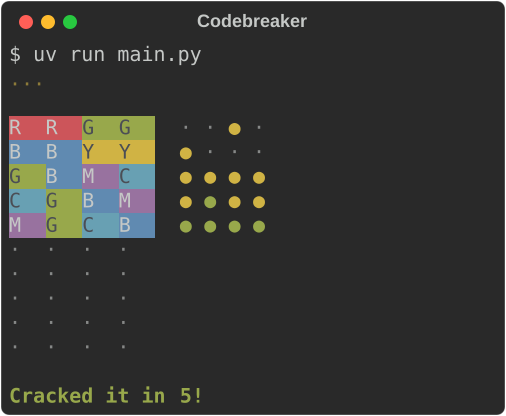

# Project 4 · Codebreaker

The computer hides a code: four coloured pegs, from a choice of six colours. You have ten guesses to crack it. After each guess it tells you, peg by peg, which are the right colour in the right place, and which are the right colour in the wrong place. It's the 1970s board game crossed with the 2020s word game, and it's played in colour.



Codes and guesses are text, so this is the chapter about **strings**, and about **sets**, which make short work of questions like "did they type any letters that I don't know?"

But the real business of the chapter is something that three chapters have now put off. In Project 1 you learned that a variable is a label tied to an object, and not a box with a value in it, and you were told that it would matter as soon as the object could change. Lists can change. **Mutability** is behind the most confusing bugs that people new to Python run into, and every one of them makes perfect sense once you can see the labels. By the end of this chapter, you will.

| | |
|---|---|
| **You'll learn** | Strings, their methods, and Unicode; sets; raising exceptions; mutability, aliasing and copying; `is` and `==`; why dictionary keys can't change; what `__name__` is; using a library from PyPI |
| **New tool skill** | A type checker, switched on. Undoing things in Git: `restore` and `commit --amend`. Your first bug hunt. |
| **Time** | 4 hours |
| **Before you start** | [Project 3](p03-dice-lab.md) |

## Predict

All four of these have caught out every Python programmer who ever lived. Commit to an answer.

!!! question "Predict"
    ```python
    a = [1, 2, 3]
    b = a
    b.append(4)
    print(a)
    ```

??? success "Answer"
    ```text
    [1, 2, 3, 4]
    ```

    You appended to `b`, and `a` changed. Except that you didn't append to `b`. You appended to *the list*, and the list has two labels tied to it. Here, at last, is the snippet that Project 1's first Predict warned you about.

!!! question "Predict"
    ```python
    def add_guess(guess, history=[]):
        history.append(guess)
        return history


    print(add_guess("RGBY"))
    print(add_guess("CMYK"))
    ```

??? success "Answer"
    ```text
    ['RGBY']
    ['RGBY', 'CMYK']
    ```

    The second call remembers the first one's guess. This is the evil twin that Project 2 promised: a default is worked out once, when the `def` runs, so there's only ever *one* default list, and every call that uses it, changes it.

!!! question "Predict"
    ```python
    board = [["."] * 3] * 2
    board[0][0] = "X"
    print(board)
    ```

??? success "Answer"
    ```text
    [['X', '.', '.'], ['X', '.', '.']]
    ```

    One assignment, and two rows changed, because there aren't two rows. There's one row, and the outer list holds it twice.

!!! question "Predict"
    ```python
    word = "straße"
    print(len(word), word.upper(), len(word.upper()))
    print("-".join("abc"), "a,b,,c".split(","))
    ```

??? success "Answer"
    ```text
    6 STRASSE 7
    a-b-c ['a', 'b', '', 'c']
    ```

    Upper-casing a string can make it *longer*. Text is more slippery than it looks. And `join` and `split` are opposites, more or less. Stage 1.

## Build

### Stage 1: Codes and guesses

```console
$ cd making
$ uv init --no-package codebreaker
$ cd codebreaker
$ uv add --dev pytest ruff
$ code .
```

A code is four letters, each standing for a colour: `"GYRG"`. A guess is the same. So the first job is to make a code, and to turn whatever the player types into a proper guess, or else to say clearly what's wrong with it. Replace `main.py`:

<!-- listing: projects/04-codebreaker/stages/stage1.py -->
```python title="main.py"
"""Codebreaker: crack the colour code."""

import random

COLOURS = "RGBYMC"
CODE_LENGTH = 4


def make_code(length: int = CODE_LENGTH) -> str:
    """Return a random code, such as "GYRG". Colours can repeat."""
    return "".join(random.choices(COLOURS, k=length))


def parse_guess(text: str) -> str:
    """Tidy up what the player typed. Raise ValueError if it can't be a guess."""
    guess = text.upper().replace(" ", "")
    if len(guess) != CODE_LENGTH:
        raise ValueError(f"A guess is {CODE_LENGTH} letters, such as RGBY.")
    strangers = set(guess) - set(COLOURS)
    if strangers:
        raise ValueError(f"I don't know {', '.join(sorted(strangers))}.")
    return guess


def main() -> None:
    code = make_code()
    print(f"(Psst. The code is {code}.)")
    while True:
        try:
            guess = parse_guess(input("Guess: "))
        except ValueError as error:
            print(error)
            continue
        if guess == code:
            print("Cracked it!")
            break
        print("No.")


if __name__ == "__main__":
    main()
```

!!! example "Run it"
    ```console
    $ uv run main.py
    (Psst. The code is BGCR.)
    Guess: rgb
    A guess is 4 letters, such as RGBY.
    Guess: rxpx
    I don't know P, X.
    Guess: r g b y
    No.
    Guess: bgcr
    Cracked it!
    ```

    Red, green, blue, yellow, magenta and cyan, by the way, are six of the BBC Micro's eight colours, leaving out black and white.

#### Strings

You've been using strings since Project 0. Here's what you need to know about them, all in one place.

**A string is a sequence of characters**, and everything you learned about tuples and lists in the last two chapters applies: `len`, indexing from either end, slices, `in`, `for`, `sorted`, `min`.

```pycon
>>> code = "GYRG"
>>> code[0], code[-1], code[1:3]
('G', 'G', 'YR')
>>> "Y" in code, "YR" in code, "GR" in code
(True, True, False)
>>> [letter.lower() for letter in code]
['g', 'y', 'r', 'g']
```

With strings, `in` looks for a *run* of characters, and not only for a single one. There's no separate type for one character: `code[0]` is a string of length 1.

**Strings can't be changed.** Like tuples, and unlike lists:

```pycon
>>> code[0] = "R"
Traceback (most recent call last):
  ...
TypeError: 'str' object does not support item assignment
```

So every string method that sounds as if it changes the string, in fact *returns a new one*, and the original is left as it was:

```pycon
>>> text = " r g b y "
>>> text.upper()
' R G B Y '
>>> text
' r g b y '
>>> text.upper().replace(" ", "")
'RGBY'
```

That's why `parse_guess` says `guess = text.upper().replace(" ", "")`. Calling `text.upper()` and ignoring what comes back does nothing at all, and doing so is a classic mistake.

There are about fifty string methods. These are the ones you'll use every week:

| Method | What it gives you |
|---|---|
| `.upper()` `.lower()` `.title()` | a copy in a different case |
| `.strip()` `.lstrip()` `.rstrip()` | a copy without the spaces (or other characters) at its ends |
| `.replace(old, new)` | a copy with every `old` replaced |
| `.split(separator)` | a **list** of the pieces between the separators |
| `separator.join(pieces)` | the pieces glued into one string |
| `.startswith(x)` `.endswith(x)` | `True` or `False` |
| `.find(x)` `.count(x)` | where `x` first occurs (or −1), and how often |
| `.isdigit()` `.isalpha()` `.isspace()` | `True` or `False` |

`split` and `join` are a pair. With no argument, `split` breaks a string at any run of spaces, which is nearly always what you want:

```pycon
>>> "take the   rusty key".split()
['take', 'the', 'rusty', 'key']
>>> "R,G,B".split(",")
['R', 'G', 'B']
>>> ", ".join(["P", "X"])
'P, X'
>>> "".join(["G", "Y", "R", "G"])
'GYRG'
```

Now for the promise from Project 3. `", ".join(pieces)` does look back to front. You'd expect to ask the *list* to join itself up. But `join` has to work on anything you can loop over, be it a list, a tuple, a set, a dictionary's keys or a comprehension, and those types have nothing in common except that they can be looped over. The one thing certain to be a string is the glue. So the method belongs to the glue.

`make_code` uses it with no glue at all. `random.choices(COLOURS, k=4)` picks four items, with repeats allowed, and returns a list of them. A string is a sequence, so the items are its characters. `"".join(…)` turns the list of letters back into a string.

!!! tip "Pythonic"
    Don't build a string up piece by piece in a loop with `+=`. Collect the pieces, and `join` them once at the end:

    ```python
    line = ""
    for mark in marks:
        line += mark + " "      # makes a whole new string every time round
    ```

    ```python
    line = " ".join(marks)      # one new string, and no stray space at the end
    ```

#### Text is harder than it looks

Python's strings are sequences of *Unicode* characters. There are no "8-bit characters" any more. Every character of every writing system has a number, its *code point*, and `ord` and `chr` convert between the two:

```pycon
>>> ord("A"), ord("é"), ord("●")
(65, 233, 9679)
>>> chr(9679)
'●'
>>> "\N{BLACK CIRCLE} ●"
'● ●'
>>> len("naïve café")
10
```

You can put any character in a string by pasting it in, by its official name with `\N{…}`, or by its code point in hexadecimal with `\u`. `len` counts characters, and not bytes.

And, as the fourth Predict showed, the old assumptions about text don't hold. The German `ß` has no single capital letter, so `"straße".upper()` is `"STRASSE"`, which is one character longer. To compare text without regard to case, don't reach for `.lower()`: use `.casefold()`, which exists for the purpose, and knows about such things.

```pycon
>>> "Straße".casefold() == "STRASSE".casefold()
True
```

!!! info "Coming from BBC BASIC"
    `ASC` and `CHR$` are `ord` and `chr`. `LEFT$(A$, 2)`, `RIGHT$(A$, 2)` and `MID$(A$, 2, 3)` are all slices: `a[:2]`, `a[-2:]` and `a[1:4]`. `INSTR` is `.find()`, or plain `in`. And a string can be as long as your memory allows, where BASIC stopped at 255 characters.

!!! note "Under the bonnet"
    Characters are an idea. Files and networks deal in *bytes*. To turn one into the other you need an *encoding*, and these days that means UTF-8, in which the letter A is one byte and ● is three:

    ```pycon
    >>> "A●".encode()
    b'A\xe2\x97\x8f'
    >>> b'A\xe2\x97\x8f'.decode()
    'A●'
    ```

    The `b'…'` is a `bytes` object: a sequence of numbers from 0 to 255, and a different type from `str`. Python never lets you mix the two up by accident. You'll need `bytes` in Project 11, for sound. Until then, it's enough to know that they're there.

#### Sets

`parse_guess` has to find any letters in the guess that aren't colours. You could loop over the guess, building a list of offenders and taking care not to list the same one twice. Or:

```python
strangers = set(guess) - set(COLOURS)
```

A *set* is a collection in which nothing appears twice, and whose items are in no particular order. Make one from any collection with `set(…)`, or write one with braces:

```pycon
>>> set("RXPX") == {"R", "X", "P"}
True
>>> set("RXPX") - set("RGBYMC") == {"X", "P"}
True
>>> set("RGB") & set("BGM") == {"G", "B"}
True
>>> set("RG") | set("GB") == {"R", "G", "B"}
True
>>> set("RGB") <= set("RGBYMC")
True
```

Those are the operations you did with Venn diagrams at school. `-` is *in the first, but not in the second*. `&` is *in both*. `|` is *in either*. `<=` is *every item of the first is in the second*.

An empty set counts as false, like any empty collection, so `if strangers:` means "if there were any". And because a set has no order, the code uses `sorted(strangers)` to get a list in a dependable order before joining it up. Otherwise the message might say `X, P` today and `P, X` tomorrow, which is harmless, but impossible to write a test for.

Two other things sets are good at. They remove duplicates: `len(set(code)) == len(code)` asks whether all four pegs of a code are different. And `in` is fast. Looking for an item in a list means checking every item in turn. A set goes straight to it, however big the set is. For six colours that's neither here nor there, but for a hundred thousand words it's the difference between instant and useless.

!!! warning "Gotcha"
    `{}` is an empty *dictionary*, and not an empty set, because dictionaries had the braces first. An empty set is `set()`.

#### Raising exceptions

In the first three projects you caught exceptions. Now you *raise* one:

```python
raise ValueError(f"A guess is {CODE_LENGTH} letters, such as RGBY.")
```

`raise` stops the function at that point, as a `return` would, except that the caller doesn't simply carry on. The exception travels up through the callers until some `except` catches it. `ValueError` is the conventional choice for "that's the right type of thing, but its value is no use to me", and it's the very one that `int("seven")` raises.

Think about what the alternatives were. `parse_guess` might have returned `None` for a bad guess, but then it couldn't say *what* was wrong with it. It might have printed the complaint itself, but then you couldn't test it, or use it in a program with a different way of showing messages. Raising gives the caller both pieces of information, that it failed and why, and leaves it to the caller to decide what to do about it.

The catching end has something new, too: `except ValueError as error:` ties the name `error` to the exception object, and printing that gives you its message.

!!! success "Checkpoint"
    ```console
    $ git add .
    $ git commit -m "Make codes and check guesses"
    ```

### Stage 2: Scoring, and the chapter's real subject

Each peg of a guess gets a mark: a **hit** if it's the right colour in the right place, a **near** if it's the right colour in the wrong place, and otherwise a **miss**. That sounds simple enough, and it isn't quite.

Suppose the code is `RGBY` and the guess is `RRRR`. The first peg is a hit. What about the other three? They're red, and there is a red in the code, so are they near? No. The code has *one* red, and the first peg has already accounted for it. There's nothing left for the other three to be near to. They're misses.

This is exactly the kind of fiddly logic that's worth pinning down with tests *before* you write the code, while you're thinking clearly about what ought to happen and haven't yet got attached to what does happen. Create `test_main.py`:

<!-- listing: projects/04-codebreaker/test_main.py -->
```python title="test_main.py"
def test_all_hits():
    assert score("RGBY", "RGBY") == [HIT, HIT, HIT, HIT]


def test_all_misses():
    assert score("RRGG", "BBYY") == [MISS, MISS, MISS, MISS]


def test_right_colours_in_the_wrong_places():
    assert score("RGBY", "YBGR") == [NEAR, NEAR, NEAR, NEAR]


def test_a_mixture():
    assert score("RGBY", "RBMG") == [HIT, NEAR, MISS, NEAR]


def test_a_colour_is_only_near_as_often_as_it_is_spare():
    # There's one R in the code, and the first peg hits it. The other three
    # Rs in the guess have nothing left to be near to.
    assert score("RGBY", "RRRR") == [HIT, MISS, MISS, MISS]


def test_a_later_hit_beats_an_earlier_near():
    # The code's only G is hit by the last peg, so the first G is a miss.
    assert score("RRRG", "GBBG") == [MISS, MISS, MISS, HIT]
```

with `from main import HIT, MISS, NEAR, score` at the top. Run `uv run pytest`, and watch it fail, because there's no `score` to import yet. That's as it should be. Now write the function to make the tests pass. Add these to `main.py`, with `from collections import Counter` among the imports:

<!-- listing: projects/04-codebreaker/stages/stage2.py -->
```python title="main.py"
HIT = "hit"  # the right colour, in the right place
NEAR = "near"  # the right colour, in the wrong place
MISS = "miss"
# ...
def score(code: str, guess: str) -> list[str]:
    """Mark each peg of the guess as a HIT, a NEAR or a MISS."""
    marks = [MISS] * len(code)
    spare: Counter[str] = Counter()

    # First pass: find the hits, and count the code's colours that weren't hit.
    for position, (wanted, got) in enumerate(zip(code, guess, strict=True)):
        if wanted == got:
            marks[position] = HIT
        else:
            spare[wanted] += 1

    # Second pass: a peg is near only while there's a spare one of its colour.
    for position, got in enumerate(guess):
        if marks[position] != HIT and spare[got] > 0:
            marks[position] = NEAR
            spare[got] -= 1

    return marks
```

and change the end of `main`'s loop to show the marks:

<!-- listing: projects/04-codebreaker/stages/stage2.py -->
```python title="main.py, in main()"
        marks = score(code, guess)
        print("       " + " ".join(f"{mark:<4}" for mark in marks))
        if guess == code:
            print("Cracked it!")
            break
```

!!! example "Run it"
    ```console
    $ uv run pytest
    $ uv run main.py
    Guess: rbmg
           hit  near miss near
    ```

    Six green dots from pytest. And the game can now be played, if you delete the line that gives the code away.

It takes two passes because a hit must always win. In the last of those tests, the code's only `G` belongs to the guess's *last* peg. If you marked the pegs in one pass from left to right, the first `G` would claim it as a near before the last one could claim it as a hit.

Everything in it you've met before. `[MISS] * len(code)` makes a list of four misses, to be improved upon. `enumerate(zip(code, guess))` gives each position, along with the pair of letters at it, and the pattern `position, (wanted, got)` unpacks both layers at once. `spare` is a `Counter` that starts empty, and its missing keys count as zero, which is why `spare[wanted] += 1` works first time.

#### Two names, one list

Now look at what `score` does *not* do: it doesn't change `code` or `guess`. It couldn't, as it happens, since they're strings. But it doesn't change anything else it's been given, either. It builds a new list, fills it in, and hands it back. That's a deliberate policy, and to see why, you need the thing this chapter is really about.

Here's the first Predict again:

```pycon
>>> a = [1, 2, 3]
>>> b = a
>>> b.append(4)
>>> a
[1, 2, 3, 4]
```

Remember Project 1: **assignment ties a label to an object. It never copies the object.** `b = a` ties a second label to the very same list. There is one list, with two names, and `append` *changes that list*. Whichever name you look at it through afterwards, you see the change. The name for this is *aliasing*.

With numbers and strings this never came up, and now you can see why. They can't be changed. `a = a + 1` doesn't alter the number 10. It makes a new number, and moves the label. With *immutable* objects, sharing is invisible, and so it's harmless. With *mutable* ones, which means lists, dictionaries and sets, it's visible.

Python will tell you whether two names are tied to the same object. That's what `is` means, and how it differs from `==`:

```pycon
>>> a = [1, 2, 3]
>>> b = a
>>> c = [1, 2, 3]
>>> a == b, a == c
(True, True)
>>> a is b, a is c
(True, False)
```

`==` asks whether two objects have **equal values**. `is` asks whether they're **the same object**. `a` and `c` are equal, but they're two separate lists. Change one, and the other stays as it was.

!!! warning "Gotcha"
    Use `is` for `None`, as Project 1 said: `if best is None`. There's only one `None`, so identity is what you mean. For everything else, numbers and strings included, use `==`. Python sometimes reuses the same object for equal small numbers and short strings, to save memory, and so `is` will sometimes appear to work on them. It's an accident of the implementation, and it will let you down when you least expect it.

**To get a real copy, you must ask for one.** There are three ways of spelling it, and they all do the same:

```pycon
>>> original = ["hit", "near"]
>>> copy = original.copy()
>>> copy.append("miss")
>>> original
['hit', 'near']
```

`list(original)` and the slice `original[:]` are the others.

#### Functions get labels, too

Passing an argument to a function is assignment: the parameter becomes one more label on the caller's object. So if a function changes a mutable argument, its caller sees the change.

```pycon
>>> def tidy(marks):
...     marks.sort()
...
>>> todays = ["near", "hit", "miss"]
>>> tidy(todays)
>>> todays
['hit', 'miss', 'near']
```

Sometimes that's the whole point, as it is of `random.shuffle(cards)`. And sometimes it's a bug, waiting for the day when the caller still needed the marks in their original order. Python has a convention to keep you out of trouble, and you met half of it in Project 3:

- a function either **changes its argument and returns `None`**, like `list.sort()` and `random.shuffle()`,
- or it **leaves its argument alone and returns something new**, like `sorted()` and your own `score`.

It should never do both. Of the two, prefer the second. A function that doesn't alter what it's given can't surprise anyone, and it's far easier to test. Your `test_main.py` has never had to worry about what `score` might have done to its inputs.

!!! note "Under the bonnet"
    There's a subtlety that catches out even old hands. For a list, `+=` changes it in place, as `extend` does. But `a = a + [4]` builds a new list and moves the label:

    ```pycon
    >>> a = [1, 2, 3]
    >>> b = a
    >>> a += [4]
    >>> b
    [1, 2, 3, 4]
    >>> a = a + [5]
    >>> b
    [1, 2, 3, 4]
    ```

    With immutable types there's no such distinction. `+=` always makes a new object, because it has no alternative.

#### Copies that don't go deep enough

A list doesn't contain objects. It contains *labels*. That's how the third Predict came about:

```pycon
>>> row = ["."] * 3
>>> board = [row] * 2
>>> board[0][0] = "X"
>>> board
[['X', '.', '.'], ['X', '.', '.']]
>>> board[0] is board[1]
True
```

`[row] * 2` makes a list with two slots in it, and ties **both slots to the same row**. It doesn't copy the row, because nothing in Python copies anything unless you ask. It's the same with `.copy()`: you get a new outer list, whose slots are tied to the *same* inner lists. That's called a *shallow* copy.

So why was `["."] * 3` all right? Because the three slots are tied to one *string*, and strings can't change. `board[0][0] = "X"` doesn't alter the `"."`. It re-ties one slot to a different string. **Sharing is only ever a problem when the thing that's shared can change.**

The right way to build a grid is with a comprehension, which works its expression out afresh each time round, and so makes a new row each time:

```pycon
>>> board = [["."] * 3 for _ in range(2)]
>>> board[0][0] = "X"
>>> board
[['X', '.', '.'], ['.', '.', '.']]
```

And when you need a truly independent copy of something nested, `copy.deepcopy(thing)`, from the standard library, copies it all the way down.

#### The default that remembers

Now the second Predict, and Project 2's evil twin. You know that a default value is worked out once, when the `def` statement runs. Put that together with mutability:

```pycon
>>> def add_guess(guess, history=[]):
...     history.append(guess)
...     return history
...
>>> add_guess("RGBY")
['RGBY']
>>> add_guess("CMYK")
['RGBY', 'CMYK']
```

There is one default list. It's made when the function is defined, and tied to the function from then on. Every call that doesn't supply its own `history` gets that same list, and appends to it. The cure is the one you already know, from Project 2's stars:

```pycon
>>> def add_guess(guess, history=None):
...     if history is None:
...         history = []
...     history.append(guess)
...     return history
...
>>> add_guess("RGBY")
['RGBY']
>>> add_guess("CMYK")
['CMYK']
```

**Never use a list, a dictionary or a set as a default value.** Ruff will tell you off if you do (rule `B006`), and so will every code reviewer you ever meet.

#### Why keys can't change

One more promise, from Project 3: the keys of a dictionary, and the items of a set, have to be things that can't change.

```pycon
>>> scores = {("RGBY", "RRRR"): 1}
>>> scores[["RGBY", "RRRR"]] = 1
Traceback (most recent call last):
  ...
TypeError: cannot use 'list' as a dict key (unhashable type: 'list')
```

A dictionary finds a key in an instant by working out a number from the key's value, called its *hash*, and using that number to decide where in memory to keep the entry. If a key could change after it had been filed, its hash would change with it, and the dictionary would go and look in the wrong place. So only *hashable* objects can be keys, and the built-in types that are hashable are exactly the ones that can't change.

| Can't change, so can be a key | Can change, so can't |
|---|---|
| `int`, `float`, `bool`, `str`, `None` | `list` |
| `tuple` (if everything in it is hashable) | `dict` |
| `frozenset` | `set` |

It's one of the reasons Python has both tuples and lists. A pair of coordinates has to be a tuple if it's going to be the key of a dictionary, and in Project 6, a whole universe will be built on that.

#### In short

1. Assignment, argument passing, and putting something into a collection all **tie a label** to an object. None of them ever copies it.
2. That only matters for objects that can change: lists, dictionaries and sets.
3. If you want a copy, ask for one: `.copy()`, or `copy.deepcopy()` for nested things.
4. A function should change its argument and return `None`, or leave it alone and return something new. Never both, and preferably the latter.
5. Never give a parameter a mutable default. Use `None`.
6. `==` for equal values. `is` only for `None`.

!!! success "Checkpoint"
    ```console
    $ git add .
    $ git commit -m "Score guesses, with tests for repeated colours"
    ```

### Stage 3: In colour

Letters and words are all very well, but this is supposed to be a game about coloured pegs. In Project 0 you used the Rich library from a single-file script. To use it in a project, you add it:

```console
$ uv add rich
```

Now look at `pyproject.toml`. Rich has joined the `dependencies` list, which is for the libraries your program needs in order to *run*, as distinct from the `dev` group, which is for the ones that you need in order to work on it. And `uv.lock` has recorded the exact versions of Rich and of the three libraries that Rich needs in its turn, so that anyone who clones your project gets precisely what you have. Commit them both.

Rich's markup puts styles in square brackets: `[white on red] R [/]` is an R on a red background, and `[/]` ends the style. So `COLOURS` needs to know more than it did. Turn it from a string into a dictionary, from each peg's letter to its style, and add a dictionary for the marks, with a constant for the number of turns:

<!-- listing: projects/04-codebreaker/main.py -->
```python title="main.py"
# Each peg's letter, and how Rich should paint it.
COLOURS = {
    "R": "white on red",
    "G": "black on green",
    "B": "white on blue",
    "Y": "black on yellow",
    "M": "white on magenta",
    "C": "black on cyan",
}
CODE_LENGTH = 4
MAX_TURNS = 10

HIT = "hit"  # the right colour, in the right place
NEAR = "near"  # the right colour, in the wrong place
MISS = "miss"

MARKS = {HIT: "[green]●[/]", NEAR: "[yellow]●[/]", MISS: "[dim]·[/]"}
```

`parse_guess` doesn't need to change at all. `set(COLOURS)` was the set of a string's characters, and is now the set of a dictionary's keys, and those are the same six letters. `make_code` needs one small change, because `random.choices` wants a sequence, and a dictionary isn't one: `random.choices(list(COLOURS), k=length)`.

Next, the drawing. Notice that not one of these functions prints anything.

<!-- listing: projects/04-codebreaker/main.py -->
```python title="main.py"
def render_turn(guess: str, marks: list[str]) -> str:
    """Return one row of the board, in Rich's markup."""
    pegs = "".join(f"[{COLOURS[letter]}] {letter} [/]" for letter in guess)
    lights = " ".join(MARKS[mark] for mark in marks)
    return f"{pegs}  {lights}"


def render_board(history: list[tuple[str, list[str]]]) -> list[str]:
    """Return every row of the board: the turns so far, then the empty rows."""
    rows = [render_turn(guess, marks) for guess, marks in history]
    blank = "[dim]" + " · " * CODE_LENGTH + "[/]"
    return rows + [blank] * (MAX_TURNS - len(history))
```

The game's whole state is `history`: a list of `(guess, marks)` tuples, one for each turn taken. The board is *worked out from it* each time, and is never stored. That's a design choice, and the bug hunt at the end of this chapter will show you the alternative, and what can go wrong with it. `[blank] * n` is safe, for the reason given in Stage 2: `blank` is a string.

Then the game itself, and a new `main`. Add `from rich.console import Console` to the imports.

<!-- listing: projects/04-codebreaker/main.py -->
```python title="main.py"
def show_board(console: Console, history: list[tuple[str, list[str]]]) -> None:
    """Print the board, with a blank line above it."""
    console.print()
    for row in render_board(history):
        console.print(row)


def play_round(console: Console) -> int | None:
    """Play one game. Return the number of turns taken, or None for a loss."""
    code = make_code()
    history: list[tuple[str, list[str]]] = []
    solved = False

    while not solved and len(history) < MAX_TURNS:
        show_board(console, history)
        text = console.input(f"\nGuess {len(history) + 1} of {MAX_TURNS}: ")
        try:
            guess = parse_guess(text)
        except ValueError as error:
            console.print(f"[red]{error}[/]")
            continue

        marks = score(code, guess)
        history.append((guess, marks))
        solved = marks == [HIT] * CODE_LENGTH

    show_board(console, history)
    if solved:
        console.print(f"\n[bold green]Cracked it in {len(history)}![/]")
        return len(history)
    console.print(f"\nOut of turns. The code was {render_turn(code, [])}")
    return None


def main() -> None:
    console = Console()
    letters = " ".join(f"[{style}] {letter} [/]" for letter, style in COLOURS.items())
    console.print("[bold]Codebreaker[/]")
    console.print(f"I've made a code of {CODE_LENGTH} pegs from {letters}")
    console.print(f"{MARKS[HIT]} right colour, right place")
    console.print(f"{MARKS[NEAR]} right colour, wrong place")

    while True:
        play_round(console)
        if not console.input("\nAnother? (y/n) ").lower().startswith("y"):
            break
```

A `Console` is Rich's replacement for `print` and `input`. It understands the markup, and it knows how many colours your terminal can manage. There's one of them, made in `main`, and passed to whatever needs it. `solved = marks == [HIT] * CODE_LENGTH` compares two lists, and lists are equal when their items are.

!!! example "Run it"
    ```console
    $ uv run main.py
    ```

    You should see something like the picture at the top of the chapter. Play a few games. A sound way to start is with two colours at a time: `RRGG`, and then `BBYY`.

Add a test or two for the board to `test_main.py`. It's easy, because `render_board` returns its rows:

<!-- listing: projects/04-codebreaker/test_main.py -->
```python title="test_main.py"
def test_the_board_always_has_ten_rows():
    assert len(render_board([])) == 10
    history = [("RGBY", [HIT, MISS, MISS, NEAR])]
    rows = render_board(history)
    assert len(rows) == 10
    assert "[white on red] R [/]" in rows[0]
    assert rows[1] == rows[9]
```

!!! success "Checkpoint"
    Run, test, lint, diff, commit. The diff will include `pyproject.toml` and `uv.lock`.

    ```console
    $ git add .
    $ git commit -m "Play in colour, with Rich"
    ```

### Stage 4: What `__name__` is, and a checker for your hints

Two pieces of housekeeping, both promised long ago.

#### The lid comes off `if __name__ == "__main__":`

You've had those two lines at the bottom of every program since Project 0. Twice you've been shown what they're good for: importing your own program at the REPL, and importing it from a test file. Here, at last, is how they work.

Every module has a variable called `__name__`, which Python sets before it runs any of the module's code. Make a one-line file, `whoami.py`:

<!-- listing: none -->
```python title="whoami.py"
print(f"My name is {__name__}")
```

and run it in two ways:

```console
$ uv run whoami.py
My name is __main__
$ uv run python -c "import whoami"
My name is whoami
```

When a file is **imported**, its `__name__` is its module name: the filename, without the `.py`. When a file is **run as the program**, Python names it `"__main__"` instead.

Importing a module *runs it*, from top to bottom. That's how its functions come to be defined: a `def` is a statement, and it has to be executed. So any code at the top level of a file will run on import, whether you wanted it to or not. `if __name__ == "__main__":` is an ordinary `if`, on an ordinary variable, which says: *only do this if I'm the program, and not if I'm being imported*. That's all there is to it. It lets one file be both a program that you run, and a module that tests and other programs can import.

(Names with two underscores at each end are ones that Python itself gives a meaning to. They're called *dunder* names, for "double underscore", and they become very important in Project 12. Delete `whoami.py` when you've finished with it.)

#### Switch on the type checker

You've been writing type hints for a project and a half, and Python has been ignoring every one of them. Pylance, in your editor, can do better. It has a type checker built in, which is switched off until you ask for it. Open your user settings, as you did in [The toolkit](../part-0-switching-on/toolkit.md#settings) (**Preferences: Open User Settings (JSON)**), and add one line:

```json
    "python.analysis.typeCheckingMode": "basic"
```

Now make a deliberate mistake. At the bottom of `play_round`, score the *marks* in place of the guess:

```python
marks = score(code, marks)
```

A red squiggle appears, before you've run anything, and Error Lens shows the complaint:

```text
Argument of type "list[str]" cannot be assigned to parameter "guess" of type "str" in function "score"
```

The checker has read your hints, worked out that `marks` is a `list[str]`, seen that `score` wants a `str`, and caught the contradiction. At run time, that mistake wouldn't even have crashed. `zip` would happily have paired letters with words, and you'd have been given four quiet misses and a baffling game. Undo the change.

This is what the hints were for. A type checker finds a whole class of mistake, such as the wrong argument, a forgotten `None`, or a misspelt method, without running a line of your code. It's particularly sharp about `None`. `play_round` is declared as returning `int | None`, so if you ever write `play_round(console) + 1`, it will point out that you can't add 1 to `None`, and that you haven't checked.

From now on, treat a red squiggle the way you treat a failing test. There are stricter settings than `basic`, and you'll turn them up as the tutorial goes on.

!!! info "Coming from C#, Java or TypeScript"
    This is as near as Python gets to a compiler's type errors, and it's closest of all to TypeScript: a separate tool that reads annotations which the runtime ignores. The difference is one of culture. In Python the checker is an adviser, and not a gatekeeper. Your program will run with type errors in it, and sometimes that's just what you want, halfway through a big change.

#### Undoing things

You've been making commits for four projects. It's time to find out what they're good for, by doing some damage. In `main.py`, select the whole body of `score`, delete it, and save. Then:

```console
$ uv run pytest
$ git status
$ git diff
```

The tests fail, of course. `git status` says that `main.py` is `modified`, and `git diff` shows the missing lines in red. Now:

```console
$ git restore main.py
$ uv run pytest
```

`git restore` puts a file back as it was at the last commit. Your editor reloads it, and the tests pass again. This is what "experimenting without fear" means. Provided you've committed, no experiment can cost you more than the work done since, and that's why you commit often.

!!! warning "Gotcha"
    `git restore` throws your uncommitted changes to that file away, and they can't be got back. There's no recycle bin. It does exactly what you ask, and so look at `git diff` before you ask.

Two relatives are worth knowing:

```console
$ git restore --staged main.py
```

takes a file back out of the staging area, if you've `git add`ed something you didn't mean to. The file itself isn't touched. And:

```console
$ git commit --amend -m "Add the type checker and tidy up"
```

*replaces* your most recent commit with a new one. Use it when you see a typing mistake in the message a moment after pressing ++enter++, or when you've forgotten to add a file: `git add` the file, and then `git commit --amend --no-edit` slips it into the last commit. Only amend a commit that you haven't yet shared with anybody. That won't mean much until Project 6, when you start pushing your work to GitHub, but the habit is worth forming now.

!!! success "Checkpoint"
    ```console
    $ git status
    ```

    should say `nothing to commit, working tree clean`. If it doesn't, you know what to do.

## Type-in listing

Every shop that sold home computers in 1983 had one of these running in the window. Save it as `scroller.py`, and run it with `uv run scroller.py`.

<!-- listing: projects/04-codebreaker/scroller.py -->
```python title="scroller.py" linenums="1"
import math
import time

MESSAGE = "LEARN PYTHON BY MAKING *** "
WINDOW = 16

for frame in range(240):
    start = frame % len(MESSAGE)
    visible = (MESSAGE * 2)[start : start + WINDOW]
    indent = round(24 + 22 * math.sin(frame / 7))
    colour = 31 + frame // 8 % 6
    print(f"{' ' * indent}\033[1;{colour}m{visible}\033[0m")
    time.sleep(0.04)
```

1. Line 9 is the clever one. Why `MESSAGE * 2`? What would go wrong, and when, with plain `MESSAGE[start : start + WINDOW]`?
2. What are `indent` and `colour` doing? You met the `\033[…m` codes in Project 0. What does the `1;` add?
3. It scrolls *up* the screen, where a real one would stay on one line. Try ending the `print` with `end="\r"`, and adding `flush=True`. What does `\r` do? (Look up what "carriage return" meant, on a typewriter.)

## Bug hunt

This is the first of the bug hunts. From now on, every chapter has one.

A colleague has "tidied up" Codebreaker. In place of a history that the board is worked out from, their version keeps a real board, a grid of cells, and writes each guess into it. They're rather pleased with it: "I build the empty board *once*, and copy it for each game. Much more efficient!" Their version is in the project's `bughunt/` folder in the tutorial's repository. Copy `boardgame.py` into a `bughunt` folder of your own, and run it:

```console
$ uv run bughunt/boardgame.py
```

Make one guess and look at the board. Then finish the game, by fair means or foul, and start another.

There are **two** bugs here, and they're related. For each of them:

1. **Reproduce it**, and put into words exactly what's wrong. "The board's wrong" won't do. *Which* rows are wrong, and what's in them?
2. **Write a failing test.** Put `test_board.py` beside `boardgame.py`, and import `new_board`, `place` and `render` from it. One test for each bug. Run them with `uv run pytest bughunt`, and watch them fail.
3. **Fix it**, and watch them pass.

??? tip "Hint"
    Look hard at the three lines that build `EMPTY_BOARD`, and then at `new_board`. How many *row* lists does this program ever create? Fix the first bug in the obvious way, and you may find that the second one is still there. What kind of copy does `.copy()` make?

??? success "Solution"
    **The first bug:** every row of the board shows your latest guess. `[EMPTY_ROW] * MAX_TURNS` makes ten slots, all tied to the *one* row. It's the third Predict. `place` writes into "row 0", which is also rows 1 to 9.

    **The second bug:** a new game begins with the last game's pegs already on the board. `EMPTY_BOARD.copy()` is a shallow copy: a new outer list, whose slots are tied to the same old row. So every game that was ever played has been writing on the same row. The name `EMPTY_BOARD` promises something that the code can't deliver, because in Python a "constant" is only ever a convention, and a mutable one is an accident waiting to happen.

    The tests:

    ```python
    def test_a_guess_fills_one_row_only():
        board = new_board()
        place(board, 0, "RGBY")
        lines = render(board)
        assert lines[0] == "R G B Y"
        assert lines[1] == "· · · ·"


    def test_every_game_starts_with_an_empty_board():
        first = new_board()
        place(first, 0, "RGBY")
        second = new_board()
        assert render(second)[0] == "· · · ·"
    ```

    The fix is to stop sharing. Build a fresh board, with fresh rows, every time one is asked for:

    ```python
    def new_board() -> list[list[str]]:
        return [["·"] * CODE_LENGTH for _ in range(MAX_TURNS)]
    ```

    `copy.deepcopy(EMPTY_BOARD)` would cure the second bug but not the first, since it faithfully copies the sharing *inside* the board as well. As for the "efficiency": building forty one-character cells takes about a millionth of a second.

    Your own version never had these bugs, and couldn't have. Its board isn't stored anywhere. It's worked out afresh from `history` whenever it's wanted, and so there's nothing to go stale, and nothing to share. When you can work something out from what you already know, that's nearly always better than storing it.

## Challenges

**Tweak**

1. Make the game harder: five pegs, and eight turns. How much of the program did you have to change?
2. Show the player which turn they're on in a different way: number the rows of the board, from 1 to 10.
3. Add an easier game, in which no colour appears twice in the code. `random.sample(population, k=n)` chooses `n` *different* items. Give `make_code` a `repeats` parameter which defaults to `True`.

**Extend**

Write the tests first.

1. **Classic scoring.** The board game doesn't tell you *which* pegs were right, only how many: so many black pegs for hits, and so many white pegs for nears. Write `pegs(code, guess)`, returning `(black, white)`. There's a beautifully short way of doing it, using the fact that `&` works on two `Counter`s. Try it at the REPL.
2. **Hard mode.** As in a certain word game: every guess has to use what you've learned so far. A peg that was a hit must stay where it is, and a colour that was near must appear somewhere in the guess. Write `hard_mode_problem(history, guess)`, to return a message saying what's wrong, or `None` if the guess is allowed.
3. **Statistics.** Keep a dictionary of how many games were won in each number of turns, and at the end of the session, show it as a histogram. You have a function for that, in another project. How will you get it into this one? (There's a bad way, which you can use today. The good way is what Project 5 is about.)

??? tip "Hint for classic scoring"
    `Counter("RRGB") & Counter("RGGY")` keeps, for each colour, the *smaller* of its two counts, and that's how many pegs of that colour the code and the guess have in common, wherever they are. Add those up, and you have blacks plus whites. Count the blacks separately, with `zip`, and take them away.

**Invent**

1. **The codebreaker's assistant.** After each turn, tell the player how many codes are still possible. Make a list of all 1,296 codes (look up `itertools.product`), and keep the ones which would have given the same marks as the real code gave, for every guess so far. Then let the computer play the game itself, by always guessing the first code that's still possible. How many turns does it need?
2. **The word game.** Five-letter words, and six guesses. You already have the scoring function. You'll need a list of words. There are plenty on the web, as plain text files, one word to a line: `Path("words.txt").read_text().split()` is a preview of Project 5.
3. **Hangman**, with a gallows drawn in text, and a set of the letters guessed so far.

Solutions to the Tweaks and Extends are in the project's `solutions/` folder.

## Recap

You can now:

- [x] take strings apart and put them together, with slices, `split`, `join`, `replace`, `strip` and the rest, remembering that every one of them returns a new string
- [x] explain why `join` is a method of the glue
- [x] use `ord`, `chr` and `\N{…}`, say what `encode` does, and explain why `len("straße".upper())` is 7
- [x] use sets for uniqueness, for fast membership tests, and for `-`, `&`, `|` and `<=`
- [x] raise a `ValueError` with a helpful message, and catch it with `as`
- [x] predict what happens when two names are tied to one list, and tell `is` from `==`
- [x] copy a list, and explain why a shallow copy of a nested list isn't enough
- [x] explain the `[[0] * 3] * 2` trap, and the mutable default trap, and avoid both
- [x] say why a list can't be the key of a dictionary, and a tuple can
- [x] explain what `__name__` is, and why programs end with that `if`
- [x] add a library to a project with `uv add`, and say what changed in `pyproject.toml` and `uv.lock`
- [x] read the type checker's complaints, and treat them like failing tests
- [x] undo uncommitted changes with `git restore`, and repair the last commit with `--amend`
- [x] track down a bug by reproducing it, writing a failing test, and then fixing it

**Read more:** [Text sequence type: `str`](https://docs.python.org/3/library/stdtypes.html#text-sequence-type-str) · [The Unicode HOWTO](https://docs.python.org/3/howto/unicode.html) · [Set types](https://docs.python.org/3/library/stdtypes.html#set-types-set-frozenset) · [Ned Batchelder: Python names and values](https://nedbatchelder.com/text/names1.html), the best thing ever written on this chapter's main subject · [Why did changing list 'y' also change list 'x'?](https://docs.python.org/3/faq/programming.html#why-did-changing-list-y-also-change-list-x) · [Rich's documentation](https://rich.readthedocs.io/en/stable/introduction.html) · [Pro Git: undoing things](https://git-scm.com/book/en/v2/Git-Basics-Undoing-Things)

Your programs have fitted in one file so far, more or less. The next one won't. [Project 5](p05-colossal-cupboard.md) is a text adventure: a world of rooms, a player with an inventory, a parser that understands `take rusty key`, and saved games. It needs proper structure, and Python has plenty to offer.
