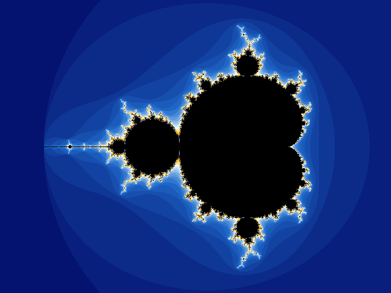
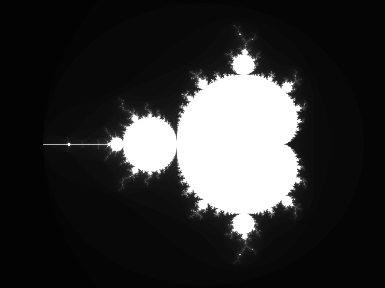
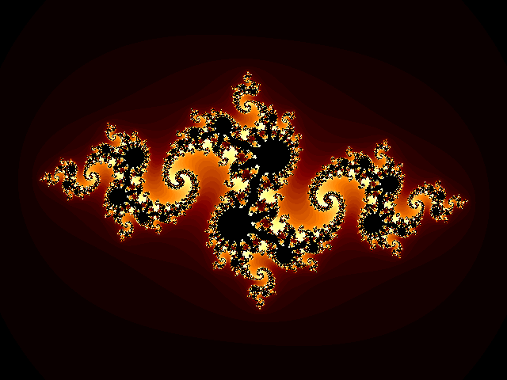
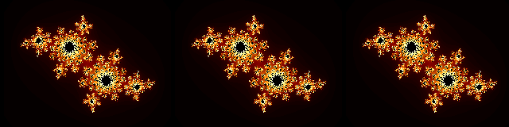
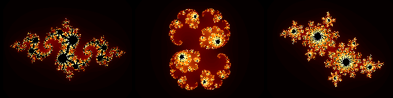
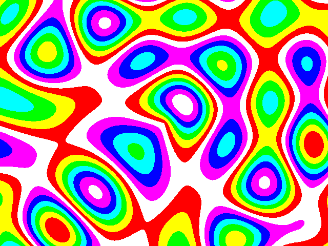
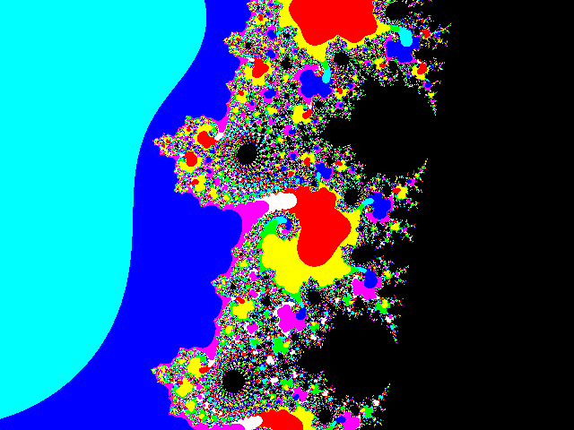

# Project 7 · Fractal Factory

Take a number, square it, and add a constant. Take the answer, square that, and add the constant again. Keep going. For some constants the numbers stay small for ever, and for others they race away towards infinity. Mark on a map which constants do which, and this is the map:



That's the Mandelbrot set. Its edge is infinitely crinkled. Zoom in anywhere on it and there's more, for ever, including small, distorted copies of the whole thing. In the 1980s a picture like that took a home computer all night. Yours will take under a second.

The arithmetic is three lines long, so there's room in this chapter for two big subjects. The first is **numbers**. Python's are better behaved than most languages', but floats have a way of surprising people, and it's time you met the surprises on your own terms. The second is **functions**. You've been using them as subroutines, as you would in any language. In Python a function is a *value*, as a number or a list is. It can be handed to another function, kept in a dictionary, or manufactured to order by yet another function, and whole styles of programming follow from that. This project is built out of nothing else: a picture is a function, a colour scheme is a function, and the program is what you get by plugging them together.

And because pictures take time to make, this is also where you learn to make a program faster. There's a right way to go about that, and it starts with a stopwatch.

| | |
|---|---|
| **You'll learn** | `int`, `float`, `complex`, `Decimal` and `Fraction`, and their traps; functions as values; closures; scope and `nonlocal`; the late-binding trap; `lambda`; `*args` and `**kwargs`; keyword-only parameters; `functools.cache` and `partial` |
| **New tool skill** | Measuring: `timeit` and `cProfile`. Git tags. |
| **Time** | 5 hours |
| **Before you start** | [Project 6](p06-life.md) |

## Predict

!!! question "Predict"
    ```python
    print(0.1 + 0.2 == 0.3)
    print(0.1 + 0.2)
    print(round(2.5), round(3.5), round(2.675, 2))
    ```

??? success "Answer"
    ```text
    False
    0.30000000000000004
    2 4 2.67
    ```

    None of those is a bug in Python. You'd get the same from C, from JavaScript, and from your pocket calculator if it showed you enough digits. Stage 1.

!!! question "Predict"
    ```python
    big = 10**20 + 1
    print(big, float(big) == 10**20)
    z = 3 + 4j
    print(abs(z), z * z, z.conjugate())
    ```

??? success "Answer"
    ```text
    100000000000000000001 True
    5.0 (-7+24j) (3-4j)
    ```

    Python's integers are exact, however big they get. Turn one into a float, and the `+ 1` falls off the end. And complex numbers are built in: `j` is the square root of minus one. Stage 1.

!!! question "Predict"
    ```python
    powers = [lambda x: x**n for n in (1, 2, 3)]
    print([f(2) for f in powers])
    ```

??? success "Answer"
    ```text
    [8, 8, 8]
    ```

    You'd expect `[2, 4, 8]`: three functions, raising to the powers 1, 2 and 3. What you get is three functions that all raise to the power of **3**. It's the most famous trap in this chapter, and in Stage 2 you'll see it spoil a picture.

!!! question "Predict"
    ```python
    def report(first, *rest, sep="-", **options):
        print(first, rest, sep, options)


    report(1)
    report(1, 2, 3, sep="+", bold=True)
    numbers = [4, 5]
    report(*numbers, **{"sep": "/"})
    ```

??? success "Answer"
    ```text
    1 () - {}
    1 (2, 3) + {'bold': True}
    4 (5,) / {}
    ```

    In a `def`, `*rest` collects any extra positional arguments into a tuple, and `**options` collects any extra keyword arguments into a dictionary. In a *call*, the same stars do the opposite, and spread a list or a dictionary out into arguments. Stage 3.

## Build

### Stage 1: Numbers, and a picture in grey

```console
$ cd making
$ uv init fractals
$ cd fractals
$ uv add pillow
$ uv add --dev pytest ruff
$ code .
```

[Pillow](https://pillow.readthedocs.io/) is Python's image library. You'll use a very small corner of it: make an image, set its pixels, save it as a PNG.

#### Integers

Python's `int` has no maximum. It grows to hold whatever you put in it, and its arithmetic is always exact.

```pycon
>>> 2**200
1606938044258990275541962092341162602522202993782792835301376
>>> 1_000_000 * 1_000_000
1000000000000
>>> int("ff", 16), hex(255), bin(10)
(255, '0xff', '0b1010')
```

No overflow, no wrapping round to a negative number, no `long`. Underscores in a number are ignored, and are there to help you count the noughts.

#### Floats

A `float` is a different matter. It's the same 64-bit floating-point number that C calls a `double`, and that JavaScript uses for everything: about sixteen significant digits, stored *in binary*. And in binary, most decimal fractions go on for ever, as a third does in decimal. 0.1 is one of them. What's stored is the nearest value that fits, which is a tiny bit off, and sometimes the tiny bits add up to something you can see.

```pycon
>>> 0.1 + 0.2
0.30000000000000004
>>> 0.1 + 0.2 == 0.3
False
>>> total = 0.0
>>> for _ in range(10):
...     total += 0.1
...
>>> total
0.9999999999999999
```

That isn't a bug, and it isn't anything to do with Python. It comes with the hardware. (Python does what it can: the built-in `sum` quietly corrects for this as it goes, and `sum([0.1] * 10)` is exactly `1.0`. Your own loops get no such help.) The rules for living with it are short:

1. **Don't compare floats with `==`.** Ask whether they're close enough:

    ```pycon
    >>> import math
    >>> math.isclose(0.1 + 0.2, 0.3)
    True
    ```

    In tests, that's `pytest.approx`, from Project 3.

2. **Don't pile up small steps.** Every addition can bring in a little error, and a thousand additions can bring in a thousand of them. To get the 700th step, work out `start + 700 * step`, and don't add `step` on 700 times. This chapter's bug hunt shows what happens if you do.

3. **Use floats for measurements, and never for money.** For money, use whole numbers of pence, or the type that was made for it:

    ```pycon
    >>> from decimal import Decimal
    >>> Decimal("0.10") + Decimal("0.20")
    Decimal('0.30')
    >>> from fractions import Fraction
    >>> Fraction(1, 3) + Fraction(1, 6)
    Fraction(1, 2)
    ```

    `Decimal` does exact decimal arithmetic, to as many places as you ask for, and it's built from a *string*, since `Decimal(0.1)` would faithfully copy the float's error. `Fraction` does exact arithmetic with ratios. Both are slower than floats, and both are right.

`round` is a surprise of its own. `round(2.5)` is 2, and `round(3.5)` is 4: Python rounds an exact half to the nearest *even* number, so that the roundings-up and roundings-down cancel out over a lot of data, where always rounding halves upwards would push a total steadily too high. And `round(2.675, 2)` is 2.67, for the float reason: there's no such float as 2.675, and the nearest one is a whisker below it.

Floats also have three values that aren't ordinary numbers: `float("inf")`, `float("-inf")`, and `float("nan")`, "not a number", which isn't equal to anything, itself included. Test for it with `math.isnan`.

!!! info "Coming from BBC BASIC"
    A variable ending in `%` was a 32-bit integer, and the others were 40-bit floats, accurate to nine digits or so. Python's floats give you sixteen, and its integers never run out. There are no type suffixes. It's the *value* that has a type, as it has been since Project 1.

#### Complex numbers

A complex number has a real part and an imaginary part. If that's unfamiliar, think of it as **a point on a plane**, with an `x` and a `y`, which knows how to do arithmetic. Python has them built in, written with a `j`:

```pycon
>>> z = 3 + 4j
>>> z.real, z.imag
(3.0, 4.0)
>>> abs(z)
5.0
>>> z * z
(-7+24j)
>>> complex(1.5, -2)
(1.5-2j)
```

`abs(z)` is the point's distance from the origin, by Pythagoras: 3, 4, 5. Multiplying two complex numbers multiplies their distances and adds their angles, so squaring a point squares its distance from the origin and doubles its angle. That's the whole of the mathematics this chapter needs.

Now the Mandelbrot set can be said exactly. For each point `c` on the plane, start with `z = 0`, and keep doing `z = z * z + c`. If `z` ever gets further than 2 from the origin, it has *escaped*, and it's never coming back. **The set is the points that never escape.** The colours round the outside show *how long* each point took to get away, and the closer it is to the edge, the longer it hung on.

#### A field is a function

Create `src/fractals/fields.py`:

<!-- listing: projects/07-fractal-factory/stages/stage1_fields.py -->
```python title="src/fractals/fields.py"
"""Fields: the mathematics behind each picture.

A field is a function. You give it a point on the complex plane, and it gives
you a number from 0 to 1. What the number means is up to the field. Nothing in
this module knows about pixels or colours.
"""

import math


def mandelbrot(point: complex, limit: int = 100) -> float:
    """Repeat z = z * z + point, and return how soon z escaped, from 0 to 1.

    Once z is further than 2 from the origin, it's never coming back. A point
    that hasn't escaped after `limit` tries scores exactly 1.0.
    """
    z = 0j
    for count in range(limit):
        if abs(z) > 2.0:
            return count / limit
        z = z * z + point
    return 1.0


def plasma(point: complex) -> float:
    """Four sine waves, added together. No fractal, but very 1980s."""
    x, y = point.real * 4, point.imag * 4
    waves = (
        math.sin(x) + math.sin(y) + math.sin((x + y) / 2) + math.sin(math.hypot(x, y))
    )
    return (waves + 4) / 8
```

"Never escapes" can't be tested in a finite time, so `limit` says when to give up. There are two functions, and they have nothing in common mathematically. What they share is a *shape*: **a point goes in, and a number from 0 to 1 comes out**. That's all the next module needs to know about either of them. Create `src/fractals/render.py`:

<!-- listing: projects/07-fractal-factory/stages/stage1_render.py -->
```python title="src/fractals/render.py"
"""Rendering: the only module that knows about pixels, or about Pillow."""

from collections.abc import Callable

from PIL import Image


def render(
    field: Callable[[complex], float],
    size: tuple[int, int] = (640, 480),
    centre: complex = 0j,
    width: float = 4.0,
) -> Image.Image:
    """Paint a field onto a new image, in shades of grey.

    `centre` is the point in the middle of the picture, and `width` is how
    much of the plane the picture spans, from its left edge to its right.
    """
    columns, rows = size
    scale = width / columns

    image = Image.new("L", size)
    for row in range(rows):
        imaginary = (rows / 2 - row) * scale
        for column in range(columns):
            real = (column - columns / 2) * scale
            value = field(centre + complex(real, imaginary))
            image.putpixel((column, row), round(value * 255))
    return image
```

**`field` is a parameter, and what gets passed to it is a function.** `render` doesn't know which, and doesn't care. It knows the shape, which is what the hint says: `Callable[[complex], float]`, something you can call with a `complex` to get a `float`. For each pixel, it works out which point of the plane that pixel is looking at, calls `field(…)` with it, and turns the answer into a shade of grey. (`"L"` is Pillow's name for an 8-bit greyscale image. `rows / 2 - row` turns the picture the right way up, since pixel rows count downwards, and the imaginary axis goes up.)

Notice that `imaginary` is worked out once for each row, outside the inner loop, and that every coordinate is a *multiplication*, from scratch. Nothing is added up as the loop goes round, which is rule 2.

Finally, a first `src/fractals/cli.py`, and point the command at it in `pyproject.toml`, with `fractal = "fractals.cli:main"`:

<!-- listing: projects/07-fractal-factory/stages/stage1_cli.py -->
```python title="src/fractals/cli.py"
"""Fractal Factory: pictures from formulas."""

from fractals.fields import mandelbrot, plasma
from fractals.render import render


def main() -> None:
    render(mandelbrot, centre=-0.6 + 0j, width=3.6).save("mandelbrot.png")
    render(plasma, width=6.0).save("plasma.png")
    print("Saved mandelbrot.png and plasma.png.")
```

`render(mandelbrot, …)`: no brackets after `mandelbrot`. You're not calling it. You're handing the function itself to `render`, which will call it 307,200 times. You did the same thing in Project 3, when you put functions in a dictionary, and in Project 2's hint about `screen.onkey`.

!!! example "Run it"
    ```console
    $ uv run fractal
    Saved mandelbrot.png and plasma.png.
    ```

    Click on `mandelbrot.png` in VS Code's Explorer to look at it.

    

    White is "never escaped", and black is "escaped at once". Add `*.png` to `.gitignore`. Pictures that you can make again in a second don't belong in Git.

!!! success "Checkpoint"
    ```console
    $ git add .
    $ git commit -m "Render the Mandelbrot set and a plasma, in greys"
    ```

### Stage 2: Functions that make functions

Grey was fine for 1985. A colour scheme ought to be pluggable too, and by now you can guess how: **a palette is a function**. A number from 0 to 1 goes in, and an `(r, g, b)` tuple comes out.

You could write one by hand, with a row of `if`s. But what you'd really like to say is "fade from black, through red and orange, to white", and get a function back that does it. So you need a function that *makes* functions. Create `src/fractals/palettes.py`:

<!-- listing: projects/07-fractal-factory/src/fractals/palettes.py -->
```python title="src/fractals/palettes.py"
"""Palettes: turning a number from 0 to 1 into a colour.

A palette is a function too. It takes a float, and returns (red, green, blue).
"""

from collections.abc import Callable

type Colour = tuple[int, int, int]
type Palette = Callable[[float], Colour]

BLACK = (0, 0, 0)


def gradient(*stops: Colour) -> Palette:
    """Return a palette that fades smoothly through any number of colours."""
    if len(stops) < 2:
        raise ValueError("A gradient needs at least two colours.")

    def palette(value: float) -> Colour:
        position = min(max(value, 0.0), 1.0) * (len(stops) - 1)
        index = min(int(position), len(stops) - 2)
        blend = position - index
        (r1, g1, b1), (r2, g2, b2) = stops[index], stops[index + 1]
        return (
            round(r1 + (r2 - r1) * blend),
            round(g1 + (g2 - g1) * blend),
            round(b1 + (b2 - b1) * blend),
        )

    return palette
```

#### Closures

There's a `def` inside a `def`. When `gradient` is called, it defines a new function, `palette`, and **returns it**. It returns the function itself, and doesn't call it. At the REPL:

```pycon
>>> from fractals.palettes import gradient
>>> grey = gradient((0, 0, 0), (255, 255, 255))
>>> grey(0.5)
(128, 128, 128)
>>> sunset = gradient((20, 0, 40), (250, 100, 40), (255, 220, 120))
>>> sunset(0.5)
(250, 100, 40)
>>> grey(0.5)
(128, 128, 128)
```

Look closely at what's going on, because it's subtle. `palette` uses `stops`, which isn't one of its own variables. It belongs to `gradient`. By the time you call `grey(0.5)`, `gradient` has long since returned, and by rights its local variables ought to be gone. They aren't. **A function remembers the variables of the place where it was defined, for as long as it needs them.** That's called a *closure*: the inner function closes over the outer one's variables. `grey` and `sunset` are two different functions, from two different calls of `gradient`, and each has a `stops` of its own. Neither disturbs the other.

So a closure is a way of making a function with some data built into it. It's the difference between a function that *is given* a colour scheme each time it's called, and a function that *is* a colour scheme.

The `*stops` in the `def` line is why `gradient` can take any number of colours. It collects all the positional arguments into one tuple. Stage 3 has more about it.

#### Functions that change functions

If functions can be made, they can be modified. Add these to `palettes.py`. Each takes a palette, and returns a new palette with a twist:

<!-- listing: projects/07-fractal-factory/src/fractals/palettes.py -->
```python title="src/fractals/palettes.py"
def steps(*colours: Colour) -> Palette:
    """Return a palette of flat bands, with no fading between them."""

    def palette(value: float) -> Colour:
        index = min(int(value * len(colours)), len(colours) - 1)
        return colours[max(index, 0)]

    return palette


def cycled(palette: Palette, times: int) -> Palette:
    """Return a palette that runs through another one several times over."""

    def cycling(value: float) -> Colour:
        return palette(value * times % 1.0)

    return cycling


def black_inside(palette: Palette) -> Palette:
    """Return a palette that paints 1.0, 'never escaped', black."""

    def painting(value: float) -> Colour:
        return BLACK if value >= 1.0 else palette(value)

    return painting


PALETTES: dict[str, Palette] = {
    "fire": gradient(
        BLACK, (128, 0, 0), (255, 128, 0), (255, 255, 128), (255, 255, 255)
    ),
    "ocean": gradient(
        (0, 7, 100), (32, 107, 203), (237, 255, 255), (255, 170, 0), (0, 2, 0)
    ),
    "grey": gradient(BLACK, (255, 255, 255)),
    "beeb": steps(
        (255, 0, 0),
        (255, 255, 0),
        (0, 255, 0),
        (0, 255, 255),
        (0, 0, 255),
        (255, 0, 255),
        (255, 255, 255),
    ),
}
```

`cycled(palette, 3)` is a palette that goes through another palette three times between 0 and 1, and that's what gives fractal pictures their stripes. (`value * 3 % 1.0` keeps the fractional part. `%` works on floats, too.) `black_inside` paints the set itself black, and leaves everything else to the palette it was given. They can be stacked, `black_inside(cycled(PALETTES["ocean"], 3))`, and each layer knows nothing about the others. A function that takes functions, or returns them, is called a *higher-order* function. You've been using them all along, in fact: `sorted`, `max` and `map` are higher-order functions, and `@dataclass` and `@pytest.mark.parametrize` are too, as Project 16 will show.

The fields can be made the same way. A *Julia set* uses the same arithmetic as the Mandelbrot set, turned round: the constant `c` is fixed for the whole picture, and it's the *starting point* that varies from pixel to pixel. Every `c` gives a different picture, so `julia(c)` should *return a field*. And while you're at it, `limit` needn't be passed in with every one of 307,200 calls. It can be built in. Replace `fields.py` from the imports downwards:

<!-- listing: projects/07-fractal-factory/src/fractals/fields.py -->
```python title="src/fractals/fields.py"
import math
from collections.abc import Callable

type Field = Callable[[complex], float]


def escape_time(z: complex, c: complex, limit: int) -> float:
    """Repeat z = z * z + c, and return how soon z escaped, from 0 to 1.

    Once z is further than 2 from the origin, it's never coming back. A point
    that hasn't escaped after `limit` tries scores exactly 1.0.
    """
    for count in range(limit):
        if abs(z) > 2.0:
            return count / limit
        z = z * z + c
    return 1.0


def mandelbrot(limit: int = 100) -> Field:
    """The Mandelbrot set: start from zero, and use the point itself as c."""

    def field(point: complex) -> float:
        return escape_time(0j, point, limit)

    return field


def julia(c: complex, limit: int = 100) -> Field:
    """A Julia set: start from the point, with the same c everywhere."""

    def field(point: complex) -> float:
        return escape_time(point, c, limit)

    return field


def plasma(scale: float = 4.0) -> Field:
    """Four sine waves, added together. No fractal, but very 1980s."""

    def field(point: complex) -> float:
        x, y = point.real * scale, point.imag * scale
        waves = (
            math.sin(x)
            + math.sin(y)
            + math.sin((x + y) / 2)
            + math.sin(math.hypot(x, y))
        )
        return (waves + 4) / 8

    return field
```

Now `mandelbrot(limit=500)` is *a call that returns a field*. `Field` and `Palette` are type aliases, as `Cell` was in Project 6, and they earn their keep here, because `Callable[[complex], float]` is no fun to read twice.

In `render.py`, import `Field` and `Palette`, change `field`'s hint to `Field`, and give `render` a second parameter, `palette: Palette`. Make the image `"RGB"` and not `"L"`, and paint each pixel through the palette:

<!-- listing: projects/07-fractal-factory/stages/stage3_render.py -->
```python title="src/fractals/render.py, in render()"
            image.putpixel((column, row), palette(value))
```

Then try it, in `cli.py`'s `main`:

```python
palette = black_inside(cycled(PALETTES["ocean"], 3))
render(mandelbrot(), palette, centre=-0.6 + 0j, width=3.6).save("mandelbrot.png")
render(julia(-0.8 + 0.156j), palette, width=3.6).save("julia.png")
```

!!! example "Run it"
    `mandelbrot.png` is now the picture at the top of the chapter. And `julia.png`:

    

    Try some other constants. `0.285 + 0.01j` and `-0.4 + 0.6j` are good ones. Every point of the Mandelbrot set has a Julia set of its own, and the most interesting ones come from near its edge.

#### Scope, at last

Project 1 promised you the rest of the story about scope, and now it can be told. When Python meets a name, it looks for it in four places, in this order:

1. **L**ocal: the function it's in.
2. **E**nclosing: any functions that this function was defined inside. *That's where a closure finds its variables.*
3. **G**lobal: the module.
4. **B**uilt-in: `len`, `print`, `range` and the rest.

It's known as *LEGB*. Reading a name searches outwards through all four. **Assigning to a name makes it local**, unless you say otherwise. For a module's variable, that's `global`, which you won't need until Project 8. For an enclosing function's variable, it's `nonlocal`:

```pycon
>>> def make_counter():
...     count = 0
...     def increment():
...         nonlocal count
...         count += 1
...         return count
...     return increment
...
>>> clicks = make_counter()
>>> clicks(), clicks(), clicks()
(1, 2, 3)
>>> other = make_counter()
>>> other()
1
```

`increment` doesn't only read `count`. It re-ties it, and `nonlocal` is what gives it leave to. Each counter has its own `count`, which can't be reached from outside except through the function. That's data with behaviour attached, kept private: in miniature, it's what a class does, and Project 9 starts there.

!!! warning "Gotcha"
    You might not have noticed, but you can *hide* a built-in. `list = [1, 2, 3]` is perfectly legal, and from then on, in that module, `list("abc")` is an error, because the L, E and G of LEGB come before the B. `max`, `min`, `sum`, `id`, `type`, `input`, `dir` and `str` are the usual casualties. Ruff will warn you (rule `A001`).

#### The trap

Here's the third Predict, in a form you might really write. You want three Julia sets, side by side, from a list of constants. A loop seems natural, and `lambda` seems handy. A *lambda* is a function written as an expression, with no name: `lambda point: point * 2` means "a function that takes `point`, and returns `point * 2`".

```python
constants = [-0.8 + 0.156j, 0.285 + 0.01j, -0.4 + 0.6j]
fields = [lambda point: escape_time(point, c, 100) for c in constants]
```

Three fields, and you render all three:



They're all the *last* one. **A closure remembers the variable, and not the value that the variable had at the time.** All three lambdas close over the same variable, `c`. None of them looks at it until it's called, and by then the loop has finished, and `c` is `-0.4 + 0.6j`. It's called *late binding*, and everybody gets caught by it once.

The cure is to give each function a variable of its own, and a factory function does that without your having to think about it, because every *call* of a function gets fresh locals:

```python
fields = [julia(c) for c in constants]
```



Each call of `julia` has a `c` of its own, and each `field` closes over its own. That's the practical reason for preferring a named factory to a lambda in a loop, and Ruff will tell you about the lambda version (rule `B023`).

Lambdas are fine where they're small, and used on the spot. The classic place is a `key` function, which says what to sort by:

```pycon
>>> points = [3 + 4j, 1 + 0j, -2 + 2j]
>>> sorted(points, key=abs)
[(1+0j), (-2+2j), (3+4j)]
>>> max(points, key=lambda z: z.imag)
(3+4j)
```

`key=abs` hands over a function you already have, and the `lambda` makes a little one to order. If a lambda needs a name, or a second line, it wants to be a `def`.

!!! success "Checkpoint"
    ```console
    $ git add .
    $ git commit -m "Make fields and palettes with closures"
    ```

### Stage 3: Arguments, in depth

`render` now has five parameters, and a call like `render(field, palette, (800, 600), -0.75 + 0.1j, 0.05)` is a riddle, of the sort Project 2 warned you about. You can do better than merely hoping that callers will use keywords. You can insist.

<!-- listing: projects/07-fractal-factory/stages/stage3_render.py -->
```python title="src/fractals/render.py"
def render(
    field: Field,
    palette: Palette,
    *,
    size: tuple[int, int] = (640, 480),
    centre: complex = 0j,
    width: float = 4.0,
) -> Image.Image:
```

A bare `*` in the parameter list means: **everything after this must be passed by name.** `render(field, palette, (800, 600))` is now a `TypeError`. The two things that every call has to have are positional, and the options are keyword-only. That's a good pattern for any function with options. It also leaves you free to add options later, or to reorder them, without breaking anybody's calls.

Here's the whole family of stars, which is the fourth Predict:

| In a `def` | Means |
|---|---|
| `*stops` | collect any extra positional arguments, into a tuple |
| `**options` | collect any extra keyword arguments, into a dictionary |
| a bare `*` | everything after this is keyword-only |
| a bare `/` | everything before this is positional-only |

| In a call | Means |
|---|---|
| `f(*things)` | spread a list, or a tuple, or anything you can loop over, out into positional arguments |
| `f(**settings)` | spread a dictionary out into keyword arguments |

You've met most of them already. `gradient(*stops)` collects. `to_pixel(*cursor)` will spread, in Project 8. `State(**json.load(file))`, in Project 5, spread a dictionary into a dataclass, and that was the promise to explain it. The names `args` and `kwargs`, which you'll see everywhere, are only a convention. It's the stars that matter.

The two come together in a function that wraps another, of *any* signature, which is something you couldn't write at all without them:

```pycon
>>> import time
>>> def timed(function):
...     def wrapper(*args, **kwargs):
...         started = time.perf_counter()
...         result = function(*args, **kwargs)
...         print(f"{function.__name__} took {time.perf_counter() - started:.3f} seconds")
...         return result
...     return wrapper
...
>>> slow_sum = timed(sum)
>>> slow_sum(range(1_000_000))  # doctest: +ELLIPSIS
sum took ... seconds
499999500000
```

`wrapper` accepts whatever it's given, and passes it all straight on. `timed` is a closure factory, exactly like `cycled`, and `timed(render)` is a `render` that reports how long it took. Hold on to that pattern. It's what a *decorator* is, and in Project 16, `@timed` will turn out to be nothing more than a neater way of writing `render = timed(render)`.

There's one more tool of this kind that's worth knowing now. `functools.partial` fills in some of a function's arguments in advance, and gives you back a function that wants the rest:

```pycon
>>> from functools import partial
>>> from fractals.fields import escape_time
>>> from_zero = partial(escape_time, 0j, limit=50)
>>> from_zero(1 + 1j)
0.04
```

It's the answer to a problem from Project 2, where `screen.onkey` wanted a function that took no arguments, and yours needed a `pen`. `screen.onkey(partial(new_tree, pen), "space")` would have done it, with no module-level variable required.

#### The command line

Now the factory gets its front door. Replace `src/fractals/cli.py`:

<!-- listing: projects/07-fractal-factory/src/fractals/cli.py -->
```python title="src/fractals/cli.py"
"""The command line: fractal mandelbrot --palette fire -o picture.png"""

import argparse
import time
from pathlib import Path

from fractals.fields import julia, mandelbrot, plasma
from fractals.palettes import PALETTES, black_inside, cycled
from fractals.render import render


def parse_size(text: str) -> tuple[int, int]:
    """Turn "640x480" into (640, 480)."""
    try:
        columns, rows = text.lower().split("x")
        return int(columns), int(rows)
    except ValueError:
        raise argparse.ArgumentTypeError(
            f"{text!r} isn't a size such as 640x480"
        ) from None
```

`argparse`'s `type=` can be given *any function* that takes a string and returns a value: `int`, `float`, `Path`, and `complex`, which means that `--c=-0.8+0.156j` works with no effort from you. `parse_size` is a converter of your own. Look at its `try`. Splitting into the wrong number of pieces makes the unpacking raise `ValueError`, and so does `int("big")`, and for both, the right answer is the same polite message. It's one of the occasions on which a `try` of two lines is justified.

<!-- listing: projects/07-fractal-factory/src/fractals/cli.py -->
```python title="src/fractals/cli.py"
def parse_arguments(argv: list[str] | None = None) -> argparse.Namespace:
    parser = argparse.ArgumentParser(
        prog="fractal", description="Pictures from formulas."
    )
    parser.add_argument("field", choices=["mandelbrot", "julia", "plasma"])
    parser.add_argument(
        "-o", "--output", type=Path, help="where to save (default: FIELD.png)"
    )
    parser.add_argument(
        "--size", type=parse_size, default=(640, 480), help="such as 800x600"
    )
    parser.add_argument(
        "--centre", type=complex, help="the middle of the picture, such as -0.75+0.1j"
    )
    parser.add_argument(
        "--width", type=float, help="how much of the plane to show, left to right"
    )
    parser.add_argument(
        "--limit", type=int, default=100, help="how long to wait for a point to escape"
    )
    parser.add_argument(
        "--c", type=complex, default=-0.8 + 0.156j, help="the constant of a Julia set"
    )
    parser.add_argument("--palette", choices=list(PALETTES), default="fire")
    parser.add_argument(
        "--cycles", type=int, default=1, help="run through the palette this many times"
    )
    return parser.parse_args(argv)


def main(argv: list[str] | None = None) -> None:
    args = parse_arguments(argv)

    if args.field == "mandelbrot":
        field, centre, width = mandelbrot(args.limit), -0.6 + 0j, 3.6
    elif args.field == "julia":
        field, centre, width = julia(args.c, args.limit), 0j, 3.6
    else:
        field, centre, width = plasma(), 0j, 6.0

    palette = cycled(PALETTES[args.palette], args.cycles)
    if args.field != "plasma":
        palette = black_inside(palette)

    started = time.perf_counter()
    image = render(
        field,
        palette,
        size=args.size,
        centre=centre if args.centre is None else args.centre,
        width=width if args.width is None else args.width,
    )
    output = args.output or Path(f"{args.field}.png")
    image.save(output)
    print(f"Saved {output} in {time.perf_counter() - started:.1f} seconds.")
```

`main` is the only place in the program that knows all the pieces, and its job is to plug them together: choose a field, build a palette out of layers, and hand both to `render`. `time.perf_counter()` is the right clock for timing code.

Give the package a front door, in `src/fractals/__init__.py`, as you did in Project 6, re-exporting `Field`, `Palette`, `Colour`, `PALETTES`, `escape_time`, `mandelbrot`, `julia`, `plasma`, `gradient`, `steps`, `cycled`, `black_inside` and `render`, with an `__all__` to match.

!!! example "Run it"
    ```console
    $ uv run fractal mandelbrot --palette ocean --cycles 3
    $ uv run fractal plasma --palette beeb --cycles 2
    $ uv run fractal mandelbrot --centre=-0.745+0.113j --width 0.02 --limit 300 --palette beeb --cycles 6
    ```

    

    That's the plasma, in the BBC Micro's seven colours, and a fine thing it would have been in 1984. The last of those commands zooms in, by a factor of nearly two hundred, on a place called Seahorse Valley:

    

    Deep zooms need a higher `--limit`, since points near the edge take longer to make their minds up. And the `=` in `--centre=-0.745+0.113j` matters. Without it, `argparse` sees something that starts with a dash, and takes it for an option.

Write the tests. With everything a function, they're short. Known points are inside the set, or outside it. The set is symmetrical about the real axis. A gradient starts and ends where it's told to. And this one, which checks that the closures are truly independent of one another:

<!-- listing: projects/07-fractal-factory/tests/test_fields.py -->
```python title="tests/test_fields.py"
def test_each_julia_set_remembers_its_own_constant():
    calm = julia(0j)
    wild = julia(1 + 0j)
    assert calm(0.5 + 0j) == 1.0
    assert wild(0.5 + 0j) < 1.0
    assert calm(0.5 + 0j) == 1.0
```

A function parameter also makes a fine place for a test to look in from. This checks that `render` gives every pixel the right point, without doing any mathematics, by passing it a "field" that merely makes a note of what it was asked:

<!-- listing: projects/07-fractal-factory/tests/test_render.py -->
```python title="tests/test_render.py"
def test_render_passes_each_pixel_its_own_point():
    seen = []

    def spy(point: complex) -> float:
        seen.append(point)
        return 0.0

    render(spy, GREY, size=(4, 2), centre=10 + 10j, width=4.0)
    assert len(seen) == 8
    assert seen[0] == 8 + 11j
    assert seen[-1] == 11 + 10j
```

`spy` is a closure over `seen`. (It doesn't need `nonlocal`, because it changes the list and doesn't re-tie the name. That distinction, from Project 4, comes up again in Project 8.) The project in the tutorial's repository has thirty-one tests.

!!! success "Checkpoint"
    ```console
    $ git add .
    $ git commit -m "Add keyword-only options and a command line"
    ```

### Stage 4: Make it faster. Measure first.

The default picture takes about half a second on a modern laptop, and a deep zoom at a large size can take a minute. You'd like it faster. There's a right way to go about this, and a wrong way, and the wrong way is the one that feels like progress.

#### The wrong way

Every programmer who has written a Mandelbrot renderer knows a trick. `abs(z) > 2.0` has to take a square root, and square roots are slow. So compare the *squares*, and the root is never needed:

<!-- listing: projects/07-fractal-factory/stages/stage4_squares_fields.py -->
```python title="src/fractals/fields.py, in escape_time()"
        if z.real * z.real + z.imag * z.imag > 4.0:
```

It's in every book on the subject. It was true in BASIC and in assembler, and it's true in C. Make the change, check that the tests still pass, and admire it for a moment. Then, **before you commit it, measure it.** The standard library's `timeit` module runs a snippet a few million times, and reports the best:

```console
$ uv run python -m timeit -s "z = 0.3 + 0.4j" "abs(z) > 2.0"
20000000 loops, best of 5: 14.2 nsec per loop
$ uv run python -m timeit -s "z = 0.3 + 0.4j" "z.real * z.real + z.imag * z.imag > 4.0"
5000000 loops, best of 5: 56 nsec per loop
```

The "optimisation" is **four times slower**. The picture that took 0.5 seconds now takes 0.8.

The reason is that Python isn't C. `abs(z)` is one call into a routine written in C, where a square root costs next to nothing. The clever version is four attribute look-ups, two multiplications, an addition and a comparison, and *each of those* is a step for the Python interpreter, costing more than the square root ever did. In Python, what costs you is **the number of things the interpreter has to do**, and not how hard the arithmetic is. A rule of thumb follows from that: one call to something built in usually beats several lines of your own.

Undo it, with `git restore src/fractals/fields.py`. The original was clearer as well.

The general lesson is older than Python, and it will never stop being true: **your intuition about what's slow is unreliable. Measure.** It's Donald Knuth's famous remark that premature optimisation is the root of all evil, and it means: get it right first, and clear, and tested. Then, *if* it's too slow, find out where the time is going, and fix that and nothing else.

#### The right way

To find out where the time goes, you need a *profiler*, which watches your program run and adds up the time spent in each function. The standard library's is `cProfile`:

```console
$ uv run python -c "import cProfile; from fractals.cli import main; cProfile.run('main([\"mandelbrot\"])', sort='tottime')"
```

```text
         13455511 function calls (13455031 primitive calls) in 1.902 seconds

   Ordered by: internal time

   ncalls  tottime  percall  cumtime  percall filename:lineno(function)
   307200    0.499    0.000    0.769    0.000 fields.py:14(escape_time)
  6251230    0.270    0.000    0.270    0.000 {built-in method builtins.abs}
   258228    0.210    0.000    0.332    0.000 palettes.py:19(palette)
        1    0.139    0.139    1.890    1.890 render.py:9(render)
   307200    0.126    0.000    0.518    0.000 Image.py:2175(putpixel)
   307202    0.090    0.000    0.193    0.000 Image.py:968(load)
   614403    0.074    0.000    0.108    0.000 Image.py:643(im)
   307200    0.068    0.000    0.283    0.000 Image.py:725(_ensure_mutable)
   258228    0.047    0.000    0.379    0.000 palettes.py:46(cycling)
```

(The whole run takes nearly four times as long as usual, because the profiler is watching every call. The *proportions* are what you're after.) `ncalls` is how many times each function was called. `tottime` is the time spent in that function itself, and `cumtime` includes everything that it called. Read it for surprises:

- `escape_time` and `abs` come top, and so they should. That's the mathematics, which is the work that has to be done, and you've just learned not to fiddle with it.
- **`putpixel`, and the three functions underneath it, add up to half a second**: more than a quarter of the run, spent putting pixels into an image one at a time, with Pillow checking on each occasion that the image can be written to. That's a surprise.
- **`palette` was called 258,228 times, to answer about a hundred different questions.** A field's values are `count / limit`, and with a limit of 100 there are only 101 of them. The same gradient arithmetic is being done two and a half thousand times over for each.

Here are two real targets, which you would never have guessed at. Both have standard cures.

For the palette: `functools.cache` wraps a function so that it *remembers its answers*. The first time it's called with a given argument, it works the answer out, and keeps it in a dictionary. After that, it looks it up. It's a higher-order function, of the same kind as `timed`, and the technique is called *memoisation*. It's safe for a function whose answer depends only on its arguments, which a palette's does, and it needs those arguments to be hashable, for the dictionary's sake, as Project 4 explained.

For the pixels: build a plain list of all the colours, and hand it to Pillow in a single call, `putdata`.

<!-- listing: projects/07-fractal-factory/src/fractals/render.py -->
```python title="src/fractals/render.py"
"""Rendering: the only module that knows about pixels, or about Pillow."""

from functools import cache

from PIL import Image

from fractals.fields import Field
from fractals.palettes import Palette


def render(
    field: Field,
    palette: Palette,
    *,
    size: tuple[int, int] = (640, 480),
    centre: complex = 0j,
    width: float = 4.0,
) -> Image.Image:
    """Paint a field, through a palette, onto a new image.

    `centre` is the point in the middle of the picture, and `width` is how
    much of the plane the picture spans, from its left edge to its right.
    """
    columns, rows = size
    scale = width / columns
    colour_of = cache(palette)

    colours = []
    for row in range(rows):
        imaginary = (rows / 2 - row) * scale
        for column in range(columns):
            real = (column - columns / 2) * scale
            value = field(centre + complex(real, imaginary))
            colours.append(colour_of(value))

    image = Image.new("RGB", size)
    image.putdata(colours)
    return image
```

Measure again, one change at a time. These are the figures from the machine this chapter was written on. Yours will differ, but the proportions shouldn't:

| Version | Seconds | |
|---|---|---|
| As it was | 0.45 | |
| With the "clever" escape test | 0.74 | 64% slower |
| `cache(palette)` | 0.38 | 16% faster |
| `putdata` in place of `putpixel` | 0.36 | 20% faster |
| Both | 0.29 | **36% faster** |

Your tests are what make this safe. After each change, `uv run pytest` tells you that the picture is still the same picture, which is the only thing that makes a faster program worth having.

More than a third off, for six lines, none of them clever, and all of them found by looking. That's the method: **measure, find the surprise, fix the surprise, measure again.** And know when to stop. The remaining time is the mathematics itself, and to make a real difference to that you need a better *algorithm*, which is one of the challenges, or a different *tool*, which is another.

#### Tags

The program is finished, tested and fast, which makes this a version worth remembering. A *tag* is a permanent, readable name for a commit:

```console
$ git add .
$ git commit -m "Cache the palette, and write pixels in one go"
$ git tag -a v1.0 -m "Fractal Factory 1.0"
$ git tag
v1.0
$ git push --tags
```

A branch is a label that moves along as you commit, and a tag is one that stays where you put it. `-a` makes an *annotated* tag, which has a message, an author and a date of its own. From now on, `git diff v1.0` shows everything that has changed since that version, `git switch --detach v1.0` lets you look round the project as it was, and `git switch main` brings you back. Tags aren't sent by an ordinary `git push`, which is why there's a `--tags`. On GitHub they turn up under **Releases**, and in Project 27 they'll be how you publish versions of a package.

!!! success "Checkpoint"
    `git log --oneline` shows `(tag: v1.0)` beside your latest commit. That's Part 1 done.

## Type-in listing

For a computer with no graphics at all. Save it as `mandel.py`, and run it in a terminal at least 80 columns wide.

<!-- listing: projects/07-fractal-factory/mandel.py -->
```python title="mandel.py" linenums="1"
SHADES = " .:-=+*#%@"

for row in range(-12, 13):
    line = ""
    for column in range(-39, 40):
        c = complex(column / 26 - 0.5, row / 10)
        z = 0j
        count = 0
        while abs(z) <= 2 and count < 27:
            z = z * z + c
            count += 1
        line += SHADES[count // 3]
    print(line)
```

1. Why is `column` divided by 26, and `row` by 10? What would the picture look like if they were divided by the same number?
2. There are ten characters in `SHADES`, and `count` stops at 27. Why does `SHADES[count // 3]` never go off the end?
3. The middle line of the picture is unlike all the others. Why? (What's special about the points on the real axis between −2 and ¼?)
4. Project 4 told you not to build strings with `+=` in a loop. Rewrite lines 4 to 12 as one `"".join(…)` over a generator expression, with the inner loop moved out into a function. Is it better?

## Bug hunt

A colleague wants a ruler along the bottom of each picture, with a tick at every tenth of a unit. They needed a `range()` that took floats, couldn't find one, and wrote their own. It's `ruler.py`, in the project's `bughunt/` folder. Copy it into a `bughunt` folder of your own.

```console
$ uv run bughunt/ruler.py
A ruler from 0 to 0.5: fine.
Traceback (most recent call last):
  ...
    image.putpixel((column, row), (255, 255, 255))
IndexError: image index out of range
```

"It works for half a unit and crashes for a whole one. It has to be a bug in Pillow."

1. **Reproduce it**, and then look at what `frange` actually produces: `list(frange(0, 1, 0.1))`, at the REPL. How many values did you expect, and how many are there?
2. **Write a failing test** for `frange`, in `bughunt/test_ruler.py`. Make it a parametrised one, with several stops and steps.
3. **Fix it**, in such a way that it can't happen for any start, stop or step.

??? tip "Hint"
    It's rule 2, from Stage 1. What is `0.1` added to itself ten times?

??? success "Solution"
    `frange` adds `step` to a running total, and every addition of `0.1` brings in a tiny error. After ten of them the total is `0.9999999999999999`. That's still less than `1.0`, and so an *eleventh* value is yielded, where there ought to be ten. `tick_columns` rounds it to column 640, in an image whose columns are numbered 0 to 639.

    It works from 0 to 0.5 by luck, and nothing else: five additions of `0.1` happen to land exactly on `0.5`. A bug that shows up for some values and not for others, with no pattern that you can see, is what floating-point trouble looks like.

    **Never add floats up to find out where you are. Count in whole numbers, and multiply.**

    ```python
    def frange(start: float, stop: float, step: float) -> Iterator[float]:
        count = math.ceil(round((stop - start) / step, 9))
        for index in range(count):
            yield start + index * step
    ```

    Deciding how many values there are is done once, in integers. After that each value is worked out from scratch, so that its error is one multiplication's worth, and can't pile up. (The `round(…, 9)` is there because the division is a float as well: `1.0 / 0.1` comes out right, but `0.3 / 0.1` is `2.9999999999999996`.) `render` does the same: it multiplies by `scale` for every pixel, and never adds `scale` on. That's the reason there's no stray column at the right-hand edge of your fractals.

## Challenges

**Tweak**

1. Find some pictures of your own. Near the edge of the set, anywhere at all, zoom in with `--centre` and `--width`, and turn `--limit` up as you go. `-0.1011+0.9563j` and `-1.25066+0.02012j` are good places to start.
2. Add a palette of your own to `PALETTES`. It's one line. Then another, using `steps`.
3. What does `cycled(palette, 0)` do? And `gradient()` with a single colour? One of them is handled gracefully, and the other isn't. Decide what ought to happen, write the test, and make it so.

**Extend**

1. **Multibrots.** Replace `z * z` with `z ** 3`, or `z ** 4`, and the set grows more lobes. Write `multibrot(power, limit)`, and render powers 2 to 5 *in a loop*, without falling into the trap from Stage 2.
2. **Don't work out what you know already.** Most of the running time goes on the points *inside* the set, which by definition use up the whole `limit`. But the two biggest parts of the set, the heart-shaped *cardioid* and the circular bulb to its left, have exact formulas, which you can look up. Write `quick_mandelbrot`, which checks them first, and measure the difference at `--limit 500`. It's an improvement to the *algorithm*, and it's worth more than everything in Stage 4 put together.
3. **Anti-aliasing.** The edges are jagged, because each pixel takes its colour from a single point. Work out four points within each pixel, and average the colours. It costs four times as long. Is it worth it?

??? tip "Hint for multibrots"
    `[multibrot(power) for power in range(2, 6)]` is safe, because each call of the factory has a `power` of its own. `[lambda point: … power … for power in range(2, 6)]` isn't. Write a test that tells the two apart.

**Invent**

1. **NumPy.** The great tool for numerical Python is [NumPy](https://numpy.org/), which does arithmetic on whole arrays at once, in C. A Mandelbrot renderer written with it has no loop over pixels at all: `z` and `c` are arrays the size of the picture, and `z = z * z + c` updates every pixel in one line. Expect it to be twenty to fifty times faster. It makes a good single-file script with inline dependencies, in the manner of Project 0.
2. **Newton fractals.** Newton's method finds the roots of an equation by making a guess and improving it. For `z³ = 1` there are three roots. Colour each point of the plane according to *which root* it ends up at, and the boundaries between the three regions turn out to be a fractal.
3. **A zoom film.** Render a hundred frames, each 5% narrower than the one before, into a folder, and have Pillow join them into an animated GIF: `first.save("zoom.gif", save_all=True, append_images=rest, duration=50)`. Watch what `frange`'s mistake would have done to it.

Solutions to the Tweaks and the first two Extends are in the project's `solutions/` folder.

## Recap

You can now:

- [x] say why `0.1 + 0.2 != 0.3`, and recite the three rules for living with floats
- [x] choose between `int`, `float`, `Decimal` and `Fraction`, and explain what `round(2.5)` does
- [x] use complex numbers as points on a plane
- [x] pass functions to functions, and describe a function's shape with `Callable`
- [x] write a function that returns a function, and explain what a closure remembers
- [x] recite LEGB, and use `nonlocal`
- [x] recognise the late-binding trap, and avoid it with a factory
- [x] use `lambda` where it's small and on the spot, and `def` everywhere else
- [x] collect arguments with `*args` and `**kwargs`, spread them with `*` and `**`, and insist on keywords with a bare `*`
- [x] wrap one function in another that passes everything through
- [x] use `functools.cache` and `functools.partial`
- [x] time a snippet with `timeit`, profile a program with `cProfile`, and read the report
- [x] optimise by measuring, and leave alone whatever the measurements don't point at
- [x] mark a version with a Git tag

**Read more:** [Floating-point arithmetic: issues and limitations](https://docs.python.org/3/tutorial/floatingpoint.html) · [`decimal`](https://docs.python.org/3/library/decimal.html) · [More on defining functions](https://docs.python.org/3/tutorial/controlflow.html#more-on-defining-functions) · [Why do lambdas defined in a loop all return the same result?](https://docs.python.org/3/faq/programming.html#why-do-lambdas-defined-in-a-loop-with-different-values-all-return-the-same-result) · [`functools`](https://docs.python.org/3/library/functools.html) · [The Python profilers](https://docs.python.org/3/library/profile.html) · [Pro Git: tagging](https://git-scm.com/book/en/v2/Git-Basics-Tagging)

## The end of Part 1

Seven projects ago you wrote a guessing game. Since then you've met nearly all of the core of the language: names and objects, the built-in types and what each of them is for, comprehensions, functions in all their variety, modules and packages, exceptions, files, generators and closures. And you've been working the way professionals do: every project in Git, tested, linted, type-checked, and now measured.

What you haven't done is write a class with methods of its own. That's deliberate. A good deal of what other languages need classes for, Python does with functions, dataclasses, dictionaries and modules, and it's as well to know that before you pick up the bigger tool. But some problems really do want it, and in Part 2 you'll run into one almost at once.

Part 2 is where things start to move. [Project 8](../part-2-pygame/p08-mode2-sketchpad.md) opens a window, draws in it fifty times a second, and gives Python the graphics commands of a BBC Micro.
