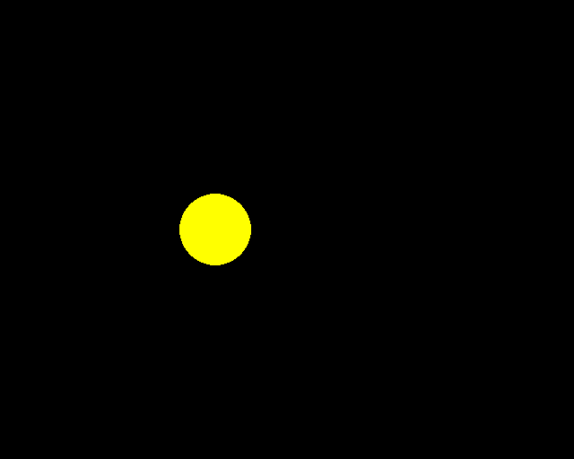
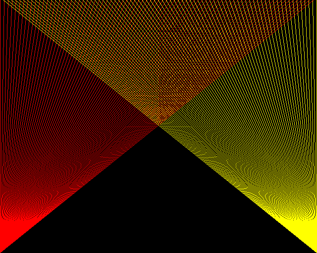
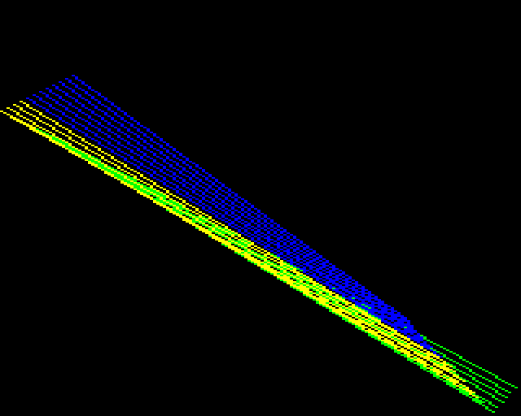
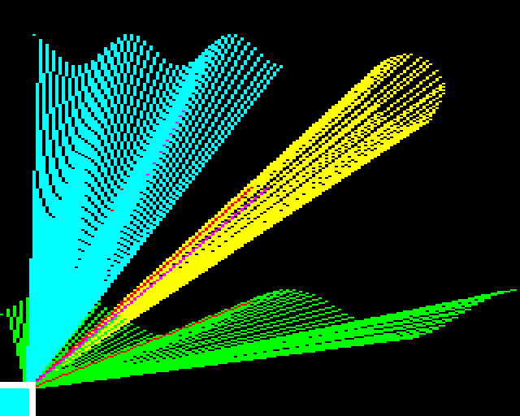
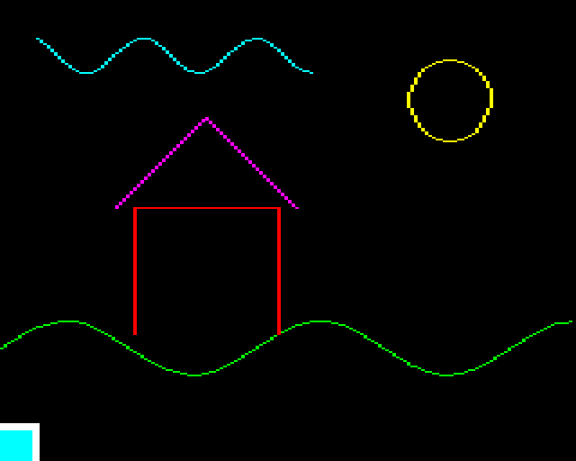
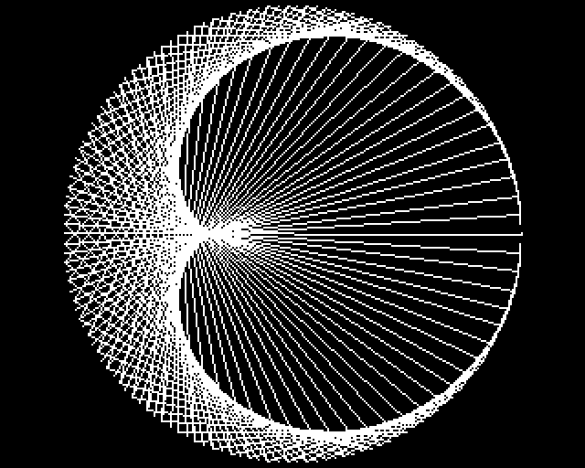

# Project 8 · Mode 2 Sketchpad

Here is a complete BBC BASIC program, and the Python you'll be able to write by the end of this chapter.

=== "BBC BASIC, 1982"

    ```bbcbasic
    10 MODE 1
    20 FOR X% = 0 TO 1279 STEP 16
    30   GCOL 0,1 : MOVE 0,0 : DRAW X%,1023
    40   GCOL 0,2 : MOVE 1279,0 : DRAW 1279-X%,1023
    50 NEXT
    ```

=== "Python, today"

    ```python
    import beeb

    beeb.mode(1)
    for x in range(0, 1280, 16):
        beeb.gcol(0, 1)
        beeb.move(0, 0)
        beeb.draw(x, 1023)
        beeb.gcol(0, 2)
        beeb.move(1279, 0)
        beeb.draw(1279 - x, 1023)
        beeb.vsync()
    ```

{ .pixels }

There is no `beeb` library to download. You're going to write it: a module that gives Python the BBC Micro's graphics commands, with its chunky pixels, its eight bold colours, and its screen 1280 units wide by 1024 high whatever mode you're in. Underneath it sits Pygame, which every game in Part 2 is built on. You'll start with Pygame on its own, so that you know what your module is doing for you.

You'll also get into difficulties. The module keeps track of the graphics cursor, the current colour and the screen itself in module-level variables. That's the obvious design, and it's the one the BBC's own operating system used. By the end of the chapter it will have bitten you, in a way you'll be able to see on the screen. That's deliberate. Project 9 brings the cure, and you'll think more of the cure for having had the disease.

| | |
|---|---|
| **You'll learn** | Pygame's game loop, events and surfaces; palettes; building a module with state; `global`, and when you don't need it; `divmod` and `match` in earnest; testing graphics code without a screen; what shared state costs |
| **New tool skill** | Debugging a running game: `launch.json`, conditional breakpoints, logpoints |
| **Time** | 4 to 5 hours |
| **Before you start** | Projects 1 to 7. You'll lean on packages (Project 6), `match` (5), and `*` unpacking (7) |

## Predict

Three snippets, all to do with what's coming. Commit to an answer first.

!!! question "Predict"
    ```python
    count = 0


    def bump():
        count += 1


    bump()
    print(count)
    ```

??? success "Answer"
    ```text
    Traceback (most recent call last):
      ...
    UnboundLocalError: cannot access local variable 'count' where it is not associated with a value
    ```

    Not `1`, and not `0` either. Assigning to a name anywhere in a function makes that name local for the *whole* function. So `count += 1` tries to read a local `count` that hasn't been given a value yet. Stage 3 explains, and introduces the `global` statement.

!!! question "Predict"
    ```python
    keys = []


    def press(key):
        keys.append(key)


    press("a")
    press("b")
    print(keys)
    ```

??? success "Answer"
    ```text
    ['a', 'b']
    ```

    This one works, with no `global` in sight. `keys.append(…)` doesn't assign to the name `keys`. It changes the object that `keys` is tied to. Labels and suitcases again, from Project 1: the first snippet re-ties a label, and this one repacks a suitcase.

!!! question "Predict"
    ```python
    shape, how = divmod(85, 8)
    print(shape, how)

    previous, cursor = (0, 0), (5, 5)
    previous, cursor = cursor, (9, 9)
    print(previous, cursor)
    ```

??? success "Answer"
    ```text
    10 5
    (5, 5) (9, 9)
    ```

    `divmod(a, b)` gives you `a // b` and `a % b` together, as a tuple. And in a tuple assignment the whole right-hand side is worked out *before* any name on the left is re-tied, so `previous` gets the old `cursor`. Both turn up in Stage 4. The second is also the cure for this chapter's bug hunt.

## Build

### Stage 1: A window and a loop

This project is a package that other projects will use, so it gets the full layout you met in Project 5. Leave off `--no-package`:

```console
$ cd making
$ uv init beeb
Initialized project `beeb` at `/Users/you/making/beeb`
$ cd beeb
$ uv add pygame-ce
$ uv add --dev pytest ruff
$ code .
```

!!! warning "Gotcha"
    The package is `pygame-ce`, and yet you'll write `import pygame`. Pygame CE, the *community edition*, is a fork made by most of the original Pygame developers. It's the one with regular releases, and the one that supports current versions of Python. The original `pygame` package on PyPI hasn't had a release since 2024.

    They both install under the name `pygame`, so **never have both in one project**. If some old tutorial tells you to `uv add pygame`, don't. To find out which one you have, `print(pygame.IS_CE)`. With the original, that's an `AttributeError`.

Before you build anything on Pygame, meet it on its own. Make an `examples` folder beside `src`, and in it a file called `window.py`:

<!-- listing: projects/08-mode2-sketchpad/examples/window.py -->
```python title="examples/window.py"
import pygame

pygame.init()
window = pygame.display.set_mode((640, 512))
pygame.display.set_caption("Hello, Pygame")
clock = pygame.time.Clock()

x = 0
running = True
while running:
    for event in pygame.event.get():
        if event.type == pygame.QUIT:
            running = False

    x = (x + 4) % 640

    window.fill("black")
    pygame.draw.circle(window, "yellow", (x, 256), 40)
    pygame.display.flip()

    clock.tick(50)

pygame.quit()
```

!!! example "Run it"
    ```console
    $ uv run examples/window.py
    ```

    A window opens, and a yellow disc glides across it, again and again, until you close the window.

    

That `while` loop is the *game loop*, and every Pygame program ever written has one. Each trip round it is one *frame*, and in each frame it does three things.

1. **Handle events.** Key presses, mouse movements and the click on the window's close button all queue up as *events*. `pygame.event.get()` hands over everything that's arrived since you last asked, and empties the queue. This program cares about only one kind, `QUIT`.
2. **Update.** Move the world on by one frame. Here, that's `x`. (There's the clock-face `%` from Project 1, wrapping the disc round to the left-hand edge.)
3. **Draw.** Wipe the window, draw everything where it now is, and then `flip()`.

The `flip()` matters. All your drawing goes onto a hidden copy of the window, and `flip()` puts the finished frame on show in one go, so that nobody ever sees a half-drawn picture.

`window` is a `Surface`, which is Pygame's word for a rectangle of pixels you can draw on. The one that `set_mode` gives you happens to be on the screen. You can make others that aren't, and in Stage 3 you will.

Lastly, `clock.tick(50)` waits for just long enough to keep the loop to 50 frames a second. Take it out and the loop runs as fast as your computer can manage, which means the disc becomes a blur and a processor core is pinned at 100% to no purpose. Why 50? Because British televisions refreshed 50 times a second, and so a BBC Micro did too.

Try two experiments now. Take out the `window.fill("black")` line, and see what the disc leaves behind it. Then take out `clock.tick(50)`. Put them both back afterwards.

!!! info "Coming from BBC BASIC"
    `MODE 2 : MOVE 0,0 : DRAW 1279,1023` had no loop, no events, and no flip. How did it get away with that? It didn't: the *operating system* was doing all of it for you, on interrupts, fifty times a second, behind BASIC's back. On a modern computer your program is one window among many, and it has to answer the system's messages itself. If it doesn't, the system concludes that it has hung, and offers to get rid of it. In Stage 3 you'll tuck all that away inside one function, as the Beeb did.

!!! success "Checkpoint"
    ```console
    $ git add .
    $ git commit -m "Open a Pygame window and animate a disc"
    ```

### Stage 2: Drawing

`pygame.draw` has a function for each of the usual shapes: `line`, `rect`, `circle`, `ellipse`, `polygon`, `arc`. Each takes the surface to draw on, a colour, and then whatever describes the shape. A colour can be a name, as above, or an RGB tuple such as `(255, 255, 0)`.

Here's the fan of lines from the top of the chapter, in plain Pygame. Save it as `examples/moire_raw.py`:

<!-- listing: projects/08-mode2-sketchpad/examples/moire_raw.py -->
```python title="examples/moire_raw.py"
import pygame

pygame.init()
window = pygame.display.set_mode((640, 512))
pygame.display.set_caption("Moiré")
clock = pygame.time.Clock()

window.fill("black")
for x in range(0, 640, 8):
    pygame.draw.line(window, "red", (0, 511), (x, 0))
    pygame.draw.line(window, "yellow", (639, 511), (639 - x, 0))

running = True
while running:
    for event in pygame.event.get():
        if event.type == pygame.QUIT:
            running = False
    pygame.display.flip()
    clock.tick(50)

pygame.quit()
```

!!! example "Run it"
    ```console
    $ uv run examples/moire_raw.py
    ```

    

    The shimmering patterns where the two fans cross are *moiré* patterns. They're what you get for drawing lines closer together than the pixels can honestly show. Computer magazines in the 1980s were very fond of them.

The picture never changes, and yet the loop is still there. It has to be: something must go on answering events and showing the window. Eight lines of this program are ceremony, and four are the picture.

There's another niggle. Look at the coordinates. `(0, 511)` is the *bottom* left: Pygame, like nearly every graphics system, puts `(0, 0)` at the top left, with `y` increasing *downwards*. That comes from the way a television builds up its picture, and it's upside-down to anyone who has ever drawn a graph. And every number in the program is a count of pixels, so if you change the size of the window, you change every number.

The BBC Micro did better on both counts. It's time to write the module.

!!! success "Checkpoint"
    ```console
    $ git add .
    $ git commit -m "Draw a moiré pattern in plain Pygame"
    ```

### Stage 3: The `beeb` module

First, what you're modelling. The BBC Micro's screen worked like this:

- The screen is always **1280 units wide and 1024 high**, with **`(0, 0)` at the bottom left**, whatever mode it's in. Programs are written in these units and never think about pixels.
- The *mode* sets how many real pixels and how many colours you get. MODE 0 is sharp, 640 pixels across, but has only two colours. MODE 2 has sixteen colours, but only 160 fat pixels across. MODE 1 sits in between. Video memory was 20K at most, and you spent it on one or the other.
- You don't draw in colours. You draw in **colour numbers**, and a separate table, the *palette*, says what colour each number looks like at the moment. In MODE 1 the four numbers start off as black, red, yellow and white.
- There's a *graphics cursor*, an invisible pen. `MOVE` puts it somewhere. `DRAW` draws a line from wherever it is to a new point, and leaves it there.

All of that goes in one file. Create `src/beeb/screen.py`. It's longer than anything you've typed so far, so take it in three pieces.

#### The data

<!-- listing: projects/08-mode2-sketchpad/stages/stage3_screen.py -->
```python title="src/beeb/screen.py"
"""A BBC Micro-style graphics screen, built on Pygame.

The screen is always 1280 units wide and 1024 high, with (0, 0) at the bottom
left, whichever mode you choose. Modes differ in how many real pixels, and how
many colours, you get.
"""

import pygame

WIDTH = 1280
HEIGHT = 1024
FRAME_RATE = 50
WINDOW_SIZE = (640, 512)

# Each mode's width and height in real pixels, and its number of colours.
MODES = {
    0: (640, 256, 2),
    1: (320, 256, 4),
    2: (160, 256, 16),
    4: (320, 256, 2),
    5: (160, 256, 4),
}

# The eight colours the hardware could make: every mix of red, green and blue.
COLOURS = [
    (0, 0, 0),
    (255, 0, 0),
    (0, 255, 0),
    (255, 255, 0),
    (0, 0, 255),
    (255, 0, 255),
    (0, 255, 255),
    (255, 255, 255),
]

# Which of those eight each colour number starts out as, by colours in the mode.
DEFAULT_PALETTES = {
    2: [0, 7],
    4: [0, 1, 3, 7],
    16: [0, 1, 2, 3, 4, 5, 6, 7, 0, 1, 2, 3, 4, 5, 6, 7],
}
```

Look at `COLOURS` with a programmer's eye. The Beeb's video chip could turn each of red, green and blue either on or off, and that was all. Three switches give eight combinations, and the colour numbers are those combinations counted in binary, with red as the units bit: 1 is red, 2 is green, 3 is red and green together, which is yellow, and so on up to 7, which is everything, and therefore white.

A real MODE 2 had sixteen colour numbers, of which 8 to 15 were *flashing* colours. For now they're copies of the steady ones. Making them flash is one of the challenges, and the design you're about to build makes it surprisingly easy.

#### The state, and two helpers

<!-- listing: projects/08-mode2-sketchpad/stages/stage3_screen.py -->
```python title="src/beeb/screen.py, continued"
_window: pygame.Surface | None = None
_canvas: pygame.Surface | None = None
_clock: pygame.time.Clock | None = None
_colours = 16
_ink = 7
_paper = 0
_cursor = (0, 0)


def to_pixel(x: float, y: float, width: int, height: int) -> tuple[int, int]:
    """Convert screen units to a pixel position on a width x height surface."""
    return int(x * width // WIDTH), int(height - 1 - y * height // HEIGHT)


def _need_canvas() -> pygame.Surface:
    if _canvas is None:
        raise RuntimeError("No screen yet: call beeb.mode() first")
    return _canvas
```

Those seven names with leading underscores are the module's memory: the window, a *canvas* (of which more in a moment), the clock, how many colours this mode has, the current drawing colour (`_ink`), the background colour (`_paper`), and where the graphics cursor is. The underscore is the convention you met in Project 6: *private, keep out*.

`to_pixel` is the heart of the module: it turns BBC coordinates into pixel positions. `x` is scaled down, and `y` is scaled and then turned upside-down. It takes the surface's size as arguments, instead of looking it up, and that makes it a *pure function*: what comes out depends on nothing but what goes in. Remember that when you get to the tests.

The `//` is there on purpose. It floors, even when given floats, and you met floor division's good manners with negative numbers in Project 1. A point a little way off the left of the screen has to land on pixel −1, not get rounded towards zero and turn up on pixel 0. The `int()` is there because callers will be passing in floats, fresh from `math.sin`, and a pixel position must be a whole number.

`_need_canvas` exists because `_canvas` starts life as `None`. If anyone draws before calling `mode()`, they get a message that tells them what to do, in place of `'NoneType' object has no attribute 'fill'`. It also keeps Pylance happy, since it can see that what comes back is never `None`. Hold on to the thought that this function had to exist at all. We'll come back to it.

#### The commands

<!-- listing: projects/08-mode2-sketchpad/stages/stage3_screen.py -->
```python title="src/beeb/screen.py, continued"
def mode(number: int) -> None:
    """Open the screen in the given mode, or change mode. Clears the screen."""
    global _window, _canvas, _clock, _colours, _ink, _paper, _cursor

    if number not in MODES:
        raise ValueError("Bad MODE")
    width, height, _colours = MODES[number]

    pygame.init()
    _window = pygame.display.set_mode(WINDOW_SIZE, pygame.SCALED | pygame.RESIZABLE)
    pygame.display.set_caption(f"MODE {number}")
    _clock = pygame.time.Clock()

    _canvas = pygame.Surface((width, height), depth=8)
    _canvas.set_palette([COLOURS[c] for c in DEFAULT_PALETTES[_colours]])

    _ink = min(_colours - 1, 7)
    _paper = 0
    _cursor = (0, 0)
    clg()


def gcol(action: int, colour: int) -> None:
    """Choose the graphics colour. Add 128 to set the background instead."""
    global _ink, _paper

    if action != 0:
        raise NotImplementedError("Only GCOL 0 (plain plotting) so far")
    if colour >= 128:
        _paper = (colour - 128) % _colours
    else:
        _ink = colour % _colours


def clg() -> None:
    """Clear the graphics screen to the background colour."""
    _need_canvas().fill(_paper)


def move(x: float, y: float) -> None:
    """Move the graphics cursor without drawing."""
    global _cursor

    _cursor = (x, y)


def draw(x: float, y: float) -> None:
    """Draw a line from the graphics cursor to x, y."""
    global _cursor

    canvas = _need_canvas()
    size = canvas.get_size()
    pygame.draw.line(canvas, _ink, to_pixel(*_cursor, *size), to_pixel(x, y, *size))
    _cursor = (x, y)


def vsync() -> None:
    """Show the screen, then wait for the next frame. Call this once per loop.

    Closing the window or pressing Escape ends the program.
    """
    canvas = _need_canvas()
    assert _window is not None and _clock is not None

    for event in pygame.event.get():
        if event.type == pygame.QUIT:
            pygame.quit()
            raise SystemExit
        if event.type == pygame.KEYDOWN and event.key == pygame.K_ESCAPE:
            pygame.quit()
            raise SystemExit

    _window.blit(pygame.transform.scale(canvas, _window.get_size()), (0, 0))
    pygame.display.flip()
    _clock.tick(FRAME_RATE)
```

There are three ideas in there.

**The canvas.** You don't draw on the window. You draw on `_canvas`, a small surface that isn't on the screen, at the mode's true resolution: a mere 160 by 256 pixels in MODE 2. Once a frame, `vsync` stretches a copy of it to fill the window and *blits* it there. (To blit is to copy one surface onto another. The word has been around since the 1970s.) That's where the fat pixels come from: each canvas pixel becomes a block 4 window pixels wide and 2 high. It also means that `RESIZABLE` comes free. Drag the window bigger, and the stretch takes care of it. The `|` between the two flags is a bitwise *or*. Flags are single bits, and `|` sets both. Project 19 has much more on bits.

**`depth=8`** makes the canvas a *palettised* surface. Each of its pixels is one byte, and that byte holds a colour number, not a colour. The surface carries a palette, a table of up to 256 RGB colours, and `set_palette` fills that in from the mode's defaults. Then, when you draw with `_ink`, a plain `int`, Pygame stores that number in the pixels. The colour gets looked up only when the canvas is copied to the window. That is exactly how the BBC's video hardware worked, and the consequence is the same too: change one entry in the palette, and everything on the screen drawn with that number changes colour instantly, with nothing redrawn. Hold that thought for the challenges.

**`vsync`** is the game loop's chores, folded up into one call: answer the events, put the canvas on show, wait for the next frame. The name comes from the way BBC programs kept time with the television, waiting for its *vertical sync* pulse, which in BASIC was spelt `*FX 19`. When the window is closed, `vsync` raises `SystemExit`. That's the exception Python uses to end a program, and if nothing catches it, the program stops quietly, with no traceback. It's the counterpart of pressing ++escape++ on a Beeb, which really did stop a BASIC program by raising an error.

So a `beeb` program needs no event code at all. It calls `vsync()` once per frame, and that's that.

#### `global`

Now for that line at the top of `mode`, and the first Predict.

```python
    global _window, _canvas, _clock, _colours, _ink, _paper, _cursor
```

When Python compiles a function, it decides for each name whether it's *local* or not, and the rule is blunt: **if the function assigns to the name anywhere, the name is local throughout.** So without the `global` line, `_cursor = (0, 0)` inside `mode` would create a new local variable called `_cursor`, set it, and throw it away when the function returned. The module's `_cursor` would never know. Worse, in a function that *reads* the name before assigning it, like `bump` in the Predict, the read finds a local with no value yet, and you get `UnboundLocalError`.

`global` says: *in this function, these names mean the module's variables.* Notice who needs it, and who doesn't:

- `move` and `draw` re-tie `_cursor`, and `gcol` re-ties `_ink` and `_paper`. They need it.
- `clg` and `vsync` only *read* the module's names. They don't. Reading an outer name has worked since Project 1.
- The second Predict didn't need it either, because `keys.append(…)` changes an object, and doesn't re-tie a name.

Seven names in a single `global` statement is not something to be proud of, by the way. It's the first sign of trouble. Make a note of it and carry on.

#### Open the package's front door

Your users should be able to write `beeb.move`, not `beeb.screen.move`. So the package's `__init__.py` fetches the public names in from `screen`. Replace what uv put in `src/beeb/__init__.py` with:

<!-- listing: projects/08-mode2-sketchpad/stages/stage3_init.py -->
```python title="src/beeb/__init__.py"
"""BBC Micro-style graphics commands, built on Pygame."""

from beeb.screen import HEIGHT, WIDTH, clg, draw, gcol, mode, move, vsync

__all__ = ["HEIGHT", "WIDTH", "clg", "draw", "gcol", "mode", "move", "vsync"]
```

`__all__` lists what the package officially offers. Ruff insists on it: without it, those imports look unused, and it wants them deleted.

You've just deleted the `main` function that uv wrote, and `pyproject.toml` still promises a `beeb` command that calls it. Nothing minds, so long as you don't run `uv run beeb`. `main` comes back in Stage 5, with a proper job to do.

And now, the pay-off. `examples/moire.py`:

<!-- listing: projects/08-mode2-sketchpad/examples/moire.py -->
```python title="examples/moire.py"
import beeb

beeb.mode(1)
for x in range(0, 1280, 16):
    beeb.gcol(0, 1)
    beeb.move(0, 0)
    beeb.draw(x, 1023)
    beeb.gcol(0, 2)
    beeb.move(1279, 0)
    beeb.draw(1279 - x, 1023)
    beeb.vsync()

while True:
    beeb.vsync()
```

!!! example "Run it"
    ```console
    $ uv run examples/moire.py
    ```

    You get the picture from the top of the chapter, and because `vsync()` is called inside the `for` loop, you get to *watch it being drawn*, a pair of lines per frame, just as a real Beeb would have drawn it. Close the window, or press ++escape++, to stop.

    Now change `beeb.mode(1)` to `beeb.mode(0)`, and then to `beeb.mode(2)`. Nothing else in the program needs to change. That's what the 1280 by 1024 units are for.

`import beeb` works from a script in `examples/` because uv has installed your package into the project's environment in *editable* form: the environment points at `src/beeb` instead of holding a copy, so your edits take effect at once. You met that in Project 5.

The last two lines are the BASIC programmer's `REPEAT UNTIL FALSE`: they hold the picture on the screen. Unlike the BASIC version, they're doing something useful as they go round, because `vsync` is answering the window's events.

!!! success "Checkpoint"
    ```console
    $ git add .
    $ git commit -m "Add the beeb module: mode, gcol, move, draw, clg, vsync"
    ```

### Stage 4: `PLOT`, and the first tests

`MOVE` and `DRAW` were only ever abbreviations. The BBC's real drawing command was `PLOT k, x, y`, where the number `k` says what to draw and how. `MOVE x, y` is `PLOT 4, x, y`, and `DRAW x, y` is `PLOT 5, x, y`. The numbering looks random until you see the scheme:

| `k` | Shape |
|---|---|
| 0 to 7 | a line |
| 64 to 71 | a single point |
| 80 to 87 | a filled triangle, between this point and the last two visited |

and within each group of eight:

| `k % 8` | What it does |
|---|---|
| 0 to 3 | as 4 to 7, but with `x, y` measured *from the last point*, not from the origin |
| 4 | moves, and draws nothing |
| 5 | draws in the graphics colour |
| 6 | draws in the "inverse" colour (we shan't support this one) |
| 7 | draws in the background colour, which rubs things out |

So `PLOT 85` is a filled triangle, in the graphics colour, at an absolute position: 80 + 5. Two numbers have been packed into one. `divmod` unpacks them in one go, and `match` deals with the cases. Filled triangles want the last *two* points, so the module needs one more piece of memory. Add `_previous` to the state:

<!-- listing: projects/08-mode2-sketchpad/stages/stage4_screen.py -->
```python title="src/beeb/screen.py" hl_lines="2"
_cursor = (0, 0)
_previous = (0, 0)
```

In `mode`, add `_previous` to the end of the `global` line (that's eight), and reset it along with the cursor:

<!-- listing: projects/08-mode2-sketchpad/stages/stage4_screen.py -->
```python title="src/beeb/screen.py, in mode()"
    _cursor = _previous = (0, 0)
```

Then replace `move` and `draw` with this:

<!-- listing: projects/08-mode2-sketchpad/stages/stage4_screen.py -->
```python title="src/beeb/screen.py"
def plot(k: int, x: float, y: float) -> None:
    """The do-everything drawing command: PLOT k, x, y.

    k is 0-7 for lines, 64-71 for single points, 80-87 for filled triangles.
    Within each group of eight: 0-3 measure x, y from the last point and 4-7
    from the origin; then 0 just moves, 1 draws in the graphics colour and
    3 draws in the background colour.
    """
    global _cursor, _previous

    canvas = _need_canvas()
    size = canvas.get_size()
    shape, how = divmod(k, 8)
    if how < 4:
        x, y = _cursor[0] + x, _cursor[1] + y

    match how % 4:
        case 0:
            colour = None
        case 1:
            colour = _ink
        case 3:
            colour = _paper
        case _:
            raise NotImplementedError("Inverse plotting isn't supported")

    if colour is not None:
        here = to_pixel(x, y, *size)
        match shape:
            case 0:
                pygame.draw.line(canvas, colour, to_pixel(*_cursor, *size), here)
            case 8:
                canvas.set_at(here, colour)
            case 10:
                corners = [to_pixel(*_previous, *size), to_pixel(*_cursor, *size), here]
                pygame.draw.polygon(canvas, colour, corners)
            case _:
                raise ValueError(f"PLOT {k} isn't supported")

    _previous, _cursor = _cursor, (x, y)


def move(x: float, y: float) -> None:
    """Move the graphics cursor without drawing."""
    plot(4, x, y)


def draw(x: float, y: float) -> None:
    """Draw a line from the graphics cursor to x, y."""
    plot(5, x, y)


def point(x: float, y: float) -> int:
    """Return the colour number at x, y, or -1 if that's off the screen."""
    canvas = _need_canvas()
    pixel = to_pixel(x, y, *canvas.get_size())
    if not canvas.get_rect().collidepoint(pixel):
        return -1
    return canvas.get_at_mapped(pixel)
```

The last line of `plot` is the third Predict at work. The cursor becomes the previous point, and the new point becomes the cursor, in one statement, with no temporary variable and no chance of getting the order wrong. (You'll find out in the bug hunt what getting things the wrong way round looks like.)

`point` is another real BBC BASIC feature: `POINT(x, y)` told a program what colour a pixel was. `get_at_mapped` reads the colour *number* out of the canvas, where plain `get_at` would give you the RGB colour. Here it's more than a curiosity. It gives your tests a way to look at the screen.

Add `plot` and `point` to both lists in `__init__.py`. Keep them in alphabetical order, or Ruff will sort them for you.

#### Testing a screen that isn't there

How do you test graphics? Not by looking, or at least not every time. The trick is that Pygame is built on a library called SDL, and SDL can be told to use a *dummy* video driver, under which everything works but no window ever opens. You tell it with an environment variable, and that has to be set before Pygame starts. `tests/conftest.py`, which pytest loads before anything else, is the place to do it:

<!-- listing: projects/08-mode2-sketchpad/tests/conftest.py -->
```python title="tests/conftest.py"
import os

# Tell SDL, the library underneath Pygame, not to open real windows or play
# real sound. This has to happen before pygame is imported anywhere.
os.environ.setdefault("SDL_VIDEODRIVER", "dummy")
os.environ.setdefault("SDL_AUDIODRIVER", "dummy")

import pytest

import beeb


@pytest.fixture
def mode2():
    """A fresh MODE 2 screen for every test that asks for one."""
    beeb.mode(2)
```

Imports after other code are usually frowned on. Here there's a reason for it, and the comment gives it.

You've used fixtures that come with pytest: `tmp_path` in Project 5, and `capsys` in Project 6. `@pytest.fixture` makes one of your own. Any test that names `mode2` as a parameter has this function run for it first. And a fixture that's defined in `conftest.py` is available to every test file in the folder, with no import needed.

The coordinate tests could hardly be simpler. `to_pixel` is pure, so you call it and look at the answer. No screen, no set-up, nothing to clear up afterwards.

<!-- listing: projects/08-mode2-sketchpad/tests/test_coords.py -->
```python title="tests/test_coords.py"
import pytest

from beeb.screen import to_pixel, to_units


@pytest.mark.parametrize(
    ("x", "y", "expected"),
    [
        (0, 0, (0, 255)),
        (1279, 1023, (159, 0)),
        (640, 512, (80, 127)),
        (7, 3, (0, 255)),
        (8, 4, (1, 254)),
        (-8, 1024, (-1, -1)),
    ],
)
def test_to_pixel_in_mode_2(x, y, expected):
    assert to_pixel(x, y, 160, 256) == expected
```

(Leave `to_units` out of that import for now. It arrives in Stage 5.) Look at the fourth and fifth cases: in MODE 2 a pixel is 8 units wide and 4 high, so `(7, 3)` is still the corner pixel, and `(8, 4)` is the next one along and up. And the last case is the just-off-the-screen point that the `//` was chosen for.

The drawing commands are another matter. They're not pure: each one depends on what the commands before it did. So each of their tests begins by asking for the `mode2` fixture, to start from a known state.

<!-- listing: projects/08-mode2-sketchpad/tests/test_screen.py -->
```python title="tests/test_screen.py"
import pygame
import pytest

import beeb
# ...
def test_bad_mode():
    with pytest.raises(ValueError, match="Bad MODE"):
        beeb.mode(3)
# ...
def test_draw_joins_the_cursor_to_the_new_point(mode2):
    beeb.gcol(0, 3)
    beeb.move(0, 0)
    beeb.draw(1279, 0)
    assert [beeb.point(x, 0) for x in (0, 640, 1279)] == [3, 3, 3]
    assert beeb.point(640, 8) == 0
# ...
def test_plot_85_fills_a_triangle_from_the_last_two_points(mode2):
    beeb.gcol(0, 2)
    beeb.move(200, 200)
    beeb.move(1000, 200)
    beeb.plot(85, 600, 800)
    assert beeb.point(600, 400) == 2
    assert beeb.point(210, 790) == 0
```

("Bad MODE" is what a real Beeb said, too.) Write a few more of your own: one for `gcol(0, 129)` followed by `clg()`, one for a relative `plot(1, …)`, and one for `point` when it's asked about somewhere off the screen. The project's repository has fifteen.

!!! example "Run it"
    ```console
    $ uv run pytest
    ```

    All green, and not a window in sight.

Now an experiment. Take `mode2` out of the parameter list of `test_draw_joins…`, and run the tests again. It may well pass. Now run that test by itself: `uv run pytest -k joins`. It fails with `No screen yet`. It had been getting by on a screen left behind by some earlier test. Put the fixture back.

What you've just seen is **module-level state making your tests depend on each other**. A test that passes or fails according to what ran before it is about the most exasperating thing in testing, and the fixture is a sticking plaster over the cause: there's one screen, and everybody shares it. That's the second sign of trouble.

#### Bouncing lines

Time for something to look at. This was a screensaver before there were screensavers. `examples/lines.py`:

<!-- listing: projects/08-mode2-sketchpad/examples/lines.py -->
```python title="examples/lines.py"
"""Bouncing lines, after the screensavers of the 1980s."""

import random

import beeb

TRAIL = 24
LIMITS = [beeb.WIDTH - 1, beeb.HEIGHT - 1, beeb.WIDTH - 1, beeb.HEIGHT - 1]

type Line = list[float]


def bounce(position: float, velocity: float, limit: int) -> tuple[float, float]:
    """Move one coordinate along, turning round if it would leave 0 to limit."""
    if not 0 <= position + velocity <= limit:
        velocity = -velocity
    return position + velocity, velocity


def step(line: Line, velocity: Line) -> tuple[Line, Line]:
    """Return where the line is a frame later, and its new velocity."""
    moved = [bounce(*pvl) for pvl in zip(line, velocity, LIMITS, strict=True)]
    return [p for p, _ in moved], [v for _, v in moved]


def main() -> None:
    beeb.mode(2)
    line = [float(random.randint(0, limit)) for limit in LIMITS]
    velocity = [random.choice([-1, 1]) * random.uniform(6, 20) for _ in LIMITS]
    trail: list[tuple[Line, int]] = []
    frame = 0

    while True:
        line, velocity = step(line, velocity)
        trail.append((line, frame // 8 % 7 + 1))
        del trail[:-TRAIL]

        beeb.clg()
        for (x1, y1, x2, y2), colour in trail:
            beeb.gcol(0, colour)
            beeb.move(x1, y1)
            beeb.draw(x2, y2)
        beeb.vsync()
        frame += 1


if __name__ == "__main__":
    main()
```

!!! example "Run it"
    ```console
    $ uv run examples/lines.py
    ```

    { .pixels }

Most of it you've met. A line is a list of four numbers, `x1, y1, x2, y2`, each with a velocity of its own and a limit of its own. `zip` lines the three lists up, and `bounce(*pvl)` spreads each group of three out into `bounce`'s three parameters. `step` is pure: it returns *new* lists and leaves the old ones alone. That isn't fussiness. The old lists are still in the trail, and the trail needs them to stay as they were.

`del trail[:-TRAIL]` deletes all but the last 24 entries, and does nothing at all while there are fewer than that. It's a slice from Project 3, on the left of a `del`.

`type Line = list[float]` is a type alias, as `Cell` was in Project 6 and `Field` in Project 7, so that the hints say what you mean. There's a good deal more about them in Project 17.

And `main` has the shape of every game you'll write in Part 2: **update the world, clear the screen, draw everything, `vsync`**. Nothing is ever rubbed out. The whole frame is drawn again from scratch, fifty times a second. It feels extravagant, and it's how nearly all games work. It's also simpler to get right than erasing things.

!!! success "Checkpoint"
    ```console
    $ git add .
    $ git commit -m "Add PLOT and POINT, tests, and the bouncing lines"
    ```

### Stage 5: A mouse, a keyboard, and a bug

A sketchpad needs a mouse and some keys. Here are four more functions for `screen.py`, and a small change to `vsync`.

First, the opposite of `to_pixel`. The mouse reports its position in window pixels, and `beeb` programs think in screen units. Put this straight after `to_pixel`:

<!-- listing: projects/08-mode2-sketchpad/src/beeb/screen.py -->
```python title="src/beeb/screen.py"
def to_units(px: int, py: int, width: int, height: int) -> tuple[int, int]:
    """Convert a pixel position on a width x height surface to screen units."""
    return px * WIDTH // width, (height - 1 - py) * HEIGHT // height
```

Next, keys. `vsync` swallows every event, so a program can't go looking for key presses on its own account. Have `vsync` save them up instead. Add one more item of state, a list:

<!-- listing: projects/08-mode2-sketchpad/src/beeb/screen.py -->
```python title="src/beeb/screen.py" hl_lines="2"
_previous = (0, 0)
_keys: list[str] = []
```

Add `_keys.clear()` to `mode`, next to where the cursor is reset. (Does `_keys` need adding to the `global` line? Think about the second Predict.) Then change `vsync`'s event loop to this:

<!-- listing: projects/08-mode2-sketchpad/src/beeb/screen.py -->
```python title="src/beeb/screen.py, in vsync()"
    for event in pygame.event.get():
        if event.type == pygame.QUIT:
            pygame.quit()
            raise SystemExit
        if event.type == pygame.KEYDOWN:
            if event.key == pygame.K_ESCAPE:
                pygame.quit()
                raise SystemExit
            if event.unicode:
                _keys.append(event.unicode)
```

And put these at the end of the file:

<!-- listing: projects/08-mode2-sketchpad/src/beeb/screen.py -->
```python title="src/beeb/screen.py"
def inkey() -> str:
    """Return the next key typed, or an empty string if there isn't one."""
    return _keys.pop(0) if _keys else ""


def mouse() -> tuple[int, int, tuple[bool, bool, bool]]:
    """Return the mouse position in screen units, and its (left, middle, right) buttons."""
    if _window is None:
        raise RuntimeError("No screen yet: call beeb.mode() first")
    x, y = to_units(*pygame.mouse.get_pos(), *_window.get_size())
    return x, y, pygame.mouse.get_pressed()


def screenshot(path: str) -> None:
    """Save the screen as an image file, such as a .png."""
    canvas = _need_canvas()
    pygame.image.save(pygame.transform.scale(canvas, WINDOW_SIZE), path)
```

`event.unicode` is the character a key press produced: `"a"`, `"A"`, `"7"`. For keys that don't produce one, such as ++shift++ or the arrow keys, it's an empty string, and the truthiness test skips them. `inkey` then hands the characters out one at a time, oldest first, as BBC BASIC's `INKEY$(0)` did.

With all that in place, the package's front door can be finished off. It gets its `main` back as well, so that `uv run beeb` does something useful: it shows a test card.

<!-- listing: projects/08-mode2-sketchpad/src/beeb/__init__.py -->
```python title="src/beeb/__init__.py"
"""BBC Micro-style graphics commands, built on Pygame."""

from beeb.screen import (
    HEIGHT,
    WIDTH,
    clg,
    draw,
    gcol,
    inkey,
    mode,
    mouse,
    move,
    plot,
    point,
    screenshot,
    vsync,
)

__all__ = [
    "HEIGHT",
    "WIDTH",
    "clg",
    "draw",
    "gcol",
    "inkey",
    "mode",
    "mouse",
    "move",
    "plot",
    "point",
    "screenshot",
    "vsync",
]


def block(left: int, bottom: int, right: int, top: int) -> None:
    """Fill a rectangle the way BBC programs did: as two triangles."""
    move(left, bottom)
    move(right, bottom)
    plot(85, left, top)
    plot(85, right, top)


def main() -> None:
    """Show a test card: if you can see eight colour bars, everything works."""
    mode(2)
    bar = WIDTH // 8
    for colour in range(8):
        gcol(0, colour)
        block(colour * bar, 128, (colour + 1) * bar - 1, HEIGHT - 1)

    gcol(0, 7)
    for x in range(0, WIDTH, 64):
        move(x, 0)
        draw(x, 96)

    while True:
        vsync()
```

`pyproject.toml` has been pointing the `beeb` command at `beeb:main` all along:

```toml title="pyproject.toml"
[project.scripts]
beeb = "beeb:main"
```

!!! example "Run it"
    ```console
    $ uv run beeb
    ```

    { .pixels }

    There are the eight colours from Project 0's type-in. `block` shows how BBC programs filled rectangles. There was no rectangle command, so: two moves, to set up the two "last points", and then two `PLOT 85`s, each of which makes a triangle with the two points before it.

#### The paint program, first try

Now for the sketchpad itself. Hold the left button down and it draws. The keys ++0++ to ++7++ choose a colour, ++c++ clears the screen, and ++s++ saves the picture. There's a small square in the corner to show which colour you've got. `examples/paint.py`:

<!-- listing: projects/08-mode2-sketchpad/stages/stage5_paint_first_try.py -->
```python title="examples/paint.py"
"""A tiny paint program.

Drag with the left button to draw. Keys: 0-7 choose a colour, C clears the
screen, S saves masterpiece.png. Escape quits.
"""

import beeb

SWATCH = 64


def square(size: int, colour: int) -> None:
    """Fill a square in the bottom-left corner, as two triangles."""
    beeb.gcol(0, colour)
    beeb.move(0, 0)
    beeb.move(size, 0)
    beeb.plot(85, 0, size)
    beeb.plot(85, size, size)


def show_colour(colour: int) -> None:
    """Show the current colour as a swatch with a white border."""
    square(SWATCH + 16, 7)
    square(SWATCH, colour)


def main() -> None:
    beeb.mode(2)
    colour = 7
    was_down = False

    while True:
        key = beeb.inkey().lower()
        if key.isdigit() and int(key) < 8:
            colour = int(key)
        elif key == "c":
            beeb.clg()
        elif key == "s":
            beeb.screenshot("masterpiece.png")

        x, y, (left, _, _) = beeb.mouse()
        if left:
            beeb.gcol(0, colour)
            if was_down:
                beeb.draw(x, y)
            else:
                beeb.plot(69, x, y)
        was_down = left

        show_colour(colour)
        beeb.vsync()


if __name__ == "__main__":
    main()
```

It looks reasonable enough. When the button first goes down, plot a point. While it stays down, `draw` from wherever the cursor was left, which was the mouse's last position. That's just what a graphics cursor is for.

!!! example "Run it"
    ```console
    $ uv run examples/paint.py
    ```

    Draw a house, or try to.

    { .pixels }

Oh dear. Every stroke fans out from the bottom-left corner.

Before you read on, work out why. Everything you need is on this page. (If you'd like a clue: where, exactly, is the fan coming from?)

??? success "What went wrong"
    The fan comes from the top-right corner of the colour swatch.

    `main` leaves the graphics cursor at the mouse's position and trusts it to be there still on the next frame. But between those two moments it calls `show_colour`, which calls `square`, which does a `move` and two `plot`s of its own, and leaves the cursor at the corner of the swatch. The next `beeb.draw(x, y)` duly draws from there.

    Neither piece of code is wrong. Each would work perfectly by itself. They interfere with each other through a variable that *neither of them mentions*: `_cursor`, tucked away inside the module. No amount of staring at `main` finds the bug, because the bug isn't in `main`. It isn't really *in* anywhere.

That's the third sign of trouble, and the worst: **hidden state couples together pieces of code that have never heard of each other.**

The repair is for the paint program to stop relying on a cursor it shares with the rest of the world, and to remember its own last point:

<!-- listing: projects/08-mode2-sketchpad/examples/paint.py -->
```python title="examples/paint.py, the new main()"
def main() -> None:
    beeb.mode(2)
    colour = 7
    last: tuple[int, int] | None = None

    while True:
        key = beeb.inkey().lower()
        if key.isdigit() and int(key) < 8:
            colour = int(key)
        elif key == "c":
            beeb.clg()
        elif key == "s":
            beeb.screenshot("masterpiece.png")

        x, y, (left, _, _) = beeb.mouse()
        if left:
            beeb.gcol(0, colour)
            beeb.move(*(last or (x, y)))
            beeb.draw(x, y)
            last = (x, y)
        else:
            last = None

        show_colour(colour)
        beeb.vsync()
```

`last or (x, y)` is truthiness earning its keep: if `last` is `None`, use the present position, which makes the first "line" of a stroke a single dot.

!!! example "Run it"
    { .pixels }

    That's better. Press ++s++, and find `masterpiece.png` in your project folder.

!!! warning "Gotcha"
    You might have written the key test as `if key in "01234567":`. Try `"" in "01234567"` at the REPL. The empty string is *in* every string, so in every frame with no key pressed, that test passes, and `int("")` raises a `ValueError`. `key.isdigit()` is `False` for an empty string.

#### What the module-level state has cost you

Add it up.

1. **A `global` statement that keeps growing**: eight names in `mode`, and every new feature adds to it.
2. **`None` checks all over the place.** The state has to have *some* value before `mode()` is called, so it's `None`, and so every function must check. That's why `_need_canvas` exists.
3. **Tests that lean on one another**, held apart by a fixture that resets the world.
4. **Spooky action at a distance**: the paint bug.
5. **Only one screen.** Two windows? A second canvas off-screen, to prepare a picture on? Can't be done. There's one `_canvas`, and everybody shares it.

None of this means that `beeb` is a bad module. For short programs in the BBC style it's delightful, and you'll go on using it. The capstone is built on it. But module-level variables are *global variables*, leading underscore or no, and what you've been through is the reason programmers mutter about those.

What you'd really like is to gather up the state, together with the functions that work on it, into a single thing, and then to be able to make *as many of those things as you please*, each with a cursor of its own that nobody else can disturb. Python has just such a construction, and you've been using examples of it since Project 1: every `str`, every `list`, and every `pygame.Surface` is one. In Project 9 you'll build your own.

!!! success "Checkpoint"
    ```console
    $ git add .
    $ git commit -m "Add mouse, keys, screenshots, a test card and a paint program"
    ```

### Stage 6: Look inside a running game

A `print` inside a game loop produces fifty lines a second. For a game, the debugger you met in Project 2 is a far better tool, but it needs a little setting up, and it behaves a little differently.

In VS Code, open `examples/lines.py`. Then open the **Run and Debug** panel, the bug-and-triangle icon in the left-hand bar, and click **create a launch.json file**. Choose **Python Debugger**, and then **Python File**. VS Code writes this into `.vscode/launch.json`:

```json title=".vscode/launch.json"
{
    "version": "0.2.0",
    "configurations": [
        {
            "name": "Python Debugger: Current File",
            "type": "debugpy",
            "request": "launch",
            "program": "${file}",
            "console": "integratedTerminal"
        }
    ]
}
```

That's a *launch configuration*: a recipe for starting your program under the debugger. `${file}` stands for whichever file you have open, so this one recipe serves every example. Commit the file along with everything else, and the recipe travels with the project. Press ++f5++ to go.

Three techniques, in rising order of usefulness.

**A plain breakpoint freezes the game.** Click in the margin beside the first line of `bounce`, and press ++f5++. The window opens and promptly goes dead: the program has stopped inside the first frame, so nothing is answering the window's events. Your system may even grey it out, or describe it as "not responding". Nothing is wrong. Have a look at `position`, `velocity` and `limit` in the **Variables** panel, and press ++f5++ to carry on, whereupon it stops again at once, because `bounce` is called four times in every frame. For a game, a plain breakpoint is too blunt an instrument.

**A conditional breakpoint stops only when something interesting happens.** Right-click the red dot, choose **Edit Breakpoint**, and type in an expression:

```python
position + velocity < 0
```

Now the game runs at full speed, and stops at the very moment a coordinate is about to go off the left or the bottom of the screen. While it's stopped, the **Debug Console** at the bottom is a REPL *inside your paused program*. Type `beeb.point(640, 512)` to ask what colour the middle of the screen is, or `velocity` to see the value. Step over the next few lines with ++f10++, and watch the velocity change sign.

**A logpoint prints without stopping.** Right-click in the margin and choose **Add Logpoint**. Type a message, with any expressions you want worked out in braces:

```text
bounce: {round(position)} going {round(velocity, 1)}
```

The game runs on undisturbed while the messages stream into the Debug Console. It's a `print` that you never have to remember to take out, because it was never in your code.

!!! note "Under the bonnet"
    The breakpoints themselves are kept by VS Code and aren't part of the project. Only `launch.json` is. If ++f5++ complains that it can't find `pygame`, VS Code has picked the wrong Python: click the version number in the status bar and choose the one in `.venv`.

!!! success "Checkpoint"
    ```console
    $ git add .vscode/launch.json
    $ git commit -m "Add a debugger launch configuration"
    ```

## Type-in listing

A favourite from the age of string art: nails round a circle, and a thread from each nail to the one a fixed multiple further round. Save it as `examples/strings.py`.

<!-- listing: projects/08-mode2-sketchpad/examples/strings.py -->
```python title="examples/strings.py" linenums="1"
import math

import beeb

POINTS = 150
RADIUS = 500

beeb.mode(1)
times = 2.0
while True:
    beeb.clg()
    beeb.gcol(0, int(times) % 3 + 1)
    for i in range(POINTS):
        a = math.tau * i / POINTS
        b = a * times
        beeb.move(640 + RADIUS * math.cos(a), 512 + RADIUS * math.sin(a))
        beeb.draw(640 + RADIUS * math.cos(b), 512 + RADIUS * math.sin(b))
    times += 0.005
    beeb.vsync()
```

{ .pixels }

Leave it running for a while. Then:

1. It starts with `times` at 2, and draws a heart-shaped curve called a *cardioid*. What appears at 3, and at 4? Can you see a rule? (To get there sooner, make `times` increase faster.)
2. `math.tau` is 2π, a full turn in radians. Why is it the natural constant to use here, where `math.pi` would want a `2 *` in front?
3. The positions handed to `move` and `draw` are floats with a good many decimal places. Where do they become whole numbers? Why is that the right place for it to happen, and not here, with a `round()` around each one?
4. Change `beeb.mode(1)` to `beeb.mode(0)`. What do you gain, and what do you lose?

## Bug hunt

A colleague has "optimised" your bouncing lines. "It was making two new lists every frame," they tell you. "Now it updates them in place. No garbage!" Their version is in `bughunt/lines.py`. Run it:

```console
$ uv run bughunt/lines.py
```

There's one line bouncing round the screen, and no trail. The colours still cycle, so the trail code is evidently doing *something*.

Your job is to:

1. **Find the cause.** Read their `step` and `remember`. The debugger will help: stop after a few frames and look at `trail` in the Variables panel. What's odd about it?
2. **Write a failing test.** Put a `test_lines.py` beside their file. Call `step` and `remember` three times, and assert that the trail holds three *different* positions. Run it with `uv run pytest bughunt`, and watch it fail. (pytest can import `lines` because it's in the same folder as the test.)
3. **Fix it**, changing as little as you can, and watch the test pass.

??? tip "Hint"
    You met this bug in Project 4. How many lists does their program ever create for the line's position? How many entries does the trail have?

??? success "Solution"
    `step` now changes the list `line` in place, and `remember` appends *that same list* to the trail, every frame. So the trail is 24 references to one list: labels, not boxes, once again. Every entry shows the line where it is now, and all 24 are drawn one on top of another.

    The failing test makes it plain. All three remembered positions turn out to be the latest one:

    ```text
    E  At index 0 diff: [130.0, 130.0, 230.0, 230.0] != [110.0, 110.0, 210.0, 210.0]
    ```

    The smallest fix is to remember a *copy*: `trail.append((line.copy(), colour))`. The better fix is the one your own version started out with: a `step` that returns new lists and changes nothing. Code that doesn't alter its arguments can't have this bug. Both the fix and the test are in `solutions/bughunt/`.

    And the "garbage"? Python creates and throws away a few small lists in well under a microsecond. Fifty times a second, that's nothing. Measure before you optimise, as you did in Project 7.

## Challenges

**Tweak**

1. In `moire.py`, change the `16` in the `range`. What happens to the moiré pattern as the lines get closer together, and why does MODE 0 look so different from MODE 2?
2. Give `lines.py` a longer trail, and draw every line a second time, reflected left-to-right, for a kaleidoscope.
3. In `paint.py`, make the right mouse button rub out, by drawing in colour 0.

**Extend**

1. **Flashing colours.** Make colours 8 to 15 flash, as they did on the real thing: colour 9 alternates between red and cyan, 10 between green and magenta, and so on, changing every 25 frames. Then add `beeb.colour(logical, physical)`, the BBC's `VDU 19`, which changes what a colour number looks like.
2. **`fill` and `circle`.** Add `beeb.fill(x, y)`, which flood-fills outwards from a point, and `beeb.circle(x, y, radius)`. Then give the paint program an ++f++ key, to fill at the pointer.
3. **Mirror painting.** An ++m++ key turns on four-way symmetry: every stroke is drawn in all four quarters of the screen at once.

??? tip "Hint for flashing colours"
    You don't redraw anything. The canvas stores colour *numbers*, so change the palette, with `canvas.set_palette_at(number, rgb)`, and every pixel drawn with that number changes colour at the next `vsync`. Keep a list of what each colour number currently *means* (0 to 15, where 8 and up are the flashing pairs), count frames in `vsync`, and reload the palette every 25th frame. On the real machine, flashing colour `n` alternated between `n - 8` and `15 - n`.

??? tip "Hint for `fill` and `circle`"
    Pygame CE has `pygame.draw.flood_fill(surface, colour, position)`. For the circle, remember that MODE 2's pixels aren't square: a circle in screen units is an *ellipse* in canvas pixels. Convert two opposite corners of its bounding box with `to_pixel`, and use `pygame.draw.ellipse`.

**Invent**

1. **A clock.** An analogue clock face with hour, minute and second hands, drawn with `move` and `draw`. You'll want `datetime.datetime.now()`, and some trigonometry from the type-in.
2. **Etch A Sketch.** The arrow keys steer a line around the screen, and ++space++ shakes it clean. `inkey` won't do here, because you need to know which keys are being *held down*. Look up `pygame.key.get_pressed()` and decide how `beeb` should offer it.
3. **Starfield.** A few hundred stars streaming outwards from the centre of the screen, faster as they near the edges. Each star is a point, and a list of numbers.

Solutions to the Tweaks and Extends are in the project's `solutions/` folder, including a complete extended `beeb` package.

## Recap

You can now:

- [x] write a Pygame program from scratch: the window, the loop, events, `flip` and `tick`
- [x] explain what a surface is, and draw lines, polygons and points on one
- [x] explain how a palettised surface stores colour numbers, and why that made old hardware's tricks so cheap
- [x] design a small, friendly API on top of a larger one
- [x] say exactly when a function needs `global`, and why re-tying a name differs from changing an object
- [x] unpack packed numbers with `divmod`, and dispatch on them with `match`
- [x] test graphics code without a display, and tell a pure function from a stateful one by how easily it tests
- [x] give five concrete reasons why shared module-level state causes trouble
- [x] debug a running game with a launch configuration, conditional breakpoints and logpoints

**Read more:** [Pygame CE documentation](https://pyga.me/docs/) · [`pygame.draw`](https://pyga.me/docs/ref/draw.html) · [`pygame.Surface`](https://pyga.me/docs/ref/surface.html) · [The `global` statement](https://docs.python.org/3/reference/simple_stmts.html#the-global-statement) · [Why am I getting an UnboundLocalError?](https://docs.python.org/3/faq/programming.html#why-am-i-getting-an-unboundlocalerror-when-the-variable-has-a-value) · [VS Code: Python debugging](https://code.visualstudio.com/docs/python/debugging)

You have a screen, and a way of drawing on it. Next, something to play: Project 9 is Snake, and with it comes the cure for everything that went wrong in this chapter.
