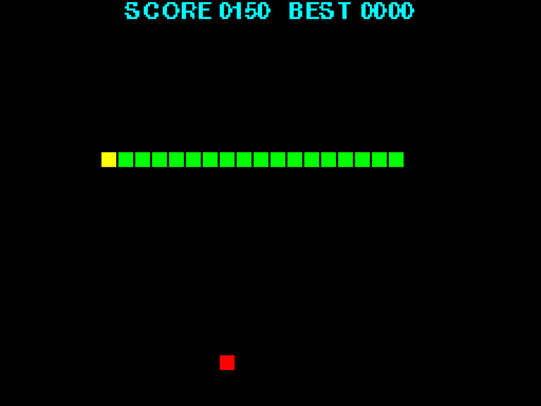
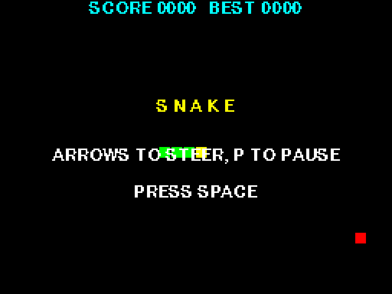

# Project 9 · Snake

A snake crawls round the screen. You steer it. It eats, and every meal makes it longer and faster. It dies if it runs into a wall, or into itself, and sooner or later it always does. Snake is older than the home computer, and it turned up on every machine that ever had a keyboard, because it's hard to think of a smaller set of rules that makes a real game.



At the end of Project 8 you added up what module-level state had cost you: a `global` statement eight names long, `None` checks in every function, tests that leaned on one another, a paint program that was sabotaged by its own colour swatch, and room for only one screen. You were promised a cure. This chapter is the cure.

What you wanted, in Project 8, was to gather some state together with the functions that work on it, into a single thing, and to be able to make as many of those things as you pleased, each with its own state that nobody else could disturb. That's a **class**, and you've been using them since Project 1. Every string, list and `deque` is an instance of one, and so is every `Turtle` and every `Surface`. In Project 5 you made some simple ones of your own, with `@dataclass`. Now you'll write them in full.

| | |
|---|---|
| **You'll learn** | Classes: `class`, `__init__`, `self`, methods, instance and class attributes; composition; `deque`; enums with methods, and `auto()`; a game as a state machine; timing that doesn't depend on the frame rate |
| **New tool skill** | `git stash`, and `.gitignore` in depth |
| **Time** | 4 hours |
| **Before you start** | [Project 8](p08-mode2-sketchpad.md) |

## Predict

!!! question "Predict"
    ```python
    class Snake:
        body = []

        def grow(self, cell):
            self.body.append(cell)


    adder = Snake()
    boa = Snake()
    adder.grow((1, 1))
    print(boa.body)
    ```

??? success "Answer"
    ```text
    [(1, 1)]
    ```

    The adder grew, and the boa got longer. `body = []`, written directly in the class, makes *one* list, which belongs to the class, and every instance shares it. It's Project 4's aliasing again, in its best disguise yet. Stage 1 explains, and the bug hunt is built on it.

!!! question "Predict"
    ```python
    class Counter:
        def __init__(self):
            self.count = 0

        def bump(self):
            self.count += 1
            return self


    clicks = Counter()
    clicks.bump().bump()
    print(clicks.count)
    print(Counter.bump(clicks).count)
    ```

??? success "Answer"
    ```text
    2
    3
    ```

    A method is a function that lives in a class. `clicks.bump()` is a neat way of writing `Counter.bump(clicks)`: the object in front of the dot is passed as the first argument, and that's all that `self` is. Stage 1.

!!! question "Predict"
    ```python
    from collections import deque

    body = deque([(3, 0), (2, 0), (1, 0)])
    body.appendleft((4, 0))
    tail = body.pop()
    print(body[0], tail, len(body))

    recent = deque(maxlen=2)
    for n in range(5):
        recent.append(n)
    print(list(recent))
    ```

??? success "Answer"
    ```text
    (4, 0) (1, 0) 3
    [3, 4]
    ```

    A `deque`, which is pronounced "deck", is a list that's equally quick at both ends. Given a `maxlen`, it throws away its oldest item to make room for each new one. Both halves of that turn out to be what a snake needs. Stage 1.

!!! question "Predict"
    ```python
    class Food:
        colour = "red"


    apple = Food()
    pear = Food()
    pear.colour = "green"
    print(apple.colour, pear.colour, Food.colour)
    Food.colour = "gold"
    print(apple.colour, pear.colour)
    ```

??? success "Answer"
    ```text
    red green red
    gold green
    ```

    Looking an attribute up tries the instance first, and then its class. *Assigning* to one always writes to the instance. So the pear gets a `colour` of its own, which hides the class's, and the apple goes on seeing whatever the class says. Stage 1.

## Build

### Stage 1: A snake is a thing

```console
$ cd making
$ uv init snake
$ cd snake
$ uv add pygame-ce
$ uv add --dev pytest ruff
$ code .
```

Think about what a snake *is*, in this game. It has a **body**, a row of cells with the head at the front. It has a **heading**. And there are things it can do: **turn**, **advance** by a cell, **grow**, and notice that it has **bitten itself**. That's some data, and some operations that make sense only for that data. In Project 8 you'd have written four module-level variables and four functions with `global` in them, and had room for one snake in the world.

You've already met the alternative, in Project 5. A dataclass is a class, and a class can have functions *inside* it:

```pycon
>>> from dataclasses import dataclass
>>> @dataclass
... class Counter:
...     count: int = 0
...     def bump(self):
...         self.count += 1
...
>>> clicks = Counter()
>>> clicks.bump()
>>> clicks.bump()
>>> clicks
Counter(count=2)
>>> other = Counter()
>>> other.count
0
```

A function defined inside a class is a *method*. You call it with a dot, on an *instance*, `clicks.bump()`, and the instance arrives as the method's first parameter, which everybody calls `self`. Through `self`, the method reads and changes *that instance's* own data. `clicks` and `other` are two instances of `Counter`, each with its own `count`. You've been calling methods since `"hello".upper()`. Now you're writing them.

`@dataclass` writes the class's `__init__` method for you, from the list of fields. A snake needs more than that: its body has to be *worked out*, from where its head is and which way it's facing. So it's time to write a class out in full. Create `src/snake/model.py`:

<!-- listing: projects/09-snake/stages/stage1_model.py -->
```python title="src/snake/model.py"
"""The game of Snake: its rules and its state. There's no Pygame in here."""

from collections import deque
from enum import Enum

type Cell = tuple[int, int]


class Direction(Enum):
    UP = (0, -1)
    DOWN = (0, 1)
    LEFT = (-1, 0)
    RIGHT = (1, 0)

    def opposite(self) -> "Direction":
        dx, dy = self.value
        return Direction((-dx, -dy))


class Snake:
    """A snake on a grid: a body of cells, head first, and a heading."""

    START_LENGTH = 4

    def __init__(self, head: Cell, heading: Direction = Direction.RIGHT) -> None:
        x, y = head
        dx, dy = heading.value
        self.body = deque((x - n * dx, y - n * dy) for n in range(self.START_LENGTH))
        self.heading = heading
        self.turns: deque[Direction] = deque(maxlen=2)
        self.growing = 0

    def head(self) -> Cell:
        return self.body[0]

    def turn(self, direction: Direction) -> None:
        """Ask to turn at the next step. A snake can't turn back on itself."""
        latest = self.turns[-1] if self.turns else self.heading
        if direction not in (latest, latest.opposite()):
            self.turns.append(direction)

    def grow(self, cells: int = 1) -> None:
        """Get longer by this many cells, over the next few steps."""
        self.growing += cells

    def advance(self) -> None:
        """Move one cell forward, taking the next turn that's waiting, if any."""
        if self.turns:
            self.heading = self.turns.popleft()
        x, y = self.head()
        dx, dy = self.heading.value
        self.body.appendleft((x + dx, y + dy))
        if self.growing:
            self.growing -= 1
        else:
            self.body.pop()

    def bites_itself(self) -> bool:
        return self.body.count(self.head()) > 1
```

Try it at the REPL before going any further:

```pycon
>>> from snake.model import Snake, Direction
>>> adder = Snake((10, 5))
>>> adder.body
deque([(10, 5), (9, 5), (8, 5), (7, 5)])
>>> adder.turn(Direction.DOWN)
>>> adder.advance()
>>> adder.head()
(10, 6)
>>> boa = Snake((20, 20), Direction.UP)
>>> boa.head(), adder.head()
((20, 20), (10, 6))
```

There are two snakes, each with a body, a heading and a queue of turns of its own, and nothing either of them does can affect the other. There's no `global` anywhere, and no variable that's `None` until somebody remembers to call `mode()`. A `Snake` can't exist without a body, because making a snake *is* running `__init__`.

#### How it works

**`class Snake:`** makes a new type. Class names are written in `CapWords`, by a convention that you've seen in `Counter`, `Path` and `Enum`. The docstring comes first, as usual.

**`__init__`** is the *initialiser*. You never call it by name. You call the *class*, `Snake((10, 5))`, and Python makes a new, empty instance, and hands it to `__init__` as `self`, along with your arguments. `__init__`'s job is to give the new object its attributes, and it does it by assigning to them: `self.body = …`. There are no declarations. **An attribute comes into being when something is assigned to it**, and by firm convention, that happens in `__init__`, for all of them, so that a reader can see in one place what an instance is made of. It's a *dunder* name, as `__name__` was in Project 4: Python calls it on your behalf.

**`self`** isn't a keyword, and there's no magic in it. It's an ordinary parameter, which by convention is always called `self`, and which Python fills in for you. When you write `adder.advance()`, Python looks `advance` up, finds it in the class, and calls it *with `adder` as its first argument*. The second Predict put it plainly: `adder.advance()` means `Snake.advance(adder)`. Inside a method, an instance's data is always reached through `self`. There's no implicit `this`, and a bare `body` would be an ordinary local variable.

!!! info "Coming from Java, C# or JavaScript"
    `self` is `this`, except that you write it out, as the first parameter of every method and in front of every attribute. It feels like a chore for about a day. After that you'll find that you like always being able to see which names belong to the object and which are local. Python has no `new`, either: you call the class. And it has no `private`. A leading underscore means what it meant in Project 6, which is "keep out", by agreement among adults.

**`START_LENGTH = 4`** is written in the class, outside any method, and that makes it a *class attribute*. There's one of it, it belongs to the class, and every instance can see it, as `self.START_LENGTH`. The fourth Predict showed the rule. Looking up `self.something` tries the instance first, and then the class. *Assigning* to `self.something` always writes to the instance. Class attributes are the place for constants that belong with a class.

!!! warning "Gotcha"
    That rule sets a trap, and it was the first Predict. Write `body = []` at class level, thinking of it as "the default", and there is **one list**, which belongs to the class. `self.body.append(…)` doesn't assign to `self.body`. It *looks it up*, finds the class's list, and changes that. Every snake shares one body.

    Immutable class attributes, such as numbers, strings and tuples, are perfectly safe, since nobody can change them, and rebinding one through an instance only hides it for that instance. **Mutable state belongs in `__init__`**, where every instance gets a fresh one. It's the same trap as Project 4's mutable default argument, and it has the same cure. Dataclasses guard you against it, which is why they insisted on `field(default_factory=…)`.

**Enums are classes too**, so they can have methods. `Direction.UP.opposite()` negates the member's value, and looks up the member that has the result. The quotes round `"Direction"` in the return hint are there because, while the class's body is still being read, the name `Direction` doesn't exist yet. The quotes put off the evaluation. (From Python 3.14, hints are evaluated only when somebody asks for them, and the quotes can be left off. They do no harm, and they let the code run on 3.13.)

#### Why a `deque`

Every time the snake moves, a new head is added at the front of its body, and the last cell of its tail is taken off the back. A list is quick at its back end, but slow at its front: `list.insert(0, x)` has to shuffle every other item along by one, so it gets slower as the snake gets longer. A `collections.deque`, a *double-ended queue*, is quick at both ends: `appendleft` and `popleft` at the front, `append` and `pop` at the back. Otherwise it behaves as a list does. You can index it, loop over it, and ask `in` and `len` and `.count()` of it.

Look at how `advance` deals with growing. It always adds a new head. If the snake is growing, it *doesn't remove the tail*, and that's all there is to it. The snake gets longer from the back, one cell for each step, which is how it looks in every version of the game.

The second deque solves a subtler problem. The player may press two keys between one step and the next: up and then left, to turn round a corner in a hurry. If you keep only the latest key, the first is lost. If you apply both at once, then on a snake that's going right, up-then-left becomes an instant reversal, into its own neck. So turns go into a queue, and `advance` takes *one* from it at each step. `maxlen=2` stops the queue from filling up with a long burst of key presses that would go on steering the snake for seconds afterwards. And `turn` checks each new direction against the *last one queued*, and not against the present heading, so that a reversal can't be smuggled in behind a quick turn.

#### Testing a class

Create `tests/test_snake.py`. This is where you'll feel the difference from Project 8.

<!-- listing: projects/09-snake/tests/test_snake.py -->
```python title="tests/test_snake.py"
from snake.model import Direction, Snake


def test_a_new_snake_lies_behind_its_head():
    snake = Snake((10, 5))
    assert list(snake.body) == [(10, 5), (9, 5), (8, 5), (7, 5)]
    assert snake.head() == (10, 5)
# ...
def test_two_quick_turns_are_both_remembered():
    snake = Snake((10, 5))
    snake.turn(Direction.UP)
    snake.turn(Direction.LEFT)
    snake.advance()
    snake.advance()
    assert snake.head() == (9, 4)


def test_a_reversal_cannot_be_smuggled_in_behind_a_quick_turn():
    snake = Snake((10, 5))
    snake.turn(Direction.UP)
    snake.turn(Direction.DOWN)
    assert list(snake.turns) == [Direction.UP]
# ...
def test_every_snake_has_a_body_of_its_own():
    first, second = Snake((5, 5)), Snake((20, 20))
    first.advance()
    first.turn(Direction.UP)
    assert second.head() == (20, 20)
    assert not second.turns
    assert first.body is not second.body
```

There's no fixture to reset the world, and no worry about which test ran before. Every test makes its own snake, does things to it, and looks at it. The tests can't get in one another's way, because they have nothing in common. There's no Pygame either, and no dummy video driver: the rules of Snake need a screen no more than the rules of Life did. Write tests for `advance`, for `grow`, and for a snake that's long enough to bite itself. The project in the tutorial's repository has eleven.

!!! success "Checkpoint"
    ```console
    $ git add .
    $ git commit -m "Add a Snake class that moves, turns and grows"
    ```

### Stage 2: The game is a thing, too

A snake by itself isn't a game. Somewhere there has to be a board, some food, a score, a clock, and a notion of whether anybody is playing at the moment. That's more state, with more operations that belong to it, and so it's another class. Add these to `model.py`, with `import random` at the top, and `auto` added to the `enum` import:

<!-- listing: projects/09-snake/src/snake/model.py -->
```python title="src/snake/model.py"
class State(Enum):
    TITLE = auto()
    PLAYING = auto()
    PAUSED = auto()
    GAME_OVER = auto()


class Game:
    """One game of Snake: the board, the snake, the food and the score."""

    START_INTERVAL = 0.14
    FASTEST_INTERVAL = 0.05

    def __init__(
        self, columns: int = 32, rows: int = 24, rng: random.Random | None = None
    ) -> None:
        self.columns = columns
        self.rows = rows
        self.rng = rng or random.Random()
        self.state = State.TITLE
        self.best = 0
        self.reset()

    def reset(self) -> None:
        """Set up a new round. The best score is kept."""
        self.snake = Snake((self.columns // 2, self.rows // 2))
        self.score = 0
        self.interval = self.START_INTERVAL
        self.waited = 0.0
        self.food = self.free_cell()

    def free_cell(self) -> Cell:
        """Choose a random cell that the snake isn't on."""
        while True:
            cell = (self.rng.randrange(self.columns), self.rng.randrange(self.rows))
            if cell not in self.snake.body:
                return cell

    def start(self) -> None:
        """Begin a round, from the title screen or after a game over."""
        if self.state in (State.TITLE, State.GAME_OVER):
            self.reset()
            self.state = State.PLAYING

    def toggle_pause(self) -> None:
        if self.state is State.PLAYING:
            self.state = State.PAUSED
        elif self.state is State.PAUSED:
            self.state = State.PLAYING

    def turn(self, direction: Direction) -> None:
        if self.state is State.PLAYING:
            self.snake.turn(direction)

    def update(self, seconds: float) -> None:
        """Let this much time go by. The snake steps whenever enough has built up."""
        if self.state is not State.PLAYING:
            return
        self.waited += seconds
        while self.waited >= self.interval and self.state is State.PLAYING:
            self.waited -= self.interval
            self.step()

    def step(self) -> None:
        """Move the snake on by one cell, and deal with whatever it has run into."""
        self.snake.advance()
        x, y = self.snake.head()
        off_the_board = not (0 <= x < self.columns and 0 <= y < self.rows)
        if off_the_board or self.snake.bites_itself():
            self.state = State.GAME_OVER
            self.best = max(self.best, self.score)
        elif self.snake.head() == self.food:
            self.snake.grow()
            self.score += 10
            self.interval = max(self.FASTEST_INTERVAL, self.interval * 0.96)
            self.food = self.free_cell()
```

#### Objects made of objects

`self.snake = Snake(…)`: a `Game` *has a* `Snake`. It also has a `random.Random`, and an enum member, and some numbers. Building objects out of other objects is called **composition**, and it's the main way that programs made of classes are put together. The `Game` doesn't reach into the snake's body and move its cells about. It asks: `self.snake.advance()`, `self.snake.grow()`. Each class looks after its own affairs, and offers its owner a small set of verbs. When `reset` wants a new snake it simply makes one, and the old one, with all of its state, is gone. Compare that with having to find every global variable that needs resetting, and getting them all.

`rng` is Project 6's idea put to work. A `Game` that's given a `random.Random(1)` puts its food in the same places every time, and so it can be tested. A `Game` that's given nothing makes an unseeded one for itself. The `rng or random.Random()` is Project 1's truthiness, and it's the usual idiom for a default that has to be made afresh for each instance.

#### A state machine

At any moment the game is in exactly one of four states, and the state decides what everything else means. The space bar starts a game from the title screen, and does nothing while you're playing. Time goes by while you're playing, and doesn't while you're paused. Writing the states down as an `Enum`, and having each method begin by checking the state, is called a *state machine*. It sounds grander than it is, and it prevents a whole family of bugs, of the kind where a paused snake can still be steered, or a dead one can still eat. `auto()` numbers the members for you, for an enum whose values mean nothing in themselves.

These comparisons are made with `is`. Project 4 told you to keep `is` for `None`, and enum members are the other case where it's right: there's exactly one `State.PLAYING` object, so identity is just what you mean.

#### Time, and not frames

In Project 8, things moved by so much *per frame*, and the frame rate was the speed of the game. That ties the game to the clock of the machine it's running on. Halve the frame rate and the game runs at half speed, and a snake that gets faster as it eats would need a frame rate that kept changing. So `update` isn't told "a frame has gone by". It's told **how many seconds have gone by**. It adds them to `waited`, and whenever there's a whole `interval`'s worth, it takes that much off and steps the snake. If a frame was unusually long, because your computer was busy with something else, the `while` takes several steps to catch up. The game runs at the same speed at 30 frames a second as at 144, and speeding the snake up is a matter of multiplying one number by 0.96.

It also makes the game easy to test, because the tests are in charge of time. Create `tests/test_game.py`:

<!-- listing: projects/09-snake/tests/test_game.py -->
```python title="tests/test_game.py"
import random

import pytest

from snake.model import Direction, Game, State


@pytest.fixture
def game():
    """A game in progress, with dice that always fall the same way."""
    game = Game(columns=20, rows=10, rng=random.Random(1))
    game.start()
    return game
# ...
def test_the_snake_steps_only_when_enough_time_has_gone_by(game):
    game.update(0.10)
    assert game.snake.head() == (10, 5)
    game.update(0.05)
    assert game.snake.head() == (11, 5)


def test_a_long_frame_means_several_steps(game):
    game.update(game.interval * 3)
    assert game.snake.head() == (13, 5)


def test_pausing_stops_the_clock(game):
    game.toggle_pause()
    assert game.state is State.PAUSED
    game.update(5.0)
    game.turn(Direction.UP)
    assert game.snake.head() == (10, 5)
    assert not game.snake.turns
    game.toggle_pause()
    assert game.state is State.PLAYING
# ...
def test_eating_scores_and_grows_and_speeds_up(game):
    game.food = (11, 5)
    before = game.interval
    game.step()
    assert game.score == 10
    assert game.snake.growing == 1
    assert game.interval < before
    assert game.food != (11, 5)
```

A fixture can *return* something, and the test receives it as its parameter. This one hands every test a game of its own, already under way. In Project 8 the fixture was there to clean up a world that all the tests shared. Here it's only saving you some typing, since there's no shared world to clean. The test of eating simply *puts the food* where it wants it, in front of the snake's nose, because a `Game`'s attributes are there to be used.

!!! success "Checkpoint"
    Run, test, lint, diff, commit.

    ```console
    $ git add .
    $ git commit -m "Add the Game: food, score, states and a clock"
    ```

### Stage 3: Something to look at

You have a complete, tested game of Snake, which nobody has ever seen. Drawing it is one more job, and one more class. Create `src/snake/view.py`:

<!-- listing: projects/09-snake/src/snake/view.py -->
```python title="src/snake/view.py"
"""Drawing the game. This is the only module that knows what anything looks like."""

import pygame

from snake.model import Cell, Game, State

type Colour = tuple[int, int, int]

CELL = 8  # each cell of the board is this many pixels square, before scaling

BLACK = (0, 0, 0)
RED = (255, 0, 0)
GREEN = (0, 255, 0)
YELLOW = (255, 255, 0)
CYAN = (0, 255, 255)
WHITE = (255, 255, 255)


class View:
    """Draws a Game onto a small canvas, and scales it up to fill the window."""

    def __init__(self, game: Game, window: pygame.Surface) -> None:
        self.game = game
        self.window = window
        self.canvas = pygame.Surface((game.columns * CELL, game.rows * CELL))
        self.font = pygame.font.Font(None, 16)

    def block(self, cell: Cell, colour: Colour) -> None:
        x, y = cell
        pygame.draw.rect(self.canvas, colour, (x * CELL, y * CELL, CELL - 1, CELL - 1))

    def text(self, message: str, row: int, colour: Colour = WHITE) -> None:
        """Write a line of text, centred, with its top at the given row of cells."""
        image = self.font.render(message, False, colour)
        x = (self.canvas.get_width() - image.get_width()) // 2
        self.canvas.blit(image, (x, row * CELL))

    def draw(self) -> None:
        game = self.game
        self.canvas.fill(BLACK)

        self.block(game.food, RED)
        for cell in game.snake.body:
            self.block(cell, GREEN)
        self.block(game.snake.head(), YELLOW)

        self.text(f"SCORE {game.score:04}   BEST {game.best:04}", 0, CYAN)
        match game.state:
            case State.TITLE:
                self.text("S N A K E", 8, YELLOW)
                self.text("ARROWS TO STEER, P TO PAUSE", 12)
                self.text("PRESS SPACE", 15)
            case State.PAUSED:
                self.text("PAUSED", 10, YELLOW)
            case State.GAME_OVER:
                self.text("GAME OVER", 9, RED)
                self.text("PRESS SPACE", 13)

        scaled = pygame.transform.scale(self.canvas, self.window.get_size())
        self.window.blit(scaled, (0, 0))
```

A `View` is another bundle of state and behaviour: a canvas and a font, which are made once, and the methods that use them. The chunky look is Project 8's trick again. Everything is drawn on a small canvas, of 256 by 192 pixels, which is stretched to fill the window, so that every pixel comes out as a fat square. `pygame.font.Font(None, 16)` is Pygame's built-in font, and the `False` passed to `render` turns smoothing off, to keep the letters sharp when they're enlarged. `render` gives you a new surface with the words on it, which you `blit` like any other.

The `match` uses `State.TITLE`, which has a dot in it, and so it's a constant to be compared with, and not a name to be captured. That was the gotcha in Project 5. `{game.score:04}` pads the score with noughts to four digits, as an arcade machine would.

Look at which way the arrows point. The `View` knows about the `Game`, and reads whatever it needs from it. **The `Game` has no idea that the `View` exists.** That's the arrangement you met in Life, where the logic never looks at the display, and it's the reason the rules could be tested without a screen. It will pay off again in Project 22, when this game starts sending its high scores to a server.

Last, the program itself. Create `src/snake/app.py`, and point the `snake` command at it in `pyproject.toml`, with `snake = "snake.app:main"`:

<!-- listing: projects/09-snake/src/snake/app.py -->
```python title="src/snake/app.py"
"""The program: a window, a loop, and the keyboard."""

import pygame

from snake.model import Direction, Game
from snake.view import View

WINDOW_SIZE = (768, 576)
FRAME_RATE = 60

KEYS = {
    pygame.K_UP: Direction.UP,
    pygame.K_DOWN: Direction.DOWN,
    pygame.K_LEFT: Direction.LEFT,
    pygame.K_RIGHT: Direction.RIGHT,
}


def handle(event: pygame.event.Event, game: Game) -> bool:
    """Pass an event on to the game. Return False if it's time to stop."""
    if event.type == pygame.QUIT:
        return False
    if event.type == pygame.KEYDOWN:
        if event.key == pygame.K_ESCAPE:
            return False
        if event.key == pygame.K_SPACE:
            game.start()
        elif event.key == pygame.K_p:
            game.toggle_pause()
        elif event.key in KEYS:
            game.turn(KEYS[event.key])
    return True


def main() -> None:
    pygame.init()
    window = pygame.display.set_mode(WINDOW_SIZE, pygame.SCALED | pygame.RESIZABLE)
    pygame.display.set_caption("Snake")
    clock = pygame.time.Clock()

    game = Game()
    view = View(game, window)

    running = True
    while running:
        for event in pygame.event.get():
            running = handle(event, game) and running

        seconds = clock.tick(FRAME_RATE) / 1000
        game.update(seconds)

        view.draw()
        pygame.display.flip()

    pygame.quit()
```

It's Project 8's loop, with its three jobs of events, update and draw. Each of them has shrunk to one line, because the work is now done by objects that know how. `clock.tick` returns the number of milliseconds since it was last called, and that's where `update`'s seconds come from. `KEYS` is a dictionary from key codes to directions, of the same kind as the table of experiments in Project 3. And `handle` is a plain function that takes an event and a game, which means it can be tested by building an event by hand:

<!-- listing: projects/09-snake/tests/test_view.py -->
```python title="tests/test_view.py"
def key(code: int) -> pygame.event.Event:
    return pygame.event.Event(pygame.KEYDOWN, key=code)


def test_keys_drive_the_game():
    game = Game()
    assert handle(key(pygame.K_SPACE), game)
    assert game.state is State.PLAYING
    assert handle(key(pygame.K_UP), game)
    assert list(game.snake.turns) == [Direction.UP]
    assert handle(key(pygame.K_p), game)
    assert game.state is State.PAUSED
```

The view's tests do need Pygame, and so they need the `tests/conftest.py` from Project 8, which sets the dummy video driver. Copy it over, leaving out the `mode2` fixture.

!!! example "Run it"
    ```console
    $ uv run snake
    ```

    

    Press ++space++. How long can you last?

!!! success "Checkpoint"
    ```console
    $ git add .
    $ git commit -m "Draw the game and play it"
    ```

### Stage 4: What did that buy you?

Go back over Project 8's five complaints.

| In Project 8 | With classes |
|---|---|
| A `global` statement eight names long, and growing | None at all. State is reached through `self`. |
| `None` checks all over, in case `mode()` hadn't been called | An instance can't exist until `__init__` has run, so its attributes are always there. |
| Tests that leaned on one another, held apart by a fixture that reset the world | Each test makes its own objects. There's no shared world to reset. |
| The paint bug: two pieces of code interfering through a hidden cursor | Each object's state is its own. To interfere with a snake, you'd have to be holding *that snake*. |
| Only one screen | As many instances as you like. A second snake is `Snake(…)`, which is the first Extend challenge. |

It's tempting to conclude that everything ought to be a class, and whole languages have been built on that belief. Python doesn't hold it, and nor should you. Seven projects went by without your writing one, and they weren't the poorer for it. `score` in Codebreaker, `step` in Life and `respond` in the adventure are *better* as plain functions: data goes in, an answer comes out, and nothing is remembered. So here's a test to apply:

- **Reach for a class** when you have state that *lasts*, and operations that belong with it, and particularly when you'll want more than one of the thing: a snake, a game, a window, a bank account, a connection.
- **Stay with functions** when you're turning an input into an output. A class with an `__init__` and one other method is a function in a bad disguise.
- **Stay with a dataclass** when you have data and no behaviour to speak of, such as a room, or a saved game.

There's a great deal more to classes, and the next six projects are about it: properties, in Project 10, will turn `snake.head()` into `snake.head`; the special methods of Project 12 will let your own objects work with `+`, `==` and `len`; and inheritance turns up in Project 15, a good deal later than you might expect, and for a reason.

#### Putting work aside: `git stash`

Picture this. You're halfway through an experiment, with the code in pieces, and you notice a real bug that wants fixing straight away, in a working copy that's full of half-finished changes. You can't commit, because nothing works. You don't want to lose what you've done.

```console
$ git stash
Saved working directory and index state WIP on main: 3f9c2d1 Draw the game and play it
```

Your changes have gone, and the working tree is clean, as of the last commit. They aren't lost. They're on a shelf. Fix the bug, commit it, and then:

```console
$ git stash pop
```

and your half-finished work is back, on top of the fix. `git stash list` shows what's on the shelf, and `git stash -u` takes files that are new and untracked along with the rest.

Stash is for interruptions that last minutes. For anything longer, a branch with a commit called "WIP" is safer, because a commit has a name and a place in the history, and a stash is easily forgotten. A stash that's a week old is a mystery parcel.

#### `.gitignore`, in depth

uv gave you a `.gitignore`, and you've added the odd line to it. Here's the rest of what it can do.

```gitignore
# A comment.
*.png             # any file ending in .png, in any folder
/scores.json      # only the one at the top level of the repository
recordings/       # a folder, and everything in it
!docs/logo.png    # an exception: do track this one, in spite of the rule above
```

If Git seems to be ignoring a file when you think it shouldn't, or the other way round, ask it why:

```console
$ git check-ignore -v masterpiece.png
.gitignore:12:*.png	masterpiece.png
```

!!! warning "Gotcha"
    `.gitignore` applies only to files that Git **isn't already tracking**. Add `scores.json` to it *after* you've committed `scores.json`, and nothing changes: Git goes on tracking every edit. You have to tell it to let go, with `git rm --cached scores.json`, which removes the file from Git's index and leaves it on your disk, and then commit that.

Some files are litter from your own computer, and have nothing to do with any particular project: macOS's `.DS_Store`, Windows's `Thumbs.db`, your editor's swap files. They don't belong in a project's `.gitignore`, which is for the project's own business. Put them in a *global* ignore file, once:

```console
$ git config --global core.excludesFile ~/.gitignore
```

and list them in the `.gitignore` in your home folder.

!!! success "Checkpoint"
    Push. It's been a whole chapter.

    ```console
    $ git push
    ```

## Type-in listing

Forty objects, from a dozen lines of class. Save this as `balls.py`, in the project folder, and run it with `uv run balls.py`.

<!-- listing: projects/09-snake/balls.py -->
```python title="balls.py" linenums="1"
import random

import pygame

SIZE = 512
COLOURS = ["red", "green", "yellow", "blue", "magenta", "cyan"]


class Ball:
    def __init__(self):
        self.x = self.y = SIZE / 2
        self.dx, self.dy = random.uniform(-4, 4), random.uniform(-4, 4)
        self.radius = random.randint(6, 28)
        self.colour = random.choice(COLOURS)

    def move(self):
        self.x, self.y = self.x + self.dx, self.y + self.dy
        if not self.radius <= self.x <= SIZE - self.radius:
            self.dx = -self.dx
        if not self.radius <= self.y <= SIZE - self.radius:
            self.dy = -self.dy


pygame.init()
window = pygame.display.set_mode((SIZE, SIZE))
clock = pygame.time.Clock()
balls = [Ball() for _ in range(40)]

while not pygame.event.get(pygame.QUIT):
    window.fill("black")
    for ball in balls:
        ball.move()
        pygame.draw.circle(window, ball.colour, (ball.x, ball.y), ball.radius)
    pygame.display.flip()
    clock.tick(50)
```

1. How much state is there in this program? Count the attributes, and multiply. How would you have written it in Project 8's style, without a class? (Four lists? A list of lists? What would the code that bounces them look like?)
2. `Ball()` takes no arguments, and yet no two balls are alike. Where does the difference come from, and when?
3. Line 29 is a compact way of writing the event loop. `pygame.event.get(pygame.QUIT)` returns a list of the `QUIT` events that are waiting. Why does `while not …` work?
4. Make the balls fall. Gravity is one more line in `move`. Then make them lose a little of their speed at every bounce.

## Bug hunt

A colleague has taken your `Snake`, and made a game for two out of it, in the manner of the light cycles in a certain 1982 film. Each player leaves a wall behind them, and whoever hits a wall first has lost. It's `duel.py`, in the project's `bughunt/` folder. Copy it into a `bughunt` folder of your own. Player one has the arrow keys, and player two has ++w++, ++a++, ++s++ and ++d++.

```console
$ uv run bughunt/duel.py
```

Play it against yourself for a moment. Something is badly wrong with the steering.

1. **Reproduce it**, and say exactly what happens. When player two presses ++w++, who turns?
2. **Write a failing test**, in `bughunt/test_duel.py`. You don't need a window. Make two `Cycle`s, turn one of them, advance both, and look at their headings.
3. **Fix it.** It's a change to two lines.
4. Now run `uv run ruff check bughunt/duel.py`. What does it say? What does that tell you about your colleague?

??? tip "Hint"
    It's the first Predict. Where, in the `Cycle` class, does `turns` get made? How many times does that line run?

??? success "Solution"
    `turns = deque(maxlen=2)` is written at class level. It runs once, when the class is defined, and makes **one deque, which belongs to the class**. `self.turns.append(…)` doesn't assign to `self.turns`. It looks it up, finds nothing on the instance, finds the class's, and appends to that. Both cycles are putting their turns into the same queue, and whichever of them advances first takes the turn out, whoever asked for it.

    ```python
    def test_each_cycle_steers_itself():
        one = Cycle((24, 36), Direction.RIGHT, "yellow")
        two = Cycle((72, 36), Direction.LEFT, "cyan")

        two.turn(Direction.UP)
        one.advance()
        two.advance()

        assert one.heading is Direction.RIGHT
        assert two.heading is Direction.UP
    ```

    The fix is to make the deque where every other piece of per-instance state is made, in `__init__`:

    ```python
    self.turns: deque[Direction] = deque(maxlen=2)
    ```

    It was tempting because it *looks* like a declaration of a field, in the way that a dataclass's fields are declared. A dataclass would have refused it. A plain class doesn't.

    And Ruff knew all along: `RUF012 Mutable default value for class attribute`. Your colleague isn't running a linter. The cheapest way to find a bug is never to have to look for it.

## Challenges

Make a branch for each.

**Tweak**

1. Make the board bigger, and the snake quicker off the mark. Every number that you need is a class attribute, or an argument to `Game`.
2. Give the snake a striped body, by drawing alternate cells in two shades of green. `enumerate` and `%` will do it. Which class does that change belong in?
3. Take the walls away. If the snake leaves by one edge, it comes in at the opposite one. Make it an option, `Game(wrap=True)`, and make sure that the old tests still pass.

**Extend**

1. **Two players.** A second snake, steered with ++w++, ++a++, ++s++ and ++d++, on the same board. You lose by hitting a wall, yourself, or the other snake. Don't change the `Snake` class at all. It was never told that there'd be only one.
2. **Bonus food.** Every so often a second, golden piece of food appears for five seconds, and is worth fifty points. It wants a small class of its own, with a timer in it. Test it without waiting five seconds.
3. **Levels.** After every hundred points, some walls appear inside the board. A level is a set of cells, and you know how to write one of those down as a picture, from Life.

??? tip "Hint for two players"
    Keep the snakes in a list, and the key maps in another, and `zip` them. For a snake to have run into the *other* one, its head has to be among the other's cells. Be careful, in that loop, to compare snakes with `is`, and not with `==`.

**Invent**

1. **A snake that plays itself.** Write a function that looks at a `Game`, and decides which way to turn. Begin with "towards the food, unless that's fatal". How long does it last? Where does it go wrong, and can you do better? (The screenshot at the top of this chapter was played by about ten lines of just that.)
2. **Make `beeb` a class.** Go back to Project 8 and turn the module's state into a `Screen` class, so that `screen = beeb.Screen(mode=2)` and `screen.draw(…)` work, and two screens can exist at the same moment. Can you keep the old functions going too, so that Project 8's programs still run? (One way is a single `Screen` that's made at module level when it's first needed, with the old functions passing their work on to it.)
3. **Nibbles.** Two players, a maze of walls, and food that's numbered from 1 to 9, to be eaten in order.

Solutions to the third Tweak and the first Extend are in the project's `solutions/` folder.

## Recap

You can now:

- [x] write a class, with an `__init__` and methods, and explain what `self` is
- [x] say what happens, step by step, when you call a class
- [x] tell an instance attribute from a class attribute, and recite the rule for looking one up
- [x] explain why mutable state goes in `__init__`, and what happens if it doesn't
- [x] build objects out of other objects, and have them ask one another to do things
- [x] choose a `deque` over a list, and use `maxlen`
- [x] give an enum methods, and let `auto()` do the numbering
- [x] organise a game as a state machine
- [x] drive a game by elapsed time, and test it by being in charge of the clock
- [x] write a fixture that returns an object
- [x] decide when a class is the right tool, and when a function or a dataclass is
- [x] stash work in progress, and get `.gitignore` to do what you mean

**Read more:** [Classes](https://docs.python.org/3/tutorial/classes.html), in the Python tutorial · [`collections.deque`](https://docs.python.org/3/library/collections.html#collections.deque) · [`pygame.font`](https://pyga.me/docs/ref/font.html) · [Fix your timestep!](https://gafferongames.com/post/fix_your_timestep/), the classic article on game clocks · [Pro Git: stashing](https://git-scm.com/book/en/v2/Git-Tools-Stashing-and-Cleaning) · [gitignore](https://git-scm.com/docs/gitignore)

You've got classes. [Project 10](p10-breakout.md) is Breakout, which is made of nothing else: a bat, a ball, a wall of bricks. It's where you'll learn to make a class pleasant to *use*, with properties, class methods and a good `repr`, and to build a level out of a text file.
