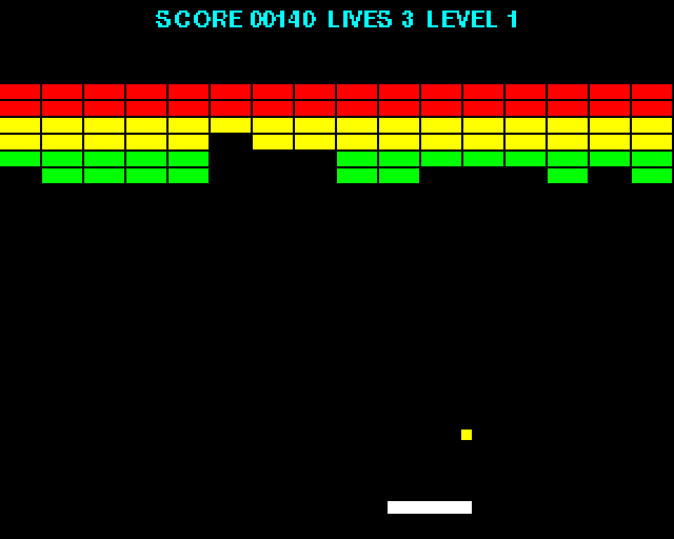
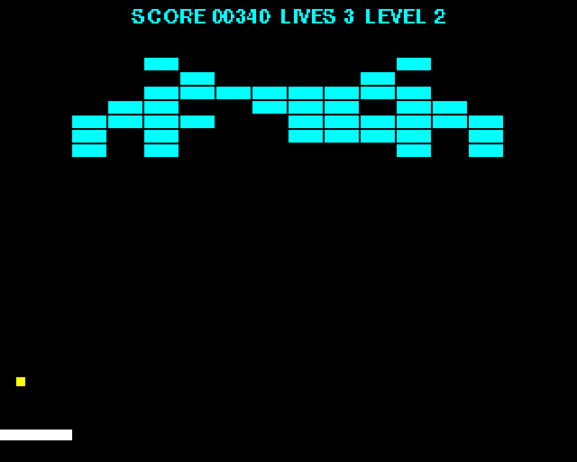

# Project 10 · Breakout

A bat, a ball, and a wall of bricks. Knock out the bricks, and don't let the ball get past you. Breakout was designed in 1976, and legend has it that the prototype was built in four days by two young men called Steve, who went on to make rather a lot of computers. It's still the best small game there is for learning to program with objects, because it's made of nothing else: everything on the screen is a *thing*, with a position and a way of behaving.



In Project 9 you wrote your first classes. This chapter is about making classes that are pleasant to *use*. An attribute that's really a calculation, and which nobody can tell from a plain attribute, is a **property**. A second way of making an object, from a text file say, is a **class method**. An object that introduces itself properly in a traceback has a good **`__repr__`**. And a bundle of settings that nobody can alter behind your back is a **frozen dataclass**. None of them is difficult, and together they're the difference between a class that works and a class that's a pleasure.

The levels are text files, which you can edit in any editor, and which travel inside the package.

| | |
|---|---|
| **You'll learn** | Properties, with getters and setters; class methods as alternative constructors; `__repr__`; frozen dataclasses; data files inside a package; `pygame.FRect`; held keys; collisions |
| **New tool skill** | VS Code's refactoring tools: rename, extract, find references |
| **Time** | 5 hours |
| **Before you start** | [Project 9](p09-snake.md) |

## Predict

!!! question "Predict"
    ```python
    class Circle:
        def __init__(self, radius):
            self.radius = radius

        @property
        def area(self):
            return 3 * self.radius**2


    ring = Circle(2)
    print(ring.area)
    ring.radius = 10
    print(ring.area)
    ring.area = 5
    ```

??? success "Answer"
    ```text
    12
    300
    Traceback (most recent call last):
      ...
    AttributeError: property 'area' of 'Circle' object has no setter
    ```

    `area` is a method, but thanks to `@property` you use it without brackets, as if it were an attribute. It's worked out afresh every time you ask, so it can't go out of date. And because nobody said how to *set* it, it's read-only. Stage 2.

!!! question "Predict"
    ```python
    class Level:
        def __init__(self, bricks):
            self.bricks = bricks

        @classmethod
        def from_text(cls, text):
            return cls([c for c in text if c != "."])


    level = Level.from_text("R.G.#")
    print(type(level).__name__, level.bricks)
    ```

??? success "Answer"
    ```text
    Level ['R', 'G', '#']
    ```

    A class method is called on the class, and not on an instance, and it receives the *class* as its first argument, by convention called `cls`. Its commonest use is this one: a second way of making an instance. Stage 1.

!!! question "Predict"
    ```python
    class Bat:
        def __init__(self, x):
            self.x = x

        def __repr__(self):
            return f"Bat(x={self.x})"


    print(Bat(3), [Bat(1), Bat(2)], f"{Bat(9)!r}")
    ```

??? success "Answer"
    ```text
    Bat(x=3) [Bat(x=1), Bat(x=2)] Bat(x=9)
    ```

    `__repr__` says how an object should present itself to a programmer: at the REPL, inside a list, in a debugger, in a failed `assert`. Without it, you'd have had `<__main__.Bat object at 0x104e3b9d0>`, three times over. Stage 1.

!!! question "Predict"
    ```python
    from dataclasses import dataclass, replace


    @dataclass(frozen=True)
    class Settings:
        lives: int = 3
        speed: float = 150


    normal = Settings()
    hard = replace(normal, lives=1)
    print(normal, hard, normal == Settings())
    print(len({normal, hard, Settings()}))
    normal.lives = 99
    ```

??? success "Answer"
    ```text
    Settings(lives=3, speed=150) Settings(lives=1, speed=150) True
    2
    Traceback (most recent call last):
      ...
    FrozenInstanceError: cannot assign to field 'lives'
    ```

    A frozen dataclass can't be changed once it's been made. You make variations of it with `replace`. And since it can't change, it can be hashed, so it can go in a set, or be the key of a dictionary, as Project 4 explained. Stage 1.

## Build

### Stage 1: A wall, from a text file

```console
$ cd making
$ uv init breakout
$ cd breakout
$ uv add pygame-ce
$ uv add --dev pytest ruff
$ code .
```

The game is laid out as Snake was: `model.py` for the rules, `view.py` for the drawing, and `app.py` for the window and the loop. Begin with the model, and within the model, begin with the wall.

#### Rectangles

Everything in Breakout is a rectangle, the ball included, and Pygame has a class for those which is well worth knowing. It needs no window, and no `pygame.init()`. Try it at the REPL:

<!-- no-doctest -->
```pycon
>>> from pygame import FRect
pygame-ce 2.5.8 (SDL 2.32.10, Python 3.14.7)
>>> bat = FRect(140, 238, 40, 6)
>>> bat.right, bat.centerx, bat.midtop
(180.0, 160.0, (160.0, 238.0))
>>> bat.right = 320
>>> bat
FRect(280.0, 238.0, 40.0, 6.0)
>>> bat.colliderect(FRect(300, 240, 5, 5))
True
```

(Pygame announces itself, the first time it's imported.) An `FRect` is made from its left edge, its top, its width and its height. (A plain `Rect` holds whole numbers only. The `F` is for float, and you'll want floats for anything that moves smoothly.) It offers more than two dozen attributes: `left`, `right`, `top`, `bottom`, `centerx`, `center`, `midtop`, `topleft`, `size` and so on. **You can assign to any of them, and the rectangle moves.** Set `right` to 320, and `left` becomes 280.

Think about what that means. An `FRect` doesn't *store* its right-hand edge. It stores four numbers. `right` looks like an attribute, and it's really a calculation, `left + width`, and assigning to it runs a little code that changes `left`. Attributes that are secretly code are this chapter's main subject, and in Stage 2 you'll write some of your own.

#### Settings that stay set

Create `src/breakout/model.py`:

<!-- listing: projects/10-breakout/stages/stage1_model.py -->
```python title="src/breakout/model.py"
"""The game of Breakout: its rules and its state.

Pygame's FRect is used for geometry, which needs no window, so everything in
here can be tested without a screen.
"""

from dataclasses import dataclass
from importlib import resources
from pathlib import Path

from pygame import FRect


@dataclass(frozen=True)
class Settings:
    """The numbers that set the feel of the game. They can't be changed once made."""

    width: int = 320
    height: int = 256
    lives: int = 3
    bat_width: float = 40
    bat_speed: float = 260
    ball_size: float = 5
    ball_speed: float = 150
    speed_up: float = 1.02
    top_speed: float = 330


# What each character of a level file stands for: a colour, points, and hits to break it.
BRICKS = {
    "R": ("red", 50, 1),
    "Y": ("yellow", 30, 1),
    "G": ("green", 10, 1),
    "C": ("cyan", 20, 1),
    "M": ("magenta", 40, 1),
    "W": ("white", 60, 1),
    "#": ("grey", 100, 2),
}
BRICK_WIDTH, BRICK_HEIGHT = 20, 8
TOP_MARGIN = 24


@dataclass
class Brick:
    rect: FRect
    colour: str
    points: int
    hits: int = 1
```

`@dataclass(frozen=True)` makes instances that can't be altered. Assigning to a field raises `FrozenInstanceError`, as in the fourth Predict. Settings are a good candidate. Every part of the game is going to be handed them, and with a frozen object you know that none of those parts can change the rules for the others. It's Project 4's lesson, that sharing is only safe when the thing that's shared can't change, turned into a design. When you *want* a variation, `dataclasses.replace(settings, lives=1)` makes you a new object, as it did in the adventure, and leaves the original as it was.

A `Brick`, by contrast, is an ordinary dataclass, which can be changed, because a tough brick has to count down its hits. And `BRICKS` is the key to a level file: for each character, a colour, a number of points, and the number of hits it takes.

#### More than one way to make a `Level`

<!-- listing: projects/10-breakout/stages/stage1_model.py -->
```python title="src/breakout/model.py"
class Level:
    """A wall of bricks."""

    def __init__(self, bricks: list[Brick], name: str = "") -> None:
        self.bricks = bricks
        self.name = name

    @classmethod
    def from_text(cls, text: str, name: str = "") -> "Level":
        """Build a level from a picture of it, in which each character is a brick."""
        bricks = []
        for row, line in enumerate(text.strip().splitlines()):
            for column, character in enumerate(line.strip()):
                if character == ".":
                    continue
                if character not in BRICKS:
                    raise ValueError(f"Unknown brick {character!r} in row {row + 1}")
                colour, points, hits = BRICKS[character]
                rect = FRect(
                    column * BRICK_WIDTH,
                    TOP_MARGIN + row * BRICK_HEIGHT,
                    BRICK_WIDTH,
                    BRICK_HEIGHT,
                )
                bricks.append(Brick(rect, colour, points, hits))
        return cls(bricks, name)

    @classmethod
    def from_file(cls, path: Path) -> "Level":
        """Build a level from a text file. The file's name becomes the level's."""
        return cls.from_text(path.read_text(encoding="utf-8"), name=path.stem)

    @classmethod
    def built_in(cls) -> list["Level"]:
        """Return the levels that come with the game, in order."""
        folder = resources.files("breakout") / "levels"
        files = sorted(folder.iterdir(), key=lambda file: file.name)
        return [
            cls.from_text(file.read_text(encoding="utf-8"), name=Path(file.name).stem)
            for file in files
            if file.name.endswith(".txt")
        ]

    @property
    def cleared(self) -> bool:
        return not self.bricks

    def hit_by(self, rect: FRect) -> Brick | None:
        """If the rectangle is touching a brick, hit that brick, and return it."""
        for brick in self.bricks:
            if brick.rect.colliderect(rect):
                brick.hits -= 1
                if brick.hits == 0:
                    self.bricks.remove(brick)
                return brick
        return None

    def __repr__(self) -> str:
        return f"Level({self.name!r}, {len(self.bricks)} bricks)"
```

`__init__` takes a list of bricks, and that's the fundamental way to make a level: hand it the bricks. But nobody wants to type out ninety-six `Brick(FRect(…), …)`s. You want to *draw* a level:

```text
RRRRRRRRRRRRRRRR
YYYYYYYYYYYYYYYY
....GGGGGGGG....
```

So there has to be a second way of making a `Level`, from text, and a third, from a file. Other languages would give the class several constructors. Python has one `__init__`, and an idiom:

```python
@classmethod
def from_text(cls, text: str, name: str = "") -> "Level":
    ...
    return cls(bricks, name)
```

**A class method belongs to the class, and not to any instance.** You call it on the class, as `Level.from_text(picture)`, which is just as well, since you haven't got an instance yet. Its first parameter isn't `self`. It's the class itself, by convention called `cls`. The method does whatever work is needed, and ends by calling `cls(…)`, which is the ordinary constructor. These are called *alternative constructors*, and by a strong convention their names begin with `from_`. You've already used some: `dict.fromkeys`, `datetime.fromtimestamp`, `Fraction.from_float`, `int.from_bytes`.

`from_file` is two lines long, because it passes the work on to `from_text`. That's the pattern: one fundamental `__init__`, which takes the real ingredients, and any number of conveniences built on top of it. (`path.stem` is a file's name without its extension.)

It's `cls(…)`, and not `Level(…)`, for the sake of a day that comes in Project 15, when somebody makes a special kind of `Level` based on this one, and would like `from_text` to build one of *theirs*.

!!! note "Under the bonnet"
    There's a third kind of method, `@staticmethod`, which receives neither `self` nor `cls`. It's an ordinary function that happens to live inside a class. You'll rarely want one. If a function doesn't need the instance or the class, it's usually better off as a plain function in the module, where it's easier to find and to test.

#### Data files in a package

Make a folder, `src/breakout/levels/`, and put a first level in it, as `1-wall.txt`:

<!-- listing: projects/10-breakout/src/breakout/levels/1-wall.txt -->
```text title="src/breakout/levels/1-wall.txt"
................
................
RRRRRRRRRRRRRRRR
RRRRRRRRRRRRRRRR
YYYYYYYYYYYYYYYY
YYYYYYYYYYYYYYYY
GGGGGGGGGGGGGGGG
GGGGGGGGGGGGGGGG
```

Sixteen bricks of 20 pixels fill a screen 320 wide. Draw a second and a third level yourself. The tutorial's repository has a space invader, in cyan, and a fortress with walls of `#`, which take two hits.

How does the program find these files once it's been installed somewhere? `Path("levels")` won't do, since that's relative to wherever the player happens to be when they type `breakout`. `Path(__file__).parent / "levels"` is better, and is what most people write. The proper tool is `importlib.resources`:

```python
folder = resources.files("breakout") / "levels"
```

`resources.files("breakout")` is "wherever the `breakout` package is", as something that behaves like a `Path`, and it works even when the package is being run from inside a zip file. Anything that you put in the package's folder travels with the package: when you build and publish one, in Project 27, the levels will be inside.

`sorted(…, key=lambda file: file.name)` is the use of `lambda` that Project 7 approved of, a small sort key, and it's the reason the files are called `1-…`, `2-…`, `3-…`.

#### `__repr__`

```python
def __repr__(self) -> str:
    return f"Level({self.name!r}, {len(self.bricks)} bricks)"
```

Every object has two ways of turning itself into a string. `str(thing)` is for people who use the program, and it's what `print` shows. `repr(thing)` is for *programmers*, and it's what you see at the REPL, inside a list, in the debugger's Variables panel, and in a failed `assert`. You met the difference in Project 1, as `!r`. A class that doesn't define `__repr__` gets the default, which is about as unhelpful as it could be:

```text
<breakout.model.Level object at 0x10cd47230>
```

So define one, for any class you'll ever have to debug, which is all of them. The convention is that it should look like the code that would make the object, if that's practical, and be informative if it isn't: ninety-six bricks are better counted than listed. If you define only `__repr__`, `str` and `print` use it too. Dataclasses write their own, and that's how `Brick` and `Settings` come by theirs.

It's another dunder method, like `__init__`: you never call `level.__repr__()`. You call `repr(level)`, or more usually you do nothing at all, and Python calls it for you when an object needs showing. There are dozens of these hooks, and Project 12 is about the rest.

`cleared`, with its `@property`, is explained in the next stage. First, the tests. Create `tests/test_level.py`:

<!-- listing: projects/10-breakout/tests/test_level.py -->
```python title="tests/test_level.py"
import pytest

from breakout.model import Level

PICTURE = """
    R.G
    .#.
"""


def test_a_level_is_built_from_a_picture():
    level = Level.from_text(PICTURE, name="tiny")
    assert len(level.bricks) == 3
    red, green, tough = level.bricks
    assert (red.colour, red.points, red.hits) == ("red", 50, 1)
    assert (green.rect.left, green.rect.top) == (40, 24)
    assert (tough.rect.left, tough.rect.top, tough.hits) == (20, 32, 2)


def test_a_level_describes_itself():
    assert repr(Level.from_text(PICTURE, name="tiny")) == "Level('tiny', 3 bricks)"
# ...
def test_a_level_can_come_from_a_file(tmp_path):
    file = tmp_path / "9-test.txt"
    file.write_text("YY\n", encoding="utf-8")
    level = Level.from_file(file)
    assert level.name == "9-test"
    assert len(level.bricks) == 2


def test_the_built_in_levels_load_in_order():
    levels = Level.built_in()
    assert [level.name for level in levels] == ["1-wall", "2-invader", "3-fortress"]
    assert all(level.bricks for level in levels)
```

Since `from_text` takes a string, a test can draw the wall it needs, in three lines, and needs no files. Since `from_file` takes a path, a test can use `tmp_path`. And there's a test for the data, as there was in the adventure: that the built-in levels all load, and come in the right order. Write some more, for what happens when a brick is hit. The project in the repository has eight.

!!! success "Checkpoint"
    ```console
    $ git add .
    $ git commit -m "Build levels from text, and from files in the package"
    ```

### Stage 2: A bat and a ball

Add `import math` to the top of `model.py`, and these two classes to the bottom:

<!-- listing: projects/10-breakout/stages/stage2_model.py -->
```python title="src/breakout/model.py"
class Bat:
    def __init__(self, settings: Settings) -> None:
        self.rect = FRect(0, 0, settings.bat_width, 6)
        self.rect.midbottom = (settings.width / 2, settings.height - 12)
        self.speed = settings.bat_speed
        self.bounds = FRect(0, 0, settings.width, settings.height)

    def move(self, steer: int, seconds: float) -> None:
        """Move left (-1) or right (1), or stay put (0). The bat stops at the walls."""
        self.rect.x += steer * self.speed * seconds
        self.rect.clamp_ip(self.bounds)

    def __repr__(self) -> str:
        return f"Bat(centre={self.rect.centerx:.0f})"


class Ball:
    def __init__(self, size: float, speed: float) -> None:
        self.rect = FRect(0, 0, size, size)
        self.vx = 0.0
        self.vy = -speed

    @property
    def speed(self) -> float:
        """How fast the ball is going, whichever way that is."""
        return math.hypot(self.vx, self.vy)

    @speed.setter
    def speed(self, value: float) -> None:
        if value <= 0:
            raise ValueError(f"A ball's speed must be more than zero, not {value}")
        scale = value / self.speed
        self.vx *= scale
        self.vy *= scale

    def aim(self, offset: float) -> None:
        """Send the ball upwards at its present speed: -1 is hard left, 1 hard right."""
        angle = math.radians(60 * max(-1.0, min(1.0, offset)))
        speed = self.speed
        self.vx = speed * math.sin(angle)
        self.vy = -speed * math.cos(angle)

    def __repr__(self) -> str:
        x, y = self.rect.center
        return f"Ball(at=({x:.0f}, {y:.0f}), velocity=({self.vx:.0f}, {self.vy:.0f}))"
```

The `Bat` holds no surprises. It *has a* rectangle, which is composition again. `move` takes a direction to steer in, of −1, 0 or 1, and a number of seconds, as in Snake, and `clamp_ip` moves a rectangle the least it can to fit inside another one, which is what stops the bat at the walls. The `_ip` is for "in place", meaning that it changes this rectangle, and doesn't return a new one. It's Pygame's way of marking the distinction that Project 4 made such a fuss about.

#### Properties

The ball has a velocity, in two parts: `vx` pixels a second across, and `vy` pixels a second down. That's the easy way to store it, since moving the ball is two multiplications, and a bounce is a change of sign. But the *game* thinks about the ball's **speed**: every brick makes it 2% faster, up to a limit. Speed isn't stored anywhere. It's the length of the velocity, by Pythagoras.

You could write a method, `ball.get_speed()`, and another, `ball.set_speed(200)`. In Java, you'd have to. In Python, you write this:

```python
@property
def speed(self) -> float:
    """How fast the ball is going, whichever way that is."""
    return math.hypot(self.vx, self.vy)

@speed.setter
def speed(self, value: float) -> None:
    if value <= 0:
        raise ValueError(f"A ball's speed must be more than zero, not {value}")
    scale = value / self.speed
    self.vx *= scale
    self.vy *= scale
```

and then everybody who uses a ball writes what they'd have written if `speed` were a plain attribute:

```pycon
>>> from breakout.model import Ball
>>> ball = Ball(size=5, speed=100)
>>> ball.vx, ball.vy = 30.0, -40.0
>>> ball.speed
50.0
>>> ball.speed = 100
>>> ball.vx, ball.vy
(60.0, -80.0)
>>> ball.speed *= 1.5
>>> ball.speed
150.0
```

**`@property` turns a method into something that looks like an attribute.** Reading `ball.speed` calls the first function. Assigning to `ball.speed` calls the second, the *setter*, which here keeps the ball going in the same direction and changes how fast. Even `ball.speed *= 1.5` works: it reads, multiplies, and assigns. The setter can refuse a value that makes no sense, and that's how a class defends itself:

```pycon
>>> ball.speed = 0
Traceback (most recent call last):
  ...
ValueError: A ball's speed must be more than zero, not 0
```

Leave the setter out, and the property is read-only, as `Level.cleared` is, and as `area` was in the first Predict. `cleared` is a property for a slightly different reason. It *could* have been an attribute, a `True` or a `False`, that something remembered to update whenever a brick was broken. But a fact that's kept in two places can get out of step with itself, and a fact that's worked out when it's asked for can't. It's "work it out, don't store it", from Codebreaker, with a friendlier face.

!!! tip "Pythonic"
    If you've come from Java or C#, you'll have been taught never to expose a field, and to write a `getX()` and a `setX()` for everything, in case you need to add some logic one day. **Don't, in Python.** Begin with a plain attribute. If the day ever comes when you need to validate it, or to work it out, turn it into a property *then*, and not one line of the code that uses it has to change, since `ball.speed` looks the same either way. Properties are why Python doesn't need getters and setters, and why it doesn't need `private` to be safe.

    Here's one from your own past. In Snake, `head()` was a method, and `snake.head()` reads oddly, since a head is something that a snake has, and not something that it does. With `@property` above it, it becomes `snake.head`. Go back and change it, when you've finished this chapter.

!!! warning "Gotcha"
    A property should be cheap, and should have no surprises in it. Whoever reads `thing.size` expects it to cost about what an attribute costs, and to change nothing. If it has to read a file, or takes a second, or alters something, make it a method, with a verb for a name, so that the brackets give fair warning.

`aim` sends the ball upwards, at whatever speed it's already going, at an angle of up to 60 degrees either side of straight up. It reads `self.speed`, which is the property, before it changes anything.

#### A `repr` earns its keep

Both of the new classes have a `__repr__`, and while this chapter was being written, one of them paid for itself. The first version of the game's `new_ball` method forgot to put the new ball on the bat. A test failed, and this is what the report said:

```text
E   where FRect(0.927051, 0.0, 5.0, 5.0) = Ball(at=(3, 2), velocity=(46, 143)).rect
```

`Ball(at=(3, 2), velocity=(46, 143))`: the ball is in the top left-hand corner of the screen, and it's going *down*. You can see what's gone wrong before you've opened the file. With the default `repr`, it would have said `<breakout.model.Ball object at 0x108f0e0d0>`, and there'd have been a debugging session to come.

Test the two classes, in `tests/test_bat_and_ball.py`. These are the ones that matter:

<!-- listing: projects/10-breakout/tests/test_bat_and_ball.py -->
```python title="tests/test_bat_and_ball.py"
def test_setting_the_speed_keeps_the_direction():
    ball = Ball(5, 100)
    ball.vx, ball.vy = 30, -40
    ball.speed = 100
    assert (ball.vx, ball.vy) == pytest.approx((60, -80))


@pytest.mark.parametrize("bad", [0, -1])
def test_a_ball_cannot_stand_still_or_go_backwards(bad):
    ball = Ball(5, 100)
    with pytest.raises(ValueError, match="more than zero"):
        ball.speed = bad


@pytest.mark.parametrize(
    ("offset", "degrees"),
    [(0, 0), (1, 60), (-1, -60), (0.5, 30), (5, 60)],
)
def test_aim_sets_the_angle_and_keeps_the_speed(offset, degrees):
    ball = Ball(5, 200)
    ball.aim(offset)
    assert ball.speed == pytest.approx(200)
    assert math.degrees(math.atan2(ball.vx, -ball.vy)) == pytest.approx(degrees)
```

The angle test has a case with an offset of 5, which is far beyond the end of the bat, to make sure that `aim` limits it to 60 degrees.

!!! success "Checkpoint"
    ```console
    $ git add .
    $ git commit -m "Add a bat, and a ball whose speed is a property"
    ```

### Stage 3: The game

Add `import copy` to the top of `model.py`, along with `from enum import Enum, auto`, and then the last two classes:

<!-- listing: projects/10-breakout/stages/stage3_model.py -->
```python title="src/breakout/model.py"
class State(Enum):
    SERVE = auto()
    PLAYING = auto()
    GAME_OVER = auto()
    WON = auto()


class Game:
    """One game of Breakout: a bat, a ball, some levels, a score and some lives."""

    def __init__(
        self, levels: list[Level] | None = None, settings: Settings | None = None
    ) -> None:
        self.settings = settings or Settings()
        self.levels = levels if levels is not None else Level.built_in()
        self.best = 0
        self.restart()

    def restart(self) -> None:
        """Begin again from the first level."""
        self.number = 0
        self.score = 0
        self.lives = self.settings.lives
        self.walls = copy.deepcopy(self.levels)
        self.new_ball()

    @property
    def level(self) -> Level:
        return self.walls[self.number]

    def new_ball(self) -> None:
        """Put a new bat in the middle, with a new ball sitting on it."""
        self.bat = Bat(self.settings)
        self.ball = Ball(self.settings.ball_size, self.settings.ball_speed)
        self.ball.rect.midbottom = self.bat.rect.midtop
        self.state = State.SERVE

    def serve(self) -> None:
        """Launch the ball, or start again after the game has ended."""
        if self.state is State.SERVE:
            self.ball.aim(0.3)
            self.state = State.PLAYING
        elif self.state in (State.GAME_OVER, State.WON):
            self.restart()

    def update(self, seconds: float, steer: int = 0) -> None:
        """Let some time go by, with the bat being steered left (-1) or right (1)."""
        if self.state in (State.GAME_OVER, State.WON):
            return
        self.bat.move(steer, seconds)
        if self.state is State.SERVE:
            self.ball.rect.midbottom = self.bat.rect.midtop
            return

        seconds = min(seconds, 1 / 30)
        ball, width = self.ball, self.settings.width

        # Move across, and then up or down, so that we know which side was hit.
        step = ball.vx * seconds
        ball.rect.x += step
        if ball.rect.left < 0 or ball.rect.right > width or self.hit_brick():
            ball.rect.x -= step
            ball.vx = -ball.vx

        step = ball.vy * seconds
        ball.rect.y += step
        if ball.rect.top < 0 or self.hit_brick():
            ball.rect.y -= step
            ball.vy = -ball.vy

        if ball.vy > 0 and ball.rect.colliderect(self.bat.rect):
            ball.rect.bottom = self.bat.rect.top
            ball.aim(
                (ball.rect.centerx - self.bat.rect.centerx) / (self.bat.rect.width / 2)
            )

        if ball.rect.top > self.settings.height:
            self.lose_life()
        elif self.level.cleared:
            self.next_level()

    def hit_brick(self) -> bool:
        brick = self.level.hit_by(self.ball.rect)
        if brick is None:
            return False
        self.score += brick.points
        self.best = max(self.best, self.score)
        self.ball.speed = min(
            self.ball.speed * self.settings.speed_up, self.settings.top_speed
        )
        return True

    def lose_life(self) -> None:
        self.lives -= 1
        if self.lives == 0:
            self.state = State.GAME_OVER
        else:
            self.new_ball()

    def next_level(self) -> None:
        if self.number + 1 == len(self.walls):
            self.state = State.WON
        else:
            self.number += 1
            self.new_ball()
```

Most of this is Snake's `Game` again: composition, a state machine, and an `update` that's told how much time has gone by. Here's what's new.

**`level` is a property**, and it means "whichever wall we're on". `game.level.bricks` reads a good deal better than `game.walls[game.number].bricks`, and it can't disagree with `number`, since it's worked out from it.

**`copy.deepcopy`**, from Project 4, makes `restart` work. The `Level`s that the game is given are its master copies. Each new game plays on a deep copy of them, bricks and all, so that the bricks you knock out of the copy are still there in the original when you start again. A shallow copy wouldn't do: you'd have a new list, of the same old `Level` objects.

**The default levels** are handled with care: `levels if levels is not None else Level.built_in()`. It isn't `levels or …`, because an empty list is a legitimate argument that happens to count as false. It's Project 1's warning about truthiness and `None`.

**The ball moves across, and then down**, in two separate steps, with a check for a collision after each. That's how the game knows which way to bounce. If the ball is touching a brick after moving *across*, it must have hit the brick's side, so it undoes the move and reverses `vx`. If it's touching one after moving *down*, it hit the top or the bottom, so `vy`. It's an old arcade trick, and it's far more robust than trying to work out afterwards which face of a brick was hit. The line above, `seconds = min(seconds, 1 / 30)`, is a safety net: if your computer stalls for half a second, the ball mustn't jump half a screen in one go, and pass straight through the wall without touching it.

**Where the ball hits the bat decides where it goes.** The middle of the bat sends it straight up, and the ends send it off at 60 degrees. That one rule is what makes Breakout a game of skill. Without it, the ball would follow the same path for ever.

Now the view. It's a near relation of Snake's, and shorter, since all the rectangles are ready to be drawn. Create `src/breakout/view.py`:

<!-- listing: projects/10-breakout/src/breakout/view.py -->
```python title="src/breakout/view.py"
"""Drawing the game. This is the only module that knows what anything looks like."""

import pygame

from breakout.model import Game, State


class View:
    """Draws a Game onto a small canvas, and scales it up to fill the window."""

    def __init__(self, game: Game, window: pygame.Surface) -> None:
        self.game = game
        self.window = window
        settings = game.settings
        self.canvas = pygame.Surface((settings.width, settings.height))
        self.font = pygame.font.Font(None, 16)

    def text(self, message: str, y: int, colour: str = "white") -> None:
        image = self.font.render(message, False, colour)
        x = (self.canvas.get_width() - image.get_width()) // 2
        self.canvas.blit(image, (x, y))

    def draw(self) -> None:
        game = self.game
        self.canvas.fill("black")

        for brick in game.level.bricks:
            pygame.draw.rect(self.canvas, brick.colour, brick.rect.inflate(-1, -1))
        pygame.draw.rect(self.canvas, "white", game.bat.rect)
        pygame.draw.rect(self.canvas, "yellow", game.ball.rect)

        status = f"SCORE {game.score:05}  LIVES {game.lives}  LEVEL {game.number + 1}"
        self.text(status, 4, "cyan")
        match game.state:
            case State.SERVE:
                self.text("PRESS SPACE TO SERVE", 150)
            case State.GAME_OVER:
                self.text("GAME OVER", 130, "red")
                self.text("PRESS SPACE", 150)
            case State.WON:
                self.text("YOU'VE CLEARED THE LOT!", 130, "yellow")
                self.text("PRESS SPACE", 150)

        scaled = pygame.transform.scale(self.canvas, self.window.get_size())
        self.window.blit(scaled, (0, 0))
```

`brick.rect.inflate(-1, -1)` returns a rectangle that's one pixel smaller each way, which leaves a thin dark line between the bricks.

And `src/breakout/app.py`, with `breakout = "breakout.app:main"` in `pyproject.toml`:

<!-- listing: projects/10-breakout/src/breakout/app.py -->
```python title="src/breakout/app.py"
"""The program: a window, a loop, and the keyboard."""

import pygame

from breakout.model import Game
from breakout.view import View

WINDOW_SIZE = (960, 768)
FRAME_RATE = 60


def steering(pressed: pygame.key.ScancodeWrapper) -> int:
    """Which way the player is steering: -1 for left, 1 for right, 0 for neither or both."""
    return int(pressed[pygame.K_RIGHT]) - int(pressed[pygame.K_LEFT])


def main() -> None:
    pygame.init()
    window = pygame.display.set_mode(WINDOW_SIZE, pygame.SCALED | pygame.RESIZABLE)
    pygame.display.set_caption("Breakout")
    clock = pygame.time.Clock()

    game = Game()
    view = View(game, window)

    running = True
    while running:
        for event in pygame.event.get():
            if event.type == pygame.QUIT:
                running = False
            elif event.type == pygame.KEYDOWN:
                if event.key == pygame.K_ESCAPE:
                    running = False
                elif event.key == pygame.K_SPACE:
                    game.serve()

        seconds = clock.tick(FRAME_RATE) / 1000
        game.update(seconds, steering(pygame.key.get_pressed()))

        view.draw()
        pygame.display.flip()

    pygame.quit()
```

There's one new idea in it. Snake was steered by *events*: a key went down, and the snake turned, once. A bat is different. It should keep moving for as long as a key is *held*. `pygame.key.get_pressed()` tells you the state of every key at this moment, and `steering` turns that into −1, 0 or 1. (`int(True)` is 1, so holding both keys gives nought.) As a rule: use events for things that happen, and use the state of the keys for things that go on.

The model's tests are in the same spirit as Snake's, in `tests/test_game.py`. They put the ball where they want it, give it a velocity, let a fiftieth of a second go by, and look:

<!-- listing: projects/10-breakout/tests/test_game.py -->
```python title="tests/test_game.py"
from dataclasses import FrozenInstanceError, replace

import pytest

from breakout.model import Game, Level, Settings, State


@pytest.fixture
def game():
    """A game with two very small levels, waiting for the first serve."""
    return Game(levels=[Level.from_text("RR", "one"), Level.from_text("#", "two")])
# ...
def test_hitting_a_brick_scores_and_bounces_and_speeds_up(game):
    game.serve()
    brick = game.level.bricks[0]
    game.ball.rect.midtop = (brick.rect.centerx, brick.rect.bottom + 1)
    game.ball.vx, game.ball.vy = 0.0, -150
    game.update(0.02)
    assert game.score == 50
    assert game.ball.vy > 150
    assert len(game.level.bricks) == 1
# ...
def test_starting_again_rebuilds_the_walls(game):
    game.serve()
    game.level.bricks.clear()
    game.update(0.01)
    game.state = State.GAME_OVER
    game.serve()
    assert (game.number, game.score, game.lives) == (0, 0, 3)
    assert len(game.level.bricks) == 2


def test_settings_cannot_be_changed_but_can_be_varied():
    settings = Settings()
    with pytest.raises(FrozenInstanceError):
        settings.lives = 99
    hard = replace(settings, lives=1, bat_width=24)
    assert Game(levels=[Level.from_text("R")], settings=hard).lives == 1
    assert settings.lives == 3
```

The fixture gives every test two tiny levels, of two bricks and of one, which is the pay-off for `from_text`. The last test checks the frozen settings from both sides: that they can't be changed, and that a changed copy can be made and used. Copy `tests/conftest.py` over from Snake, for the view's tests.

!!! example "Run it"
    ```console
    $ uv run breakout
    ```

    ++space++ serves, and the arrow keys move the bat. Clear the wall, and you'll meet the second level:

    

!!! success "Checkpoint"
    Run, test, lint, diff, commit.

    ```console
    $ git add .
    $ git commit -m "Add the game, the view and the loop"
    ```

### Stage 4: Changing your mind, safely

`Game.update` is forty lines long, which is too many, and it has a lump in the middle that doesn't read well:

```python
if ball.vy > 0 and ball.rect.colliderect(self.bat.rect):
    ball.rect.bottom = self.bat.rect.top
    ball.aim(
        (ball.rect.centerx - self.bat.rect.centerx) / (self.bat.rect.width / 2)
    )
```

Improving the shape of code without changing what it does is called *refactoring*. You've been doing it by hand since Project 1. Your editor can do the mechanical parts, and it makes fewer mistakes than you do, because it works from Pylance's understanding of the code, and not from the look of the text.

**Extract a method.** Select the two lines inside that `if`, the ones beginning `ball.rect.bottom` and `ball.aim`. Press ++ctrl+period++ (++cmd+period++ on a Mac), or click the light bulb that appears, and choose **Extract method**. VS Code moves the lines into a new method, works out what has to be passed to it, puts a call where they used to be, and asks you for a name. Call it `hit_bat`. Tidy the result by hand until it looks like this, with the call in `update` reading simply `self.hit_bat()`:

<!-- listing: projects/10-breakout/src/breakout/model.py -->
```python title="src/breakout/model.py"
    def hit_bat(self) -> None:
        """Bounce the ball off the bat: the further from the middle, the wider the angle."""
        bat, ball = self.bat.rect, self.ball
        ball.rect.bottom = bat.top
        ball.aim((ball.rect.centerx - bat.centerx) / (bat.width / 2))
```

Now run the tests. They pass, and that's the proof that you've changed the shape of the code and left its behaviour alone. **Refactoring without tests is only editing, and hoping.**

**Rename a symbol.** `number` is a poor name for "which level we're on". Click on it, where it's set in `restart`, and press ++f2++. Type `level_number`, and press ++enter++. Every use of *that attribute*, in every file of the project, changes, and nothing else does: not the word "number" in a comment, not `number` the local variable in some test, not any other class's `number`. Search-and-replace can't do that, because it sees text. Your editor sees *names*. Run the tests again. (Then undo it, with `git restore .`, or keep it and adjust your view to suit. The rest of the chapter assumes `number`.)

**Find your way around.** Three more keys, which you'll use all day:

| Key | Does |
|---|---|
| ++f12++ | **Go to Definition**: jump to where the thing under the cursor is defined, even inside a library |
| ++shift+f12++ | **Find All References**: list everywhere it's used |
| ++alt+left++ (++ctrl+minus++ on a Mac) | go back to where you were |

Put the cursor on `clamp_ip` and press ++f12++, to see what Pygame has to say about it. Put it on `hit_brick` and press ++shift+f12++, to see who calls it. Before you change or delete anything, find out who's relying on it.

There are more under the same light bulb, such as **Extract variable**, which gives a name to a complicated expression. Make a habit of pressing ++ctrl+period++ on things, to see what's on offer.

!!! success "Checkpoint"
    ```console
    $ git commit -am "Extract hit_bat from update"
    $ git push
    ```

    A refactoring deserves a commit of its own, apart from any change in behaviour. When something breaks next month, you'll want to be able to say "it can't have been that one: nothing changed".

## Type-in listing

The view from the bridge. Save this as `starfield.py`, in the project folder, and run it with `uv run starfield.py`.

<!-- listing: projects/10-breakout/starfield.py -->
```python title="starfield.py" linenums="1"
import random

import pygame

SIZE = 512


class Star:
    def __init__(self):
        self.x, self.y = random.uniform(-1, 1), random.uniform(-1, 1)
        self.z = random.uniform(0.05, 1)

    @property
    def screen(self):
        return SIZE / 2 * (1 + self.x / self.z), SIZE / 2 * (1 + self.y / self.z)

    @property
    def shade(self):
        return int(255 * (1 - self.z))

    def approach(self, seconds):
        self.z -= 0.3 * seconds
        if self.z < 0.01:
            self.z = 1.0


pygame.init()
window = pygame.display.set_mode((SIZE, SIZE))
clock = pygame.time.Clock()
stars = [Star() for _ in range(300)]

while not pygame.event.get(pygame.QUIT):
    seconds = clock.tick(60) / 1000
    window.fill("black")
    for star in stars:
        star.approach(seconds)
        pygame.draw.circle(window, [star.shade] * 3, star.screen, 1 + star.shade // 128)
    pygame.display.flip()
```

1. Each star stores three numbers, `x`, `y` and `z`, where `z` is its distance away. Where it appears on the screen isn't stored anywhere. Why is `screen` a property, and `approach` a method?
2. Dividing by `z` is the whole of perspective. What happens to a star's place on the screen as its `z` shrinks towards nought? Why do the stars seem to fly *outwards*?
3. `[star.shade] * 3` makes a colour. What colour, and why is that safe, given Project 4's warning about `[x] * 3`?
4. Add a `speed` that the up and down arrow keys change. Should it be an attribute of each `Star`, or of something else?

## Bug hunt

A colleague is making a ball that gets 5% faster at every bounce, and has been reading about properties. "I've put the top speed in the setter," they say, "so that nothing can ever make it go too fast." It's `ball.py`, in the project's `bughunt/` folder. Copy it into a `bughunt` folder of your own.

```console
$ uv run bughunt/ball.py
Traceback (most recent call last):
  ...
  File "bughunt/ball.py", line 24, in speed
    self.speed = min(value, 900.0)
    ^^^^^^^^^^
  File "bughunt/ball.py", line 24, in speed
    self.speed = min(value, 900.0)
    ^^^^^^^^^^
  [Previous line repeated 987 more times]
RecursionError: maximum recursion depth exceeded
```

It doesn't get as far as opening the window.

1. **Read the traceback.** Which line is it? What is that line trying to do, and what does it do?
2. **Write a failing test**, in `bughunt/test_ball.py`: make a `Ball`, and check its speed. Then one for changing the speed, and one for the limit.
3. **Fix it.** It's a change of one character.

??? tip "Hint"
    Inside the setter for `speed`, what does assigning to `self.speed` call?

??? success "Solution"
    Assigning to `self.speed` calls **the setter for `speed`**, and that's where the line is. So the setter calls itself, which calls itself, a thousand times over, until Python gives up. You met `RecursionError` in Project 2, as the result of forgetting a base case. This one hasn't got a base case to forget.

    A property with a setter needs somewhere to *keep* its value, and that can't be under its own name. The convention is the same name with an underscore in front of it, which the getter was already using:

    ```python
    @speed.setter
    def speed(self, value: float) -> None:
        if value <= 0:
            raise ValueError(f"A ball's speed must be more than zero, not {value}")
        self._speed = min(value, 900.0)
    ```

    `_speed` is a private attribute, and only the two halves of the property ever touch it. Everybody else, the rest of the class included, goes through `speed`, and gets the checking for nothing. Notice that `__init__` was right to say `self.speed = speed`, without the underscore: it's the reason that `Ball(speed=0)` is refused.

    Your own `Ball` never met this problem, since its `speed` isn't stored at all. It's worked out from `vx` and `vy`.

## Challenges

Make a branch for each.

**Tweak**

1. Draw a level of your own, and save it as `4-something.txt`. It appears in the game without your touching any code. Why?
2. Make an easier game, with a bat 64 pixels wide and five lives, and a harder one. How many lines did each take? (`Game(settings=replace(Settings(), …))`.)
3. Go back to Snake, and make `head` a property. Let Pylance's squiggles, and ++shift+f12++, find every place that has to change. Then run Snake's tests.

**Extend**

1. **A `from_` of your own.** Give `Settings` a class method, `from_difficulty("easy")`, which also accepts `"normal"` and `"hard"`, and raises a helpful `ValueError` for anything else. Add a `--difficulty` option to the command line, with `argparse`.
2. **Bricks that won't break.** A `=` in a level file is a brick that the ball bounces off, and never breaks. What should `cleared` mean now? You'll find that the `Game` doesn't have to change at all, and it's worth working out why.
3. **Power-ups.** One brick in ten drops a capsule when it breaks, which falls slowly down the screen. Catch it with the bat, and the bat is wider for ten seconds. That wants a `PowerUp` class, with a rectangle and an `update`, and the `Game` wants a list of them. Test the timer without waiting ten seconds.

??? tip "Hint for bricks that won't break"
    Give the unbreakable brick some special number of hits, such as 0, which `hit_by` never counts down. `cleared` becomes "are all the bricks that are left unbreakable ones?", and `all(…)`, with a generator expression, says that in one line. The `Game` only ever asks `self.level.cleared`. It never knew how the answer was arrived at, and so it doesn't care that the way has changed. That's what a property is for.

**Invent**

1. **Sound.** A blip for the bat, a higher blip for a brick, and something mournful for a lost life. You can make a start with `pygame.mixer.Sound` and some sound files of your own. Or wait for the next project, and make the sounds out of arithmetic.
2. **A level editor.** Click to place a brick, press a key to choose its colour, press ++s++ to save a text file. The game can already load it.
3. **Pong.** Two bats, one ball, no bricks. How much of this chapter's code can you use again as it stands?

Solutions to the second Extend are in the project's `solutions/` folder.

## Recap

You can now:

- [x] use `FRect`, and move a rectangle about by assigning to its edges and its corners
- [x] write a read-only property, and explain why "work it out" beats "store it and keep it up to date"
- [x] write a property with a setter that validates, and keep its value under a private name
- [x] explain why Python code doesn't need getters and setters, and when a property ought to be a method
- [x] write a class method as an alternative constructor, and name it `from_something`
- [x] give every class a `__repr__`, and say who it's for
- [x] freeze a dataclass, and make variations of it with `replace`
- [x] ship data files inside a package, and find them again with `importlib.resources`
- [x] tell apart things that happen, which are events, from things that go on, which are key states
- [x] work out which side of a brick was hit, by moving on one axis at a time
- [x] refactor with your editor's tools, with your tests as a safety net

**Read more:** [`property`](https://docs.python.org/3/library/functions.html#property) · [`classmethod`](https://docs.python.org/3/library/functions.html#classmethod) · [`object.__repr__`](https://docs.python.org/3/reference/datamodel.html#object.__repr__) · [Frozen dataclasses](https://docs.python.org/3/library/dataclasses.html#frozen-instances) · [`importlib.resources`](https://docs.python.org/3/library/importlib.resources.html) · [`pygame.Rect`](https://pyga.me/docs/ref/rect.html) · [Refactoring in VS Code](https://code.visualstudio.com/docs/editing/refactoring)

Two games, and not a sound out of either of them. A BBC Micro had a sound chip with three channels and a noise generator, and two famously cryptic commands to drive it, `SOUND` and `ENVELOPE`. In Project 11 you'll make sounds out of nothing but numbers, and the `beeb` package of Project 8 will learn to sing.
