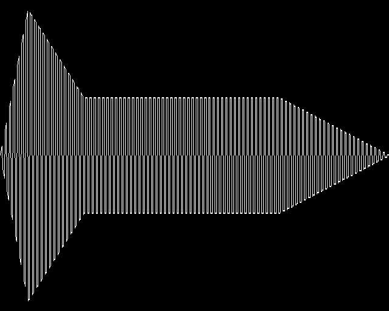
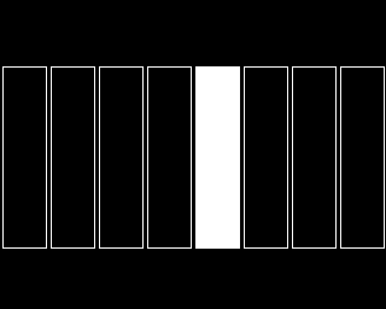

# Project 11 · SOUND & ENVELOPE

A BBC Micro had a sound chip with three channels for tones and one for noise, and BBC BASIC had two commands to drive it. `SOUND 1, -15, 53, 20` played middle C, loudly, for a second. `ENVELOPE` took *fourteen* numbers, which nobody could remember, and with them you could make a note swell, fade, wobble or go *pew*. Every game of the period was written with those two commands, and you can recognise the sound of the machine across a crowded room.

Your `beeb` package has graphics, and no sound. In this chapter it gets `sound` and `envelope`, and you'll make every note **out of nothing but arithmetic**. There are no sound files. A sound is a long row of numbers, and you're going to work the numbers out.



*One note, drawn with `beeb`'s graphics by the code that made the sound: it swells, falls back, holds, and dies away.*

That takes you down to the level of the machine: **bytes**, and the difference between a number and the way it's stored. Coming back up, you'll find that Project 6's generators might have been designed for the job. An oscillator is a generator that never ends, an envelope is one that does, and a note is what you get by zipping them together.

Then Breakout gets its blips, and to get them it has to *use* your `beeb` package from another project. That's the chapter's other subject: **packages that depend on packages**, which is how all Python software is put together.

| | |
|---|---|
| **You'll learn** | `bytes`, `bytearray` and `array`; endianness; the `wave` module; generators as signal processors; caching and mutability; wrapping a class in module-level functions; a model that reports events |
| **New tool skill** | Depending on your own package: `uv add --editable`, `[tool.uv.sources]`, and workspaces |
| **Time** | 5 hours |
| **Before you start** | [Project 10](p10-breakout.md), and your `beeb` project from [Project 8](p08-mode2-sketchpad.md) |

## Predict

!!! question "Predict"
    ```python
    data = bytes([72, 105, 255])
    print(data, len(data), data[0], list(data[1:]))
    print((1000).to_bytes(2, "little"), int.from_bytes(b"\xe8\x03", "little"))
    ```

??? success "Answer"
    ```text
    b'Hi\xff' 3 72 [105, 255]
    b'\xe8\x03' 1000
    ```

    A `bytes` object is a row of numbers from 0 to 255. Python *shows* it as text where it can, which is a courtesy and nothing more: 72 and 105 happen to be the codes for `H` and `i`. Index it, and you get a number. And 1,000 doesn't fit in one byte, so it takes two, with the small end first. Stage 1.

!!! question "Predict"
    ```python
    from array import array

    samples = array("h", [0, 1000, -1000])
    print(samples.itemsize, len(samples.tobytes()))
    samples.append(40_000)
    ```

??? success "Answer"
    ```text
    2 6
    Traceback (most recent call last):
      ...
    OverflowError: signed short integer is greater than maximum
    ```

    An `array` is a list that holds numbers of *one fixed size*: here `"h"`, which is two bytes each, with a sign. Python's own integers never overflow. A two-byte integer certainly does: it stops at 32,767. This is the chapter's bug hunt. Stage 1.

!!! question "Predict"
    ```python
    import itertools


    def ramp(n):
        for i in range(n):
            yield i / n


    wave = itertools.cycle([1, -1])
    print([w * level for w, level in zip(wave, ramp(4))])
    ```

??? success "Answer"
    ```text
    [0.0, -0.25, 0.5, -0.75]
    ```

    `wave` never ends, and `ramp(4)` has four items. `zip` stops when the shorter one runs out, so an endless generator is quite safe to zip, provided its partner is finite. That's the whole design of the synthesiser. Stage 2.

!!! question "Predict"
    ```python
    from functools import cache

    calls = 0


    @cache
    def note(pitch, length):
        global calls
        calls += 1
        return [pitch] * length


    a = note(53, 2)
    b = note(53, 2)
    print(calls, a is b)
    a.append(99)
    print(note(53, 2))
    ```

??? success "Answer"
    ```text
    1 True
    [53, 53, 99]
    ```

    `cache` doesn't hand you a copy of the answer it remembered. It hands you *the answer*, the very same object, every time. If that object can be changed, then one careless caller can spoil it for all the others, for the rest of the program's life. It's Project 4's aliasing, with a long memory. Stage 2 shows the way out.

## Build

### Stage 1: Bytes, and one second of middle C

This project isn't a new one. It's the next version of your `beeb` package, so carry on where you left off:

```console
$ cd making/beeb
$ git switch -c sound
$ code .
```

#### What a sound is

A loudspeaker is a paper cone that moves in and out. Move it in and out 262 times a second, and the air carries that to your ear as middle C. To make a sound, a computer sends the loudspeaker a stream of numbers, each saying *where the cone should be at this instant*, tens of thousands of times a second. Those numbers are *samples*. CDs have 44,100 of them a second. You'll use 22,050, which is quite enough for a machine that's pretending to be a BBC Micro. Each sample is a whole number from −32,768 to 32,767, since that's what fits in sixteen bits.

So one second of middle C is 22,050 numbers, and you could work them out with a `for` loop. The simplest wave of all is the *square wave*: fully out for half of each cycle, and fully in for the other half. It's the only wave the Beeb's sound chip could make, and that buzzy quality is the sound of 1982.

#### Numbers in memory

A Python list of 22,050 integers is 22,050 separate objects, each a great deal more than sixteen bits long. A sound card wants something plainer: two bytes for the first sample, two for the second, and so on, with nothing in between. Python has three types for raw memory of that kind.

**`bytes`** is a row of numbers from 0 to 255, which can't be changed, as a string of bytes. You met it briefly in Project 4, as what `"A●".encode()` gave you:

```pycon
>>> data = bytes([72, 105, 255])
>>> data
b'Hi\xff'
>>> data[0], len(data)
(72, 3)
>>> data.hex(" ")
'48 69 ff'
```

The `b'…'` form shows any byte that happens to be the code of a printable character *as* that character, and the rest as `\x` and two hexadecimal digits. Don't let it mislead you. These are numbers, and they're only text if somebody decides to read them that way. **`bytearray`** is the same thing, but changeable.

A sample needs two bytes, and that raises a question that's caused fifty years of trouble: *which byte comes first?*

```pycon
>>> (1000).to_bytes(2, "little")
b'\xe8\x03'
>>> (1000).to_bytes(2, "big")
b'\x03\xe8'
>>> int.from_bytes(b'\xe8\x03', "little")
1000
```

1,000 is 3 × 256 + 232, and 232 is `e8` in hexadecimal. *Little-endian* puts the small end first, as nearly every processor made today does, and as the WAV file format does. *Big-endian* puts the big end first, as network protocols do. Neither is right. You simply have to know which one you're dealing with.

**`array`** spares you from doing that by hand. It's a list of numbers that are all of one fixed size, packed together in memory as C would pack them. The type code `"h"` means "signed, sixteen bits":

```pycon
>>> from array import array
>>> samples = array("h", [0, 1000, -1000])
>>> samples.itemsize
2
>>> samples.tobytes().hex(" ")
'00 00 e8 03 18 fc'
>>> samples[1] = 2000
>>> array("h", b'\xe8\x03')
array('h', [1000])
```

You use it as you'd use a list. The differences are that it holds one kind of number only, that it takes a sixth of the memory, and that `tobytes()` gives you the raw bytes in one go. There's `1000` again, as `e8 03`, and −1,000 as `18 fc`: negative numbers are stored by counting backwards from 65,536.

!!! warning "Gotcha"
    This is where Python's never-overflowing integers stop. Try to put 40,000 into an `"h"` array and you get `OverflowError`, as in the second Predict. An error is the best you can hope for: in C the number would have quietly wrapped round to −25,536, and you'd have heard it as a loud click. Any arithmetic on samples has to stay inside ±32,767. That's this chapter's bug hunt.

#### A WAV file, from scratch

Create `examples/beep.py`:

<!-- listing: projects/11-sound-and-envelope/examples/beep.py -->
```python title="examples/beep.py"
"""Stage 1: one second of middle C, as a WAV file, from nothing but arithmetic."""

import wave
from array import array

RATE = 22_050
FREQUENCY = 261.63
LOUDEST = 32_767

period = RATE / FREQUENCY
samples = array("h")
for n in range(RATE):
    high = n % period < period / 2
    samples.append(LOUDEST // 2 if high else -LOUDEST // 2)

data = samples.tobytes()
print(f"{len(samples):,} samples, {len(data):,} bytes")
print("The first eight bytes:", data[:8].hex(" "))

with wave.open("beep.wav", "wb") as file:
    file.setnchannels(1)
    file.setsampwidth(2)
    file.setframerate(RATE)
    file.writeframes(data)
print("Saved beep.wav")
```

!!! example "Run it"
    ```console
    $ uv run examples/beep.py
    22,050 samples, 44,100 bytes
    The first eight bytes: ff 3f ff 3f ff 3f ff 3f
    Saved beep.wav
    ```

    Double-click `beep.wav`, or drag it into a browser window. That's middle C, as a Beeb would have played it, and you made it with a `for` loop. `ff 3f` is 16,383, which is half of full volume, with the small end first.

`n % period < period / 2` asks "are we in the first half of this cycle?" `period` is the number of samples in one cycle, about 84, and the `%` is the clock-face arithmetic of Project 1, on a float this time. The standard library's `wave` module writes the file's header, which says what the bytes mean: one channel, two bytes to a sample, 22,050 samples a second. After that, the file is your bytes and nothing else. `wave.open` is a context manager, so it's closed with `with`. Add `*.wav` to `.gitignore`.

!!! info "Coming from BBC BASIC"
    This is what `?` and `!` were for: `?&7C00 = 65` put a byte straight into memory, and `!` did the same for four of them. In Python you almost never want to. `bytes` and `array` are for the places where your program meets the world outside it: files, networks, and hardware.

!!! success "Checkpoint"
    ```console
    $ git add .
    $ git commit -m "Write a second of middle C to a WAV file"
    ```

### Stage 2: Oscillators, envelopes and notes

A square wave at one unvarying volume sounds like an alarm clock. What makes a note sound like a *note* is the way its loudness changes through its life. A piano is loud at once and then fades. A violin swells. A drum is over almost before it's begun. The usual way of describing that has four parts, and it's called *ADSR*:

- **Attack**: how long the note takes to reach full volume.
- **Decay**: how long it then takes to fall back, to the…
- **Sustain** level, where it stays for as long as the note is held.
- **Release**: how long it takes to die away at the end.

That's four numbers where the BBC's `ENVELOPE` wanted fourteen. (The other ten bent the *pitch* about, and one of the challenges does that.) The picture at the top of the chapter is an ADSR envelope, wrapped round a square wave.

Create `src/beeb/synth.py`. It has no Pygame in it, for the usual reason.

<!-- listing: projects/11-sound-and-envelope/src/beeb/synth.py -->
```python title="src/beeb/synth.py"
"""Making sounds out of arithmetic. There's no Pygame in here, and no loudspeaker.

A sound is a long row of numbers, called samples, each saying where the cone of
the loudspeaker should be at one instant. This module works them out.
"""

import itertools
import math
import random
from array import array
from collections.abc import Iterator
from dataclasses import dataclass
from functools import cache

RATE = 22_050  # samples a second
LOUDEST = 32_767  # the biggest number that fits in a signed 16-bit sample


@dataclass(frozen=True)
class Envelope:
    """How a note's loudness changes over its life. Times are in seconds."""

    attack: float = 0.0  # how long it takes to reach full volume
    decay: float = 0.0  # how long it takes to fall from there to the sustain level
    sustain: float = 1.0  # the level it holds at, from 0 to 1
    release: float = 0.0  # how long it takes to die away at the end


PLAIN = Envelope(attack=0.005, release=0.01)


def frequency_of(pitch: int) -> float:
    """Convert a BBC pitch number to hertz: 53 is middle C, and 4 units are a semitone."""
    return 261.63 * 2 ** ((pitch - 53) / 48)


def square(frequency: float) -> Iterator[float]:
    """Yield a square wave, for ever: 1.0 for half of each cycle, and -1.0 for the rest."""
    period = RATE / frequency
    for n in itertools.count():
        yield 1.0 if n % period < period / 2 else -1.0


def sine(frequency: float) -> Iterator[float]:
    """Yield a sine wave, for ever: the purest tone there is."""
    step = math.tau * frequency / RATE
    for n in itertools.count():
        yield math.sin(n * step)


def noise() -> Iterator[float]:
    """Yield random samples, for ever: a hiss."""
    rng = random.Random(1)
    while True:
        yield rng.uniform(-1.0, 1.0)
```

`Envelope` is a frozen dataclass, as `Settings` was in Breakout, and it's about to matter that it is. `frequency_of` is a piece of BBC lore. Pitch numbers went up in quarters of a semitone, and 53 was middle C. There are twelve semitones in an octave, which makes 48 units, and an octave is a doubling of frequency, and that's where `2 ** ((pitch - 53) / 48)` comes from.

#### A wave is a generator

Look at `square`. **It never ends.** It's Project 6's idea again, of a generator as a sequence without limit, from which somebody else will take as much as they want. `itertools.count()` is an endless `range`: 0, 1, 2, 3, and so on for ever. `sine` and `noise` have the same shape, which is *no arguments worth mentioning in, an endless stream of floats from −1 to 1 out*. An oscillator doesn't know how long its note will be, and doesn't need to. That's somebody else's job.

`noise` has its own `random.Random(1)`, which is Project 6's un-shared randomness. It makes the same hiss every time, and so it can be tested.

#### An envelope is a generator, too

<!-- listing: projects/11-sound-and-envelope/src/beeb/synth.py -->
```python title="src/beeb/synth.py"
def levels(envelope: Envelope, duration: float) -> Iterator[float]:
    """Yield the loudness, from 0 to 1, for every sample of a note, and then stop."""
    attack = int(envelope.attack * RATE)
    decay = int(envelope.decay * RATE)
    release = int(envelope.release * RATE)
    held = max(0, int(duration * RATE) - attack - decay)

    for n in range(attack):
        yield n / attack
    for n in range(decay):
        yield 1.0 - (1.0 - envelope.sustain) * n / decay
    for _ in range(held):
        yield envelope.sustain
    for n in range(release):
        yield envelope.sustain * (1.0 - n / release)


def samples(wave: Iterator[float], loudness: Iterator[float], volume: float) -> array:
    """Multiply a wave by its loudness, and pack the result as 16-bit samples."""
    top = LOUDEST * max(0.0, min(1.0, volume))
    return array("h", (int(top * w * level) for w, level in zip(wave, loudness)))
```

`levels` is a generator with four loops in it, one after another, one for each phase, and it yields the loudness for every sample of the note, as a number from 0 to 1. Unlike a wave, it's *finite*. It knows exactly how long the note is, and when it's been through the release, it stops.

And so `samples` needs no arithmetic about lengths whatever:

```python
array("h", (int(top * w * level) for w, level in zip(wave, loudness)))
```

`zip` takes a sample from the endless wave and a level from the finite envelope, time after time, until the envelope runs out, as it did in the third Predict. The generator expression multiplies them together and scales the result up to sixteen bits. The `array` soaks it all up. There are three generators there, one feeding another, and no list is ever built. **The wave says what the note sounds like, the envelope says how long and how loud, and neither knows that the other exists.** Anything that yields floats is a wave, so you can add a new one without touching anything else, which is the first Extend challenge.

This time the `zip` has no `strict=True`, and that's deliberate: the two are *meant* to be of different lengths.

#### Remembering notes, safely

<!-- listing: projects/11-sound-and-envelope/src/beeb/synth.py -->
```python title="src/beeb/synth.py"
@cache
def note(
    pitch: int, duration: float, envelope: Envelope = PLAIN, volume: float = 1.0
) -> bytes:
    """Return a square-wave note, as bytes ready to be played. Pitch 0 means noise.

    Notes are remembered, so they're returned as bytes, which can't be changed.
    A remembered array could be altered by one caller, and spoilt for the rest.
    """
    wave = noise() if pitch == 0 else square(frequency_of(pitch))
    return samples(wave, levels(envelope, duration), volume).tobytes()
```

A game plays the same few blips thousands of times over, and working a note out takes a few milliseconds, so `note` is wrapped in `functools.cache`, from Project 7. That decision has two consequences, and they're the chapter's two lessons about caching.

**Every argument has to be hashable**, because `cache` keeps its answers in a dictionary, with the arguments as the key. `pitch`, `duration` and `volume` are numbers. `envelope` is a dataclass of your own, and it can be a key only because it's *frozen*. An ordinary dataclass would raise `TypeError: unhashable type: 'Envelope'`, the first time you played a note.

**The answer ought to be immutable**, and that's the fourth Predict. `cache` returns the same object every time. If `note` returned an `array`, which can be changed, then a caller that turned one note down would have turned it down for everybody, for ever, and you'd have a bug whose cause and whose symptom were a thousand calls apart. So `note` returns `.tobytes()`. `bytes` can't be changed, so it's safe to share, and it's what the sound card wants in any case. As a rule: **cache what can't change.** If you must cache something that can, hand out copies of it.

#### See it

You have no loudspeaker code yet, but you do have a graphics library. Create `examples/scope.py`:

<!-- listing: projects/11-sound-and-envelope/examples/scope.py -->
```python title="examples/scope.py"
"""An oscilloscope: see the shape of the note that you're hearing."""

import beeb
from beeb.synth import LOUDEST, Envelope, levels, samples, square

SHAPE = Envelope(attack=0.05, decay=0.1, sustain=0.4, release=0.2)

beeb.mode(0)
beeb.envelope(1, SHAPE.attack, SHAPE.decay, SHAPE.sustain, SHAPE.release)
beeb.sound(1, 1, 5, 10)

data = samples(square(130.81), levels(SHAPE, 0.5), volume=1.0)
beeb.move(0, 512)
for x in range(0, beeb.WIDTH, 2):
    sample = data[x * len(data) // beeb.WIDTH]
    beeb.draw(x, 512 + 480 * sample / LOUDEST)

while True:
    beeb.vsync()
```

(It calls `beeb.envelope` and `beeb.sound`, which don't exist until the next stage. Leave those two lines out for now, or put up with a moment's suspense.)

!!! example "Run it"
    ```console
    $ uv run examples/scope.py
    ```

    You get the picture at the top of the chapter: a twentieth of a second of attack, a tenth of decay, a sustain at 40%, and a fifth of a second of release. Change the numbers in `SHAPE`, and watch the shape change. An oscilloscope is the debugger for sound.

Test it, in `tests/test_synth.py`. Samples are only numbers, so the tests are only arithmetic:

<!-- listing: projects/11-sound-and-envelope/tests/test_synth.py -->
```python title="tests/test_synth.py"
def test_a_square_wave_spends_half_its_time_at_each_level():
    second = list(islice(square(441), RATE))
    assert set(second) == {1.0, -1.0}
    assert second.count(1.0) == pytest.approx(RATE / 2, abs=50)
    assert second[:25] == [1.0] * 25
    assert second[25:50] == [-1.0] * 25
# ...
def test_an_envelope_rises_falls_holds_and_dies_away():
    shape = Envelope(attack=0.1, decay=0.1, sustain=0.5, release=0.1)
    loudness = list(levels(shape, duration=0.4))
    tenth = RATE // 10

    assert len(loudness) == 5 * tenth
    assert loudness[0] == 0.0
    assert loudness[tenth] == 1.0
    assert loudness[2 * tenth] == 0.5
    assert loudness[3 * tenth] == 0.5
    assert loudness[-1] == pytest.approx(0.0, abs=0.001)
    assert loudness[:tenth] == sorted(loudness[:tenth])
# ...
def test_notes_are_remembered():
    shape = Envelope(attack=0.01, decay=0.02, sustain=0.3, release=0.04)
    assert note(77, 0.2, shape) is note(77, 0.2, shape)
    assert note(77, 0.2, shape) is not note(81, 0.2, shape)
```

The middle test is the one to notice. It makes an envelope with a tenth of a second in each phase, and looks at the loudness at the boundaries: 0 at the start, 1 after the attack, a half after the decay, and nearly 0 at the end. The project in the repository has a dozen, with a parametrised one for the pitch numbers.

!!! success "Checkpoint"
    ```console
    $ git add .
    $ git commit -m "Add a synthesiser built from generators"
    ```

### Stage 3: `SOUND` and `ENVELOPE`

Now for the loudspeaker. Pygame's `mixer` module plays sounds. A `Sound` is made from a buffer of bytes, and is played on a numbered `Channel`, of which several can be going at once. Create `src/beeb/speaker.py`:

<!-- listing: projects/11-sound-and-envelope/src/beeb/speaker.py -->
```python title="src/beeb/speaker.py"
"""BBC Micro-style sound commands: SOUND and ENVELOPE, more or less.

The arithmetic is in beeb.synth. This module owns the loudspeaker.
"""

import pygame

from beeb.synth import PLAIN, RATE, Envelope, note

CHANNELS = 4  # channel 0 is the noise channel, and 1 to 3 play tones


class Speaker:
    """Pygame's mixer, with four channels and some numbered envelopes."""

    FORMAT = (RATE, -16, 1)  # samples a second, signed 16-bit, one channel (mono)

    def __init__(self) -> None:
        # pygame.init() may have opened the mixer already, in some other format,
        # in which case our samples would come out at the wrong speed and pitch.
        if pygame.mixer.get_init() != self.FORMAT:
            pygame.mixer.quit()
            pygame.mixer.init(*self.FORMAT, allowedchanges=0)
        self.channels = [pygame.mixer.Channel(n) for n in range(CHANNELS)]
        self.envelopes: dict[int, Envelope] = {}

    def envelope(self, number: int, envelope: Envelope) -> None:
        self.envelopes[number] = envelope

    def sound(self, channel: int, amplitude: int, pitch: int, duration: int) -> None:
        if not 0 <= channel < CHANNELS:
            raise ValueError(
                f"There are channels 0 to {CHANNELS - 1}, and no channel {channel}"
            )
        if amplitude > 0:
            shape, volume = self.envelopes.get(amplitude, PLAIN), 1.0
        else:
            shape, volume = PLAIN, min(-amplitude, 15) / 15
        if channel == 0:
            pitch = 0
        data = note(pitch, duration / 20, shape, volume)
        self.channels[channel].play(pygame.mixer.Sound(buffer=data))


_speaker: Speaker | None = None


def _the_speaker() -> Speaker:
    """Return the one Speaker, switching it on the first time it's wanted."""
    global _speaker
    if _speaker is None:
        _speaker = Speaker()
    return _speaker


def sound(channel: int, amplitude: int, pitch: int, duration: int) -> None:
    """Play a note: SOUND channel, amplitude, pitch, duration.

    amplitude is 0 (silent) down to -15 (loudest), or 1 to 4 to use an envelope.
    pitch is in quarters of a semitone, and 53 is middle C. duration is in
    twentieths of a second. A new note on a channel cuts off the one before.
    """
    _the_speaker().sound(channel, amplitude, pitch, duration)


def envelope(
    number: int,
    attack: float = 0.0,
    decay: float = 0.0,
    sustain: float = 1.0,
    release: float = 0.0,
) -> None:
    """Define envelope 1, 2, 3 or 4, for SOUND to use in place of an amplitude."""
    if not 1 <= number <= 4:
        raise ValueError("Envelopes are numbered from 1 to 4")
    _the_speaker().envelope(number, Envelope(attack, decay, sustain, release))
```

#### A class inside, and functions outside

There's state here: four channels, and a dictionary of envelopes. In Project 8 that would have been module-level variables, with `global` statements. Since Project 9 you've known better, so the state lives in a class, `Speaker`. But `beeb` is *supposed* to be used as plain functions: `beeb.sound(1, -15, 53, 20)` is the whole point of it. How do you have both?

With a pattern that's worth learning, since it's all over the standard library. **The class does the work.** The module keeps *one* instance of it, in `_speaker`, which is made the first time that anybody needs it. **The module-level functions are a thin front**, and pass everything on to that instance. Whoever uses the module sees two friendly functions. The class stays as testable as any other: you can make a `Speaker` of your own and do what you like to it. The `random` module works in just this way. `random.randint` is a method of one hidden `Random` instance, and `random.Random(1)` makes you another, as you've been doing since Project 6.

There's a single `global` statement, in `_the_speaker`, and it's an honest one: there really is only one loudspeaker. Making it *lazily*, on first use, means that `import beeb` doesn't switch the sound system on for a program that only wanted to draw lines.

!!! warning "Gotcha"
    `Speaker.__init__` doesn't simply call `pygame.mixer.init(…)`, and the reason cost a failing test to find. `pygame.init()`, which `beeb.mode()` calls, opens the mixer *as well*, with its own defaults: 44,100 samples a second, in stereo. A second `mixer.init` is quietly ignored. Your bytes would then have been played as if they were stereo, at twice the rate, which is four times too fast and two octaves too high. So the speaker checks what it's got, with `get_init()`, and closes and reopens the mixer if it's wrong. `allowedchanges=0` tells SDL not to "help" by choosing some other format that it thinks the hardware would like better.

    In general: when two pieces of code both believe that they own a device, find out which of them got there first.

The module is called `speaker.py`, and not `sound.py`, for a reason that also cost a failing test. A package can't have a module called `sound` *and* a function called `sound`, both as `beeb.sound`. Whichever is assigned last wins, and the loser becomes unreachable, in ways that depend on the order of your imports.

`amplitude` follows the BBC's odd convention. Nought and below is a plain volume, from 0, which is silent, to −15, which is the loudest. From 1 to 4, it's the *number of an envelope* instead. `duration` is in twentieths of a second, and channel 0 is always noise.

Open the front door. In `src/beeb/__init__.py`, add one import, and add `"envelope"` and `"sound"` to `__all__`:

<!-- listing: projects/11-sound-and-envelope/src/beeb/__init__.py -->
```python title="src/beeb/__init__.py"
from beeb.speaker import envelope, sound
```

and change the version in `pyproject.toml` to `0.2.0`. New features, with nothing broken, make a new *minor* version. There's more about version numbers in Project 27.

#### A tune, and a piano

<!-- listing: projects/11-sound-and-envelope/examples/tune.py -->
```python title="examples/tune.py"
"""Ode to Joy, on channel 1, with a bass note under each bar on channel 2."""

import beeb

# BBC pitch numbers: 4 to a semitone, and 53 is middle C.
C, D, E, F, G = 53, 61, 69, 73, 81
TUNE = [E, E, F, G, G, F, E, D, C, C, D, E, E, D, D]
LENGTHS = [4] * 12 + [6, 2, 8]

beeb.mode(2)
beeb.envelope(1, attack=0.01, decay=0.08, sustain=0.5, release=0.1)

for number, (pitch, length) in enumerate(zip(TUNE, LENGTHS, strict=True)):
    beeb.sound(1, 1, pitch, length)
    if number % 4 == 0:
        beeb.sound(2, -8, pitch - 96, 16)

    beeb.gcol(0, number % 7 + 1)
    beeb.move(number * 80 + 40, 0)
    beeb.draw(number * 80 + 40, (pitch - 40) * 20)
    for _ in range(length * 50 // 20):
        beeb.vsync()
```

!!! example "Run it"
    ```console
    $ uv run examples/tune.py
    ```

    Beethoven, in square waves, with a bar of colour for every note. The tune is on channel 1, with a plucked envelope. Under it, on channel 2, is a bass note at the start of each bar, 96 units lower, which is two octaves. The timing comes from `vsync`: a note of `length` twentieths of a second lasts for `length * 50 // 20` frames.

And an instrument. Create `examples/piano.py`:

<!-- listing: projects/11-sound-and-envelope/examples/piano.py -->
```python title="examples/piano.py"
"""A piano. The keys A S D F G H J K are the white notes, from middle C up to C.

W E T Y U are the black notes, where a real piano has them. 1 to 4 choose an
envelope, and the space bar is a drum. Escape quits.
"""

import beeb

WHITE = {"a": 53, "s": 61, "d": 69, "f": 73, "g": 81, "h": 89, "j": 97, "k": 101}
BLACK = {"w": 57, "e": 65, "t": 77, "y": 85, "u": 93}
KEY_WIDTH = beeb.WIDTH // len(WHITE)


def draw_keyboard(pressed: str) -> None:
    """Draw the white keys as outlines, with the one that's pressed filled in."""
    beeb.clg()
    for number, key in enumerate(WHITE):
        left, right = number * KEY_WIDTH + 8, (number + 1) * KEY_WIDTH - 8
        beeb.gcol(0, 3 if key == pressed else 7)
        if key == pressed:
            beeb.move(left, 200)
            beeb.move(right, 200)
            beeb.plot(85, left, 800)
            beeb.plot(85, right, 800)
        else:
            beeb.move(left, 200)
            beeb.draw(right, 200)
            beeb.draw(right, 800)
            beeb.draw(left, 800)
            beeb.draw(left, 200)


def main() -> None:
    beeb.mode(1)
    beeb.envelope(1, attack=0.005, decay=0.1, sustain=0.6, release=0.15)
    beeb.envelope(2, attack=0.2, decay=0.0, sustain=1.0, release=0.4)
    beeb.envelope(3, attack=0.0, decay=0.15, sustain=0.0, release=0.0)
    beeb.envelope(4, attack=0.0, decay=0.05, sustain=0.2, release=0.6)
    shape = 1
    pressed = ""
    channel = 1

    while True:
        key = beeb.inkey().lower()
        if key in WHITE or key in BLACK:
            pitch = WHITE.get(key) or BLACK[key]
            beeb.sound(channel, shape, pitch, 8)
            channel = channel % 3 + 1
            pressed = key
        elif key == " ":
            beeb.sound(0, 3, 0, 4)
        elif key.isdigit() and 1 <= int(key) <= 4:
            shape = int(key)
        draw_keyboard(pressed)
        beeb.vsync()


if __name__ == "__main__":
    main()
```

{ .pixels }

The keys ++a++ to ++k++ are the white notes, and ++1++ to ++4++ choose an envelope. Try them all: a piano, an organ that swells, a pluck, and a bell. The notes go round channels 1, 2 and 3 in turn (`channel % 3 + 1`), so that three of them can ring at once, as on the real machine, and the space bar is a snare drum, which is a very short burst of noise. `WHITE.get(key) or BLACK[key]` looks the key up in one dictionary, and falls back on the other.

The speaker's tests run with SDL's dummy *audio* driver, which `tests/conftest.py` has been setting all along, so that they're silent:

<!-- listing: projects/11-sound-and-envelope/tests/test_sound.py -->
```python title="tests/test_sound.py"
def test_a_positive_amplitude_means_an_envelope():
    beeb.envelope(2, attack=0.0, decay=0.0, sustain=1.0, release=0.5)
    beeb.sound(3, 2, 53, 10)
    long_note = pygame.mixer.Channel(3).get_sound().get_length()
    beeb.sound(3, -15, 53, 10)
    short_note = pygame.mixer.Channel(3).get_sound().get_length()
    assert long_note == pytest.approx(1.0, abs=0.01)
    assert short_note == pytest.approx(0.51, abs=0.01)


def test_the_mixer_is_in_our_format_even_if_pygame_got_there_first():
    pygame.mixer.quit()
    pygame.mixer.init(44_100, -16, 2)
    speaker._speaker = None
    beeb.sound(1, -15, 53, 10)
    assert pygame.mixer.get_init() == (22_050, -16, 1)
    assert pygame.mixer.Channel(1).get_sound().get_length() == pytest.approx(
        0.51, abs=0.01
    )
```

You can't test that something *sounds* right. You can test that the right channel is busy, that a note with a release is longer than one without, and that the mixer really is in your format even when Pygame got there first. That last test is the one that was written on the day of the gotcha.

!!! success "Checkpoint"
    Run, test, lint, diff, commit. Then merge, tag, and push:

    ```console
    $ git add .
    $ git commit -m "Add SOUND and ENVELOPE"
    $ git switch main
    $ git merge sound
    $ git branch -d sound
    $ git tag -a v0.2.0 -m "beeb 0.2.0: sound"
    $ git push --tags origin main
    ```

### Stage 4: Packages that use packages

Breakout is silent, and the means of making a noise is in a *different project*. You met this problem at the end of Project 4, when you wanted the Dice Lab's histogram, and you were promised the good answer. Here it is.

Everything you've ever `uv add`ed has come from PyPI. A dependency can just as well be a folder on your own disk:

```console
$ cd ../breakout
$ git switch -c sound
$ uv add --editable ../beeb
   Building beeb @ file:///Users/you/making/beeb
      Built beeb @ file:///Users/you/making/beeb
 + beeb==0.2.0 (from file:///Users/you/making/beeb)
```

Look at what that did to Breakout's `pyproject.toml`:

```toml
dependencies = [
    "beeb",
    "pygame-ce>=2.5.8",
]

[tool.uv.sources]
beeb = { path = "../beeb", editable = true }
```

`dependencies` says **what** Breakout needs: a package called `beeb`. That's the standard part, which any Python tool understands. `[tool.uv.sources]` says **where** uv should get it: from the folder next door, and not from PyPI. `editable` means what it meant for your own project in Project 5: Breakout's environment *points at* `../beeb/src`, and holds no copy of it, so that when you improve `beeb`, Breakout has the improvement at once.

`import beeb` now works in Breakout. This is the difference between a package and a loose file, and it's the reason you've laid every project out as a package since Project 5. A package has a name, a version and a list of what it needs, and any project can ask for it. Every library you've used was made in the way that you made `beeb`.

!!! note "Under the bonnet"
    A path like `../beeb` is fine on your own machine, and means nothing on anybody else's. There are three ways to grow out of it, and you'll use all of them in time.

    A **workspace** is for projects that are always developed together. You put them in one repository, with a `pyproject.toml` at the top that lists them as `members` under `[tool.uv.workspace]`. They then share a single lockfile and a single environment, and refer to one another with `beeb = { workspace = true }`.

    A **Git dependency**, `uv add git+https://github.com/you/beeb`, fetches a package straight from a repository, at a tag if you like. That's the use of Stage 3's `v0.2.0`.

    And in Project 27 you'll **publish** a package, after which `uv add beeb` works for everybody in the world.

#### The model says what happened

How should the game make a noise when the ball hits a brick? The quick way is to put `beeb.sound(…)` into `Game.hit_brick`. Don't. The model has been kept free of drawing for two projects, so that it could be tested with no window and used with any view. Sound is the same. A model that calls `beeb.sound` can't be tested without an audio system, and can't be used by anybody who'd like different noises, or none.

So the model doesn't *make* noises. It **reports what has happened**, and leaves it to whoever is interested to do something about it. In `Game.__init__`, in Breakout's `model.py`:

<!-- listing: projects/11-sound-and-envelope/noisy-breakout/src/breakout/model.py -->
```python title="src/breakout/model.py, in Game.__init__()"
        # What has just happened, for anybody who wants to know: "bat", "brick",
        # "wall", "lost" or "cleared". Whoever reads them should clear the list.
        self.events: list[str] = []
```

Then add one line at each place where something happens: `self.events.append("bat")` at the end of `hit_bat`, `"brick"` in `hit_brick`, `"lost"` in `lose_life`, and `"cleared"` in `next_level`. The walls need slightly more, since at the moment a wall and a brick share an `if`:

<!-- listing: projects/11-sound-and-envelope/noisy-breakout/src/breakout/model.py -->
```python title="src/breakout/model.py, in Game.update()"
        hit_wall = ball.rect.left < 0 or ball.rect.right > width
        if hit_wall or self.hit_brick():
            ball.rect.x -= step
            ball.vx = -ball.vx
            if hit_wall:
                self.events.append("wall")
```

and the same again for the ceiling. The model still knows nothing about sound. It keeps a list of plain strings.

Now, in `app.py`, `import beeb`, and add a table of noises:

<!-- listing: projects/11-sound-and-envelope/noisy-breakout/src/breakout/app.py -->
```python title="src/breakout/app.py"
# For each thing that can happen: a channel, an amplitude or envelope, a pitch and a duration.
SOUNDS = {
    "wall": (1, -7, 101, 1),
    "bat": (1, -12, 53, 2),
    "brick": (2, -12, 149, 1),
    "lost": (3, 1, 5, 14),
    "cleared": (3, 2, 101, 12),
}
```

Define two envelopes in `main`, after the view is made:

<!-- listing: projects/11-sound-and-envelope/noisy-breakout/src/breakout/app.py -->
```python title="src/breakout/app.py, in main()"
    beeb.envelope(1, decay=0.7, sustain=0.0)
    beeb.envelope(2, attack=0.05, decay=0.2, sustain=0.5, release=0.4)
```

and, in the loop, straight after `game.update(…)`:

<!-- listing: projects/11-sound-and-envelope/noisy-breakout/src/breakout/app.py -->
```python title="src/breakout/app.py, in main()"
        for event in game.events:
            beeb.sound(*SOUNDS[event])
        game.events.clear()
```

`beeb.sound(*SOUNDS[event])` spreads a tuple of four numbers out into four arguments, which is Project 7's star. The app reads the events, plays a noise for each, and empties the list. That's the whole of the connection.

A list of things that have happened, which one part of a program writes and another part reads, is an *event queue*. You've been at the receiving end of one since Project 8: `pygame.event.get()` is exactly that. It's one of the most useful patterns there is for keeping two parts of a program from knowing too much about each other. And it's as easy to test as a list:

<!-- listing: projects/11-sound-and-envelope/noisy-breakout/tests/test_events.py -->
```python title="tests/test_events.py"
def test_hitting_a_brick_is_an_event():
    game = served_game()
    brick = game.level.bricks[0]
    game.ball.rect.midtop = (brick.rect.centerx, brick.rect.bottom + 1)
    game.ball.vx, game.ball.vy = 0.0, -150
    game.update(0.02)
    assert game.events == ["brick"]
```

!!! example "Run it"
    ```console
    $ uv run breakout
    ```

    A low *bip* from the bat, a high *tick* from each brick, a click from the walls, and a long and mournful falling note when you miss. It's a different game with the sound on. All games are.

!!! success "Checkpoint"
    Run, test, lint, diff, commit, and merge.

    ```console
    $ git add .
    $ git commit -m "Make noises, with the beeb package"
    $ git switch main
    $ git merge sound
    ```

    `uv.lock` has changed, and belongs in the commit. If you publish this repository, remember that `../beeb` is only meaningful on a machine which has your `beeb` folder next door to it. The box above says what to do about that.

## Type-in listing

This one needs nothing but the standard library. Save it as `siren.py`, and run it with `uv run siren.py`. Then play `siren.wav`.

<!-- listing: projects/11-sound-and-envelope/siren.py -->
```python title="siren.py" linenums="1"
import math
import wave
from array import array

RATE = 22_050
SECONDS = 4

samples = array("h")
phase = 0.0
for n in range(RATE * SECONDS):
    wail = math.sin(math.tau * n / RATE * 0.5)
    frequency = 700 + 300 * wail
    phase += math.tau * frequency / RATE
    samples.append(int(20_000 * math.sin(phase)))

with wave.open("siren.wav", "wb") as file:
    file.setnchannels(1)
    file.setsampwidth(2)
    file.setframerate(RATE)
    file.writeframes(samples.tobytes())

print(f"Saved siren.wav: {len(samples):,} samples, {len(samples.tobytes()):,} bytes")
```

1. `wail` swings slowly between −1 and 1. How slowly? What does that do to `frequency`, and what do you hear?
2. Your `sine` generator worked out `math.sin(n * step)`. This program keeps a running total in `phase`, and adds to it. Why does it have to? Try the other way, with `math.sin(math.tau * frequency * n / RATE)`, and listen to what happens as the pitch changes.
3. Project 7 told you never to pile up small floating-point steps. Line 13 does exactly that, 88,200 times over. Why is it acceptable here? (What would an error of a millionth of a cycle sound like?)
4. Change the loudness from 20,000 to 40,000. What happens, and at which line?

## Bug hunt

A colleague wants chords: three notes at once, mixed into one sound. "Mixing is only adding," they say, and they're right. It's `chord.py`, in the project's `bughunt/` folder. Copy it into a `bughunt` folder in your `beeb` project.

```console
$ uv run bughunt/chord.py
Quietly...
And now loudly...
Traceback (most recent call last):
  ...
    return array("h", (sum(group) for group in zip(*notes, strict=True)))
OverflowError: signed short integer is less than minimum
```

The quiet chord plays. The loud one crashes.

1. **Reproduce it.** Then find out, at the REPL, what the largest sample in one loud note is, and what three of those add up to.
2. **Write a failing test** for `mix`, in `bughunt/test_chord.py`. You don't need real notes: `array("h", [30_000, -30_000])` is a loud enough one.
3. **Fix it.** There are at least two respectable ways. Which of them keeps a chord as loud as it can safely be? Which keeps a note exactly as it was, when it's mixed with nothing else?

??? tip "Hint"
    It's the second Predict. How many bits does it take to hold the sum of three 16-bit numbers?

??? success "Solution"
    Each sample can be anything up to 32,767. Three loud ones add up to nearly 100,000, which takes 18 bits, and an `"h"` array has 16. The quiet chord got away with it because 0.3 × 32,767 × 3 is still under the limit. It's the sort of bug that lies low through all your testing, and turns up when somebody turns up the volume.

    ```python
    def test_loud_notes_can_be_mixed():
        loud = array("h", [30_000, -30_000, 30_000])
        mixed = mix(loud, loud, loud)
        assert all(-LOUDEST <= sample <= LOUDEST for sample in mixed)
    ```

    The simplest fix is to take the *average*, and not the sum, which can never be out of range:

    ```python
    return array("h", (sum(group) // len(notes) for group in zip(*notes, strict=True)))
    ```

    It makes each note in a chord of three a third as loud, which is what a real mixing desk does. The other respectable way is to *clip*: add the samples up, and then force the total into range with `max(-LOUDEST, min(LOUDEST, total))`. That keeps quiet chords at full strength, and distorts loud ones, which you may even like. What you can't do is nothing.

    Be glad of the `OverflowError`. In most languages the sum would have wrapped round without a word, and you'd have been hunting for the cause of a nasty crackle.

## Challenges

Make a branch for each.

**Tweak**

1. Write a tune of your own. A pitch of 53 is middle C, and each semitone up is 4 more. Give it a bass line on channel 2, and a drum on channel 0.
2. Design four envelopes for `piano.py`: a flute, a bell, a bass guitar, and something nobody has heard before. Look at each of them in `scope.py`.
3. Give Breakout's bricks a different pitch for each row, so that the top rows ring higher. Does the model need to say *which* brick was hit? How little can you change?

**Extend**

1. **More waves.** Write a `triangle` generator, which climbs steadily from −1 to 1, and falls steadily back. It's softer than a square wave, and brighter than a sine. Draw it on the oscilloscope. Then give `note` a way of choosing its wave, remembering that whatever you pass to a cached function has to be hashable. (Is a function hashable?)
2. **Vibrato.** A note whose pitch wobbles a few times a second, as a singer's does. It's the type-in listing's trick: the frequency keeps changing, so the generator must keep a running `phase`. That's a small part of what the other ten numbers of `ENVELOPE` were for.
3. **Queued notes.** On the BBC, a `SOUND` on a channel that was busy waited its turn, so that a tune could be written as a plain list of `SOUND` statements. Pygame's `Channel.queue` holds only one sound. Give each of the `Speaker`'s channels a `deque` of notes to come, and a way of moving on to the next when the present one has finished. (`Channel.get_busy()`, called from `vsync`, will do it.)

??? tip "Hint for vibrato"
    Each sample moves the wave on by `math.tau * frequency / RATE` of a full circle. If `frequency` changes from one sample to the next, because it's being wobbled by a slow sine wave, then you can't work out the angle from `n` alone. You have to remember how far round you've got, and add to it.

**Invent**

1. **A drum machine.** Sixteen steps and four rows, of bass drum, snare, hi-hat and a bass note. The mouse switches steps on and off, and a bar sweeps across in time. Every sound is noise or a square wave, with a carefully chosen envelope.
2. **NumPy.** Work out a whole note at once, with no Python loop at all: `numpy.sign(numpy.sin(…))` is a square wave. How much faster is it? Does it matter, when notes are cached?
3. **`*FX` for the ears.** An echo is a copy of the sound, delayed and quieter, mixed back in with the original. It's a generator that remembers its last few thousand samples, and a `deque` with a `maxlen` is just the thing for that.

Solutions to the first two Extends are in the project's `solutions/` folder.

## Recap

You can now:

- [x] explain what a sample is, and how sixteen-bit sound is laid out in memory
- [x] use `bytes`, `bytearray` and `array`, and say what each of them is for
- [x] say what endianness is, and convert with `to_bytes` and `from_bytes`
- [x] write a WAV file with the `wave` module
- [x] build a signal chain from generators: endless oscillators, a finite envelope, and `zip`
- [x] explain why a cached function needs hashable arguments, and ought to return something immutable
- [x] put a class behind a front of module-level functions, with one instance made on first use
- [x] find out who opened a shared device first, and insist on the settings you need
- [x] depend on a package of your own, with `uv add --editable` and `[tool.uv.sources]`
- [x] say what workspaces and Git dependencies are for
- [x] have a model report events, and let the application decide what they mean

**Read more:** [Binary sequence types](https://docs.python.org/3/library/stdtypes.html#binary-sequence-types-bytes-bytearray-memoryview) · [`array`](https://docs.python.org/3/library/array.html) · [`wave`](https://docs.python.org/3/library/wave.html) · [`pygame.mixer`](https://pyga.me/docs/ref/mixer.html) · [uv: managing dependencies](https://docs.astral.sh/uv/concepts/projects/dependencies/) · [uv: workspaces](https://docs.astral.sh/uv/concepts/projects/workspaces/) · [The BBC Micro's `ENVELOPE` command](https://beebwiki.mdfs.net/ENVELOPE), all fourteen parameters of it

You have graphics, sound, and two games. Next comes a game that needs some mathematics. In [Project 12](p12-asteroids.md) a spaceship drifts, turns and fires, and rocks break into smaller rocks. It's Asteroids, and you can't write it without *vectors*. Python lets you make a type of your own that adds with `+`, scales with `*` and compares with `==`, as if it had always been part of the language.
