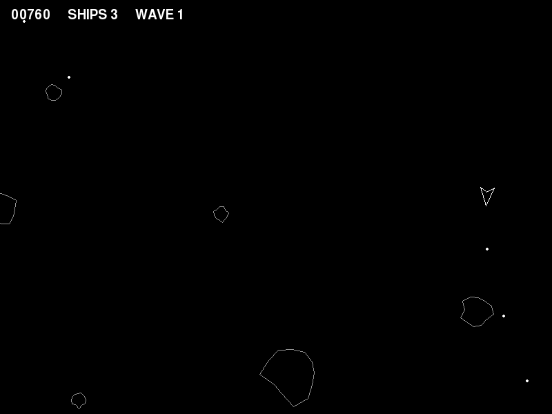
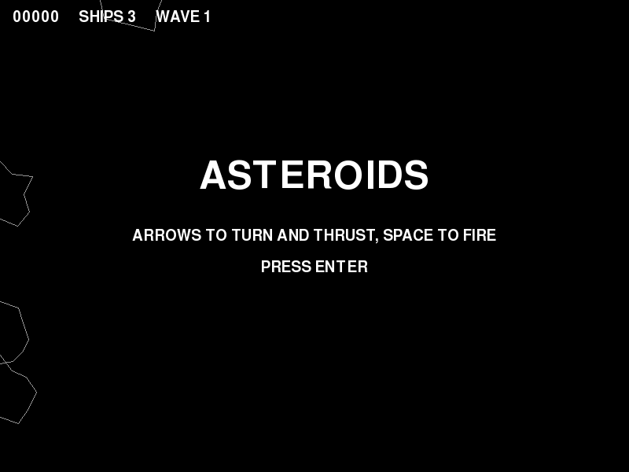

# Project 12 · Asteroids

A small triangular spaceship, adrift among tumbling rocks. It turns, it thrusts, and it goes on drifting in whatever direction it was last pushed, because there's no friction in space. Shoot a rock and it breaks in two. Shoot the pieces and they break again. Atari's Asteroids, of 1979, was drawn in glowing white lines on a black screen, and it was the first video game with real physics in it.



Snake lived on a grid, and Breakout was made of upright rectangles. Here, everything has a *position* that can be anywhere, a *velocity* that can point in any direction, and an *angle*. The mathematics of things like that is the mathematics of **vectors**, and the code is full of lines like "the new position is the old position plus the velocity times the time".

Wouldn't it be good if you could write exactly that?

```python
position = position + velocity * seconds
```

You can. `+` and `*` aren't reserved for numbers. Python lets any class say what they mean for *it*, and the same goes for `==`, `abs()`, `len()`, `in`, unpacking, `for` loops and a good deal besides. That's the **data model**, and it's the dunder methods that Project 4 said would become important. You'll write a `Vector` that behaves as if it had always been part of the language.

The second big idea is quieter, and goes deeper. The ship, the rocks and the bullets are three separate classes, and yet one function decides whether any two of them have collided. It doesn't ask what they *are*. It asks only that each has a position and a radius. That's **duck typing**, which has been at work in every chapter of this tutorial, and `typing.Protocol` is how you explain it to the type checker.

| | |
|---|---|
| **You'll learn** | The data model: `__add__`, `__mul__` and `__rmul__`, `NotImplemented`, `__neg__`, `__abs__`, `__bool__`, `__iter__`, `__eq__` and `__hash__`; immutable value types; duck typing and `Protocol`; physics by elapsed time; a generator of waves; the walrus operator |
| **New tool skill** | Pylance's `standard` mode. Resolving a merge conflict. |
| **Time** | 5 to 6 hours |
| **Before you start** | [Project 11](p11-sound-and-envelope.md) |

## Predict

!!! question "Predict"
    ```python
    class Money:
        def __init__(self, pence):
            self.pence = pence

        def __add__(self, other):
            return Money(self.pence + other.pence)

        def __eq__(self, other):
            return self.pence == other.pence

        def __repr__(self):
            return f"Money({self.pence})"


    print(Money(50) + Money(75))
    print(Money(5) == Money(5), Money(5) is Money(5))
    print(hash(Money(5)))
    ```

??? success "Answer"
    ```text
    Money(125)
    True False
    Traceback (most recent call last):
      ...
    TypeError: unhashable type: 'Money'
    ```

    `a + b` calls `a.__add__(b)`, and `a == b` calls `a.__eq__(b)`. The third line is the surprise. A class that defines `__eq__` *loses its hash*, and with it the ability to be put in a set, or to be the key of a dictionary: `{Money(5)}` fails in the same way. Python is looking after you. Stage 1 explains why, and what to do about it.

!!! question "Predict"
    ```python
    class V:
        def __init__(self, x):
            self.x = x

        def __mul__(self, k):
            return V(self.x * k)

        def __repr__(self):
            return f"V({self.x})"


    print(V(2) * 3)
    print(3 * V(2))
    ```

??? success "Answer"
    ```text
    V(6)
    Traceback (most recent call last):
      ...
    TypeError: unsupported operand type(s) for *: 'int' and 'V'
    ```

    `V(2) * 3` calls `V.__mul__`. `3 * V(2)` asks the *integer* first, and an integer has never heard of `V`. There's a second method, for when your object is on the right-hand side. Stage 1.

!!! question "Predict"
    ```python
    from typing import Protocol


    class Body(Protocol):
        radius: float


    class Rock:
        def __init__(self):
            self.radius = 20.0


    class Bullet:
        radius = 1.5


    def biggest(bodies: list[Body]) -> float:
        return max(body.radius for body in bodies)


    print(biggest([Rock(), Bullet()]))
    print(isinstance(Rock(), Body))
    ```

??? success "Answer"
    ```text
    20.0
    Traceback (most recent call last):
      ...
    TypeError: Instance and class checks can only be used with @runtime_checkable protocols
    ```

    Neither `Rock` nor `Bullet` mentions `Body`, and both of them *are* one, as far as `biggest` and the type checker are concerned, because each has a `radius`. A protocol describes a shape for a thing to fit, and isn't a family for it to belong to. That's also why `isinstance` makes no sense here: there's no family to be a member of. Stage 2.

!!! question "Predict"
    ```python
    class Vector:
        def __init__(self, x, y):
            self.x, self.y = x, y

        def __iter__(self):
            yield self.x
            yield self.y

        def __bool__(self):
            return self.x != 0 or self.y != 0


    v = Vector(3, 4)
    x, y = v
    print(x, y, list(v), max(v))
    print("moving" if v else "still", "moving" if Vector(0, 0) else "still")
    ```

??? success "Answer"
    ```text
    3 4 [3, 4] 4
    moving still
    ```

    Define `__iter__`, and your object works with unpacking, `list()`, `max()`, `for` and everything else that loops. Define `__bool__`, and it can stand as a condition. Python's built-in machinery isn't reserved for the built-in types. Stage 1.

## Build

### Stage 1: A vector that behaves like a number

```console
$ cd making
$ uv init asteroids
$ cd asteroids
$ uv add pygame-ce
$ uv add --editable ../beeb
$ uv add --dev pytest ruff
$ code .
```

The second `uv add` is Project 11's trick: your own `beeb` package, for the sound effects.

A *vector* is a pair of numbers, an `x` and a `y`, which stand for a position, or a movement, or a speed in some direction. Vectors add up: a move of `(3, 1)` and then a move of `(1, 2)` is a move of `(4, 3)`. They scale: twice `(3, 1)` is `(6, 2)`. Nearly all of the physics in this game is one line, `position + velocity * seconds`, and what you need is for Python to understand that line.

Create `src/asteroids/vector.py`:

<!-- listing: projects/12-asteroids/src/asteroids/vector.py -->
```python title="src/asteroids/vector.py"
"""A two-dimensional vector that works with Python's own operators."""

import math
from collections.abc import Iterator
from dataclasses import dataclass


@dataclass(frozen=True)
class Vector:
    """A direction and a length, or a point. It can't be changed once it's made."""

    x: float = 0.0
    y: float = 0.0

    @classmethod
    def from_polar(cls, length: float, degrees: float) -> "Vector":
        """Make a vector from its length, and its angle clockwise from straight up."""
        angle = math.radians(degrees)
        return cls(length * math.sin(angle), -length * math.cos(angle))

    def __add__(self, other: "Vector") -> "Vector":
        if not isinstance(other, Vector):
            return NotImplemented
        return Vector(self.x + other.x, self.y + other.y)

    def __sub__(self, other: "Vector") -> "Vector":
        if not isinstance(other, Vector):
            return NotImplemented
        return Vector(self.x - other.x, self.y - other.y)

    def __mul__(self, scale: float) -> "Vector":
        if not isinstance(scale, (int, float)):
            return NotImplemented
        return Vector(self.x * scale, self.y * scale)

    def __rmul__(self, scale: float) -> "Vector":
        return self * scale

    def __truediv__(self, scale: float) -> "Vector":
        if not isinstance(scale, (int, float)):
            return NotImplemented
        return Vector(self.x / scale, self.y / scale)
```

#### Operators are method calls

When Python sees `a + b`, it calls `a.__add__(b)`. That's the whole secret. `-` is `__sub__`, `*` is `__mul__`, and `/` is `__truediv__`. (`//` is `__floordiv__`, which explains the name.) Define those methods, and your class has those operators. Try it, with `uv run python`:

```pycon
>>> from asteroids.vector import Vector
>>> position = Vector(100, 100)
>>> velocity = Vector(30, -40)
>>> position + velocity * 0.5
Vector(x=115.0, y=80.0)
>>> position - velocity
Vector(x=70, y=140)
```

Each operator **returns a new `Vector`**, and leaves both of its operands as they were. That's how `+` works for numbers and for strings, and it's what anybody who reads `a + b` expects. An operator that changed `a` on the quiet would be a booby trap, and this chapter's bug hunt is about one.

#### The other way round

`velocity * 0.5` calls `Vector.__mul__`. But mathematicians write `0.5 * velocity`, and that's the second Predict. Python asks the left-hand operand first, and `(0.5).__mul__(velocity)` has no idea what a `Vector` is. It doesn't raise an exception. It *returns the special value `NotImplemented`*, which means "I can't do this, so ask somebody else". Python then tries the right-hand operand's *reflected* method, `velocity.__rmul__(0.5)`, and only if that fails as well do you get the `TypeError`. So:

```python
def __rmul__(self, scale: float) -> "Vector":
    return self * scale
```

Your own methods should be as polite. If `__add__` is handed something that it doesn't understand, it should `return NotImplemented`, and not raise, and not blunder on and fail somewhere deeper with an `AttributeError`. That gives the other operand its chance, and if nobody can help, Python raises the proper error on everybody's behalf:

```pycon
>>> Vector(1, 2) + 5
Traceback (most recent call last):
  ...
TypeError: unsupported operand type(s) for +: 'Vector' and 'int'
```

`isinstance(scale, (int, float))` takes a tuple, and asks "is it any of these?"

There's no `__iadd__` here, which is the method behind `+=`, and that's deliberate. When a class doesn't define it, Python treats `a += b` as `a = a + b`: it makes a new object, and re-ties the name. It's what happens with numbers and strings, and it's what ought to happen with any value that can't be changed.

#### Equality, and the hash that goes missing

Two vectors are equal when their parts are equal, and you haven't had to say so, since `@dataclass` writes `__eq__` for you. So what about the first Predict, and the hash that vanished?

Remember Project 4: a set finds its members, and a dictionary its keys, by their *hash*. For that to work, **two objects that are equal must have the same hash**, or else a set could hold two "equal" things in two different places, and never notice. The hash that every object starts out with is based on its identity, that is, on *which object it is*. The moment you define `__eq__` in terms of values, that hash has become a lie: two equal vectors would hash differently. So Python takes it away, and leaves your class unhashable, which is better than wrong.

To get it back, you'd define `__hash__` to match `__eq__`, which usually means `hash((self.x, self.y))`. That raises a second problem. If the object could *change*, its hash would change, and a set that was holding it would lose track of it. So the honest rule is: **only an object that can't change should be hashable**. `@dataclass(frozen=True)` does the whole job. It makes the fields read-only, writes an `__eq__` that compares them, and, *because* the class is frozen, writes a `__hash__` to go with it.

```pycon
>>> Vector(3, 4) == Vector(3, 4)
True
>>> len({Vector(3, 4), Vector(3, 4), Vector(4, 3)})
2
```

A `Vector` is therefore a *value*, as 7 is, and as `"hello"` is. You never change one. You work out a new one. After Project 4 that ought to come as a relief: nobody can ever alter a vector behind your back.

#### The rest of the data model

<!-- listing: projects/12-asteroids/src/asteroids/vector.py -->
```python title="src/asteroids/vector.py"
    def __neg__(self) -> "Vector":
        return Vector(-self.x, -self.y)

    def __abs__(self) -> float:
        return math.hypot(self.x, self.y)

    def __bool__(self) -> bool:
        return self.x != 0 or self.y != 0

    def __iter__(self) -> Iterator[float]:
        yield self.x
        yield self.y

    def rotated(self, degrees: float) -> "Vector":
        """Return this vector, turned clockwise by some degrees."""
        angle = math.radians(degrees)
        cos, sin = math.cos(angle), math.sin(angle)
        return Vector(self.x * cos - self.y * sin, self.x * sin + self.y * cos)

    def wrapped(self, width: float, height: float) -> "Vector":
        """Return this point, brought back onto a screen that wraps round."""
        return Vector(self.x % width, self.y % height)
```

```pycon
>>> v = Vector(3, 4)
>>> -v
Vector(x=-3, y=-4)
>>> abs(v)
5.0
>>> x, y = v
>>> tuple(v)
(3, 4)
>>> bool(Vector(0, 0))
False
```

`abs(v)` calls `v.__abs__()`, and the natural meaning of `abs` for a vector is its length. `__bool__` decides how a vector counts as a condition, so that `if ship.velocity:` means "if it's moving". And `__iter__` is a *generator method*, of two lines, which makes a `Vector` iterable, and that's why it can be unpacked, and turned into a tuple for Pygame.

Here's the general picture. You've been on the receiving end of all of these since Project 1. Now you know how they're done.

| You write | Python calls | You write | Python calls |
|---|---|---|---|
| `a + b` | `a.__add__(b)`, then `b.__radd__(a)` | `len(a)` | `a.__len__()` |
| `a * b` | `a.__mul__(b)`, then `b.__rmul__(a)` | `a[i]` | `a.__getitem__(i)` |
| `a += b` | `a.__iadd__(b)`, or else `a = a + b` | `x in a` | `a.__contains__(x)` |
| `-a`, `abs(a)` | `a.__neg__()`, `a.__abs__()` | `for x in a` | `a.__iter__()` |
| `a == b` | `a.__eq__(b)` | `a()` | `a.__call__()` |
| `a < b` | `a.__lt__(b)` | `bool(a)`, `if a:` | `a.__bool__()`, or else `len(a) != 0` |
| `hash(a)` | `a.__hash__()` | `repr(a)`, `str(a)` | `a.__repr__()`, `a.__str__()` |

You never call them by name. You write `len(x)`, and not `x.__len__()`, and that's the point of the arrangement: `len` works on every collection there is, including ones that haven't been written yet, because it's an agreement, and not a list of types.

!!! tip "Pythonic"
    Overload an operator only when its meaning is *obvious*. Adding vectors is obvious, and so is adding amounts of money, or joining paths with `/`. If you'd have to explain what `+` does to your class, write a method with a name. And keep the promises that the operator makes elsewhere: `+` doesn't change its operands, and `==` doesn't raise exceptions.

!!! info "Coming from C++, C# or Java"
    It's operator overloading, without a special syntax: a method with a magic name. Java has none, which is why Java code says `a.add(b).multiply(c)`. Where Python differs from C++ is in the two-sided dance with `NotImplemented` and `__rmul__`, which allows a new type to work with an old one that knows nothing about it.

`from_polar` is an alternative constructor, as in Breakout, and makes a vector from a length and an angle. This game measures angles **clockwise from straight up**, in degrees, since a ship pointing up the screen is the natural starting point. `y` increases *down* the screen, and that accounts for the minus sign. `rotated` is the standard formula for turning a vector about the origin, and `wrapped` is the clock-face `%` again, from Project 1, applied twice.

Test it all, in `tests/test_vector.py`. A value type is the easiest thing in the world to test:

<!-- listing: projects/12-asteroids/tests/test_vector.py -->
```python title="tests/test_vector.py"
def test_adding_leaves_both_vectors_alone():
    a, b = Vector(1, 2), Vector(3, 4)
    total = a + b
    assert (a, b, total) == (Vector(1, 2), Vector(3, 4), Vector(4, 6))


def test_plus_equals_makes_a_new_vector():
    position = start = Vector(1, 1)
    position += Vector(2, 2)
    assert position == Vector(3, 3)
    assert start == Vector(1, 1)


def test_scaling_works_from_either_side():
    assert Vector(1, 2) * 3 == Vector(3, 6)
    assert 3 * Vector(1, 2) == Vector(3, 6)
    assert Vector(3, 6) / 3 == Vector(1, 2)
# ...
def test_sum_works_given_a_vector_to_start_from():
    forces = [Vector(1, 0), Vector(0, 2), Vector(-3, 1)]
    assert sum(forces, Vector()) == Vector(-2, 3)
```

`sum` works on vectors, since all that it does is `+`. It starts from 0 by default, and `0 + Vector(…)` isn't defined, so you give it a vector to start from. The project in the repository has nineteen tests.

!!! note "Under the bonnet"
    Pygame has a `pygame.Vector2`, written in C, with all of this and more. Why write your own? Partly for the education. But there's a real difference too: **a `Vector2` can be changed**, and its `+=` changes it where it stands. Code that shares one, say by giving a bullet the ship's velocity to start with, gets aliasing bugs of just the kind that a frozen `Vector` makes impossible. If you ever need the speed, switch over, and copy with care. One of the challenges asks you to try it.

!!! success "Checkpoint"
    ```console
    $ git add .
    $ git commit -m "Add a Vector that adds, scales, compares and unpacks"
    ```

### Stage 2: Things in space

There are three kinds of thing in the game: a ship, rocks and bullets. They have a good deal in common, since each has a position, a velocity and a size, and each drifts and wraps round the edges of the screen. They differ in everything else.

If you've come from Java or C#, you'll be reaching for a base class called `SpaceObject`. Hold that thought until Project 15. Python has a lighter way of saying "these things are alike", and it's the way the language itself works.

Create `src/asteroids/model.py`:

<!-- listing: projects/12-asteroids/stages/stage2_model.py -->
```python title="src/asteroids/model.py"
"""The game of Asteroids: its rules and its state. There's no Pygame in here."""

import random
from dataclasses import dataclass
from typing import Protocol

from asteroids.vector import Vector

WIDTH, HEIGHT = 800, 600


@dataclass
class Controls:
    """What the player is asking for, at this moment."""

    turn: int = 0  # -1 for left, 1 for right
    thrust: bool = False
    fire: bool = False


class Body(Protocol):
    """Anything that has a place and a size, and so can hit things."""

    position: Vector
    radius: float


def touching(a: Body, b: Body) -> bool:
    """Are two bodies overlapping? Each of them is treated as a circle."""
    return abs(a.position - b.position) < a.radius + b.radius


@dataclass
class Zone:
    """A circle with nothing in it. It's a Body, because it has what a Body has."""

    position: Vector
    radius: float
```

#### Duck typing, and how to write it down

Look at `touching`. It works out the distance between two things, and compares it with the sum of their radii, which makes every object in the game a circle as far as collisions go. It will take a ship and a rock, a bullet and a rock, or two of anything, and the reason is that **it never asks what they are**. It uses `a.position` and `a.radius`, and whatever has those will do.

That's *duck typing*: if it walks like a duck and quacks like a duck, then for present purposes it's a duck. All of Python works this way, and you've relied on it since Project 1. `for` doesn't ask whether something is a list. It asks for the next item. `len` doesn't check a list of approved types. It calls `__len__`. `sum` added up your vectors without having heard of them. **What an object can do matters, and what it's called doesn't.**

Duck typing has one weakness, which is that the requirements are in nobody's head but yours. `def touching(a, b)` doesn't say what `a` must have, and the type checker can't help. A `Protocol` writes the requirements down:

```python
class Body(Protocol):
    position: Vector
    radius: float
```

That says: *a `Body` is anything that has a `position`, which is a `Vector`, and a `radius`, which is a `float`.* It's a description of a shape, and nothing more. **Nothing ever inherits from `Body`**, or mentions it, or registers with it. `Ship`, `Rock` and `Bullet`, below, never refer to it. They fit, and so Pylance accepts them wherever a `Body` is wanted. And if you pass in something that *doesn't* fit, a string say, or a rock from which you've forgotten the `radius`, you get a red squiggle at the call, before anything has run.

`Zone` shows how little is required. It's a dataclass with two fields, and it's a perfectly good `Body`, because it has what a `Body` has. The game uses it to ask "is there anything within 120 pixels of here?", with the very function that detects every collision.

This is called *structural* typing. It's the type checker's version of duck typing, and it's the third Predict: there's no family to belong to, which is why `isinstance(rock, Body)` is refused. Hints like `Iterator[float]` and `Callable[[complex], float]`, from earlier projects, are protocols of the same sort, which the standard library has written for you.

`Controls` is a plain dataclass, and says what the player wants at this moment. The model never sees a key code, for the same reason that it never sees a pixel.

#### The ship

<!-- listing: projects/12-asteroids/stages/stage2_model.py -->
```python title="src/asteroids/model.py"
class Ship:
    TURN_SPEED = 240.0  # degrees a second
    THRUST = 260.0  # pixels a second, every second
    DRAG = 0.4  # the fraction of its speed that it loses every second
    RELOAD = 0.22  # seconds between shots
    OUTLINE = (Vector(0, -14), Vector(10, 12), Vector(0, 6), Vector(-10, 12))

    def __init__(self, position: Vector) -> None:
        self.position = position
        self.velocity = Vector()
        self.heading = 0.0  # degrees clockwise from straight up
        self.radius = 10.0
        self.reloading = 0.0
        self.thrusting = False

    def update(self, seconds: float, controls: Controls) -> None:
        self.heading = (self.heading + controls.turn * self.TURN_SPEED * seconds) % 360
        self.thrusting = controls.thrust
        if controls.thrust:
            self.velocity += Vector.from_polar(self.THRUST * seconds, self.heading)
        self.velocity *= 1 - self.DRAG * seconds
        self.position = (self.position + self.velocity * seconds).wrapped(WIDTH, HEIGHT)
        self.reloading = max(0.0, self.reloading - seconds)

    def fire(self) -> "Bullet | None":
        """Return a new bullet, leaving from the nose, or None if the gun isn't ready."""
        if self.reloading > 0:
            return None
        self.reloading = self.RELOAD
        nose = self.position + Vector.from_polar(14, self.heading)
        return Bullet(
            nose, self.velocity + Vector.from_polar(Bullet.SPEED, self.heading)
        )

    def outline(self) -> list[Vector]:
        return [self.position + point.rotated(self.heading) for point in self.OUTLINE]

    def __repr__(self) -> str:
        return f"Ship(at={self.position}, heading={self.heading:.0f})"


class Bullet:
    SPEED = 420.0
    LIFETIME = 1.1

    def __init__(self, position: Vector, velocity: Vector) -> None:
        self.position = position
        self.velocity = velocity
        self.radius = 1.5
        self.age = 0.0

    def update(self, seconds: float) -> None:
        self.position = (self.position + self.velocity * seconds).wrapped(WIDTH, HEIGHT)
        self.age += seconds

    @property
    def spent(self) -> bool:
        return self.age >= self.LIFETIME
```

Here's what the `Vector` was for. `update` is physics, written down very nearly as a physicist would write it:

```python
self.velocity += Vector.from_polar(self.THRUST * seconds, self.heading)
self.velocity *= 1 - self.DRAG * seconds
self.position = (self.position + self.velocity * seconds).wrapped(WIDTH, HEIGHT)
```

Thrust adds a little velocity in the direction that the ship is *pointing*. The velocity then moves the position, in whatever direction the ship happens to be *going*, and those are two different directions. That's why you can turn round and fire backwards at whatever is chasing you, and it's what gives the game its feel. A little drag makes the ship easier to fly than a real one would be. Every quantity is multiplied by `seconds`, as in Snake, so that the game runs at the same speed on any machine.

Both of the `+=`s make a new `Vector` and re-tie `self.velocity` to it. Nothing is changed in place, and so `fire` can safely hand the bullet `self.velocity + …`. The new vector owes nothing to the ship's.

`fire` returns a `Bullet`, or `None` if the gun is still reloading. `"Bullet | None"` is in quotes because `Bullet` hasn't been defined yet, at that point in the file. `outline` turns the ship's shape, which is four points drawn round the origin, to the present heading, and moves it to the present position. That's a comprehension, with one line of vector arithmetic in it.

`Bullet` has a read-only property, `spent`, of the kind you met in Breakout. Nobody stores whether a bullet is used up. It's worked out from its age.

#### The rocks

<!-- listing: projects/12-asteroids/stages/stage2_model.py -->
```python title="src/asteroids/model.py"
# For each size of rock, from big to small: how big it is, and what it's worth.
ROCK_RADII = {3: 40.0, 2: 22.0, 1: 11.0}
ROCK_POINTS = {3: 20, 2: 50, 1: 100}


class Rock:
    def __init__(
        self, position: Vector, velocity: Vector, size: int, rng: random.Random
    ) -> None:
        self.position = position
        self.velocity = velocity
        self.size = size
        self.radius = ROCK_RADII[size]
        self.spin = rng.uniform(-90, 90)
        self.angle = 0.0
        # A lumpy outline: a dozen points round a circle, each pushed in or out a bit.
        self.shape = [
            Vector.from_polar(self.radius * rng.uniform(0.75, 1.2), degrees)
            for degrees in range(0, 360, 30)
        ]

    def update(self, seconds: float) -> None:
        self.position = (self.position + self.velocity * seconds).wrapped(WIDTH, HEIGHT)
        self.angle = (self.angle + self.spin * seconds) % 360

    def split(self, rng: random.Random) -> list["Rock"]:
        """Return the two smaller rocks that this one breaks into, or none at all."""
        if self.size == 1:
            return []
        return [
            Rock(self.position, self.velocity.rotated(turn) * 1.4, self.size - 1, rng)
            for turn in (rng.uniform(20, 70), rng.uniform(-70, -20))
        ]

    def outline(self) -> list[Vector]:
        return [self.position + point.rotated(self.angle) for point in self.shape]

    def __repr__(self) -> str:
        return f"Rock(size={self.size}, at={self.position})"
```

Every rock makes up its own lumpy outline when it's created, as twelve points round a circle, each pushed in or out a little at random, and then spins at a speed of its own. `split` returns the two smaller rocks that it breaks into, which fly apart on either side of the way the parent was going, 40% faster, or an empty list if it was one of the small ones.

The two tables are at module level, and aren't class attributes, for Project 9's reason. A dictionary at class level is mutable state that all the instances share, and Ruff won't have it (rule `RUF012`).

Every class takes `rng` as an argument, and makes nothing random for itself. That's Project 6's discipline, and it's why this can be tested exactly. Create `tests/test_model.py`:

<!-- listing: projects/12-asteroids/tests/test_model.py -->
```python title="tests/test_model.py"
def test_touching_works_for_anything_with_a_position_and_a_radius(rng):
    rock = Rock(Vector(100, 100), Vector(), 3, rng)
    assert touching(rock, Zone(Vector(130, 100), 5))
    assert not touching(rock, Zone(Vector(160, 100), 5))
    assert touching(Bullet(Vector(100, 139), Vector()), rock)
    assert touching(Ship(Vector(100, 60)), rock)
# ...
def test_thrust_speeds_the_ship_up_the_way_it_is_facing():
    ship = Ship(Vector(400, 300))
    ship.heading = 90
    ship.update(0.1, Controls(thrust=True))
    assert ship.velocity.x > 20
    assert ship.velocity.y == pytest.approx(0, abs=1e-9)
    assert ship.position.x > 400
# ...
def test_a_big_rock_splits_into_two_smaller_faster_ones(rng):
    rock = Rock(Vector(100, 100), Vector(40, 0), 3, rng)
    pieces = rock.split(rng)
    assert [piece.size for piece in pieces] == [2, 2]
    assert all(piece.position == rock.position for piece in pieces)
    assert all(abs(piece.velocity) == pytest.approx(56) for piece in pieces)
    assert pieces[0].velocity != pieces[1].velocity
```

The first of those gives `touching` four different types in five lines, and that's the protocol earning its keep. The imports at the top of the file, and the two fixtures, are in the project in the tutorial's repository, along with fifteen more tests.

!!! success "Checkpoint"
    ```console
    $ git add .
    $ git commit -m "Add a ship, bullets and rocks, and a protocol for what collides"
    ```

### Stage 3: Waves of rocks, and the game

When the last rock has gone, more arrive: four of them in the first wave, five in the second, and a little faster each time, for ever. "For ever" ought to ring a bell. Add these imports to `model.py`:

```python
from collections.abc import Iterator
from enum import Enum, auto
```

and then the rest of the file:

<!-- listing: projects/12-asteroids/src/asteroids/model.py -->
```python title="src/asteroids/model.py"
def waves(rng: random.Random) -> Iterator[list[Rock]]:
    """Yield the rocks for wave after wave, for ever: more of them, and faster, each time."""
    number = 0
    while True:
        number += 1
        rocks = []
        for _ in range(min(3 + number, 11)):
            # Start on an edge of the screen, well away from the ship in the middle.
            along = rng.uniform(0, WIDTH)
            position = (
                Vector(along, 0) if rng.random() < 0.5 else Vector(0, along % HEIGHT)
            )
            velocity = Vector.from_polar(
                rng.uniform(30, 50 + 8 * number), rng.uniform(0, 360)
            )
            rocks.append(Rock(position, velocity, 3, rng))
        yield rocks


class State(Enum):
    TITLE = auto()
    PLAYING = auto()
    GAME_OVER = auto()


class Game:
    """One game of Asteroids: a ship, some rocks, some bullets, a score and some lives."""

    def __init__(self, rng: random.Random | None = None) -> None:
        self.rng = rng or random.Random()
        self.state = State.TITLE
        self.best = 0
        self.events: list[str] = []
        self.restart()

    def restart(self) -> None:
        self.score = 0
        self.lives = 3
        self.wave = 0
        self.waves = waves(self.rng)
        self.bullets: list[Bullet] = []
        self.rocks: list[Rock] = []
        self.ship = Ship(Vector(WIDTH / 2, HEIGHT / 2))
        self.next_wave()

    def next_wave(self) -> None:
        self.wave += 1
        self.rocks = next(self.waves)

    def start(self) -> None:
        if self.state is not State.PLAYING:
            self.restart()
            self.state = State.PLAYING

    def update(self, seconds: float, controls: Controls) -> None:
        """Let some time go by. On the title screen the rocks drift, and that's all."""
        for rock in self.rocks:
            rock.update(seconds)
        if self.state is not State.PLAYING:
            return

        self.ship.update(seconds, controls)
        if controls.fire and (bullet := self.ship.fire()):
            self.bullets.append(bullet)
            self.events.append("fire")
        for bullet in self.bullets:
            bullet.update(seconds)
        self.bullets = [bullet for bullet in self.bullets if not bullet.spent]

        self.shoot_rocks()
        if any(touching(self.ship, rock) for rock in self.rocks):
            self.lose_life()
        if not self.rocks:
            self.next_wave()

    def shoot_rocks(self) -> None:
        for bullet in list(self.bullets):
            for rock in list(self.rocks):
                if touching(bullet, rock):
                    self.bullets.remove(bullet)
                    self.rocks.remove(rock)
                    self.rocks.extend(rock.split(self.rng))
                    self.score += ROCK_POINTS[rock.size]
                    self.best = max(self.best, self.score)
                    self.events.append("bang")
                    break

    def lose_life(self) -> None:
        self.lives -= 1
        self.events.append("crash")
        if self.lives == 0:
            self.state = State.GAME_OVER
            return
        # A new ship, in the middle. Clear a space round it, so that it has a chance.
        self.ship = Ship(Vector(WIDTH / 2, HEIGHT / 2))
        safe = Zone(self.ship.position, 120)
        self.rocks = [rock for rock in self.rocks if not touching(safe, rock)]
```

`waves` is an endless generator, like `generations` in Life. Each `next(self.waves)` runs it as far as the next `yield`, and gets back a new list of rocks. It remembers which wave it has got to, in its own local `number`, so the `Game` needs no counter, no table of levels, and nothing to tell it what comes after wave nine. And `restart` gets a new sequence by making a new generator.

Most of `Game` is the pattern of the last three projects: a state machine, some composition, `update(seconds, …)`, and Project 11's list of events, for the sound. Two details are new.

```python
if controls.fire and (bullet := self.ship.fire()):
    self.bullets.append(bullet)
```

`:=` is the *walrus operator*. (Turn your head to the left.) It assigns a value to a name **and** gives you that value, inside an expression. Here it calls `fire()`, keeps the answer as `bullet`, and tests it, all in one place, so that a bullet is added only if one came out. Without it, you'd call `fire()` on one line and test the result on the next, which is quite all right too. Use the walrus where it removes a real repetition, as it does in `while (line := file.readline()):`, and nowhere else.

```python
for bullet in list(self.bullets):
    for rock in list(self.rocks):
```

`shoot_rocks` removes bullets and rocks from lists while it's looping over them, and that's a well-known way of coming to grief: take an item out of a list that you're iterating over, and the loop skips the one after it. `list(self.bullets)` makes a copy to loop over, so that the original can be altered in safety. The `break` leaves the inner loop as soon as a bullet has hit something, since a bullet can only hit one rock.

On the title screen the rocks drift about behind the words, which costs two lines at the top of `update`, and looks well.

Now the view. It's the simplest one yet, since everything is an outline. Create `src/asteroids/view.py`:

<!-- listing: projects/12-asteroids/src/asteroids/view.py -->
```python title="src/asteroids/view.py"
"""Drawing the game, in white lines on black, as the arcade machine did."""

from typing import Protocol

import pygame

from asteroids.model import Game, State
from asteroids.vector import Vector

WHITE = (255, 255, 255)
GREY = (150, 150, 150)


class Shape(Protocol):
    """Anything that can say what its outline is can be drawn."""

    def outline(self) -> list[Vector]: ...


class View:
    def __init__(self, game: Game, window: pygame.Surface) -> None:
        self.game = game
        self.window = window
        self.big = pygame.font.Font(None, 72)
        self.small = pygame.font.Font(None, 28)

    def polygon(self, shape: Shape, colour: tuple[int, int, int] = WHITE) -> None:
        points = [tuple(point) for point in shape.outline()]
        pygame.draw.polygon(self.window, colour, points, width=1)

    def text(self, font: pygame.font.Font, message: str, y: int) -> None:
        image = font.render(message, True, WHITE)
        x = (self.window.get_width() - image.get_width()) // 2
        self.window.blit(image, (x, y))

    def draw(self) -> None:
        game = self.game
        self.window.fill("black")

        for rock in game.rocks:
            self.polygon(rock, GREY)
        for bullet in game.bullets:
            pygame.draw.circle(self.window, WHITE, tuple(bullet.position), 2)
        if game.state is State.PLAYING:
            self.polygon(game.ship)
            if game.ship.thrusting:
                tail = game.ship.position + Vector.from_polar(-16, game.ship.heading)
                pygame.draw.circle(self.window, WHITE, tuple(tail), 3, width=1)

        status = f"{game.score:05}     SHIPS {game.lives}     WAVE {game.wave}"
        self.window.blit(self.small.render(status, True, WHITE), (16, 12))
        match game.state:
            case State.TITLE:
                self.text(self.big, "ASTEROIDS", 200)
                self.text(self.small, "ARROWS TO TURN AND THRUST, SPACE TO FIRE", 290)
                self.text(self.small, "PRESS ENTER", 330)
            case State.GAME_OVER:
                self.text(self.big, "GAME OVER", 220)
                self.text(self.small, f"BEST {game.best:05}     PRESS ENTER", 300)
```

There's a second protocol, `Shape`: anything with an `outline()` method that returns a list of vectors. `View.polygon` will draw any `Shape`, and at the moment that means ships and rocks. The `...` is how you write a method's body in a protocol, where there's nothing to say. `tuple(point)` works because of `__iter__`. This time nothing is drawn small and scaled up: the arcade machine's display was famous for its needle-sharp lines.

And `src/asteroids/app.py`, with `asteroids = "asteroids.app:main"` in `pyproject.toml`:

<!-- listing: projects/12-asteroids/src/asteroids/app.py -->
```python title="src/asteroids/app.py"
"""The program: a window, a loop, the keyboard and the loudspeaker."""

import beeb
import pygame

from asteroids.model import HEIGHT, WIDTH, Controls, Game
from asteroids.view import View

FRAME_RATE = 60

# For each thing that can happen: a channel, an envelope, a pitch and a duration.
SOUNDS = {
    "fire": (1, 1, 180, 3),
    "bang": (0, 2, 0, 8),
    "crash": (0, 3, 0, 30),
}


def controls(pressed: pygame.key.ScancodeWrapper) -> Controls:
    """Read the keys that are being held down."""
    return Controls(
        turn=int(pressed[pygame.K_RIGHT]) - int(pressed[pygame.K_LEFT]),
        thrust=bool(pressed[pygame.K_UP]),
        fire=bool(pressed[pygame.K_SPACE]),
    )


def main() -> None:
    pygame.init()
    window = pygame.display.set_mode((WIDTH, HEIGHT), pygame.SCALED | pygame.RESIZABLE)
    pygame.display.set_caption("Asteroids")
    clock = pygame.time.Clock()

    game = Game()
    view = View(game, window)
    beeb.envelope(1, decay=0.12, sustain=0.0)
    beeb.envelope(2, decay=0.4, sustain=0.0)
    beeb.envelope(3, attack=0.02, decay=1.4, sustain=0.0)

    running = True
    while running:
        for event in pygame.event.get():
            if event.type == pygame.QUIT:
                running = False
            elif event.type == pygame.KEYDOWN:
                if event.key == pygame.K_ESCAPE:
                    running = False
                elif event.key == pygame.K_RETURN:
                    game.start()

        seconds = min(clock.tick(FRAME_RATE) / 1000, 1 / 20)
        game.update(seconds, controls(pygame.key.get_pressed()))
        for event in game.events:
            beeb.sound(*SOUNDS[event])
        game.events.clear()

        view.draw()
        pygame.display.flip()

    pygame.quit()
```

`controls` turns the state of the keyboard into a `Controls`, as `steering` did in Breakout. The sounds are all envelopes. The shot is a very short, high note, which dies away at once. The explosions are noise, on channel 0: a short burst for a rock, and a long one for the ship.

!!! example "Run it"
    ```console
    $ uv run asteroids
    ```

    

    ++enter++ starts a game. Steer with ++left++ and ++right++, thrust with ++up++, and fire with ++space++. Thrust gently, because you haven't any brakes.

!!! success "Checkpoint"
    Run, test, lint, diff, commit.

    ```console
    $ git add .
    $ git commit -m "Add waves, the game, the view and the sounds"
    ```

### Stage 4: A stricter checker, and a conflict

#### Pylance, turned up

You've had the type checker in `basic` mode since Project 4. Now that your code has protocols, optional values and classes that use one another, it can stand more scrutiny. In your user settings:

```json
    "python.analysis.typeCheckingMode": "standard"
```

`standard` checks more carefully whether one thing may be used where another is expected. Make some deliberate mistakes, to see what it says. In `Rock.__init__`, change `self.radius` to `self.size_in_pixels`. The rock still works, but it's no longer a `Body`, and every call of `touching(…, rock)` goes red:

```text
Argument of type "Rock" cannot be assigned to parameter "b" of type "Body"
  "radius" is not present
```

The checker has compared the *shape* of a `Rock` with the shape that `Body` asks for, and says exactly which part is missing. Put it back. Then, in `Game.update`, take away the walrus's guard, so that the line reads `self.bullets.append(self.ship.fire())`:

```text
Argument of type "Bullet | None" cannot be assigned to parameter "object" of type "Bullet"
```

You declared that `fire` might return `None`, and that `bullets` is a list of `Bullet`s, and the checker is holding you to both. A `None` in that list would have crashed the game a frame later, in a different function, with `'NoneType' object has no attribute 'update'`. Put that back, too. There's one more setting above this, `strict`, which you'll meet in Project 17.

#### Two branches, one line

In Project 5 you merged a branch, and it was a *fast-forward*: `main` hadn't moved, so Git had only to slide a label along. Real projects aren't so tidy. It's time to see what happens when two lines of work have both changed the same thing.

Make a branch, and tune the ship on it:

```console
$ git switch -c tuning
```

Change `TURN_SPEED = 240.0` to `300.0`, try the game, and commit:

```console
$ git commit -am "Make the ship turn faster"
$ git switch main
```

Now suppose that, back on `main`, you, or a colleague, or you on a different day, decide that the ship ought to be *gentler*. Change the same line to `200.0`, and commit that:

```console
$ git commit -am "Make the ship turn more gently"
$ git merge tuning
Auto-merging src/asteroids/model.py
CONFLICT (content): Merge conflict in src/asteroids/model.py
Automatic merge failed; fix conflicts and then commit the result.
```

Don't be alarmed. Git merges changes to *different* lines by itself, and does it all day without your noticing. When two branches change the *same* line, it won't guess which you meant. It stops and asks. Nothing has been lost, and `git merge --abort` would put everything back exactly as it was. Look at the file:

```text
class Ship:
<<<<<<< HEAD
    TURN_SPEED = 200.0  # degrees a second
=======
    TURN_SPEED = 300.0  # degrees a second
>>>>>>> tuning
    THRUST = 260.0  # pixels a second, every second
```

Between `<<<<<<< HEAD` and `=======` is `main`'s version of the line. Between `=======` and `>>>>>>> tuning` is the branch's. Your job is to edit that region until it says what you really want, and to take the three marker lines out. What you want may be one version, or the other, or something that's neither. VS Code helps: above the conflict it offers **Accept Current Change**, **Accept Incoming Change** and **Accept Both Changes**, and there's a **Resolve in Merge Editor** button, which shows the two versions side by side, with the result beneath. Settle on 270, which is a compromise, as they usually are. Then tell Git that you've finished:

```console
$ uv run pytest
$ git add src/asteroids/model.py
$ git commit
$ git branch -d tuning
```

Run the tests *before* you commit, since a merge is new code, which nobody has ever run. `git commit` with no `-m` opens an editor with a message already written for you, which you need only save. Then look at the history:

```console
$ git log --oneline --graph
*   960f63e Merge branch 'tuning'
|\
| * 5c59356 Make the ship turn faster
* | 6f263f0 Make the ship turn more gently
|/
* 88ac4f0 Add waves, the game, the view and the sounds
```

There's the fork, and there's the join. The top commit is a *merge commit*. It has two parents, and it records your decision.

!!! warning "Gotcha"
    If you ever find `<<<<<<<` in a file that you've committed, somebody has committed a conflict without resolving it. It isn't valid Python, and the tests would have said so at once. Search the project for seven `<` signs before every merge commit, until running the tests first has become a habit.

Conflicts become rare if you merge often, and keep your branches short. A branch that's two hours old seldom conflicts with anything. One that's two months old conflicts with everything.

!!! success "Checkpoint"
    ```console
    $ git push
    ```

## Type-in listing

A comet that follows the mouse. Save this as `comet.py`, in the project folder, and run it with `uv run comet.py`.

<!-- listing: projects/12-asteroids/comet.py -->
```python title="comet.py" linenums="1"
from collections import deque

import pygame


class Trail:
    def __init__(self, length):
        self.points = deque(maxlen=length)

    def __iadd__(self, point):
        self.points.append(point)
        return self

    def __len__(self):
        return len(self.points)

    def __getitem__(self, index):
        return self.points[index]


pygame.init()
window = pygame.display.set_mode((640, 512))
clock = pygame.time.Clock()
trail = Trail(40)

while not pygame.event.get(pygame.QUIT):
    trail += pygame.mouse.get_pos()
    window.fill("black")
    for age, point in enumerate(trail):
        shade = 255 * age // len(trail)
        pygame.draw.circle(window, (shade, shade, 0), point, 1 + age // 3)
    pygame.draw.circle(window, "white", trail[-1], 6)
    pygame.display.flip()
    clock.tick(60)
```

1. `Trail` defines `__len__` and `__getitem__`, and no `__iter__`. How, then, does `enumerate(trail)` on line 29 manage to loop over it? (Python has an older, fallback way of iterating. What would it need?) What else works? Try `trail[-1]`, `point in trail`, and `reversed(trail)`.
2. This class defines `__iadd__`, so that `trail += point` changes the trail *where it stands*, and the chapter told you that `Vector` was right not to. What's the difference between a trail and a vector that makes it right for the one and wrong for the other? (What does `list += …` do?)
3. Why does `__iadd__` have to `return self`? Take it out, and see what `trail` has become by the second frame.

## Bug hunt

A colleague has profiled the game, and has found that it creates thousands of `Vector` objects a second. "Wasteful," they say. "I've made `Vector` mutable, and given it a proper in-place `+=`. No more garbage." It's `fastvector.py`, in the project's `bughunt/` folder. Copy it into a `bughunt` folder of your own. It needs no window.

```console
$ uv run bughunt/fastvector.py
Before firing: the ship is at Vector(400, 300), doing Vector(0, 0)
After shot 1:  the ship is at Vector(610, 300), doing Vector(420, -0)
After shot 2:  the ship is at Vector(1030, 300), doing Vector(840, -0)
After shot 3:  the ship is at Vector(1660, 300), doing Vector(1260, -0)
```

The ship is standing still, and firing. Every shot makes it faster, *and* it's moving, although nothing ever moves it.

1. **Reproduce it**, and notice that there are two symptoms. Are there two bugs, or one?
2. **Write failing tests**, in `bughunt/test_fastvector.py`: firing shouldn't change the ship's velocity, and a bullet's flight shouldn't move the ship.
3. **Fix it.** There's a fix that changes `Ship.fire`, and there's a fix that *deletes* five lines, and makes the whole class of bug impossible. Which would you sooner have in your project?

??? tip "Hint"
    In `fire`, how many `Vector` objects are there after `velocity = self.velocity`? And what does `velocity += …` do to it, now that there's an `__iadd__`?

??? success "Solution"
    It's one bug, which turns up in two places, and it's Project 4's aliasing, with an operator for a disguise.

    `velocity = self.velocity` doesn't copy anything. It ties a second label to the ship's own velocity vector. `velocity += …` then calls `__iadd__`, which **changes that object where it stands**, and so the ship speeds up by 420 pixels a second with every shot. In the same way, `Bullet(self.position, …)` gives the bullet *the ship's own position object*, and when the bullet's `update` says `self.position += …`, it moves the ship.

    ```python
    def test_firing_does_not_change_the_ship_s_velocity():
        ship = Ship(Vector(400, 300))
        ship.fire()
        assert ship.velocity == Vector(0, 0)
    ```

    You could mend `fire`, by copying both of the vectors before handing them over. And then you'd have to remember to do the same in every function that's ever written, for ever, because any shared vector is a bug that's waiting for its moment. **Delete `__iadd__`.** Without it, `a += b` means `a = a + b`: a new object, and a re-tied name, and nobody else's vector is ever touched. Then freeze the class, so that nobody can put the problem back.

    As for the "garbage": Python makes and discards small objects extremely quickly, and the game runs at a steady sixty frames a second with immutable vectors. Your colleague was optimising something that wasn't slow, and hadn't measured it. You've met this colleague before, in Project 8.

## Challenges

Make a branch for each. You know what to do if they conflict.

**Tweak**

1. Tune the feel of the ship: `TURN_SPEED`, `THRUST`, `DRAG` and `RELOAD`. Try no drag at all, which is real physics. Try a lot of it. Which is more fun?
2. Give `Vector` a `dot` method, which returns `x1 * x2 + y1 * y2`, and a `normalised` method, which returns a vector of length 1 that points the same way. What should `normalised` do to a vector of length nought? Write the tests first.
3. Make `Vector` sortable by length, with `__lt__`, and find the rock that's nearest to the ship with plain `min(…)`. Then consider whether that was a good idea. (Is `Vector(3, 4) < Vector(5, 0)` *obvious*? Look at the Pythonic box again. `min(rocks, key=…)` needs no operator.)

**Extend**

1. **Hyperspace.** The ++down++ key moves the ship to a random place at once. In the arcade game there was one chance in six that you wouldn't survive the journey. That wants a new field in `Controls`.
2. **A flying saucer.** Every so often a saucer crosses the screen, swerving as it goes, and it can be shot, for 200 points. Write it as a class of its own, with a `position`, a `radius`, an `update` and an `outline`. How much of `touching`, and of the `View`, did you have to change?
3. **Sparks.** When a rock is hit, a dozen short-lived points of light fly outwards. A `Spark` has a position, a velocity and an age. It needs no radius, since it never collides with anything. Is it a `Body`? Is it a `Shape`? Does that matter?

??? tip "Hint for the flying saucer"
    The answer to the question ought to be "nothing". If the saucer has a `position` and a `radius`, then `touching` accepts it. If it has an `outline()`, then `View.polygon` will draw it. It needn't inherit from anything, or register itself anywhere. That's what the two protocols were for.

**Invent**

1. **Swap in `pygame.Vector2`.** Replace your `Vector` with Pygame's, all through the game. The arithmetic will work. Find out what doesn't, run your tests, and see whether you can create this chapter's bug by accident.
2. **Gravity.** A black hole in the middle of the screen, which pulls at everything, with a force that falls off as the square of the distance. It's two lines of vector arithmetic in each `update`. Can you put the ship into orbit?
3. **Two players**, on one keyboard, who may or may not be on the same side.

The solution to the second Extend is in the project's `solutions/` folder.

## Recap

You can now:

- [x] give a class arithmetic operators, with `__add__`, `__sub__`, `__mul__` and `__truediv__`
- [x] handle the other operand's side with `__rmul__`, and decline politely with `NotImplemented`
- [x] explain why defining `__eq__` costs you `__hash__`, and why only immutable objects ought to be hashable
- [x] make a value type with `@dataclass(frozen=True)`, and say why `+=` on one is safe
- [x] join in with `abs()`, `bool()`, unpacking and `for`, by way of `__abs__`, `__bool__` and `__iter__`
- [x] find the dunder method behind any piece of Python syntax
- [x] say when overloading an operator is a bad idea
- [x] explain duck typing, and write it down for the type checker as a `Protocol`
- [x] write motion as `position + velocity * seconds`, and tell thrust from velocity
- [x] use an endless generator as a supply of levels
- [x] use the walrus operator where it earns its place
- [x] alter a list safely while you loop over a copy of it
- [x] read what Pylance's `standard` mode has to say
- [x] resolve a merge conflict, and read a history with a fork in it

**Read more:** [The data model](https://docs.python.org/3/reference/datamodel.html), which is the reference for every dunder method · [Emulating numeric types](https://docs.python.org/3/reference/datamodel.html#emulating-numeric-types) · [`typing.Protocol`](https://typing.python.org/en/latest/spec/protocol.html) · [PEP 572: assignment expressions](https://peps.python.org/pep-0572/) · [`pygame.math.Vector2`](https://pyga.me/docs/ref/math.html) · [Pro Git: basic merge conflicts](https://git-scm.com/book/en/v2/Git-Branching-Basic-Branching-and-Merging#_basic_merge_conflicts)

Four games in, it's time to collect on a promise that was made in Project 6. The rules of Life that you wrote for the terminal knew nothing about terminals. In Project 13 they get a window, a mouse, and a universe that you can zoom, and you won't change a line of them.
