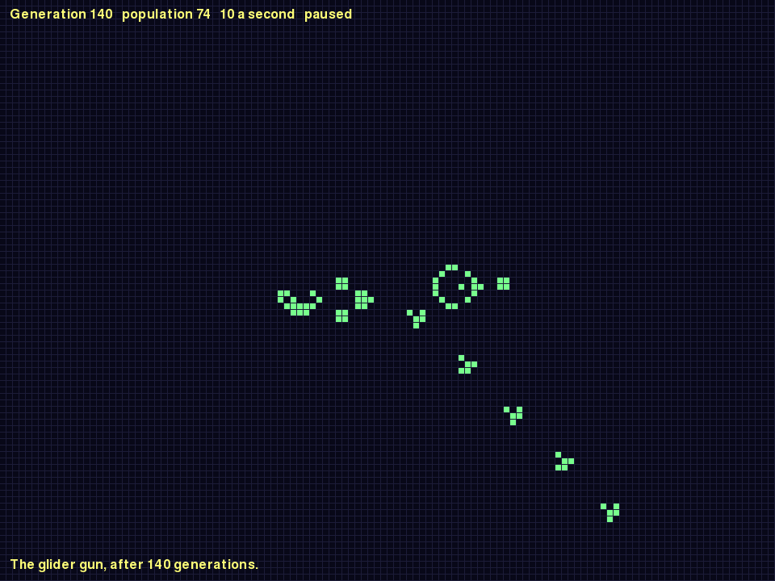
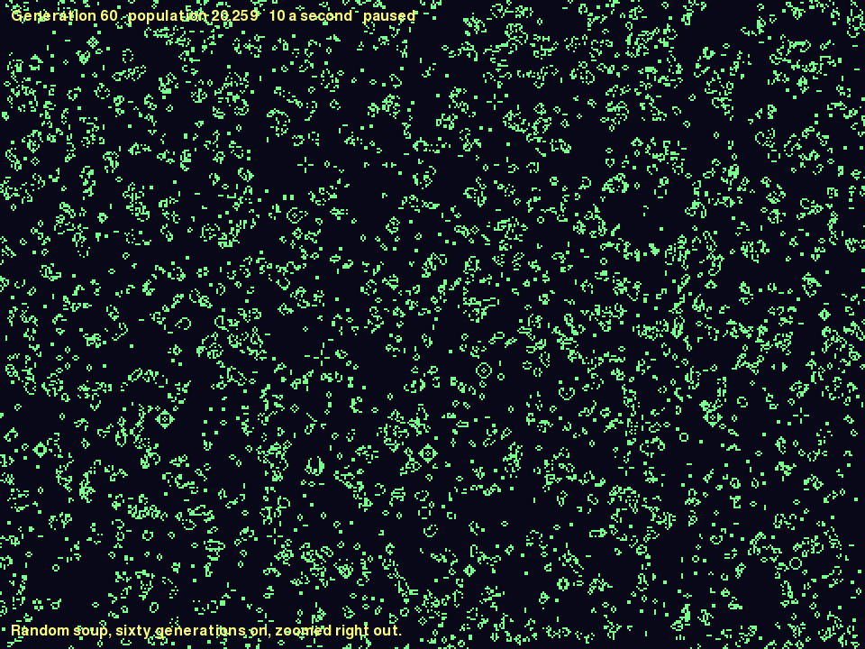

# Project 13 · Life in Pixels

In Project 6 you wrote Conway's Game of Life for the terminal, and you were asked to take some care over what went where. The rules went into a module that "knows nothing about printing, sleeping, or how big your screen is", and you were promised that it would matter. Here's where that promise is kept.



Life gets a window. You can draw cells with the mouse, zoom from a handful of cells out to more than half a million, drag the universe about, and drop pattern files onto it from the great libraries of the Life community. **And you won't change a line of Project 6.** The `life` package is going to be installed, as it stands, and used.

The new code is all about the distance between a universe with no edges and a window that has them. A **camera** converts between the two. A parser reads the community's pattern format, which is an excuse to meet **regular expressions**. You'll profile a program whose bottleneck isn't where you'd guess. And the bug hunt is different this time. The bug is already fixed. Your job is to find out *which commit* brought it in, a fortnight ago, among fourteen, and Git has a tool that does that in four steps.

| | |
|---|---|
| **You'll learn** | Reusing your own package, unchanged; converting between coordinate systems; regular expressions; one class to hold an application together; `match` on events, with guards; files dropped onto a window; profiling a program with two costs |
| **New tool skill** | `git bisect` |
| **Time** | 4 to 5 hours |
| **Before you start** | [Project 12](p12-asteroids.md), and your `life` project from [Project 6](../part-1-console/p06-life.md) |

## Predict

!!! question "Predict"
    ```python
    import math

    print(int(-0.5), math.floor(-0.5))
    print(int(-7 / 2), -7 // 2)
    ```

??? success "Answer"
    ```text
    0 -1
    -3 -4
    ```

    `int()` chops off whatever comes after the decimal point, which rounds *towards zero*. `math.floor`, like `//`, rounds *down*. For positive numbers they agree. For negative ones they differ by one, and a universe that stretches out to the left of the origin has plenty of negative numbers in it. Stage 1, and the bug hunt.

!!! question "Predict"
    ```python
    import re

    print(re.findall(r"(\d*)([bo$!])", "3o$2bo!"))
    print(re.sub(r"\d+", "#", "x = 36, y = 9"))
    ```

??? success "Answer"
    ```text
    [('3', 'o'), ('', '$'), ('2', 'b'), ('', 'o'), ('', '!')]
    x = #, y = #
    ```

    A *regular expression* is a pattern for matching text. `\d*` is "any number of digits, none included", and `[bo$!]` is "one of these four characters". The brackets capture the two halves, and `findall` hands back every match, as a list of tuples. Stage 2.

!!! question "Predict"
    ```python
    live = {(0, 0)}
    live.discard((5, 5))
    print(live)
    live.remove((5, 5))
    ```

??? success "Answer"
    ```text
    {(0, 0)}
    Traceback (most recent call last):
      ...
    KeyError: (5, 5)
    ```

    Sets have two ways of taking something out. `remove` insists that it was there. `discard` doesn't mind. Rubbing out a cell that's already dead isn't an error, so the paintbrush wants `discard`. Stage 2.

## Build

### Stage 1: Your own package, and a camera

```console
$ cd making
$ uv init pixel-life
$ cd pixel-life
$ uv add pygame-ce
$ uv add --editable ../life
$ uv add --dev pytest ruff
$ code .
```

That third `uv add` is the whole of the reuse. `life` is now a dependency of this project, exactly as `pygame-ce` is, and `from life import step` works. Everything that you exported through the front door in Project 6 is available: `step`, `generations`, `PATTERNS`, `parse`, `shift`, `soup` and `Cell`. You won't open that project again in this chapter.

(A project called `pixel-life` has a package called `pixel_life`, since a hyphen can't appear in a Python name. uv looks after the difference.)

#### Two coordinate systems

The universe is measured in **cells**. It goes on for ever in every direction, and its coordinates can be negative. The window is measured in **pixels**, from `(0, 0)` at the top left to about `(960, 720)`. Something has to stand between the two, and needs to know two things: *which cell is at the top left corner of the window*, and *how many pixels across a cell is*. That's a camera. Create `src/pixel_life/camera.py`:

<!-- listing: projects/13-life-in-pixels/src/pixel_life/camera.py -->
```python title="src/pixel_life/camera.py"
"""A camera: which part of an endless universe is on the screen, and how big it looks."""

import math
from dataclasses import dataclass

from life import Cell

MIN_ZOOM, MAX_ZOOM = 1.0, 64.0

type Pixel = tuple[int, int]


@dataclass
class Camera:
    """The cell at the top left of the window, and the size of a cell in pixels."""

    x: float = 0.0
    y: float = 0.0
    zoom: float = 8.0

    def cell_at(self, pixel: Pixel) -> Cell:
        """Return the cell that's under a pixel of the window."""
        px, py = pixel
        return math.floor(self.x + px / self.zoom), math.floor(self.y + py / self.zoom)

    def pixel_of(self, cell: Cell) -> Pixel:
        """Return the pixel at the top left corner of a cell. It may be off the screen."""
        cx, cy = cell
        return round((cx - self.x) * self.zoom), round((cy - self.y) * self.zoom)

    def pan(self, dx: float, dy: float) -> None:
        """Slide the view by some pixels, as if the universe had been dragged."""
        self.x -= dx / self.zoom
        self.y -= dy / self.zoom

    def zoom_about(self, pixel: Pixel, factor: float) -> None:
        """Zoom in or out, keeping whatever is under the pixel where it is."""
        px, py = pixel
        before_x, before_y = self.x + px / self.zoom, self.y + py / self.zoom
        self.zoom = max(MIN_ZOOM, min(MAX_ZOOM, self.zoom * factor))
        self.x = before_x - px / self.zoom
        self.y = before_y - py / self.zoom

    def centre_on(self, cell: Cell, size: Pixel) -> None:
        """Move the view so that a cell is in the middle of a window of this size."""
        self.x = cell[0] - size[0] / self.zoom / 2
        self.y = cell[1] - size[1] / self.zoom / 2
```

A `Camera` is a dataclass with methods, which was your first kind of class, in Project 9. Its three fields can be changed, and there's nothing else to it. It has no Pygame in it, and nothing in it ever looks at a window.

`x` and `y` are floats, so that the view can sit part-way across a cell, and dragging feels smooth. `cell_at` and `pixel_of` are the two conversions, and each is the other turned round.

**Look at the `math.floor` in `cell_at`.** It's the first Predict, and it's the most important line in the file. A pixel that lies over cell −0.5 is over cell **−1**, and not cell 0. `int()` would say 0. Everything to the left of the origin, and everything above it, would be out by one, and you'd have a universe with a seam down the middle of it. It's the kind of mistake that survives for months, since nobody thinks to test to the left of nought. The bug hunt is about just that.

`zoom_about` is the most satisfying method in the chapter. When you roll the mouse wheel in a map, the place *under the pointer* stays put while everything else grows or shrinks round it. To do that: work out which point of the universe is under the pointer *before* changing the zoom; change the zoom; and then move the camera so that the same point comes out under the same pixel. The `max(…, min(…))` keeps the zoom between 1 and 64 pixels to a cell.

Test it, in `tests/test_camera.py`. It's pure arithmetic, and the tests say what you'd want of a camera in plain words:

<!-- listing: projects/13-life-in-pixels/tests/test_camera.py -->
```python title="tests/test_camera.py"
@pytest.mark.parametrize(
    ("pixel", "cell"),
    [((0, 0), (-3, -2)), ((7, 7), (-3, -2)), ((8, 8), (-2, -1)), ((24, 16), (0, 0))],
)
def test_cells_left_of_and_above_the_origin(pixel, cell):
    camera = Camera(x=-3, y=-2)
    assert camera.cell_at(pixel) == cell
# ...
def test_panning_drags_the_universe_with_the_mouse():
    camera = Camera()
    under_the_pointer = camera.cell_at((100, 100))
    camera.pan(40, -24)
    assert camera.cell_at((140, 76)) == under_the_pointer


@pytest.mark.parametrize("factor", [2, 0.5, 1.25])
def test_zooming_keeps_the_cell_under_the_pointer_where_it_is(factor):
    camera = Camera(x=10, y=-10)
    pointer = (301, 199)
    before = camera.cell_at(pointer)
    camera.zoom_about(pointer, factor)
    assert camera.cell_at(pointer) == before
    assert camera.zoom == 8 * factor
```

The first of those tests moves the camera up and to the left of the origin, and checks four pixels. Change `math.floor` to `int` in `cell_at`, and watch it fail. The zooming test doesn't check any numbers. It checks the *property* that matters: whatever was under the pointer beforehand is under it afterwards.

!!! success "Checkpoint"
    ```console
    $ git add .
    $ git commit -m "Depend on the life package, and add a camera"
    ```

### Stage 2: A universe with a clock, and pattern files

`life.step` is a pure function, from a set to a set. An application wants something with more to it: a universe that can run and pause, at some number of generations a second, and that can be drawn on. Create `src/pixel_life/simulation.py`:

<!-- listing: projects/13-life-in-pixels/src/pixel_life/simulation.py -->
```python title="src/pixel_life/simulation.py"
"""A universe with a clock: it can run, pause and step, and it can be drawn on."""

import time
from collections.abc import Iterable

from life import Cell, shift, step

FRAME_BUDGET = 1 / 30  # seconds: the most that one update() should spend on stepping


class Simulation:
    def __init__(self, live: Iterable[Cell] = ()) -> None:
        self.live = set(live)
        self.generation = 0
        self.running = False
        self.speed = 10.0  # generations a second
        self.waited = 0.0

    def step(self) -> None:
        self.live = step(self.live)
        self.generation += 1

    def update(self, seconds: float) -> None:
        """Let some time go by, and step as often as that allows, within reason.

        A big universe can take longer to step than a frame lasts. Rather than
        fall further and further behind, we catch up by five generations at the
        most, and stop early if this frame has used up its share of the time.
        """
        if not self.running:
            return
        interval = 1 / self.speed
        self.waited = min(self.waited + seconds, 5 * interval)
        deadline = time.perf_counter() + FRAME_BUDGET
        while self.waited >= interval and time.perf_counter() < deadline:
            self.waited -= interval
            self.step()

    def paint(self, cell: Cell, alive: bool) -> None:
        """Bring one cell to life, or kill it."""
        if alive:
            self.live.add(cell)
        else:
            self.live.discard(cell)

    def load(self, pattern: set[Cell], at: Cell = (0, 0)) -> None:
        """Replace the universe with a pattern, and start counting again."""
        self.live = shift(pattern, *at)
        self.generation = 0

    def faster(self, factor: float) -> None:
        self.speed = max(1.0, min(240.0, self.speed * factor))
```

This is composition again. A `Simulation` *has* a set of cells, and *uses* `step`. It adds a clock, of the same kind as Snake's, and nothing about the rules is repeated here, or altered. If you improved the rules tomorrow, in the `life` project, this class would get the improvement without knowing it.

`set(live)` in `__init__` takes a **copy** of whatever it's given, for Project 4's reason: the simulation is going to paint on its cells, and the caller's set ought not to change behind the caller's back. `paint` uses `discard`, which was the third Predict.

`update` has a refinement that Snake didn't need. One generation of a big universe may take longer than a frame lasts. If it does, the program mustn't fall further and further behind, stepping for ever to catch up, and never getting round to drawing anything. So it owes at most five generations at a time, and it stops early if it's used up its share of the frame. You'll see in Stage 4 why that matters.

#### The Life community's file format

People have been collecting Life patterns for fifty years, and they share them in a format called *RLE*, for run-length encoding. Here's a glider:

```text
#N Glider
x = 3, y = 3, rule = B3/S23
bob$2bo$3o!
```

A `b` is a dead cell, and an `o` is a live one. A number in front means "this many of the next thing", so `3o` is three live cells. A `$` ends a row, and `!` ends the pattern. Lines that begin with `#` are comments, and the `x =` line gives the size. So `bob$2bo$3o!` is: dead, live, dead. New row: two dead, one live. New row: three live. It's compact, and you couldn't call it readable.

To parse it, you need to chop `24bo$22bobo$` into pieces: *an optional number, and then one of `b`, `o`, `$` or `!`*. You could write a loop which goes through the characters one at a time, collecting digits. Or you could describe what you're looking for, and let Python find it.

#### Regular expressions

A *regular expression*, or *regex*, is a little language for describing patterns in text. The `re` module is in the standard library. Here's the one you need:

```pycon
>>> import re
>>> TOKEN = re.compile(r"(\d*)([bo$!])")
>>> TOKEN.findall("24bo$3o!")
[('24', 'b'), ('', 'o'), ('', '$'), ('3', 'o'), ('', '!')]
```

Take `(\d*)([bo$!])` a piece at a time:

| Piece | Means |
|---|---|
| `\d` | one digit |
| `\d*` | any number of digits, including none at all |
| `[bo$!]` | one character, which must be one of these four |
| `( … )` | a *group*: capture whatever matched this part, so that it can be handed back |

Put together: some digits, perhaps, and then a tag, captured separately. `findall` returns every match, and since there are two groups, each match is a tuple of two strings. That's the second Predict. The `r` in front of the string is for *raw*. It tells Python to leave the backslashes alone, so that `\d` reaches the `re` module in one piece. **Always write a regex as a raw string.**

`re.compile` turns a pattern into an object, which you can use again and again. It has other methods. `.sub(replacement, text)` replaces every match, and `.search(text)` finds the first. There's a great deal more to regular expressions than this, and whole books have been written about them. These few pieces will take you a long way, and the rule of thumb is this: **a regex is for finding the pieces, and Python is for deciding what they mean.** A pattern that's grown too clever to read at a glance wants turning back into code.

Create `src/pixel_life/rle.py`:

<!-- listing: projects/13-life-in-pixels/src/pixel_life/rle.py -->
```python title="src/pixel_life/rle.py"
"""Reading patterns in RLE, the format in which the Life community shares them.

A glider is `bob$2bo$3o!`. A `b` is a dead cell and an `o` a live one, a number
in front means "this many of the next thing", `$` ends a row, and `!` ends the
pattern. Lines that start with `#` are comments, and a line such as
`x = 3, y = 3, rule = B3/S23` gives the pattern's size.
"""

import re

from life import Cell

TOKEN = re.compile(r"(\d*)([bo$!])")


class RLEError(ValueError):
    """A pattern file that can't be understood."""


def parse(text: str) -> set[Cell]:
    """Turn the text of an RLE file into the set of its live cells."""
    lines = [line.strip() for line in text.splitlines()]
    body = "".join(line for line in lines if line and line[0] not in "#x")

    leftover = TOKEN.sub("", body).strip()
    if leftover:
        raise RLEError(f"I don't understand {leftover[:20]!r} in this pattern")

    live: set[Cell] = set()
    x = y = 0
    for count, tag in TOKEN.findall(body):
        times = int(count) if count else 1
        match tag:
            case "b":
                x += times
            case "o":
                live.update((x + n, y) for n in range(times))
                x += times
            case "$":
                x, y = 0, y + times
            case "!":
                return live
    raise RLEError("The pattern has no ! to end it")
```

`parse` works in three steps. It drops the comments and the header, and joins the rest into one string. Then it checks that the string is made of tokens and nothing else, by *deleting* every token and seeing whether anything is left over. It's a neat trick, and it makes the error message possible. Then it walks through the tokens, keeping track of an `x` and a `y`, with a `match` on the tag, as in Project 5. `live.update(…)` adds a whole run of cells at a stroke, from a generator expression.

`RLEError` is an exception of your own, as `SaveError` was in the adventure, with one difference: it's declared as a kind of `ValueError`, and not merely as a kind of `Exception`. That's honest, since a bad pattern *is* a bad value, and it means that a caller who writes `except ValueError` catches it too. Exceptions form a family tree, and you can graft yours onto whichever branch suits it.

The tests compare the parser with the patterns that you drew by hand in Project 6, which is a pleasing use of one project to check another:

<!-- listing: projects/13-life-in-pixels/tests/test_rle.py -->
```python title="tests/test_rle.py"
GLIDER = """
#N Glider
#C The smallest spaceship.
x = 3, y = 3, rule = B3/S23
bob$2bo$3o!
"""


def test_a_glider():
    assert parse(GLIDER) == parse_picture(PATTERNS["glider"])
# ...
def test_the_gun_matches_the_one_drawn_by_hand():
    gun = """x = 36, y = 9, rule = B3/S23
    24bo11b$22bobo11b$12b2o6b2o12b2o$11bo3bo4b2o12b2o$2o8bo5bo3b2o14b$2o8b
    o3bob2o4bobo11b$10bo5bo7bo11b$11bo3bo20b$12b2o!"""
    assert parse(gun) == parse_picture(PATTERNS["gun"])
# ...
@pytest.mark.parametrize(
    ("text", "complaint"),
    [("bob$2bo$3o", "no !"), ("", "no !"), ("bo?$o!", r"don't understand '\?'")],
)
def test_bad_patterns_are_reported(text, complaint):
    with pytest.raises(RLEError, match=complaint):
        parse(text)
```

The `import` lines at the top bring in `pytest`, `PATTERNS` and `parse` from `life` (as `parse_picture`, to keep it apart from yours), and `RLEError` and `parse` from `pixel_life.rle`.

!!! success "Checkpoint"
    ```console
    $ git add .
    $ git commit -m "Add a simulation with a clock, and an RLE parser"
    ```

### Stage 3: A window, a mouse, and files from outside

The view draws the universe through the camera. Create `src/pixel_life/view.py`. This is the obvious way of writing it, and you'll be measuring it in Stage 4:

<!-- listing: projects/13-life-in-pixels/stages/stage3_view.py -->
```python title="src/pixel_life/view.py"
"""Drawing the universe through the camera."""

import pygame

from pixel_life.camera import Camera
from pixel_life.simulation import Simulation

BACKGROUND = (8, 8, 24)
GRID = (28, 28, 56)
ALIVE = (120, 255, 140)
TEXT = (255, 255, 120)


class View:
    def __init__(self, window: pygame.Surface) -> None:
        self.window = window
        self.font = pygame.font.Font(None, 24)

    def draw(self, simulation: Simulation, camera: Camera, message: str = "") -> None:
        self.window.fill(BACKGROUND)
        size = max(1, round(camera.zoom) - (1 if camera.zoom >= 4 else 0))
        for cell in simulation.live:
            x, y = camera.pixel_of(cell)
            pygame.draw.rect(self.window, ALIVE, (x, y, size, size))

        state = "running" if simulation.running else "paused"
        status = (
            f"Generation {simulation.generation:,}   population {len(simulation.live):,}"
            f"   {simulation.speed:.0f} a second   {state}"
        )
        self.window.blit(self.font.render(status, True, TEXT), (12, 10))
        bottom_line = self.window.get_height() - 28
        self.window.blit(self.font.render(message, True, TEXT), (12, bottom_line))
```

Every live cell is converted to a pixel position, and drawn as a square, one pixel smaller than the zoom, so that there's a thin gap between neighbours. Pygame clips anything that falls outside the window, so cells that are off the screen do no harm.

The application has a good deal of state: a simulation, a camera, a view, a message to show, and whether the mouse is painting at the moment. There are a dozen kinds of event that can change it. That's state with behaviour, and so it's a class. Create `src/pixel_life/app.py`:

<!-- listing: projects/13-life-in-pixels/src/pixel_life/app.py -->
```python title="src/pixel_life/app.py"
"""The program: a window, the mouse, the keyboard, and files dropped from outside."""

from pathlib import Path

import pygame
from life import PATTERNS, Cell, parse, soup

from pixel_life import rle
from pixel_life.camera import Camera
from pixel_life.simulation import Simulation
from pixel_life.view import View

WINDOW_SIZE = (960, 720)
LEFT_BUTTON, RIGHT_BUTTON = 1, 3


def cells_between(start: Cell, end: Cell) -> list[Cell]:
    """Return the cells on a straight line from one cell to another, both included."""
    (x1, y1), (x2, y2) = start, end
    steps = max(abs(x2 - x1), abs(y2 - y1))
    if steps == 0:
        return [start]
    return [
        (round(x1 + (x2 - x1) * n / steps), round(y1 + (y2 - y1) * n / steps))
        for n in range(steps + 1)
    ]


class App:
    """Everything that the events can change: the universe, the view of it, and the brush."""

    def __init__(self, window: pygame.Surface) -> None:
        self.window = window
        self.simulation = Simulation()
        self.camera = Camera()
        self.view = View(window)
        self.message = "Draw with the mouse. Space runs, N steps, 1-9 are patterns."
        self.brush: bool | None = None  # True paints, False rubs out, None is up
        self.last_cell: Cell | None = None
        self.load_pattern(parse(PATTERNS["gun"]), "gun")

    def load_pattern(self, cells: set[Cell], name: str) -> None:
        self.simulation.load(cells)
        middle = (max(x for x, _ in cells) // 2, max(y for _, y in cells) // 2)
        self.camera.centre_on(middle, self.window.get_size())
        self.message = f"Loaded {name}: {len(cells):,} cells."

    def load_file(self, path: Path) -> None:
        try:
            cells = rle.parse(path.read_text(encoding="utf-8"))
        except (OSError, UnicodeDecodeError, rle.RLEError) as error:
            self.message = f"Couldn't load {path.name}: {error}"
        else:
            self.load_pattern(cells, path.name)

    def paint_to(self, pixel: tuple[int, int]) -> None:
        """Paint, or rub out, from the last cell that was painted to the one under the pixel."""
        cell = self.camera.cell_at(pixel)
        for between in cells_between(self.last_cell or cell, cell):
            self.simulation.paint(between, alive=bool(self.brush))
        self.last_cell = cell

    def handle(self, event: pygame.event.Event) -> bool:
        """Deal with one event. Return False if it's time to stop."""
        match event.type:
            case pygame.QUIT:
                return False
            case pygame.KEYDOWN:
                return self.key(event.key)
            case pygame.MOUSEBUTTONDOWN if event.button == LEFT_BUTTON:
                # Start on a live cell and you rub out. Start on a dead one and you paint.
                self.brush = self.camera.cell_at(event.pos) not in self.simulation.live
                self.last_cell = None
                self.paint_to(event.pos)
            case pygame.MOUSEBUTTONUP if event.button == LEFT_BUTTON:
                self.brush = None
            case pygame.MOUSEMOTION if self.brush is not None:
                self.paint_to(event.pos)
            case pygame.MOUSEMOTION if event.buttons[RIGHT_BUTTON - 1]:
                self.camera.pan(*event.rel)
            case pygame.MOUSEWHEEL:
                factor = 1.25 if event.y > 0 else 0.8
                self.camera.zoom_about(pygame.mouse.get_pos(), factor)
            case pygame.DROPFILE:
                self.load_file(Path(event.file))
        return True

    def key(self, key: int) -> bool:
        simulation = self.simulation
        names = list(PATTERNS)
        match key:
            case pygame.K_ESCAPE:
                return False
            case pygame.K_SPACE:
                simulation.running = not simulation.running
            case pygame.K_n | pygame.K_RIGHT:
                simulation.step()
            case pygame.K_c:
                simulation.load(set())
            case pygame.K_r:
                left, top = self.camera.cell_at((0, 0))
                right, bottom = self.camera.cell_at(self.window.get_size())
                simulation.load(soup(right - left, bottom - top), at=(left, top))
            case pygame.K_EQUALS | pygame.K_PLUS:
                simulation.faster(2)
            case pygame.K_MINUS:
                simulation.faster(0.5)
            case _ if pygame.K_1 <= key <= pygame.K_9 and key - pygame.K_1 < len(names):
                name = names[key - pygame.K_1]
                self.load_pattern(parse(PATTERNS[name]), name)
        return True

    def frame(self, seconds: float) -> None:
        self.simulation.update(seconds)
        self.view.draw(self.simulation, self.camera, self.message)


def main() -> None:
    pygame.init()
    window = pygame.display.set_mode(WINDOW_SIZE, pygame.RESIZABLE)
    pygame.display.set_caption("Life")
    clock = pygame.time.Clock()
    app = App(window)

    running = True
    while running:
        for event in pygame.event.get():
            running = app.handle(event) and running
        app.frame(clock.tick(60) / 1000)
        pygame.display.flip()

    pygame.quit()
```

Set the command in `pyproject.toml` to `pixel-life = "pixel_life.app:main"`. `main` is a dozen lines long, because `App` does the work, and because `App.handle` takes an event and returns a `bool`, it can be tested by handing it events that you've made up, as in Snake.

**`match` on the event's type, with guards.** Every case here is a dotted name, so it's a constant to compare with, as Project 5 explained. `case pygame.MOUSEMOTION if self.brush is not None:` is the moving mouse *while painting*, and the case after it is the moving mouse *with the right button held down*. Two cases for one event type, told apart by their guards, and tried in order. In `key`, the last case is a bare `_` with a guard, to catch all nine digit keys at once, by arithmetic on their key codes.

**The brush.** Press the button on a dead cell, and you're painting. Press it on a live one, and you're rubbing out. The choice is made once, at the press, and lasts until the button comes up. It feels natural, and it's one line: `self.brush = cell not in live`. `self.brush` has three states, `True`, `False` and `None`, which is why the guard says `is not None`, and not plain `if self.brush`: `False` means "rubbing out", and that's still a drag. It's Project 1's warning about truthiness.

**`cells_between`.** A fast drag gives you a mouse event every few pixels, and not one for every cell on the way, so painting only the cell under the pointer would leave a dotted line. So each new position is joined to the last by a straight run of cells. It's a pure function, outside the class, and it has four parametrised tests.

**Dropped files.** Drag a file from your file manager onto the window, and Pygame sends a `DROPFILE` event, with the path in `event.file`. `load_file` shows all four parts of Project 5's `try` at work: `try` the risky thing, `except` the three things that can go wrong with a file that somebody has dropped on you, and do the loading in the `else`, so that only the read and the parse are under the `try`'s protection. A bad file puts a message on the screen, and changes nothing.

!!! example "Run it"
    ```console
    $ uv run pixel-life
    ```

    You should see the picture at the top of the chapter, paused. Press ++space++.

    | | |
    |---|---|
    | Left drag | paint, or rub out |
    | Right drag | move the universe |
    | Wheel | zoom, about the pointer |
    | ++space++ | run and pause |
    | ++n++ | one generation |
    | ++1++ to ++9++ | the patterns from Project 6 |
    | ++r++ | fill the window with random soup |
    | ++plus++ and ++minus++ | faster and slower |
    | ++c++ | clear |

    Then go to [the LifeWiki](https://conwaylife.com/wiki/), find a pattern you like the look of, download its `.rle` file, and drop it on the window. There are thousands, and your parser reads them.

    

Test the app by sending it events, in `tests/test_app.py`. There's a fixture that makes an `App` with an empty universe and the camera at the origin, and a small helper, `event`, which wraps `pygame.event.Event`:

<!-- listing: projects/13-life-in-pixels/tests/test_app.py -->
```python title="tests/test_app.py"
def test_dragging_paints_a_line_with_no_gaps(app):
    app.handle(event(pygame.MOUSEBUTTONDOWN, button=1, pos=(4, 4)))
    app.handle(event(pygame.MOUSEMOTION, pos=(44, 4), rel=(40, 0), buttons=(1, 0, 0)))
    app.handle(event(pygame.MOUSEBUTTONUP, button=1, pos=(44, 4)))
    assert app.simulation.live == {(x, 0) for x in range(6)}

    app.handle(event(pygame.MOUSEMOTION, pos=(44, 44), rel=(0, 40), buttons=(0, 0, 0)))
    assert len(app.simulation.live) == 6
# ...
def test_a_dropped_file_of_rubbish_is_reported_and_changes_nothing(app, tmp_path):
    file = tmp_path / "shopping.txt"
    file.write_text("eggs, milk, bread", encoding="utf-8")
    app.simulation.load({(1, 1)})
    app.handle(event(pygame.DROPFILE, file=str(file)))
    assert app.message.startswith("Couldn't load shopping.txt")
    assert app.simulation.live == {(1, 1)}
```

A press at `(4, 4)`, a movement to `(44, 4)`, and a release, and the test checks that six cells in a row are alive, with none missing. Nobody had to hold a mouse.

!!! success "Checkpoint"
    Run, test, lint, diff, commit.

    ```console
    $ git add .
    $ git commit -m "Add the window: painting, panning, zooming and dropped files"
    ```

### Stage 4: Where does the time go?

Press ++r++ with the view zoomed right out, and then ++space++. It's sluggish. Something is slow, and Project 7 taught you not to guess what. This program does two expensive things in every frame, which are stepping the universe and drawing it, so time them separately, with `time.perf_counter`, on a big soup. These figures are for 81,195 live cells, on the machine that this chapter was written on:

| | Milliseconds |
|---|---|
| Drawing, with the whole soup on the screen | 30 |
| Drawing, zoomed in so that a fifth of it is on the screen | 27 |
| Drawing, zoomed right in, with a few hundred cells on the screen | 25 |
| **One generation of the rules** | **112** |

There are two things to learn from that table.

**Drawing costs the same however little you can see.** Zoomed right in, the view is still converting all 81,195 cells to pixel positions and handing every one of them to Pygame, which throws nearly all of them away. That's a waste with an obvious cure, which is not to bother with cells that are off the screen. Ask the camera which cells are at the corners of the window, and skip anything outside them. Here's the final `draw`:

<!-- listing: projects/13-life-in-pixels/src/pixel_life/view.py -->
```python title="src/pixel_life/view.py"
    def draw(self, simulation: Simulation, camera: Camera, message: str = "") -> None:
        self.window.fill(BACKGROUND)
        width, height = self.window.get_size()
        left, top = camera.cell_at((0, 0))
        right, bottom = camera.cell_at((width, height))

        if camera.zoom >= 8:
            self.draw_grid(camera, left, top, right, bottom)

        size = max(1, round(camera.zoom) - (1 if camera.zoom >= 4 else 0))
        for cx, cy in simulation.live:
            if left <= cx <= right and top <= cy <= bottom:
                x, y = camera.pixel_of((cx, cy))
                self.window.fill(ALIVE, (x, y, size, size))

        state = "running" if simulation.running else "paused"
        status = (
            f"Generation {simulation.generation:,}   population {len(simulation.live):,}"
            f"   {simulation.speed:.0f} a second   {state}"
        )
        self.window.blit(self.font.render(status, True, TEXT), (12, 10))
        bottom_line = self.window.get_height() - 28
        self.window.blit(self.font.render(message, True, TEXT), (12, bottom_line))

    def draw_grid(
        self, camera: Camera, left: int, top: int, right: int, bottom: int
    ) -> None:
        width, height = self.window.get_size()
        for cx in range(left, right + 2):
            x, _ = camera.pixel_of((cx, 0))
            pygame.draw.line(self.window, GRID, (x - 1, 0), (x - 1, height))
        for cy in range(top, bottom + 2):
            _, y = camera.pixel_of((0, cy))
            pygame.draw.line(self.window, GRID, (0, y - 1), (width, y - 1))
```

(`window.fill(colour, rectangle)` is the quickest way that Pygame has of painting a plain rectangle. There's a grid now, too, when the cells are big enough for one to be useful.)

| | Before | After |
|---|---|---|
| The whole soup on the screen | 30 ms | 30 ms |
| A fifth of it on the screen | 27 ms | 5 ms |
| Zoomed right in | 25 ms | 4 ms |

It's five times faster whenever you're zoomed in, which is when you're looking closely, and no slower when you aren't. The technique is called *culling*, and every game and every map uses it.

**The rules cost four times as much as the drawing.** The bottleneck isn't in this project at all. It's `life.step`, in the package from Project 6. So can *that* be made faster? It's one line, with a `Counter` and a generator. Surely something cleverer, with a plain dictionary and the eight neighbours written out by hand, would beat it? It was tried, for this chapter:

| `step`, for 81,195 cells | Milliseconds |
|---|---|
| As it is: a `Counter`, fed by a generator of neighbours | 112 |
| A plain `dict`, with the eight neighbours written out longhand | 107 |
| `Counter.update`, called once for each cell | 108 |

**Nothing.** All three are within 5% of one another. The time goes on 650,000 dictionary updates, each of which has to hash a tuple, and no rearrangement of the Python round them makes any difference. The clear version was as fast as the clever ones all along.

So leave it alone. Sometimes that's what the measurements say, and it's as useful a result as a speed-up: you've just been spared an afternoon spent making good code worse. To go *really* faster would take a different algorithm, or a different tool, and both of those are among the challenges. What the application *can* do is stay usable while the rules are slow, and that's what the time budget in `Simulation.update` is for. A big universe runs at nine generations a second where you asked for sixty, and the mouse and the keys still answer.

The proof that culling changed nothing but the speed is a test which draws the same universe with the old view and with the new one, and compares the two pictures, byte for byte. It's in the tutorial's repository, in `tests/test_p13_life_in_pixels.py`.

!!! success "Checkpoint"
    ```console
    $ git commit -am "Draw only the cells that are in view"
    $ git push
    ```

## Type-in listing

RLE, unpacked by one regular expression. Save this as `unpack.py`, and run it with `uv run unpack.py`, and then with `uv run unpack.py 'bob$2bo$3o!'`. (The single quotes stop your shell from making something of the `$` and the `!`.)

<!-- listing: projects/13-life-in-pixels/unpack.py -->
```python title="unpack.py" linenums="1"
import re
import sys

GUN = (
    "24bo$22bobo$12b2o6b2o12b2o$11bo3bo4b2o12b2o$2o8bo5bo3b2o$"
    "2o8bo3bob2o4bobo$10bo5bo7bo$11bo3bo$12b2o!"
)
pattern = sys.argv[1] if len(sys.argv) > 1 else GUN

unpacked = re.sub(r"(\d+)(.)", lambda found: found[2] * int(found[1]), pattern)
for row in unpacked.rstrip("!").split("$"):
    print(row.replace("b", "  ").replace("o", "██"))
```

1. The pattern is `(\d+)(.)`, with a `+` where your parser had a `*`. What's the difference? What does `.` match?
2. The second argument to `re.sub` is usually a string. Here it's a *function*, which is called once for each match, and returns the replacement. What's `found`? What are `found[1]` and `found[2]`? What would `found[0]` be?
3. What does line 10 turn `3o` into? And `bob`, which has no numbers in it?
4. This is a dozen lines, where `rle.py` is forty. What can `rle.py` do that this can't? Feed it a pattern with a comment in it, or one that runs over two lines, or `5$`, or some rubbish.

## Bug hunt

This one is different. **The bug has already been found, and you know how to fix it.** What nobody knows is *when it got in*.

A colleague has spent a fortnight on a small camera module, not unlike yours, in fourteen commits. On the first day it worked. Today, clicking anywhere to the left of the origin paints the wrong cell. The history is there to be read, and one of those fourteen commits did it. Which? You could read them all. With four hundred commits, you couldn't.

Build the practice repository. The script is in the project's `bughunt/` folder in the tutorial's repository:

```console
$ uv run bughunt/make_history.py
Made bisect-practice, with 14 commits. The first is tagged v0.1.
$ cd bisect-practice
$ git log --oneline
54a9d49 Describe the module properly
...
66433a6 Start the camera module
```

**First, write a test that shows the bug**, as `test_cell_at.py`, inside `bisect-practice`. Don't commit it. It has to work at *every* commit in the history, and the parameters of `cell_at` are renamed along the way, so pass the arguments by position:

```python
from camera import cell_at


def test_cells_left_of_and_above_the_origin():
    assert cell_at(4, 4, -3, -2) == (-3, -2)
```

```console
$ uv run --no-project --with pytest pytest -q test_cell_at.py
```

It fails. Check out the beginning, with `git switch --detach v0.1`, and run it again: it passes. Go back, with `git switch main`. So the last commit is **bad**, and `v0.1` is **good**, and somewhere between them is the first bad one.

`git bisect` finds it by *binary search*, which is the method you used to win at Hi-Lo in Project 1. It checks out the commit in the middle, and asks you whether it's good or bad. That halves the range. It does it again. Fourteen commits take four questions, and a thousand would take ten.

```console
$ git bisect start
$ git bisect bad
$ git bisect good v0.1
Bisecting: 6 revisions left to test after this (roughly 3 steps)
[545d5e5…] Add limits for the zoom
```

Git has checked out a commit from the middle of the history. Run the test. If it passes, say `git bisect good`, and if it fails, `git bisect bad`. Git moves on to the middle of whatever's left, and after three or four rounds it names the culprit.

**Better still, let Git run the test itself.** `git bisect run` takes a command, and treats an exit status of nought as "good" and anything else as "bad", which is just how pytest behaves. Start again, and hand it over:

```console
$ git bisect reset
$ git bisect start
$ git bisect bad
$ git bisect good v0.1
$ git bisect run uv run --no-project --with pytest pytest -q test_cell_at.py
running 'uv' 'run' '--no-project' '--with' 'pytest' 'pytest' '-q' 'test_cell_at.py'
...
8b17648… is the first bad commit
commit 8b17648…
Author: A. Colleague <colleague@example.com>
Date:   Mon Mar 9 10:00:00 2026 +0000

    Simplify cell_at

bisect found first bad commit
$ git bisect reset
```

It took four runs of the test, a few seconds, and no thought. (The script fixes the author and the dates, so your hashes ought to be the same as these.) Now look at what that commit did:

```console
$ git show 8b17648
-    return math.floor(x + px / ZOOM), math.floor(y + py / ZOOM)
+    return int(x + px / ZOOM), int(y + py / ZOOM)
```

"Simplify." It's the first Predict. Your colleague thought that `int` and `math.floor` were two ways of spelling one thing, and for every number they tried, they were.

??? success "What to take from this"
    **Bisecting only works if the history is made of small commits, each of which runs.** If that fortnight had been one commit called "camera improvements", bisect would have told you that the bug was in there somewhere, which you knew. If half of the commits didn't run at all, it couldn't have said whether they were good or bad. Every checkpoint in this tutorial has been a small, working commit, and this is one of the things it's been for.

    **Don't revert the commit blindly.** Look at the later history: two commits afterwards, somebody removed `import math`, quite reasonably, since nothing used it any more. `git revert 8b17648` would give you back a call to `math.floor` in a file that no longer imports `math`. Finding the cause is bisect's job. Putting it right is yours: restore `math.floor`, restore the import, and *commit your test along with the fix*, so that this can't happen again.

    **The test comes first.** `git bisect run` needed something that could say "good" or "bad" without a human being in the room. "Reproduce it, write a failing test, then fix it" has been the rule since Project 4. Here the failing test wasn't only evidence of the bug. It was the search engine.

## Challenges

Make a branch for each.

**Tweak**

1. Choose your own colours. Then make the grid appear only when the cells are 12 pixels across or more.
2. Make the ++left++ key step *backwards*. The rules can't be run in reverse, so you'll have to remember where you've been: a `deque` of past universes, with a `maxlen`. Why is it safe to keep the old sets, without copying them?
3. Start the program with a soup in place of the gun. How many lines did you change?

**Extend**

1. **Save your work.** Write `to_rle(live)`, which turns a set of cells back into RLE text, and have the ++s++ key save the universe to a file. Test it as a round trip: for every one of Project 6's patterns, `parse(to_rle(cells))` should equal `cells`. `itertools.groupby` was made for run-length encoding.
2. **A command line.** `pixel-life gun`, `pixel-life my-pattern.rle`, `pixel-life --soup 0.4`. It's `argparse`, from Project 6.
3. **The age of cells.** Colour each cell by how many generations it's been alive for, so that a new one is white, and an old one is deep green. `life.step` doesn't keep ages, and you aren't to change it. But each generation you have the old set and the new one, and a dictionary comprehension will do the rest.

??? tip "Hint for the age of cells"
    Keep `ages: dict[Cell, int]` in the `Simulation`. After each step, a cell that's in the new universe is one generation older than it was, or is 1 if it wasn't there before: `{cell: ages.get(cell, 0) + 1 for cell in new}`. Cells that have died aren't in `new`, and so they drop out by themselves.

**Invent**

1. **NumPy.** For a universe *with* edges, which is an array of noughts and ones, a generation is a few lines of NumPy with no Python loop in them: shift the array eight ways, add the results up, and compare. It's fifty times faster for a dense soup, and useless for a glider a million cells from home. Which of those does your program need to be good at? Could it choose between the two as it goes?
2. **Other rules.** If you did Project 6's challenge and gave `step` a rule, give this program a key to cycle through some: HighLife, Seeds, Day & Night.
3. **Hashlife.** Read about the algorithm that can run some patterns forward by billions of generations in a second, by remembering every square block of cells that it's ever seen, and what became of it. It's `functools.cache`, from Project 7, taken to a magnificent extreme. You probably won't write it. You'll enjoy finding out how it's done.

Solutions to the first Extend, and the test for the bug hunt, are in the project's `solutions/` folder.

## Recap

You can now:

- [x] use a package of your own in a new project, without changing it
- [x] convert between two coordinate systems, and choose `math.floor` over `int` when numbers can be negative
- [x] zoom about a point
- [x] read and write simple regular expressions: `\d`, `*`, `+`, `[…]`, groups, `findall`, `sub`, and a function as the replacement
- [x] say why a regex is a raw string, and when it ought to be turned back into code
- [x] make an exception of your own a kind of `ValueError`
- [x] hold an application's state together in one class, and test it with events that you've made up
- [x] use `match` with guards to tell apart events of one type
- [x] accept files that are dropped onto a window, and refuse the bad ones politely
- [x] time the separate parts of a program, cull what can't be seen, and leave alone what the measurements say can't be improved
- [x] find the commit that brought a bug in, with `git bisect`, and let a test do the searching

**Read more:** [The regular expression HOWTO](https://docs.python.org/3/howto/regex.html) · [`re`](https://docs.python.org/3/library/re.html) · [regex101](https://regex101.com/), for trying patterns out (choose the Python flavour) · [`pygame.event`](https://pyga.me/docs/ref/event.html) · [Pro Git: debugging with Git](https://git-scm.com/book/en/v2/Git-Tools-Debugging-with-Git) · [The LifeWiki's account of RLE](https://conwaylife.com/wiki/Run_Length_Encoded)

Everything in Part 2 so far has been flat. In [Project 14](p14-wireframe.md) it gets a third dimension. A wireframe spaceship turns slowly in the dark, as one did on the title screen of the most famous game the BBC Micro ever had. It's all matrices, and Python has an operator set aside for those.
