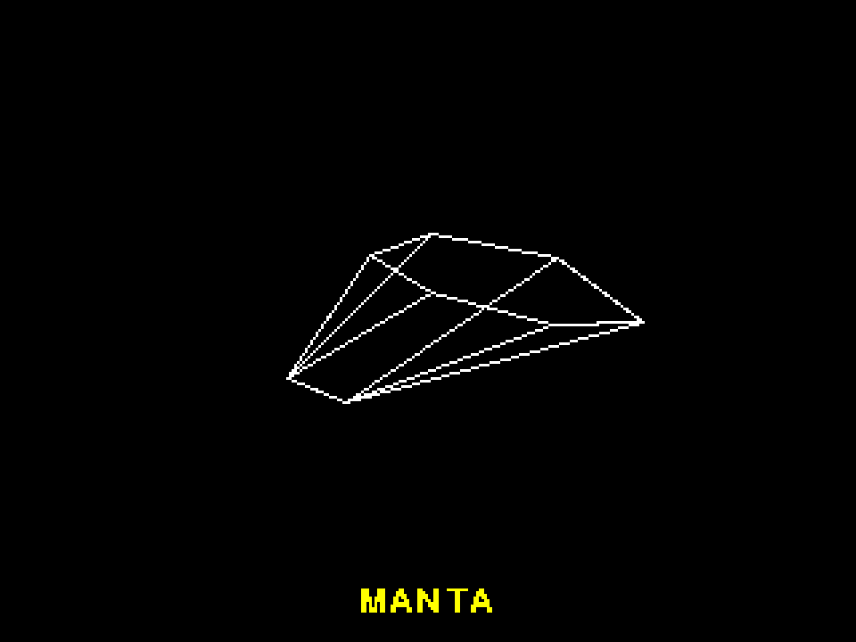
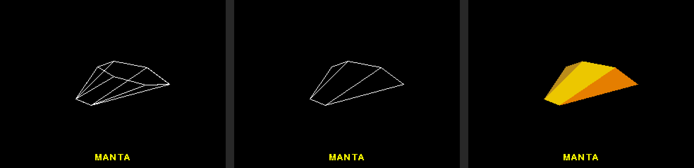
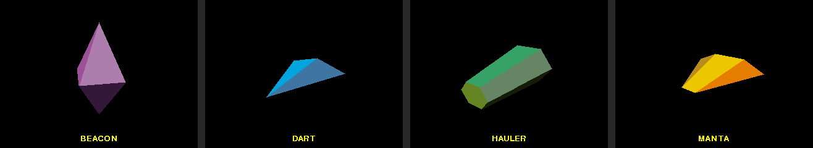
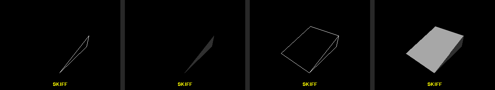

# Project 14 · Wireframe

In 1984 the most famous game that the BBC Micro ever had opened with a spaceship, drawn in white lines, turning slowly in the dark. It was solid, in the sense that you couldn't see through it: the lines round the back were left out. On a machine with 32K of memory, and a processor that couldn't multiply, it looked like magic.



You're going to build that viewer: ships of your own design, which turn under the arrow keys, drawn as wires, then with the hidden lines taken out, and then as solid, lit, coloured shapes. Everything so far in Part 2 has been flat. This is the third dimension, and it's all done with one idea, the *matrix*, for which Python has an operator that nothing in the standard library uses. It's been waiting for you: `@`.

The ships are data, and not code. Each one lives in a small **TOML** file, which is the format that you've been editing since Project 0, under the name of `pyproject.toml`. Now you'll read one from Python. You'll also meet `__slots__`, which Project 12 promised, and measure what it does, since a good deal of what's said about it is out of date.

| | |
|---|---|
| **You'll learn** | Matrices from `zip` and comprehensions; `@` and `__matmul__`; `__slots__`, and what it saves; reading TOML with `tomllib`; `match` on dictionaries; perspective; which way a face is facing |
| **New tool skill** | VS Code snippets and tasks |
| **Time** | 4 to 5 hours |
| **Before you start** | [Project 13](p13-life-in-pixels.md). Project 12's `Vector` is assumed throughout |

## Predict

!!! question "Predict"
    ```python
    rows = [(1, 2, 3), (4, 5, 6)]
    print(list(zip(*rows)))
    print(list(zip(*zip(*rows))))
    ```

??? success "Answer"
    ```text
    [(1, 4), (2, 5), (3, 6)]
    [(1, 2, 3), (4, 5, 6)]
    ```

    The `*` unpacks the list into separate arguments, as it did in Project 7, so this is `zip((1, 2, 3), (4, 5, 6))`. `zip` takes the first of each, and then the second of each, and those are the *columns*. `zip(*rows)` turns a table on its side. Do it twice, and you're back where you started. Stage 2.

!!! question "Predict"
    ```python
    class Star:
        __slots__ = ("x", "y")

        def __init__(self, x, y):
            self.x = x
            self.y = y


    star = Star(3, 4)
    star.x = 5
    print(star.x)
    star.z = 6
    ```

??? success "Answer"
    ```text
    5
    Traceback (most recent call last):
      ...
    AttributeError: 'Star' object has no attribute 'z' and no __dict__ for setting new attributes
    ```

    Until now, you've been able to hang a new attribute on any object of your own, at any time, whether you meant to or not. A class with `__slots__` has a fixed set of places to put things, and no others. Stage 1.

!!! question "Predict"
    ```python
    import tomllib

    ship = tomllib.loads("""
    name = "Dart"
    points = [[0, 0, 48], [-32, 0, -24]]

    [[faces]]
    points = [0, 1, 4]

    [[faces]]
    points = [0, 2, 1]
    colour = "cyan"
    """)
    print(ship["points"][1])
    print(len(ship["faces"]), ship["faces"][1])
    ```

??? success "Answer"
    ```text
    [-32, 0, -24]
    2 {'points': [0, 2, 1], 'colour': 'cyan'}
    ```

    TOML becomes dictionaries and lists, as JSON did in Project 5. The double square brackets are the one piece of TOML that isn't plain at a glance. Each `[[faces]]` begins *another* dictionary, in a list called `faces`. Stage 3.

!!! question "Predict"
    ```python
    match {"name": "Dart", "crew": 2}:
        case {}:
            print("an empty dictionary")
        case {"name": str(name)}:
            print("a ship called", name)
    ```

??? success "Answer"
    ```text
    an empty dictionary
    ```

    `match` can take dictionaries apart, and it has a rule that catches everybody once. A dictionary pattern asks whether the keys that it mentions are there, and **it doesn't mind what else is**. `{}` mentions no keys, and so it matches every dictionary there is. Stage 3.

## Build

### Stage 1: Three numbers, and nowhere to put a fourth

```console
$ cd making
$ uv init wireframe
$ cd wireframe
$ uv add pygame-ce
$ uv add --dev pytest ruff
$ code .
```

A point in space is three numbers. So is a direction. Project 12's `Vector` was two, and everything that you learned there carries over: a frozen dataclass, operators that return new objects, the `NotImplemented` dance, and `__iter__`, so that a vector can be unpacked.

First, which way is which. **x goes to the right, y goes up, and z comes out of the screen towards you.** Your eye is somewhere out along the z axis, looking back at the origin, where the ship is. Hold up your right hand with the thumb pointing right and the first finger up, and the second finger points at your face. It's called a *right-handed* system, and it's the one in the maths books.

Create `src/wireframe/vec3.py`:

<!-- listing: projects/14-wireframe/stages/stage1_vec3.py -->
```python title="src/wireframe/vec3.py"
"""A point, or a direction, in three dimensions."""

import math
from collections.abc import Iterator
from dataclasses import dataclass


@dataclass(frozen=True, slots=True)
class Vec3:
    x: float = 0.0
    y: float = 0.0
    z: float = 0.0

    def __add__(self, other: "Vec3") -> "Vec3":
        if not isinstance(other, Vec3):
            return NotImplemented
        return Vec3(self.x + other.x, self.y + other.y, self.z + other.z)

    def __sub__(self, other: "Vec3") -> "Vec3":
        if not isinstance(other, Vec3):
            return NotImplemented
        return Vec3(self.x - other.x, self.y - other.y, self.z - other.z)

    def __mul__(self, number: float) -> "Vec3":
        if not isinstance(number, (int, float)):
            return NotImplemented
        return Vec3(self.x * number, self.y * number, self.z * number)

    def __abs__(self) -> float:
        return math.hypot(self.x, self.y, self.z)

    def __iter__(self) -> Iterator[float]:
        yield self.x
        yield self.y
        yield self.z

    def dot(self, other: "Vec3") -> float:
        """How far two directions agree. It's positive if they point the same way."""
        return self.x * other.x + self.y * other.y + self.z * other.z

    def cross(self, other: "Vec3") -> "Vec3":
        """A direction at right angles to both."""
        return Vec3(
            self.y * other.z - self.z * other.y,
            self.z * other.x - self.x * other.z,
            self.x * other.y - self.y * other.x,
        )
```

`__abs__` is the length. `math.hypot` takes as many numbers as you give it.

The two methods at the bottom are new, and they're the whole of the geometry in this chapter. Neither has an operator, since Python hasn't got two more kinds of multiplication sign to spare, and so they're ordinary methods with ordinary names.

**The dot product** multiplies two vectors together, and gives you a *number*, which says how far they agree. If it's positive, they point the same way, more or less. If it's nought, they're at right angles. If it's negative, they point in opposite directions. You'll use it to ask "is this face turned towards me?" and "is this face turned towards the light?", and those two questions are all there is to solid 3D.

**The cross product** multiplies two vectors together, and gives you a *vector*, at right angles to both of them. Give it two edges of a flat face, and it'll tell you which way the face is pointing.

#### `slots=True`

That's the new word on the first line of the class. Here's what it changes. An ordinary object keeps its attributes in a dictionary, which you can look at:

```pycon
>>> class Roomy:
...     def __init__(self, x, y):
...         self.x = x
...         self.y = y
>>> point = Roomy(3, 4)
>>> point.__dict__
{'x': 3, 'y': 4}
>>> point.colour = "red"
>>> point.__dict__
{'x': 3, 'y': 4, 'colour': 'red'}
```

It's roomy, and it's forgiving, and the forgiveness isn't always kind: `self.postion = (0, 0)` is a new attribute, and not an error. A class can opt out of all that, by listing the names of the only attributes that its objects will ever have, in a class attribute called `__slots__`. That was the second Predict. Its objects have no `__dict__`. They have a fixed number of places, which are the *slots*, and nothing else.

`@dataclass(slots=True)` writes the `__slots__` line for you, from the fields:

```pycon
>>> from wireframe.vec3 import Vec3
>>> Vec3.__slots__
('x', 'y', 'z')
>>> hasattr(Vec3(1, 2, 3), "__dict__")
False
```

What's it for? You'll hear two claims made: that it saves memory, and that it's faster. Project 7's rule was to measure, so measure. Save this as `measure_slots.py`. `tracemalloc` is the standard library's way of asking how much memory your program has been given.

<!-- listing: projects/14-wireframe/measure_slots.py -->
```python title="measure_slots.py"
"""How much does __slots__ save? Make a lot of points each way, and ask."""

import tracemalloc
from dataclasses import dataclass

COUNT = 200_000


@dataclass(frozen=True)
class Roomy:
    x: float
    y: float
    z: float


@dataclass(frozen=True, slots=True)
class Slotted:
    x: float
    y: float
    z: float


for kind in (Roomy, Slotted):
    tracemalloc.start()
    points = [kind(1.5, 2.5, 3.5) for _ in range(COUNT)]
    size, _peak = tracemalloc.get_traced_memory()
    tracemalloc.stop()
    print(f"{kind.__name__:8} {size / COUNT:4.0f} bytes each, {size / 1e6:5.1f} MB")
```

```console
$ uv run measure_slots.py
Roomy     104 bytes each,  20.8 MB
Slotted    64 bytes each,  12.8 MB
```

**The saving in memory is real**: 40 bytes an object, which is better than a third. For 200,000 points, that's 8 MB. For a ship with twelve points, it's 480 bytes, which is nothing.

**The saving in time isn't there.** Reading the three attributes of a point two million times took 0.051 seconds for the roomy class, and 0.050 for the slotted one, on Python 3.14. Making the objects took the same time too. Slots *were* quicker, some versions ago. Ordinary objects have been improved a great deal since then, and the advice has outlived the fact.

So `__slots__` is for two occasions: when you're going to have a very large number of small objects, and when you'd like a slip of the finger in an attribute's name to be an error and not a new attribute. The second is worth having for any class whose objects can be changed. Here, it costs one word, on the type that there'll be most of. There are two prices to pay. The first is that nothing can be added to an object later, which is the point of it. The second is that anything which relies on the `__dict__` stops working, and the one that you're most likely to meet is `functools.cached_property`, which keeps its answer there.

!!! note "Under the bonnet"
    A class with a hand-written `__slots__` can't also give its attributes default values in the class body, as `x = 0.0` would: the name is already taken, by the slot. `@dataclass(slots=True)` gets round that for you, by building a second class and handing that back in place of yours.

Test the vector in `tests/test_vec3.py`. The cross product's test is its definition: whatever comes out is at right angles to what went in, and so the dot product with each is nought.

<!-- listing: projects/14-wireframe/tests/test_vec3.py -->
```python title="tests/test_vec3.py"
def test_dot_says_how_far_two_directions_agree():
    assert Vec3(1, 0, 0).dot(Vec3(5, 0, 0)) > 0
    assert Vec3(1, 0, 0).dot(Vec3(0, 7, 0)) == 0
    assert Vec3(1, 0, 0).dot(Vec3(-2, 1, 1)) < 0


def test_cross_is_at_right_angles_to_both():
    a, b = Vec3(1, 2, 3), Vec3(-4, 0, 5)
    assert a.cross(b).dot(a) == 0
    assert a.cross(b).dot(b) == 0
    assert Vec3(1, 0, 0).cross(Vec3(0, 1, 0)) == Vec3(0, 0, 1)


def test_there_is_nowhere_to_put_anything_else():
    assert not hasattr(Vec3(1, 2, 3), "__dict__")
```

!!! success "Checkpoint"
    ```console
    $ git add .
    $ git commit -m "Add a three-dimensional vector, with slots"
    ```

### Stage 2: Matrices, from `zip`

To turn a ship round, every one of its points has to move. The new x of a point depends on the old x, y and z, and so do the new y and the new z. That's nine numbers, to say how much of each goes into each, and the customary way of writing nine such numbers down is in a square, which is called a **matrix**:

```text
new x        a  b  c         x
new y   =    d  e  f    @    y
new z        g  h  i         z
```

The rule is: `new x` is the **top row** of the matrix, multiplied by the vector, number by number, and added up, so `a*x + b*y + c*z`. `new y` is the middle row, treated likewise, and `new z` is the bottom one. You've met "multiply two lists together, number by number, and add up", and its name is the dot product. *A matrix times a vector is the dot product of each row with the vector.*

That much would do to turn a ship. What makes matrices worth their keep is that **two of them can be multiplied together, and the result is one matrix that does both jobs**. Pitch the ship up a little, and roll it a little, sixty times a second for a minute, and that's 7,200 turns, and they're all in one matrix of nine numbers, to be applied to each point once.

The rule for a matrix times a matrix is the same rule again. The number in row 1, column 2 of the answer is *row 1 of the first*, dotted with *column 2 of the second*. So you need the rows of one, and the columns of the other, and the first Predict told you how to get columns out of rows. Create `src/wireframe/matrix.py`:

<!-- listing: projects/14-wireframe/src/wireframe/matrix.py -->
```python title="src/wireframe/matrix.py"
"""Matrices, and the ones that turn things round."""

import math
from dataclasses import dataclass

type Row = tuple[float, ...]


@dataclass(frozen=True, slots=True)
class Matrix:
    rows: tuple[Row, ...]

    @property
    def columns(self) -> tuple[Row, ...]:
        return tuple(zip(*self.rows, strict=True))

    def __matmul__(self, other: "Matrix") -> "Matrix":
        if not isinstance(other, Matrix):
            return NotImplemented
        return Matrix(
            tuple(
                tuple(
                    sum(a * b for a, b in zip(row, column, strict=True))
                    for column in other.columns
                )
                for row in self.rows
            )
        )

    def transposed(self) -> "Matrix":
        """Swap the rows with the columns. For a rotation, that's the way back."""
        return Matrix(self.columns)


IDENTITY = Matrix(((1, 0, 0), (0, 1, 0), (0, 0, 1)))


def rotation_x(degrees: float) -> Matrix:
    """Turn about the x axis: the nose pitches up or down."""
    c, s = math.cos(math.radians(degrees)), math.sin(math.radians(degrees))
    return Matrix(((1, 0, 0), (0, c, -s), (0, s, c)))


def rotation_y(degrees: float) -> Matrix:
    """Turn about the y axis: the nose yaws to the left or the right."""
    c, s = math.cos(math.radians(degrees)), math.sin(math.radians(degrees))
    return Matrix(((c, 0, s), (0, 1, 0), (-s, 0, c)))


def rotation_z(degrees: float) -> Matrix:
    """Turn about the z axis: the ship rolls."""
    c, s = math.cos(math.radians(degrees)), math.sin(math.radians(degrees))
    return Matrix(((c, -s, 0), (s, c, 0), (0, 0, 1)))
```

**`__matmul__` is the method behind `@`.** The operator was added to Python for the benefit of NumPy, the numerical library, and nothing that comes with Python uses it, so it's entirely yours. Read the body from the inside out. `sum(a * b for a, b in zip(row, column, strict=True))` is a dot product. The comprehension round it does that for every column of the other matrix, which makes one row of the answer. The comprehension round *that* does it for every row of this one. Two comprehensions and a `zip` are the whole of matrix multiplication.

```pycon
>>> from wireframe.matrix import Matrix
>>> a = Matrix(((1, 2), (3, 4)))
>>> b = Matrix(((5, 6), (7, 8)))
>>> a @ b
Matrix(rows=((19, 22), (43, 50)))
>>> b @ a
Matrix(rows=((23, 34), (31, 46)))
```

Check the 19 by hand: it's row `(1, 2)` dotted with column `(5, 7)`, which is `1*5 + 2*7`. And notice that **`a @ b` isn't `b @ a`**. With numbers, the order of a multiplication doesn't matter. With matrices it does, and it isn't a quirk of the arithmetic. It's true of the world. Tip your head forward, and then turn it to the left. Now start again, and turn it to the left, and then tip it forward. You're looking at two different places.

`strict=True` earns its keep here. A matrix can only multiply another if its rows are as long as the other's columns, and if they aren't, `zip` says so, where without `strict` it would quietly have ignored the numbers left over and given you a wrong answer.

`IDENTITY` is the matrix that changes nothing, as 1 is the number that changes nothing. Since a `Matrix` can't be altered, one copy can be shared by everybody, which was Project 10's point.

The three `rotation` functions are the standard ones, from any textbook. Look at `rotation_z`, and ignore the last row and the last column, which leave z alone. What's left says `new x = x*c - y*s` and `new y = x*s + y*c`, and that's Project 12's `rotated`. A turn about the z axis is a flat, two-dimensional turn, with z as a passenger. The other two are the same thing about the other two axes.

`transposed` swaps the rows with the columns. For a rotation, and not for matrices in general, the transpose is the *opposite* turn. There's a test of that, and you'll want it in the challenges.

#### A matrix times a vector

`Matrix.__matmul__` knows about matrices. What about `matrix @ vector`? You could teach it about vectors too, with a second `isinstance`. There's a tidier way, and you met it in Project 12 as `__rmul__`. When `matrix @ vector` is evaluated, Python asks the matrix first. The matrix returns `NotImplemented`, and so Python asks the *vector*, by calling its **`__rmatmul__`**. Add this to `Vec3`, and an import for it at the top of `vec3.py`:

<!-- listing: projects/14-wireframe/src/wireframe/vec3.py -->
```python title="src/wireframe/vec3.py"
from wireframe.matrix import Matrix
# ...
    def __rmatmul__(self, matrix: Matrix) -> "Vec3":
        """Work out `matrix @ self`: each row times this vector, added up."""
        if not isinstance(matrix, Matrix):
            return NotImplemented
        return Vec3(
            *(sum(a * b for a, b in zip(row, self, strict=True)) for row in matrix.rows)
        )
```

The generator in the middle makes three numbers, which are the dot products of the three rows with this vector. The `*` in front of it unpacks them into `Vec3`'s three parameters. The vector can be zipped with a row because it has an `__iter__`.

So each class knows how to be multiplied by a matrix, and `matrix.py` doesn't need to import `vec3.py` at all. Pylance follows the same road as Python does, and knows that `matrix @ matrix` is a `Matrix`, and `matrix @ vector` is a `Vec3`.

```pycon
>>> from wireframe.matrix import rotation_z
>>> rotation_z(90) @ Vec3(1, 0, 0)
Vec3(x=6.123233995736766e-17, y=1.0, z=0)
```

A quarter turn about z takes "right" to "up". That's correct, give or take the `6.123233995736766e-17` where you'd hoped for a nought. It's Project 7's lesson about floats, and the cure is the same: the tests compare with `pytest.approx`.

<!-- listing: projects/14-wireframe/tests/test_matrix.py -->
```python title="tests/test_matrix.py"
def test_the_shapes_have_to_fit():
    with pytest.raises(ValueError, match="shorter"):
        Matrix(((1, 2, 3), (4, 5, 6))) @ Matrix(((1, 2), (3, 4)))
# ...
@pytest.mark.parametrize(
    ("turn", "start", "end"),
    [
        (rotation_x(90), Vec3(0, 1, 0), Vec3(0, 0, 1)),
        (rotation_y(90), Vec3(0, 0, 1), Vec3(1, 0, 0)),
        (rotation_z(90), Vec3(1, 0, 0), Vec3(0, 1, 0)),
    ],
)
def test_a_quarter_turn(turn, start, end):
    assert tuple(turn @ start) == pytest.approx(tuple(end))


def test_the_order_matters():
    pitch, roll = rotation_x(90), rotation_z(90)
    nose = Vec3(0, 0, 1)
    assert tuple(pitch @ roll @ nose) == pytest.approx((0, -1, 0))
    assert tuple(roll @ pitch @ nose) == pytest.approx((1, 0, 0))
# ...
def test_transposing_a_rotation_undoes_it():
    turn = rotation_x(25) @ rotation_y(-70) @ rotation_z(130)
    assert numbers(turn.transposed() @ turn) == pytest.approx(numbers(IDENTITY))


def test_a_rotation_changes_no_lengths():
    turn = rotation_x(25) @ rotation_y(-70) @ rotation_z(130)
    assert abs(turn @ Vec3(2, 3, 6)) == pytest.approx(7)
```

`numbers` is a little helper, at the top of the file, which flattens a matrix into one list, as `pytest.approx` doesn't care for tuples inside tuples: `[number for row in matrix.rows for number in row]`.

`test_the_order_matters` is the business with your head. `pitch @ roll @ nose` is read **from right to left**: the nose is rolled first, and then pitched. The turn that's nearest to the vector happens first.

The last test is worth a moment. A rotation mustn't change the size of anything, whatever else it does. If you ever get a sign wrong in one of those three functions, that's the test which will notice, since the ship would stretch as it turned.

!!! info "Coming from NumPy, or from BBC BASIC"
    If you know NumPy, this is `a @ b` as you've always written it, and now you've seen what's on the other end of it. NumPy's is a few thousand times faster for big matrices. For nine numbers, it isn't faster at all. BBC BASIC on the Archimedes could multiply whole arrays as matrices too, with a full stop: `A() = B() . C()`.

!!! success "Checkpoint"
    ```console
    $ git add .
    $ git commit -m "Add matrices, with @ for multiplying them"
    ```

### Stage 3: Ships, in TOML

A ship is a list of **points**, and a list of **faces**. Each face is a flat polygon, and names its corners by number. Here's the simplest ship in the hangar, a long pyramid with a diamond for a tail. Create a folder, `src/wireframe/ships`, and save this in it as `dart.toml`:

<!-- listing: projects/14-wireframe/src/wireframe/ships/dart.toml -->
```toml title="src/wireframe/ships/dart.toml"
name = "Dart"

points = [
    [0, 0, 48],
    [-32, 0, -24],
    [0, 10, -24],
    [32, 0, -24],
    [0, -10, -24],
]

[[faces]]
points = [0, 1, 4]
colour = "cyan"

[[faces]]
points = [0, 2, 1]
colour = "deepskyblue"

[[faces]]
points = [0, 3, 2]
colour = "steelblue"

[[faces]]
points = [0, 4, 3]
colour = "lightskyblue"

[[faces]]
points = [1, 2, 3, 4]
colour = "orange"
```

Point 0 is the nose, 48 units out along z. The other four are the corners of the tail. The first face is the triangle that joins points 0, 1 and 4.

**The order of the corners matters. Go round each face anticlockwise, as seen from outside the ship.** It looks like a fussy convention now. In Stage 5 it becomes the way that the program tells the front of a face from the back of it.

You know TOML by sight. Here are its rules, now that you're the one writing it:

| TOML | Becomes, in Python |
|---|---|
| `name = "Dart"` | a key in a dictionary, with a `str` for its value |
| `48`, `-7.5`, `true` | `int`, `float`, `bool` |
| `1984-09-20` | a `datetime.date`. Dates are built in, which JSON can't say |
| `[0, 0, 48]` | a `list` |
| `[view]` | the keys that follow go in a dictionary inside this one, under `"view"` |
| `[[faces]]` | the keys that follow go in a *new* dictionary, at the end of a list under `"faces"` |
| `# a remark` | nothing. Comments are allowed, which JSON can't say either |

TOML is meant for files that people write and programs read. JSON is for programs talking to programs. That's why your project's settings are in the one, and Project 5's saved games were in the other.

#### Reading it

`tomllib` is in the standard library. It has two functions, `loads`, for a string, and `load`, for a file, and the third Predict showed what comes back. There's no `dump`. Python can read TOML, and can't write it, on the grounds that writing it is the human being's job. (When you need to, there's a package called `tomli-w`.)

What comes back is dictionaries and lists, of whatever shape the file's author felt like typing. Somebody, some day, will leave out a point's z, or spell it `color`. So the loader has to check the shape of everything, and a good error message should say which face of which ship is at fault. That's a lot of `if "points" not in entry or not isinstance(entry["points"], list) or …`. Or it's `match`.

Create `src/wireframe/model.py`:

<!-- listing: projects/14-wireframe/src/wireframe/model.py -->
```python title="src/wireframe/model.py"
"""Ships: what they're made of, and how to read one from a TOML file."""

import tomllib
from dataclasses import dataclass
from importlib.resources import files
from pathlib import Path

from wireframe.vec3 import Vec3


class ModelError(ValueError):
    """A ship file that can be read, and doesn't make sense."""


@dataclass(frozen=True, slots=True)
class Face:
    points: tuple[int, ...]
    colour: str = "white"


@dataclass(frozen=True, slots=True)
class Ship:
    name: str
    points: tuple[Vec3, ...]
    faces: tuple[Face, ...]

    @property
    def radius(self) -> float:
        """How far the furthest point is from the middle."""
        return max(abs(point) for point in self.points)


def point(entry: object, where: str) -> Vec3:
    match entry:
        case [int() | float() as x, int() | float() as y, int() | float() as z]:
            return Vec3(x, y, z)
        case _:
            raise ModelError(f"{where} should be three numbers, and it's {entry!r}")


def face(entry: object, where: str, count: int) -> Face:
    match entry:
        case {"points": [int(), int(), int(), *_] as corners, "colour": str(colour)}:
            pass
        case {"points": [int(), int(), int(), *_] as corners, **others} if not others:
            colour = "white"
        case _:
            raise ModelError(
                f"{where} needs points, which are three or more whole numbers, "
                "and it may have a colour, which is a name"
            )
    for corner in corners:
        if not 0 <= corner < count:
            raise ModelError(f"{where} uses point {corner}, and there's no such point")
    return Face(tuple(corners), colour)


def parse(text: str) -> Ship:
    """Make a ship from the text of a TOML file."""
    try:
        data = tomllib.loads(text)
    except tomllib.TOMLDecodeError as error:
        raise ModelError(f"that isn't TOML: {error}") from error

    match data:
        case {"name": str(name), "points": [*points], "faces": [*faces]}:
            corners = tuple(
                point(entry, f"point {number}") for number, entry in enumerate(points)
            )
            sides = tuple(
                face(entry, f"face {number}", len(corners))
                for number, entry in enumerate(faces)
            )
            return Ship(name, corners, sides)
        case _:
            raise ModelError("a ship needs a name, some points, and some [[faces]]")


def load(path: Path) -> Ship:
    return parse(path.read_text(encoding="utf-8"))


def hangar() -> list[Ship]:
    """Return the ships that come with the program, in order of name."""
    folder = files("wireframe") / "ships"
    ships = [
        parse(entry.read_text(encoding="utf-8"))
        for entry in folder.iterdir()
        if entry.name.endswith(".toml")
    ]
    return sorted(ships, key=lambda ship: ship.name)
```

In Project 5, `match` took a list of words apart. It can take apart anything that's built of lists and dictionaries, to any depth, checking the types as it goes. There are three new kinds of pattern here.

**`int()` and `str(name)` match by type.** `int()` matches any whole number. `int() | float() as x` matches either kind of number, and the `as` captures it, under the name `x`. `str(name)` is a short way of writing `str() as name`. So the pattern in `point` reads: a list of exactly three things, each of which is a number, to be called `x`, `y` and `z`. If the entry is `[0, 1]`, or `[0, "1", 0]`, or `"nose"`, it doesn't match, and the reader is told which point is wrong, and what was found there.

**`{"name": str(name), "points": [*points]}` matches a dictionary** which has those keys, with values of those shapes. And, as the last Predict showed, it *doesn't mind what other keys there are*. That's by design, and it's often what you want, since a program ought to be able to read a file with a few extra things in it, written for a later version. `[*points]` is "a list, of any length, to be called `points`".

**`**others` captures the rest of the keys**, as `*rest` does for a list. Look at how `face` uses it, since a colour is optional, and it matters that `color` isn't quietly ignored. The first case is a face that has points, and a colour which is a string. The second is a face that has points, *and nothing else whatever*: the guard, `if not others`, insists on that. Anything else falls through to the complaint: a face with a colour of `3`, or with a `color`.

```pycon
>>> from wireframe.model import parse
>>> parse('name = "Oops"\npoints = [[0, 0, 0]]\n[[faces]]\npoints = [0, 1, 2]')
Traceback (most recent call last):
  ...
wireframe.model.ModelError: face 0 uses point 1, and there's no such point
```

`ModelError` is a kind of `ValueError`, as Project 13's `RLEError` was. If the text isn't TOML at all, `tomllib` raises a `TOMLDecodeError`, and `parse` turns that into a `ModelError` too, with `raise … from`, so that whoever calls it has one kind of exception to think about.

`hangar` finds the ships that come with the program, by way of `importlib.resources`, which was Project 10's way of finding the levels of Breakout. Notice that there's no list of ships anywhere in the code. **To add a ship, you add a file.**

```pycon
>>> from wireframe.model import hangar
>>> [ship.name for ship in hangar()]
['Beacon', 'Dart', 'Hauler', 'Manta']
```

The other three are in the tutorial's repository, in `projects/14-wireframe/src/wireframe/ships/`. Copy them across. Better still, design one of your own, on squared paper, and that's much less tedious with the next tool.

The tests, in `tests/test_model.py`, take one good ship, and spoil it in eight ways, one at a time:

<!-- listing: projects/14-wireframe/tests/test_model.py -->
```python title="tests/test_model.py"
TENT = """
name = "Tent"
points = [[0, 1, 0], [-1, 0, 1], [1, 0, 1], [0, 0, -1.5]]

[[faces]]
points = [0, 1, 2]
colour = "red"

[[faces]]
points = [0, 2, 3]
"""


def test_a_ship():
    tent = parse(TENT)
    assert tent.name == "Tent"
    assert tent.points[3] == Vec3(0, 0, -1.5)
    assert tent.faces == (Face((0, 1, 2), "red"), Face((0, 2, 3), "white"))
    assert tent.radius == 1.5
# ...
@pytest.mark.parametrize(
    ("old", "new", "complaint"),
    [
        ('name = "Tent"', "name = Tent", "isn't TOML"),
        ('name = "Tent"', "name = 7", "needs a name"),
        ("[0, 1, 0]", "[0, 1]", "point 0 should be three numbers"),
        ("[0, 1, 0]", '[0, "1", 0]', "point 0 should be three numbers"),
        ("[0, 2, 3]", "[0, 2]", "face 1 needs points"),
        ("[0, 2, 3]", "[0, 2, 4]", "face 1 uses point 4"),
        ('colour = "red"', 'color = "red"', "face 0 needs points"),
        ('colour = "red"', "colour = 3", "face 0 needs points"),
    ],
)
def test_bad_ships_are_reported(old, new, complaint):
    assert old in TENT
    with pytest.raises(ModelError, match=complaint):
        parse(TENT.replace(old, new))
```

The `assert old in TENT` looks odd. It's there for the day when somebody tidies up `TENT`, and one of these replacements stops replacing anything. Without it, that test would fail for a baffling reason, or, worse, pass for a wrong one.

#### Snippets: teach the editor a phrase

Every face of every ship is the same three lines, with different numbers in them. When you find yourself typing a shape over and over, VS Code can learn it. That's a **snippet**.

Open the Command Palette, run **Snippets: Configure Snippets**, and choose **New Snippets file for 'wireframe'…**. Call it `wireframe`. VS Code creates `.vscode/wireframe.code-snippets`, which is a file that belongs to the project, and so it can be committed, and shared with whoever else works on it. Replace what's in it with this:

<!-- listing: projects/14-wireframe/.vscode/wireframe.code-snippets -->
```json title=".vscode/wireframe.code-snippets"
{
    "A face of a ship": {
        "scope": "toml",
        "prefix": "face",
        "body": [
            "[[faces]]",
            "points = [${1:0}, ${2:1}, ${3:2}]",
            "colour = \"${4|white,red,orange,gold,limegreen,cyan,violet|}\"",
            "$0"
        ],
        "description": "One face of a ship: its corners, anticlockwise from outside"
    },
    "A test with a table of cases": {
        "scope": "python",
        "prefix": "ptest",
        "body": [
            "@pytest.mark.parametrize(",
            "    (\"${1:given}\", \"${2:expected}\"),",
            "    [",
            "        ($3),",
            "    ],",
            ")",
            "def test_${4:something}($1, $2):",
            "    assert ${5:...} == $2",
            "$0"
        ],
        "description": "A pytest test, parametrised"
    }
}
```

Each snippet has a **scope**, which is the language that it's for; a **prefix**, which is what you type to call it up; and a **body**, which is a list of lines. Inside the body:

| | |
|---|---|
| `${1:0}` | the first *tab stop*, with `0` there to begin with. Type over it, and press ++tab++ to go on to the next |
| `${4\|white,red,…\|}` | a tab stop with a menu of choices |
| `$1`, used twice | both places change together as you type. See `ptest`, where the names of the parameters appear on two lines |
| `$0` | where the cursor ends up when you've finished |

Open `dart.toml`, go to the end, type `face`, and choose the snippet from the list. (If no list appears, press ++ctrl+space++.) A whole face arrives, with the first corner selected. Then open a test file and type `ptest`, which is the parametrised test that you've written out by hand a dozen times since Project 6.

!!! bug "Not yet verified first-hand"
    The snippet and task files in this chapter are checked by the tutorial's tests for being sound JSON with the right names in them. The menus and commands of VS Code are described from its documentation, and they do get renamed from time to time. If a command isn't where this says, search the Command Palette for "snippets" or "tasks".

!!! success "Checkpoint"
    ```console
    $ git add .
    $ git commit -m "Read ships from TOML files, and add a snippet for faces"
    ```

### Stage 4: Perspective, and a window

A screen is flat, and so three numbers have to become two. The crudest way is to throw z away, and draw every point at its x and y. It works, and it looks wrong, since the far end of the ship comes out as big as the near end. Things that are further away look smaller. How much smaller? In proportion to how far away they are. Something that's twice as far from your eye looks half the size.

The eye is on the z axis, at `distance`. A point at height z is `distance - z` away from it, measured along the axis. So divide by that. Create `src/wireframe/projection.py`. It begins by importing `Sequence` from `collections.abc`, and `Vec3`, and then:

<!-- listing: projects/14-wireframe/src/wireframe/projection.py -->
```python title="src/wireframe/projection.py"
type Pixel = tuple[int, int]
# ...
def project(point: Vec3, distance: float, scale: float, centre: Pixel) -> Pixel:
    """Return where a point appears, to an eye that's `distance` along the z axis."""
    size = scale / (distance - point.z)
    return round(centre[0] + point.x * size), round(centre[1] - point.y * size)
```

`scale` sets how big everything is, and `centre` is the middle of the window. The minus sign is because y goes up in the world, and down on a screen. That's all there is to perspective. The painters of the Renaissance needed strings and frames to work it out, and you've got division.

Now the view. For the moment it draws every edge of every face:

<!-- listing: projects/14-wireframe/stages/stage4_view.py -->
```python title="src/wireframe/view.py"
from enum import Enum, auto

import pygame

from wireframe.matrix import Matrix
from wireframe.model import Ship
from wireframe.projection import project

BLACK = (0, 0, 0)
LINES = (255, 255, 255)
TEXT = (255, 255, 0)


class Style(Enum):
    WIRES = auto()
    HIDDEN = auto()
    SOLID = auto()


class View:
    def __init__(self, window: pygame.Surface) -> None:
        self.window = window
        self.font = pygame.font.Font(None, 20)

    def draw(
        self,
        ship: Ship,
        orientation: Matrix,
        distance: float,
        style: Style,
        message: str = "",
    ) -> None:
        self.window.fill(BLACK)
        width, height = self.window.get_size()
        centre = (width // 2, height // 2)

        turned = [orientation @ point for point in ship.points]
        for face in ship.faces:
            corners = [turned[number] for number in face.points]
            outline = [project(corner, distance, height, centre) for corner in corners]
            pygame.draw.polygon(self.window, LINES, outline, width=1)

        self.write(message or ship.name.upper(), height - 22)

    def write(self, text: str, y: int) -> None:
        picture = self.font.render(text, False, TEXT)
        x = (self.window.get_width() - picture.get_width()) // 2
        self.window.blit(picture, (x, y))
```

The line that matters is `turned = [orientation @ point for point in ship.points]`. The ship in the file never moves. Every frame, every one of its points is multiplied by one matrix, which is the way that the ship happens to be facing at the moment, and the results are drawn and thrown away. `pygame.draw.polygon` with a `width` draws an outline, and without one it fills the shape in. `Style` is there for Stage 5, and nothing looks at it yet.

The application is Project 13's pattern: one class for the state, a `handle` that takes an event and returns a `bool`, and a `frame`. Create `src/wireframe/app.py`:

<!-- listing: projects/14-wireframe/src/wireframe/app.py -->
```python title="src/wireframe/app.py"
"""The window, the keys, and the loop."""

from pathlib import Path

import pygame

from wireframe.matrix import rotation_x, rotation_y, rotation_z
from wireframe.model import Ship, hangar, load
from wireframe.view import Style, View

SIZE = (320, 240)
TURN = 90.0  # degrees a second, while a key is held down
DRIFT = (13.0, 29.0, 7.0)  # degrees a second about x, y and z, when left alone

type Turn = tuple[float, float, float]


def steering(pressed: pygame.key.ScancodeWrapper) -> Turn:
    """Read the keys that are being held down, as turns about x, y and z."""
    return (
        TURN * (int(pressed[pygame.K_DOWN]) - int(pressed[pygame.K_UP])),
        TURN * (int(pressed[pygame.K_RIGHT]) - int(pressed[pygame.K_LEFT])),
        TURN * (int(pressed[pygame.K_z]) - int(pressed[pygame.K_x])),
    )


class App:
    def __init__(self, window: pygame.Surface, ships: list[Ship]) -> None:
        self.view = View(window)
        self.ships = ships
        self.number = 0
        self.style = Style.WIRES
        self.drifting = True
        self.message = ""
        self.orientation = rotation_x(20) @ rotation_y(-30)
        self.distance = 3 * self.ship.radius

    @property
    def ship(self) -> Ship:
        return self.ships[self.number]

    def show(self, number: int) -> None:
        self.number = number % len(self.ships)
        self.distance = 3 * self.ship.radius
        self.message = ""

    def handle(self, event: pygame.event.Event) -> bool:
        """Deal with one event. Return False when it's time to stop."""
        match event.type:
            case pygame.QUIT:
                return False
            case pygame.KEYDOWN:
                self.key(event.key)
            case pygame.DROPFILE:
                self.load_file(Path(event.file))
        return True

    def key(self, key: int) -> None:
        match key:
            case pygame.K_TAB:
                self.show(self.number + 1)
            case pygame.K_h:
                styles = list(Style)
                self.style = styles[(styles.index(self.style) + 1) % len(styles)]
            case pygame.K_SPACE:
                self.drifting = not self.drifting
            case pygame.K_EQUALS | pygame.K_PLUS:
                self.distance = max(1.5 * self.ship.radius, self.distance / 1.1)
            case pygame.K_MINUS:
                self.distance = min(20 * self.ship.radius, self.distance * 1.1)

    def load_file(self, path: Path) -> None:
        try:
            ship = load(path)
            for face in ship.faces:
                pygame.Color(face.colour)  # a ValueError, if Pygame hasn't heard of it
        except (OSError, ValueError) as error:
            self.message = f"{path.name}: {error}"
        else:
            self.ships.append(ship)
            self.show(len(self.ships) - 1)

    def frame(self, seconds: float, turn: Turn) -> None:
        if self.drifting and not any(turn):
            turn = DRIFT
        x, y, z = (degrees * seconds for degrees in turn)
        step = rotation_x(x) @ rotation_y(y) @ rotation_z(z)
        self.orientation = step @ self.orientation
        self.view.draw(
            self.ship, self.orientation, self.distance, self.style, self.message
        )


def main() -> None:
    pygame.init()
    window = pygame.display.set_mode(SIZE, pygame.SCALED | pygame.RESIZABLE)
    pygame.display.set_caption("Wireframe")
    clock = pygame.time.Clock()
    app = App(window, hangar())

    running = True
    while running:
        for event in pygame.event.get():
            running = app.handle(event) and running
        app.frame(clock.tick(60) / 1000, steering(pygame.key.get_pressed()))
        pygame.display.flip()

    pygame.quit()
```

Set the command in `pyproject.toml` to `wireframe = "wireframe.app:main"`.

The window is 320 pixels by 240, and `pygame.SCALED` blows it up to fill whatever the real window is, as in Project 12. The lines come out chunky, which is how they were.

`steering` reads the keys that are being held down, as `controls` did in Asteroids, and turns them into three speeds, in degrees a second. `frame` multiplies those by the time that's gone by, makes a small rotation of them, and then comes the most interesting line in the file:

```python
self.orientation = step @ self.orientation
```

Read it from right to left: *whatever the ship was doing already, and then this frame's small turn.* The ship has no angles. There's no `self.pitch` or `self.roll` anywhere. It has one matrix, which is the sum of every turn that it's ever made, and each frame it's multiplied by one more. Because the small turn goes on the *left*, it happens last, which means that it happens about the axes of the **screen**: ++up++ always tips the ship away from you, whichever way it's facing. Put it on the right, as `self.orientation @ step`, and it happens first, about the axes of the **ship**: ++up++ lowers the ship's own nose, as the pilot would expect. It's one line, and it's the first Tweak.

`load_file` is last chapter's too. `except (OSError, ValueError)` covers a file that can't be read, a file that isn't text, a file that isn't TOML, a ship that doesn't make sense, and a colour that Pygame hasn't heard of, since every one of those is a kind of `ValueError`, or a kind of `OSError`. The family tree is doing the work.

!!! example "Run it"
    ```console
    $ uv run wireframe
    ```

    A ship, turning in the dark, with its name underneath. Hold the arrow keys, or ++z++ and ++x++, to turn it yourself. ++tab++ brings the next ship. ++plus++ and ++minus++ move your eye. ++space++ stops it drifting. Drop a `.toml` file of your own onto the window.

    Stare at it for a while, and it may seem to flip, and turn the other way. A drawing made only of wires doesn't say which lines are in front. Your brain picks one reading, and sometimes changes its mind.

The tests send it events, as before. This one is about the matrix:

<!-- listing: projects/14-wireframe/tests/test_app.py -->
```python title="tests/test_app.py"
def test_holding_a_key_turns_the_ship_and_time_matters(app):
    app.frame(0.5, (90.0, 0.0, 0.0))
    nose = app.orientation @ app.ship.points[0]
    assert abs(nose) == pytest.approx(abs(app.ship.points[0]))
    assert app.orientation != IDENTITY
    app.frame(0.5, (-90.0, 0.0, 0.0))
    for row, expected in zip(app.orientation.rows, IDENTITY.rows, strict=True):
        assert row == pytest.approx(expected)
```

Half a second of turning one way, and half a second of turning back, and the orientation ought to be the identity again, *approximately*. Nothing else in it could be tested exactly.

!!! success "Checkpoint"
    ```console
    $ git add .
    $ git commit -m "Add perspective, a window and the keys"
    ```

### Stage 5: Hidden lines, and solid faces

The 1984 title screen didn't flip, because its ship wasn't transparent. The faces at the back weren't drawn. How does a program know which faces are at the back?

Each face is flat, and so there's a direction that it points in, straight out from the surface, which is called its **normal**. Take two edges of the face that start at one corner, and the cross product gives you a vector at right angles to both of them, which is a normal. There are two such directions, one out of the ship and one into it, and which of them you get depends on the order of the corners. That's why you've been going round them anticlockwise, as seen from outside: with that convention, in a right-handed world, **the cross product points outwards**.

Then the question is whether the normal points *towards the eye*, more or less, or *away from it*, and "do these two directions agree?" is a dot product. Add the rest of `projection.py`:

<!-- listing: projects/14-wireframe/src/wireframe/projection.py -->
```python title="src/wireframe/projection.py"
LIGHT = Vec3(-1, 2, 3)  # the way to the lamp: up, to the left, and behind the eye
# ...
def normal(corners: Sequence[Vec3]) -> Vec3:
    """Return the way a face points: outwards, if its corners run anticlockwise."""
    a, b, c, *_ = corners
    return (b - a).cross(c - a)


def faces_the_eye(corners: Sequence[Vec3], distance: float) -> bool:
    eye = Vec3(0, 0, distance)
    return normal(corners).dot(eye - corners[0]) > 0


def brightness(corners: Sequence[Vec3]) -> float:
    """Return how well lit a face is, from 0 to 1."""
    outwards = normal(corners)
    return max(0.0, outwards.dot(LIGHT) / (abs(outwards) * abs(LIGHT)))
```

`a, b, c, *_ = corners` takes the first three corners, and ignores any others, since three are enough to say which way a flat face points. In `faces_the_eye`, `eye - corners[0]` is the direction from the face to the eye. If the normal agrees with it, the face is turned towards you, and you can see it. If not, it's turned away, the rest of the ship is in front of it, and it can be left out. The technique is called *back-face culling*. It was last chapter's word, and it's the same idea: don't draw what can't be seen.

Light works the same way. How bright is a face? It depends on how squarely it faces the lamp. A face that's turned straight towards the light is fully lit, one that's edge-on gets none, and in between it goes as the cosine of the angle, which is what a dot product gives you when you divide it by the two lengths. So `brightness` is `faces_the_eye` over again, with a lamp where the eye was.

Now the view can do all three styles. Here's the loop in `draw`, in its final form, with two more imports from `projection` and a constant, `DIMMEST = 0.2`, at the top:

<!-- listing: projects/14-wireframe/src/wireframe/view.py -->
```python title="src/wireframe/view.py"
        turned = [orientation @ point for point in ship.points]
        for face in ship.faces:
            corners = [turned[number] for number in face.points]
            if style is not Style.WIRES and not faces_the_eye(corners, distance):
                continue
            outline = [project(corner, distance, height, centre) for corner in corners]
            if style is Style.SOLID:
                light = DIMMEST + (1 - DIMMEST) * brightness(corners)
                colour = pygame.Color(face.colour).lerp(BLACK, 1 - light)
                pygame.draw.polygon(self.window, colour, outline)
            else:
                pygame.draw.polygon(self.window, LINES, outline, width=1)
```

It's five more lines. `Color.lerp` mixes two colours, and here it mixes the face's own colour with black, in proportion to the shadow. `DIMMEST` stops the unlit side from disappearing altogether.

!!! example "Run it"
    Press ++h++, and again.

    

    With the hidden lines gone, the ship is suddenly an object, and it doesn't flip any more. In solid colour, watch the faces brighten and darken as they turn towards the lamp and away from it. That's fifteen lines of geometry, and two operations, and it's how every 3D game you've ever played decides what to draw, and how bright.

    

!!! warning "Gotcha"
    This only works for a ship that has **no dents in it**: the mathematical word is *convex*. For such a shape, a face that's turned towards you can't have anything in front of it. Give a ship wings, or a cockpit that sticks up, or put two ships on the screen, and a face that's turned towards you can be hidden behind another one that is as well. Then you need to draw the furthest faces first, and that's a challenge. Every ship in the hangar is convex, and there's a test in the tutorial's repository which proves it.

One of the app's tests counts the pixels that are lit in each style. There ought to be fewer with the hidden lines out than with them in, and more again when the faces are filled:

<!-- listing: projects/14-wireframe/tests/test_app.py -->
```python title="tests/test_app.py"
def lit(app: App) -> int:
    """Count the pixels that aren't black."""
    app.frame(0.0, STILL)
    black = pygame.mask.from_threshold(app.view.window, (0, 0, 0), (1, 1, 1))
    black.invert()
    return black.count()
# ...
def test_hidden_lines_draw_less_and_solid_draws_more(app):
    wires = lit(app)
    press(app, pygame.K_h)
    hidden = lit(app)
    press(app, pygame.K_h)
    solid = lit(app)
    assert 0 < hidden < wires < solid
```

!!! success "Checkpoint"
    ```console
    $ git add .
    $ git commit -m "Take out the hidden lines, and add solid, lit faces"
    ```

### Stage 6: Tasks: teach the editor your routine

Before every commit, since Project 3, you've typed the same three commands: `uv run ruff check`, `uv run ruff format --check`, and `uv run pytest`. A **task** is a command that VS Code knows how to run for you, and tasks live in the project, in `.vscode/tasks.json`, beside the launch configuration from Project 8. Create it:

<!-- listing: projects/14-wireframe/.vscode/tasks.json -->
```json title=".vscode/tasks.json"
{
    "version": "2.0.0",
    "tasks": [
        {
            "label": "Run",
            "type": "shell",
            "command": "uv run wireframe",
            "problemMatcher": []
        },
        {
            "label": "Lint",
            "type": "shell",
            "command": "uv run ruff check",
            "problemMatcher": []
        },
        {
            "label": "Format check",
            "type": "shell",
            "command": "uv run ruff format --check",
            "problemMatcher": []
        },
        {
            "label": "Test",
            "type": "shell",
            "command": "uv run pytest -q",
            "group": { "kind": "test", "isDefault": true },
            "problemMatcher": []
        },
        {
            "label": "Check everything",
            "dependsOn": ["Lint", "Format check", "Test"],
            "dependsOrder": "sequence",
            "group": { "kind": "build", "isDefault": true },
            "problemMatcher": []
        }
    ]
}
```

Each task has a **label**, which is its name, and a **command**, which is handed to the shell, in a terminal panel of its own. Run one with **Terminal → Run Task…**, or with **Tasks: Run Task** in the Command Palette.

The last task has no command of its own. It **depends on** the other three, and `"dependsOrder": "sequence"` runs them one after another, and stops at the first that fails. It's also marked as the project's default **build** task, and that has a key of its own: ++ctrl+shift+b++, or ++cmd+shift+b++ on a Mac. One chord, and the project is linted, checked for formatting, and tested. `Test` is the default **test** task, which is **Tasks: Run Test Task**.

(The three commands are separate tasks, and not one command joined up with `&&`, because the PowerShell that comes with Windows doesn't understand `&&`. Separate tasks work everywhere.)

`"problemMatcher": []` says that VS Code needn't read through the output looking for errors to put in the Problems panel. Ruff's extension does that already, as you type.

!!! success "Checkpoint"
    Press ++ctrl+shift+b++, or ++cmd+shift+b++. When all three have passed:

    ```console
    $ git add .
    $ git commit -m "Add tasks for running, linting and testing"
    $ git push
    ```

## Type-in listing

The whole idea, in under thirty lines, with no classes and no matrices: a cube made of `itertools.product`, turned with sines and cosines written out longhand. Save it as `cube.py`, and run it with `uv run cube.py`.

<!-- listing: projects/14-wireframe/cube.py -->
```python title="cube.py" linenums="1"
import math
from itertools import combinations, product

import pygame

CORNERS = list(product((-1, 1), repeat=3))
EDGES = [
    (a, b)
    for a, b in combinations(range(8), 2)
    if sum(p != q for p, q in zip(CORNERS[a], CORNERS[b], strict=True)) == 1
]

pygame.init()
window = pygame.display.set_mode((480, 480))
clock = pygame.time.Clock()
angle = 0.0
while all(event.type != pygame.QUIT for event in pygame.event.get()):
    angle += clock.tick(60) / 1000
    c, s = math.cos(angle), math.sin(angle)
    dots = []
    for x, y, z in CORNERS:
        x, z = x * c + z * s, z * c - x * s  # turn about the y axis
        y, z = y * c - z * s, z * c + y * s  # and then about the x axis
        dots.append((240 + 600 * x / (5 - z), 240 - 600 * y / (5 - z)))
    window.fill("black")
    for a, b in EDGES:
        pygame.draw.aaline(window, "green", dots[a], dots[b])
    pygame.display.flip()
pygame.quit()
```

1. What's in `CORNERS`? Try `list(product((-1, 1), repeat=3))` in the REPL.
2. `combinations(range(8), 2)` is every pair of corners, and there are 28 of those. A cube has 12 edges. How does the `if` choose them? What's `sum` adding up, when `p != q` is a `bool`?
3. Lines 22 and 23 are two of your rotation matrices, multiplied out by hand. Which two? Why does each line work out both of its new values *at once*, as a tuple, and what would go wrong if it were done in two separate statements?
4. Where's the eye? What's the 600?
5. Line 17 is a new way of writing the loop. What does `all(…)` return when there are no events at all?

## Bug hunt

A colleague has designed a ship, the Skiff, which is a plain wedge, like a doorstop. It's in the tutorial's repository, as `projects/14-wireframe/bughunt/skiff.toml`. "It loads," they say. "It looks fine."

Drop it onto the window. As wires, it does look fine. Press ++h++.



On the left is what you get, with the hidden lines out, and as a solid. On the right is what your colleague meant. Turn it over, and look from underneath, and it gets odder: there's a grey slope *inside* the ship.

1. **Reproduce it**, and say exactly which face is wrong, and wrong in what way. There are only five. The colours will help.
2. **Write a failing test.** There's nothing wrong with your code, and so a test of your code won't fail. The bug is in the *data*. What's true of every face of a good ship, that isn't true of this one? Write a function, `inside_out(ship)`, which returns the numbers of the faces that fail, and a test which says that the Skiff has none. Run it against the four ships in the hangar as well. They ought to pass.
3. **Fix it**, in the file.

??? tip "Hint"
    A ship with no dents in it has a middle, and every one of its faces points *away* from the middle. You have `normal`, and you have the dot product. The middle is near enough the average of the points, and `sum(ship.points, Vec3())` adds vectors up, as it did in Project 12.

??? success "Solution"
    Face 4, the big sloping top, has its corners in the order `[2, 3, 4, 5]`. It looks the most natural order in the world, and it's clockwise, as seen from outside. So its normal points into the ship. The program believes that the top is facing you when you're underneath, and draws it then, and doesn't draw it when you're on top. The mended line is `points = [2, 5, 4, 3]`.

    The check is in `solutions/bughunt/checks.py`:

    ```python
    def inside_out(ship: Ship) -> list[int]:
        middle = sum(ship.points, Vec3()) * (1 / len(ship.points))
        wrong = []
        for number, face in enumerate(ship.faces):
            corners = [ship.points[corner] for corner in face.points]
            if normal(corners).dot(corners[0] - middle) < 0:
                wrong.append(number)
        return wrong
    ```

    **What to take from it.** When a program's behaviour is kept in data files, the data can have bugs, and "reproduce it, write a failing test, fix it" works on a data file as well as it does on code. The test that you wrote isn't a test of the Skiff alone. Point it at every file in `ships/`, and nobody can add an inside-out ship to the hangar again without being told. Should `parse` refuse such a ship outright? Perhaps not: the check is only right for ships with no dents. But `load_file` could put a warning on the screen, and that's a good place for it.

## Challenges

Make a branch for each.

**Tweak**

1. Change `step @ self.orientation` to `self.orientation @ step`, and fly it. Roll the ship a quarter turn with ++z++, and then press ++up++. What's the difference? Which do you prefer for a viewer, and which for a game?
2. Move the lamp. Put it underneath, or behind the ship. Then make it go round, slowly.
3. Draw the ships in green. Then give solid faces a thin dark outline, by drawing each one twice.

**Extend**

1. **Design a ship.** Use squared paper: a view from above, and one from the side. Number the points, and then go round each face anticlockwise, from outside, with the `face` snippet. Drop it on the window, press ++h++, and mend the faces that vanish. Then have `load_file` run the bug hunt's `inside_out`, and tell you which they are.
2. **Stars.** Two hundred stars, flying past, behind the ship. Each is three numbers that *change*, and there are a lot of them. Write `Star` as a class with `__slots__`, by hand, and check that `star.zed = 1` is an error.
3. **Each edge once.** In the wires style, every edge is drawn twice, since it belongs to two faces. Build a set of edges when the ship is loaded, where an edge is a pair of point numbers. What will you do about `(3, 7)` and `(7, 3)` being the same edge? Project 4 met a kind of set that can go inside a set.
4. **Put it back.** A key to bring the ship back to the way it started, smoothly, over a second. The transpose of the orientation is the turn that would undo it. How will you take a *fraction* of a turn? (You can't, easily, and finding out why is the point of the exercise. What could you keep track of, in place of one matrix, that would make it easy?)

??? tip "Hint for the stars"
    Keep each star's x and y between −1 and 1, and its z between 0 and 1. Each frame, make z a little smaller. Draw it at `x / z` and `y / z`, scaled up to the window, which is perspective again. When z gets close to nought, or the star leaves the screen, send it to the back, at z = 1. Make near stars brighter than far ones.

**Invent**

1. **Ships with dents.** Give a ship some wings, and watch back-face culling fail. The old cure is the *painter's algorithm*: sort the faces by distance, and draw the furthest first, so that the near ones are painted over them. `sorted`, with a `key`. It isn't perfect either. Can you construct a case that fools it?
2. **Red and cyan.** Draw the wires twice, from two eyes a little way apart, once in red and once in cyan, and look at it through a pair of 3D glasses out of an old comic.
3. **Explode it.** Send every face flying off along its own normal, tumbling as it goes.
4. **Real models.** The Wavefront `.obj` format is plain text: lines that begin with `v` are points, and lines that begin with `f` are faces, *numbered from one*. Write a loader, and find a teapot.

A solution to the second Extend, and the bug hunt's check, with its test and the mended Skiff, are in the project's `solutions/` folder.

## Recap

You can now:

- [x] turn a table on its side with `zip(*rows)`
- [x] multiply matrices with two comprehensions and a `zip`, and say why `strict=True` matters there
- [x] give a class the `@` operator with `__matmul__`, and let the other operand answer with `__rmatmul__`
- [x] explain why `a @ b` isn't `b @ a`, and read a chain of turns from right to left
- [x] keep an orientation as one matrix, and choose between turning about the screen's axes and the ship's
- [x] say what `__slots__` does, what it saves, what it costs, and what it doesn't speed up
- [x] measure memory with `tracemalloc`
- [x] write TOML, including `[tables]` and `[[arrays of tables]]`, and read it with `tomllib`
- [x] check and take apart nested data with `match`: type patterns, dictionary patterns, and `**rest`
- [x] remember that a dictionary pattern ignores extra keys, and that `case {}` matches everything
- [x] project three dimensions onto two, in perspective
- [x] use a cross product to find which way a face points, and a dot product to ask whether it faces the eye, or the light
- [x] treat a bug in a data file as you would a bug in code
- [x] write project snippets and tasks for VS Code, and run your whole routine with one chord

**Read more:** [`tomllib`](https://docs.python.org/3/library/tomllib.html) · [The TOML specification](https://toml.io/en/), which is short and readable · [PEP 636: the `match` tutorial](https://peps.python.org/pep-0636/) · [`__slots__` in the data model](https://docs.python.org/3/reference/datamodel.html#slots) · [PEP 465, on why `@` exists](https://peps.python.org/pep-0465/) · [VS Code: snippets](https://code.visualstudio.com/docs/editing/userdefinedsnippets) and [tasks](https://code.visualstudio.com/docs/debugtest/tasks) · [Mark Moxon's annotated source of the BBC Micro Elite](https://elite.bbcelite.com/), for how it was done in 1984 with no multiply instruction

You've now written four or five classes that are *almost* alike, more than once: three kinds of thing in space in Asteroids, two kinds of dataclass here with the same decorations. Project 12 told you to hold that thought. In Project 15 you'll build a sprite editor, with tools, and undo, and at last there's a family of classes with enough in common to deserve a parent.
