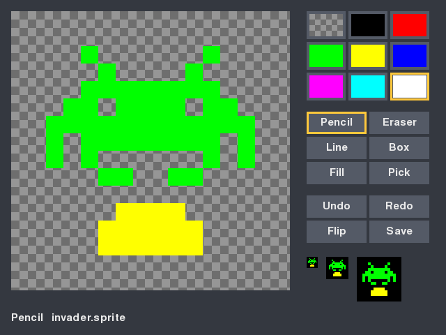
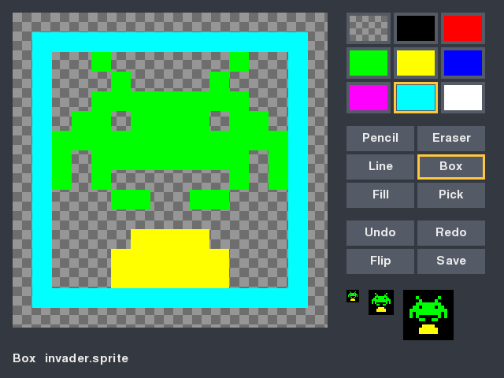

# Project 15 · Sprite Editor

Every game in Part 2 has drawn its characters out of rectangles and lines. Real games have *sprites*: small pictures, drawn by hand, a pixel at a time. On the BBC Micro you drew them on squared paper, added up each row in binary, and typed the eight totals into a `VDU 23`. It was a rite of passage, and nobody misses it.



This is the last project of Part 2, and it's the first thing you've built that's a *tool*, where everything before it was a toy. It has a palette and six drawing tools. It saves files, in a format that you'll design. And it has the feature that separates a tool from a toy, which is **undo**. Undo can't be bolted on afterwards. It shapes the whole program, and the shape it wants is one of the classic designs of object-oriented programming.

It's also where you meet **inheritance**, at last. It's been put off for six projects, on purpose. Most tutorials teach it in the first chapter on classes, with a `Dog` that inherits from `Animal`, and people come away reaching for it everywhere. You've written a dozen classes without it, and you know by now that most don't need it. Here there are two families of classes which do, and one which looks as if it does, and doesn't.

| | |
|---|---|
| **You'll learn** | The command pattern, and undo and redo; inheritance, `super()` and abstract base classes, and when not to; `__getitem__`, `__setitem__` and `__contains__`; designing a file format; `typing.Self`; callbacks, with `partial` |
| **New tool skill** | `logging`; more of the debugger: the call stack, watches, hit counts, stopping on exceptions |
| **Time** | 5 to 6 hours |
| **Before you start** | [Project 14](p14-wireframe.md) |

## Predict

!!! question "Predict"
    ```python
    class Pencil:
        def describe(self):
            return f"I'm a {self.kind()}"

        def kind(self):
            return "pencil"


    class Crayon(Pencil):
        def kind(self):
            return "crayon"


    print(Crayon().describe())
    ```

??? success "Answer"
    ```text
    I'm a crayon
    ```

    `class Crayon(Pencil)` makes a `Crayon` a kind of `Pencil`. It has everything that a `Pencil` has, and then it replaces `kind`. A `Crayon` has no `describe` of its own, and so Python uses `Pencil`'s. But `self` is still the crayon, and so `self.kind()`, called from *inside the parent's method*, finds the child's version. A parent can call methods that its children will supply later. A good deal of this chapter rests on that. Stage 3.

!!! question "Predict"
    ```python
    from abc import ABC, abstractmethod


    class Tool(ABC):
        @abstractmethod
        def drag(self, cell): ...


    class Wand(Tool):
        pass


    print("So far, so good")
    wand = Wand()
    ```

??? success "Answer"
    ```text
    So far, so good
    Traceback (most recent call last):
      ...
    TypeError: Can't instantiate abstract class Wand without an implementation for abstract method 'drag'
    ```

    An *abstract* class is a parent that's unfinished, on purpose. It says what its children must provide. A child that hasn't provided it can be *defined*, and can't be *made*. The error comes at the first attempt to make one, and it tells you exactly what's missing. Stage 2.

!!! question "Predict"
    ```python
    class Grid:
        def __getitem__(self, key):
            return f"you asked for {key!r}"


    grid = Grid()
    print(grid[3])
    print(grid[1, 2])
    print(grid["a":"b"])
    ```

??? success "Answer"
    ```text
    you asked for 3
    you asked for (1, 2)
    you asked for slice('a', 'b', None)
    ```

    Square brackets are a method call, as `+` was in Project 12. Whatever's between them arrives as one argument. Commas make a tuple, as they do everywhere else, so `grid[1, 2]` is `grid[(1, 2)]`, which is just what you want for a grid. Stage 1.

!!! question "Predict"
    ```python
    import logging
    import sys

    logging.basicConfig(
        level=logging.INFO, format="%(levelname)s: %(message)s", stream=sys.stdout
    )
    log = logging.getLogger("editor")

    log.debug("The pointer is at %s", (3, 4))
    log.info("Saved %s", "rocket.sprite")
    log.warning("The disc is nearly full")
    ```

??? success "Answer"
    ```text
    INFO: Saved rocket.sprite
    WARNING: The disc is nearly full
    ```

    Every message has a *level*, and the program has a threshold. Anything below the threshold is dropped. The `debug` line stays in the code for good, costs next to nothing, and appears on the day that somebody turns the threshold down. Stage 5.

## Build

### Stage 1: A sprite, and a file format of your own

```console
$ cd making
$ uv init sprite-editor
$ cd sprite-editor
$ uv add pygame-ce
$ uv add --dev pytest ruff
$ code .
```

A sprite is a small grid of pixels. Each pixel is one of the BBC Micro's eight colours, numbered 0 to 7 as they were in Project 8, or it's *see-through*, so that whatever is behind the sprite shows. See-through will be `None`.

#### The file first

Before any code, decide what a saved sprite looks like. You have choices. A PNG is what the rest of the world would use. JSON would be easy. But this file is going to live in a Git repository beside your code, and that suggests a third way:

```text
# One of the oldest sprites there is.
sprite 8 6
..2..2..
...22...
..2222..
.22.22.2
22222222
2.2..2.2
```

**It's text, and you can see the picture in it.** A full stop is see-through, and a digit is a colour. That buys a good deal. `git diff` will show you which pixels changed. You can mend a sprite in any editor, and make one in a program with `print`. A test can hold a sprite in a string, and you can read the test. The price is that nothing else in the world understands it, which matters less than it seems, since exporting a PNG is one of the challenges.

The first line says what the file is, and how big. Insisting on that line costs nothing now, and it leaves room for the format to grow.

Create `src/sprite_editor/sprite.py`:

<!-- listing: projects/15-sprite-editor/stages/stage1_sprite.py -->
```python title="src/sprite_editor/sprite.py"
"""A sprite: a small picture in eight colours, with see-through parts."""

from dataclasses import dataclass, field
from pathlib import Path
from typing import Self

type Cell = tuple[int, int]
type Colour = int | None  # 0 to 7 are the BBC Micro's colours. None is see-through.

COLOURS = 8
CLEAR = "."


class SpriteError(ValueError):
    """A sprite file that doesn't make sense."""


@dataclass
class Sprite:
    width: int
    height: int
    pixels: dict[Cell, int] = field(default_factory=dict)

    def __contains__(self, cell: Cell) -> bool:
        x, y = cell
        return 0 <= x < self.width and 0 <= y < self.height

    def __getitem__(self, cell: Cell) -> Colour:
        return self.pixels.get(cell)

    def __setitem__(self, cell: Cell, colour: Colour) -> None:
        if cell not in self:
            raise IndexError(f"{cell} isn't in a {self.width} by {self.height} sprite")
        if colour is None:
            self.pixels.pop(cell, None)
        else:
            self.pixels[cell] = colour

    def to_text(self) -> str:
        rows = [
            "".join(
                CLEAR if self[x, y] is None else str(self[x, y])
                for x in range(self.width)
            )
            for y in range(self.height)
        ]
        return "\n".join([f"sprite {self.width} {self.height}", *rows]) + "\n"

    @classmethod
    def from_text(cls, text: str) -> Self:
        lines = [line.strip() for line in text.splitlines()]
        lines = [line for line in lines if line and not line.startswith("#")]
        match lines[0].split() if lines else []:
            case ["sprite", width, height] if width.isdecimal() and height.isdecimal():
                sprite = cls(int(width), int(height))
            case _:
                raise SpriteError("the first line should be like: sprite 16 16")

        rows = lines[1:]
        if len(rows) != sprite.height:
            raise SpriteError(f"there are {len(rows)} rows, and not {sprite.height}")
        for y, row in enumerate(rows):
            if len(row) != sprite.width:
                raise SpriteError(f"row {y} is {len(row)} long, and not {sprite.width}")
            for x, character in enumerate(row):
                if character == CLEAR:
                    continue
                if character not in "01234567":
                    raise SpriteError(f"row {y} has a {character!r} in it")
                sprite[x, y] = int(character)
        return sprite

    def save(self, path: Path) -> None:
        path.write_text(self.to_text(), encoding="utf-8")

    @classmethod
    def load(cls, path: Path) -> Self:
        return cls.from_text(path.read_text(encoding="utf-8"))
```

**The pixels are in a dictionary**, from a cell to a colour, and see-through cells aren't in it at all. It's the design of Project 6's universe: keep what's there, and let absence mean "nothing". It makes equality, emptiness, flipping and counting all into one-liners.

**`__getitem__`, `__setitem__` and `__contains__`** are the methods behind `sprite[x, y]`, `sprite[x, y] = colour`, and `cell in sprite`. They were in Project 12's table of special methods, and the third Predict showed how the brackets work. With them, a `Sprite` behaves like a container, and the code that uses one reads like the thought behind it:

```pycon
>>> from sprite_editor.sprite import Sprite
>>> sprite = Sprite(4, 2)
>>> sprite[1, 0] = 3
>>> sprite[1, 0]
3
>>> print(sprite[0, 0])
None
>>> (9, 9) in sprite
False
>>> print(sprite.to_text(), end="")
sprite 4 2
.3..
....
```

`__setitem__` looks after the rule that `None` means "take it out", so that nothing else has to know how the pixels are kept. It raises `IndexError` for a cell that's off the edge, which is what a list would do.

`from_text` is a parser, of the kind that you wrote for RLE in Project 13, and simpler. It uses `match` on the words of the first line, with a guard to check that the sizes are numbers. The errors say which row is wrong.

#### `cls`, `Self`, and a promise from Project 10

`from_text` and `load` are class methods: other ways of making a sprite, as `Level.from_text` was in Breakout. In Project 10 you were told to write `cls(…)` in these, and not the name of the class, and that the reason would come in Project 15. Here it is. Suppose that a game wants a kind of sprite with something extra:

```pycon
>>> class Stamp(Sprite):
...     """A sprite with a place on the screen."""
>>> stamp = Stamp.from_text("sprite 1 1\n7\n")
>>> type(stamp).__name__
'Stamp'
```

`class Stamp(Sprite)` says that a `Stamp` is a kind of `Sprite`. It gets `from_text` from its parent, unchanged. When you call `Stamp.from_text`, **`cls` is `Stamp`**, and so a `Stamp` is what's made. Had the method said `Sprite(…)`, you'd have asked for a stamp, and been given a plain sprite. `cls` is to a class method what `self` is to an ordinary one: whoever was actually asked.

The return type says so too. **`Self`**, from `typing`, means "whatever class this was called on", so Pylance knows that `Stamp.from_text(…)` is a `Stamp`. It's better than the quoted `"Sprite"` that you've been writing, and it's the right hint for any method that returns `cls(…)` or `self`.

The tests keep a sprite in a string, as the format intended. `tests/test_sprite.py`:

<!-- listing: projects/15-sprite-editor/tests/test_sprite.py -->
```python title="tests/test_sprite.py"
INVADER = """\
sprite 8 6
..2..2..
...22...
..2222..
.22.22.2
22222222
2.2..2.2
"""
# ...
def test_text_goes_there_and_back():
    invader = Sprite.from_text(INVADER)
    assert (invader.width, invader.height) == (8, 6)
    assert invader[2, 0] == 2
    assert invader[0, 0] is None
    assert invader.to_text() == INVADER
# ...
@pytest.mark.parametrize(
    ("old", "new", "complaint"),
    [
        ("sprite 8 6", "sprite 8", "the first line should be like"),
        ("sprite 8 6", "sprite eight 6", "the first line should be like"),
        ("sprite 8 6", "sprite 8 7", "there are 6 rows, and not 7"),
        ("...22...", "...22..", "row 1 is 7 long, and not 8"),
        ("...22...", "...2A...", "row 1 has a 'A' in it"),
        (INVADER, "", "the first line should be like"),
    ],
)
def test_bad_files_are_reported(old, new, complaint):
    assert old in INVADER
    with pytest.raises(SpriteError, match=complaint):
        Sprite.from_text(INVADER.replace(old, new))


def test_a_subclass_makes_its_own_kind():
    class Stamp(Sprite):
        pass

    assert type(Stamp.from_text(INVADER)) is Stamp
```

!!! success "Checkpoint"
    ```console
    $ git add .
    $ git commit -m "Add sprites, and a text format for them"
    ```

### Stage 2: Commands, and how to undo anything

How would you add undo to Project 8's paint program? The obvious way is to keep a copy of the whole picture before every change. It works, and for a 16 by 16 sprite it's even affordable. It doesn't scale, and it tells you nothing: a history that's fifty copies of a picture can't say *what happened*.

The classic answer is to stop changing the picture directly. **Every change becomes an object**, which knows two things: how to *do* itself, and how to *undo* itself. The editor makes one of these objects, asks it to do its work, and puts it on a pile. To undo, it takes the top one off the pile, and asks it to undo. That's the **command pattern**, and every editor you've ever used has it inside.

There'll be several kinds of command. They're all used in the same way, by code that doesn't care which kind it's holding, and each must have a `do` and an `undo`. In Project 12 you'd have written that contract as a `Protocol`. This time there's something to *share* as well, and that tips the balance towards a parent class. Create `src/sprite_editor/commands.py`:

<!-- listing: projects/15-sprite-editor/stages/stage2_commands.py -->
```python title="src/sprite_editor/commands.py"
"""Things that can be done to a sprite, and undone again."""

from abc import ABC, abstractmethod

from sprite_editor.sprite import Cell, Colour, Sprite


class Command(ABC):
    """One change to a sprite, which knows how to put things back."""

    label = "Change"

    @abstractmethod
    def do(self, sprite: Sprite) -> None:
        """Make the change."""

    @abstractmethod
    def undo(self, sprite: Sprite) -> None:
        """Put things back as they were before `do`."""

    def __str__(self) -> str:
        return self.label


class Paint(Command):
    """Set some pixels. Every tool that draws ends up as one of these."""

    def __init__(self, label: str, sprite: Sprite, changes: dict[Cell, Colour]) -> None:
        self.label = label
        self.after = {cell: ink for cell, ink in changes.items() if cell in sprite}
        self.before = {cell: sprite[cell] for cell in self.after}

    def do(self, sprite: Sprite) -> None:
        for cell, colour in self.after.items():
            sprite[cell] = colour

    def undo(self, sprite: Sprite) -> None:
        for cell, colour in self.before.items():
            sprite[cell] = colour

    def __bool__(self) -> bool:
        """A command that would change nothing isn't worth remembering."""
        return self.before != self.after


class Flip(Command):
    """Swap left with right. It needs to remember nothing: doing it twice undoes it."""

    label = "Flip"

    def do(self, sprite: Sprite) -> None:
        last = sprite.width - 1
        sprite.pixels = {(last - x, y): c for (x, y), c in sprite.pixels.items()}

    def undo(self, sprite: Sprite) -> None:
        self.do(sprite)


class Shift(Command):
    """Slide the whole picture along, with whatever falls off one side joining the other."""

    def __init__(self, dx: int, dy: int) -> None:
        self.label = f"Shift {dx:+}, {dy:+}"
        self.dx = dx
        self.dy = dy

    def do(self, sprite: Sprite) -> None:
        slide(sprite, self.dx, self.dy)

    def undo(self, sprite: Sprite) -> None:
        slide(sprite, -self.dx, -self.dy)


def slide(sprite: Sprite, dx: int, dy: int) -> None:
    sprite.pixels = {
        ((x + dx) % sprite.width, (y + dy) % sprite.height): colour
        for (x, y), colour in sprite.pixels.items()
    }
```

#### An abstract base class

`class Command(ABC)` is a class that exists to be a parent. `ABC` comes from the `abc` module, and the name stands for *abstract base class*. `@abstractmethod` marks the methods that every child must supply, and the second Predict showed what happens to a child that doesn't: it can't be made. Nor can `Command` itself. **The mistake is caught on the day that the class is first used, with a message that names the missing method**, and not three weeks later, when somebody presses Undo on the one kind of command that never had one.

An abstract class can hold ordinary things too. `Command` has a `label`, and a `__str__` that returns it, and all of its children get both.

**`class Paint(Command)`** puts the parent in brackets. A `Paint` *is a* `Command`: `isinstance(paint, Command)` is true, and wherever a command is wanted, a `Paint` will do. It supplies `do` and `undo`, and it sets its own `label`, which hides the parent's.

Look at how little `Paint` needs to know. It's given the pixels that are to change, and what they're to become. Before it does anything, it looks at the sprite, and **remembers what's there now**, for those cells only. `do` writes the new colours, and `undo` writes the old ones back. A stroke of the pencil across a huge picture costs a dozen entries in two dictionaries.

`Flip` remembers nothing at all, since flipping twice puts everything back: `undo` *is* `do`. `Shift` slides the picture along, and undoes itself by sliding it back. Those three are all the ways there are of undoing something: remember what was there, do it again, or do the opposite.

#### When not to

Here's a design decision that you might not notice, since it's a thing that isn't there. The pencil, the eraser, the line, the box and the bucket all change pixels. There's no `PencilCommand`, no `FillCommand`, and no `BoxCommand`. They'd differ in nothing but the label and the data, and a difference in data is what *objects* are for. Five tools make one kind of command, `Paint`, with different dictionaries in it.

**A subclass is for different behaviour.** If the only difference between two classes would be the values of their attributes, they're one class.

#### The history

<!-- listing: projects/15-sprite-editor/stages/stage2_commands.py -->
```python title="src/sprite_editor/commands.py"
class History:
    """What's been done, so that it can be undone, and what's been undone, likewise."""

    def __init__(self, sprite: Sprite) -> None:
        self.sprite = sprite
        self.done: list[Command] = []
        self.undone: list[Command] = []

    def __str__(self) -> str:
        return f"{len(self.done)} done, {len(self.undone)} undone"

    def perform(self, command: Command) -> None:
        command.do(self.sprite)
        self.done.append(command)
        self.undone.clear()

    def undo(self) -> None:
        if not self.done:
            return
        command = self.done.pop()
        command.undo(self.sprite)
        self.undone.append(command)

    def redo(self) -> None:
        if not self.undone:
            return
        command = self.undone.pop()
        command.do(self.sprite)
        self.done.append(command)
```

There are two piles. Undo moves a command from `done` to `undone`, and redo moves it back. The only subtle line is `self.undone.clear()`. If you undo three things, and then draw something new, the three are gone for good. They must be: they described changes to a picture that doesn't exist any more. Hold on to that thought until the bug hunt.

`History` holds a list of `Command`. It calls `do` and `undo`, and has no idea how many kinds there are. You can add a fourth kind next year, and this class won't change. The word for that is **polymorphism**, and you've been relying on it since Project 12, where `touching` took anything with a position and a radius. Inheritance is one way of getting it, and duck typing is another.

```pycon
>>> from sprite_editor.commands import Flip, History, Paint
>>> history = History(sprite)
>>> history.perform(Paint("Dot", sprite, {(0, 1): 7}))
>>> history.perform(Flip())
>>> print(sprite.to_text(), end="")
sprite 4 2
..3.
...7
>>> history.undo()
>>> history.undo()
>>> print(sprite.to_text(), end="")
sprite 4 2
.3..
....
>>> [str(command) for command in history.undone]
['Flip', 'Dot']
```

The tests, in `tests/test_commands.py`. The one in the middle is the test for the whole idea, and it's parametrised over every kind of command that doesn't need a sprite to be made. When you invent a new command, add it to the list:

<!-- listing: projects/15-sprite-editor/tests/test_commands.py -->
```python title="tests/test_commands.py"
def test_a_command_has_to_say_how_to_do_and_undo():
    class Half(Command):
        def do(self, sprite):
            sprite.pixels.clear()

    with pytest.raises(TypeError, match="abstract method 'undo'"):
        Half()


def test_paint_remembers_what_was_there(arrow):
    paint = Paint("Dot", arrow, {(0, 0): 3, (1, 0): None, (9, 9): 3})
    assert paint.before == {(0, 0): None, (1, 0): 1}
    paint.do(arrow)
    assert arrow.to_text().splitlines()[1] == "3..."
    paint.undo(arrow)
    assert arrow == Sprite.from_text(ARROW)
# ...
@pytest.mark.parametrize("command", [Flip(), Shift(1, 0), Shift(-3, 2)], ids=str)
def test_whatever_is_done_can_be_undone(arrow, command):
    command.do(arrow)
    assert arrow != Sprite.from_text(ARROW)
    command.undo(arrow)
    assert arrow == Sprite.from_text(ARROW)
# ...
def test_doing_something_new_forgets_what_was_undone(arrow):
    history = History(arrow)
    history.perform(Paint("Red", arrow, {(0, 0): 1}))
    history.undo()
    history.perform(Paint("Blue", arrow, {(0, 0): 4}))
    history.redo()
    assert arrow[0, 0] == 4
    assert history.undone == []
```

!!! success "Checkpoint"
    ```console
    $ git add .
    $ git commit -m "Add commands, and a history with undo and redo"
    ```

### Stage 3: Tools, which are a family

A tool is what the mouse does to the picture. The pencil draws where it goes. The line stretches from where the button went down to where the pointer is now, and so does the box. The bucket fills. The picker picks a colour up. They all have the same three moments, which are **press**, **drag** and **release**, and the editor wants to treat them all alike.

Here's a rule that keeps undo honest: **a tool never touches the sprite.** While the button is down, it gathers up a dictionary of changes. The screen shows them laid over the picture, as a preview. When the button comes up, the tool hands back one `Paint` command, and the *command* changes the sprite. So a whole drag is one entry in the history, and one press of undo.

First, some geometry, which has nothing to do with tools or classes. Create `src/sprite_editor/shapes.py`. You wrote `cells_between` in Project 13, so bring it across. (Ten lines aren't worth a dependency.)

<!-- listing: projects/15-sprite-editor/src/sprite_editor/shapes.py -->
```python title="src/sprite_editor/shapes.py"
def box(start: Cell, end: Cell) -> list[Cell]:
    """Return the cells round the edge of a rectangle, given two opposite corners."""
    (x1, y1), (x2, y2) = start, end
    left, right = sorted((x1, x2))
    top, bottom = sorted((y1, y2))
    return [
        (x, y)
        for x in range(left, right + 1)
        for y in range(top, bottom + 1)
        if x in (left, right) or y in (top, bottom)
    ]


def flood(sprite: Sprite, start: Cell) -> set[Cell]:
    """Return the cells that join on to `start`, and are the same colour as it."""
    target = sprite[start]
    found: set[Cell] = set()
    waiting = [start]
    while waiting:
        cell = waiting.pop()
        if cell in found or cell not in sprite or sprite[cell] != target:
            continue
        found.add(cell)
        x, y = cell
        waiting += [(x + 1, y), (x - 1, y), (x, y + 1), (x, y - 1)]
    return found
```

`flood` finds every cell that's joined on to the starting cell and is the same colour. The textbook version is recursive: fill this cell, and then fill each of its four neighbours. Don't. Project 2 showed that Python gives up at a depth of a thousand calls, and a modest patch of 40 by 40 cells will get there. This version keeps its own list of cells that are `waiting` to be looked at, and goes round a loop until there are none. There's a test which fills 40,000 cells, to make sure.

Now the family. Create `src/sprite_editor/tools.py`:

<!-- listing: projects/15-sprite-editor/stages/stage3_tools.py -->
```python title="src/sprite_editor/tools.py"
"""The things that the mouse can do to a picture."""

from abc import ABC, abstractmethod
from collections.abc import Callable

from sprite_editor.commands import Command, Paint
from sprite_editor.shapes import box, cells_between, flood
from sprite_editor.sprite import Cell, Colour, Sprite


class Tool(ABC):
    """A tool gathers up some changes while the button is down.

    It never touches the sprite itself. When the button comes up, it hands back
    a command, and the command does the work, so that everything can be undone.
    """

    name = "Tool"
    key = "?"

    def __init__(self) -> None:
        self.changes: dict[Cell, Colour] = {}
        self.colour: Colour = None
        self.start: Cell = (0, 0)

    def press(self, sprite: Sprite, cell: Cell, colour: Colour) -> None:
        self.changes = {}
        self.colour = colour
        self.start = cell
        self.drag(sprite, cell)

    @abstractmethod
    def drag(self, sprite: Sprite, cell: Cell) -> None:
        """The pointer is over this cell now, with the button still down."""

    def release(self, sprite: Sprite) -> Command | None:
        command = Paint(self.name, sprite, self.changes)
        self.changes = {}
        return command or None


class Pencil(Tool):
    name = "Pencil"
    key = "p"

    def __init__(self) -> None:
        super().__init__()
        self.last: Cell = (0, 0)

    def press(self, sprite: Sprite, cell: Cell, colour: Colour) -> None:
        self.last = cell
        super().press(sprite, cell, colour)

    def drag(self, sprite: Sprite, cell: Cell) -> None:
        for step in cells_between(self.last, cell):
            self.changes[step] = self.colour
        self.last = cell


class Eraser(Pencil):
    name = "Eraser"
    key = "e"

    def press(self, sprite: Sprite, cell: Cell, colour: Colour) -> None:
        super().press(sprite, cell, None)


class ShapeTool(Tool):
    """A tool that stretches a shape from where the button went down to where it is."""

    def drag(self, sprite: Sprite, cell: Cell) -> None:
        self.changes = dict.fromkeys(self.cells(self.start, cell), self.colour)

    @abstractmethod
    def cells(self, start: Cell, end: Cell) -> list[Cell]:
        """Return the cells of the shape."""


class Line(ShapeTool):
    name = "Line"
    key = "l"

    def cells(self, start: Cell, end: Cell) -> list[Cell]:
        return cells_between(start, end)


class Box(ShapeTool):
    name = "Box"
    key = "b"

    def cells(self, start: Cell, end: Cell) -> list[Cell]:
        return box(start, end)


class Bucket(Tool):
    name = "Fill"
    key = "f"

    def drag(self, sprite: Sprite, cell: Cell) -> None:
        patch = flood(sprite, cell) if cell in sprite else set()
        self.changes = dict.fromkeys(patch, self.colour)


class Picker(Tool):
    """Pick up a colour from the picture. It changes nothing, and so there's no command."""

    name = "Pick"
    key = "i"

    def __init__(self, on_pick: Callable[[Colour], None]) -> None:
        super().__init__()
        self.on_pick = on_pick

    def drag(self, sprite: Sprite, cell: Cell) -> None:
        if cell in sprite:
            self.on_pick(sprite[cell])

    def release(self, sprite: Sprite) -> Command | None:
        return None
```

There are eight classes here, and most of them are four lines long. That's the sign that inheritance is doing some good.

```text
Tool (abstract)
├── Pencil
│   └── Eraser
├── ShapeTool (abstract)
│   ├── Line
│   └── Box
├── Bucket
└── Picker
```

**`Tool`** holds what they have in common. `press` clears the changes, remembers the colour and the starting cell, and then treats the press as the first moment of the drag. `release` wraps the changes up as a `Paint`. (`command or None` uses `Paint.__bool__`: a command that would change nothing is false, and isn't worth a place in the history.) The one thing that `Tool` can't know is what a drag should *do*, and so `drag` is abstract.

**`Pencil`** has something extra to remember, which is where the pointer last was, and so it needs an `__init__` of its own. That `__init__` *replaces* the parent's, and the parent's mustn't be lost, since it sets up `changes`. So the first thing it does is call it:

```python
super().__init__()
```

**`super()` means "my parent's version of this".** A child's method can run the parent's method and then do more, which is called *extending* it, or it can ignore the parent's altogether, which is *overriding*. `Pencil.__init__` extends. So does `Pencil.press`, which notes the cell and then hands on to `Tool.press`.

!!! warning "Gotcha"
    Forget the `super().__init__()` and nothing complains, until the first `self.changes[step] = …`, which is an `AttributeError` about an attribute that you can see being set, in the parent, a few lines above. If a child has an `__init__`, its first line should nearly always be `super().__init__(…)`.

**`Eraser`** is the whole case for inheritance, in one method. An eraser is a pencil that ignores the colour you've chosen, and uses see-through. It says so, and nothing else. Everything that a pencil knows about following the mouse, an eraser knows too, and if you improve the pencil next month, you've improved the eraser.

**`ShapeTool`** is the first Predict, at work. It's abstract too. It knows that a shape stretches from the start to the pointer, and that each drag replaces the last preview. It doesn't know *which* shape, and so it calls `self.cells(…)`, which it hasn't got. `Line` and `Box` supply it, and they supply nothing else. The parent has the recipe, and the children fill in one step. This has a name, the *template method*, and it's the thing that inheritance is best at. The Extend challenges add a filled box and an ellipse, at one method each.

**`Picker`** changes nothing, and so its `release` returns `None`, overriding the parent's. What it does need is a way to tell the editor which colour was picked, and it mustn't know anything about the editor. So it's handed a function when it's made, `on_pick`, and it calls it. That's a **callback**: "here's what to do when it happens". You gave one to `turtle.onkey` in Project 2. The whole of Stage 4 runs on them.

You can ask any class who its ancestors are, and in what order Python will search them for a method. It's called the *method resolution order*:

```pycon
>>> from sprite_editor.tools import Eraser
>>> [kind.__name__ for kind in Eraser.__mro__]
['Eraser', 'Pencil', 'Tool', 'ABC', 'object']
```

Every class ends in `object`, which is where a default `__repr__` and `__eq__` have been coming from all this time.

#### Inheritance, protocols, or neither?

You now have three ways of making different classes usable in one place. Here's how to choose.

| | Use it when |
|---|---|
| **Nothing at all** | The classes only need to have the right methods. Duck typing needs no permission. |
| **A `Protocol`** (Project 12) | You want Pylance to check that they have the right methods. The classes needn't know about each other, or about the protocol. Asteroids' `Body` |
| **An abstract base class** | There's *code* to share as well as a contract, and the children are truly kinds of the parent. `Tool`, `Command` |
| **One class, with different data** | The "kinds" would differ only in their values. `Paint` |
| **Composition** (Project 11) | One thing *has* another, or uses it. A `History` has commands. It isn't one. |

The test for inheritance is the phrase **"is a kind of"**, taken seriously: could the child be used *anywhere* that the parent could, without surprising anybody? An eraser can go wherever a pencil can. When the honest answer is "mostly", or "it would have to switch off some of what the parent does", you want one of the other rows. And keep family trees shallow. Three levels is plenty. When a class's behaviour is spread over six ancestors, nobody can find anything.

The tests drive each tool through press, drag and release, with no window and no mouse. `tests/test_tools.py`:

<!-- listing: projects/15-sprite-editor/tests/test_tools.py -->
```python title="tests/test_tools.py"
def stroke(tool: Tool, sprite: Sprite, cells: list, colour=2):
    """Press on the first cell, drag through the rest, and let go."""
    tool.press(sprite, cells[0], colour)
    for cell in cells[1:]:
        tool.drag(sprite, cell)
    return tool.release(sprite)
# ...
def test_a_tool_changes_nothing_until_it_lets_go(ring):
    pencil = Pencil()
    pencil.press(ring, (0, 0), 2)
    pencil.drag(ring, (4, 0))
    assert pencil.changes == dict.fromkeys([(0, 0), (1, 0), (2, 0), (3, 0), (4, 0)], 2)
    assert ring == Sprite.from_text(RING)

    command = pencil.release(ring)
    assert isinstance(command, Paint)
    assert str(command) == "Pencil"
    assert pencil.changes == {}
    command.do(ring)
    assert ring.to_text().splitlines()[1] == "22222"


def test_the_eraser_is_a_pencil_that_ignores_the_colour(ring):
    eraser = Eraser()
    assert isinstance(eraser, Pencil)
    command = stroke(eraser, ring, [(1, 1), (3, 1)], colour=6)
    assert command.after == {(1, 1): None, (2, 1): None, (3, 1): None}
    assert str(command) == "Eraser"


def test_rubbing_out_nothing_is_no_command_at_all(ring):
    assert stroke(Eraser(), ring, [(0, 0), (4, 0)]) is None
# ...
def test_the_picker_reports_and_draws_nothing(ring):
    picked = []
    picker = Picker(on_pick=picked.append)
    assert stroke(picker, ring, [(1, 1), (2, 2), (7, 7)]) is None
    assert picked == [1, None]


def test_the_family():
    with pytest.raises(TypeError, match="abstract"):
        ShapeTool()
    assert [kind.__name__ for kind in Line.__mro__] == [
        "Line", "ShapeTool", "Tool", "ABC", "object",
    ]  # fmt: skip
```

Look at `picked.append` in the picker's test. The callback is a bound method of a list. The test hands the picker somewhere to write down what it's told, and then reads it. Project 7 called that a spy.

!!! success "Checkpoint"
    ```console
    $ git add .
    $ git commit -m "Add the tools: pencil, eraser, line, box, bucket and picker"
    ```

### Stage 4: A window full of callbacks

The games in this part had a handful of keys. An editor has a screen full of things to click, and each does something different. You could write one enormous `if` that compares the pointer with each button's rectangle in turn. The better way is for each button to carry its own instructions. Create `src/sprite_editor/widgets.py`:

<!-- listing: projects/15-sprite-editor/src/sprite_editor/widgets.py -->
```python title="src/sprite_editor/widgets.py"
"""Things on the screen that can be clicked, and the picture itself."""

from collections.abc import Callable

import pygame

from sprite_editor.sprite import Cell, Colour, Sprite

PALETTE = [
    (0, 0, 0), (255, 0, 0), (0, 255, 0), (255, 255, 0),
    (0, 0, 255), (255, 0, 255), (0, 255, 255), (255, 255, 255),
]  # fmt: skip
PANEL = (52, 56, 64)
RAISED = (84, 90, 102)
LIT = (255, 200, 60)
TEXT = (235, 235, 235)
CHECKS = ((150, 150, 150), (110, 110, 110))


def draw_checks(window: pygame.Surface, rect: pygame.Rect, size: int) -> None:
    """Fill a rectangle with grey squares, which is how see-through is shown."""
    for y in range(rect.top, rect.bottom, size):
        for x in range(rect.left, rect.right, size):
            shade = CHECKS[(x - rect.left + y - rect.top) // size % 2]
            square = pygame.Rect(x, y, size, size).clip(rect)
            window.fill(shade, square)


class Button:
    def __init__(
        self,
        rect: pygame.Rect,
        label: str,
        on_click: Callable[[], None],
        is_on: Callable[[], bool] = lambda: False,
    ) -> None:
        self.rect = rect
        self.label = label
        self.on_click = on_click
        self.is_on = is_on

    def draw(self, window: pygame.Surface, font: pygame.font.Font) -> None:
        window.fill(RAISED, self.rect)
        self.draw_face(window, font)
        if self.is_on():
            pygame.draw.rect(window, LIT, self.rect, width=3)

    def draw_face(self, window: pygame.Surface, font: pygame.font.Font) -> None:
        words = font.render(self.label, True, TEXT)
        window.blit(words, words.get_rect(center=self.rect.center))


class Swatch(Button):
    """A button with a colour on its face where a plain one has words."""

    def __init__(
        self,
        rect: pygame.Rect,
        colour: Colour,
        on_click: Callable[[], None],
        is_on: Callable[[], bool],
    ) -> None:
        super().__init__(rect, f"colour {colour}", on_click, is_on)
        self.colour = colour

    def draw_face(self, window: pygame.Surface, font: pygame.font.Font) -> None:
        face = self.rect.inflate(-8, -8)
        if self.colour is None:
            draw_checks(window, face, 8)
        else:
            window.fill(PALETTE[self.colour], face)


class Canvas:
    """The picture, blown up, with whatever the tool is about to do laid over it."""

    def __init__(self, rect: pygame.Rect, sprite: Sprite) -> None:
        self.zoom = min(rect.width // sprite.width, rect.height // sprite.height)
        self.rect = pygame.Rect(
            rect.left, rect.top, sprite.width * self.zoom, sprite.height * self.zoom
        )

    def cell_at(self, position: tuple[int, int]) -> Cell:
        x, y = position
        return (x - self.rect.left) // self.zoom, (y - self.rect.top) // self.zoom

    def draw(
        self, window: pygame.Surface, sprite: Sprite, changes: dict[Cell, Colour]
    ) -> None:
        draw_checks(window, self.rect, self.zoom // 2)
        showing = sprite.pixels | changes
        for (x, y), colour in showing.items():
            if colour is not None and (x, y) in sprite:
                left = self.rect.left + x * self.zoom
                top = self.rect.top + y * self.zoom
                window.fill(PALETTE[colour], (left, top, self.zoom, self.zoom))


def draw_actual_size(
    window: pygame.Surface, sprite: Sprite, corner: tuple[int, int], scale: int
) -> pygame.Rect:
    """Draw the sprite small, as it'll look in a game, and return where it went."""
    left, top = corner
    rect = pygame.Rect(left, top, sprite.width * scale, sprite.height * scale)
    window.fill((0, 0, 0), rect)
    for (x, y), colour in sprite.pixels.items():
        window.fill(PALETTE[colour], (left + x * scale, top + y * scale, scale, scale))
    return rect
```

**A `Button` has two callbacks.** `on_click` is what to do when it's pressed. `is_on` answers a question: ought this button to be lit up, at the moment? The button doesn't know what either of them does. It knows nothing about tools, colours or histories, and that's why one class can serve for all nineteen buttons.

**`Swatch(Button)`** is a button with a colour on its face, where a plain one has words. `Button.draw` is another template method: it draws the background, calls `self.draw_face`, and adds the highlight. `Swatch` replaces the face, and leaves the rest alone. Its `__init__` extends the parent's, passing most of what it's given up through `super().__init__(…)`. User interface toolkits are built like this from top to bottom, and you'll see it again with Textual in Part 5.

**`Canvas`** converts between pixels and cells, like Project 13's camera, and draws the picture. `cell_at` uses `//`, which rounds down, and so a pointer to the left of the picture is in column −1, and not column 0. You paid for that knowledge last time. `sprite.pixels | changes` merges two dictionaries into a new one, with the right-hand side winning wherever both have the same key. That one expression is the entire preview: the picture, with the tool's pending changes laid over it.

Now the application. Create `src/sprite_editor/app.py`. It's long, and there's nothing new in its shape. Here's the first half:

<!-- listing: projects/15-sprite-editor/stages/stage4_app.py -->
```python title="src/sprite_editor/app.py"
"""A sprite editor, with tools, undo and redo."""

import argparse
from functools import partial
from pathlib import Path

import pygame

from sprite_editor.commands import Flip, History, Shift
from sprite_editor.sprite import Colour, Sprite, SpriteError
from sprite_editor.tools import Box, Bucket, Eraser, Line, Pencil, Picker, Tool
from sprite_editor.widgets import (
    PANEL,
    TEXT,
    Button,
    Canvas,
    Swatch,
    draw_actual_size,
)

SIZE = (640, 480)
COMMAND_KEYS = pygame.KMOD_CTRL | pygame.KMOD_META
COLOUR_KEYS: dict[str, Colour] = {".": None} | {str(n): n for n in range(8)}
ARROWS = {
    pygame.K_LEFT: (-1, 0),
    pygame.K_RIGHT: (1, 0),
    pygame.K_UP: (0, -1),
    pygame.K_DOWN: (0, 1),
}


class App:
    def __init__(self, window: pygame.Surface, sprite: Sprite, path: Path) -> None:
        self.window = window
        self.font = pygame.font.Font(None, 22)
        self.sprite = sprite
        self.path = path
        self.history = History(sprite)
        self.saved = list(self.history.done)
        self.canvas = Canvas(pygame.Rect(16, 16, 400, 400), sprite)
        self.colour: Colour = 7
        self.tools: list[Tool] = [
            Pencil(),
            Eraser(),
            Line(),
            Box(),
            Bucket(),
            Picker(on_pick=self.choose_colour),
        ]
        self.tool = self.tools[0]
        self.drawing = False
        self.message = ""
        self.buttons = self.make_buttons()

    def make_buttons(self) -> list[Button]:
        buttons: list[Button] = []
        colours: list[Colour] = [None, *range(8)]
        for number, colour in enumerate(colours):
            rect = pygame.Rect(440 + number % 3 * 60, 16 + number // 3 * 44, 56, 40)
            choose = partial(self.choose_colour, colour)
            chosen = partial(self.colour_is, colour)
            buttons.append(Swatch(rect, colour, choose, chosen))

        for number, tool in enumerate(self.tools):
            rect = pygame.Rect(440 + number % 2 * 90, 160 + number // 2 * 36, 86, 32)
            choose = partial(self.choose_tool, tool)
            chosen = partial(self.tool_is, tool)
            buttons.append(Button(rect, tool.name, choose, chosen))

        actions = {
            "Undo": self.history.undo,
            "Redo": self.history.redo,
            "Flip": partial(self.history.perform, Flip()),
            "Save": self.save,
        }
        for number, (label, action) in enumerate(actions.items()):
            rect = pygame.Rect(440 + number % 2 * 90, 280 + number // 2 * 36, 86, 32)
            buttons.append(Button(rect, label, action))
        return buttons
```

`make_buttons` is where everything is wired together. Every button is given a function to call, and there are four different ways of coming by one on show.

- **`self.history.undo`**, with no brackets, is a *bound method*: a function that remembers which object it belongs to. It needs no arguments, and so it can be handed over as it stands.
- **`partial(self.choose_colour, colour)`** is for a method that *does* need an argument. `partial`, from Project 7, makes a new function with the argument already filled in. There are nine swatches, made in a loop, and each gets a `partial` with its own colour inside it.
- **`partial(self.history.perform, Flip())`** is the same trick, with a command for the argument.
- **`Picker(on_pick=self.choose_colour)`**, up in `__init__`, hands over a bound method that expects one argument, which the picker will supply when the time comes.

!!! warning "Gotcha"
    It's tempting to write `lambda: self.choose_colour(colour)` in that loop, and it would be wrong in the way that Project 7 warned about: every swatch would choose white, since they'd all share one variable called `colour`, and white is what it held when the loop finished. Ruff catches it, as B023. `partial` takes the value there and then. There's a test, `test_each_swatch_chooses_its_own_colour_and_not_the_last_one`, which is there to keep it that way.

And the second half:

<!-- listing: projects/15-sprite-editor/stages/stage4_app.py -->
```python title="src/sprite_editor/app.py"
    def choose_colour(self, colour: Colour) -> None:
        self.colour = colour

    def colour_is(self, colour: Colour) -> bool:
        return self.colour == colour

    def choose_tool(self, tool: Tool) -> None:
        self.tool = tool

    def tool_is(self, tool: Tool) -> bool:
        return self.tool is tool

    @property
    def changed(self) -> bool:
        return self.history.done != self.saved

    def save(self) -> None:
        try:
            self.sprite.save(self.path)
        except OSError as error:
            self.message = f"Couldn't save: {error}"
        else:
            self.saved = list(self.history.done)
            self.message = f"Saved {self.path.name}"

    def handle(self, event: pygame.event.Event) -> bool:
        """Deal with one event. Return False when it's time to stop."""
        match event.type:
            case pygame.QUIT:
                return False
            case pygame.KEYDOWN:
                self.key(event.key, event.mod)
            case pygame.MOUSEBUTTONDOWN if event.button == 1:
                self.click(event.pos)
            case pygame.MOUSEMOTION if self.drawing:
                self.tool.drag(self.sprite, self.canvas.cell_at(event.pos))
            case pygame.MOUSEBUTTONUP if event.button == 1 and self.drawing:
                self.drawing = False
                if command := self.tool.release(self.sprite):
                    self.history.perform(command)
        return True

    def click(self, position: tuple[int, int]) -> None:
        self.message = ""
        for button in self.buttons:
            if button.rect.collidepoint(position):
                button.on_click()
                return
        if self.canvas.rect.collidepoint(position):
            self.drawing = True
            self.tool.press(self.sprite, self.canvas.cell_at(position), self.colour)

    def key(self, key: int, mod: int) -> None:
        letters = {tool.key: tool for tool in self.tools}
        name = pygame.key.name(key)
        if mod & COMMAND_KEYS:
            match name:
                case "z" if mod & pygame.KMOD_SHIFT:
                    self.history.redo()
                case "z":
                    self.history.undo()
                case "y":
                    self.history.redo()
                case "s":
                    self.save()
        elif name in letters:
            self.choose_tool(letters[name])
        elif name in COLOUR_KEYS:
            self.choose_colour(COLOUR_KEYS[name])
        elif name == "h":
            self.history.perform(Flip())
        elif key in ARROWS:
            self.history.perform(Shift(*ARROWS[key]))

    def draw(self) -> None:
        self.window.fill(PANEL)
        changes = self.tool.changes if self.drawing else {}
        self.canvas.draw(self.window, self.sprite, changes)
        for button in self.buttons:
            button.draw(self.window, self.font)

        left = 440
        for scale in (1, 2, 4):
            rect = draw_actual_size(self.window, self.sprite, (left, 368), scale)
            left = rect.right + 12

        star = "*" if self.changed else ""
        status = self.message or f"{self.tool.name}   {self.path.name}{star}"
        self.window.blit(self.font.render(status, True, TEXT), (16, 448))


def open_sprite(path: Path, size: int) -> Sprite:
    if not path.exists():
        return Sprite(size, size)
    try:
        return Sprite.load(path)
    except (OSError, SpriteError) as error:
        raise SystemExit(f"Can't open {path}: {error}") from error


def main() -> None:
    parser = argparse.ArgumentParser(description=__doc__)
    parser.add_argument("path", nargs="?", type=Path, default=Path("untitled.sprite"))
    parser.add_argument("--size", type=int, default=16, help="of a new sprite")
    args = parser.parse_args()

    sprite = open_sprite(args.path, args.size)
    pygame.init()
    window = pygame.display.set_mode(SIZE)
    pygame.display.set_caption(f"Sprite editor: {args.path.name}")
    clock = pygame.time.Clock()
    app = App(window, sprite, args.path)

    running = True
    while running:
        for event in pygame.event.get():
            running = app.handle(event) and running
        app.draw()
        pygame.display.flip()
        clock.tick(60)

    pygame.quit()
```

**`click` is the event router.** It offers the click to each button in turn, and the first whose rectangle contains the pointer gets it. If no button wants it, and it's on the canvas, a drag begins. After that, `handle` passes movements on to whichever tool is current, by calling `drag`, and it neither knows nor cares which tool that is. When the button comes up, whatever the tool hands back goes to the history. The walrus, from Project 12, deals with the tools that hand back `None`.

**`mod & COMMAND_KEYS`** asks whether ++ctrl++ or ++cmd++ was held down. Pygame packs all the modifier keys into one number, with a bit for each, and `&` picks out the ones that you're asking about, as `|` combined two flags when you made the window. Project 19 explains bits properly. For now, read `mod & X` as "is X held?".

**`changed`** decides whether to show a star beside the file's name. The editor keeps a copy of the `done` list as it was at the last save, and compares. Undo back to where you saved, and the star goes out.

Set the command in `pyproject.toml` to `sprite-editor = "sprite_editor.app:main"`.

!!! example "Run it"
    ```console
    $ uv run sprite-editor rocket.sprite
    ```

    Draw something. ++p++, ++e++, ++l++, ++b++, ++f++ and ++i++ choose the tools, ++0++ to ++7++ the colours, and ++period++ is see-through, as it is in the file. ++h++ flips, and the arrow keys slide the picture round. ++ctrl+z++ undoes, and ++ctrl+y++ or ++ctrl+shift+z++ redoes, with ++cmd++ in place of ++ctrl++ on a Mac. ++ctrl+s++ saves.

    

    Drag out a box, and watch it follow the pointer without damaging what's underneath. Let go, and undo it with one keystroke. Then save, and have a look at the file:

    ```console
    $ cat rocket.sprite
    $ git diff rocket.sprite
    ```

??? note "A bug that the tests caught while this chapter was being written"
    The first version worked out each tool's key from the first letter of its name. It passed every test but one: pressing ++p++ chose the picker. There are two tools that begin with P, and the second had quietly replaced the first in a dictionary comprehension. Each tool now says what its `key` is. It's the sort of bug that nobody would think to look for, and a test stumbled over it by pressing a key and checking what happened.

The app's tests send it mouse and key events. There are three small helpers, `press`, `drag` and `click`, and with those the tests read like a list of instructions to somebody sitting at the editor. `tests/test_app.py`:

<!-- listing: projects/15-sprite-editor/tests/test_app.py -->
```python title="tests/test_app.py"
def drag(app: App, *cells: tuple[int, int]) -> None:
    app.handle(event(pygame.MOUSEBUTTONDOWN, button=1, pos=middle_of(app, cells[0])))
    for cell in cells[1:]:
        app.handle(event(pygame.MOUSEMOTION, pos=middle_of(app, cell)))
    app.handle(event(pygame.MOUSEBUTTONUP, button=1, pos=middle_of(app, cells[-1])))


def click(app: App, label: str) -> None:
    button = next(button for button in app.buttons if button.label == label)
    app.handle(event(pygame.MOUSEBUTTONDOWN, button=1, pos=button.rect.center))
    app.handle(event(pygame.MOUSEBUTTONUP, button=1, pos=button.rect.center))
# ...
def test_a_drag_is_one_command_and_one_undo(app):
    drag(app, (2, 2), (5, 2), (5, 6))
    assert len(app.sprite.pixels) == 8
    assert [str(command) for command in app.history.done] == ["Pencil"]
    press(app, pygame.K_z, pygame.KMOD_CTRL)
    assert app.sprite.pixels == {}


def test_nothing_is_changed_until_the_button_comes_up(app):
    app.handle(event(pygame.MOUSEBUTTONDOWN, button=1, pos=middle_of(app, (2, 2))))
    app.handle(event(pygame.MOUSEMOTION, pos=middle_of(app, (9, 2))))
    assert app.sprite.pixels == {}
    app.draw()
    assert app.window.get_at(middle_of(app, (6, 2)))[:3] == PALETTE[7]


def test_every_button_does_what_it_says(app):
    click(app, "colour 1")
    click(app, "Line")
    drag(app, (0, 0), (3, 0))
    assert app.sprite[3, 0] == 1

    click(app, "Flip")
    assert app.sprite[15, 0] == 1
    click(app, "Undo")
    click(app, "Undo")
    assert app.sprite.pixels == {}
    click(app, "Redo")
    assert app.sprite[0, 0] == 1
```

!!! success "Checkpoint"
    Run, test, lint, diff, commit.

    ```console
    $ git add .
    $ git commit -m "Add the window: buttons, swatches, a canvas and the keys"
    ```

### Stage 5: `logging`: prints that you can leave in

Since Project 1 you've found things out by adding a `print`, looking, and taking it out again. It works, and it has three faults. You have to take it out. It's all or nothing. And it's no help to the user who writes to say that the editor ate a drawing last Tuesday.

The `logging` module is `print` for grown-up programs. A logging call **stays in the code for good**. Each one has a **level**, to say how much it matters, and the program decides, as it starts, how much it wants to hear, and where to put it.

| Level | For |
|---|---|
| `DEBUG` | The blow-by-blow. "Did Pencil. 3 done, 0 undone." Normally off. |
| `INFO` | Milestones in normal running. "Saved rocket.sprite." |
| `WARNING` | Something went wrong, and the program has coped. This is the usual threshold. |
| `ERROR` | Something went wrong, and some piece of work couldn't be done. |
| `CRITICAL` | The program can't go on. |

**Each module gets a logger of its own**, named after the module. Add two lines at the top of `sprite.py`, `commands.py`, `tools.py` and `app.py`:

```python
import logging

log = logging.getLogger(__name__)
```

`__name__` is the module's dotted name, so that's the logger called `sprite_editor.commands`, and so on. The name goes into every message, and you can turn one module up and another down.

Then say what happens, where it happens. In `sprite.py`:

<!-- listing: projects/15-sprite-editor/src/sprite_editor/sprite.py -->
```python title="src/sprite_editor/sprite.py"
    def save(self, path: Path) -> None:
        path.write_text(self.to_text(), encoding="utf-8")
        log.info("Saved %s: %d pixels", path, len(self.pixels))

    @classmethod
    def load(cls, path: Path) -> Self:
        sprite = cls.from_text(path.read_text(encoding="utf-8"))
        log.info("Loaded %s: %d by %d", path, sprite.width, sprite.height)
        return sprite
```

In the history, where a record of what was done is just what you'd want when something goes wrong with undo:

<!-- listing: projects/15-sprite-editor/src/sprite_editor/commands.py -->
```python title="src/sprite_editor/commands.py"
    def note(self, verb: str, command: Command) -> None:
        done, undone = len(self.done), len(self.undone)
        log.debug("%s %s. %d done, %d undone", verb, command, done, undone)

    def perform(self, command: Command) -> None:
        command.do(self.sprite)
        self.done.append(command)
        self.undone.clear()
        self.note("Did", command)

    def undo(self) -> None:
        if not self.done:
            log.debug("Nothing to undo")
            return
        command = self.done.pop()
        command.undo(self.sprite)
        self.undone.append(command)
        self.note("Undid", command)

    def redo(self) -> None:
        if not self.undone:
            log.debug("Nothing to redo")
            return
        command = self.undone.pop()
        command.do(self.sprite)
        self.done.append(command)
        self.note("Redid", command)
```

Add a `log.debug("Picked %s at %s", sprite[cell], cell)` to `Picker.drag`, a `log.debug("Chose the %s", tool.name)` to `App.choose_tool`, a `log.warning("Couldn't save %s: %s", self.path, error)` to the `except` in `App.save`, and a `log.info` to `open_sprite`, to say that the file wasn't there and you're starting afresh.

**A logging call takes `%s` and arguments, and not an f-string.** It's the one place left in modern Python where the old `%` style is the right one, and there's a reason. `log.debug(f"Did {command}")` builds the string every time, and then throws it away when debugging is off. `log.debug("Did %s", command)` hands over the pieces, and they're only put together if somebody's listening.

!!! warning "Gotcha"
    That laziness has a sharp edge, and it cut the first draft of this chapter. `History.note` used to pass *itself* to the logger, with a `__str__` that gave the counts. The messages were right on the screen, and wrong in the tests, which said "0 done, 1 undone" after a `perform`. The log record had kept a reference to the history, and pytest didn't turn it into text until later, by which time an undo had happened. **Hand the logger values, and not things that are going to change.** That's why `note` works out two plain numbers first.

#### Switching it on

Modules make messages. Only the *program* decides what becomes of them, once, as it starts. In `main`:

<!-- listing: projects/15-sprite-editor/src/sprite_editor/app.py -->
```python title="src/sprite_editor/app.py"
def main() -> None:
    parser = argparse.ArgumentParser(description=__doc__)
    parser.add_argument("path", nargs="?", type=Path, default=Path("untitled.sprite"))
    parser.add_argument("--size", type=int, default=16, help="of a new sprite")
    parser.add_argument("-v", "--verbose", action="count", default=0)
    parser.add_argument("--log-file", type=Path, help="where to write the log")
    args = parser.parse_args()

    levels = [logging.WARNING, logging.INFO, logging.DEBUG]
    logging.basicConfig(
        level=levels[min(args.verbose, 2)],
        format="%(asctime)s %(levelname)-7s %(name)s: %(message)s",
        filename=args.log_file,
    )
```

`action="count"` is an `argparse` trick for flags that can be repeated: no `-v` is 0, `-v` is 1, and `-vv` is 2. That number picks a level out of a list. `basicConfig` sets the threshold, the format of each line, and, if you gave it a `filename`, a file to write to in place of the screen.

!!! example "Run it"
    ```console
    $ uv run sprite-editor rocket.sprite -vv
    2026-09-20 17:03:41,036 INFO    sprite_editor.app: rocket.sprite isn't there yet, so here's a blank 16 by 16
    2026-09-20 17:03:41,037 DEBUG   sprite_editor.commands: Did Pencil. 1 done, 0 undone
    2026-09-20 17:03:41,037 DEBUG   sprite_editor.app: Chose the Line
    2026-09-20 17:03:41,037 DEBUG   sprite_editor.commands: Did Line. 2 done, 0 undone
    2026-09-20 17:03:41,037 DEBUG   sprite_editor.commands: Undid Line. 1 done, 1 undone
    2026-09-20 17:03:41,037 DEBUG   sprite_editor.commands: Undid Pencil. 0 done, 2 undone
    2026-09-20 17:03:41,037 DEBUG   sprite_editor.commands: Nothing to undo
    2026-09-20 17:03:41,037 INFO    sprite_editor.sprite: Saved rocket.sprite: 0 pixels
    ```

    Draw, undo and save, and watch the terminal. Then run it with `-v`, and then with nothing, and then with `-vv --log-file editor.log`. The program is the same each time. When a user reports a bug, "run it with `-vv --log-file`, and send me the file" is the most useful sentence you know.

!!! tip "Pythonic"
    **Libraries log, and applications configure.** A module that might be imported by somebody else's program should get a logger and use it, and never call `basicConfig`, since that isn't its decision. Your `beeb` package, and your `life`, are libraries. `main` is an application.

#### One place for a catch-all

Every tutorial, this one included, tells you never to write a bare `except Exception`. Here's the exception to that. An editor mustn't die, and take an hour's drawing with it, because one tool has a bug. At the very top of the event loop, and nowhere else:

<!-- listing: projects/15-sprite-editor/src/sprite_editor/app.py -->
```python title="src/sprite_editor/app.py"
    running = True
    while running:
        for event in pygame.event.get():
            try:
                running = app.handle(event) and running
            except Exception:
                log.exception("Something went wrong with %s", event)
                app.message = "Something went wrong. It's in the log."
```

**`log.exception`** logs at `ERROR`, and adds the whole traceback, so that nothing is hidden:

```text
2026-09-20 17:03:41,037 ERROR   sprite_editor.app: Something went wrong with <Event(1025-MouseButtonDown {'pos': (41, 41), 'button': 1})>
Traceback (most recent call last):
  ...
ZeroDivisionError: division by zero
```

The rules for a catch-all are: only at the outermost level, only where carrying on is truly better than stopping, and *always* with the traceback logged. Swallowing an exception in silence is still the worst thing that you can do in Python.

#### Testing what's logged

pytest has a fixture for it, called **`caplog`**:

<!-- listing: projects/15-sprite-editor/tests/test_commands.py -->
```python title="tests/test_commands.py"
def test_the_history_keeps_a_diary(arrow, caplog):
    caplog.set_level("DEBUG", logger="sprite_editor.commands")
    history = History(arrow)
    history.perform(Flip())
    history.undo()
    history.undo()
    assert caplog.messages == [
        "Did Flip. 1 done, 0 undone",
        "Undid Flip. 0 done, 1 undone",
        "Nothing to undo",
    ]
```

Don't test every message, which would make them a nuisance to reword. Do test the ones that somebody is relying on: that a failed save produces a `WARNING`, for one.

!!! success "Checkpoint"
    ```console
    $ git add .
    $ git commit -m "Add logging, with -v, -vv and --log-file"
    ```

### Stage 6: More of the debugger

A program made of callbacks raises a new kind of question, which is *how did I get here?* Nothing calls `choose_colour` by name. The debugger can tell you.

Project 8's launch configuration ran whichever file was open. This program is a package, with a command line, and so it wants a configuration of its own. Create `.vscode/launch.json`:

<!-- listing: projects/15-sprite-editor/.vscode/launch.json -->
```json title=".vscode/launch.json"
{
    "version": "0.2.0",
    "configurations": [
        {
            "name": "Sprite editor",
            "type": "debugpy",
            "request": "launch",
            "module": "sprite_editor.app",
            "args": ["rocket.sprite", "-vv"],
            "console": "integratedTerminal"
        }
    ]
}
```

`"module"` runs the program as `python -m sprite_editor.app` would. Project 5 said that a package with a command of its own has no need of the `__name__` guard, and for `uv run sprite-editor` that's still so. But `python -m` runs the module as a script, and a script with no guard defines `main`, and then stops without calling it. So add the two lines from Project 4, at the very bottom of `app.py`:

```python
if __name__ == "__main__":
    main()
```

Then try four things.

**The call stack.** Put a breakpoint inside `choose_colour`, press ++f5++, and click a swatch. The **Call Stack** panel shows the whole chain, with the most recent at the top: `choose_colour`, called by `click`, called by `handle`, called by `main`. Click on any of those lines, and the editor jumps to it, with the **Variables** panel showing *that* function's variables, as they were at the moment it made the call. Click on `click`, and you can see which `button` it was.

**Watches.** In the **Watch** panel, add `len(self.history.done)`, and `self.tool.name`. They're worked out again every time that the program stops, so you needn't go digging through `self` each time.

**Conditions and hit counts.** You met conditional breakpoints in Project 8. Put one in `History.perform`, with the condition `self.undone`, and it'll stop only when something new is being done while there are undone commands waiting, which is the very moment that the bug hunt is about. Edit the breakpoint again, and choose **Hit Count**: a breakpoint in `Pencil.drag` with a hit count of `20` lets nineteen drags go by, and stops on the twentieth.

**Stopping on exceptions.** At the bottom of the **Breakpoints** panel are tick-boxes for **Raised Exceptions** and **Uncaught Exceptions**. Your catch-all now catches everything, which is good for users, and a nuisance for you, since a bug becomes a line in a log. Tick **Raised Exceptions**, and the debugger stops at the moment that any exception is raised, caught or not, with everything still there to be looked at. Untick it when you've finished, as Pygame and the standard library raise and catch a few of their own in the ordinary way of things.

## Type-in listing

A sprite file is already a picture, in text. This shows one in colour, in the terminal, at two pixels to a character. Save it as `show.py`, and run it with `uv run show.py rocket.sprite`.

<!-- listing: projects/15-sprite-editor/show.py -->
```python title="show.py" linenums="1"
import sys
from pathlib import Path

RESET = "\x1b[0m"


def paint(top: str, bottom: str) -> str:
    """Return one character that shows two pixels, one above the other."""
    if top == bottom == ".":
        return RESET + " "
    if top == ".":
        return f"{RESET}\x1b[3{bottom}m▄"
    if bottom == ".":
        return f"{RESET}\x1b[3{top}m▀"
    return f"\x1b[3{top};4{bottom}m▀"


lines = Path(sys.argv[1]).read_text(encoding="utf-8").splitlines()
rows = [line for line in lines if line and line[0] in ".01234567"]
if len(rows) % 2:
    rows.append("." * len(rows[0]))

for upper, lower in zip(rows[::2], rows[1::2], strict=True):
    print("".join(paint(*pair) for pair in zip(upper, lower, strict=True)) + RESET)
```

1. `\x1b[31m` tells a terminal to write in red from now on, and `\x1b[41m` to use a red background. The BBC Micro's colours were 0 black, 1 red, 2 green, 3 yellow, 4 blue, 5 magenta, 6 cyan and 7 white. What luck does line 15 rely on?
2. `▀` is a character whose top half is solid. How does one character show two pixels of different colours? What's `▄` for?
3. What are `rows[::2]` and `rows[1::2]`? Why is line 21 there?
4. `paint(*pair)`: what's `pair`, and what does the star do?
5. Line 19 finds the rows of pixels without parsing the header. How? What would fool it?

## Bug hunt

A user of a colleague's version of the editor has written in:

> I drew a red line, and undid it. I drew a blue line down through the same place. Then I pressed Redo by mistake, and the red line came back, across my blue one. I pressed Undo, and now there's a hole in the blue line.

Their `History` is in the tutorial's repository, in `projects/15-sprite-editor/bughunt/history.py`, with a `main` that acts the report out, with logging switched on:

```console
$ uv run bughunt/history.py
DEBUG Did Red line. 1 done, 0 undone
DEBUG Undid Red line. 0 done, 1 undone
DEBUG Did Blue line. 1 done, 1 undone
A blue line, and nothing else:
    . . 4 . .
    . . 4 . .
    . . 4 . .
    . . 4 . .
    . . 4 . .

DEBUG Redid Red line. 2 done, 0 undone
Redo, which ought to have done nothing:
    . . 4 . .
    . . 4 . .
    1 1 1 1 1
    . . 4 . .
    . . 4 . .

DEBUG Undid Red line. 1 done, 1 undone
Undo, which has made a hole:
    . . 4 . .
    . . 4 . .
    . . . . .
    . . 4 . .
    . . 4 . .
```

1. **Reproduce it.** That's done for you, this once. Read the log, and not the code. Which line of it is the first that *can't be right*?
2. **Explain the hole.** The red line's `undo` did exactly what it was written to do. What had it remembered, and when?
3. **Write a failing test**, and then fix it.

??? success "Solution"
    The third line: `Did Blue line. 1 done, 1 undone`. Something new has been done, and there's still a command waiting to be redone. That command describes a change to a picture that's gone. `perform` never clears `undone`.

    The hole is the interesting part. When the red `Paint` was made, the sprite was blank, and so it remembered `None` for all five of its cells. Redone on top of the blue line, it painted over the middle blue pixel. Undone, it put back what it remembered, which was `None`. Every command was working perfectly. **Commands are only correct if they're done and undone in strict order**, like a stack of plates, and clearing `undone` is what keeps the order strict.

    The fix is one line, `self.undone.clear()` in `perform`, and the test is in `solutions/bughunt/test_history.py`:

    ```python
    def test_doing_something_new_forgets_what_was_undone():
        sprite = Sprite(5, 5)
        history = History(sprite)
        history.perform(Paint("Red line", sprite, {(x, 2): 1 for x in range(5)}))
        history.undo()
        history.perform(Paint("Blue line", sprite, {(2, y): 4 for y in range(5)}))

        history.redo()

        assert history.undone == []
        assert sprite.pixels == {(2, y): 4 for y in range(5)}
    ```

    **What to take from it.** The log showed the bug two steps *before* the picture did. A picture tells you that something is wrong. A log of state, such as "1 done, 1 undone", tells you when it *started* to be wrong. That's what `DEBUG` lines are for, and why the good ones record state and not only events.

## Challenges

Make a branch for each.

**Tweak**

1. Add `--size` to the command line properly: `--size 8x8`, or `--size 32x16`. Project 7 wrote a custom converter for `argparse`.
2. Limit the history to the last hundred commands. `done` could be a `deque`, as in Project 9. What happens to the star beside the file's name?
3. Show the cell that's under the pointer in the status line, and draw a faint grid over the canvas.

**Extend**

1. **Two more shapes.** A filled box, and an ellipse. Each is a subclass of `ShapeTool` with one method, plus a line in `App.__init__`. If it takes more than that, something's wrong.
2. **Turn.** A command that turns a square sprite through a right angle. How will it undo itself? Add it to the parametrised test.
3. **Export.** ++ctrl+e++ saves a PNG, eight times life size, with the see-through parts truly see-through. A `pygame.Surface` made with the `pygame.SRCALPHA` flag has an alpha channel.
4. **A history you can see.** List the last ten commands down the side of the window, by their labels, with the undone ones greyed out. Then make each a button which undoes back to that point. You have `partial`.

??? tip "Hint for the ellipse"
    A cell is inside the ellipse if `((x - middle_x) / radius_x) ** 2 + ((y - middle_y) / radius_y) ** 2 <= 1`. A cell is on the *edge* if it's inside, and one or more of its four neighbours isn't.

**Invent**

1. **Animation.** Several frames in one file, and a preview that plays them. How will the file format grow? This is where a first line that says what the file is starts to pay. What does undo mean, when there's more than one frame?
2. **Select and move.** Drag out a rectangle, and then drag its contents somewhere else. It's one command. What does it have to remember?
3. **Mirror mode.** Whatever you draw on the left appears on the right as well. Does that need new tools? Or is it something that wraps round *any* tool, and has the same methods? That's composition, doing a job that inheritance can't.
4. **Macros.** Record a sequence of commands, and play it back. You already have them all, in a list.

Solutions to the first two Extends, and the bug hunt's test and mended history, are in the project's `solutions/` folder.

## Recap

You can now:

- [x] design a program round the command pattern, so that everything can be undone and redone
- [x] say why doing something new has to forget what was undone
- [x] write a subclass, override a method, and extend one with `super()`
- [x] write an abstract base class with `ABC` and `@abstractmethod`, and say when the mistake it guards against is caught
- [x] use the template method: a parent with the recipe, and children that fill in one step
- [x] choose between duck typing, a `Protocol`, an abstract base class, one class with different data, and composition
- [x] explain why class methods say `cls(…)`, and return `Self`
- [x] make your own objects work with `[]` and `in`
- [x] design a text file format, and say what it buys you
- [x] wire up a user interface with callbacks: bound methods, and `partial`
- [x] use `logging`: a logger for each module, levels, `%s` arguments, `basicConfig` in `main`, `log.exception`, and `caplog` in tests
- [x] say where a catch-all `except` is allowed, and what it must do
- [x] use the debugger's call stack, watches, hit counts and exception breakpoints

**Read more:** [`abc`](https://docs.python.org/3/library/abc.html) · [The logging HOWTO](https://docs.python.org/3/howto/logging.html) · [The Python tutorial on inheritance](https://docs.python.org/3/tutorial/classes.html#inheritance) · [Python's `super()` considered super!](https://rhettinger.wordpress.com/2011/05/26/super-considered-super/), by Raymond Hettinger · [Game Programming Patterns: Command](https://gameprogrammingpatterns.com/command.html), by Robert Nystrom, which is free to read online, and excellent · [Debugging in VS Code](https://code.visualstudio.com/docs/debugtest/debugging)

That's the end of Part 2. You've written seven graphical programs, and a sound chip, and along the way you've covered the whole of Python's object system: classes, properties, the data model, protocols, composition and inheritance.

Keep the sprite files. They come back in the final project, where the computer that you'll build has hardware sprites, which is more than the BBC Micro ever had. Before Part 3 there's [a short side quest](side-quest-pyxel.md), for anybody who'd like to see what a complete fantasy console looks like when somebody else has written it. Then it's on to languages: in Project 16 you'll write one.
