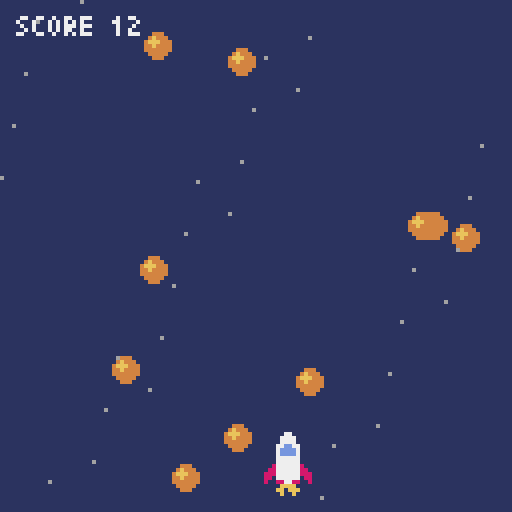

# Side quest · Pyxel

This one is optional, and short. Nothing later depends on it.

Over the last eight projects you've built, piece by piece, a good part of a small games machine: a screen with a fixed palette in Project 8, a sound chip in Project 11, sprites in Project 15. Other people have had the same idea, and carried it through. A **fantasy console** is an imaginary old computer, with a tiny screen, a few colours and a few sound channels, which exists only as software. The limits are the point. When there are sixteen colours and 128 pixels, you can't spend a month on the artwork, and so you finish the game.

[Pyxel](https://github.com/kitao/pyxel) is a fantasy console for Python, written by Takashi Kitao. It has sixteen colours, four sound channels, three banks of images, and a sprite editor and a music editor of its own. Its insides are written in Rust, and you drive it from Python.



That's a complete game, in seventy lines, and that's your rocket in it, from the file that you drew in Project 15.

The game isn't the real subject here. **The skill is picking up a library that you've never seen before**, which you'll be doing for the rest of your life, and you'll do it this time with no step-by-step build to follow. You know a great deal more than you did when you met Pygame. See how much of Pyxel you can read straight off.

| | |
|---|---|
| **You'll practise** | Reading an unfamiliar library: its README, its examples, its type stubs; recognising a familiar design in unfamiliar clothes |
| **Time** | 1 to 2 hours |
| **Before you start** | [Project 15](p15-sprite-editor.md), for the rocket. [Project 9](p09-snake.md) is enough to follow the code |

## Get it running

This is a single script, and so a flat project will do, as in Part 1:

```console
$ cd making
$ uv init --no-package pyxel-quest
$ cd pyxel-quest
$ uv add pyxel
$ uv add --dev ruff
$ code .
```

Copy `rocket.sprite` into the folder from your sprite editor's project. If you haven't drawn one, there's one in the tutorial's repository, in `projects/15-sprite-editor/examples/`.

!!! warning "Gotcha"
    On Linux, Pyxel uses the SDL2 library that belongs to your system, and you may have to install it first: on Ubuntu or Debian, that's `sudo apt install libsdl2-dev`. On macOS and Windows, everything it needs comes with it. It also needs a real display with OpenGL, and so, unlike Pygame, it can't be run on a server with no screen. The tutorial's own tests use a stand-in for it, for that reason.

## Read it before you run it

Here's the whole game. Save it as `meteors.py`, **and read it through before you run it.** For each line that calls something beginning `pyxel.`, make a guess at what it does. You'll be right about nearly all of them, and the rest of this chapter is about why.

<!-- listing: projects/15x-pyxel-side-quest/meteors.py -->
```python title="meteors.py" linenums="1"
"""Meteors: a complete game for the Pyxel fantasy console."""

from pathlib import Path

import pyxel

SIZE = 128
SHIP_Y = SIZE - 20
# Your sprite files use the BBC's colours. These are the nearest that Pyxel has,
# and its colour 15 will stand for see-through.
BBC_TO_PYXEL = str.maketrans(".01234567", "f08ba52c7")
CLEAR = 15


def load_sprite(path: Path, image: int) -> None:
    lines = path.read_text(encoding="utf-8").splitlines()
    rows = [line for line in lines if line and line[0] in ".01234567"]
    pyxel.images[image].set(0, 0, [row.translate(BBC_TO_PYXEL) for row in rows])


class Game:
    def __init__(self) -> None:
        pyxel.init(SIZE, SIZE, title="Meteors", fps=30)
        load_sprite(Path(__file__).parent / "rocket.sprite", 0)
        pyxel.sounds[0].set("c3g3", "p", "4", "n", 6)
        pyxel.sounds[1].set("c2a1f1c1", "n", "7654", "f", 12)
        self.reset()
        pyxel.run(self.update, self.draw)

    def reset(self) -> None:
        self.x = SIZE // 2 - 8
        self.meteors: list[list[float]] = []
        self.score = 0
        self.alive = True

    def update(self) -> None:
        if not self.alive:
            if pyxel.btnp(pyxel.KEY_SPACE):
                self.reset()
            return

        self.x += 2 * (pyxel.btn(pyxel.KEY_RIGHT) - pyxel.btn(pyxel.KEY_LEFT))
        self.x = max(0, min(SIZE - 16, self.x))
        if pyxel.frame_count % 8 == 0:
            self.meteors.append([pyxel.rndi(0, SIZE), -4, pyxel.rndf(1, 3)])

        for meteor in self.meteors:
            meteor[1] += meteor[2]
            if abs(meteor[0] - self.x - 8) < 7 and abs(meteor[1] - SHIP_Y - 8) < 7:
                self.alive = False
                pyxel.play(0, 1)
        fallen = [meteor for meteor in self.meteors if meteor[1] > SIZE]
        if fallen and self.alive:
            self.score += len(fallen)
            pyxel.play(0, 0)
        self.meteors = [meteor for meteor in self.meteors if meteor[1] <= SIZE]

    def draw(self) -> None:
        pyxel.cls(1 if self.alive else 2)
        for n in range(30):
            pyxel.pset(n * 37 % SIZE, (n * 53 + pyxel.frame_count) % SIZE, 13)
        for x, y, _speed in self.meteors:
            pyxel.circ(x, y, 3, 9)
            pyxel.circ(x - 1, y - 1, 1, 10)
        pyxel.blt(self.x, SHIP_Y, 0, 0, 0, 16, 16, CLEAR)
        pyxel.text(4, 4, f"SCORE {self.score}", 7)
        if not self.alive:
            pyxel.text(34, 56, "SPACE TO RETRY", pyxel.frame_count % 16)


Game()
```

!!! example "Run it"
    ```console
    $ uv run meteors.py
    ```

    ++left++ and ++right++ to dodge. A point for every meteor that gets past you. ++space++ to try again, and ++esc++ to leave, which you didn't have to write.

## How did you know?

You guessed most of it, and here's why you could.

**It's the same loop.** Every game in Part 2 has been *deal with the input, update the world, draw the world, wait for the next frame*, and you wrote that `while` loop out yourself each time. Pyxel has written it for you. You hand `pyxel.run` two functions, and it calls `update` and then `draw`, thirty times a second, for ever. They're callbacks, as the buttons' were in Project 15: "here's what to do when it's time". Nearly every game engine that you'll ever meet works in this way, and the word for a library which calls *you* is a **framework**. Pygame is a library, since you call it, and the loop is yours. Pyxel is a framework. The price of the convenience is control: there's no obvious place to put anything that doesn't fit into `update` or `draw`.

**It's a module with a screen inside it**, as `turtle` was, and as your own `beeb` is. There's no window object to pass about. `pyxel.cls(1)` clears *the* screen, since there's only one. That's the right design for a console, and you know where it stops working, since you've written one.

**The colours are numbers**, from 0 to 15, as they were in MODE 2.

| You've written | Pyxel |
|---|---|
| Your own `while running:` loop, and `clock.tick(60)` | `pyxel.run(update, draw)`, and `fps=30` |
| `pygame.key.get_pressed()[pygame.K_LEFT]`: is it held? | `pyxel.btn(pyxel.KEY_LEFT)` |
| A `KEYDOWN` event: was it pressed just now? | `pyxel.btnp(pyxel.KEY_SPACE)` |
| `beeb.gcol(0, 3)`, and then draw | The colour is the last argument of everything |
| `window.blit(picture, (x, y))` | `pyxel.blt(x, y, bank, u, v, w, h, see_through)` |
| `beeb.sound(1, -15, 53, 5)` | `pyxel.sounds[0].set(…)` once, and then `pyxel.play(channel, 0)` |
| `seconds = clock.tick(60) / 1000` | Nothing. Everything is counted in frames |

The last row is a real difference, and a deliberate one. Since Project 9 you've multiplied every movement by the time that's gone by, so that your games run at the same speed on any machine. Pyxel doesn't, and neither did any console of the 1980s: the frame rate is fixed, and "two pixels a frame" is a speed. `pyxel.frame_count` is the clock, and the game uses it three ways: to decide when to launch a meteor, to make the stars drift, and to make the words flash through the colours.

Some lines are worth a second look.

- **Line 42** subtracts one `bool` from another. A `bool` counts as 1 or 0 in arithmetic, as Project 3 said, and so `True - False` is 1. Asteroids steered in the same way.
- **Lines 15 to 18** are all that it takes to put your file format into somebody else's console. Pyxel's images are made from strings of hexadecimal digits, a character to a pixel, which is very nearly what you designed. `str.maketrans` and `translate` swap the BBC's colour numbers for Pyxel's nearest, in one pass, and turn your full stops into colour 15, `f`. The last argument of `blt` on line 65 says that colour 15 is to be left out. That was worth a text format.
- **A meteor is a list of three numbers**, and not a class. In a seventy-line game, that's a fair choice, and you know what it costs. What's `meteor[2]`? Line 62 shows a kinder way of reading one.
- **`Game()` on the last line** makes an object, and never gives it a name. The constructor calls `pyxel.run`, which doesn't come back. It's Pyxel's customary shape, and you wouldn't do it anywhere else.

## How to find out the rest

What's the fourth argument of `sounds[0].set`? What else is there besides `circ`? You have four places to look, and they're the four places to look for any library.

**The README.** Pyxel's has the whole API on one page, which is a rare kindness. Read the list of drawing functions from top to bottom, once. It takes five minutes, and afterwards you'll know what's possible, which matters more than knowing how.

**The examples.** A library's own examples are the best documentation that it has, since they're the only part that's certain to run. Pyxel will give you a copy:

```console
$ uv run pyxel copy_examples
$ uv run pyxel_examples/02_jump_game.py
```

There are twenty. `09_shooter.py` and `10_platformer.py` are complete games, and they're worth an evening.

**The editor.** Hover over `pyxel.btnp` in VS Code, and Pylance shows its parameters, and a paragraph on what it does. ++f12++ takes you to where it's declared. Try the old way, and you'll be disappointed:

<!-- no-doctest -->
```pycon
>>> import pyxel
>>> print(pyxel.btnp.__doc__)
None
```

`help` has nothing to say, since Pyxel is written in Rust, and there's no Python source for it to read. What Pylance is showing you is a **stub file**, `__init__.pyi`, which comes with the package. It's a Python file with nothing in it but signatures, type hints and docstrings, which is there purely for the benefit of editors and type checkers. Any library with a compiled core needs one. It's also proof of something that Project 12 claimed, that type hints are for tools and people, and not for Python: here's a file with nothing else in it.

**The REPL**, for anything that you're still unsure of. Pyxel wants `pyxel.init(…)` first, and then you can poke at it.

!!! tip "Pythonic"
    When you take up a new library, look for these, in this order: a *quickstart* in the README, the *examples* folder, the *API reference*, and then the *source* or the stubs. Tutorials that other people have written come last, since they go out of date, and nobody tests them. (This one is tested, for what that's worth, and it'll still go out of date.)

## Things to try

There are no solutions for these. Use the four places.

1. **Make it harder as it goes on.** More meteors, or faster ones, as the score rises.
2. **Better noises.** Read about `Sound.set` in the README: notes, tones, volumes and effects are all short strings. Make the crash longer, and nastier. How does this compare with `ENVELOPE`?
3. **Shoot back.** ++space++ fires, and a meteor that's hit is worth five points. At what point would you stop using lists of three numbers?
4. **Apply what you know.** The game's rules and its drawing are tangled together, which Project 9 taught you not to do. Pull the rules out into a class that doesn't mention `pyxel` at all, and test it with pytest. Notice that you can't test the *rest* by running it, on a machine with no screen. The tutorial's own tests get round that with a stand-in: a module with Pyxel's function names, which writes down what it's asked to draw. It's `tests/fakepyxel.py` in the repository, it's a hundred lines long, and you could write one.
5. **Try Pyxel's own tools.** `uv run pyxel edit quest.pyxres` opens its sprite, tile map, sound and music editors. Compare its sprite editor with yours. What does it have that yours hasn't? Is there anything that yours does better?
6. **Put it on the web.** `pyxel package` and `pyxel app2html` turn a game into a single HTML page that runs in a browser. That's a preview of the bonus chapter at the end of Part 4.

## Recap

- [x] A *framework* calls you, and a *library* is called by you. `pyxel.run(update, draw)` is the first, and your Pygame loops were the second
- [x] Most game engines share one design, and you can now recognise it on sight
- [x] Frame-counted time is simpler than measured time, and is only right when the frame rate is fixed
- [x] To learn a library: the quickstart, the examples, the reference, and then the stubs or the source
- [x] A `.pyi` stub file holds signatures and documentation for code that isn't written in Python
- [x] A plain text file format travels well: yours went into another console with four lines of code

**Read more:** [Pyxel's README](https://github.com/kitao/pyxel), which is also its reference manual · [PICO-8](https://www.lexaloffle.com/pico-8.php) and [TIC-80](https://tic80.com/), the fantasy consoles that started it, which are programmed in Lua · One of the [unguided briefs](../roadmap.md) at the end of the tutorial is a "demake" of a game that you love, for Pyxel

That's Part 2. In Part 3 you stop writing programs *in* a language, and write the language. [Project 16](../roadmap.md) is Logo, the turtle's native tongue.
