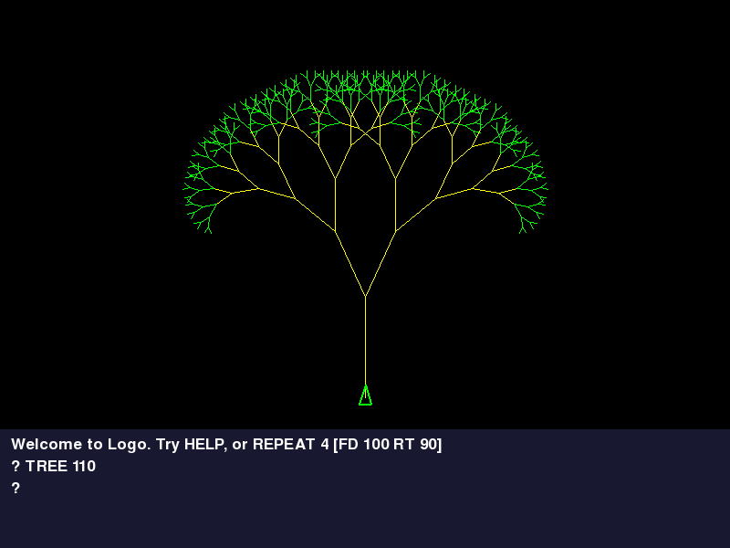
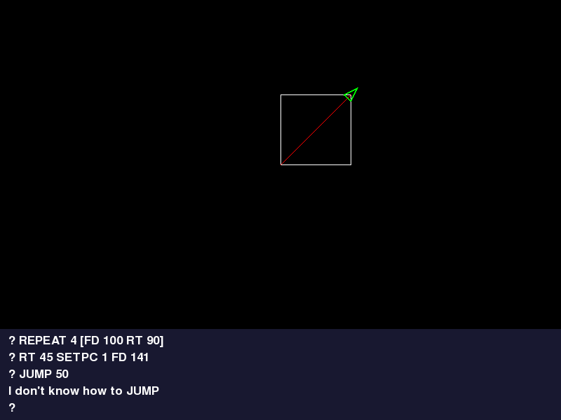
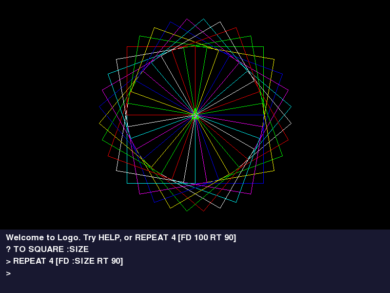
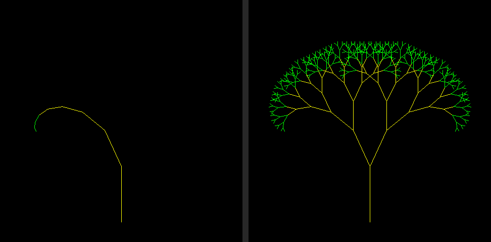

# Project 16 · Logo

In Project 2 you drove a turtle about with Python. The turtle wasn't Python's idea. It came from **Logo**, a language designed in the 1960s for children, by people who held that the way to learn mathematics was to teach it to something else. In the 1980s every school with a BBC Micro had Logo, and some had a real robot turtle, with a pen through its middle, trundling about on a sheet of paper on the floor.

```text
TO TREE :SIZE
  IF :SIZE < 6 [STOP]
  FD :SIZE
  LT 25  TREE :SIZE * 0.72
  RT 50  TREE :SIZE * 0.72
  LT 25  BK :SIZE
END
```



That's a real Logo program, and that's your interpreter running it. For fifteen projects you've written programs *in* a language. In Part 3 you write the language: Logo in this project, and BASIC in the next. It's the most useful thing you can do to understand any language, Python included. Words that you've half understood for years, such as *token*, *parse*, *scope* and *call stack*, turn into twenty lines of code that you wrote yourself.

Logo's commands have to be kept somewhere, and keeping them is the job for which **decorators** might have been invented. That's Project 7's promise, kept at last.

| | |
|---|---|
| **You'll learn** | Decorators: `@`, registries, wrappers, `functools.wraps`, stacking; a tokeniser as a generator; more regular expressions; recursive descent; `ChainMap`, scope and the call stack; exceptions for control flow; a `Protocol` with three implementations |
| **New tool skill** | Pull requests, with `gh` |
| **Time** | 6 to 7 hours. It's a big one |
| **Before you start** | [Project 15](../part-2-pygame/p15-sprite-editor.md). Project 7's closures, Project 12's `Protocol` and Project 13's regular expressions all come back |

## Predict

!!! question "Predict"
    ```python
    def announce(function):
        print("Decorating", function.__name__)
        return function


    @announce
    def hello():
        print("Hello!")


    print("Ready")
    hello()
    ```

??? success "Answer"
    ```text
    Decorating hello
    Ready
    Hello!
    ```

    `@announce` above a `def` means "when you've made this function, hand it to `announce`, and keep whatever comes back under the same name". It happens **once, at the moment that the function is defined**, and not each time it's called. This decorator hands the function back untouched, and so `hello` is still `hello`. Stage 4.

!!! question "Predict"
    ```python
    def twice(function):
        def wrapper():
            function()
            function()

        return wrapper


    @twice
    def hello():
        """Say hello."""
        print("Hello!")


    hello()
    print(hello.__name__, hello.__doc__)
    ```

??? success "Answer"
    ```text
    Hello!
    Hello!
    wrapper None
    ```

    This decorator hands back a *different* function, a closure that calls the original twice. The name `hello` now belongs to `wrapper`, and the original's name and docstring have been mislaid. Your interpreter is going to need both, and so there's a cure. Stage 4.

!!! question "Predict"
    ```python
    words = iter("FD 100 RT 90".split())
    for word in words:
        print(word, next(words))
    ```

??? success "Answer"
    ```text
    FD 100
    RT 90
    ```

    An iterator keeps its place, whoever is asking. The `for` loop takes `FD`, and the `next` inside it takes `100`, and so the loop's next turn gets `RT`. One iterator, shared between a loop and the code inside the loop, is how a parser *uses up* its input. Stage 2.

!!! question "Predict"
    ```python
    from collections import ChainMap

    outer = {"size": 100, "colour": 1}
    inner = {"size": 50}
    both = ChainMap(inner, outer)

    print(both["size"], both["colour"])
    both["colour"] = 2
    print(outer["colour"], inner)
    ```

??? success "Answer"
    ```text
    50 1
    1 {'size': 50, 'colour': 2}
    ```

    A `ChainMap` is several dictionaries, searched in order. Reading finds the first one that has the key. **Writing always goes to the first dictionary**, and never to the one where the key was found. It's a good model of how variables work in most languages, Python among them, and you'll use it for Logo's. Stage 6.

## Logo in five minutes

You need to know the language that you're implementing. This is nearly all of it.

```text
FORWARD 100           ; or FD 100. Also BACK, RIGHT, LEFT: BK, RT, LT
REPEAT 4 [FD 100 RT 90]
PENUP  PENDOWN        ; PU, PD
SETPENCOLOR 1         ; SETPC. The BBC's eight colours, 0 to 7
MAKE "SIZE 50         ; "SIZE is the name of a variable...
FD :SIZE * 2          ; ...and :SIZE is its value
PRINT 2 + 3 * 4
IF :SIZE < 10 [STOP]

TO SQUARE :SIDE       ; define a new command, with one input
  REPEAT 4 [FD :SIDE RT 90]
END
SQUARE 80
```

There are three things to notice, since each will shape the interpreter.

**There's no punctuation between instructions.** `FD 100 RT 90` is two instructions, and nothing says where one ends but the fact that `FD` takes one input. So the interpreter can't divide a program up in advance. It must know how many inputs each command wants, and take them as it goes.

**Square brackets make a list, and a list is only data** until some command decides to run it. `REPEAT` is an ordinary command that takes two inputs, a number and a list.

**A procedure that you define with `TO` is used exactly as a built-in command is.** That was the point of the language: you teach the turtle a new word, and from then on it's part of the language.

## Build

```console
$ cd making
$ uv init logo
$ cd logo
$ uv add pygame-ce
$ uv add --dev pytest ruff
$ code .
```

An interpreter is a pipeline, and each stage is small:

```text
"repeat 4 [fd 50 rt 90]"          text
        │  tokenise
        ▼
REPEAT 4 [ FD 50 RT 90 ]          tokens
        │  read
        ▼
REPEAT 4 [FD 50 RT 90]            a list, with lists inside it
        │  execute
        ▼
turtle.forward(50) ...            things happening
```

Every mistake that a Logo programmer can make is going to be reported with one kind of exception, so that the window can tell *their* mistakes from *yours*. Create `src/logo/errors.py`:

<!-- listing: projects/16-logo/src/logo/errors.py -->
```python title="src/logo/errors.py"
"""What goes wrong in a Logo program, as distinct from what goes wrong in ours."""


class LogoError(Exception):
    """A mistake in somebody's Logo, to be reported to them politely."""
```

### Stage 1: Tokens, from a generator

The first job is to chop text up into **tokens**: the words, numbers and symbols of the language, with the spaces and the comments thrown away. `fd :size*2` is four tokens: a word, a variable, a symbol and a number.

Project 13 used one regular expression to chop up RLE. This is the same idea, grown up. Create `src/logo/tokens.py`:

<!-- listing: projects/16-logo/src/logo/tokens.py -->
```python title="src/logo/tokens.py"
"""Chopping the text of a program into tokens."""

import re
from collections.abc import Iterator
from dataclasses import dataclass

from logo.errors import LogoError

NAME = r"[A-Za-z][A-Za-z0-9.?]*"
TOKEN = re.compile(
    rf"""
      (?P<comment>  ;[^\n]*          )   # from a semicolon to the end of the line
    | (?P<number>   (?: (?<![^\s\[(]) - )?     # a minus sign counts, after a space
                    \d+ (\.\d+)?     )   # 90 or 0.5 or -40
    | (?P<word>     {NAME}           )   # FORWARD
    | (?P<variable> :{NAME}          )   # :size, the value of a variable
    | (?P<quoted>   "{NAME}          )   # "size, the name of one
    | (?P<symbol>   [-+*/<>=()\[\]]  )
    | (?P<newline>  \n               )
    | (?P<space>    [ \t\r]+         )
    | (?P<mistake>  .                )   # anything else at all
    """,
    re.VERBOSE,
)


@dataclass(frozen=True, slots=True)
class Token:
    kind: str
    text: str
    line: int

    def __str__(self) -> str:
        return self.text


def tokenise(text: str) -> Iterator[Token]:
    """Yield the tokens of a program, one at a time, as they're asked for."""
    line = 1
    for found in TOKEN.finditer(text):
        kind = found.lastgroup or "mistake"
        match kind:
            case "newline":
                line += 1
            case "space" | "comment":
                pass
            case "mistake":
                raise LogoError(f"I don't understand {found.group()!r} on line {line}")
            case "word":
                yield Token("word", found.group().upper(), line)
            case "variable" | "quoted":
                yield Token(kind, found.group()[1:].upper(), line)
            case _:
                yield Token(kind, found.group(), line)
```

There are three new things in that regular expression.

**`re.VERBOSE`** lets a pattern be laid out over several lines, with spaces and comments in it, all of which are ignored. A regex of any size ought to be written in this way. (To match a real space in verbose mode, you write `[ ]` or `\s`.)

**`(?P<word> … )`** is a group with a *name*. There's one for each kind of token, and the `|` between them means "or". The alternatives are tried from left to right, and that's why `variable` can't be mistaken for anything else, and why `mistake`, which matches any character at all, comes last.

**`finditer`** goes through the text, and gives you a match object for every match in turn. `found.lastgroup` is the name of the group that matched, which is the kind of the token, and `found.group()` is the text. Here's the trick in miniature:

```pycon
>>> import re
>>> pattern = re.compile(r"(?P<number>\d+)|(?P<word>[a-z]+)")
>>> [(found.lastgroup, found.group()) for found in pattern.finditer("fd 100 rt 90")]
[('word', 'fd'), ('number', '100'), ('word', 'rt'), ('number', '90')]
```

The f-string puts `NAME` into the pattern in three places, to save writing it out three times. It's an `rf"""…"""` string: raw *and* formatted.

The oddest line in the pattern is the one for a minus sign. `10 - 3` is a subtraction, and `SETXY 30 -40` is two numbers, the second of them negative. Logo has always told these apart by the spacing: **a minus sign with a space before it, and none after, belongs to the number.** `(?<![^\s\[(])` is a *lookbehind*. It looks at the character before the minus sign, without using it up, and insists that it isn't anything other than a space or an opening bracket. It's a double negative so that the start of the text will do too.

!!! warning "Gotcha"
    Do come back and read that when your interpreter prints `10`, and then complains "You don't say what to do with -3", about `PRINT 10 -3`. It's right, by Logo's rules. It's the most notorious trap in the language, and you've now implemented it faithfully.

#### Why a generator?

`tokenise` has a `yield` in it, and so it's a generator function, as `generations` was in Project 6. Calling it does nothing at all. It hands you back a generator, which makes tokens one at a time, as they're asked for:

```pycon
>>> from logo.tokens import tokenise
>>> tokens = tokenise("fd :size*2 ; forward")
>>> print(next(tokens), next(tokens), next(tokens))
FD SIZE *
>>> [str(token) for token in tokenise("repeat 4 [fd 50 rt 90]")]
['REPEAT', '4', '[', 'FD', '50', 'RT', '90', ']']
```

It would work as a function that returned a list. The generator is the right shape for two reasons. The tokeniser keeps its place in the text, and its count of lines, in its own local variables, between one token and the next, with no class to hold them. And the next stage is going to *use the tokens up*, one at a time, which is what iterators are for.

Words are turned into capitals, since Logo doesn't care about case. A `Token` remembers which line it came from, for the error messages. Its `__str__` is its text, which makes the messages easy to write.

The tests for this stage are in `tests/test_tokens.py`. This is the one that tests the laziness. Only the third token is bad, and so the first two come out safely:

<!-- listing: projects/16-logo/tests/test_tokens.py -->
```python title="tests/test_tokens.py"
def test_it_is_lazy():
    tokens = tokenise("fd 100 £ rt 90")
    assert next(tokens) == Token("word", "FD", 1)
    assert next(tokens).text == "100"
    with pytest.raises(LogoError, match="I don't understand '£' on line 1"):
        next(tokens)
```

!!! success "Checkpoint"
    ```console
    $ git add .
    $ git commit -m "Add a tokeniser for Logo"
    ```

### Stage 2: Brackets into lists

Logo's square brackets nest: `REPEAT 4 [FD 50 REPEAT 3 [RT 30]]`. The interpreter wants each bracketed part as a *list*, so that `REPEAT` can be handed its block in one piece, and run it as many times as it likes. Create `src/logo/reader.py`:

<!-- listing: projects/16-logo/src/logo/reader.py -->
```python title="src/logo/reader.py"
"""Gathering tokens into lists, with the square brackets turned into lists inside lists."""

from collections.abc import Iterator

from logo.errors import LogoError
from logo.tokens import Token

type Item = Token | list[Item]


def read(tokens: Iterator[Token], inside: bool = False) -> list[Item]:
    """Use up tokens until they run out, or, inside brackets, until the closing one."""
    items: list[Item] = []
    for token in tokens:
        if token.text == "[":
            items.append(read(tokens, inside=True))
        elif token.text == "]":
            if not inside:
                raise LogoError(f"There's a ] on line {token.line} with no [ before it")
            return items
        else:
            items.append(token)
    if inside:
        raise LogoError("There's a [ with no ] to close it")
    return items


class Stream:
    """A list of items, and a finger to keep the place."""

    def __init__(self, items: list[Item]) -> None:
        self.items = items
        self.position = 0

    @property
    def more(self) -> bool:
        return self.position < len(self.items)

    def peek(self) -> Item | None:
        """Return the next item, without moving on."""
        return self.items[self.position] if self.more else None

    def take(self) -> Item:
        """Return the next item, and move on."""
        item = self.items[self.position]
        self.position += 1
        return item

    def next_is(self, *texts: str) -> bool:
        """Is the next item one of these symbols or words?"""
        item = self.peek()
        return isinstance(item, Token) and item.kind != "quoted" and item.text in texts
```

**`read` is your first parser**, and it's twenty lines long. It goes through the tokens, putting them into a list. When it meets a `[`, it calls *itself*, to read the inside of the brackets, and puts whatever comes back, which is a list, into its own list. When it meets a `]`, it's finished, and returns.

It works because of the third Predict. The inner `read` is given **the same iterator**. It uses up the tokens as far as the matching `]`, and returns. The outer `for` loop then carries on from wherever the inner call left off. Nobody passes a position about, or returns one. The iterator *is* the position.

```pycon
>>> from logo.reader import read
>>> items = read(tokenise("repeat 2 [fd 50 repeat 3 [rt 30]] home"))
>>> len(items)
4
>>> [str(item) for item in items[2][:3]]
['FD', '50', 'REPEAT']
```

There are four items: `REPEAT`, `2`, a list, and `HOME`. A function that calls itself to deal with the nested parts of its input is called a **recursive descent** parser. The structure of the code is the structure of the language: brackets inside brackets become calls inside calls. It's how a great many real parsers are written, those of the GCC and Clang compilers among them.

**`type Item = Token | list[Item]`** is a type that mentions itself. An item is a token, or a list of items, and that's as exact a description of nested brackets as you could want. The `type` statement allows it. Nothing earlier in Python did, without quotation marks.

**`Stream`** is for the next stage. The interpreter has to look at the next item *without* taking it, to find out whether a sum goes on: after `2`, is there a `+`? An iterator can't do that, since once you've asked, it's gone. So a `Stream` is a list and a position, with `peek` and `take`.

!!! success "Checkpoint"
    ```console
    $ git add .
    $ git commit -m "Read brackets into nested lists"
    ```

### Stage 3: A turtle, and something to draw on

Where should the turtle draw? In a Pygame window, to begin with. In tests, nowhere at all: you want a list of the lines that it *would* have drawn. And it would be good to save a picture to a file. That's three quite different things, and the turtle oughtn't to care which it has. Create `src/logo/turtle.py`:

<!-- listing: projects/16-logo/src/logo/turtle.py -->
```python title="src/logo/turtle.py"
"""The turtle, and the kinds of thing that it can draw on."""

import math
from dataclasses import dataclass, field
from pathlib import Path
from typing import Protocol

type Point = tuple[float, float]

# The BBC Micro's eight colours, as ever.
COLOURS = ["black", "red", "lime", "yellow", "blue", "magenta", "cyan", "white"]


class Canvas(Protocol):
    """Anything that can draw a line and wipe itself clean will do for a turtle.

    Points are in the turtle's own terms: (0, 0) is the middle, and y goes up.
    """

    def line(self, start: Point, end: Point, colour: int) -> None: ...

    def clear(self) -> None: ...


@dataclass
class Turtle:
    canvas: Canvas
    x: float = 0.0
    y: float = 0.0
    heading: float = 0.0  # in degrees, clockwise from straight up
    pen_down: bool = True
    colour: int = 7

    def forward(self, distance: float) -> None:
        angle = math.radians(self.heading)
        start = (self.x, self.y)
        self.x += distance * math.sin(angle)
        self.y += distance * math.cos(angle)
        if self.pen_down:
            self.canvas.line(start, (self.x, self.y), self.colour)

    def goto(self, x: float, y: float) -> None:
        start = (self.x, self.y)
        self.x, self.y = x, y
        if self.pen_down:
            self.canvas.line(start, (x, y), self.colour)

    def turn(self, degrees: float) -> None:
        self.heading = (self.heading + degrees) % 360

    def home(self) -> None:
        self.x = self.y = self.heading = 0.0


@dataclass
class Recorder:
    """A canvas that writes down what it was asked to draw. It's for tests."""

    lines: list[tuple[Point, Point, int]] = field(default_factory=list)

    def line(self, start: Point, end: Point, colour: int) -> None:
        self.lines.append((start, end, colour))

    def clear(self) -> None:
        self.lines.clear()


@dataclass
class SvgCanvas(Recorder):
    """A canvas that can save itself as a picture, for a browser to show."""

    size: int = 600

    def save(self, path: Path) -> None:
        half = self.size / 2
        shapes = [
            f'<line x1="{half + x1:.1f}" y1="{half - y1:.1f}" '
            f'x2="{half + x2:.1f}" y2="{half - y2:.1f}" stroke="{COLOURS[colour]}"/>'
            for (x1, y1), (x2, y2), colour in self.lines
        ]
        svg = (
            f'<svg xmlns="http://www.w3.org/2000/svg" width="{self.size}" '
            f'height="{self.size}" style="background: black" stroke-linecap="round">\n'
            + "\n".join(shapes)
            + "\n</svg>\n"
        )
        path.write_text(svg, encoding="utf-8")
```

**`Canvas` is a `Protocol`**, as `Body` was in Asteroids. Anything with a `line` and a `clear`, of the right shapes, is a canvas. The `Turtle` is given one, and draws on it.

**`Recorder`** writes down what it's asked to draw. It makes the whole interpreter testable, with no window.

**`SvgCanvas(Recorder)`** is a small piece of inheritance, by Project 15's test: it *is* a recorder, which can also save what it's recorded, as an SVG file. SVG is a format for pictures that's written in text, which every browser can show. It's the subject of Project 18, and this is a first taste: one `<line>` for each line. The f-strings flip y over, since in SVG, as on every screen, y goes downward.

Neither class mentions `Canvas`, or inherits from it. They fit, and that's enough. In Stage 7 you'll write a third, for Pygame, in another file, and the turtle won't be touched.

The heading is measured clockwise from straight up, as Logo has always done it, and as your ship's was in Asteroids.

!!! success "Checkpoint"
    Test it, with `tests/test_turtle.py`: go forward, turn, go forward, and look at the recorder's list.

    ```console
    $ git add .
    $ git commit -m "Add a turtle, a canvas protocol, a recorder and an SVG canvas"
    ```

### Stage 4: Decorators, and a list of commands

The interpreter needs a table: for each of Logo's words, which Python function does the work, and how many inputs it takes. You could write the functions in one place, and a big dictionary in another:

```python
COMMANDS = {"FORWARD": (forward, 1), "FD": (forward, 1), "BACK": (back, 1), ...}
```

It would work, and you'd have to keep the two in step for ever. Add a command and forget the table, and nothing happens, in silence. Miscount the inputs, and the symptoms are baffling. What you want is to say it *once*, where the function is defined:

```python
@command("FORWARD", "FD")
def forward(logo, distance):
    ...
```

#### What `@` means

The first Predict said it all. This:

```python
@announce
def hello(): ...
```

is another way of writing this:

```python
def hello(): ...
hello = announce(hello)
```

**A decorator is a function that takes a function, and returns a function.** That's the whole of the rule, and the `@` is a convenience. You wrote one in Project 7, `timed`, and applied it by hand. What the decorator does with the function in between is its own business, and there are two things that it commonly does.

It can **make a note of the function, and hand it back unchanged**. That's a *registry*, and it's what `command` will do. Flask and FastAPI use it in Part 4 to connect web addresses to functions, and pytest uses it for fixtures.

Or it can **hand back a different function, which wraps the original**, and does something before it, or after it, or in place of it. That was the second Predict, and it was `timed`. It's how `functools.cache` works.

Create `src/logo/registry.py`, which has one of each:

<!-- listing: projects/16-logo/src/logo/registry.py -->
```python title="src/logo/registry.py"
"""The list of Logo's built-in commands, and the decorators that put them on it."""

import inspect
from collections.abc import Callable
from dataclasses import dataclass
from functools import wraps
from typing import Any

from logo.errors import LogoError


@dataclass(frozen=True)
class Primitive:
    name: str
    function: Callable[..., Any]
    inputs: int


COMMANDS: dict[str, Primitive] = {}


def command(*names: str) -> Callable:
    """Put a function on the list of commands, under one or more names."""

    def register(function: Callable) -> Callable:
        # Every command's first parameter is the interpreter. The rest are its inputs.
        inputs = len(inspect.signature(function).parameters) - 1
        primitive = Primitive(names[0], function, inputs)
        for name in names:
            COMMANDS[name] = primitive
        return function

    return register


def numeric(function: Callable) -> Callable:
    """Make a command refuse any input that isn't a number."""

    @wraps(function)
    def checked(logo: Any, *inputs: Any) -> Any:
        for value in inputs:
            if isinstance(value, bool) or not isinstance(value, (int, float)):
                name = function.__name__.rstrip("_").upper()
                raise LogoError(f"{name} doesn't like {show(value)} as input")
        return function(logo, *inputs)

    return checked


def show(value: object) -> str:
    """Return a value as Logo would print it."""
    match value:
        case bool():
            return str(value).upper()
        case float() | int():
            return f"{value:g}"
        case list():
            return "[" + " ".join(show(item) for item in value) + "]"
        case _:
            return str(value)
```

#### A decorator with arguments

`@command("FORWARD", "FD")` has brackets and arguments, which `@announce` hadn't. Read it as Python does. First, `command("FORWARD", "FD")` is *called*, and whatever it returns is used as the decorator. So `command` isn't a decorator. It's a function that **makes** one: it returns `register`, which is a closure that remembers the names. There are three layers, and you met all three in Project 7:

1. `command(*names)` takes the settings, and returns…
2. `register(function)`, which is the real decorator. It takes the function, notes it, and returns it.

(A wrapping decorator with arguments has a third layer inside, the wrapper itself.)

`register` works out how many inputs the command takes by *looking at the function*. `inspect.signature` gives you a function's parameters, and the count, less one for the interpreter, is the number of inputs. Functions are objects, and they can be asked about themselves. So there's nothing to keep in step: the number of inputs that Logo expects is the number of parameters that you wrote.

#### A wrapper, and `functools.wraps`

`numeric` is of the other kind. Most of the turtle's commands want numbers, and Logo's traditional complaint if they don't get them is a charming one: `FORWARD doesn't like [1 2] as input`. `numeric` wraps a command in a function that checks every input, complains in that style, and otherwise passes everything on. (`bool` is turned away by name, since `True` is an `int`, as it has been since Project 3.)

The second Predict showed the trouble with wrappers: the function that comes back is called `checked`, and has no docstring. For this program, that would be a disaster, and not only a blemish:

```python
@command("SETXY")
@numeric
def setxy(logo, x, y): ...
```

**Decorators are applied from the bottom upwards**, nearest the function first. So `numeric` wraps `setxy`, and then `command` registers *the wrapper*. `command` asks how many parameters it has. The wrapper's are `(logo, *inputs)`, and so Logo would believe that `SETXY` took one input. And `HELP`, which shows each command's docstring, would have nothing to show.

**`@wraps(function)`** is the cure. It's a decorator, from `functools`, which you put on the wrapper, and it copies the original's name, its docstring and its other particulars on to it. It also leaves a note, in an attribute called `__wrapped__`, to say where the original is. `inspect.signature` knows to follow that note. **Every wrapper that you ever write should have `@wraps` on it.** There's no reason not to.

The tests pin all of that down. `tests/test_registry.py`:

<!-- listing: projects/16-logo/tests/test_registry.py -->
```python title="tests/test_registry.py"
@pytest.fixture(autouse=True)
def leave_the_list_as_it_was():
    before = dict(COMMANDS)
    yield
    COMMANDS.clear()
    COMMANDS.update(before)


def test_command_lists_a_function_and_hands_it_back_unchanged():
    def hop(logo, distance, height):
        """HOP 10 5   Jump."""

    assert command("HOP", "HP")(hop) is hop
    assert COMMANDS["HP"] is COMMANDS["HOP"]
    assert COMMANDS["HOP"].inputs == 2
    assert COMMANDS["HOP"].name == "HOP"


def test_numeric_lets_numbers_through_and_stops_everything_else():
    @numeric
    def area(logo, width, height):
        return width * height

    assert area(None, 3, 4.5) == 13.5
    with pytest.raises(LogoError, match="AREA doesn't like TRUE as input"):
        area(None, 3, True)


def test_a_wrapped_function_still_looks_like_itself():
    @numeric
    def hop(logo, distance, height):
        """HOP 10 5   Jump."""

    assert hop.__name__ == "hop"
    assert hop.__doc__ == "HOP 10 5   Jump."
    assert list(inspect.signature(hop).parameters) == ["logo", "distance", "height"]


def test_which_is_why_the_order_of_the_decorators_works():
    @command("HOP")
    @numeric
    def hop(logo, distance, height):
        """HOP 10 5   Jump."""

    assert COMMANDS["HOP"].inputs == 2
    with pytest.raises(LogoError, match="HOP doesn't like"):
        COMMANDS["HOP"].function(None, "high", 5)
```

`leave_the_list_as_it_was` is a fixture with `autouse=True`, which means that it's wrapped round every test in the file, without being asked for. These tests add commands to a list that the whole program shares, and that fixture puts the list back as it found it.

Try taking `@wraps(function)` out, and running them. Several tests fail, and between them they tell you exactly what `wraps` is for.

!!! success "Checkpoint"
    ```console
    $ git add .
    $ git commit -m "Add a registry of commands, with two decorators"
    ```

### Stage 5: The interpreter

This is the heart of it. Create `src/logo/interpreter.py`. It's the longest file in the project, and it's here in three pieces. First, running instructions:

<!-- listing: projects/16-logo/src/logo/interpreter.py -->
```python title="src/logo/interpreter.py"
"""Running a Logo program."""

from collections import ChainMap
from collections.abc import Callable
from dataclasses import dataclass

from logo.errors import LogoError
from logo.reader import Item, Stream, read
from logo.registry import COMMANDS, show
from logo.tokens import Token, tokenise
from logo.turtle import Canvas, Turtle

type Value = float | bool | str | list[Item]


class Stop(Exception):
    """Raised by STOP and OUTPUT, to leave a procedure from however deep inside it."""

    def __init__(self, value: Value | None = None) -> None:
        super().__init__()
        self.value = value


@dataclass(frozen=True)
class Procedure:
    name: str
    parameters: tuple[str, ...]
    body: list[Item]


class Interpreter:
    def __init__(self, canvas: Canvas, say: Callable[[str], None] = print) -> None:
        self.turtle = Turtle(canvas)
        self.say = say
        self.variables: ChainMap[str, Value] = ChainMap()
        self.procedures: dict[str, Procedure] = {}
        self.counts: list[int] = []  # how far round each REPEAT we are, innermost last

    def run(self, text: str) -> None:
        """Run some Logo. Anything wrong with it comes out as a LogoError."""
        try:
            self.execute(read(tokenise(text)))
        except Stop:
            raise LogoError("STOP and OUTPUT only make sense inside a TO") from None
        except RecursionError as error:
            raise LogoError("That went too deep. Is there a STOP missing?") from error
        except ZeroDivisionError as error:
            raise LogoError("I can't divide by nought") from error

    def execute(self, items: list[Item]) -> None:
        stream = Stream(items)
        while stream.more:
            if stream.next_is("TO"):
                self.define(stream)
                continue
            value = self.expression(stream)
            if value is not None:
                raise LogoError(f"You don't say what to do with {show(value)}")
# ...
    def call(self, word: Token, stream: Stream) -> Value | None:
        """Run the command or procedure that a word names, with inputs from the stream."""
        if word.text in COMMANDS:
            wanted = COMMANDS[word.text].inputs
        elif word.text in self.procedures:
            wanted = len(self.procedures[word.text].parameters)
        else:
            raise LogoError(f"I don't know how to {word.text}")

        inputs = []
        for _ in range(wanted):
            if not stream.more:
                raise LogoError(f"Not enough inputs to {word.text}")
            value = self.expression(stream)
            if value is None:
                raise LogoError(f"{word.text} needs a value, and didn't get one")
            inputs.append(value)

        if word.text in COMMANDS:
            return COMMANDS[word.text].function(self, *inputs)
        return self.invoke(self.procedures[word.text], inputs)
```

(`Stop` and `Procedure`, at the top, are for Stage 6.)

`say` is a callback, from Project 15. `PRINT` needs somewhere to put its words. In a terminal that's `print`, in a test it's a list's `append`, and in the window it'll be something else again.

**`execute`** takes a list of items, and works through it. It evaluates one expression after another, until there are none left. A *command*, such as `FD 50`, is an expression that produces nothing. If something does produce a value, and nobody wanted it, that's Logo's best-loved error message: `You don't say what to do with 7`.

**`call`** is where Logo's lack of punctuation is dealt with. Given a word, it finds out how many inputs that word wants, from the registry, or from the procedures that the user has defined. It evaluates that many expressions from the stream, and calls the function with them. So in `FD 50 RT 90`, `FD` takes `50`, and stops, and `RT` is the start of the next instruction. Nothing else was needed.

`self.expression(stream)` may well find another word, and call `call` again, and that's how `PRINT DOUBLE DOUBLE 5` works, with no brackets anywhere: `PRINT` wants one input, which is `DOUBLE`, which wants one, which is `DOUBLE`, which wants one, which is `5`.

`run` turns three of Python's own exceptions into `LogoError`s, with `raise … from`, since a Logo programmer who divides by nought should be told so in Logo's terms. A procedure that calls itself for ever runs into Python's recursion limit, from Project 2, and that becomes "That went too deep".

#### Sums, by recursive descent

`PRINT 2 + 3 * 4` should say 14, and not 20. Multiplication comes first, and the interpreter has to know it. Here's the classic way of teaching it, and it's the same idea as `read`. **Write the grammar down, with one rule for each level of precedence, and then write one method for each rule.**

```text
expression :=  sum      [ ("<" | ">" | "=")  sum ]
sum        :=  product  { ("+" | "-")  product }
product    :=  atom     { ("*" | "/")  atom }
atom       :=  number | :variable | "word | [list] | "(" expression ")" | "-" atom | call
```

Read `:=` as "is", `[…]` as "optionally", and `{…}` as "any number of times". A sum is a product, followed by any number of further products, each with a `+` or a `-` in front. A product is made of atoms, in the same way. And an atom may be a whole expression, in brackets, which is where it goes round again.

<!-- listing: projects/16-logo/src/logo/interpreter.py -->
```python title="src/logo/interpreter.py"
    # Expressions, by recursive descent. Each of these methods deals with one level
    # of the grammar, and calls the next one down for the pieces.

    def expression(self, stream: Stream) -> Value | None:
        """sum, or sum < sum, or sum > sum, or sum = sum"""
        left = self.sum(stream)
        if stream.next_is("<", ">", "="):
            sign = str(stream.take())
            right = self.sum(stream)
            if sign == "=":
                return left == right
            a, b = self.number(left, sign), self.number(right, sign)
            return a < b if sign == "<" else a > b
        return left

    def sum(self, stream: Stream) -> Value | None:
        """product, and then any number of + product or - product"""
        total = self.product(stream)
        while stream.next_is("+", "-"):
            sign = str(stream.take())
            right = self.number(self.product(stream), sign)
            left = self.number(total, sign)
            total = left + right if sign == "+" else left - right
        return total

    def product(self, stream: Stream) -> Value | None:
        """atom, and then any number of * atom or / atom"""
        total = self.atom(stream)
        while stream.next_is("*", "/"):
            sign = str(stream.take())
            right = self.number(self.atom(stream), sign)
            left = self.number(total, sign)
            total = left * right if sign == "*" else left / right
        return total

    def atom(self, stream: Stream) -> Value | None:
        """a number, a :variable, a "word, a [list], (an expression), -atom, or a call"""
        if not stream.more:
            raise LogoError("There's something missing at the end")
        match stream.take():
            case list() as items:
                return items
            case Token(kind="number", text=text):
                return float(text)
            case Token(kind="quoted", text=text):
                return text
            case Token(kind="variable", text=name):
                if name not in self.variables:
                    raise LogoError(f"{name} has no value")
                return self.variables[name]
            case Token(kind="word") as word:
                return self.call(word, stream)
            case Token(text="("):
                value = self.expression(stream)
                if not stream.next_is(")"):
                    raise LogoError("There's a ( with no ) to close it")
                stream.take()
                return value
            case Token(text="-"):
                return -self.number(self.atom(stream), "-")
            case other:
                raise LogoError(f"I didn't expect {show(other)} there")

    def number(self, value: Value | None, sign: str) -> float:
        if isinstance(value, bool) or not isinstance(value, (int, float)):
            raise LogoError(f"{sign} doesn't like {show(value)} as input")
        return value
```

Look at `sum` beside its rule. They say the same thing: get a product, and while the next thing is a `+` or a `-`, get another, and combine them. `product` is the same, a level down.

**The precedence comes from the way that the methods call each other**, and from nothing else. There's no table of priorities anywhere. `sum` never sees a `*`. By the time that it's handed `3 * 4`, `product` has already turned it into 12. Multiplication binds tighter than addition *because `sum` calls `product`*, and not the other way round. Brackets work because `atom` calls `expression`, which starts again from the top. Work through `2 * (3 + 4)` by hand, writing down which method is running at each step, and you'll never be mystified by a parser again.

`atom` is a `match` on the item, using the patterns from Project 14. **`Token(kind="number", text=text)`** is new: it's a *class pattern*. It matches a `Token` whose `kind` is `"number"`, and captures its `text`. Any dataclass can be matched in this way, and Project 17 does it on a grand scale.

These methods do the sums as they go. Most interpreters work in two steps: they parse into a *tree*, and then walk the tree. Yours re-reads the words of a `REPEAT` block every time round. That's how Logo has always worked, since in Logo a program *is* a list of words, and it's slow. Project 17 does it the other way.

### Stage 6: Procedures, variables and the call stack

Here's the last piece of `interpreter.py`. `define` goes between `execute` and `call`, and the other two go after `call`:

<!-- listing: projects/16-logo/src/logo/interpreter.py -->
```python title="src/logo/interpreter.py"
    def define(self, stream: Stream) -> None:
        """Deal with TO name :input :input ... END."""
        stream.take()
        match stream.take() if stream.more else None:
            case Token(kind="word", text=name) if name not in COMMANDS:
                pass
            case other:
                raise LogoError(f"TO can't use {show(other)} as a name")

        parameters = []
        while isinstance(item := stream.peek(), Token) and item.kind == "variable":
            parameters.append(item.text)
            stream.take()
        body = []
        while not stream.next_is("END"):
            if not stream.more:
                raise LogoError(f"TO {name} has no END")
            body.append(stream.take())
        stream.take()
        self.procedures[name] = Procedure(name, tuple(parameters), body)
# ...
    def invoke(self, procedure: Procedure, inputs: list[Value]) -> Value | None:
        named = dict(zip(procedure.parameters, inputs, strict=True))
        self.variables = self.variables.new_child(named)
        try:
            self.execute(procedure.body)
        except Stop as stop:
            return stop.value
        finally:
            self.variables = self.variables.parents
        return None

    def assign(self, name: str, value: Value) -> None:
        """Change a variable where it already is, or else make a new one at the top."""
        for scope in self.variables.maps:
            if name in scope:
                scope[name] = value
                return
        self.variables.maps[-1][name] = value
```

**`define`** deals with `TO`. It's the one piece of Logo that isn't an ordinary command, since it mustn't *evaluate* what follows it. It collects a name, some parameters, and then everything as far as `END`, unexamined, and files it all as a `Procedure`. Nothing is run, or even checked. A procedure is a list of items, put away for later. `match` is given a class pattern with a guard, so that nobody can redefine `FORWARD`.

**`invoke`** runs one. This is the fourth Predict, and the most important idea in the chapter.

When `TREE 110` calls `TREE 79.2`, there are two variables called `SIZE` alive at once, and the inner one mustn't disturb the outer. When the inner call comes back, the outer must find its own `SIZE` as it left it. Each call needs its own variables, put on top of those that were there before, and taken off again afterwards. **That pile is the call stack**, and every language has one. It's what the Call Stack panel of the debugger has been showing you.

`self.variables` is a `ChainMap`. `new_child` puts a new dictionary at the front, with the procedure's inputs in it, and `parents` takes it off again. The `try … finally` makes sure that it comes off, *whatever* happens, even if the procedure stops with an error. There's a test for that.

!!! note "Under the bonnet"
    A Logo procedure can see the variables of **whoever called it**, since the chain is searched all the way down. That's called *dynamic scope*. Python is different: a function sees the variables of the place where it was **written**, which was Project 7's LEGB rule, and is called *lexical scope*. Nearly every language since the 1970s has chosen lexical scope, since you can work out what a function means by reading it. Logo is a survivor from before, and with a `ChainMap` you get its behaviour with no effort at all. `assign` is `MAKE`'s rule: change the variable where it is, if it's anywhere, and otherwise make a new one at the outermost level.

#### `STOP`, and exceptions that aren't errors

`IF :SIZE < 6 [STOP]` has to leave the procedure, from inside a list, inside an `IF`, inside who knows what else. Several layers of `execute` and `call` have to be abandoned at once. Python has a mechanism for abandoning several layers at once.

`Stop` is an exception that isn't an error. The `STOP` command raises it, `invoke` catches it, and everything in between is unwound. `OUTPUT :N * 2` does the same, carrying a value, which becomes the result of the call, and so a Logo procedure can be a function. **Exceptions are for control flow, and errors are only the commonest use of them.** Python does this itself: every `for` loop you've ever written ended because an iterator raised `StopIteration`.

#### The commands themselves

Create `src/logo/primitives.py`. There are two dozen, and nearly all of them are three lines long. Here are the interesting ones:

<!-- listing: projects/16-logo/src/logo/primitives.py -->
```python title="src/logo/primitives.py"
"""Logo's built-in commands. Importing this module is what puts them on the list."""

import random

from logo.errors import LogoError
from logo.interpreter import Interpreter, Stop, Value
from logo.registry import COMMANDS, command, numeric, show
from logo.turtle import COLOURS


@command("FORWARD", "FD")
@numeric
def forward(logo: Interpreter, distance: float) -> None:
    """FORWARD 50   Move forward, drawing a line if the pen is down."""
    logo.turtle.forward(distance)
# ...
@command("SETXY")
@numeric
def setxy(logo: Interpreter, x: float, y: float) -> None:
    """SETXY 100 50   Go straight to a place, drawing a line if the pen is down."""
    logo.turtle.goto(x, y)
# ...
@command("REPEAT")
def repeat(logo: Interpreter, times: Value, block: Value) -> None:
    """REPEAT 4 [FD 50 RT 90]   Do what's in the brackets, that many times."""
    if not isinstance(times, float) or not isinstance(block, list):
        raise LogoError("REPEAT needs a number, and then something in [ ]")
    for count in range(1, int(times) + 1):
        logo.counts.append(count)
        try:
            logo.execute(block)
        finally:
            logo.counts.pop()


@command("REPCOUNT")
def repcount(logo: Interpreter) -> float:
    """REPCOUNT   How many times round the REPEAT we are, counting from 1."""
    if not logo.counts:
        raise LogoError("REPCOUNT only makes sense inside a REPEAT")
    return float(logo.counts[-1])
# ...
@command("STOP")
def stop(logo: Interpreter) -> None:
    """STOP   Leave the procedure that we're in."""
    raise Stop


@command("OUTPUT", "OP")
def output(logo: Interpreter, value: Value) -> None:
    """OUTPUT :n * 2   Leave the procedure, and hand this back to whoever called it."""
    raise Stop(value)


@command("MAKE")
def make(logo: Interpreter, name: Value, value: Value) -> None:
    """MAKE "size 50   Give a variable a value. Read it back with :size."""
    if not isinstance(name, str):
        raise LogoError(f"MAKE doesn't like {show(name)} as a name. Try MAKE \"SIZE")
    logo.assign(name, value)
# ...
@command("HELP")
def help_(logo: Interpreter) -> None:
    """HELP   This list."""
    seen: list[str] = []
    for primitive in COMMANDS.values():
        line = (primitive.function.__doc__ or primitive.name).strip()
        if line not in seen:
            seen.append(line)
            logo.say(line)
```

The rest, which are `BACK`, `RIGHT`, `LEFT`, `PENUP`, `PENDOWN`, `SETPENCOLOR`, `HOME`, `CLEARSCREEN`, `REPCOUNT`, `IF`, `IFELSE`, `RANDOM`, `REMAINDER` and `PRINT`, are yours to write, from the descriptions in "Logo in five minutes", and the file in the tutorial's repository is there if you get stuck. Every docstring begins with an example, since `HELP` prints them, and there's a test that holds you to it.

Some of the functions have names such as `if_` and `print_`, with an underscore on the end. That's the convention for a name that would otherwise collide with one of Python's own.

`REPEAT` runs its block by calling `logo.execute`. **`REPEAT` is an ordinary command, which happens to call back into the interpreter**, and so are `IF` and `IFELSE`. That's the payoff for treating lists as data. Apart from `TO`, the language has no syntax.

Nothing calls `primitives.py`. It has to be imported for its decorators to run, and that's the first Predict again: **the registering happens when the `def`s are executed, which is at import**. `src/logo/__init__.py` sees to it:

<!-- listing: projects/16-logo/src/logo/__init__.py -->
```python title="src/logo/__init__.py"
"""Logo, the turtle's own language."""

from logo import primitives
from logo.errors import LogoError
from logo.interpreter import Interpreter

__all__ = ["Interpreter", "LogoError", "primitives"]
```

Whatever part of `logo` anybody imports, Python runs `__init__.py` first, and so the commands are always on the list. (`primitives` is in `__all__` so that Ruff doesn't take it for an import that was left in by mistake.)

!!! example "Run it"
    You have no window yet, but you have an SVG canvas, and a REPL:

    ```pycon
    >>> from pathlib import Path
    >>> from logo import Interpreter
    >>> from logo.turtle import SvgCanvas
    >>> canvas = SvgCanvas()
    >>> logo = Interpreter(canvas)
    >>> logo.run("repeat 36 [repeat 4 [fd 120 rt 90] rt 10]")
    >>> len(canvas.lines)
    144
    >>> logo.run("print 2 + 3 * 4  print (2 + 3) * 4")
    14
    20
    >>> logo.run("fd [1 2]")
    Traceback (most recent call last):
      ...
    logo.errors.LogoError: FORWARD doesn't like [1 2] as input
    ```

    Then `canvas.save(Path("squares.svg"))`, and open the file in a browser.

The interpreter's tests are the longest in the tutorial so far, and the most satisfying, since every one is a little Logo program. `tests/test_interpreter.py`:

<!-- listing: projects/16-logo/tests/test_interpreter.py -->
```python title="tests/test_interpreter.py"
@pytest.fixture
def said():
    return []


@pytest.fixture
def logo(said):
    return Interpreter(Recorder(), say=said.append)


def test_a_square(logo):
    logo.run("repeat 4 [fd 100 rt 90]")
    lines = logo.turtle.canvas.lines
    ends = [(round(x), round(y)) for _start, (x, y), _colour in lines]
    assert ends == [(0, 100), (100, 100), (100, 0), (0, 0)]
    assert logo.turtle.heading == 0
# ...
def test_output_makes_a_procedure_into_a_function(logo, said):
    logo.run("""
        to factorial :n
          if :n < 2 [output 1]
          output :n * factorial :n - 1
        end
        print factorial 10
    """)
    assert said == ["3.6288e+06"]


def test_recursion_keeps_each_call_its_own_inputs(logo):
    logo.run("""
        to tree :size
          if :size < 10 [stop]
          fd :size
          lt 30 tree :size * 0.7
          rt 60 tree :size * 0.7
          lt 30 bk :size
        end
        tree 80
    """)
    assert len(logo.turtle.canvas.lines) == 126
    assert (round(logo.turtle.x, 6), round(logo.turtle.y, 6)) == (0, 0)


def test_variables_are_found_in_the_caller_and_make_changes_them_there(logo, said):
    logo.run("""
        to bump
          make "count :count + 1
        end
        to twice :count
          bump bump
          print :count
        end
        twice 5
        make "count 100
        bump
        print :count
    """)
    assert said == ["7", "101"]
# ...
def test_a_mistake_inside_a_procedure_leaves_the_variables_tidy(logo):
    logo.run("to broken :size fd :size jump end")
    with pytest.raises(LogoError):
        logo.run("broken 10")
    assert len(logo.variables.maps) == 1
    assert logo.counts == []
```

There's also a parametrised test with twenty wrong programs in it, and the complaint that each ought to get. **An interpreter's error messages are half of its user interface**, and they deserve tests as much as its successes do.

!!! success "Checkpoint"
    ```console
    $ git add .
    $ git commit -m "Add the interpreter: expressions, procedures, variables and two dozen commands"
    ```

### Stage 7: A window to type in

A Logo system always had a split screen: the turtle's picture above, and a few lines to type on below. Create `src/logo/app.py`:

<!-- listing: projects/16-logo/src/logo/app.py -->
```python title="src/logo/app.py"
"""Logo in a window: the picture above, and somewhere to type underneath."""

import argparse
import math
from pathlib import Path

import pygame

from logo import Interpreter, LogoError
from logo.tokens import tokenise
from logo.turtle import COLOURS, Point, SvgCanvas, Turtle

SIZE = (800, 600)
PICTURE_HEIGHT = 470
LINE_HEIGHT = 24
LINES_SHOWN = 4
PAPER = (0, 0, 0)
PANEL = (24, 24, 48)
WORDS = (255, 255, 255)
GREEN = (0, 255, 0)
WELCOME = "Welcome to Logo. Try HELP, or REPEAT 4 [FD 100 RT 90]"


class PygameCanvas:
    """A canvas that draws on a Pygame surface. It never mentions the Canvas protocol."""

    def __init__(self, size: tuple[int, int]) -> None:
        self.surface = pygame.Surface(size)
        self.clear()

    def to_screen(self, point: Point) -> tuple[int, int]:
        width, height = self.surface.get_size()
        return round(width / 2 + point[0]), round(height / 2 - point[1])

    def line(self, start: Point, end: Point, colour: int) -> None:
        pygame.draw.line(
            self.surface, COLOURS[colour], self.to_screen(start), self.to_screen(end)
        )

    def clear(self) -> None:
        self.surface.fill(PAPER)


def is_complete(text: str) -> bool:
    """Has every TO got its END, and every [ its ]? If not, there's more to come."""
    try:
        words = [token.text for token in tokenise(text) if token.kind != "quoted"]
    except LogoError:
        return True  # it's wrong, and not unfinished: let run() say why
    unclosed = words.count("[") - words.count("]")
    unended = words.count("TO") - words.count("END")
    return unclosed <= 0 and unended <= 0


class App:
    def __init__(self, window: pygame.Surface) -> None:
        self.window = window
        self.font = pygame.font.Font(None, 26)
        self.canvas = PygameCanvas((window.get_width(), PICTURE_HEIGHT))
        self.output: list[str] = [WELCOME]
        self.logo = Interpreter(self.canvas, say=self.output.append)
        self.typed = ""
        self.pending = ""  # the lines of a TO that hasn't reached its END yet
        self.history: list[str] = []
        self.recalled = 0

    def run(self, text: str) -> None:
        try:
            self.logo.run(text)
        except LogoError as error:
            self.output.append(str(error))

    def enter(self) -> None:
        """The user has pressed Return."""
        line, self.typed = self.typed, ""
        self.output.append(("> " if self.pending else "? ") + line)
        if line.strip():
            self.history.append(line)
        self.recalled = len(self.history)
        self.pending += line + "\n"
        if is_complete(self.pending):
            text, self.pending = self.pending, ""
            self.run(text)

    def recall(self, step: int) -> None:
        """Bring back an earlier line, with the up and down arrows."""
        self.recalled = max(0, min(len(self.history), self.recalled + step))
        older = self.recalled < len(self.history)
        self.typed = self.history[self.recalled] if older else ""

    def handle(self, event: pygame.event.Event) -> bool:
        """Deal with one event. Return False when it's time to stop."""
        match event.type:
            case pygame.QUIT:
                return False
            case pygame.TEXTINPUT:
                self.typed += event.text
            case pygame.KEYDOWN:
                match event.key:
                    case pygame.K_RETURN | pygame.K_KP_ENTER:
                        self.enter()
                    case pygame.K_BACKSPACE:
                        self.typed = self.typed[:-1]
                    case pygame.K_UP:
                        self.recall(-1)
                    case pygame.K_DOWN:
                        self.recall(1)
                    case pygame.K_ESCAPE:
                        self.typed = self.pending = ""
        return True

    def draw(self) -> None:
        self.window.fill(PANEL)
        self.window.blit(self.canvas.surface, (0, 0))
        self.draw_turtle(self.logo.turtle)

        prompt = "> " if self.pending else "? "
        cursor = "_" if pygame.time.get_ticks() // 400 % 2 else " "
        lines = [*self.output[-LINES_SHOWN:], prompt + self.typed + cursor]
        for number, line in enumerate(lines):
            words = self.font.render(line, True, WORDS)
            self.window.blit(words, (12, PICTURE_HEIGHT + 8 + number * LINE_HEIGHT))

    def draw_turtle(self, turtle: Turtle) -> None:
        """Draw the turtle as a triangle, pointing the way that it's facing."""
        x, y = self.canvas.to_screen((turtle.x, turtle.y))
        corners = []
        for degrees, length in ((0, 14), (140, 10), (220, 10)):
            angle = math.radians(turtle.heading + degrees)
            corners.append((x + length * math.sin(angle), y - length * math.cos(angle)))
        pygame.draw.polygon(self.window, GREEN, corners, width=2)


def draw_to_svg(program: Path, picture: Path) -> None:
    """Run a Logo program with no window at all, and save what it drew."""
    canvas = SvgCanvas()
    logo = Interpreter(canvas)
    logo.run(program.read_text(encoding="utf-8"))
    canvas.save(picture)
    print(f"Saved {picture}, with {len(canvas.lines)} lines in it.")


def main() -> None:
    parser = argparse.ArgumentParser(description=__doc__)
    parser.add_argument("program", nargs="?", type=Path, help="a file of Logo to run")
    parser.add_argument("--svg", type=Path, help="draw to this file, with no window")
    args = parser.parse_args()

    if args.svg:
        if not args.program:
            parser.error("--svg needs a program to run")
        try:
            draw_to_svg(args.program, args.svg)
        except (OSError, LogoError) as error:
            raise SystemExit(f"{args.program}: {error}") from error
        return

    pygame.init()
    window = pygame.display.set_mode(SIZE)
    pygame.display.set_caption("Logo")
    pygame.key.start_text_input()
    clock = pygame.time.Clock()
    app = App(window)
    if args.program:
        try:
            app.run(args.program.read_text(encoding="utf-8"))
        except OSError as error:
            app.output.append(f"{args.program}: {error}")

    running = True
    while running:
        for event in pygame.event.get():
            running = app.handle(event) and running
        app.draw()
        pygame.display.flip()
        clock.tick(30)

    pygame.quit()
```

Set the command in `pyproject.toml` to `logo = "logo.app:main"`.

**`PygameCanvas`** is the third canvas. It has a `line` and a `clear`, and so it's a `Canvas`, though it says so nowhere. It converts from the turtle's coordinates to the screen's, and draws on a surface of its own, which the app copies to the window in each frame. The turtle itself, a small green triangle, is drawn over the top, and never on the canvas, so that it leaves no trail.

**Typing** comes as `TEXTINPUT` events, which carry text as the operating system understands it, with shifted keys, accents and all. It's much better than working characters out from `KEYDOWN`. The keys that *aren't* text, which are ++enter++, ++backspace++ and the arrows, are still `KEYDOWN`. There's a `match` inside a `match`.

**`say=self.output.append`** gives the interpreter the window's list of lines as its callback. `PRINT` and `HELP` have no idea that they're in a window.

**`is_complete`** is what lets you type a `TO` over several lines. If there's a `TO` without its `END`, or a `[` without its `]`, the text is put by in `pending`, the prompt changes from `?` to `>`, and nothing is run until it's complete. Python's own REPL does the same with its `...`.

**`--svg`** runs a program with no window at all, straight into a file. It's the same interpreter, the same turtle, and a different canvas. That's what a protocol buys you: `draw_to_svg` is five lines long.

!!! example "Run it"
    ```console
    $ uv run logo
    ```

    

    ```text
    ? REPEAT 4 [FD 100 RT 90]
    ? TO SQUARE :SIZE
    > REPEAT 4 [FD :SIZE RT 90]
    > END
    ? CS REPEAT 36 [SQUARE 140 RT 10]
    ? HELP
    ```

    ++up++ brings back earlier lines, and ++esc++ abandons a line, or a half-typed `TO`. Save the tree from the top of the chapter as `tree.logo`, with `TREE 110` as its last line, and then:

    ```console
    $ uv run logo tree.logo
    $ uv run logo tree.logo --svg tree.svg
    Saved tree.svg, with 511 lines in it.
    ```

    

    Spend some time with it. You've made a programming language, and it draws.

!!! success "Checkpoint"
    ```console
    $ git add .
    $ git commit -m "Add the window: a picture, and a command line"
    $ git push
    ```

### Stage 8: Pull requests

Since Project 5 you've made a branch, done the work, and merged it into `main` yourself. That's right for work done alone in an afternoon. Anywhere that people work together, and on every open-source project in the world, there's a step between the work and the merge: a **pull request**, or PR. It's a page on GitHub that says "here's a branch, and I'd like it merged", and shows every change in it. People can comment on any line, tests can be run against it automatically, and when everybody's content, it's merged with a button.

It's worth using one even when you're alone. It makes you read your own changes through before they go in, which catches a surprising amount. It leaves a record of *why* a thing was done. And next project, it's where your tests will be run for you.

Make a change on a branch. Add `SETHEADING`, say, which is one of the challenges:

```console
$ git switch -c setheading
$ # ...write it, test it...
$ git commit -am "Add SETHEADING"
$ git push -u origin setheading
```

`-u` connects your branch to a new one of the same name on GitHub, so that a plain `git push` will do from then on. Now open the pull request, with `gh`, from Project 6:

```console
$ gh pr create --title "Add SETHEADING" --body "Sets the turtle's heading directly. SETH for short."
$ gh pr view --web
```

The second command opens the page in your browser. Look at the **Files changed** tab, which is your `git diff`, made comfortable. Click on the `+` beside any line, and leave yourself a comment. That's a code review.

If you see something to put right, do so on your own machine, commit, and `git push`. The pull request brings itself up to date. When you're happy:

```console
$ gh pr merge --squash --delete-branch
$ git switch main
$ git pull
```

**`--squash`** turns all of the branch's commits into a single commit on `main`, so that `main`'s history has one entry for each finished piece of work, however untidy the road to it was. (`--merge` keeps every commit, with a merge commit to join them, as in Project 12. Teams choose one or the other, and stick to it.) `--delete-branch` tidies up, on GitHub and on your machine.

| | |
|---|---|
| `gh pr create` | open a pull request for the branch that you're on. `--fill` takes the title and the body from your commits, and `--draft` marks it as unfinished |
| `gh pr list`, `gh pr status` | what's open |
| `gh pr view --web` | look at it in the browser |
| `gh pr diff` | or in the terminal |
| `gh pr checkout 12` | fetch somebody else's pull request, to try it out |
| `gh pr merge` | merge it |
| `gh issue create` | make a note of a bug, or of an idea. Put `Fixes #7` in a pull request's description, and merging it closes issue 7 |

From here on, each chapter's challenges are good practice: make a branch for each, as you have been doing, and merge it by way of a pull request.

## Type-in listing

Here's another tiny language, with another registry. In *reverse Polish notation* the sign comes after the numbers, so `3 4 + 2 *` means (3 + 4) × 2. It needs no brackets, no precedence, and no parser, which is why Hewlett-Packard's famous calculators used it. Save it as `rpn.py`.

<!-- listing: projects/16-logo/rpn.py -->
```python title="rpn.py" linenums="1"
OPERATIONS = {}


def operation(symbol):
    def register(function):
        OPERATIONS[symbol] = function
        return function

    return register


@operation("+")
def add(a, b):
    return a + b


@operation("*")
def multiply(a, b):
    return a * b


stack = []
for word in input("RPN> ").split():
    if word in OPERATIONS:
        b, a = stack.pop(), stack.pop()
        stack.append(OPERATIONS[word](a, b))
    else:
        stack.append(float(word))
print(stack)
```

1. What's in `OPERATIONS` by the time that line 22 is reached? When was it put there?
2. `operation("+")` is called on line 12. What does it return? What's *that* called with, and what does it return?
3. Add `-` and `/`. Why does line 25 say `b, a`, and not `a, b`? Try `10 2 -`.
4. What happens with `3 +`? And with `3 4 5 +`? Which of those is a mistake?
5. Logo needs to know how many inputs each command takes, and this doesn't. Why not? Add a `sqrt`, which takes one number off the stack. What has to change?

## Bug hunt

A colleague wrote their Logo before you wrote yours. "It works," they say. "Squares, spirals, procedures with inputs, the lot. But the tree comes out wrong, and I can't see why. It must be something in the tree."



Their interpreter is in the tutorial's repository, as `projects/16-logo/bughunt/lopsided.py`. It's your interpreter, with one method replaced, by inheritance.

```console
$ uv run bughunt/lopsided.py
Drew 9 lines, and saved lopsided.svg.
The turtle ought to be back where it started, at 0, -200.
It's at -166, -12.
```

1. **Reproduce it**, and then **make it smaller**. A tree is a complicated thing to reason about. What's the *least* Logo that goes wrong? Forget the turtle altogether: you have `PRINT`. Write a procedure that calls itself, and prints one of its own inputs *after* the call has come back.
2. **Write a failing test** from it.
3. **Find it and fix it.** You've already written the fix, in your own `invoke`. Say in a sentence what your colleague's version does wrong.

??? tip "Hint"
    ```text
    TO COUNTDOWN :N
      IF :N = 0 [STOP]
      COUNTDOWN :N - 1
      PRINT :N
    END
    COUNTDOWN 3
    ```

    What ought that to print? What does it print?

??? success "Solution"
    It ought to print 1, 2 and 3. It prints 0, 0 and 0.

    The colleague's `invoke` puts a procedure's inputs into the *one and only* dictionary of variables, with `update`. There's no new dictionary for a new call, and nothing is taken away at the end of it. So there's only ever one `N`. Each call overwrites it, and by the time that the innermost call has returned, it's 0, for everybody.

    For a square, or a spiral, you'd never know, since they don't use an input *after* calling themselves. The tree does: it calls `TREE :SIZE * 0.72`, and then `BK :SIZE`, by which time `SIZE` is the size of the smallest twig. **It's the recursion that needs each call to have variables of its own**, and that's why languages have a call stack. The earliest versions of Fortran had no stack, and couldn't do recursion at all.

    The test is in `solutions/bughunt/test_countdown.py`:

    ```python
    def test_each_call_has_inputs_of_its_own():
        said: list[str] = []
        Interpreter(Recorder(), say=said.append).run(COUNTDOWN)
        assert said == ["1", "2", "3"]
    ```

    **What to take from it.** "It must be something in the tree" was the wrong place to look, and the way to find that out was to *shrink the example*, until nothing was left in it but the bug. Six lines of Logo with no turtle in them can't be blamed on the drawing. When a bug report comes with a big example, the first job is nearly always to make a small one.

## Challenges

Make a branch for each, and merge it with a pull request.

**Tweak**

1. Add `SETHEADING` (`SETH`), and the reporters `XCOR`, `YCOR` and `HEADING`, which take no inputs and return a number. Put them in a **new file**, `extras.py`, and import it from `__init__.py`. How many existing lines did you have to change?
2. Add `HIDETURTLE` and `SHOWTURTLE`. Where does the flag live? Who looks at it?
3. Make `HELP "FD` show the help for one command. It'll need a different name, since a command has a fixed number of inputs. Or will it? What would have to change for a command to take *either* none or one?

**Extend**

1. **`@traced`.** Write a wrapping decorator that logs every call of a command, with its inputs and its result, at `DEBUG`, using Project 15's `logging`. Put it on a few commands, under `@command` and over `@numeric`. Check that `HELP` still works, and that `SETXY` still takes two inputs. If they don't, what did you forget?
2. **`FOR`.** `FOR "I 1 10 [PRINT :I * :I]`. Which scope should `I` go in?
3. **Watch it draw.** At present a program finishes before the window is next drawn. Make the turtle draw at, say, two hundred lines a second, so that you can watch a tree grow. The interpreter mustn't know about time. Could the *canvas* keep a queue of lines, which the app draws a few at a time?
4. **Save the session.** `SAVE "SHAPES` writes every procedure that's been defined to `shapes.logo`, as Logo that can be loaded again. A `Procedure` keeps its body as items. You'll want a function that turns items back into text, and `show` is most of one.

??? tip "Hint for `@traced`"
    It's the same shape as `numeric`: a function that takes a function, with a wrapper inside that takes `(logo, *inputs)`, calls the original, logs, and returns the result. If `SETXY` has started taking one input, you've left off `@wraps(function)`.

**Invent**

1. **Lists as data.** `FIRST`, `BUTFIRST`, `LAST`, `COUNT`, `ITEM`, and then `FOREACH [10 20 30] [FD ? RT 90]`. Logo was designed as a language for processing lists, and the turtle came along later.
2. **`RUN`.** `RUN [FD 100]` executes a list. It's one line. Now a Logo program can build a program, and run it. What could you do with that?
3. **A tree, properly.** Parse the whole program into a tree, once, and then run the tree, so that `REPEAT 1000` doesn't evaluate the same sum from the same words a thousand times. You'll have to decide what the nodes are. Do this one *after* Project 17, and compare.
4. **A real turtle.** Write a fourth canvas that drives Python's own `turtle` module, from Project 2. Logo, written in Python, driving Python's copy of Logo's turtle.

Solutions to the first Tweak and the first Extend, and the bug hunt's test, are in the project's `solutions/` folder.

## Recap

You can now:

- [x] say what `@decorator` means, and when it happens
- [x] write a registering decorator, a wrapping decorator, and a decorator that takes arguments
- [x] put `@functools.wraps` on every wrapper, and say what breaks without it
- [x] stack decorators, and say which is applied first
- [x] write a tokeniser as a generator, with `re.VERBOSE`, named groups, `finditer` and `lastgroup`
- [x] let a recursive function use up a shared iterator, to parse nested brackets
- [x] write a grammar for expressions, and a recursive descent parser from it, with one method for each rule
- [x] explain where operator precedence comes from
- [x] use a `ChainMap` for scopes, and say what a call stack is for, and what recursion needs from it
- [x] tell dynamic scope from lexical scope
- [x] use an exception for control flow that isn't an error
- [x] match on the attributes of a dataclass, with a class pattern
- [x] write three implementations of one `Protocol`, in different files, without any of them mentioning it
- [x] open, review and merge a pull request with `gh`

**Read more:** [PEP 318](https://peps.python.org/pep-0318/), where decorators came from · [`functools.wraps`](https://docs.python.org/3/library/functools.html#functools.wraps) · [The tokeniser in the `re` documentation](https://docs.python.org/3/library/re.html#writing-a-tokenizer), which is the one that yours is modelled on · [`ChainMap`](https://docs.python.org/3/library/collections.html#collections.ChainMap) · [Crafting Interpreters](https://craftinginterpreters.com/), by Robert Nystrom, which is free to read online, and is the best book that there is on the subject · [The Berkeley Logo manual](https://people.eecs.berkeley.edu/~bh/usermanual), for the real thing · [GitHub's guide to pull requests](https://docs.github.com/en/pull-requests)

Logo's programs are lists of words, read again each time they're run. The languages that most people learned on a BBC Micro had *line numbers*, and `GOTO`, and an interpreter in 16K of ROM that was among the fastest of its day. In Project 17 you'll write BASIC, and this time you'll parse the program into a tree of dataclasses, walk it with `match`, and teach Pylance to check the whole thing in its strictest mode.
