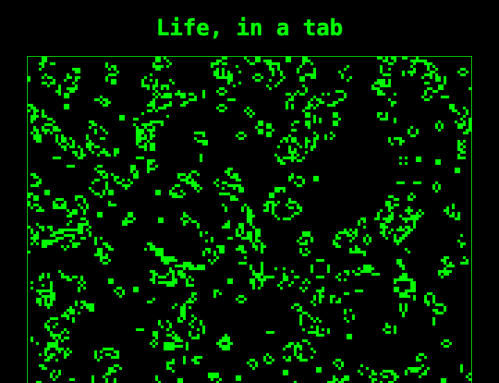
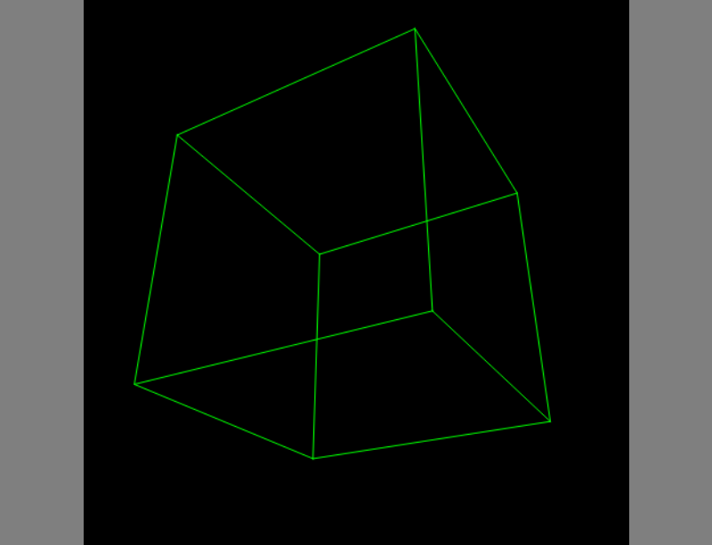

# Bonus · Share it

This one is optional, and short. Nothing later depends on it.

Everything that you've made has the same drawback when you want to show it to somebody. They need Python, and uv, and your code, and some patience. Your web projects got round that by running on a server, and a server needs looking after. There's a third way, which sounds impossible: **run the Python in their browser.** It needs no server, and nothing installed. It's a web page, which you can host free, as you hosted PyFax, and send as a link.



That's Project 6's Game of Life. The rules are running in a browser's tab, from the `life` package as you left it. There's no server behind it.

It works because browsers can now run **WebAssembly**, which is a kind of machine code for an imaginary computer that's fast, safe, and the same everywhere. CPython is a C program, and it's been compiled for that imaginary computer. The result is called **Pyodide**: the real Python interpreter, in a tab. Two projects are built on it. **PyScript** lets a web page contain Python, as it might contain JavaScript. **pygbag** packs up a Pygame game so that it runs on a web page.

!!! warning "Gotcha"
    This is the newest and least settled technology in the tutorial. Both tools change quickly, and both fetch a good deal from other people's servers while they run. Everything here worked, in a real browser, on the day it was written, with the versions that are named. If it doesn't work for you, the first thing to do is to look at each project's own front page for what's changed, and the second is to open the browser's developer tools, and read the **Console**. Treat this chapter as a postcard from the frontier, and not as a foundation.

| | |
|---|---|
| **You'll see** | Your own pure-Python package running in a browser, with PyScript; a Pygame program running in a browser, with pygbag; what `async` has to do with it |
| **Time** | 1 to 2 hours |
| **Before you start** | [Project 6](../part-1-console/p06-life.md) for the first half, [Project 14](../part-2-pygame/p14-wireframe.md) for the second, and [Project 22](p22-high-score-server.md)'s first look at `async` |

## Life, in a tab

Make a folder, `share-it`, and inside it another, `life-in-a-tab`, with three files. First, the page, `index.html`:

<!-- listing: projects/22x-share-it/life-in-a-tab/index.html -->
```html title="life-in-a-tab/index.html"
<!doctype html>
<html lang="en">
<head>
  <meta charset="utf-8">
  <meta name="viewport" content="width=device-width, initial-scale=1">
  <title>Life, in a tab</title>
  <link rel="stylesheet" href="https://pyscript.net/releases/2026.7.3/core.css">
  <script type="module" src="https://pyscript.net/releases/2026.7.3/core.js"></script>
  <style>
    body { background: #000; color: #0f0; font: 1rem monospace; text-align: center; }
    canvas { border: 1px solid #0f0; image-rendering: pixelated; width: min(95vw, 640px); }
    button { font: inherit; }
  </style>
</head>
<body>
  <h1>Life, in a tab</h1>
  <canvas id="board" width="160" height="120"></canvas>
  <p id="status">Fetching Python. The first time, that's a few seconds.</p>
  <p><button id="again">New soup</button></p>
  <script type="py" src="./main.py" config="./pyscript.toml"></script>
</body>
</html>
```

Two lines in the `<head>` fetch PyScript itself, at a version that's pinned. Near the bottom is the line that matters: **`<script type="py" src="./main.py">`**. A browser ignores a script whose type it doesn't know. PyScript looks for them, fetches Pyodide, which is about ten megabytes, and is kept by the browser afterwards, and runs the Python.

Python in a tab can't see your disc. So the second file, `pyscript.toml`, says which of your files it'll need, and PyScript fetches each of them, from beside the page, into a little file system of its own, where `import` will find them:

<!-- listing: projects/22x-share-it/life-in-a-tab/pyscript.toml -->
```toml title="life-in-a-tab/pyscript.toml"
# Which of our own files the page's Python needs. They're fetched from beside
# the page, and put where `import life` will find them.
[files]
"./life/__init__.py" = "./life/__init__.py"
"./life/core.py" = "./life/core.py"
"./life/patterns.py" = "./life/patterns.py"
"./life/render.py" = "./life/render.py"
```

And `main.py`:

<!-- listing: projects/22x-share-it/life-in-a-tab/main.py -->
```python title="life-in-a-tab/main.py"
"""Project 6's Game of Life, running in a browser's tab. The rules aren't changed."""

import asyncio

from life import soup, step
from pyscript import document, when

WIDTH, HEIGHT = 160, 120

canvas = document.querySelector("#board")
pen = canvas.getContext("2d")
status = document.querySelector("#status")
live = soup(WIDTH, HEIGHT)
generation = 0


@when("click", "#again")
def start_again(event) -> None:
    global live, generation
    live = soup(WIDTH, HEIGHT)
    generation = 0


def draw() -> None:
    pen.fillStyle = "black"
    pen.fillRect(0, 0, WIDTH, HEIGHT)
    pen.fillStyle = "lime"
    for x, y in live:
        if 0 <= x < WIDTH and 0 <= y < HEIGHT:
            pen.fillRect(x, y, 1, 1)


async def main() -> None:
    global live, generation
    while True:
        draw()
        status.textContent = f"Generation {generation}, with {len(live)} cells alive"
        live = step(live)
        generation += 1
        await asyncio.sleep(0.05)


await main()  # noqa: F704, PLE1142
```

Read it as the third front end for Project 6's rules, after the terminal and the Pygame window.

**`from life import soup, step`** is your package. Nothing in it has been changed, and nothing needed to be, since it never knew about a screen. That's the third time that keeping the rules pure has paid: in Project 13, in Project 21 with the adventure, and here.

**`from pyscript import document`** is the page. `document.querySelector`, `getContext("2d")` and `fillRect` are the browser's own, which you met as JavaScript in Project 22. Here they're called from Python, and the objects are passed back and forth for you.

**`@when("click", "#again")`** is a registering decorator, as `@app.get` was: when that element is clicked, call this function.

**The loop is `async`, and it has to be.** A browser's tab has one thread, which runs your code *and* draws the page *and* notices clicks. A `while True:` with a `time.sleep` in it would never give the thread back, and the tab would freeze solid, with nothing drawn. `await asyncio.sleep(0.05)` pauses your loop, and lets the browser have a turn. It's Project 22's lesson, in a place where you can *see* it: take the `await` out, and watch what happens.

The last line is an `await` that isn't inside a function, which ordinary Python doesn't allow. PyScript runs your file inside an event loop that's already going, and so it does. Ruff objects, reasonably, and the comment tells it why it needn't.

The page and the package have to be in one folder, to be served. A few lines will put them there. Save this as `make_site.py`, in `share-it`, and alter `LIFE` to point at your own `life` package:

<!-- listing: projects/22x-share-it/make_site.py -->
```python title="make_site.py"
"""Put the page and the life package together in one folder, ready to be served.

uv run make_site.py
uv run python -m http.server --directory site
"""

import shutil
from pathlib import Path

HERE = Path(__file__).parent
LIFE = HERE.parent / "06-life" / "src" / "life"
SITE = Path("site")

if SITE.exists():
    shutil.rmtree(SITE)
shutil.copytree(HERE / "life-in-a-tab", SITE)
shutil.copytree(
    LIFE, SITE / "life", ignore=shutil.ignore_patterns("__pycache__", "cli.py")
)
print(f"Made {SITE}/, with {len(list(SITE.rglob('*')))} files in it.")
```

!!! example "Run it"
    ```console
    $ uv run make_site.py
    Made site/, with 8 files in it.
    $ uv run python -m http.server --directory site
    ```

    Go to `http://localhost:8000/`. It must be served, as in Project 18: opened as a file, the page isn't allowed to fetch anything. The first visit takes a few seconds, while Pyodide arrives. Open the developer tools' **Network** tab, and reload, to see what's fetched, and from where.

    Then publish it. `site/` is a folder of files, and Project 19's workflow will put it on GitHub Pages, with `uv run make_site.py` where `uv run pyfax` was. Send the link to somebody who has never heard of Python.

### What it can't do

It's the real CPython, and nearly all of the standard library is there. Pure-Python packages from PyPI can be installed, by naming them in `pyscript.toml`. So can many of those with compiled parts, NumPy and Pillow among them. There are no threads to speak of, no `subprocess`, no sockets, and so no `httpx`, though there's a `fetch` of PyScript's own. The Python is whichever version Pyodide was built from, which trails the newest by a year or so. And it's slower than on your desktop, and calling the browser's objects from Python is slower still: three thousand `fillRect`s in every frame are most of the cost here. Life at fifteen generations a second, on a small board, is about what to expect.

## A cube, in a tab

Pygame needs a window, a clock, a sound card and a keyboard. **pygbag** supplies browser versions of all of them, together with Pyodide's cousin, and packs your game up with it.

It asks one thing of you, and by now you can guess what it is. The game's loop has to be in an `async def`, with an `await asyncio.sleep(0)` in it once a frame, to give the browser its turn. Here's Project 14's type-in cube, with those three changes. pygbag insists that the file be called `main.py`, in a folder of its own. Save it as `cube-in-a-tab/main.py`:

<!-- listing: projects/22x-share-it/cube-in-a-tab/main.py -->
```python title="cube-in-a-tab/main.py"
"""Project 14's spinning cube, in a browser, by way of pygbag.

There are three changes from the original: the loop is inside an `async def`,
it has an `await asyncio.sleep(0)` in it, and `asyncio.run` starts it.
"""

import asyncio
import math
from itertools import combinations, product

import pygame

CORNERS = list(product((-1, 1), repeat=3))
EDGES = [
    (a, b)
    for a, b in combinations(range(8), 2)
    if sum(p != q for p, q in zip(CORNERS[a], CORNERS[b], strict=True)) == 1
]


async def main() -> None:
    pygame.init()
    window = pygame.display.set_mode((480, 480))
    clock = pygame.time.Clock()
    angle = 0.0
    while all(event.type != pygame.QUIT for event in pygame.event.get()):
        angle += clock.tick(60) / 1000
        c, s = math.cos(angle), math.sin(angle)
        dots = []
        for x, y, z in CORNERS:
            x, z = x * c + z * s, z * c - x * s  # turn about the y axis
            y, z = y * c - z * s, z * c + y * s  # and then about the x axis
            dots.append((240 + 600 * x / (5 - z), 240 - 600 * y / (5 - z)))
        window.fill("black")
        for a, b in EDGES:
            pygame.draw.aaline(window, "green", dots[a], dots[b])
        pygame.display.flip()
        await asyncio.sleep(0)  # let the browser have a turn
    pygame.quit()


asyncio.run(main())
```

Compare it with the original. There's an `async def main()` round the loop, an `await` at the end of each frame, and `asyncio.run(main())` at the bottom. **It's still an ordinary Pygame program**: `uv run cube-in-a-tab/main.py` runs it on your desktop, as before. `asyncio.sleep(0)` means "pause for no time at all, but do pause", and on the desktop it costs nothing.

!!! example "Run it"
    ```console
    $ uvx pygbag cube-in-a-tab
    ```

    `uvx` runs a tool without installing it into your project, as in Project 17. pygbag packs the folder up, and serves it at `http://localhost:8000/`. Go there, wait for the loader, and click on the page once, since browsers won't let a page start making sounds until somebody has touched it.

    

    `uvx pygbag --build cube-in-a-tab` packs it without serving it. The result is in `cube-in-a-tab/build/web`, and that folder is what you'd publish. Add `build/` to your `.gitignore`.

Your bigger games will need more care than the cube did. Every loop that waits, such as a title screen, or a "game over", needs its `await`. Files that the game opens have to be inside the folder, and their names must match exactly, capitals and all. The Python in the browser was 3.12 when this was written, with pygame-ce 2.5.7, and so nothing newer than that will run: no t-strings, for one. Sound has to be `.ogg`. It's a port to a different machine, and should be tested as one. Snake is a good one to try next, since its model never knew about the clock. Asteroids, with its synthesised sounds from Project 11, will be a fight.

## Recap

- [x] WebAssembly lets a browser run compiled programs, and CPython is one of them
- [x] PyScript runs Python from a web page, can import your own pure-Python packages, and can call the browser's own objects
- [x] pygbag packs a Pygame program for the browser, if its loop is `async`
- [x] A browser's tab has one thread, and so anything that loops has to `await`, or the page freezes
- [x] Rules that know nothing about a screen can be given any screen: this was their third
- [x] New tools are fragile. Pin versions, read the console, and keep your expectations modest

**Read more:** [PyScript's documentation](https://docs.pyscript.net/) · [Pyodide](https://pyodide.org/), which is what's underneath · [pygbag](https://pygame-web.github.io/), whose wiki has the list of what needs changing in a game · [WebAssembly, explained by MDN](https://developer.mozilla.org/en-US/docs/WebAssembly/Guides/Concepts)

That's the end of Part 4. Part 5 goes back to where the tutorial began, to the terminal, which turns out to be capable of a good deal more than `print` and `input`.
