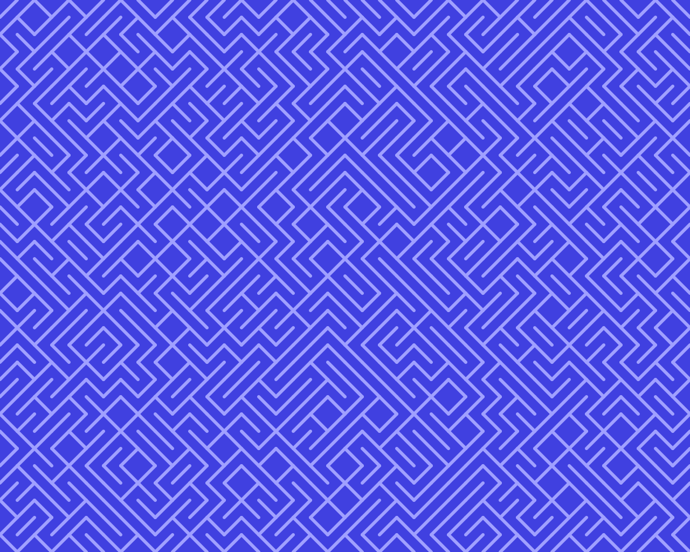

# Project 18 · SVG Plotter

In the 1980s, a well-equipped school's computer room had a *plotter*: a machine that held a real pen, and drew real lines on real paper. You drove it as you drove the screen, with `MOVE` and `DRAW`. It was slow, and it couldn't be hurried, and people stood and watched it work.



That picture isn't a screenshot. It's a text file with some numbers in it, your browser is drawing it as you watch, and if you reload the page it'll do it again. You can zoom in as far as you like, and it never goes blocky. It's an **SVG**, and you're going to write a plotter that makes them.

This is the start of Part 4, and the idea that runs all through it: **a web page is a picture that's described in text, and the browser does the drawing.** That's excellent news for a programmer. Pygame needed a window, a loop and a library. To draw in a browser, all that Python has to do is *write some text*, and writing text is what Python is best at.

It's also where a very old problem comes in, which is what happens when the text that you're writing contains something that you didn't write. Python's newest feature, which arrived in 3.14, was made for it.

| | |
|---|---|
| **You'll learn** | SVG; building strings properly; f-string format specifications; escaping, and why it matters; **t-strings**; a context manager as a class, with `__enter__` and `__exit__`; `http.server` and `webbrowser` |
| **New tool skill** | Live Preview in VS Code |
| **Time** | 4 to 5 hours |
| **Before you start** | [Project 17](../part-3-interpreters/p17-tiny-basic.md). **Python 3.14 or later**, for the t-strings. `uv python list` will tell you what you have |

## Predict

!!! question "Predict"
    ```python
    x = 1037.4786012672948
    print(f"{x:.1f}|{x:8.2f}|{x:g}|{x:,.0f}|{x!r}")
    ```

??? success "Answer"
    ```text
    1037.5| 1037.48|1037.48|1,037|1037.4786012672948
    ```

    Whatever follows the colon in an f-string is a *format specification*. `.1f` is one decimal place. `8.2f` is two, in a space eight characters wide. `g` is "general": as short as is sensible. A comma puts commas in. `!r` asks for the `repr`. You've used most of these since Project 3. Here they'll decide how big your files are. Stage 1.

!!! question "Predict"
    ```python
    from html import escape

    print(escape("if a < b & b > c"))
    print(escape('say "hi"'), escape('say "hi"', quote=False))
    ```

??? success "Answer"
    ```text
    if a &lt; b &amp; b &gt; c
    say &quot;hi&quot; say "hi"
    ```

    In SVG and in HTML, `<` begins a tag, and `&` begins one of these codes. So when you want a real `<` or a real `&` to appear, you have to write the code for it in its place. That's called *escaping*. Forget, and the page breaks, or worse. Stage 2.

!!! question "Predict"
    ```python
    name = "Fish & Chips"
    template = t"<text>{name}</text>"

    print(type(template).__name__)
    print(template.strings)
    print(template.interpolations[0].value)
    ```

??? success "Answer"
    ```text
    Template
    ('<text>', '</text>')
    Fish & Chips
    ```

    It looks like an f-string, with a `t` where the `f` was. An f-string would have given you a `str`, with everything already mixed together. **A t-string doesn't make a string at all.** It makes a `Template`, which keeps the parts that you typed apart from the values that were put in. Whoever receives it can treat the two differently, and that's what it's for. Stage 3.

!!! question "Predict"
    ```python
    class Visit:
        def __enter__(self):
            print("in")
            return "the value"

        def __exit__(self, kind, error, traceback):
            print("out, because of", kind)
            return True


    with Visit() as what:
        print(what)
        1 / 0
    print("still going")
    ```

??? success "Answer"
    ```text
    in
    the value
    out, because of <class 'ZeroDivisionError'>
    still going
    ```

    This is what `@contextmanager` was building for you in Project 17. `with` calls `__enter__`, and whatever that returns is what `as` receives. On the way out, however that comes about, it calls `__exit__`, and tells it about any exception. And if `__exit__` returns something true, **the exception is swallowed**, and the program carries on as if nothing had happened. That last part is a loaded gun, and it's the bug hunt. Stage 4.

## SVG in two minutes

```xml
<svg xmlns="http://www.w3.org/2000/svg" viewBox="0 0 400 300">
  <rect width="100%" height="100%" fill="black"/>
  <line x1="50" y1="250" x2="350" y2="50" stroke="yellow" stroke-width="4"/>
  <path d="M50 50 L350 50 L350 250" fill="none" stroke="cyan"/>
  <text x="60" y="280" fill="white" font-size="24">Hello</text>
</svg>
```

Save that as `hello.svg`, and open it in a browser. It's **XML**: *elements*, written as tags in angle brackets, with *attributes* inside them. An element either has an opening and a closing tag, with things in between, such as `<text>…</text>`, or it closes itself, with `/>`.

`viewBox` says which coordinates the picture uses. It'll be scaled to fit wherever it's shown, and that's why an SVG never goes blocky. `<path>` is the pen plotter of the family: in its `d`, `M` is `MOVE`, and `L` is `DRAW`, a *line to*. There's one snag, which by now is an old friend: **y goes downwards.**

HTML, which is the next project, is a close cousin. Everything in this chapter about building it and escaping it applies there too.

## Build

```console
$ cd making
$ uv init plotter
$ cd plotter
$ uv add --dev pytest ruff pyright
$ code .
```

Have a look at `requires-python` in `pyproject.toml`. If it says `>=3.14`, all's well. If it's lower, change it, since this project uses syntax that older Pythons can't read, and it's better to be told so by uv than by a `SyntaxError`. Add Project 17's `[tool.pyright]` table as well, and keep yourself honest.

### Stage 1: Strings, stuck together

Here's a first plotter. It's deliberately naive, and it'll last for one stage. Create `src/plotter/plot.py`:

<!-- listing: projects/18-svg-plotter/stages/stage1_plot.py -->
```python title="src/plotter/plot.py"
"""A pen plotter that draws on a file. (Stage 1: strings, stuck together.)"""

from pathlib import Path

type Point = tuple[float, float]


class Plot:
    def __init__(self, path: Path, width: int = 1280, height: int = 1024) -> None:
        self.path = path
        self.width = width
        self.height = height
        self.colour = "white"
        self.position: Point = (0.0, 0.0)
        self.parts: list[str] = []

    def move(self, x: float, y: float) -> None:
        self.position = (x, y)

    def draw(self, x: float, y: float) -> None:
        x1, y1 = self.position
        self.parts.append(
            f'<line x1="{x1:.1f}" y1="{self.height - y1:.1f}" '
            f'x2="{x:.1f}" y2="{self.height - y:.1f}" stroke="{self.colour}"/>'
        )
        self.position = (x, y)

    def label(self, x: float, y: float, words: str, size: float = 32) -> None:
        self.parts.append(
            f'<text x="{x:.1f}" y="{self.height - y:.1f}" font-size="{size:g}" '
            f'font-family="monospace" fill="{self.colour}">{words}</text>'
        )

    def svg(self) -> str:
        body = "\n".join(self.parts)
        return (
            f'<svg xmlns="http://www.w3.org/2000/svg" '
            f'viewBox="0 0 {self.width} {self.height}" stroke-width="2">\n'
            f'<rect width="100%" height="100%" fill="black"/>\n{body}\n</svg>\n'
        )

    def save(self) -> None:
        self.path.write_text(self.svg(), encoding="utf-8")
```

`move` and `draw` are the pair from BBC BASIC, and from your own `beeb` module: go somewhere with the pen up, and draw a line to somewhere. Every `draw` adds a `<line>` element, as a string, to a list. `self.height - y` turns the paper the right way up, so that the origin is at the bottom left.

Two neighbouring string literals with nothing between them are joined into one, which is how those long f-strings are spread over two lines.

```pycon
>>> from pathlib import Path
>>> from stage1_plot import Plot
>>> plot = Plot(Path("square.svg"), 400, 400)
>>> plot.move(100, 100)
>>> for x, y in [(300, 100), (300, 300), (100, 300), (100, 100)]:
...     plot.draw(x, y)
>>> plot.label(100, 40, "A square")
>>> print(plot.svg())
<svg xmlns="http://www.w3.org/2000/svg" viewBox="0 0 400 400" stroke-width="2">
<rect width="100%" height="100%" fill="black"/>
<line x1="100.0" y1="300.0" x2="300.0" y2="300.0" stroke="white"/>
<line x1="300.0" y1="300.0" x2="300.0" y2="100.0" stroke="white"/>
<line x1="300.0" y1="100.0" x2="100.0" y2="100.0" stroke="white"/>
<line x1="100.0" y1="100.0" x2="100.0" y2="300.0" stroke="white"/>
<text x="100.0" y="360.0" font-size="32" font-family="monospace" fill="white">A square</text>
</svg>
<BLANKLINE>
```

(In your own REPL, that import is `from plotter.plot import Plot`.) Call `plot.save()`, and open `square.svg` in a browser.

#### Two things about building strings

**Collect the pieces in a list, and `join` them at the end.** The tempting alternative is `self.text += piece`. A string can't be changed, and so each `+=` has to make a whole new string, and copy everything so far into it. For a hundred thousand pieces, that's a hundred thousand copies, each longer than the last. Here's the measurement:

| 100,000 pieces | Milliseconds |
|---|---|
| `"".join(pieces)` | 0.4 |
| `text += piece`, where `text` is a local variable | 2.8 |
| `self.text += piece` | **786** |

The middle row isn't what the theory predicts. CPython has a trick: if nothing else can see the string, it quietly extends it where it is. The trick only works for a plain local variable. Make it an attribute, and the trick is off, and the full cost arrives: **nearly two thousand times slower** than `join`. A performance trap that comes and goes according to where the variable lives is a good one to stay out of altogether, and `join` is never the wrong answer.

**Say how many decimal places you want.** Python will happily write a coordinate as `1037.4786012672948`. No plotter, and no screen, can do anything with the thirteenth decimal place. For a curve of 2,000 points, writing `{x:.1f}` in place of `{x}` makes the file **35% of the size**, and the picture is the same. That was the first Predict.

!!! success "Checkpoint"
    ```console
    $ git add .
    $ git commit -m "Add a first plotter, which sticks strings together"
    ```

### Stage 2: Fish & chips

Put a different label on it:

```python
plot.label(100, 40, "Fish & chips")
```

Save, and reload the browser. There's no picture now. There's an error message, in a style that you haven't seen since the 1990s, about an "EntityRef" on line 7. One character in a caption has destroyed the whole file.

`&` means something in XML, and so does `<`. Your label was *data*, and it was pasted into the middle of *markup*, and the browser can't tell which was which. Nor can it for attributes:

```python
plot.colour = 'red" onload="alert(1)'
```

That closes the attribute early, and adds a new one, which is a piece of JavaScript to be run when the picture loads. If the "colour" had come from a form on a web page, somebody would now be running their own code on your site. This is called an **injection** attack. With HTML it's *cross-site scripting*, and with databases it's *SQL injection*, and between them they've been at or near the top of every list of security holes for twenty-five years. They all have one cause: **data was pasted into code, as a string.**

The cure is the second Predict. Every value gets escaped on its way in:

```python
from html import escape

f'<text x="{x:.1f}" ...>{escape(words)}</text>'
```

That works. And it has a flaw, which is a human one: *you have to remember, every time*. There are six values in `label`'s f-string alone. Forgetting any one of them isn't an error. It works perfectly in every test that you thought of, and it waits. **A safe way of doing something that depends on never forgetting isn't safe.** What's wanted is a way of building markup in which escaping is what happens if you do nothing.

### Stage 3: t-strings

That's the third Predict. A t-string is written exactly as an f-string is, and evaluates its `{…}` expressions in the same way. But where an f-string goes ahead and glues everything into a `str`, a t-string hands you a `Template`, with the two kinds of thing still apart: the **strings** that you typed, which you trust, and the **interpolations**, which are the values that came from elsewhere. It does no formatting at all. *You* write the function that turns a `Template` into text, and that function can do whatever it likes with the values.

Create `src/plotter/markup.py`:

<!-- listing: projects/18-svg-plotter/src/plotter/markup.py -->
```python title="src/plotter/markup.py"
"""Turning a t-string into markup, with everything that was put into it made safe."""

from html import escape
from string.templatelib import Interpolation, Template, convert


class Safe(str):
    """Markup that's already been made safe, and mustn't be escaped a second time."""

    __slots__ = ()


def render(template: Template) -> Safe:
    """Return a template as text. The fixed parts are trusted, and the rest is escaped."""
    parts: list[str] = []
    for part in template:
        match part:
            case str():
                parts.append(part)
            case Interpolation(value, _, conversion, format_spec):
                parts.append(insert(convert(value, conversion), format_spec))
    return Safe("".join(parts))


type Insertable = Safe | Template | list[Insertable] | str | float


def insert(value: Insertable, format_spec: str) -> str:
    """Return one value, ready to go into markup."""
    match value:
        case Safe():
            return value
        case Template():
            return render(value)
        case list():
            return "".join(insert(item, format_spec) for item in value)
        case _:
            return escape(format(value, format_spec), quote=True)
```

Iterating over a `Template` gives you its parts, in order, and each is either a `str` or an `Interpolation`. The `match` tells them apart. An `Interpolation` has four fields, and they match by position: the **value**, the text of the **expression** that produced it, which you don't need, the **conversion**, which is the `r` of a `!r`, and the **format specification**. So `render` can honour `{x:.1f}` just as an f-string would. `convert` and `format` are the two steps that an f-string does for you behind the scenes.

And then everything is escaped. There's no way to forget, since there's nothing to remember:

```pycon
>>> from plotter.markup import render
>>> words = "Fish & chips"
>>> render(t"<text>{words}</text>")
'<text>Fish &amp; chips</text>'
>>> colour = 'red" onload="alert(1)'
>>> render(t'<path stroke="{colour}"/>')
'<path stroke="red&quot; onload=&quot;alert(1)"/>'
```

The attack has become a harmless, if peculiar, name for a colour.

`insert` has three exceptions to "escape everything", and each is needed:

- A **`Template`** inside a template is rendered in its turn. That's how big pieces of markup are built out of small ones.
- A **list** has each of its items inserted, so that you can put a whole row of elements in with one `{…}`.
- A **`Safe`** string is left alone. `render` returns one, as its way of saying "this has been done already". It's a subclass of `str` with nothing in it, which exists to be a *type*: a label that a `match` can see. Without it, markup that was passed through `render` twice would come out as `&amp;amp;`.

`type Insertable = … | list[Insertable] | …` is a type that refers to itself, as `Item` did in Logo.

!!! info "Coming from JavaScript, or from SQL"
    If you've written JSX, or tagged template literals, this is the same idea. If you've written `cursor.execute("… WHERE name = ?", (name,))`, that's the same idea too, solved by hand: keep the query and the data apart, and let the library combine them safely. T-strings are a general mechanism for it. Expect libraries for HTML, SQL and shell commands to grow functions that take a `Template`, and refuse a plain `str`.

Test it, in `tests/test_markup.py`:

<!-- listing: projects/18-svg-plotter/tests/test_markup.py -->
```python title="tests/test_markup.py"
def test_a_value_cannot_break_out_of_an_attribute():
    colour = 'red" onload="alert(1)'
    markup = render(t'<path stroke="{colour}"/>')
    assert markup == '<path stroke="red&quot; onload=&quot;alert(1)"/>'
    assert markup.count('"') == 2
# ...
def test_a_template_inside_a_template_is_not_escaped_twice():
    words = "R&D"
    inner = t"<tspan>{words}</tspan>"
    assert render(t"<text>{inner}</text>") == "<text><tspan>R&amp;D</tspan></text>"


def test_a_list_of_templates():
    rows = [t"<li>{name}</li>" for name in ("Ant", "Bee & Co")]
    assert render(t"<ul>{rows}</ul>") == "<ul><li>Ant</li><li>Bee &amp; Co</li></ul>"


def test_what_has_been_rendered_is_safe_to_put_into_something_else():
    done = render(t"<b>{'<'}</b>")
    assert isinstance(done, Safe)
    assert render(t"<p>{done}</p>") == "<p><b>&lt;</b></p>"
```

!!! success "Checkpoint"
    ```console
    $ git add .
    $ git commit -m "Render t-strings as markup, escaping every value"
    ```

### Stage 4: A proper plotter

The first plotter turned every `draw` into text on the spot. That was simple, and it shuts off a good deal. A real plotter puts its pen down, draws a long wiggly line, and lifts it again, and that's one `<path>`, and not 2,000 separate `<line>`s. To join the draws up, the plotter has to remember what it's drawn, as *data*, and only turn it into text at the end.

That's Project 17's lesson again: **keep a tree, and walk it when you need the output.** Replace `src/plotter/plot.py`. The first half is the data, and the drawing:

<!-- listing: projects/18-svg-plotter/src/plotter/plot.py -->
```python title="src/plotter/plot.py"
"""A pen plotter that draws on a file: MOVE and DRAW, for the browser."""

import math
from collections.abc import Generator
from contextlib import contextmanager
from dataclasses import dataclass, field
from pathlib import Path
from string.templatelib import Template
from types import TracebackType
from typing import Self

from plotter.markup import Safe, render

type Point = tuple[float, float]
type Element = Stroke | Label | Group  # a `type` statement may mention what comes later


@dataclass
class Stroke:
    """One unbroken line, from where the pen went down to where it came up."""

    points: list[Point]
    colour: str
    width: float

    @property
    def length(self) -> float:
        return sum(math.dist(a, b) for a, b in zip(self.points, self.points[1:]))


@dataclass
class Label:
    at: Point
    words: str
    size: float
    colour: str


@dataclass
class Group:
    """Some elements that are moved, turned or scaled together."""

    transform: str
    children: list[Element] = field(default_factory=list[Element])


class Plot:
    """A sheet of paper, with the origin at the bottom left, as on the BBC Micro.

    Use it in a `with`, and the file is written when the block finishes:

        with Plot(Path("square.svg")) as plot:
            plot.move(100, 100)
            plot.draw(400, 100)
    """

    def __init__(
        self,
        path: Path,
        width: int = 1280,
        height: int = 1024,
        paper: str = "black",
        title: str = "",
        seconds: float = 0.0,
    ) -> None:
        self.path = path
        self.width = width
        self.height = height
        self.paper = paper
        self.title = title or path.stem
        self.seconds = seconds  # how long the picture takes to draw itself, if at all
        self.colour = "white"
        self.pen_width = 2.0
        self.position: Point = (0.0, 0.0)
        self.stroke: Stroke | None = None
        self.open_groups: list[Group] = [Group("")]

    # Being a context manager.

    def __enter__(self) -> Self:
        return self

    def __exit__(
        self,
        kind: type[BaseException] | None,
        error: BaseException | None,
        traceback: TracebackType | None,
    ) -> None:
        if kind is None:
            self.save()

    # Drawing.

    def move(self, x: float, y: float) -> None:
        """Lift the pen, and go somewhere."""
        self.position = (x, y)
        self.stroke = None

    def draw(self, x: float, y: float) -> None:
        """Put the pen down, if it's up, and draw a line to somewhere."""
        if self.stroke is None:
            self.stroke = Stroke([self.position], self.colour, self.pen_width)
            self.open_groups[-1].children.append(self.stroke)
        self.stroke.points.append((x, y))
        self.position = (x, y)

    def pen(self, colour: str, width: float | None = None) -> None:
        """Change pens. Whatever is drawn next is a new stroke."""
        self.colour = colour
        if width is not None:
            self.pen_width = width
        self.stroke = None

    def label(self, x: float, y: float, words: str, size: float = 32) -> None:
        self.open_groups[-1].children.append(Label((x, y), words, size, self.colour))

    @contextmanager
    def turned(self, degrees: float, about: Point) -> Generator[None]:
        """Whatever is drawn inside the `with` is turned anticlockwise about a point."""
        x, y = self.on_paper(about)
        group = Group(f"rotate({-degrees:g} {x:g} {y:g})")
        self.open_groups[-1].children.append(group)
        self.open_groups.append(group)
        self.stroke = None
        try:
            yield
        finally:
            self.open_groups.pop()
            self.stroke = None
```

A picture is made of `Stroke`s, `Label`s and `Group`s, and a group has children, which may be groups. `type Element` comes *before* the classes that it mentions. A `type` statement isn't worked out until somebody asks, and so it may refer to things that don't exist yet. And in Python 3.14, the same goes for ordinary annotations, which is why `list[Element]` needs none of the quotation marks that Project 17 had to use.

`draw` adds a point to the stroke that's in progress, and starts a new one if the pen has moved or been changed since. `math.dist` is the distance between two points, and `zip(points, points[1:])` pairs each point with the next, which was Project 3's trick.

#### A context manager, as a class

You want a picture to be saved when you've finished drawing it, without having to remember. That's a job for `with`:

```python
with Plot(Path("square.svg")) as plot:
    plot.move(100, 100)
    plot.draw(300, 100)
# and here the file has been written
```

In Project 17 you made a context manager from a generator, with a decorator. That was the fourth Predict's machinery, hidden. **Any object with an `__enter__` and an `__exit__` can be used in a `with`**, and when the object already exists for other reasons, as `Plot` does, giving it those two methods is the natural thing.

`__enter__` returns what `as` will receive, which is nearly always `self`. `Self` is the right hint, from Project 15.

`__exit__` is given three things, and they're either all `None`, because the block finished normally, or they describe the exception that ended it: its class, the exception itself, and the traceback. The type hints are a mouthful, and they're always the same mouthful, so copy them from here for the rest of your life.

This `__exit__` saves the file **only if nothing went wrong**. Half a picture, overwriting yesterday's good one, would be worse than none. And it returns `None`, which means "I haven't dealt with the exception: carry on raising it". **An `__exit__` should hardly ever return `True`.** The bug hunt shows what happens when one does.

`turned` is the other kind, side by side with it, for comparison. It opens a group, which turns everything that's drawn inside the `with`, and closes it on the way out, in a `finally`. `open_groups` is a stack, since groups may be inside groups, and you've met a few of those by now. Which kind should you write? Use **`@contextmanager`** for a before and an after round a block, and use **a class** when the object is something in its own right, with a life outside the `with`.

Now the second half, which turns the tree into SVG:

<!-- listing: projects/18-svg-plotter/src/plotter/plot.py -->
```python title="src/plotter/plot.py"
    # Turning it all into SVG.

    def on_paper(self, point: Point) -> Point:
        """SVG measures y downwards from the top. Everybody else measures it upwards."""
        return point[0], self.height - point[1]

    def svg(self) -> str:
        inked = sum(stroke.length for stroke in self.strokes(self.open_groups[0]))
        self.drawn = 0.0
        body = [self.element(child, inked) for child in self.open_groups[0].children]
        style = ANIMATION if self.seconds else Safe("")
        return render(
            t"""<svg xmlns="http://www.w3.org/2000/svg" viewBox="0 0 {self.width} {self.height}"
     fill="none" stroke-linecap="round" stroke-linejoin="round">
<title>{self.title}</title>
<style>{style}</style>
<rect width="100%" height="100%" fill="{self.paper}"/>
{body}</svg>
"""
        )

    def strokes(self, group: Group) -> Generator[Stroke]:
        for child in group.children:
            match child:
                case Stroke():
                    yield child
                case Group():
                    yield from self.strokes(child)
                case Label():
                    pass

    def element(self, item: Element, inked: float) -> Template:
        match item:
            case Stroke(points, colour, width):
                path = "M" + " L".join(
                    f"{x:.1f} {y:.1f}" for x, y in map(self.on_paper, points)
                )
                delay = self.seconds * self.drawn / inked if inked else 0.0
                taken = self.seconds * item.length / inked if inked else 0.0
                self.drawn += item.length
                timing = f"animation-delay:{delay:.2f}s;animation-duration:{taken:.2f}s"
                return t'<path d="{path}" stroke="{colour}" stroke-width="{width:g}" pathLength="1" style="{timing}"/>\n'
            case Label((x, y), words, size, colour):
                x, y = self.on_paper((x, y))
                return t'<text x="{x:.1f}" y="{y:.1f}" font-size="{size:g}" font-family="monospace" fill="{colour}">{words}</text>\n'
            case Group(transform, children):
                inside = [self.element(child, inked) for child in children]
                return t'<g transform="{transform}">\n{inside}</g>\n'

    def save(self) -> None:
        self.path.write_text(self.svg(), encoding="utf-8")


ANIMATION = Safe("""
path { stroke-dasharray: 1; stroke-dashoffset: 1; animation: draw linear forwards; }
@keyframes draw { to { stroke-dashoffset: 0; } }
""")
```

`element` is a `match` on the three kinds of element, as `execute` was in BASIC, and every case returns a **`Template`**. Nothing is a string until `render` is called, once, at the end. A group's children are a list of templates, dropped into the group's own template. There isn't a call to `escape` in the whole file, and there isn't a place where one's been forgotten, either.

`Label((x, y), words, size, colour)` takes a point apart in the middle of a class pattern. Patterns nest.

`strokes` is a recursive generator, which finds every stroke, however deep in groups, with `yield from`, as in Project 7.

#### A picture that draws itself

Give a `Plot` some `seconds`, and the picture draws itself, in that time, a stroke after a stroke, as a real plotter would. It's an old trick, and it's all done by the browser. A line can be drawn *dashed*, and the pattern of dashes can be slid along it. So: make the dash exactly as long as the line, with a gap exactly as long as the line, slide the pattern until only the gap is showing, and then animate it sliding back. `pathLength="1"` tells the browser to pretend that every path is one unit long, which saves working out the real lengths for the CSS.

What Python works out is *when*. Each stroke's share of the time is in proportion to its length, so that the pen seems to move at a steady speed, and each starts as the one before it finishes.

```pycon
>>> from plotter import Plot
>>> with Plot(Path("fish.svg"), 400, 300, title="Fish & chips", seconds=4) as plot:
...     plot.move(50, 50)
...     plot.draw(350, 50)
...     plot.draw(350, 250)
...     plot.label(60, 260, "if x < 3 & y > 4")
>>> print(Path("fish.svg").read_text())
<svg xmlns="http://www.w3.org/2000/svg" viewBox="0 0 400 300"
     fill="none" stroke-linecap="round" stroke-linejoin="round">
<title>Fish &amp; chips</title>
<style>
path { stroke-dasharray: 1; stroke-dashoffset: 1; animation: draw linear forwards; }
@keyframes draw { to { stroke-dashoffset: 0; } }
</style>
<rect width="100%" height="100%" fill="black"/>
<path d="M50.0 250.0 L350.0 250.0 L350.0 50.0" stroke="white" stroke-width="2" pathLength="1" style="animation-delay:0.00s;animation-duration:4.00s"/>
<text x="60.0" y="40.0" font-size="32" font-family="monospace" fill="white">if x &lt; 3 &amp; y &gt; 4</text>
</svg>
<BLANKLINE>
```

And `src/plotter/__init__.py`:

<!-- listing: projects/18-svg-plotter/src/plotter/__init__.py -->
```python title="src/plotter/__init__.py"
"""MOVE and DRAW for the browser: a pen plotter that draws SVG."""

from plotter.markup import Safe, render
from plotter.plot import Plot

__all__ = ["Plot", "Safe", "render"]
```

#### Testing markup

Don't test SVG by comparing strings, or every change of spacing will break your tests. **Parse it**, with the XML parser from the standard library, and ask questions of the tree. There's a bonus: if `ET.fromstring` accepts it at all, it's well-formed, and that's most of the ways in which generated markup goes wrong. `tests/test_plot.py`:

<!-- listing: projects/18-svg-plotter/tests/test_plot.py -->
```python title="tests/test_plot.py"
SVG = "{http://www.w3.org/2000/svg}"


def parsed(plot: Plot) -> ET.Element:
    """Return the picture as a tree, which also proves that it's well-formed XML."""
    return ET.fromstring(plot.svg())


@pytest.fixture
def plot(tmp_path: Path) -> Plot:
    return Plot(tmp_path / "test.svg", width=100, height=100)


def test_the_origin_is_at_the_bottom_left(plot):
    plot.move(0, 0)
    plot.draw(100, 25)
    (path,) = parsed(plot).iter(f"{SVG}path")
    assert path.get("d") == "M0.0 100.0 L100.0 75.0"
# ...
def test_awkward_characters_survive_in_labels_and_titles(tmp_path):
    plot = Plot(tmp_path / "t.svg", title="Fish & <Chips>")
    plot.label(10, 10, 'if x < 3 & y > "4"')
    tree = parsed(plot)
    assert tree.findtext(f"{SVG}title") == "Fish & <Chips>"
    assert tree.findtext(f"{SVG}text") == 'if x < 3 & y > "4"'
# ...
def test_the_file_is_written_when_the_with_finishes(tmp_path):
    path = tmp_path / "square.svg"
    with Plot(path) as plot:
        plot.draw(100, 100)
        assert not path.exists()
    assert ET.parse(path).getroot().tag == f"{SVG}svg"


def test_and_not_if_it_went_wrong(tmp_path):
    path = tmp_path / "broken.svg"
    with pytest.raises(ValueError, match="oops"), Plot(path) as plot:
        plot.draw(100, 100)
        raise ValueError("oops")
    assert not path.exists()
```

Every element's name comes back from the parser with the *namespace* on the front, in curly brackets, which is what the `SVG` constant is for. The test of awkward characters is a round trip: whatever you put in, however nasty, the parser should hand back, unchanged.

!!! success "Checkpoint"
    ```console
    $ uv run pyright
    $ git add .
    $ git commit -m "Keep the picture as a tree, join strokes into paths, and save on leaving a with"
    ```

### Stage 5: Pictures

Make a folder called `examples`. Here's the rose from the top of the chapter, as `examples/rose.py`:

<!-- listing: projects/18-svg-plotter/examples/rose.py -->
```python title="examples/rose.py"
"""A rose: one curve, seven petals wide, that closes after five turns."""

import math
from pathlib import Path

from plotter import Plot

PICTURES = Path("pictures")
PICTURES.mkdir(exist_ok=True)

with Plot(PICTURES / "rose.svg", title="A rose", seconds=8) as plot:
    plot.pen("hotpink", width=3)
    plot.move(1040, 512)
    for step in range(1, 2001):
        angle = step / 2000 * 5 * math.tau
        radius = 400 * math.cos(angle * 7 / 5)
        plot.draw(640 + radius * math.cos(angle), 512 + radius * math.sin(angle))
    plot.pen("white")
    plot.label(40, 40, "r = cos(7θ/5), for 0 < θ < 10π")
```

```console
$ uv run examples/rose.py
$ open pictures/rose.svg
```

On Windows, that second command is `start pictures\rose.svg`, and on Linux it's `xdg-open`. The label has a `<` and a `θ` in it, and nobody had to think about either.

Here's the most famous one-line program ever written in BASIC, which, it has to be admitted, was for the Commodore 64. At each position, it prints a diagonal, one way or the other, at random. `examples/maze.py`:

<!-- listing: projects/18-svg-plotter/examples/maze.py -->
```python title="examples/maze.py"
"""10 PRINT CHR$(205.5+RND(1)); : GOTO 10 -- the most famous one-liner in BASIC."""

import random
from pathlib import Path

from plotter import Plot

PICTURES = Path("pictures")
PICTURES.mkdir(exist_ok=True)
SIZE = 32
rng = random.Random(10)

with Plot(PICTURES / "maze.svg", paper="#4040e0", title="10 PRINT") as plot:
    plot.pen("#a0a0ff", width=6)
    for y in range(0, 1024, SIZE):
        for x in range(0, 1280, SIZE):
            if rng.random() < 0.5:
                plot.move(x, y)
                plot.draw(x + SIZE, y + SIZE)
            else:
                plot.move(x, y + SIZE)
                plot.draw(x + SIZE, y)
```



And here's one that shows off the single continuous stroke. A *Hilbert curve* visits every cell of a grid without ever crossing itself. The function is recursive, and it's a generator, and its points are complex numbers, as in Project 7, since "half of this side" and "minus that side" are so easy to say with them. `examples/hilbert.py`:

<!-- listing: projects/18-svg-plotter/examples/hilbert.py -->
```python title="examples/hilbert.py"
"""A Hilbert curve: one line that visits every cell of a grid, and never crosses itself."""

from collections.abc import Iterator
from pathlib import Path

from plotter import Plot

PICTURES = Path("pictures")
PICTURES.mkdir(exist_ok=True)


def hilbert(order: int, corner: complex, a: complex, b: complex) -> Iterator[complex]:
    """Yield the points of the curve that fills the box at `corner` with sides a and b.

    The points are complex numbers, as in Project 7: x is the real part, and y the
    imaginary part, which makes "half of this side" and "minus that one" easy to say.
    """
    if order == 0:
        yield corner + (a + b) / 2
        return
    yield from hilbert(order - 1, corner, b / 2, a / 2)
    yield from hilbert(order - 1, corner + a / 2, a / 2, b / 2)
    yield from hilbert(order - 1, corner + a / 2 + b / 2, a / 2, b / 2)
    yield from hilbert(order - 1, corner + a / 2 + b, -b / 2, -a / 2)


with Plot(PICTURES / "hilbert.svg", 1024, 1024, title="Hilbert", seconds=12) as plot:
    plot.pen("lime", width=4)
    first, *rest = hilbert(5, 32 + 32j, 960, 960j)
    plot.move(first.real, first.imag)
    for point in rest:
        plot.draw(point.real, point.imag)
```



That's 1,024 points, in one stroke. It takes twelve seconds to draw, and it's oddly hard to look away from.

!!! success "Checkpoint"
    Add `pictures/` to your `.gitignore`. They're *output*, and the programs that make them are what belong in Git.

    ```console
    $ git add .
    $ git commit -m "Add three drawings"
    ```

### Stage 6: Serve them

So far you've opened files. The address bar said `file:///Users/…`, and that's the browser reading your disc. The web doesn't work like that. A browser asks a **server** for a page, over **HTTP**, and the server sends it back. For the rest of Part 4 you'll be writing servers, and Python has had a simple one in its standard library for thirty years:

```console
$ cd pictures
$ uv run python -m http.server
Serving HTTP on :: port 8000 (http://[::]:8000/) ...
```

Go to `http://localhost:8000/` in your browser. There's a list of your files, and you can click on them. Look back at the terminal: every request that the browser makes is logged there, with a `200` for "here it is", or a `404` for "there's no such thing". Press ++ctrl+c++ to stop it. It's the quickest way of looking at a folder as a web site, and of getting a file on to your phone, which is a thing worth knowing.

A list of files isn't much of a gallery. Here's a program that writes a proper page, serves it, and opens your browser. Create `src/plotter/gallery.py`:

<!-- listing: projects/18-svg-plotter/src/plotter/gallery.py -->
```python title="src/plotter/gallery.py"
"""Show a folder of pictures as a web page, served from your own machine."""

import argparse
import webbrowser
from functools import partial
from http.server import SimpleHTTPRequestHandler, ThreadingHTTPServer
from pathlib import Path

from plotter.markup import render

STYLE = """
body { background: #111; color: #eee; font-family: system-ui, sans-serif; margin: 2rem; }
main { display: grid; grid-template-columns: repeat(auto-fill, minmax(320px, 1fr)); gap: 1rem; }
figure { margin: 0; }
img { width: 100%; border: 1px solid #444; }
figcaption { text-align: center; padding: 0.5rem; }
"""


def page(folder: Path) -> str:
    """Return a page of HTML with every SVG file in the folder on it."""
    pictures = sorted(folder.glob("*.svg"))
    figures = [
        t'<figure>'
        t"<figcaption>{picture.stem}</figcaption></figure>\n"
        for picture in pictures
    ]
    return render(
        t"""<!doctype html>
<html lang="en">
<head>
<meta charset="utf-8">
<title>{folder.resolve().name}: {len(pictures)} pictures</title>
<style>{STYLE}</style>
</head>
<body>
<h1>{folder.resolve().name}</h1>
<main>
{figures}</main>
</body>
</html>
"""
    )


def server_for(folder: Path, port: int) -> ThreadingHTTPServer:
    """Return a web server that serves the files in a folder, to this machine only."""
    handler = partial(SimpleHTTPRequestHandler, directory=str(folder))
    return ThreadingHTTPServer(("127.0.0.1", port), handler)


def main() -> None:
    parser = argparse.ArgumentParser(description=__doc__)
    parser.add_argument("folder", nargs="?", type=Path, default=Path("pictures"))
    parser.add_argument("--port", type=int, default=8000)
    parser.add_argument("--no-browser", action="store_true")
    args = parser.parse_args()

    if not args.folder.is_dir():
        raise SystemExit(f"There's no folder called {args.folder}")
    (args.folder / "index.html").write_text(page(args.folder), encoding="utf-8")

    with server_for(args.folder, args.port) as server:
        address = f"http://127.0.0.1:{server.server_port}/"
        print(f"Serving {args.folder} at {address}  (Ctrl+C to stop)")
        if not args.no_browser:
            webbrowser.open(address)
        try:
            server.serve_forever()
        except KeyboardInterrupt:
            print("\nStopped.")
```

Set the command in `pyproject.toml` to `gallery = "plotter.gallery:main"`.

**`page` is your first web page**, and it's built exactly as the SVG was: a t-string, with a list of smaller templates dropped into it, and everything escaped. A file called `b & w.svg` will do no harm, and there's a test to prove it. `folder.glob("*.svg")` finds the pictures, and `sorted` puts them in order.

**`server_for`** makes the server. `SimpleHTTPRequestHandler` is the class that knows how to answer a request with a file. The server makes a new handler for every request, by *calling* whatever you gave it, and so you can't hand it an object that's already set up. `partial`, from Project 7, makes a version of the class with the folder already filled in. `127.0.0.1` means "this machine only": nothing else on your network can reach it. A port of `0`, which the tests use, means "any port that's free".

**The server is a context manager.** `with server_for(…) as server:` makes sure that the port is given back, however the program ends. Standard-library objects that hold on to something, such as files, locks, servers and connections to databases, nearly all work like this.

**`webbrowser.open`** opens a page in the user's own browser, whatever it is, on every platform.

!!! example "Run it"
    ```console
    $ uv run gallery pictures
    Serving pictures at http://127.0.0.1:8000/  (Ctrl+C to stop)
    ```

    Your browser opens, with all the pictures on one page, and those that draw themselves all drawing at once. Run one of the examples again in another terminal, reload the page, and it's up to date.

The server's test starts it on a spare port, in a thread, and asks it for things with `urllib`, which is the standard library's way of being a browser. `tests/test_gallery.py`:

<!-- listing: projects/18-svg-plotter/tests/test_gallery.py -->
```python title="tests/test_gallery.py"
def test_the_server_serves_the_folder(tmp_path):
    make_pictures(tmp_path)
    (tmp_path / "index.html").write_text(page(tmp_path), encoding="utf-8")
    with server_for(tmp_path, port=0) as server:
        threading.Thread(target=server.serve_forever, daemon=True).start()
        address = f"http://127.0.0.1:{server.server_port}"
        with urllib.request.urlopen(f"{address}/") as reply:
            assert reply.status == 200
            assert "<h1>" in reply.read().decode()
        with urllib.request.urlopen(f"{address}/aardvark.svg") as reply:
            assert reply.headers["Content-Type"] == "image/svg+xml"
        server.shutdown()
```

#### Live Preview

Going back and forth between the editor and the browser gets tedious. Install Microsoft's **Live Preview** extension:

```console
$ code --install-extension ms-vscode.live-server
```

Open `pictures/index.html`, and run **Live Preview: Show Preview** from the Command Palette. A browser opens *inside VS Code*, beside your code, and it reloads itself whenever a file in the project changes. Put an example beside it, change a number, run it, and watch the picture change.

!!! bug "Not yet verified first-hand"
    Live Preview is described here from its documentation. Extensions rename their commands now and then. If this one has, search the Command Palette for "preview".

!!! success "Checkpoint"
    ```console
    $ git add .
    $ git commit -m "Add a gallery: a page of pictures, served from this machine"
    $ git push
    ```

## Type-in listing

Here's a Spirograph, which is a wheel rolling round the inside of a ring, with a pen through a hole in it. It needs no library at all. For one picture, with nothing in it that came from anybody else, a plain f-string is perfectly good. Save it as `spiro.py`.

<!-- listing: projects/18-svg-plotter/spiro.py -->
```python title="spiro.py" linenums="1"
import math
import webbrowser
from pathlib import Path

BIG, SMALL, PEN = 96, 59, 60  # the fixed ring, the rolling wheel, and the pen's hole
TURNS = SMALL // math.gcd(BIG, SMALL)

points = []
for step in range(TURNS * 360 + 1):
    t = math.radians(step)
    across = (BIG - SMALL) * math.cos(t) + PEN * math.cos((BIG - SMALL) / SMALL * t)
    up = (BIG - SMALL) * math.sin(t) - PEN * math.sin((BIG - SMALL) / SMALL * t)
    points.append(f"{across:.1f},{up:.1f}")

svg = f"""<svg xmlns="http://www.w3.org/2000/svg" viewBox="-100 -100 200 200">
<rect x="-100" y="-100" width="200" height="200" fill="midnightblue"/>
<polyline points="{" ".join(points)}" fill="none" stroke="gold" stroke-width="0.4"/>
</svg>
"""
path = Path("spiro.svg")
path.write_text(svg, encoding="utf-8")
print(f"{len(points):,} points, {len(svg):,} characters, {TURNS} turns of the wheel")
webbrowser.open(path.resolve().as_uri())
```

1. Why is there no `self.height - y` anywhere? Look at the `viewBox`. Where's the origin? Which way up is the picture, and does it matter?
2. The wheel has to go round `TURNS` times before the pattern closes. Why does `gcd`, the greatest common divisor, come into it? Try a `SMALL` of 60, and of 48.
3. How many characters would the file have with `{across}` in place of `{across:.1f}`?
4. Line 23 turns a path into an address that a browser can open. What does it look like? Why `resolve()`?
5. There's no escaping in this program. Why is that all right *here*? What would have to change before it wasn't?

## Bug hunt

A colleague has improved on your plotter. "Mine never crashes," they say. "I made sure of it." Their version is in the tutorial's repository, as `projects/18-svg-plotter/bughunt/quiet.py`. It ought to draw a square, with a cross in it, which is three strokes.

```console
$ uv run bughunt/quiet.py
Finished, with no errors. Strokes in quiet.svg: 1
```

1. **Reproduce it.** Look at the picture. What's there, and what isn't?
2. **Find it.** Read `main`, slowly. There's a slip in it. What *ought* to have happened when Python reached it? Why didn't it?
3. **Write a failing test, and fix it.** Which of the two mistakes are you fixing?

??? success "Solution"
    `plot.drawn(350, 350)` is a slip of the finger: there's no such method. That's an `AttributeError`, and it ought to have stopped the program, with a traceback that pointed straight at the line.

    It didn't, because the colleague's `__exit__` ends with `return True`, which tells Python that the exception has been dealt with. So the `with` block stopped dead at the slip, the rest of it was skipped, a picture with a third of its strokes was saved, and the program went cheerfully on to say "no errors". **That was the fourth Predict.** Every mistake inside that `with`, for ever, will vanish without trace: typing slips, division by nought, a full disc.

    There are two bugs, and the slip is the unimportant one. Pylance had underlined it anyway. The real bug is the `return True`, together with the unconditional `save`:

    ```python
    def test_a_mistake_inside_the_with_is_not_kept_quiet(tmp_path):
        with pytest.raises(AttributeError, match="drawn"), Plot(tmp_path / "t.svg") as plot:
            plot.drawn(10, 10)
        assert not (tmp_path / "t.svg").exists()
    ```

    **What to take from it.** "It never crashes" is a description of a program that hides its errors, and not of one that hasn't any. A crash, with a traceback, at the moment that something goes wrong, is the most helpful thing a program can do for you. An `__exit__` that returns `True` is the context manager's version of `except: pass`, and deserves the same suspicion. The few honest uses are things such as `contextlib.suppress`, where swallowing one *named* kind of exception is the whole purpose, and says so on the tin.

## Challenges

Make a branch for each, and merge it with a pull request.

**Tweak**

1. Draw on cream paper, in dark blue ink, with a finer pen. Then give the Hilbert curve a different colour for each quarter of its length.
2. Make the first plotter's label safe, with `html.escape`, and run this chapter's tests of awkward characters against it. Then count the places where you had to remember.
3. Add `--seconds` to the gallery, which overrides nothing, since the files are already written. So what *would* it have to do? Is that the gallery's job?

**Extend**

1. **Circles.** Add a `Disc` element, which is a filled circle, and a `plot.disc(x, y, radius)`. Add it to the `Element` union first, and let pyright show you the two places that need to know. (There are two, and one of them is easy to miss without it.)
2. **A graph.** Write `chart(plot, function, x_range, y_range, name)`, which draws the axes, with ticks and numbers, and then the curve. Use nothing but the plotter's public methods. Give it a name with a `<` in it.
3. **`moved` and `scaled`.** Two more context managers for groups, as `turned` is. Then draw one small motif, and use all three to make a pattern of it, in nested `with` blocks.
4. **Your Logo, on paper.** Project 16's turtle draws on anything with a `line` and a `clear`. Write an adapter, so that a `Plot` is a Logo canvas, and have the tree draw itself.

??? tip "Hint for the graph"
    The heart of it is one small function, from the graph's coordinates to the paper's: `across = LEFT + (x - x_low) / (x_high - x_low) * WIDTH`, and the same for y. Write that first, as a function inside `chart`, and everything else is `move`, `draw` and `label`.

**Invent**

1. **A real plotter.** Pen plotters are back in fashion, and most are driven by SVG. Anything that takes a long time to draw rewards planning. Reorder the strokes so that the pen travels as little as possible with its nib in the air. It's a famous hard problem, and "always go to the nearest stroke next" does surprisingly well.
2. **Generative art.** A flow field: scatter a few hundred points, and move each a small step at a time in a direction that depends on where it is, as `math.sin(x / 90) + math.cos(y / 70)` might say. Draw the trails.
3. **An HTML renderer.** `render` knows nothing about SVG. Build a small page with it, with nested templates for a table. What would it take for a function to refuse a plain `str`, and insist on a `Template`?

A solution to the second Extend, and the bug hunt's tests, are in the project's `solutions/` folder.



## Recap

You can now:

- [x] read and write simple SVG: `viewBox`, `<path>`, `<text>`, `<g transform>`
- [x] build long strings from a list with `join`, and say why `+=` is a trap
- [x] use format specifications to control what numbers look like, and how big your files are
- [x] explain injection, and why "remember to escape" isn't a safe design
- [x] write a t-string, take a `Template` apart, and write the function that renders it
- [x] mark text as already safe with a subclass of `str`
- [x] write a context manager as a class, with `__enter__` and `__exit__`, and say what each of `__exit__`'s arguments and its return value mean
- [x] choose between a class and `@contextmanager`
- [x] test generated markup by parsing it
- [x] serve a folder with `python -m http.server`, and write a small server with `http.server` and `partial`
- [x] open the user's browser with `webbrowser`

**Read more:** [PEP 750: template strings](https://peps.python.org/pep-0750/) · [`string.templatelib`](https://docs.python.org/3/library/string.templatelib.html) · [The format specification mini-language](https://docs.python.org/3/library/string.html#formatspec) · [MDN's SVG tutorial](https://developer.mozilla.org/en-US/docs/Web/SVG/Tutorials/SVG_from_scratch) · [`http.server`](https://docs.python.org/3/library/http.server.html), including the warning at the top about what it isn't for · [OWASP on injection](https://owasp.org/Top10/A03_2021-Injection/) · [10 PRINT](https://10print.org/), a whole book about that one line of BASIC, which is free to read

A page of pictures is a start. In [Project 19](p19-pyfax.md) you'll build a whole site, of a kind that every British household once had on its television: forty columns, twenty-five rows, eight colours, and graphics made out of six little squares.
