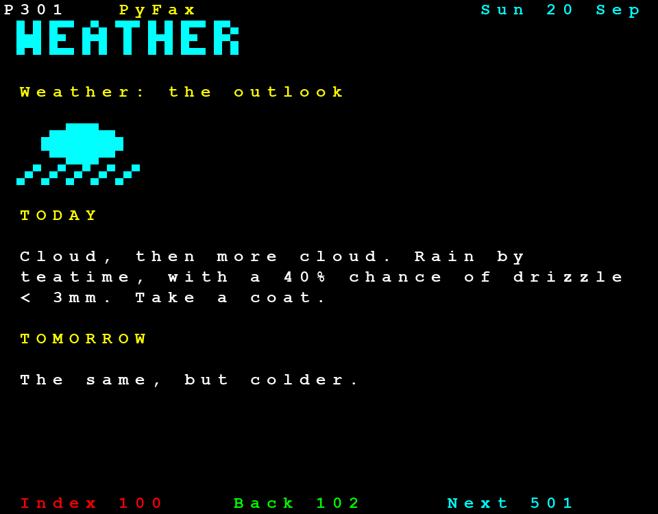
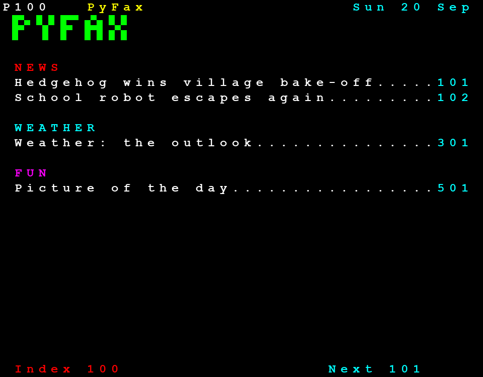
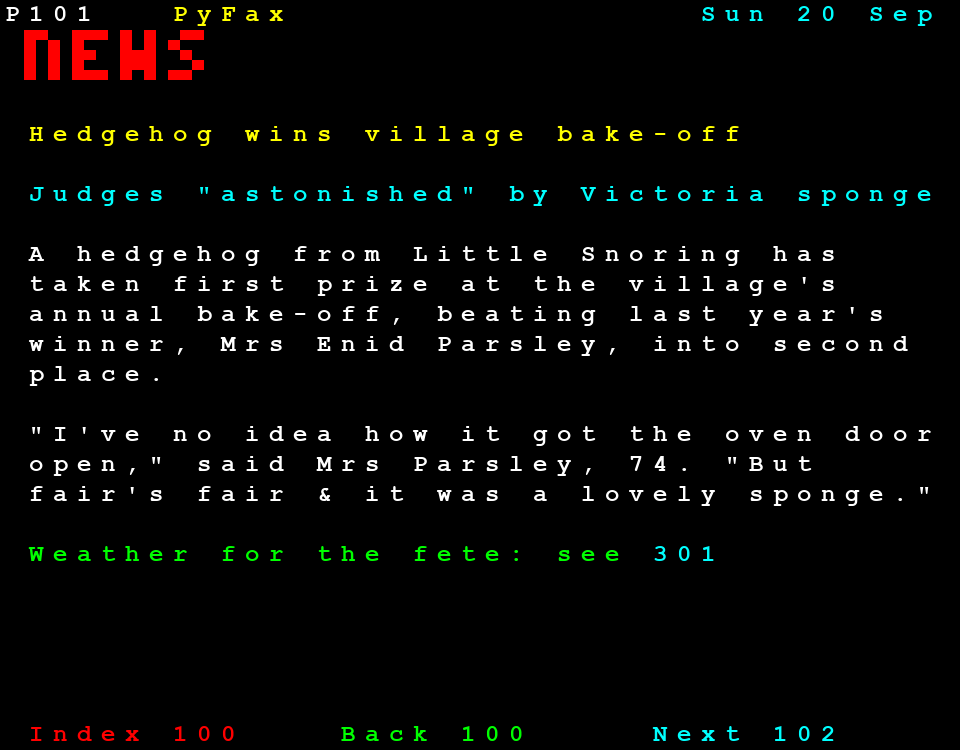
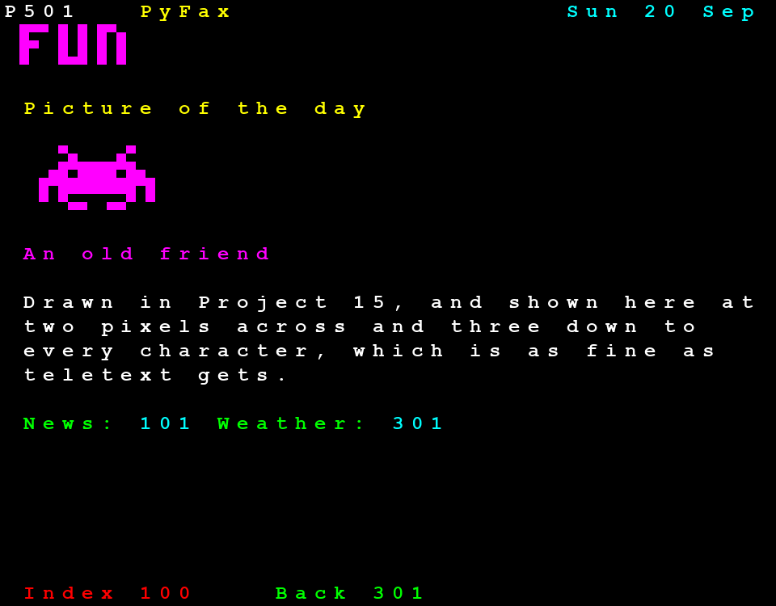

# Project 19 · PyFax

Before the web, there was **teletext**. From 1974 until 2012, every television in Britain could show a few hundred pages of news, weather, football scores and cheap holidays, which the BBC called Ceefax. You typed a three-figure number on the remote control, waited for the page to come round, and there it was: forty columns, twenty-five rows, eight colours, and pictures made of blocks.



It has a claim on this tutorial. The BBC Micro's MODE 7 was a teletext screen, driven by the same chip that was in the televisions, and so a whole generation's first title screens and menus were built from these same blocks.

You're going to build a teletext service for the web: **PyFax**. You write articles as small text files. A program turns them into pages, numbers them, adds an index, links them together, and writes out a folder of HTML. That's a **static site generator**, and it's how a great deal of the web is made, this tutorial among it. Since the result is a folder of files, and needs no server of your own, GitHub will host it, free, and by the end of the chapter it'll have an address that you can send to somebody.

The block graphics are six little squares to a character, which is six **bits**. Bits have been owed to you since Project 15.

| | |
|---|---|
| **You'll learn** | Bit operations: `&`, `\|`, `^`, `~`, `<<`, `>>`, masks, `IntFlag`; HTML and CSS basics, with CSS grid; Jinja2 templates: loops, filters, inheritance, autoescaping; `textwrap`; generating CSS from Python; reading HTML with `html.parser` |
| **New tool skill** | Publishing to GitHub Pages with an Actions workflow |
| **Time** | 5 to 6 hours |
| **Before you start** | [Project 18](p18-svg-plotter.md). Project 14's `tomllib`, and Project 17's GitHub Actions |

## Predict

!!! question "Predict"
    ```python
    print(5 & 3, 5 | 3, 5 ^ 3, 1 << 4, 40 >> 3)
    print(bin(21), 0b010101, f"{21:06b}")
    ```

??? success "Answer"
    ```text
    1 7 6 16 5
    0b10101 21 010101
    ```

    In binary, 5 is `101`, and 3 is `011`. `&` keeps the bits that are set in **both**, which leaves `001`. `|` keeps those set in **either**: `111`. `^` keeps those set in **one and not the other**: `110`. `<<` slides the bits to the left, which doubles the number each time, and `>>` slides them right, and throws away whatever falls off the end. `bin` and the `b` format show a number in binary, and `0b` lets you write one. Stage 1.

!!! question "Predict"
    ```python
    dots = 0b010101
    for position in range(6):
        print(position, dots >> position & 1, dots & (1 << position))
    ```

??? success "Answer"
    ```text
    0 1 1
    1 0 0
    2 1 4
    3 0 0
    4 1 16
    5 0 0
    ```

    Here are the two ways of asking "is this bit set?". The first slides the bit that you want down to the bottom, and cuts off everything else, and so it gives 1 or 0. The second makes a *mask*, with one bit set, and `&`s with it, and so it gives **the value of that bit**, or 0: 1, 4 and 16, and not 1, 1 and 1. Both are fine as the test of an `if`. Compare the second with `== 1`, and you have this chapter's bug hunt. Stage 1.

!!! question "Predict"
    ```python
    from dataclasses import dataclass


    @dataclass(frozen=True)
    class Cell:
        text: str = " "


    row = [Cell()] * 3
    print(row[0] is row[1])

    rows = [row] * 2
    rows[0][0] = Cell("X")
    print(rows[1][0].text)
    ```

??? success "Answer"
    ```text
    True
    X
    ```

    `[thing] * 3` is a list that holds the *same* thing three times. For the cells, that's harmless, and thrifty: a frozen cell can't change, and so nobody can tell that there's only one of it. That was Project 10's rule. For the rows it's a disaster: `rows` holds one list twice, and writing on the top row writes on the bottom one too. A page needs twenty-five separate lists, and sharing the cells inside them is fine. Stage 2.

!!! question "Predict"
    ```python
    from jinja2 import Environment

    source = "<b>{{ name }}</b>"
    trusting = Environment()
    careful = Environment(autoescape=True)

    print(trusting.from_string(source).render(name="Fish & <Chips>"))
    print(careful.from_string(source).render(name="Fish & <Chips>"))
    ```

??? success "Answer"
    ```text
    <b>Fish & <Chips></b>
    <b>Fish &amp; &lt;Chips&gt;</b>
    ```

    Jinja2 is the template language that most of the Python web uses. `{{ name }}` means "put the value here". It's Project 18's `render`, industrial size. And it has Project 18's problem, with one difference: **the safe behaviour is an option, and it's off unless you ask.** Ask, always. Stage 4.

## Build

```console
$ cd making
$ uv init pyfax
$ cd pyfax
$ uv add jinja2
$ uv add --dev pytest ruff pyright
$ code .
```

Add the `[tool.pyright]` table from Project 17 to `pyproject.toml`.

This package is in four layers, and only the last of them knows anything about the web:

```text
mosaic.py    six squares, as six bits
page.py      a page: 25 rows of 40 cells          <- Projects 20 and 24 reuse these two
content.py   articles, from TOML files, laid out as pages
build.py     pages, written out as HTML
```

### Stage 1: Six squares, six bits

A teletext graphics character is a block two squares wide and three high, and each square is either lit or not. That's six yes-or-no answers, and a yes-or-no answer is a **bit**. Six of them make a number from 0 to 63, and that number *is* the character:

```text
 1   2         ██··
 4   8         ██··      1 + 4 + 16 = 21 = 0b010101
16  32         ██··
```

Each square is worth a power of two, and a character's number is the sum of the squares that are lit. Every number from 0 to 63 is a different pattern, and every pattern is a number. Storing a set of on-and-off things as the bits of one integer is called a **bit field**, or a set of **flags**, and it's everywhere under the surface: file permissions, network packets, the `pygame.KMOD_CTRL` that you tested in Project 15, and the whole of the BBC Micro.

There are six operators, and the first Predict showed most of them:

| | | For |
|---|---|---|
| `a & b` | and | **Testing** bits, and **clearing** them: `dots & 0b000011` keeps the top row only |
| `a \| b` | or | **Setting** bits: `dots \| 4` lights the middle-left square |
| `a ^ b` | exclusive or | **Flipping** bits: `dots ^ 63` turns a character inside out |
| `~a` | not | Every bit flipped. `~5` is `-6`, which needs explaining |
| `a << n` | shift left | `1 << n` is "bit number n", which is the most common way of making a mask |
| `a >> n` | shift right | Bringing bit n down to the bottom, to look at it |

!!! note "Under the bonnet"
    Why is `~5` equal to −6? A Python integer behaves as though it had an endless supply of bits to the left. For a positive number they're all 0, and for a negative one they're all 1. Flip every bit of 5, and the endless 0s become endless 1s, which is a negative number: −6, as it happens, since in this scheme `~x` is always `-x - 1`. It's called *two's complement*, and it's how every computer stores negative numbers. It's also why BBC BASIC's TRUE was −1: every bit set. To flip only the six bits that you care about, don't use `~`. Use `^ 0b111111`.

Create `src/pyfax/mosaic.py`:

<!-- listing: projects/19-pyfax/src/pyfax/mosaic.py -->
```python title="src/pyfax/mosaic.py"
"""Teletext's block graphics: six little squares to a character, and a bit for each."""

from enum import IntFlag


class Dot(IntFlag):
    """The six squares of a graphics character, two across and three down."""

    TOP_LEFT = 1
    TOP_RIGHT = 2
    MIDDLE_LEFT = 4
    MIDDLE_RIGHT = 8
    BOTTOM_LEFT = 16
    BOTTOM_RIGHT = 32


ALL_DOTS = 0b111111


def pack(bitmap: list[str]) -> list[list[int]]:
    """Turn a picture into rows of graphics characters.

    The picture is some strings, in which anything but a full stop or a space is
    a lit pixel. Each character takes in a patch two pixels wide and three high.
    """
    height = len(bitmap)
    width = max((len(row) for row in bitmap), default=0)

    def lit(x: int, y: int) -> bool:
        return y < height and x < len(bitmap[y]) and bitmap[y][x] not in ". "

    rows: list[list[int]] = []
    for top in range(0, height, 3):
        row: list[int] = []
        for left in range(0, width, 2):
            dots = 0
            for position in range(6):
                if lit(left + position % 2, top + position // 2):
                    dots |= 1 << position
            row.append(dots)
        rows.append(row)
    return rows


def unpack(dots: int) -> list[str]:
    """Turn one graphics character back into three rows of two pixels."""
    return [
        "".join("#" if dots & (1 << (y * 2 + x)) else "." for x in range(2))
        for y in range(3)
    ]
```

**`IntFlag`** is an `Enum`, from Project 9, whose members are bits, and which can be combined with `|`. It gives the six magic numbers names, and a combination knows what it's made of:

```pycon
>>> from pyfax.mosaic import Dot, pack, unpack
>>> left_side = Dot.TOP_LEFT | Dot.MIDDLE_LEFT | Dot.BOTTOM_LEFT
>>> left_side
<Dot.TOP_LEFT|MIDDLE_LEFT|BOTTOM_LEFT: 21>
>>> Dot.MIDDLE_LEFT in left_side
True
>>> left_side == 0b010101
True
```

**`pack`** turns a picture into characters. It walks over the picture in patches of two by three. Inside a patch, the squares are numbered from 0 to 5, across and then down, and so square `position` is at `x = position % 2`, `y = position // 2`. For each that's lit, `dots |= 1 << position` sets its bit. That one line is the heart of the chapter: **make a mask with a shift, and set it with an or.**

`lit` is a function inside a function, a closure from Project 7, which quietly answers "no" for anywhere off the edge of the picture, so that a picture needn't be a tidy multiple of two by three.

**`unpack`** goes the other way, and tests each bit with a mask and an `&`.

```pycon
>>> pack(["##", "#.", ".."])
[[7]]
>>> unpack(21)
['#.', '#.', '#.']
```

The best test of a pair of functions such as these is that each undoes the other. There are only 64 characters, and so you can try them all. `tests/test_mosaic.py`:

<!-- listing: projects/19-pyfax/tests/test_mosaic.py -->
```python title="tests/test_mosaic.py"
def test_each_square_has_a_bit_of_its_own():
    assert [dot.value for dot in Dot] == [1, 2, 4, 8, 16, 32]
    assert Dot.TOP_LEFT | Dot.MIDDLE_LEFT | Dot.BOTTOM_LEFT == 0b010101
    assert sum(Dot) == ALL_DOTS == 63


def test_packing_a_picture():
    assert pack(["##", "#.", ".."]) == [[0b000111]]
    assert pack(["#.#.", "....", "....", ".#.#"]) == [[1, 1], [2, 2]]
# ...
@pytest.mark.parametrize("dots", range(64))
```

That's a *round-trip* test, and it's worth more than any number of examples worked out by hand. `range(64)` as the parameters gives you 64 tests, for one line.

!!! success "Checkpoint"
    ```console
    $ git add .
    $ git commit -m "Pack pictures into teletext graphics characters, six bits each"
    ```

### Stage 2: A page

Create `src/pyfax/page.py`:

<!-- listing: projects/19-pyfax/src/pyfax/page.py -->
```python title="src/pyfax/page.py"
"""A teletext page: twenty-five rows of forty cells."""

from dataclasses import dataclass, field
from enum import IntEnum

from pyfax.mosaic import pack

COLUMNS = 40
ROWS = 25


class Colour(IntEnum):
    """Teletext's eight colours. There's a bit each for red, green and blue."""

    BLACK = 0
    RED = 1
    GREEN = 2
    YELLOW = 3
    BLUE = 4
    MAGENTA = 5
    CYAN = 6
    WHITE = 7

    @property
    def css(self) -> str:
        """The colour as a web page writes it: #ff0 is red and green, and no blue."""
        red, green, blue = ("f" if self & bit else "0" for bit in (1, 2, 4))
        return f"#{red}{green}{blue}"


@dataclass(frozen=True, slots=True)
class Cell:
    text: str = " "
    ink: Colour = Colour.WHITE
    paper: Colour = Colour.BLACK
    dots: int | None = None  # for a graphics character: which squares are lit
    link: int | None = None  # the number of the page that this cell leads to


BLANK = Cell()


def blank_rows() -> list[list[Cell]]:
    return [[BLANK] * COLUMNS for _ in range(ROWS)]


@dataclass
class Page:
    number: int
    title: str
    section: str = ""
    before: int | None = None  # the pages on either side of this one, if there are any
    after: int | None = None
    rows: list[list[Cell]] = field(default_factory=blank_rows)

    def write(
        self,
        row: int,
        column: int,
        text: str,
        ink: Colour = Colour.WHITE,
        paper: Colour = Colour.BLACK,
        link: int | None = None,
    ) -> None:
        """Put some text on the page. Whatever runs off the right-hand edge is lost."""
        for offset, character in enumerate(text):
            if 0 <= row < ROWS and 0 <= column + offset < COLUMNS:
                self.rows[row][column + offset] = Cell(character, ink, paper, link=link)

    def picture(self, row: int, column: int, bitmap: list[str], ink: Colour) -> None:
        """Put a picture on the page, in graphics characters."""
        for down, line in enumerate(pack(bitmap)):
            for across, dots in enumerate(line):
                if 0 <= row + down < ROWS and 0 <= column + across < COLUMNS:
                    self.rows[row + down][column + across] = Cell(ink=ink, dots=dots)

    def fill(self, row: int, paper: Colour) -> None:
        """Give a whole row a background colour."""
        self.rows[row] = [Cell(paper=paper)] * COLUMNS

    def text(self) -> str:
        """Return the page as plain text, with a # for every graphics character."""
        return "\n".join(
            "".join("#" if cell.dots else cell.text for cell in row).rstrip()
            for row in self.rows
        )
```

**The colours are bits too.** Teletext had a wire each for red, green and blue, and each was on or off. That's three bits, and eight colours, and *that's why there were eight*, and why they're in that order. Yellow is 3, since it's red, 1, and green, 2: `Colour.RED | Colour.GREEN == Colour.YELLOW` is simply true. The `css` property reads the three bits back out with `&`, and writes `#ff0`, which is the web's way of saying the same thing.

`IntEnum` is an `Enum` whose members are also integers, and so they can be `&`ed, and compared, and used as the index of a list.

**A `Cell` is frozen**, and so every blank cell on every page can be the very same object. **The rows are separate lists**, made by a comprehension, and not by `* ROWS`. That was the third Predict, and `test_the_rows_of_a_page_are_not_all_one_list` is there to keep it true.

`default_factory=blank_rows` gives each new `Page` rows of its own, which has been the rule for mutable defaults since Project 5.

`write` and `picture` clip at the edges, without complaint, as a real screen would. `text()` gives back a page as plain text, which is a great help in tests, and in the REPL:

```pycon
>>> from pyfax import Colour, Page
>>> page = Page(100, "Index")
>>> page.write(0, 0, "P100", Colour.WHITE)
>>> page.picture(1, 1, ["##..##", "##..##", "##..##"], Colour.RED)
>>> print(page.text().rstrip())
P100
 # #
>>> page.rows[1][1]
Cell(text=' ', ink=<Colour.RED: 1>, paper=<Colour.BLACK: 0>, dots=63, link=None)
```

#### Headlines

Ceefax's headings were in big block letters, made of graphics characters. You'll need a font, and a small one: three pixels wide and five high. Create `src/pyfax/font.py`. It begins like this, and goes on through the alphabet, and the digits:

<!-- listing: projects/19-pyfax/src/pyfax/font.py -->
```python title="src/pyfax/font.py"
"""Letters three pixels wide and five high, for headlines made of graphics characters."""

GLYPHS = {
    "A": ".#. #.# ### #.# #.#",
    "B": "##. #.# ##. #.# ##.",
    "C": ".## #.. #.. #.. .##",
# ...
UNKNOWN = "### #.# #.# #.# ###"


def banner(words: str) -> list[str]:
    """Return some words as a picture, six pixels high, with a pixel between letters."""
    rows = [""] * 6
    for letter in words.upper():
        glyph = GLYPHS.get(letter, UNKNOWN).split()
        for y in range(5):
            rows[y] += glyph[y] + "."
        rows[5] += "...."
    return rows
```

Designing the other thirty-five glyphs is a pleasant ten minutes with some squared paper, and they're in the tutorial's repository if you'd like to compare. `banner` sets the letters side by side, with a column of space after each, which makes every letter four pixels wide: exactly two characters. Six pixels high is exactly two rows. The picture that comes back goes straight into `Page.picture`.

!!! success "Checkpoint"
    Test the page, in `tests/test_page.py`.

    ```console
    $ git add .
    $ git commit -m "Add the page model, the colours, and a font for headlines"
    ```

### Stage 3: Articles

An article is a TOML file, as a ship was in Project 14. Make a folder called `content`, and save this in it as `101-hedgehog.toml`:

<!-- listing: projects/19-pyfax/content/101-hedgehog.toml -->
```toml title="content/101-hedgehog.toml"
number = 101
title = "Hedgehog wins village bake-off"
section = "news"
body = """
{cyan}Judges "astonished" by Victoria sponge

A hedgehog from Little Snoring has taken first prize at the village's annual bake-off, beating last year's winner, Mrs Enid Parsley, into second place.

"I've no idea how it got the oven door open," said Mrs Parsley, 74. "But fair's fair & it was a lovely sponge."

{green}Weather for the fete: see 301
"""
```

A line that begins with a colour in curly brackets is a line on its own, in that colour. Everything else is a paragraph. A number that happens to be the number of another page will become a link, as "see page 301" was an instruction to the reader, on Ceefax. There's a pair of quotation marks and an ampersand in that article, on purpose.

Here's one with a picture:

<!-- listing: projects/19-pyfax/content/301-weather.toml -->
```toml title="content/301-weather.toml"
number = 301
title = "Weather: the outlook"
section = "weather"
picture = """
......####......
....########....
...##########...
...##########...
....########....
......####......
..#..#..#..#..#.
.#..#..#..#..#..
#..#..#..#..#...
"""
body = """
{yellow}TODAY

Cloud, then more cloud. Rain by teatime, with a 40% chance of drizzle < 3mm. Take a coat.

{yellow}TOMORROW

The same, but colder.
"""
```

Now the code that reads them, and lays them out. Create `src/pyfax/content.py`:

<!-- listing: projects/19-pyfax/src/pyfax/content.py -->
```python title="src/pyfax/content.py"
"""Reading articles from TOML files, and laying them out as teletext pages."""

import re
import textwrap
import tomllib
from dataclasses import dataclass
from datetime import date
from pathlib import Path

from pyfax.font import banner
from pyfax.page import COLUMNS, ROWS, Colour, Page

INDEX = 100
BODY_TOP = 6
BODY_BOTTOM = ROWS - 2
MARGIN = 1
COLOUR_CODE = re.compile(r"^\{(\w+)\}")
PAGE_NUMBER = re.compile(r"\b[1-8]\d\d\b")
SECTION_COLOURS = {"news": Colour.RED, "weather": Colour.CYAN, "fun": Colour.MAGENTA}


class ContentError(ValueError):
    """An article that can't be made into a page."""


@dataclass(frozen=True, slots=True)
class Article:
    number: int
    title: str
    section: str
    body: str
    picture: tuple[str, ...] = ()


def load(path: Path) -> Article:
    """Read one article from a TOML file."""
    with path.open("rb") as file:
        data = tomllib.load(file)
    match data:
        case {"number": int(number), "title": str(title), "body": str(body)}:
            pass
        case _:
            raise ContentError(f"{path.name} needs a number, a title and a body")
    if not INDEX < number < 900:
        raise ContentError(f"{path.name}: page numbers go from 101 to 899")
    picture = data.get("picture", "")
    return Article(
        number,
        title,
        str(data.get("section", "news")),
        body,
        tuple(str(picture).strip().splitlines()),
    )


def load_all(folder: Path) -> list[Article]:
    """Read every article in a folder, in order of page number."""
    articles = sorted(
        (load(path) for path in folder.glob("*.toml")), key=lambda a: a.number
    )
    numbers = [article.number for article in articles]
    for number in numbers:
        if numbers.count(number) > 1:
            raise ContentError(f"There are two pages numbered {number}")
    return articles


def frame(page: Page, today: date, heading: str, colour: Colour) -> None:
    """Draw what every page has: the top line, a banner, and the links at the bottom."""
    page.write(0, 0, f"P{page.number}", Colour.WHITE)
    page.write(0, 7, "PyFax", Colour.YELLOW)
    page.write(0, COLUMNS - 11, f"{today:%a %d %b}", Colour.CYAN)
    page.picture(1, MARGIN, banner(heading), colour)

    page.write(ROWS - 1, 1, "Index 100", Colour.RED, link=INDEX)
    if page.before is not None:
        page.write(ROWS - 1, 14, f"Back {page.before}", Colour.GREEN, link=page.before)
    if page.after is not None:
        page.write(ROWS - 1, 27, f"Next {page.after}", Colour.CYAN, link=page.after)


def lines_of(body: str) -> list[tuple[str, Colour]]:
    """Split an article into lines that fit, each with its colour.

    A line that begins with a colour in curly brackets, such as {yellow}, is kept
    as one line, in that colour. Everything else is a paragraph, to be wrapped.
    """
    lines: list[tuple[str, Colour]] = []
    for paragraph in body.strip().split("\n\n"):
        text = " ".join(paragraph.split())
        colour = Colour.WHITE
        if found := COLOUR_CODE.match(text):
            name = found[1].upper()
            if name not in Colour.__members__:
                raise ContentError(f"There's no such colour as {found[1]}")
            colour = Colour[name]
            text = text[found.end() :]
        wrapped = textwrap.wrap(text, COLUMNS - 2 * MARGIN) or [""]
        lines += [(line, colour) for line in wrapped]
        lines.append(("", Colour.WHITE))
    return lines[:-1]


def write_linked(page: Page, row: int, text: str, ink: Colour, known: set[int]) -> None:
    """Write a line, and make a link of every number in it that's a page we have."""
    page.write(row, MARGIN, text, ink)
    for found in PAGE_NUMBER.finditer(text):
        number = int(found.group())
        if number in known:
            column = MARGIN + found.start()
            page.write(row, column, found.group(), Colour.CYAN, link=number)


def neighbours(number: int, known: set[int]) -> tuple[int | None, int | None]:
    """Return the numbers of the pages before and after this one, if there are any."""
    earlier = [other for other in known if other < number]
    later = [other for other in known if other > number]
    return max(earlier, default=None), min(later, default=None)


def lay_out(article: Article, known: set[int], today: date) -> Page:
    """Make the page for an article."""
    before, after = neighbours(article.number, known)
    page = Page(article.number, article.title, article.section, before, after)
    colour = SECTION_COLOURS.get(article.section, Colour.GREEN)
    frame(page, today, article.section, colour)
    page.write(4, MARGIN, article.title[: COLUMNS - 2], Colour.YELLOW)

    row = BODY_TOP
    if article.picture:
        page.picture(row, MARGIN, list(article.picture), colour)
        row += -(-len(article.picture) // 3) + 1
    lines = lines_of(article.body)
    if row + len(lines) > BODY_BOTTOM + 1:
        extra = row + len(lines) - BODY_BOTTOM - 1
        raise ContentError(f"Page {article.number} is {extra} lines too long")
    for offset, (text, ink) in enumerate(lines):
        write_linked(page, row + offset, text, ink, known)
    return page


def index(articles: list[Article], today: date) -> Page:
    """Make page 100, which lists all the others."""
    first = min((article.number for article in articles), default=None)
    page = Page(INDEX, "Index", after=first)
    frame(page, today, "PyFax", Colour.GREEN)
    row = 4
    for section in dict.fromkeys(article.section for article in articles):
        colour = SECTION_COLOURS.get(section, Colour.GREEN)
        page.write(row, MARGIN, section.upper(), colour)
        row += 1
        for article in articles:
            if article.section == section and row < BODY_BOTTOM:
                number = article.number
                title = article.title[: COLUMNS - 8]
                dots = "." * (COLUMNS - 2 * MARGIN - len(title) - 3)
                page.write(row, MARGIN, title + dots, Colour.WHITE)
                page.write(row, COLUMNS - 4, str(number), Colour.CYAN, link=number)
                row += 1
        row += 1
    return page


def pages(folder: Path, today: date) -> list[Page]:
    """Return every page of the site: the index, and then the articles."""
    articles = load_all(folder)
    known = {INDEX} | {article.number for article in articles}
    return [index(articles, today)] + [lay_out(a, known, today) for a in articles]
```

`load` checks the shape of the file with a dictionary pattern, as in Project 14. `folder.glob("*.toml")` finds the articles, and they're sorted by their numbers, whatever their files are called.

**`textwrap.wrap`** is the standard library's word-wrapper. It breaks a paragraph into lines of no more than a given width, and breaks only between words. `" ".join(paragraph.split())` first turns any run of spaces and newlines into one space, so that you can lay the text out in the TOML file however you like.

`write_linked` writes a line, and then goes over it a second time with a regular expression that finds three-figure numbers. Any that's the number of a real page is written again, on top, in cyan, as a link. `\b` in a regex is a *word boundary*, and keeps it from finding the 199 in 1995.

`-(-n // 3)` is an old trick for dividing and rounding *up*, by rounding down on the wrong side of nought. Project 13 explained why `//` makes that work.

`dict.fromkeys(…)` in `index` is a way of removing duplicates while keeping the first-seen order, since a dictionary's keys are unique, and remember the order in which they arrived. A set would lose the order.

A page that's too long is refused, with a message that says by how much. A real teletext editor's working life was spent cutting stories to fit into eighteen lines. Splitting a long article over several pages is one of the challenges.

```pycon
>>> from pyfax.content import lines_of
>>> for text, ink in lines_of("{yellow}TODAY\n\nCloud, then more cloud. Rain by teatime, I expect."):
...     print(ink.name, repr(text))
YELLOW 'TODAY'
WHITE ''
WHITE 'Cloud, then more cloud. Rain by'
WHITE 'teatime, I expect.'
```

!!! success "Checkpoint"
    Write two or three articles of your own. Test the loading and the laying out, in `tests/test_content.py`, with `tmp_path`.

    ```console
    $ git add .
    $ git commit -m "Read articles from TOML, and lay them out as pages"
    ```

### Stage 4: HTML, from templates

#### HTML and CSS, in three minutes

You've seen SVG. **HTML** is the same kind of thing, for documents and not for drawings: elements, in angle brackets, with attributes. A page has a `<head>`, which holds information *about* it, and a `<body>`, which is what you see. A handful of elements will do for this project: `<main>` for the main content, `<div>` for a box with no meaning of its own, `<span>` for a run of text with none either, `<a href="…">` for a link, and `<p>` for a paragraph.

HTML says what things *are*. **CSS** says what they *look like*. A stylesheet is a list of rules, each of which is a **selector**, which says which elements it's about, and then some **properties**:

```css
.screen {                    /* every element with class="screen" */
  display: grid;
  background: #000;
}
.row > a:hover {             /* a link, directly inside a .row, with the mouse over it */
  filter: invert(1);
}
```

An element is given classes in its `class` attribute, and may have several, with spaces between: `class="i3 p4"`. That's all the CSS theory that you need. The rest is looking properties up, and [MDN](https://developer.mozilla.org/en-US/docs/Web/CSS) is the place to do it.

A teletext screen is a grid, forty by twenty-five, and CSS has a layout for exactly that. Make a folder, `src/pyfax/static`, and save this in it as `style.css`:

<!-- listing: projects/19-pyfax/src/pyfax/static/style.css -->
```css title="src/pyfax/static/style.css"
/* PyFax. The colours and the graphics characters are added to the end of this
   file when the site is built, since a program can work them out from their bits. */

body {
  margin: 0;
  background: #111;
  color: #888;
  font-family: system-ui, sans-serif;
  display: flex;
  flex-direction: column;
  align-items: center;
}

.screen {
  /* A television was four units wide for every three high. */
  width: min(100vw, 128vh);
  aspect-ratio: 4 / 3;
  display: grid;
  grid-template-columns: repeat(40, 1fr);
  grid-template-rows: repeat(25, 1fr);
  background: #000;
  font-family: "Bedstead", "Courier New", monospace;
  font-size: min(2.4vw, 3.1vh);
  font-weight: bold;
  line-height: 1;
}

/* The rows are there for the sake of whoever reads the HTML. As far as the grid
   is concerned, they aren't: their cells are laid out as if they were the
   screen's own children. */
.row {
  display: contents;
}

.row > * {
  display: flex;
  align-items: center;
  justify-content: center;
  overflow: hidden;
  white-space: pre;
  text-decoration: none;
}

.row > a:hover {
  filter: invert(1);
}

/* A graphics character: each lit square is a block a half wide and a third high. */
.m {
  background-size: 50.5% 34%;
  background-repeat: no-repeat;
}

.hint {
  font-size: 0.9rem;
}
```

`display: grid` on the screen, with forty equal columns, and twenty-five equal rows, and the browser puts the cells into them, in order, left to right and top to bottom. The `min(…)` in the `width`, and in the `font-size`, makes the screen as big as will fit in the window, whatever its shape, and makes the text grow with it. `1fr` is "one share of the space", and `vw` and `vh` are hundredths of the window's width and height.

There's no rule in that file for yellow, and no rule for any of the 63 graphics characters. You'll see why shortly.

#### Templates

You could build each page out of t-strings, as you built the gallery. For a whole site, with pages that share a frame, that gets unwieldy, and it puts the HTML where a designer can't get at it. The usual tool is a **template language**, and Python's favourite is **Jinja2**. Flask uses it, and so do Ansible and a good many static site generators. A template is a file of HTML, with holes in it.

Make a folder, `src/pyfax/templates`, and save this as `base.html`:

<!-- listing: projects/19-pyfax/src/pyfax/templates/base.html -->
```html title="src/pyfax/templates/base.html"
<!doctype html>
<html lang="en">
<head>
  <meta charset="utf-8">
  <meta name="viewport" content="width=device-width, initial-scale=1">
  <title>PyFax</title>
  <link rel="stylesheet" href="style.css">
</head>
<body>
  
  <p class="hint">Type a page number, or use the arrow keys.</p>
  <script src="pyfax.js"></script>
</body>
</html>
```

And this as `page.html`:

<!-- listing: projects/19-pyfax/src/pyfax/templates/page.html -->
```html title="src/pyfax/templates/page.html"


{{ page.number }} {{ page.title }} - PyFax


<main class="screen" aria-label="{{ page.title }}"
      data-before="{{ page.before or '' }}" data-after="{{ page.after or '' }}">

  <div class="row">
    
      
        <a href="{{ cell.link }}.html" class="{{ cell | classes }}">{{ cell.text }}</a>
      
        <span class="{{ cell | classes }}">{{ cell.text }}</span>
      
    
  </div>

</main>

```

There are two kinds of hole. **`{{ … }}`** means "work this out, and put the result here". **``** is an instruction: `for`, `if`, `block`, `extends`. Inside both, the language looks like Python, and isn't quite: `page.rows` might be an attribute or a dictionary key, and Jinja will try both.

**`` is template inheritance.** The base has the furniture that every page shares, and some named `block`s. A child template fills the blocks in, and gets everything else from its parent. If you change the base, every page on the site changes, and that's the point of having a generator at all.

**`{{ cell | classes }}`** is a *filter*. The `|` passes the value on its left through the function on its right. `classes` is going to be a Python function of yours. Jinja has dozens of its own: `{{ title | upper }}`, `{{ items | length }}`, `{{ name | default("nobody") }}`.

The minus signs, as in `{%-`, eat the white space on that side of a tag. HTML mostly doesn't care about white space. Here it matters, since each cell's `white-space: pre` would show a stray newline as a gap.

The `<div class="row">` round each row is there for the sake of anybody reading the HTML, and for screen-reading software. The stylesheet's `display: contents` makes it vanish as far as the grid is concerned.

#### Building the site

Create `src/pyfax/build.py`:

<!-- listing: projects/19-pyfax/src/pyfax/build.py -->
```python title="src/pyfax/build.py"
"""Build the site: read the articles, and write a folder of web pages."""

import argparse
import shutil
from datetime import datetime
from importlib.resources import files
from pathlib import Path

from jinja2 import Environment, PackageLoader, select_autoescape

from pyfax import mosaic
from pyfax.content import ContentError, pages
from pyfax.page import Cell, Colour, Page


def classes(cell: Cell) -> str:
    """Return the CSS classes for a cell: its ink, its paper, and any graphics."""
    names = [f"i{cell.ink.value}", f"p{cell.paper.value}"]
    if cell.dots:
        names += ["m", f"m{cell.dots}"]
    return " ".join(names)


def environment() -> Environment:
    env = Environment(
        loader=PackageLoader("pyfax"),
        autoescape=select_autoescape(),
        trim_blocks=True,
    )
    env.filters["classes"] = classes
    return env


def stylesheet() -> str:
    """Return the whole stylesheet: the part that's written by hand, and the rest."""
    written = (files("pyfax") / "static" / "style.css").read_text(encoding="utf-8")
    colours = "".join(
        f".i{colour.value} {{ color: {colour.css}; }}\n"
        f".p{colour.value} {{ background-color: {colour.css}; }}\n"
        for colour in Colour
    )
    return f"{written}\n{colours}\n{mosaic.stylesheet()}"


def write_site(site: list[Page], out: Path) -> None:
    """Write a page of HTML for every page, and the files that they all share."""
    if out.exists():
        shutil.rmtree(out)
    out.mkdir(parents=True)
    template = environment().get_template("page.html")
    for page in site:
        html = template.render(page=page)
        (out / f"{page.number}.html").write_text(html, encoding="utf-8")
    shutil.copy(out / f"{site[0].number}.html", out / "index.html")
    (out / "style.css").write_text(stylesheet(), encoding="utf-8")
    script = (files("pyfax") / "static" / "pyfax.js").read_text(encoding="utf-8")
    (out / "pyfax.js").write_text(script, encoding="utf-8")
    missing = out / "404.html"
    lost = Page(404, "No such page")
    lost.write(12, 8, "There's no such page.", Colour.YELLOW)
    lost.write(14, 8, "Try the index: 100", Colour.CYAN, link=100)
    missing.write_text(template.render(page=lost), encoding="utf-8")


def main() -> None:
    parser = argparse.ArgumentParser(description=__doc__)
    parser.add_argument("content", nargs="?", type=Path, default=Path("content"))
    parser.add_argument("--out", type=Path, default=Path("site"))
    args = parser.parse_args()

    try:
        today = datetime.now().astimezone().date()  # the date here, wherever here is
        site = pages(args.content, today)
    except (OSError, ContentError) as error:
        raise SystemExit(f"Can't build the site: {error}") from error
    write_site(site, args.out)
    print(f"Wrote {len(site)} pages to {args.out}/")
```

Set the command in `pyproject.toml` to `pyfax = "pyfax.build:main"`.

**The `Environment`** is Jinja's settings, and there are three things to notice. `PackageLoader("pyfax")` finds the `templates` folder inside your package, wherever it's been installed, as `importlib.resources` does. `env.filters["classes"] = classes` is how a Python function becomes a filter. And **`autoescape=select_autoescape()`** switches escaping on for HTML templates, which was the fourth Predict. With it, every `{{ … }}` is escaped, as every interpolation was in Project 18, and the ampersand in the hedgehog story is safe. **Never make an `Environment` for HTML without it.** Flask, in the next project, switches it on for you, which is the right default, and the one that Jinja itself ought to have had.

**`classes`** turns a cell into the names of some CSS classes: `i3` for yellow ink, `p4` for blue paper, and `m m21` for graphics character 21.

#### CSS, written by Python

And where are the rules for `.i3` and `.m21`? They're worked out. Add this to the end of `src/pyfax/mosaic.py`:

<!-- listing: projects/19-pyfax/src/pyfax/mosaic.py -->
```python title="src/pyfax/mosaic.py"
def stylesheet() -> str:
    """Return the CSS for the 63 graphics characters that have anything in them.

    It's worked out from their bits. Each lit square is a block of the cell's own
    text colour, painted as a background image, in the right sixth of the cell.
    """
    rules: list[str] = []
    for dots in range(1, ALL_DOTS + 1):
        lit = [position for position in range(6) if dots >> position & 1]
        images = ", ".join("linear-gradient(currentColor, currentColor)" for _ in lit)
        places = ", ".join(f"{p % 2 * 100}% {p // 2 * 50}%" for p in lit)
        rules.append(
            f".m{dots} {{ background-image: {images}; background-position: {places}; }}"
        )
    return "\n".join(rules) + "\n"
```

A graphics character is drawn as its cell's *background*. CSS will paint several background images on one element, each with a position of its own. So for every bit that's set, there's one small block, which is a gradient from the text colour to the text colour, and so is plain, placed in the right sixth of the cell: left or right, which is `p % 2`, and top, middle or bottom, which is `p // 2`. It's the same arithmetic as `pack`, and it comes from the same six bits. Here's character 21, which is the left-hand column:

```pycon
>>> from pyfax.mosaic import stylesheet
>>> print(stylesheet().splitlines()[20])
.m21 { background-image: linear-gradient(currentColor, currentColor), linear-gradient(currentColor, currentColor), linear-gradient(currentColor, currentColor); background-position: 0% 0%, 0% 50%, 0% 100%; }
```

Nobody would want to write sixty-three of those by hand, or to check them. `build.stylesheet` sticks three things together: the part that you wrote, sixteen rules for the colours, which come from `Colour.css`, and these. **When something follows a rule, generate it.** It doesn't matter whether it's Python, HTML, CSS or SQL.

!!! example "Run it"
    ```console
    $ uv run pyfax
    Wrote 5 pages to site/
    $ uv run python -m http.server --directory site
    ```

    Go to `http://localhost:8000/`. There's the index. Click on a number, or *type* one: 3, 0, 1. The arrow keys go from page to page.

    

    

    Make the window narrow, and then wide. Look at the page's source, with your browser's **View Source**, and find the ampersand. Add `site/` to your `.gitignore`, since it's output.

The typing of page numbers is a dozen lines of JavaScript, which is the one thing in this tutorial that isn't Python. Save it as `src/pyfax/static/pyfax.js`:

<!-- listing: projects/19-pyfax/src/pyfax/static/pyfax.js -->
```javascript title="src/pyfax/static/pyfax.js"
// Type three digits to go to a page, as on a television's remote control.
// The left and right arrows go to the page before, and the page after.
const screen = document.querySelector(".screen");
let typed = "";

document.addEventListener("keydown", (event) => {
  const { before, after } = screen.dataset;
  if (event.key === "ArrowLeft" && before) location.href = `${before}.html`;
  if (event.key === "ArrowRight" && after) location.href = `${after}.html`;
  if (event.key.length > 1 || event.key < "0" || event.key > "9") return;
  typed += event.key;
  if (typed.length === 3) location.href = `${typed}.html`;
});
```

It listens for keys. The template put the numbers of the pages before and after into `data-` attributes, which is the standard way of handing values from a server's template to a script, and the script reads them from `dataset`. You can read it, more or less, which says something about how alike most languages are.

#### Testing a site

Project 18 parsed its SVG, to test it. HTML isn't XML, and the XML parser would choke on it. The standard library has a forgiving parser for HTML, which works by *calling you back*: you subclass `HTMLParser`, and override the methods for the events that you care about. It's Project 15's inheritance, used as its authors intended. `tests/test_build.py`:

<!-- listing: projects/19-pyfax/tests/test_build.py -->
```python title="tests/test_build.py"
class Census(HTMLParser):
    """Count the cells on a page, and collect its links and its text."""

    def __init__(self) -> None:
        super().__init__()
        self.cells = 0
        self.rows = 0
        self.links: set[str] = set()
        self.text = ""

    def handle_starttag(self, tag: str, attrs: list[tuple[str, str | None]]) -> None:
        attributes = dict(attrs)
        if tag == "div" and attributes.get("class") == "row":
            self.rows += 1
        if tag in ("span", "a") and "class" in attributes:
            self.cells += 1
        if tag == "a" and attributes.get("href"):
            self.links.add(str(attributes["href"]))

    def handle_data(self, data: str) -> None:
        self.text += data


@pytest.fixture(scope="module")
def site(tmp_path_factory) -> Path:
    out = tmp_path_factory.mktemp("site")
    write_site(pages(CONTENT, date(2026, 9, 20)), out)
    return out


def census(path: Path) -> Census:
    counter = Census()
    counter.feed(path.read_text(encoding="utf-8"))
    return counter
# ...
def test_every_page_is_a_full_screen(site):
    written = sorted(site.glob("[1-9]*.html"))
    assert [path.stem for path in written] == ["100", "101", "102", "301", "404", "501"]
    for path in written:
        counted = census(path)
        assert (counted.rows, counted.cells) == (ROWS, ROWS * COLUMNS), path.name


def test_every_link_leads_somewhere(site):
    for path in site.glob("*.html"):
        for link in census(path).links:
            assert (site / link).is_file(), f"{path.name} links to {link}"


def test_awkward_characters_are_escaped_by_the_template(site):
    html = (site / "101.html").read_text(encoding="utf-8")
    assert '<span class="i7 p0">&amp;</span>' in html
    assert '<span class="i6 p0">&#34;</span>' in html
    assert "fair's fair & it was" in " ".join(census(site / "101.html").text.split())
```

**`test_every_link_leads_somewhere` is a link checker**, in five lines, and it's the most valuable test that a web site can have. `scope="module"` on the fixture builds the site once for the whole file, and not once for every test.

!!! success "Checkpoint"
    ```console
    $ uv run pyright
    $ git add .
    $ git commit -m "Build the site: templates, a stylesheet that's partly generated, and a link checker"
    ```

### Stage 5: Publish it

Your site is a folder of files. Anything that can serve files can host it, and **GitHub Pages** will do it free, for a public repository, at `https://your-name.github.io/pyfax/`.

You won't commit the `site` folder. Project 17's machinery will build it, on GitHub's computers, each time you push. Create `.github/workflows/publish.yml`:

<!-- listing: projects/19-pyfax/.github/workflows/publish.yml -->
```yaml title=".github/workflows/publish.yml"
name: Publish

on:
  push:
    branches: [main]
  workflow_dispatch:

permissions:
  contents: read
  pages: write
  id-token: write

jobs:
  publish:
    runs-on: ubuntu-latest
    environment:
      name: github-pages
      url: ${{ steps.deployment.outputs.page_url }}
    steps:
      - uses: actions/configure-pages@v6
      - uses: actions/checkout@v7
      - uses: astral-sh/setup-uv@v10.1.0
        with:
          enable-cache: true
      - run: uv sync --locked
      - run: uv run pytest
      - run: uv run pyfax content --out site
      - uses: actions/upload-pages-artifact@v5
        with:
          path: site
      - uses: actions/deploy-pages@v5
        id: deployment
```

It checks out the code, installs uv, runs the tests, builds the site, and hands the `site` folder over to Pages. **The tests come before the build**, and so a broken link, or an article that's too long, stops the site from being published at all. The `permissions` block gives the job leave to publish, and nothing else.

One setting has to be changed by hand, once. On GitHub, in your repository's **Settings**, under **Pages**, set the **Source** to **GitHub Actions**. Then:

```console
$ git add .
$ git commit -m "Publish to GitHub Pages"
$ git push
$ gh run watch
$ gh browse --settings
```

When the run has finished, the address is on the Pages settings page, and in the run's summary. Send it to somebody.

!!! bug "Not yet verified first-hand"
    This tutorial's own repository is private while it's being written, and GitHub Pages isn't available for private repositories on the free plan, so this workflow has been checked against the documentation, and against the workflow that will publish the tutorial itself, and hasn't yet been run. The versions of the `actions/…` steps move on. If GitHub warns that one is out of date, put the number up.

!!! warning "Gotcha"
    Look at the links in the templates: `href="style.css"`, and `href="{{ cell.link }}.html"`. They're **relative**: they mean "in the same folder as this page". An absolute link, such as `/style.css`, means "at the top of the site", and your site isn't at the top. It's at `/pyfax/`. Absolute links are the commonest reason for a site that works on your own machine and arrives on Pages with no styling. Relative links work everywhere.

From now on, publishing an article is: write a TOML file, commit, push. That's how this tutorial is published, too.

## Type-in listing

Here are all 64 graphics characters, in order. They're the numbers from 0 to 63, which is to say that they're counting in binary, with squares. Save it as `sixels.py`.

<!-- listing: projects/19-pyfax/sixels.py -->
```python title="sixels.py" linenums="1"
"""All 64 of teletext's graphics characters, in order. It's counting, in binary."""

FULL, EMPTY = "██", "··"

for start in range(0, 64, 8):
    batch = range(start, start + 8)
    print("   ".join(f"{dots:06b}" for dots in batch))
    for y in range(3):
        row = []
        for dots in batch:
            left = FULL if dots >> (y * 2) & 1 else EMPTY
            right = FULL if dots >> (y * 2 + 1) & 1 else EMPTY
            row.append(f" {left}{right} ")
        print("   ".join(row))
    print()
```

1. The binary above each character is written with the most significant bit on the left, as numbers always are. Which digit is the top-left square? Which is the bottom-right?
2. Lines 11 and 12 test two bits. What's `y * 2`, for each of the three rows? Why does the right-hand square add one?
3. `dots >> n & 1`: which happens first, the shift or the and? What would `dots >> (n & 1)` do instead?
4. Look at the first row of output, and then the last. What's the relationship between character `n` and character `63 - n`? Write it with `^`.
5. In real teletext, the six squares were bits 0, 1, 2, 3, 4 and **6**, and bit 5 was always set. That left a gap in the numbering, which is where the capital letters were, so that they could be shown in the middle of a row of graphics. How would `pack` have to change?

## Bug hunt

A colleague wanted to look at graphics characters in the terminal, and wrote an `unpack` of their own. It's in the tutorial's repository, as `projects/19-pyfax/bughunt/dotty.py`. It packs a small picture, and unpacks it again.

```console
$ uv run bughunt/dotty.py
In:
..####..
.######.
##.##.##
########
.#.##.#.
#......#

Out:
..#.#...
........
........
#.#.#.#.
........
........
```

1. **Reproduce it**, and describe what survives. There's a pattern to it.
2. **Write a failing test.** You've seen the best possible one already, in this chapter.
3. **Fix it**, and say why the mistake was such an easy one to make.

??? success "Solution"
    The only pixels to survive are those at the **top left** of each character. The colleague's test for a bit is:

    ```python
    "#" if dots & (1 << position) == 1 else "."
    ```

    That was the second Predict. `dots & mask` isn't 1 when the bit is set. It's *the value of the bit*: 1, 2, 4, 8, 16 or 32. Only for position 0 is that 1. The fix is to compare with nought, or not to compare at all:

    ```python
    "#" if dots & (1 << position) else "."
    ```

    It's an easy mistake, since "is the bit set?" *sounds* like a question whose answer is 1. The other form, `dots >> position & 1`, really does give 1 or 0, and half of all programmers write one form and half the other, and the bug lives in the gap between them.

    The test is the round trip: for all 64 characters, `pack(unpack(dots)) == [[dots]]`. With the colleague's version, 62 of the 64 fail. Only 0 and 1 survive.

    !!! info "Coming from C, Java or JavaScript"
        In those languages, `dots & mask == 1` has a *second* bug hiding in it, since `==` binds tighter than `&`, and it means `dots & (mask == 1)`. Python's comparisons bind more loosely than any of its arithmetic, bitwise operators included, and so Python reads it as you'd hope. When in doubt, use brackets. They're free.

## Challenges

Make a branch for each, and merge it with a pull request.

**Tweak**

1. Write some pages of your own. A recipe. The football results. A page 888, which was where the subtitles lived.
2. Give each section a paper colour for its banner row, as well as an ink. `Page.fill` is there already.
3. Teletext could *flash*. Add a `flash` flag to `Cell`, a class for it, and a CSS animation of three lines. Use it sparingly. Nobody did.

**Extend**

1. **Long articles.** When an article won't fit, split it over several pages, which share a number, with "1/3" at the top right, as Ceefax did. How will they be named as files? What should "Next" mean?
2. **Colours in the middle of a line.** `It was a {red}very{white} bad day.` On real teletext, a colour code *took up a cell*, which appeared as a space, and that's why teletext text has those odd gaps. Do it the authentic way, and your wrapping still works, since the code and the space are the same width… if you make each code the right length. What would that length be?
3. **Sprites.** Put one of Project 15's sprites on a page, in its own colours. A graphics character has only one ink, so each will have to take the colour that *most* of its six pixels are. `collections.Counter` has a `most_common`.
4. **A preview server.** `pyfax --serve` builds the site, serves it with Project 18's code, and builds it again whenever a file in `content` changes. How will you know that one has? `Path.stat().st_mtime` is when a file was last modified.

??? tip "Hint for sprites"
    For each character, gather the six characters of text that make up its patch, throw away the full stops, and count what's left. `Counter("771").most_common(1)` is `[("7", 2)]`.

**Invent**

1. **A picture converter.** Take any image, with Pillow from Project 7, shrink it to 78 by 66, and turn it into a page of graphics. Each cell must choose one ink from eight colours. What about the paper?
2. **An RSS reader.** Fetch a real news feed, which is XML, and make a page from each of its stories, each time the site is built. Then have the workflow run on a timer, with `on: schedule`. You'd have a teletext news service that brings itself up to date.
3. **An editor.** Project 15 was a sprite editor. A teletext editor has two layers, text and graphics, and six squares to a cell.

A solution to the third Extend, and the bug hunt's tests, are in the project's `solutions/` folder.



## Recap

You can now:

- [x] read and write binary, and use `&`, `|`, `^`, `~`, `<<` and `>>`
- [x] set, clear, flip and test single bits with masks, and say what `dots & mask` really returns
- [x] pack several yes-or-no values into one integer, and name the bits with `IntFlag`
- [x] explain why there were eight colours, and why `~5` is −6
- [x] test a pair of functions by making a round trip
- [x] say when `[x] * n` is safe, and when it's a trap
- [x] wrap text with `textwrap`, and find whole numbers with `\b`
- [x] write basic HTML, and CSS with classes, selectors and a grid
- [x] write Jinja2 templates with loops, conditions, filters and inheritance, and always switch autoescaping on
- [x] generate a stylesheet from data
- [x] read HTML with `html.parser`, and write a link checker
- [x] publish a static site to GitHub Pages with a workflow, using relative links

**Read more:** [Jinja's template designer documentation](https://jinja.palletsprojects.com/en/stable/templates/) · [MDN: CSS grid layout](https://developer.mozilla.org/en-US/docs/Web/CSS/CSS_grid_layout) · [The Python wiki on bitwise operators](https://wiki.python.org/moin/BitwiseOperators) · [`enum.IntFlag`](https://docs.python.org/3/library/enum.html#enum.IntFlag) · [GitHub Pages with a custom workflow](https://docs.github.com/en/pages/getting-started-with-github-pages/using-custom-workflows-with-github-pages) · [The Teletext Archaeologist](https://www.teletextarchaeologist.org/), who recovers real pages from old video tapes · [edit.tf](https://edit.tf/), a teletext editor in the browser · [Bedstead](https://bjh21.me.uk/bedstead/), a free font that reproduces the teletext chip's letters, which the stylesheet will use if you have it installed

A static site is the same for everybody, and only changes when you build it again. The real Ceefax had the football scores as they happened. For that you need a program which makes each page at the moment that somebody asks for it. In Project 20, PyFax gets a server: Flask, a database, a live weather forecast, and a page where the readers can write in.
