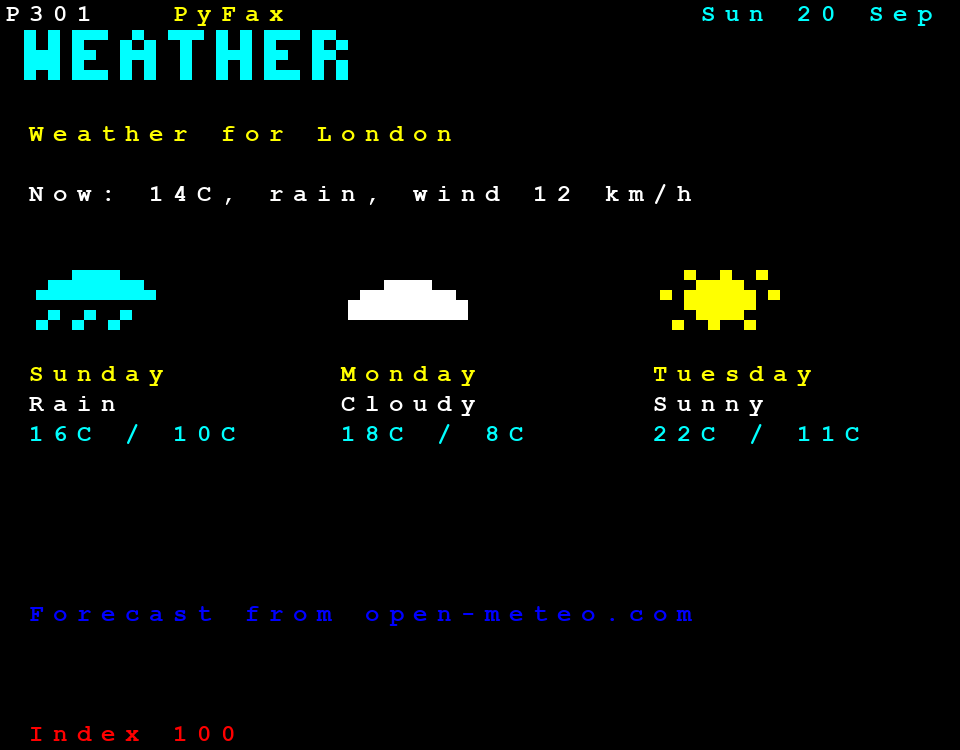
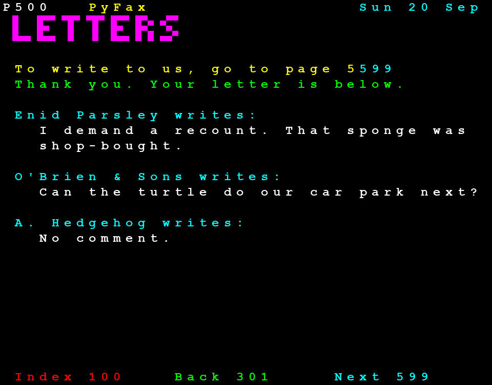

# Project 20 · PyFax Live

The real Ceefax had the football scores as the goals went in, and the weather as it changed. Your PyFax is a folder of files, and it says whatever it said on the day you built it. For a page to be different each time that somebody asks for it, there has to be a **program** on the other end of the request, which makes the page at that moment.



That's a web application, and this project is your first. PyFax gets a server, written with **Flask**. The weather page fetches a real forecast, from a real weather service, for wherever you live. There's a letters page, to which anybody can write in, through a form, and their letters are kept in a **database**. The pages, the templates and the block graphics are last project's, used as they stand.

Most of what's new here isn't really about Flask. It's about what changes when your program *stays running*, and talks to strangers: other people's data, other people's servers, things that fail, settings, and secrets.

| | |
|---|---|
| **You'll learn** | Flask: routes, templates, forms, blueprints, the application factory; `sqlite3`: SQL, placeholders, transactions; `httpx`, time-outs and failure; a generic cache; configuration, environment variables and secrets; redirect-after-post |
| **New tool skills** | Flask's test client and pytest fixtures; faking a web service; debugging Flask |
| **Time** | 6 to 7 hours |
| **Before you start** | [Project 19](p19-pyfax.md), whose package this one uses |

## Predict

!!! question "Predict"
    ```python
    from flask import Flask

    app = Flask(__name__)


    @app.get("/hello/<name>")
    def hello(name):
        return f"Hello, {name}!"


    client = app.test_client()
    print(client.get("/hello/Beeb").text)
    print(client.get("/goodbye").status_code, client.post("/hello/Beeb").status_code)
    ```

??? success "Answer"
    ```text
    Hello, Beeb!
    404 405
    ```

    That's a complete web application. `@app.get(…)` is a registering decorator, as `@command` was in Logo: it notes that this function answers this address, and hands the function back. The part in angle brackets is cut out of the address, and passed in as an argument. The *test client* makes requests to the application with no network, and no server running. 404 is "there's no such page", and 405 is "there is, but you may not do *that* to it". Stage 1.

!!! question "Predict"
    ```python
    import sqlite3

    db = sqlite3.connect(":memory:")
    db.execute("CREATE TABLE letters (name TEXT, message TEXT)")
    db.execute("INSERT INTO letters VALUES (?, ?)", ("O'Brien", "Hello"))
    for row in db.execute("SELECT name, length(message) FROM letters"):
        print(row)
    ```

??? success "Answer"
    ```text
    ("O'Brien", 5)
    ```

    SQLite is a complete database that lives in one file, or, as here, in memory, and it comes with Python. You talk to it in SQL. The two question marks are *placeholders*: the values travel beside the query, and never inside it, and so Mr O'Brien's apostrophe does no harm. It's Project 18's lesson, for the third time, and it's the bug hunt. Stage 4.

!!! question "Predict"
    ```python
    import sqlite3

    db = sqlite3.connect(":memory:")
    db.execute("CREATE TABLE t (n INTEGER NOT NULL)")
    try:
        with db:
            db.execute("INSERT INTO t VALUES (1)")
            db.execute("INSERT INTO t VALUES (NULL)")
    except sqlite3.IntegrityError as error:
        print("Failed:", error)
    print(db.execute("SELECT count(*) FROM t").fetchone())
    ```

??? success "Answer"
    ```text
    Failed: NOT NULL constraint failed: t.n
    (0,)
    ```

    The first insert was fine, and yet the table is empty. A connection is a context manager, and what it manages is a **transaction**: a group of changes which either all happen, or none of them do. The second insert failed, and so the first was undone. Nobody will ever see half a job. Stage 4.

!!! question "Predict"
    ```python
    import httpx


    def always_busy(request):
        return httpx.Response(503, text="Busy")


    client = httpx.Client(transport=httpx.MockTransport(always_busy))
    response = client.get("https://example.com/forecast")
    print(response.status_code, response.text)
    try:
        response.raise_for_status()
    except httpx.HTTPStatusError as error:
        print("Raised:", type(error).__name__)
    ```

??? success "Answer"
    ```text
    503 Busy
    Raised: HTTPStatusError
    ```

    `httpx` is a client for HTTP: it does what a browser does, from Python. There are two things to notice. A reply of "503, I'm busy" is **not an exception**. It's a perfectly good reply, and you have to ask for it to be treated as an error. And `MockTransport` lets a test stand in for the whole internet, with a function. Stage 3.

## Build

```console
$ cd making
$ uv init pyfax-live
$ cd pyfax-live
$ uv add flask httpx
$ uv add --editable ../pyfax
$ uv add --dev pytest ruff pyright
$ code .
```

Copy your `content` folder across from Project 19, without the weather article: page 301 is going to be alive.

Two pieces of housekeeping, both about types. First, create an empty file in **last** project, `pyfax/src/pyfax/py.typed`. That's how a package tells the world that its type hints are meant to be relied on. Without it, pyright in *this* project will refuse to believe a word that `pyfax` says, and complain of a missing "stub file". Second, in this project's `[tool.pyright]` table, ask for `typeCheckingMode = "standard"`, and not `strict`. Project 17 warned that strict mode is hard going in code that's mostly glue between big libraries, and a Flask application is exactly that. Try `strict`, by all means, and count the complaints that are about Flask's types and not about your code.

### Stage 1: Hello, Flask

Save this as `hello.py`, and then throw it away afterwards:

```python
from flask import Flask

app = Flask(__name__)


@app.get("/")
def index() -> str:
    return "<h1>Hello from Flask</h1>"


@app.get("/<int:number>.html")
def page(number: int) -> str:
    return f"<h1>This would be page {number}</h1>"
```

```console
$ uv run flask --app hello run --debug
 * Debug mode: on
WARNING: This is a development server. Do not use it in a production deployment.
 * Running on http://127.0.0.1:5000
```

Go to `http://127.0.0.1:5000/`, and then to `/101.html`, and `/banana.html`. Watch the terminal as you do.

A Flask application is a table of **routes**: patterns for addresses, and the function that answers each. A function that answers a request is called a **view**. It takes whatever the pattern cut out of the address, and returns the reply, which can be a string of HTML. `<int:number>` is a *converter*. It matches digits only, and hands them over as an `int`, which is why `/banana.html` is a 404, and your function never heard about it.

`@app.get` is "decorators in the wild", as Project 16 promised. It registers, and returns the function unchanged. There's an `@app.post` too, and `@app.route(…, methods=[…])` for both at once.

**`--debug`** does two things. It restarts the server whenever you save a file, and if a view raises an exception, it shows the traceback *in the browser*, with a console in which you can run Python at any level of it. Change `hello.py` while it's running, and reload the page.

!!! warning "Gotcha"
    That console in the browser will run any Python at all, for whoever can reach it. `--debug` is for your own machine, and **never** for a server that anybody else can see. The warning about "a development server" is a separate matter, and also true: `flask run` serves one request at a time, and hasn't been hardened. When you put an application on the internet, it's run by a production server, such as gunicorn or waitress, and the recap has a link.

### Stage 2: An application factory, and last project's pages

`app = Flask(__name__)` at the top of a module is fine for a toy. It has the fault that Project 9 found in global variables: there's exactly one, it's made at import, and every test would share it, with its database and its settings. The remedy is a function that *makes* an application, to order. Flask's documentation calls it the **application factory**, and `flask run` looks for a function called `create_app`.

Create `src/pyfax_live/__init__.py`:

<!-- listing: projects/20-pyfax-live/src/pyfax_live/__init__.py -->
```python title="src/pyfax_live/__init__.py"
"""PyFax with a server: live weather, and letters from readers."""

import logging
import secrets
from collections.abc import Mapping
from datetime import datetime
from pathlib import Path

import httpx
from flask import Flask
from jinja2 import ChoiceLoader, PackageLoader
from pyfax import Colour
from pyfax.build import classes
from pyfax.content import pages

from pyfax_live import db, letters, views, weather
from pyfax_live.cache import TimedCache
from pyfax_live.weather import Forecast, Place

log = logging.getLogger(__name__)

DEFAULTS = {
    "DATABASE": "pyfax.sqlite3",
    "CONTENT": "content",
    "PLACE": {"name": "London", "latitude": 51.5, "longitude": -0.12},
    "WEATHER_SECONDS": 600,
}


def create_app(config: Mapping[str, object] | None = None) -> Flask:
    """Make the application. Every test makes a new one, with settings of its own."""
    app = Flask(__name__)
    app.config.from_mapping(DEFAULTS)
    app.config.from_prefixed_env("PYFAX")
    if config:
        app.config.from_mapping(config)
    if not app.config.get("SECRET_KEY"):
        log.warning(
            "No PYFAX_SECRET_KEY is set. Making one up, until the next restart."
        )
        app.config["SECRET_KEY"] = secrets.token_hex()

    # Our own templates come first, and then the ones that belong to pyfax.
    loaders = [app.jinja_env.loader, PackageLoader("pyfax")]
    app.jinja_env.loader = ChoiceLoader([loader for loader in loaders if loader])
    app.jinja_env.filters["classes"] = classes

    today = datetime.now().astimezone().date()
    live = (weather.NUMBER, letters.NUMBER, letters.FORM)
    articles = pages(Path(app.config["CONTENT"]), today, others=live)
    index = articles[0]
    index.write(18, 1, "LIVE", Colour.MAGENTA)
    index.write(19, 1, "The weather, as it is now" + "." * 10, Colour.WHITE)
    index.write(19, 36, str(weather.NUMBER), Colour.CYAN, link=weather.NUMBER)
    index.write(20, 1, "Your letters" + "." * 23, Colour.WHITE)
    index.write(20, 36, str(letters.NUMBER), Colour.CYAN, link=letters.NUMBER)
    app.extensions["pyfax"] = views.Site(
        pages={page.number: page for page in articles},
        place=Place(**app.config["PLACE"]),
        forecasts=TimedCache[str, Forecast](app.config["WEATHER_SECONDS"]),
        client=app.config.get("HTTP_CLIENT") or httpx.Client(),
    )

    app.teardown_appcontext(db.close_db)
    with app.app_context():
        db.init_db()
    app.register_blueprint(views.bp)
    return app
```

Don't worry about the parts that mention weather, letters or the database. They're for later stages, and you can leave them out until you get there. Four things happen here that you can use at once.

**The settings** come from three places, and the later ones win: the `DEFAULTS`, then the environment, and then whatever was passed in, which is how a test gets a database of its own. Stage 6 comes back to this.

**The templates.** Flask looks for templates in a `templates` folder inside your package. You want it to look in `pyfax`'s as well, and a `ChoiceLoader` tries each of its loaders in turn. `classes` is last project's filter. Flask switches autoescaping on without being asked.

**The pages.** Last project's `pages` function reads the articles, and lays them out. It's called once, as the application starts. `others=live` tells it that pages 301, 500 and 599 are going to exist, though it isn't making them, so that "see 301" in an article becomes a link. A few more lines write a LIVE section on to the index.

**`app.extensions["pyfax"]`** is somewhere to keep things that belong to *this* application: the pages, the place, the cache of forecasts, and the HTTP client. Each application that `create_app` makes has its own. Nothing is global.

The routes are in a **blueprint**. A factory has a problem: `@app.get` needs an `app`, and at the top of a module there isn't one yet. A `Blueprint` is a table of routes that isn't attached to anything. You decorate your views with `@bp.get`, and the factory attaches the lot with `register_blueprint`.

Create `src/pyfax_live/views.py`. Here's the first part:

<!-- listing: projects/20-pyfax-live/src/pyfax_live/views.py -->
```python title="src/pyfax_live/views.py"
"""The addresses that the site answers to, and what it does for each."""

import logging
from dataclasses import dataclass
from datetime import date, datetime
from importlib.resources import files

import httpx
from flask import (
    Blueprint,
    Response,
    abort,
    current_app,
    flash,
    get_flashed_messages,
    redirect,
    render_template,
    request,
    url_for,
)
from pyfax import Colour, Page
from pyfax.build import stylesheet
from werkzeug.wrappers import Response as Redirect

from pyfax_live import db, letters, weather
from pyfax_live.cache import TimedCache

log = logging.getLogger(__name__)
bp = Blueprint("pyfax", __name__)


@dataclass
class Site:
    """What the application keeps from one request to the next."""

    pages: dict[int, Page]
    place: weather.Place
    forecasts: TimedCache[str, weather.Forecast]
    client: httpx.Client


def site() -> Site:
    return current_app.extensions["pyfax"]


def today() -> date:
    return datetime.now().astimezone().date()
# ...
@bp.get("/")
def home() -> Redirect:
    return redirect(url_for("pyfax.show", number=100))


@bp.get("/<int:number>.html")
def show(number: int) -> str:
    if number == weather.NUMBER:
        page = weather.page(site().place, forecast(), today())
    elif number == letters.NUMBER:
        notice = " ".join(str(message) for message in get_flashed_messages())
        page = letters.page(db.latest_letters(10), today(), notice)
    elif number in site().pages:
        page = site().pages[number]
    else:
        abort(404)
    return render_template("page.html", page=page)
# ...
@bp.get("/style.css")
def style() -> Response:
    return Response(stylesheet(), mimetype="text/css")


@bp.get("/pyfax.js")
def script() -> Response:
    text = (files("pyfax") / "static" / "pyfax.js").read_text(encoding="utf-8")
    return Response(text, mimetype="text/javascript")


@bp.app_errorhandler(404)
def not_found(error: Exception) -> tuple[str, int]:
    lost = Page(404, "No such page")
    lost.write(12, 8, "There's no such page.", Colour.YELLOW)
    lost.write(14, 8, "Try the index: 100", Colour.CYAN, link=100)
    return render_template("page.html", page=lost), 404
```

**`current_app`** is "whichever application is handling this request". A view can't import `app`, since there isn't one to import, and `current_app` is Flask's answer. `site()` fetches the `Site` from it.

**`show`** is the whole of the static site, in eight lines. It finds the page and hands it to last project's `page.html`. `render_template` is Jinja's `render`, with Flask's environment. **`abort(404)`** raises an exception that Flask turns into a reply, and `app_errorhandler(404)` says what that reply looks like: a teletext page, naturally, with a status of 404. A view can return a pair, of a body and a status.

The route is **`/<int:number>.html`**, with the `.html` on the end, though nothing here is a file. That's so that last project's links, and its script, work without being changed. An address is a name, and it needn't say how the page was made.

**`url_for("pyfax.show", number=100)`** builds an address from the name of a view, which is its blueprint's name, a dot, and the function's. Never type your own site's addresses as strings. If you change a route, `url_for` follows, and a string doesn't.

The stylesheet was a file, and is now a route, which calls `stylesheet()` and says that it's `text/css`.

#### Testing it

Create `tests/conftest.py`:

<!-- listing: projects/20-pyfax-live/tests/conftest.py -->
```python title="tests/conftest.py"
import json
from pathlib import Path

import httpx
import pytest
from flask import Flask
from flask.testing import FlaskClient

from pyfax_live import create_app

HERE = Path(__file__).parent
LONDON = json.loads((HERE / "london.json").read_text(encoding="utf-8"))


class FakeWeather:
    """Stands in for Open-Meteo. It counts the requests, and can be told to break."""

    def __init__(self) -> None:
        self.requests: list[httpx.Request] = []
        self.working = True

    def __call__(self, request: httpx.Request) -> httpx.Response:
        self.requests.append(request)
        if not self.working:
            return httpx.Response(503, text="Service unavailable")
        return httpx.Response(200, json=LONDON)


@pytest.fixture
def weather() -> FakeWeather:
    return FakeWeather()


@pytest.fixture
def app(tmp_path: Path, weather: FakeWeather) -> Flask:
    return create_app(
        {
            "TESTING": True,
            "SECRET_KEY": "only for tests",
            "DATABASE": str(tmp_path / "test.sqlite3"),
            "CONTENT": str(HERE.parent / "content"),
            "HTTP_CLIENT": httpx.Client(transport=httpx.MockTransport(weather)),
        }
    )


@pytest.fixture
def client(app: Flask) -> FlaskClient:
    return app.test_client()
```

Here's the payoff of the factory. **Every test gets a brand-new application**, with a database in a temporary folder, and a weather service that isn't the real one. `client` is a fixture that *uses* the `app` fixture, which uses `weather` and `tmp_path`: pytest works out the chain. (`FakeWeather` is for Stage 3.)

The tests read as a visitor's progress. `tests/test_site.py`:

<!-- listing: projects/20-pyfax-live/tests/test_site.py -->
```python title="tests/test_site.py"
def test_the_front_door_leads_to_the_index(client: FlaskClient):
    response = client.get("/")
    assert response.status_code == 302
    assert response.headers["Location"] == "/100.html"
    index = client.get("/100.html")
    assert index.status_code == 200
    assert "Hedgehog wins village bake-off" in text_of(index.text)


def test_articles_are_pages_as_they_were(client: FlaskClient):
    page = client.get("/101.html")
    assert "fair's fair & it was a lovely sponge" in " ".join(
        text_of(page.text).split()
    )
    assert 'href="301.html"' in page.text


def test_a_page_that_is_not_there(client: FlaskClient):
    response = client.get("/777.html")
    assert response.status_code == 404
    assert "There's no such page." in text_of(response.text)
    assert client.get("/nonsense").status_code == 404
```

`text_of`, at the top of that file, picks the text out of the grid of cells, a row to a line, so that tests can look for words.

!!! example "Run it"
    ```console
    $ uv run flask --app pyfax_live run --debug
    ```

    It's last project's site, and every page of it was made at the moment you asked. Edit an article, and reload. (The reloader watches Python files, and so you may have to save one of those to see a change to a TOML file.)

!!! success "Checkpoint"
    ```console
    $ git add .
    $ git commit -m "Serve the PyFax pages with Flask, from an application factory"
    ```

### Stage 3: The weather, from somebody else's computer

[Open-Meteo](https://open-meteo.com/) is a weather service with a free **API**: an address that returns data for programs, and not pages for people. It wants no account, and no key. Try it in a browser:

```text
https://api.open-meteo.com/v1/forecast?latitude=51.5&longitude=-0.12&current=temperature_2m,weather_code
```

What comes back is JSON, as in Project 5. The part of the address after the `?` is the *query string*, which is how a request carries its parameters.

Your program is about to depend on a computer that you don't control, over a network that you don't control. **Everything that can go wrong will, sooner or later**: the service will be down, or slow, or will change the shape of its reply. A program that stays running has to expect all three, and carry on. Create `src/pyfax_live/weather.py`. It begins with five small pictures, a sun, a cloud, rain, snow and a storm, each twelve pixels by six, which you can draw yourself, or copy from the repository. Then:

<!-- listing: projects/20-pyfax-live/src/pyfax_live/weather.py -->
```python title="src/pyfax_live/weather.py"
class WeatherError(Exception):
    """The forecast couldn't be fetched, or made no sense when it arrived."""


@dataclass(frozen=True, slots=True)
class Place:
    name: str
    latitude: float
    longitude: float


@dataclass(frozen=True, slots=True)
class Day:
    day: date
    code: int
    high: float
    low: float


@dataclass(frozen=True, slots=True)
class Forecast:
    temperature: float
    wind: float
    code: int
    days: tuple[Day, ...]


def describe(code: int) -> tuple[str, list[str], Colour]:
    """Turn one of the World Meteorological Organization's codes into words and a picture."""
    match code:
        case 0 | 1:
            return "Sunny", SUN, Colour.YELLOW
        case 2 | 3:
            return "Cloudy", CLOUD, Colour.WHITE
        case 45 | 48:
            return "Foggy", CLOUD, Colour.WHITE
        case 71 | 73 | 75 | 77 | 85 | 86:
            return "Snow", SNOW, Colour.WHITE
        case 95 | 96 | 99:
            return "Thunder", STORM, Colour.YELLOW
        case _ if 51 <= code <= 82:
            return "Rain", RAIN, Colour.CYAN
        case _:
            return "Who knows", CLOUD, Colour.MAGENTA


def parse(data: Any) -> Forecast:
    """Pick what we want out of Open-Meteo's reply, and check that it's all there."""
    match data:
        case {
            "current": {
                "temperature_2m": float() | int() as temperature,
                "wind_speed_10m": float() | int() as wind,
                "weather_code": int(code),
            },
            "daily": {
                "time": [*days],
                "weather_code": [*codes],
                "temperature_2m_max": [*highs],
                "temperature_2m_min": [*lows],
            },
        }:
            pass
        case _:
            raise WeatherError("The forecast wasn't in the shape that was expected")
    try:
        forecast = tuple(
            Day(date.fromisoformat(day), int(code), float(high), float(low))
            for day, code, high, low in zip(days, codes, highs, lows, strict=True)
        )
    except (TypeError, ValueError) as error:
        raise WeatherError(f"The forecast had something odd in it: {error}") from error
    return Forecast(float(temperature), float(wind), code, forecast)


def fetch(place: Place, client: httpx.Client) -> Forecast:
    """Ask Open-Meteo for the weather at a place."""
    wanted = {
        "latitude": place.latitude,
        "longitude": place.longitude,
        "current": "temperature_2m,weather_code,wind_speed_10m",
        "daily": "weather_code,temperature_2m_max,temperature_2m_min",
        "timezone": "auto",
        "forecast_days": 3,
    }
    try:
        response = client.get(URL, params=wanted, timeout=5)
        response.raise_for_status()
        return parse(response.json())
    except (httpx.HTTPError, ValueError) as error:
        raise WeatherError(f"Couldn't fetch the forecast: {error}") from error


def page(place: Place, forecast: Forecast | None, today: date) -> Page:
    """Make the weather page. With no forecast, it says so, and is still a page."""
    sheet = Page(NUMBER, f"Weather for {place.name}", "weather")
    frame(sheet, today, "weather", Colour.CYAN)
    sheet.write(4, 1, f"Weather for {place.name}", Colour.YELLOW)
    if forecast is None:
        sheet.write(8, 1, "There's no forecast at the moment.", Colour.WHITE)
        sheet.write(10, 1, "Try looking out of the window.", Colour.CYAN)
        return sheet

    words, _picture, _colour = describe(forecast.code)
    now = f"Now: {forecast.temperature:.0f}C, {words.lower()}, wind {forecast.wind:.0f} km/h"
    sheet.write(6, 1, now, Colour.WHITE)
    for number, day in enumerate(forecast.days):
        column = 1 + number * 13
        words, picture, colour = describe(day.code)
        sheet.picture(9, column, picture, colour)
        sheet.write(12, column, f"{day.day:%A}"[:12], Colour.YELLOW)
        sheet.write(13, column, words, Colour.WHITE)
        sheet.write(14, column, f"{day.high:.0f}C / {day.low:.0f}C", Colour.CYAN)
    sheet.write(20, 1, "Forecast from open-meteo.com", Colour.BLUE)
    return sheet
```

**`fetch`** is five lines, and four of them are about failure.

- **`timeout=5`**. Without a time-out, a request to a server that's stopped answering will wait *for ever*, and so will your visitor, and so, in the end, will every visitor, as each request ties up a worker that never comes back. **Every network call needs a time-out.** httpx gives you five seconds if you don't say, which is one of the reasons for preferring it, and it's still worth saying.
- **`raise_for_status()`** turns a 404 or a 503 into an exception. That was the fourth Predict.
- **`params=`** builds the query string, and escapes it. Don't build addresses with f-strings, for the reason that you don't build anything else with them.
- **`except (httpx.HTTPError, ValueError)`** catches everything that httpx raises, and JSON that isn't JSON. It all becomes one `WeatherError`, so that callers have one thing to think about.

**`parse`** uses `match` on the JSON, as Project 14 did on TOML. It picks out what's wanted, checks the types, and captures the values, in one pattern, which is nested two deep. If the service ever changes the shape of its reply, you'll hear about it as a `WeatherError` with a clear message, and not as a `KeyError` from somewhere inside a template.

**`page`** draws the forecast, with last project's `Page`. It takes `forecast: Forecast | None`, and with `None`, it still makes a page, which says so. **A failure somewhere else has become a sentence on a page, and not a crash.**

#### Don't ask too often

A forecast doesn't change from one second to the next, and it would be rude, as well as slow, to ask Open-Meteo again for every visitor. The answer should be remembered for ten minutes. Project 7's `functools.cache` remembers *for ever*, which is wrong for weather. Create `src/pyfax_live/cache.py`:

<!-- listing: projects/20-pyfax-live/src/pyfax_live/cache.py -->
```python title="src/pyfax_live/cache.py"
"""Remembering an answer for a while, so as not to ask for it too often."""

import logging
import time
from collections.abc import Callable

log = logging.getLogger(__name__)


class TimedCache[K, V]:
    """Keep each value for so many seconds. After that, the next caller fetches a new one.

    If the fetching fails, and there's an old value to hand, the old value is
    served, since a forecast that's an hour old is better than none.
    """

    def __init__(
        self, seconds: float, clock: Callable[[], float] = time.monotonic
    ) -> None:
        self.seconds = seconds
        self.clock = clock
        self.kept: dict[K, tuple[float, V]] = {}

    def get(self, key: K, fetch: Callable[[], V]) -> V:
        now = self.clock()
        if key in self.kept:
            when, value = self.kept[key]
            if now - when < self.seconds:
                return value
        try:
            value = fetch()
        except Exception:
            if key not in self.kept:
                raise
            log.warning("Couldn't fetch %s. Serving the old one.", key, exc_info=True)
            return self.kept[key][1]
        self.kept[key] = (now, value)
        return value
```

It's a generic class, with two type parameters, as Project 17's `Peekable` had one: a `TimedCache[str, Forecast]` maps strings to forecasts.

It does one thing that a plain cache doesn't. If the value is stale, and fetching a new one **fails**, it serves the old one, and logs a warning, with the traceback, which is what `exc_info=True` adds. An hour-old forecast is much better than none. That one decision is the difference between a site that falls over whenever its supplier has a bad minute, and one whose visitors never notice.

The clock is a parameter, with `time.monotonic` as its default, so that a test can supply a clock of its own, and needn't wait ten minutes. `monotonic` is a clock that only ever goes forwards. It doesn't care about summer time, or about somebody correcting the computer's clock, and so it's the right one for measuring intervals.

The cache belongs to the application, and not to the module, for Stage 2's reason: a global cache would leak from one test into the next.

Add the glue to `views.py`, above `home`:

<!-- listing: projects/20-pyfax-live/src/pyfax_live/views.py -->
```python title="src/pyfax_live/views.py"
def forecast() -> weather.Forecast | None:
    """Return the forecast, which may be a few minutes old, or None if there isn't one."""
    here = site()
    try:
        return here.forecasts.get(
            here.place.name, lambda: weather.fetch(here.place, here.client)
        )
    except weather.WeatherError:
        log.exception("No forecast")
        return None
```

`log.exception` was Project 15's. The visitor gets a polite page, and you get the traceback in the log.

#### Faking the internet

Tests mustn't use the network. They'd be slow, they'd fail on a train, and they'd fail whenever Open-Meteo did. `conftest.py`'s `FakeWeather` stands in for it. An `httpx.Client` can be given a **transport**, which is the part that really sends the request, and `MockTransport` is a transport that calls a function of yours. The factory takes `HTTP_CLIENT` from its settings, and that's how the fake gets in. The application never knows.

This is *dependency injection*: the thing that a piece of code depends on is handed to it, and not made inside it. You did it in Project 9, with `random.Random`, and in Project 17, with the `Console`.

The reply that it gives is a real one, saved from the real service into `tests/london.json`. Get one of your own:

```console
$ curl "https://api.open-meteo.com/v1/forecast?latitude=51.5&longitude=-0.12&current=temperature_2m,weather_code,wind_speed_10m&daily=weather_code,temperature_2m_max,temperature_2m_min&timezone=auto&forecast_days=3" > tests/london.json
```

<!-- listing: projects/20-pyfax-live/tests/test_site.py -->
```python title="tests/test_site.py"
def test_the_weather_is_live(client: FlaskClient, weather: FakeWeather):
    page = text_of(client.get("/301.html").text)
    assert "Weather for London" in page
    assert "Now: 14C, rain, wind 12 km/h" in page
    assert "Sunday       Monday       Tuesday" in page
    assert "Rain         Cloudy       Sunny" in page
    assert "16C / 10C    18C / 8C     22C / 11C" in page
    (request,) = weather.requests
    assert request.url.params["latitude"] == "51.5"


def test_the_forecast_is_only_fetched_now_and_then(
    client: FlaskClient, weather: FakeWeather
):
    for _ in range(5):
        client.get("/301.html")
    assert len(weather.requests) == 1


def test_when_the_weather_service_is_down_the_page_still_works(
    client: FlaskClient, weather: FakeWeather
):
    weather.working = False
    response = client.get("/301.html")
    assert response.status_code == 200
    assert "There's no forecast at the moment." in text_of(response.text)
```

Five visits, and one request. And with the service switched off, there's still a page, with a 200.

!!! example "Run it"
    Go to page 301. That's the real weather, where `PLACE` says you are. Change it to where you really are: Stage 6 shows how, without editing the code. Then turn off your Wi-Fi, wait for the cache to expire, or restart, and look again.

!!! success "Checkpoint"
    ```console
    $ git add .
    $ git commit -m "Add a live weather page, with a cache that survives failures"
    ```

### Stage 4: A database

Letters from readers have to be kept somewhere that outlives the program. You've kept things in JSON and TOML files. That stops being good enough when two requests arrive at once, and both try to rewrite the file. Keeping data safe while several things change it is what a **database** is for, and one comes with Python.

**SQLite** is a complete SQL database in a single file, with no server to install. It's in your phone, your browser, and most of the software that you own, and it's said to be the most widely deployed database there is. You talk to it in **SQL**, which is a language for describing data, and asking for it. Create `src/pyfax_live/schema.sql`:

<!-- listing: projects/20-pyfax-live/src/pyfax_live/schema.sql -->
```sql title="src/pyfax_live/schema.sql"
CREATE TABLE IF NOT EXISTS letters (
    id INTEGER PRIMARY KEY,
    name TEXT NOT NULL,
    message TEXT NOT NULL,
    written TEXT NOT NULL DEFAULT CURRENT_TIMESTAMP
);
```

A **table** has named columns, with types, and **rows**. `PRIMARY KEY` marks the column that identifies a row, and SQLite numbers it for you. `NOT NULL` is a rule that the database itself will enforce, whatever your Python does: a letter with no name can't be stored. `IF NOT EXISTS` makes the script safe to run every time the application starts.

You need four statements of SQL for this chapter, and here are three of them:

```sql
INSERT INTO letters (name, message) VALUES ('Enid', 'More hedgehogs, please.');
SELECT name, message FROM letters WHERE name = 'Enid' ORDER BY id DESC LIMIT 10;
DELETE FROM letters WHERE id = 3;
```

Create `src/pyfax_live/db.py`:

<!-- listing: projects/20-pyfax-live/src/pyfax_live/db.py -->
```python title="src/pyfax_live/db.py"
"""The database: readers' letters, kept in SQLite."""

import sqlite3
from dataclasses import dataclass
from importlib.resources import files

from flask import current_app, g


@dataclass(frozen=True, slots=True)
class Letter:
    name: str
    message: str
    written: str


def get_db() -> sqlite3.Connection:
    """Return this request's connection to the database, opening it if need be."""
    if "db" not in g:
        g.db = sqlite3.connect(current_app.config["DATABASE"])
        g.db.row_factory = sqlite3.Row
    return g.db


def close_db(error: BaseException | None = None) -> None:
    """Close the connection, if this request ever opened one."""
    db: sqlite3.Connection | None = g.pop("db", None)
    if db is not None:
        db.close()


def init_db() -> None:
    """Make the tables, if they aren't there already."""
    schema = (files("pyfax_live") / "schema.sql").read_text(encoding="utf-8")
    db = get_db()
    db.executescript(schema)


def add_letter(name: str, message: str) -> None:
    db = get_db()
    with db:
        db.execute("INSERT INTO letters (name, message) VALUES (?, ?)", (name, message))


def latest_letters(limit: int) -> list[Letter]:
    rows = get_db().execute(
        "SELECT name, message, written FROM letters ORDER BY id DESC LIMIT ?", (limit,)
    )
    return [Letter(row["name"], row["message"], row["written"]) for row in rows]
```

**`?` placeholders**, always. `add_letter` hands SQLite a query with two question marks in it, and, separately, a tuple of two values. The values are never pasted into the SQL, and so nothing in them can be mistaken for SQL. That was the second Predict. A query built with an f-string is the most famous security hole in computing, and it's the bug hunt.

**`with db:`** is a transaction, from the third Predict: commit if the block succeeds, and roll back if it raises.

!!! warning "Gotcha"
    `with db:` doesn't *begin* a transaction. It *ends* whichever one is open, and `sqlite3` quietly opens one for you at the first `INSERT`, `UPDATE` or `DELETE` that you run. So if you've made some changes outside any `with`, and haven't committed them, they're part of the same transaction, and a later failure will roll them back too. It caught this chapter's author, while the third Predict was being written. The rule that keeps you out of trouble is: **every write goes inside a `with db:`.**

**`sqlite3.Row`**, as the `row_factory`, makes each row behave like a dictionary as well as a tuple, and so you can write `row["name"]`. `latest_letters` turns rows into `Letter` dataclasses as they leave, so that nothing else in the program has to know that there's a database.

**`g`** is Flask's scratch pad for *one request*. The first call of `get_db` in a request opens a connection, and keeps it in `g`. Later calls in the same request get the same one. `teardown_appcontext(close_db)`, back in the factory, makes sure that it's closed when the request is over, whatever happened. A connection for each request is the usual design, and it sidesteps the question of what happens when two requests share one.

Now the page. Create `src/pyfax_live/letters.py`:

<!-- listing: projects/20-pyfax-live/src/pyfax_live/letters.py -->
```python title="src/pyfax_live/letters.py"
"""The letters pages: what readers have written, and the rules for writing in."""

import textwrap
from datetime import date

from pyfax import COLUMNS, Colour, Page
from pyfax.content import frame

from pyfax_live.db import Letter

NUMBER = 500
FORM = 599
LONGEST_NAME = 20
LONGEST_MESSAGE = 200


def check(name: str, message: str) -> list[str]:
    """Return what's wrong with a letter, as a list of complaints. None is good news."""
    problems: list[str] = []
    if not name:
        problems.append("Please say who you are.")
    elif len(name) > LONGEST_NAME:
        problems.append(f"That name is too long: {LONGEST_NAME} letters at most.")
    if not message:
        problems.append("Your letter is empty.")
    elif len(message) > LONGEST_MESSAGE:
        problems.append(f"Too long: {LONGEST_MESSAGE} letters at most.")
    if not (name + message).isprintable():
        problems.append("There's something in there that can't be printed.")
    return problems


def page(letters: list[Letter], today: date, notice: str = "") -> Page:
    """Make page 500, with as many of the latest letters as there's room for."""
    sheet = Page(NUMBER, "Your letters", "letters", before=301, after=FORM)
    frame(sheet, today, "letters", Colour.MAGENTA)
    sheet.write(4, 1, f"To write to us, go to page {FORM}", Colour.YELLOW)
    sheet.write(4, 29, str(FORM), Colour.CYAN, link=FORM)
    if notice:
        sheet.write(5, 1, notice[: COLUMNS - 2], Colour.GREEN)

    row = 7
    for letter in letters:
        lines = textwrap.wrap(letter.message, COLUMNS - 4)
        if row + len(lines) + 1 > 22:
            break
        sheet.write(row, 1, f"{letter.name} writes:", Colour.CYAN)
        for offset, line in enumerate(lines, start=1):
            sheet.write(row + offset, 3, line, Colour.WHITE)
        row += len(lines) + 2
    if not letters:
        sheet.write(row, 1, "Nobody has written in yet.", Colour.WHITE)
    return sheet
```

The database functions can be tested with no web at all, given an *application context*, which is what `current_app` and `g` need in order to mean anything. `tests/test_letters.py`:

<!-- listing: projects/20-pyfax-live/tests/test_letters.py -->
```python title="tests/test_letters.py"
def test_the_database_layer_by_itself(app: Flask):
    with app.app_context():
        db.add_letter("Ada", "One")
        db.add_letter("Bob", "Two")
        assert [letter.name for letter in db.latest_letters(10)] == ["Bob", "Ada"]
        assert [letter.name for letter in db.latest_letters(1)] == ["Bob"]


def test_a_transaction_that_fails_leaves_nothing_behind(app: Flask):
    with app.app_context():
        connection = db.get_db()
        with pytest.raises(sqlite3.IntegrityError), connection:
            connection.execute(
                "INSERT INTO letters (name, message) VALUES ('Ada', 'One')"
            )
            connection.execute(
                "INSERT INTO letters (name, message) VALUES (NULL, 'Two')"
            )
        assert db.latest_letters(10) == []
```

!!! success "Checkpoint"
    ```console
    $ git add .
    $ git commit -m "Keep readers' letters in SQLite"
    ```

### Stage 5: A form

A form is how a browser sends you data. Make a folder, `src/pyfax_live/templates`, and save this as `write.html`:

<!-- listing: projects/20-pyfax-live/src/pyfax_live/templates/write.html -->
```html title="src/pyfax_live/templates/write.html"


599 Write to us - PyFax


<style>
  form { font: bold 1.2rem "Courier New", monospace; color: #fff; background: #000;
         padding: 2rem; margin-top: 2rem; width: min(90vw, 34rem); }
  h1 { color: #ff0; font-size: 1.4rem; margin-top: 0; }
  label { display: block; color: #0ff; margin-top: 1rem; }
  input, textarea { width: 100%; box-sizing: border-box; font: inherit;
                    color: #fff; background: #00f; border: 0; padding: 0.4rem; }
  button { font: inherit; margin-top: 1rem; padding: 0.4rem 1rem; border: 0;
           color: #000; background: #0f0; cursor: pointer; }
  .problem { color: #f00; }
  a { color: #0ff; }
</style>



<form method="post">
  <h1>P599 Write to PyFax</h1>
  
    <p class="problem">{{ problem }}</p>
  
  <label for="name">Your name</label>
  <input id="name" name="name" maxlength="20" value="{{ name }}" required>
  <label for="message">Your letter, in 200 letters or fewer</label>
  <textarea id="message" name="message" rows="5" maxlength="200" required>{{ message }}</textarea>
  <button type="submit">Send</button>
  <p><a href="500.html">Back to the letters: 500</a></p>
</form>



```

It extends last project's `base.html`, fills in the `head` block with some styles of its own, and empties the `scripts` block, since a script that goes to a new page whenever three digits are typed is the last thing that a form wants.

`<form method="post">` sends its fields back to the address that it came from, as a **POST** request. GET is for *fetching* things, and should never change anything. POST is for *changing* things. Each `<input>` has a `name`, and that's the key that your view will look it up by.

Add the view to `views.py`, after `show`:

<!-- listing: projects/20-pyfax-live/src/pyfax_live/views.py -->
```python title="src/pyfax_live/views.py"
@bp.route(f"/{letters.FORM}.html", methods=["GET", "POST"])
def write() -> str | Redirect | tuple[str, int]:
    if request.method == "GET":
        return render_template("write.html", problems=[], name="", message="")

    name = request.form.get("name", "").strip()
    message = " ".join(request.form.get("message", "").split())
    problems = letters.check(name, message)
    if problems:
        form = render_template(
            "write.html", problems=problems, name=name, message=message
        )
        return form, 400
    db.add_letter(name, message)
    log.info("A letter from %s", name)
    flash("Thank you. Your letter is below.")
    return redirect(url_for("pyfax.show", number=letters.NUMBER))
```

One address answers both methods. A GET shows the empty form. A POST reads `request.form`, which is a dictionary of what was typed, tidies it, checks it, and then does one of two things.

**If it's wrong, the form goes back, with the complaints, and with what they typed still in it**, and a status of 400, "bad request". Nothing is more maddening than a form that empties itself because you made a slip. `{{ message }}` in the template is escaped, as always, and there's a test for it, with fish and chips.

**If it's right, the letter is stored, and the reply is a redirect.** This matters. If a POST replies with a page, and the visitor then reloads that page, the browser sends the POST *again*, and the letter is stored twice. If the POST replies "go and look at page 500", the browser does a GET, and reloading is harmless. It's called *post, redirect, get*, and every form that changes something should work this way.

**`flash`** carries a message across the redirect. It's stored in the visitor's *session*, which is a cookie, and the next page collects it with `get_flashed_messages()`, after which it's gone. Flask *signs* that cookie, so that nobody can forge one, and the signature needs a secret. That's what `SECRET_KEY` is for, and Stage 6 is about where it comes from.

!!! warning "Gotcha"
    `maxlength="20"` and `required`, in the HTML, are a courtesy to honest visitors, and they're no protection whatever. Anybody can send your server any POST that they like, with `curl`, or with two lines of httpx. **Everything that arrives from a browser has to be checked on the server**, and `letters.check` is where. Its tests send letters that no browser would allow.

<!-- listing: projects/20-pyfax-live/tests/test_letters.py -->
```python title="tests/test_letters.py"
def test_writing_in(client: FlaskClient):
    sent = client.post(
        "/599.html", data={"name": "Enid", "message": "More  hedgehogs,\nplease."}
    )
    assert sent.status_code == 302
    assert sent.headers["Location"] == "/500.html"

    page = text_of(client.get("/500.html").text)
    assert "Thank you. Your letter is below." in page
    assert "Enid writes:" in page
    assert "More hedgehogs, please." in page
    assert "Thank you" not in text_of(client.get("/500.html").text)
# ...
def test_awkward_customers(client: FlaskClient):
    message = "Robert'); DROP TABLE letters;-- <script>alert(1)</script>"
    client.post("/599.html", data={"name": "O'Brien & Sons", "message": message})
    html = client.get("/500.html").text
    assert "<script>alert" not in html
    assert "O'Brien & Sons writes:" in text_of(html)
    assert "DROP TABLE letters;--" in " ".join(text_of(html).split())
```

`test_awkward_customers` sends a name with an apostrophe and an ampersand in it, and a message that's an attack on the database *and* on the page. The placeholders see off the first, the autoescaping sees off the second, and the letter appears exactly as it was written. If you've followed the rules, hostile input is just text.

!!! example "Run it"
    Go to page 500, and then to 599, and write in. Try an empty letter. Try reloading after you've sent one. Then have a look at the database itself, which is one file:

    ```console
    $ uv run python -m sqlite3 pyfax.sqlite3 "SELECT * FROM letters"
    ```

    (From Python 3.12, the `sqlite3` module can be run as a command, which saves installing SQLite's own.)

    

    Add `*.sqlite3` to your `.gitignore`. A database is data, and doesn't belong in Git.

!!! success "Checkpoint"
    ```console
    $ git add .
    $ git commit -m "Add a form for writing in, with checks, and redirect after post"
    ```

### Stage 6: Settings, and secrets

Where you are, what the database is called, and how long to keep a forecast aren't part of the program. They're **configuration**, and they differ between your laptop, your tests, and a server. The factory reads them from three places.

1. **`DEFAULTS`**, in the code: sensible values for working on your own machine.
2. **The environment.** `from_prefixed_env("PYFAX")` looks at every environment variable whose name begins `PYFAX_`, and takes the rest of the name as a setting. It reads the values as JSON where it can, so numbers come out as numbers, and a place can be a dictionary.
3. **What was passed to `create_app`**, which is how the tests get theirs.

=== "macOS and Linux"

    ```console
    $ export PYFAX_PLACE='{"name": "Edinburgh", "latitude": 55.95, "longitude": -3.19}'
    $ export PYFAX_WEATHER_SECONDS=60
    $ uv run flask --app pyfax_live run
    ```

=== "Windows"

    ```console
    > $env:PYFAX_PLACE = '{"name": "Edinburgh", "latitude": 55.95, "longitude": -3.19}'
    > $env:PYFAX_WEATHER_SECONDS = 60
    > uv run flask --app pyfax_live run
    ```

Environment variables are how nearly every hosting service expects an application to be configured. The code is the same everywhere, and the environment is what differs.

**The `SECRET_KEY` is different in kind.** Anybody who knows it can forge a session cookie, and with it, in a bigger application, log in as anybody else. So:

- **It never goes in the code, and it never goes in Git.** Not for a moment, and not in a private repository. Git forgets nothing, and repositories have a way of becoming public.
- It's long, and random. `secrets` is the standard library's module for randomness that has to be unguessable, which `random` isn't:

    ```console
    $ uv run python -c "import secrets; print(secrets.token_hex())"
    ```

- It comes from the environment, as `PYFAX_SECRET_KEY`.
- If there isn't one, the factory makes one up, and says so in the log. That's fine for your own machine. It means that everybody's session is forgotten whenever the server restarts.

Keeping a project's environment variables in a file, which Git is told to ignore, is next project's tool skill.

### Stage 7: Debugging Flask

You've met two of the three tools already: `--debug`, with its traceback in the browser, and `logging`. Flask sets up a logger of its own, and the loggers that you've made with `getLogger(__name__)` join in. With `--debug`, you'll see `INFO` and above.

The third is VS Code's debugger. A breakpoint in a view stops the program *in the middle of a request*, with the browser waiting, and everything about the request there to be looked at. Create `.vscode/launch.json`:

<!-- listing: projects/20-pyfax-live/.vscode/launch.json -->
```json title=".vscode/launch.json"
{
    "version": "0.2.0",
    "configurations": [
        {
            "name": "PyFax Live",
            "type": "debugpy",
            "request": "launch",
            "module": "flask",
            "args": ["--app", "pyfax_live", "run", "--no-debugger", "--no-reload"],
            "jinja": true
        }
    ]
}
```

It runs Flask as a module, as Project 15 ran your editor. `--no-debugger` and `--no-reload` switch off Flask's own debugger and its reloader, which would otherwise fight with VS Code's. `"jinja": true` lets you put breakpoints **in templates**.

Put a breakpoint on the first line of `write`. Press ++f5++, send a letter from the browser, and have a look at `request.form` in the **Variables** panel. Step through the checks. In the **Debug Console**, try `request.headers`, and `session`. Then put a breakpoint inside the `` in `write.html`, and send a letter with no name.

!!! success "Checkpoint"
    ```console
    $ uv run pyright
    $ git add .
    $ git commit -m "Add a launch configuration for debugging Flask"
    $ git push
    ```

## Type-in listing

Here's a web application in thirty lines, that serves one thing: an SVG clock, drawn at the moment it was asked for, which asks the browser to fetch it again a second later. Save it as `clock.py`, and run it with `uv run flask --app clock run`.

<!-- listing: projects/20-pyfax-live/clock.py -->
```python title="clock.py" linenums="1"
import math
from datetime import datetime

from flask import Flask, Response

app = Flask(__name__)


def hand(turn: float, length: float, width: float, colour: str = "white") -> str:
    """Return a line from the middle, where `turn` is 0 at twelve and 0.5 at six."""
    x = 100 + length * math.sin(turn * math.tau)
    y = 100 - length * math.cos(turn * math.tau)
    return (
        f'<line x1="100" y1="100" x2="{x:.1f}" y2="{y:.1f}" '
        f'stroke="{colour}" stroke-width="{width}" stroke-linecap="round"/>'
    )


@app.get("/")
def clock() -> Response:
    now = datetime.now().astimezone()
    minutes = now.minute + now.second / 60
    hands = hand((now.hour % 12 + minutes / 60) / 12, 50, 6) + hand(minutes / 60, 75, 4)
    hands += hand(now.second / 60, 85, 1, "red")
    svg = (
        '<svg xmlns="http://www.w3.org/2000/svg" viewBox="0 0 200 200">'
        f'<circle cx="100" cy="100" r="95" fill="navy" stroke="gold"/>{hands}</svg>'
    )
    return Response(svg, mimetype="image/svg+xml", headers={"Refresh": "1"})
```

1. The view returns a `Response`, and not a string. What two things does that let it say about the reply?
2. `Refresh: 1` is an old and unofficial header, which every browser obeys. What's it asking for? What's the cost to the server of a hundred people leaving the clock open?
3. `turn` is a fraction of a whole turn. Why does the hour hand use `minutes` as well as `now.hour`? What would it look like at half past two if it didn't?
4. There's no escaping in the f-strings. Is that safe *here*? What would have to change before it wasn't? (Project 18.)
5. `math.tau` is 2π. Why `sin` for x, and `-cos` for y? Project 12's `from_polar` did the same. What do a clock's hands and that ship's heading have in common?

## Bug hunt

A colleague has added a way of finding all the letters from one reader. It works for Enid. Mr O'Brien, who is not a patient man, has written to say that it doesn't work for him. It's in the tutorial's repository, as `projects/20-pyfax-live/bughunt/search.py`.

```console
$ uv run bughunt/search.py
Letters from Enid:
    More hedgehogs, please.
    I demand a recount.
Letters from Nobody:
Letters from O'Brien:
Traceback (most recent call last):
  ...
sqlite3.OperationalError: near "Brien": syntax error
```

1. **Reproduce it**, and print the query that's being sent to the database, just before it's sent. Read it as SQLite would.
2. It's a crash. **It's also a hole.** There's a letter in that table which was never meant to be published. Find a "name" that makes `letters_from` hand it over. You needn't know whose it is.
3. **Write two failing tests**, one for each, and fix it.

??? success "Solution"
    The query is built with an f-string:

    ```python
    query = f"SELECT message FROM letters WHERE name = '{name}'"
    ```

    For Mr O'Brien, that comes out as `… WHERE name = 'O'Brien'`. SQLite sees a string, `'O'`, followed by the word `Brien`, and gives up. His apostrophe closed the quotation marks.

    If an apostrophe can close them, then whatever follows it is SQL, and the visitor is writing your query for you. Try the name `' OR '1'='1`. The query becomes `… WHERE name = '' OR '1'='1'`, which is true of every row, and out come all the letters, the editor's private one among them. This is **SQL injection**. In a bigger application, the same trick reads the table of passwords.

    The fix is the question mark:

    ```python
    rows = db.execute("SELECT message FROM letters WHERE name = ?", (name,))
    ```

    Now the name is a value, and can never be anything else. Mr O'Brien gets his letters, and the attacker's "name" matches nobody, since nobody is called `' OR '1'='1`.

    **What to take from it.** The crash was a kindness. It was the visible corner of an invisible hole, and the colleague who "fixed" it by stripping out apostrophes would have shut up Mr O'Brien and left the hole. It's Project 18's rule again: never build code out of data with string formatting, whether the code is SVG, HTML, a shell command or SQL. (Ruff has a rule that spots this, S608, which isn't among those switched on by default. `uv run ruff check --select S608` will try it.)

## Challenges

Make a branch for each, and merge it with a pull request.

**Tweak**

1. Set `PLACE` to where you live, through the environment. Then add the wind's direction, as an arrow, or a compass point. Open-Meteo's documentation lists what you can ask for.
2. Show the date of each letter, as "3 days ago". `written` is text, in a standard form, and `datetime.fromisoformat` reads it.
3. Give the weather page a `before` and an `after`, so that the arrow keys work on it.

**Extend**

1. **A counter.** Count the visits to each page, in a new table, and show "27 visits" in the top row. `INSERT … ON CONFLICT … DO UPDATE` is called an *upsert*, and it does "add one, or start at one" in a single statement. Why does that matter, with two visitors at once?
2. **More than ten letters.** `/500.html?page=2`. The query string arrives in `request.args`. SQL has `LIMIT ? OFFSET ?`.
3. **A second API.** Add a page that shows something else that's live: the next tides, the ISS's position, today's sunrise and sunset. Give it its own module, a `parse` that uses `match`, a fake for the tests, and the same cache. How much of `weather.py` did you copy? What could be shared?
4. **Moderation.** Letters shouldn't appear until an editor has approved them. Add an `approved` column, and a page where an editor can approve or delete, protected by a password from the environment. How will you compare the password? `secrets.compare_digest` exists for a reason. Look it up.

??? tip "Hint for the counter"
    ```sql
    INSERT INTO visits (page, count) VALUES (?, 1)
    ON CONFLICT (page) DO UPDATE SET count = count + 1
    RETURNING count
    ```

**Invent**

1. **Put it on the internet.** There are hosting services with free tiers that will run a Flask application from a GitHub repository. You'll need a production server, such as gunicorn, which is one more dependency and one command, a `PYFAX_SECRET_KEY` in the host's settings, and a think about where the database file is going to live.
2. **Football scores.** Find a free API for a sport that you follow. Ceefax page 302 was the football index for thirty years.
3. **Both at once.** Last project's site is static and free to host. This one is dynamic and isn't. Could the *static* site have a live weather page, if a scheduled GitHub Action rebuilt it every hour? What can't be done that way?

A solution to the first Extend, and the bug hunt's tests, are in the project's `solutions/` folder.

## Recap

You can now:

- [x] write a Flask application: routes with converters, views, templates, redirects, error pages
- [x] use an application factory and a blueprint, and say what they're for
- [x] reuse another package's templates with a `ChoiceLoader`, and mark a package as typed with `py.typed`
- [x] build addresses with `url_for`
- [x] fetch JSON from an API with httpx, with a time-out, and treat every failure as something to be expected
- [x] check the shape of JSON with `match`
- [x] write a generic cache that expires, and that serves stale data when fetching fails
- [x] inject a dependency, and fake a web service in tests with `MockTransport`
- [x] use `sqlite3`: a schema, placeholders, `Row`, and transactions with `with`
- [x] explain SQL injection, and why placeholders stop it
- [x] handle a form: GET and POST, checks on the server, the form handed back with its contents, post-redirect-get, `flash`
- [x] configure an application from defaults, the environment and arguments, and keep a secret out of Git
- [x] test a web application with the test client and a chain of fixtures
- [x] debug a request, and a template, in VS Code

**Read more:** [Flask's tutorial](https://flask.palletsprojects.com/en/stable/tutorial/), which builds a blog, and goes further than this chapter · [Flask: deploying to production](https://flask.palletsprojects.com/en/stable/deploying/) · [HTTPX](https://www.python-httpx.org/) · [`sqlite3`](https://docs.python.org/3/library/sqlite3.html) · [SQLite's own documentation](https://sqlite.org/lang.html), which is excellent · [Select Star SQL](https://selectstarsql.com/), a free interactive book for learning SQL · [Open-Meteo's API](https://open-meteo.com/en/docs) · [The Twelve-Factor App](https://12factor.net/config), on configuration · [xkcd 327](https://xkcd.com/327/), which every programmer should have seen

PyFax is a site that you read. In [Project 21](p21-adventure-online.md) you'll build one that you *play*: the text adventure from Project 5, in a browser, with a session for every player, and pages that change without reloading, by way of a small library called htmx.
