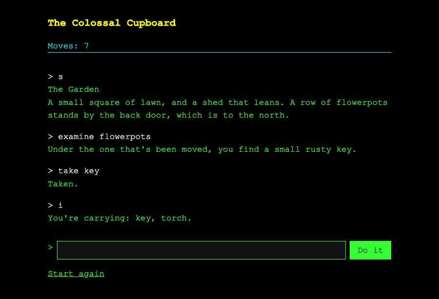

# Project 21 · Adventure Online

In Project 5 you wrote a text adventure, and you were made to keep its rules apart from its keyboard. "It never prints, never asks for input and never changes the state it's given," said the docstring, "so any front end can drive it: a terminal, a web page or a test." This is the web page.



The engine comes across untouched. What's new is everything round it, and the first problem is one that a terminal never had: **the web has no memory.** Every request arrives alone, from nobody in particular, and the server has to work out whose game it belongs to. The answer is a *session*, and the second half of the chapter is about what could go wrong with one, which is the beginning of web security.

It'll also *feel* like a game and not like a form. When you type a command, the reply appears under the last one, and the page doesn't reload. That takes no JavaScript of yours. It's done by a small library called **htmx**, and an old idea that it has made fashionable again: the server sends HTML, and sometimes it sends only a *piece* of a page.

| | |
|---|---|
| **You'll learn** | Sessions and cookies; reusing a pure engine; htmx: partial pages, targets, swaps, out-of-band updates, progressive enhancement; web security basics: XSS, CSRF, cookie flags, a content security policy |
| **New tool skills** | `.env` files; `git rebase` |
| **Time** | 5 to 6 hours |
| **Before you start** | [Project 20](p20-pyfax-live.md), and your `cupboard` project from [Project 5](../part-1-console/p05-colossal-cupboard.md) |

## Predict

!!! question "Predict"
    ```python
    from flask import Flask, session

    app = Flask(__name__)
    app.secret_key = "not much of a secret"


    @app.get("/")
    def count():
        session["visits"] = session.get("visits", 0) + 1
        return f"Visit {session['visits']}"


    alice, bob = app.test_client(), app.test_client()
    print(alice.get("/").text, alice.get("/").text, bob.get("/").text)
    ```

??? success "Answer"
    ```text
    Visit 1 Visit 2 Visit 1
    ```

    `session` looks like a dictionary, and there's a different one for every visitor. Nothing is kept on the server. The whole dictionary is sent to the browser, as a **cookie**, with the reply, and the browser sends it back with its next request. Each test client is a browser, with cookies of its own, and so Alice and Bob count separately. Stage 2.

!!! question "Predict"
    ```python
    import base64
    import json

    payload = "eyJ2aXNpdHMiOjJ9"
    print(json.loads(base64.urlsafe_b64decode(payload)))
    ```

??? success "Answer"
    ```text
    {'visits': 2}
    ```

    That gibberish is the first part of Alice's cookie. It isn't encrypted. It's JSON, written in *base64*, which is a way of spelling any bytes with sixty-four harmless characters, so that they can travel in a header. Anybody can read their own cookie. What they can't do is *change* it, since the rest of the cookie is a signature, made with your secret key. **A session is signed, and it isn't secret.** Stage 2, and the type-in listing.

!!! question "Predict"
    ```python
    from dataclasses import asdict, dataclass, field


    @dataclass
    class State:
        location: str = "cupboard"
        places: dict[str, str] = field(default_factory=dict)


    saved = asdict(State("hall", {"torch": "kitchen"}))
    print(saved)
    print(State(**saved) == State("hall", {"torch": "kitchen"}))
    ```

??? success "Answer"
    ```text
    {'location': 'hall', 'places': {'torch': 'kitchen'}}
    True
    ```

    A session can hold what JSON can hold: strings, numbers, lists and dictionaries. It can't hold one of your objects. `asdict` turns a dataclass into a dictionary, and `**` turns the dictionary back into a dataclass, which is how Project 5 saved a game to a file. It'll do for a cookie, too. Stage 2.

## Build

```console
$ cd making
$ uv init cupboard-web
$ cd cupboard-web
$ uv add flask python-dotenv
$ uv add --editable ../cupboard
$ uv add --dev pytest ruff pyright
$ code .
```

As in the last project, put an empty `py.typed` file in the `cupboard` package, beside its `__init__.py`, so that pyright will take its hints seriously, and ask for `typeCheckingMode = "standard"` here. That's the only thing you'll do to Project 5.

Have another look at what it gives you. There are three names, and they're all that a front end needs:

```pycon
>>> from cupboard.engine import State, describe, respond
>>> state = State()
>>> print(describe(state))
The Cupboard Under the Stairs
Coats press in on every side, and something with too many legs has just walked over your hand. A crack of light shows a door to the south.
>>> state, reply = respond(state, "south")
>>> state.location, state.moves
('hall', 1)
```

`respond` takes a state and some text, and returns a *new* state and a reply. It never touches a keyboard, a screen or a file. A function like that is the easiest thing in the world to put behind a web page.

### Stage 1: The factory, and a page

Create `src/cupboard_web/__init__.py`. It's last project's factory, with a few settings that Stage 4 will explain:

<!-- listing: projects/21-adventure-online/src/cupboard_web/__init__.py -->
```python title="src/cupboard_web/__init__.py"
"""The Colossal Cupboard, in a browser."""

import logging
import secrets
from collections.abc import Mapping

from flask import Flask, Response

from cupboard_web import views

log = logging.getLogger(__name__)

# What a page of ours is allowed to load: only things that come from our own site.
POLICY = "default-src 'self'; frame-ancestors 'none'"


def create_app(config: Mapping[str, object] | None = None) -> Flask:
    app = Flask(__name__)
    app.config.from_mapping(
        SESSION_COOKIE_SAMESITE="Lax",
        SESSION_COOKIE_HTTPONLY=True,
        MAX_CONTENT_LENGTH=4096,
    )
    app.config.from_prefixed_env("CUPBOARD")
    if config:
        app.config.from_mapping(config)
    if not app.config.get("SECRET_KEY"):
        log.warning(
            "No CUPBOARD_SECRET_KEY is set. Games will be lost at each restart."
        )
        app.config["SECRET_KEY"] = secrets.token_hex()

    @app.after_request
    def add_security_headers(response: Response) -> Response:
        response.headers["Content-Security-Policy"] = POLICY
        response.headers["X-Content-Type-Options"] = "nosniff"
        return response

    app.register_blueprint(views.bp)
    return app
```

Make a `templates` folder, with a `base.html` in it:

<!-- listing: projects/21-adventure-online/src/cupboard_web/templates/base.html -->
```html title="src/cupboard_web/templates/base.html"
<!doctype html>
<html lang="en">
<head>
  <meta charset="utf-8">
  <meta name="viewport" content="width=device-width, initial-scale=1">
  <meta name="htmx-config" content='{"includeIndicatorStyles": false, "allowEval": false}'>
  <title>The Colossal Cupboard</title>
  <link rel="icon" href="{{ url_for('static', filename='icon.svg') }}">
  <link rel="stylesheet" href="{{ url_for('static', filename='style.css') }}">
  <script src="{{ url_for('static', filename='htmx.min.js') }}" defer></script>
</head>
<body>
  <h1>The Colossal Cupboard</h1>
  
</body>
</html>
```

`url_for('static', filename=…)` is the address of a file in your package's `static` folder, which Flask serves without being asked. Put a stylesheet there. Green on black is traditional, and the one in the repository is yours for the copying. The `htmx` lines are for Stage 3.

### Stage 2: Whose game is it?

In the terminal, the game's state was a local variable in `main`, and it lived for as long as the program ran. A web server handles a request in a few milliseconds, and forgets it. The next request might be from the same player, or from somebody else on the far side of the world. HTTP was designed like that, and it's called *stateless*.

So the state has to be kept somewhere, and found again. There are two places. You can keep it **on the server**, in a database, and give the browser a ticket with a number on it. Or you can give the browser **the state itself**, to look after, and to hand back with every request. Flask's `session` does the second, and for a game whose whole state is a dozen short strings, it's ideal: there's no database, and nothing to clear up.

Create `src/cupboard_web/game.py`:

<!-- listing: projects/21-adventure-online/src/cupboard_web/game.py -->
```python title="src/cupboard_web/game.py"
"""Each player's game, kept in their own session."""

import secrets
from dataclasses import asdict

from cupboard.engine import State
from flask import session

LONGEST_COMMAND = 80


def current_state() -> State:
    """Return this player's game, or a new one if they haven't one that makes sense."""
    try:
        return State(**session["state"])
    except (KeyError, TypeError):
        return State()


def keep(state: State) -> None:
    """Put the game back in the player's session."""
    session["state"] = asdict(state)


def token() -> str:
    """Return this player's secret token, making one if they haven't got one yet."""
    if "token" not in session:
        session["token"] = secrets.token_urlsafe()
    return session["token"]


def token_matches(offered: str) -> bool:
    """Did this request come from one of our own pages?"""
    return secrets.compare_digest(offered, token())
```

`keep` and `current_state` are the third Predict. The `except` in `current_state` covers a player who's never been here, which is a `KeyError`, and a player whose cookie is from an older version of the game, with different fields in it, which is a `TypeError`. They both get a new game. **Whatever comes back from a browser may be out of date**, even when it can't have been tampered with. (`token` is for Stage 4.)

Now the views. Create `src/cupboard_web/views.py`:

<!-- listing: projects/21-adventure-online/src/cupboard_web/views.py -->
```python title="src/cupboard_web/views.py"
"""The addresses that the game answers to."""

import logging

from cupboard.engine import State, describe, respond
from flask import Blueprint, abort, flash, redirect, render_template, request, url_for
from werkzeug.wrappers import Response

from cupboard_web.game import LONGEST_COMMAND, current_state, keep, token, token_matches

log = logging.getLogger(__name__)
bp = Blueprint("game", __name__)


def check_token() -> None:
    """Refuse a request that didn't come from a form of ours."""
    if not token_matches(request.form.get("token", "")):
        log.warning("A request with a bad token, from %s", request.remote_addr)
        abort(403)


@bp.get("/")
def play() -> str:
    state = current_state()
    return render_template(
        "game.html", state=state, scene=describe(state), token=token()
    )


@bp.post("/command")
def command() -> str | Response:
    check_token()
    text = request.form.get("text", "")[:LONGEST_COMMAND]
    state, reply = respond(current_state(), text)
    keep(state)

    if request.headers.get("HX-Request"):
        return render_template("_turn.html", text=text, reply=reply, state=state)
    flash(f"> {text}")
    flash(reply)
    return redirect(url_for("game.play"))


@bp.post("/restart")
def restart() -> Response:
    check_token()
    keep(State())
    return redirect(url_for("game.play"))
```

Look at `command`, and leave aside the `HX-Request` branch for the moment. It fetches the player's state, hands it to the engine with what they typed, keeps the new state, and redirects to the page, carrying the reply across in a `flash`. That's last project's post-redirect-get. **The whole of the game's logic, as far as the web is concerned, is one line**: `state, reply = respond(current_state(), text)`.

And `game.html`, with three small templates that it includes:

<!-- listing: projects/21-adventure-online/src/cupboard_web/templates/game.html -->
```html title="src/cupboard_web/templates/game.html"





<div id="transcript" aria-live="polite">
  
    <p class="{{ 'typed' if line.startswith('>') else 'reply' }}">{{ line }}</p>
  
    <p class="reply">{{ scene }}</p>
  
</div>

<form method="post" action="{{ url_for('game.command') }}"
      hx-post="{{ url_for('game.command') }}"
      hx-target="#transcript" hx-swap="beforeend scroll:#transcript:bottom">
  <input type="hidden" name="token" value="{{ token }}">
  <label for="text">&gt;</label>
  
  <button type="submit">Do it</button>
</form>

<form method="post" action="{{ url_for('game.restart') }}">
  <input type="hidden" name="token" value="{{ token }}">
  <button type="submit" class="quiet">Start again</button>
</form>

```

<!-- listing: projects/21-adventure-online/src/cupboard_web/templates/_status.html -->
```html title="src/cupboard_web/templates/_status.html"
<p id="status" hx-swap-oob="true">
  Moves: {{ state.moves }}
  <strong>You've won!</strong>
</p>
```

<!-- listing: projects/21-adventure-online/src/cupboard_web/templates/_prompt.html -->
```html title="src/cupboard_web/templates/_prompt.html"
<input id="text" name="text" maxlength="80" autocomplete="off" autofocus
       hx-swap-oob="true">
```

**``** drops one template into another, and **``** sets a variable for the length of a block. The included pieces are named with an underscore, by convention, to show that they're parts, and not pages. Jinja's `for` has an `else`, which is used when there was nothing to loop over: if there are no flashed lines to show, show the room.

Ignore the attributes that begin `hx-`. A browser does. What's left is an ordinary form, which posts to `/command`.

!!! example "Run it"
    ```console
    $ uv run flask --app cupboard_web run --debug
    ```

    Play a few moves. It works, and it's clumsy: every command reloads the whole page, and only the last reply is showing. Open a private window, or a different browser, and go to the same address. That's a second player, in a game of their own.

    Then look at your cookie. In the browser's developer tools, which ++f12++ opens, it's under **Application**, or **Storage**, and then **Cookies**. It's called `session`. You'll be reading it, in the type-in listing.

#### What a cookie is

A cookie is a small, named piece of text. A server sends one in a reply, in a `Set-Cookie` header. The browser keeps it, and sends it back, in a `Cookie` header, with every later request *to that site*. That's all. There's no other memory in the web, and logins, shopping baskets and "remember me" are all built on it.

Three things follow. A cookie is limited to about 4,000 characters, and so a session is for small things. It's on the player's machine, and so they can read it, and delete it, and copy it to another browser. And it goes with *every* request to your site, whoever caused the request, which is the root of the most important attack in Stage 4.

The tests use a test client as a browser, cookies and all. `tests/conftest.py` has two helpers, `token_on`, which reads the token out of a page as a browser would, and `send`, which types a command. `tests/test_game.py`:

<!-- listing: projects/21-adventure-online/tests/test_game.py -->
```python title="tests/test_game.py"
def test_the_game_is_remembered_between_requests(client: FlaskClient):
    send(client, "south")
    send(client, "e")
    assert "torch" in send(client, "look")
    assert "Moves: 3" in client.get("/").text


def test_each_player_has_a_game_of_their_own(app: Flask):
    alice, bob = app.test_client(), app.test_client()
    send(alice, "south")
    assert "Moves: 1" in alice.get("/").text
    assert "Moves: 0" in bob.get("/").text
    assert "Cupboard Under the Stairs" in bob.get("/").text


def test_the_game_can_be_won_in_a_browser(client: FlaskClient):
    for text in WALKTHROUGH[:-1]:
        send(client, text)
    assert "You have won, in 15 moves." in send(client, WALKTHROUGH[-1])
    assert "You've won!" in client.get("/").text
# ...
def test_it_works_with_no_javascript_at_all(client: FlaskClient):
    send(client, "south", htmx=False)
    page = client.get("/").text
    assert "<html" in page
    assert "&gt; south" in page
    assert "Hall" in page
    assert "Moves: 1" in page
```

The winning game is Project 5's walkthrough, word for word, played through a web server.

!!! success "Checkpoint"
    ```console
    $ git add .
    $ git commit -m "Play the adventure in a browser, with each player's game in a session"
    ```

### Stage 3: htmx, and pieces of pages

Reloading the whole page to add two lines to it is wasteful, and it loses the transcript. The usual remedy, for fifteen years, has been to write the front end as a JavaScript application, which asks the server for *data*, as JSON, and builds the page itself. That's a second program, in a second language, with a second copy of half your logic.

**htmx** takes another road. The server goes on sending HTML, which it's good at. htmx is a script that adds a few attributes to HTML, which say: *when this happens, fetch that address, and put what comes back there.* It has no build step and no dependencies, and you won't write a line of JavaScript.

Download it into your `static` folder. It's one file, and keeping a copy of your own, which is called *vendoring*, means that your game doesn't depend on somebody else's server staying up:

```console
$ curl -L -o src/cupboard_web/static/htmx.min.js https://unpkg.com/htmx.org@2.0.10/dist/htmx.min.js
```

Now read the form's attributes again:

| | |
|---|---|
| `hx-post="/command"` | When this form is submitted, don't load a new page. POST the form's fields to this address, in the background |
| `hx-target="#transcript"` | Put what comes back into the element whose `id` is `transcript` |
| `hx-swap="beforeend"` | Add it at the end of that element, after what's there already. (The default would be to replace the contents) |
| `scroll:#transcript:bottom` | And then scroll the transcript to the bottom |

So the server has to send back something different: not a page, but **the two paragraphs that are to be added**. htmx marks its requests with a header, `HX-Request`, and that's what the branch in `command` looks for. Create `templates/_turn.html`:

<!-- listing: projects/21-adventure-online/src/cupboard_web/templates/_turn.html -->
```html title="src/cupboard_web/templates/_turn.html"
<p class="typed">&gt; {{ text }}</p>
<p class="reply">{{ reply }}</p>

  
  

```

The first two lines are the piece that goes into the transcript. `{{ text }}` is what the player typed, handed back to them, and it's escaped, as ever.

**The other two are *out of band*.** The count of moves is at the top of the page, and the box that you type in is at the bottom, and both ought to change: one should go up, and the other should empty. An element in a reply that's marked `hx-swap-oob="true"` isn't put into the target. htmx finds the element on the page that has the same `id`, and replaces it. So one reply updates three separate parts of the page. The same `_status.html` and `_prompt.html` are used for the whole page and for the piece, with `swap` to say which, so that there's one place to change them.

**The same address serves both**, and that's deliberate. A browser with no JavaScript, or one where the script failed to load, submits the form in the ordinary way, gets a redirect, and sees a whole page. It's called *progressive enhancement*: the plain version works, and the script makes it nicer. It costs one `if`, and `test_it_works_with_no_javascript_at_all` holds you to it.

<!-- listing: projects/21-adventure-online/tests/test_game.py -->
```python title="tests/test_game.py"
def test_a_command_gets_a_piece_of_a_page_and_not_a_whole_one(client: FlaskClient):
    piece = send(client, "south")
    assert "<html" not in piece
    assert '<p class="typed">&gt; south</p>' in piece
    assert "Hall" in piece


def test_the_piece_also_carries_a_new_status_and_an_empty_prompt(client: FlaskClient):
    piece = send(client, "south")
    assert 'id="status" hx-swap-oob="true"' in piece
    assert "Moves: 1" in piece
    assert 'id="text"' in piece
    assert 'hx-swap-oob="true"' in piece.split('id="text"')[1]
```

!!! example "Run it"
    Reload, and play. The replies pile up, the count ticks over, the box empties itself and keeps the cursor, and the page never flickers. In the developer tools, open the **Network** tab, and type a command. Click on the request, and look at what came back: forty words of HTML.

??? note "A bug that no test could have found"
    This chapter's first draft said `hx-swap="beforeend scroll:bottom"`. Every test passed. The tests, though, never run the JavaScript: they check what the server sends, and the server was sending the right thing. When the page was driven in a real browser, the transcript stayed firmly at the top. `scroll:bottom` scrolls the *last element that was swapped in*, and with two out-of-band swaps in the reply, the last element was the box that you type in. Naming the element to be scrolled put it right. **Tests of a server tell you about the server.** For what happens in the browser, there's no substitute for opening a browser and looking. (The tutorial's repository has a script, `scripts/browser.py`, that drives a real Chrome with no window, and it's how the picture at the top of this page was taken.)

!!! success "Checkpoint"
    ```console
    $ git add .
    $ git commit -m "Add htmx: replies are added to the page, and the status and the prompt are swapped"
    ```

### Stage 4: What could go wrong?

Your game is on the web, which means that it can be reached by people who wish it ill, and by programs that wish everything ill. You won't become a security expert in a stage of a chapter. You can learn the four attacks that every web application has to withstand, and the habit of asking the question in the heading.

#### 1. They type something nasty: XSS

A player types `<script>alert(1)</script>` as a command. Your server sends what they typed back to them. If it goes back *as HTML*, their browser runs it. That's **cross-site scripting**, or XSS. It's harmless when a player attacks themselves. It's serious wherever one person's text is shown to another, as on last project's letters page, since the script runs as the *victim*, with the victim's cookies.

You're safe already, and you know why: `{{ text }}` is escaped. The rule from Project 18 is the defence. It has a test here all the same, since it's the kind of safety that a careless `| safe` filter could remove in a moment.

#### 2. They get somebody else to type it: CSRF

This one is subtler, and it's the one that people forget. Remember that a browser sends your cookie with **every** request to your site, *whoever caused the request*. Suppose that some other web page, anywhere at all, contains this:

```html
<form method="post" action="https://your-game.example/restart">
<script>document.forms[0].submit()</script>
```

Anybody who visits that page while they have a game in progress has just lost it. Their browser made the request, their cookie went with it, and your server can't tell it from a real one. That's **cross-site request forgery**, or CSRF. For a game, it's a nuisance. For a bank, it's "transfer the money".

The defence is to require something that the other site can't know. `game.token()` makes a long random string, and keeps it in the player's session. Every form of yours carries it, in a hidden field. Every POST is checked by `check_token`, and one without the right token gets a 403, "forbidden". The attacker's page can make the browser *send* a request. It can't *read* your pages, and so it can't find out the token.

`secrets.compare_digest` compares two strings in a way that takes the same time whether they differ at the first character or the last. An ordinary `==` gives up at the first difference, and an attacker who can time your replies precisely can use that to guess a secret one character at a time. It's a small habit: compare secrets with `compare_digest`.

Bigger applications use an extension, Flask-WTF, which does all this for every form. It's worth having done it once by hand, so that you know what the extension is for.

#### 3. A GET that changes something

`/restart` answers POST only, and so does `/command`. A GET must never change anything, and this is why: a GET can be caused by an `` tag, by a link in an email, by a search engine's crawler, or by a browser fetching pages in advance in case you want them. None of those can carry your token. There's a test that GETs both addresses, and expects 405.

#### 4. The cookie itself

The session cookie is the player's identity, and the factory sets three things about it.

- **Signed.** Flask does this, with your `SECRET_KEY`. A player can read their cookie, and can't alter it. There's a test that offers a forged one, claiming to have won, and it's ignored.
- **`HttpOnly`.** JavaScript on the page can't read the cookie, and so a successful XSS attack can't steal it.
- **`SameSite=Lax`.** The browser won't send the cookie with POSTs that come from other sites. That's a second defence against CSRF, which works in every modern browser. It's not a reason to leave out the token. In security, you wear the belt and the braces.

When the game is on a real server, with HTTPS, add `SESSION_COOKIE_SECURE=True`, so that the cookie is never sent over a connection that isn't encrypted.

#### And a policy

`add_security_headers`, in the factory, adds two headers to every reply. **`Content-Security-Policy: default-src 'self'`** tells the browser that this page may load scripts, styles and everything else *only from your own site*. If an attacker ever did get a `<script>` into a page, the browser would refuse to run it. It's a net under the trapeze.

It has a price, and the price is a good discipline: **no JavaScript or CSS written inside the HTML**. No `onclick="…"`, no `<style>` blocks, no `<script>` with code in it. Everything's in files. htmx can run snippets of JavaScript from attributes, by `eval`, which the policy forbids, and so the `<meta name="htmx-config">` line in `base.html` switches that feature off, along with a stylesheet that htmx would otherwise inject. That's why the box is emptied by an out-of-band swap, and not by a line of script.

`MAX_CONTENT_LENGTH` refuses any request of more than 4,096 bytes before your code sees it, and `LONGEST_COMMAND` cuts a command down to 80 characters. **Put a limit on everything that a stranger can send you.**

`tests/test_security.py`:

<!-- listing: projects/21-adventure-online/tests/test_security.py -->
```python title="tests/test_security.py"
def test_a_post_with_no_token_is_refused(client: FlaskClient):
    client.get("/")
    assert client.post("/command", data={"text": "south"}).status_code == 403
    assert client.post("/restart").status_code == 403
    assert "Moves: 0" in client.get("/").text


def test_so_is_a_post_with_somebody_elses_token(app):
    mallory, victim = app.test_client(), app.test_client()
    stolen = token_on(mallory)
    victim.get("/")
    response = victim.post("/command", data={"text": "south", "token": stolen})
    assert response.status_code == 403


def test_a_get_never_changes_anything(client: FlaskClient):
    assert client.get("/command").status_code == 405
    assert client.get("/restart").status_code == 405


def test_the_cookie_is_signed_so_a_forged_one_is_ignored(client: FlaskClient):
    send(client, "south")
    client.set_cookie("session", "eyJzdGF0ZSI6eyJ3b24iOnRydWV9fQ.forged.signature")
    page = client.get("/").text
    assert "You've won!" not in page
    assert "Moves: 0" in page
```

!!! warning "Gotcha"
    This stage is a beginning. It hasn't mentioned HTTPS, which you need before anything goes on the internet, and which your host will usually provide. It hasn't mentioned passwords, which you should never store yourself if you can use somebody else's login. It hasn't mentioned limiting how fast one visitor can make requests. The recap has a link to the OWASP Top Ten, which is the standard list of what goes wrong, and it's written to be read.

!!! success "Checkpoint"
    ```console
    $ git add .
    $ git commit -m "Add a CSRF token, cookie flags, security headers and limits"
    ```

### Stage 5: `.env`

Last project's secret key came from an environment variable, which you had to set by hand in every new terminal. The usual convenience is a file called `.env`, in the project's folder, with a line for each variable. `python-dotenv`, which you added at the start, reads it, and **`flask run` loads it for you** if that package is installed.

Create `.env.example`:

<!-- listing: projects/21-adventure-online/.env.example -->
```text title=".env.example"
# Copy this file to .env, and fill it in. Git is told to ignore .env, and
# `flask run` reads it as it starts, since python-dotenv is installed.

FLASK_APP=cupboard_web
FLASK_DEBUG=1

# Make one with: uv run python -c "import secrets; print(secrets.token_hex())"
CUPBOARD_SECRET_KEY=
```

**Before you make the real file, tell Git to ignore it.** Add a line to `.gitignore`, and check that it's worked:

```console
$ echo ".env" >> .gitignore
$ git check-ignore -v .env
.gitignore:11:.env	.env
```

`git check-ignore -v` tells you which line of which file is causing a path to be ignored, and says nothing at all if it isn't. Only then copy the example, and fill in a real key:

```console
$ cp .env.example .env
$ uv run python -c "import secrets; print(secrets.token_hex())"
```

Now `uv run flask run` needs no `--app`, and no `--debug`, and the warning about the secret key has gone.

**The pair of files is the convention.** `.env` holds real values, and is **never committed**. `.env.example` holds the *names*, with comments and no secrets, and *is* committed, so that the next person to clone the project knows what it needs. Make a habit of reading `git status` before every commit in a project that has secrets in it.

!!! warning "Gotcha"
    If a secret is ever committed, **deleting it in a later commit doesn't help**. It's in the history, and anybody who has the repository has it. The only cure is to *change the secret*, at once, and to treat the old one as public. The same goes for one that you paste into a chat, or a screenshot.

`.env` is read by `flask run`. A production server doesn't run `flask run`, and a real host has a page of its own for setting environment variables, which is where secrets belong.

### Stage 6: Rebase

You've been making a branch for each piece of work, and merging it with a pull request. Here's something that happens as soon as two pieces of work overlap in time. You branch off, and make two commits. Meanwhile, `main` moves on:

```console
$ git log --oneline --graph --all
* 9995bd7 Fix a typo in the hall
| * 0277230 Style the button
| * 4e9c0ed Add a Start again button
|/
* 41ea36c Start the game
```

Your branch grew from `41ea36c`, and `main` is now at `9995bd7`. You could merge, as in Project 12, and get a merge commit. Or you could **rebase**: take your two commits off, move the branch to the tip of `main`, and *replay* them on top, one at a time.

```console
$ git switch restart-button
$ git rebase main
Successfully rebased and updated refs/heads/restart-button.
$ git log --oneline --graph --all
* d159d92 Style the button
* 0e36391 Add a Start again button
* 9995bd7 Fix a typo in the hall
* 41ea36c Start the game
```

The history is a straight line, as though you'd started your work after the typo was fixed. When this branch is merged, it'll be a fast-forward.

Look at the hashes. `4e9c0ed` has become `0e36391`. **Rebasing doesn't move commits. It makes new ones**, with the same changes and the same messages, and new parents, and so new hashes. The old ones are abandoned. That's the source of the one rule:

!!! warning "Gotcha"
    **Never rebase commits that somebody else may have.** If you've pushed a branch, and a colleague has built on it, and you then rebase and push again, their work is sitting on commits that no longer exist in your version of history, and sorting that out is miserable. Rebase your *own* branch, *before* you share it, or when you're sure that nobody else is using it. After rebasing a branch that you'd already pushed, an ordinary `git push` will be refused, since the histories have diverged. For a pull request's branch that only you work on, `git push --force-with-lease` is the polite way: it overwrites the branch on GitHub only if nobody else has pushed to it since you last looked.

If one of your commits touches the same lines as something new on `main`, the replay stops, as a merge would:

```console
$ git rebase main
CONFLICT (content): Merge conflict in game.txt
error: could not apply 17c8c64... Shout
hint: Resolve all conflicts manually, mark them as resolved with
hint: "git add/rm <conflicted_files>", then run "git rebase --continue".
hint: To abort and get back to the state before "git rebase", run "git rebase --abort".
```

Put the file right, exactly as you did in Project 12, then `git add` it, and **`git rebase --continue`**. If it all gets too much, **`git rebase --abort`** puts everything back as it was before you began. Nothing is lost by trying.

| | |
|---|---|
| `git rebase main` | replay this branch's commits on top of `main` |
| `git pull --rebase` | fetch, and replay your own unpushed commits on top of what arrived. It avoids the "Merge branch 'main' of …" commits that an ordinary `git pull` makes |
| `git rebase -i main` | *interactive*: Git opens a list of your commits in your editor, and you can reorder them, reword them, or *squash* several into one, before anybody else sees them |
| `git rebase --continue`, `--abort` | after a conflict |

Merge or rebase? A merge records what really happened, and is always safe. A rebase tells a tidier story, and rewrites history to do it. The common practice is to **rebase your own branch to bring it up to date, and merge it into `main` when it's finished**. If you'd rather never rebase, that's respectable, and you still need to be able to read a history that somebody else has rebased.

!!! success "Checkpoint"
    Make a branch, and make a commit on it. Switch to `main`, and make a different commit. Rebase the branch, look at the graph, and then merge it.

    ```console
    $ git push
    ```

## Type-in listing

This reads a Flask session cookie *without knowing the secret key*. Copy the value of your `session` cookie from the browser's developer tools, and run it with `uv run peek.py`, and then the cookie, in quotation marks.

<!-- listing: projects/21-adventure-online/peek.py -->
```python title="peek.py" linenums="1"
"""Read a Flask session cookie, without knowing the secret key."""

import base64
import json
import sys
import zlib

cookie = sys.argv[1]
squashed = cookie.startswith(".")
payload, stamp, signature = cookie.lstrip(".").split(".")

data = base64.urlsafe_b64decode(payload + "=" * (-len(payload) % 4))
if squashed:
    data = zlib.decompress(data)

print(json.dumps(json.loads(data), indent=2))
print(f"\nThe signature, which you can't forge without the key: {signature}")
```

1. A cookie has three parts, with full stops between them. What are they? Which of them can you make sense of?
2. Line 12 adds some `=` signs before decoding. Base64 works in groups of four characters, and Flask leaves the padding off. What's `-len(payload) % 4` when the length is 14? When it's 16? Project 19 used the same trick to round up.
3. A cookie that begins with a full stop has been squashed with `zlib`, to save space. Which is yours? Play a few more moves, and look again.
4. **Play the game by reading the cookie.** Where's the key? Did you have to examine the flowerpots to find out?
5. So what mustn't go in a session? If the game had a secret that mattered, where would the state have to be kept?

## Bug hunt

A colleague has written their own web version of the game, in one file. "It works perfectly," they say. "I've played it right through." It's in the tutorial's repository, as `projects/21-adventure-online/bughunt/shared.py`.

```console
$ uv run flask --app bughunt/shared.py run
```

1. **Reproduce the problem.** You'll need a second player. Use another browser, or a private window, and take turns.
2. **Write a failing test.** Two test clients are two browsers.
3. **Explain why your colleague never noticed**, and why `flask run --debug` makes the bug behave still more strangely. (Save the file while a game is in progress.)

??? success "Solution"
    There's one game, and everybody on the internet is playing it. When Alice goes south, Bob finds himself in the hall.

    The state is a **global variable**, `state = State()`, at the top of the module. A module is imported once, when the server starts, and its globals live as long as the server does. Every request, from every visitor, runs the same view, which reads and writes the same variable. In a program with one user, a global is a bad habit. In a server, it's a bug, since "the program" no longer means "one person's session".

    ```python
    def test_in_the_colleagues_game_everybody_is_the_same_player():
        app = colleagues_app()
        alice, bob = app.test_client(), app.test_client()
        alice.post("/command", data={"text": "south"})
        assert "Moves: 1" in bob.get("/").text
    ```

    Your colleague never noticed because they tested it alone. One player, one game: it looks right. With `--debug`, saving any file restarts the server, the module is imported afresh, and everybody's game vanishes. A production server usually runs several copies of the program at once, as separate processes, each with its own globals, and so a player's request might land in any of several games, at random.

    **What to take from it.** In a web application, *anything that outlives a request is shared between all your visitors*: module-level variables, class attributes, mutable default arguments, caches. That's fine for things that ought to be shared, such as last project's forecast. For anything that belongs to one visitor, there are only two homes: the session, or a database, under a key that's in the session. And the test for it needs two clients, which is why `test_each_player_has_a_game_of_their_own` has been in your tests since Stage 2.

## Challenges

Make a branch for each, **rebase it on `main` if `main` has moved**, and merge it with a pull request.

**Tweak**

1. Make `look` the command that's sent when the box is empty. Where should that go: the view, the template, or the engine? (You aren't to change the engine.)
2. Add a row of buttons for the six directions. Each is a tiny form, with `hx-post`, a hidden `text` field, and the same target.
3. When the game is won, swap the prompt for a "Play again" button, out of band.

**Extend**

1. **A map.** Draw the rooms that the player has visited, as an SVG, and swap it, out of band, after every move. You'll need to remember which rooms they've seen. Where will that go? Will it fit?
2. **A transcript that survives.** Reload the page, and the transcript has gone, since it was only ever in the browser. Keep it on the server, in SQLite, as in Project 20, with a random id in the session to find it by. A cookie is too small to hold it. Work out roughly how many moves would fit in 4,000 characters, and then test what Flask does when you go over.
3. **Save and restore.** The terminal game had `save` and `restore`. What would they mean here? A link that you can bookmark, or send to a friend, with the state in it? Then what stops the friend from editing the link? You have a secret key, and Flask's `itsdangerous` library is what signs the session.

**Invent**

1. **A shared world.** Turn the bug into a feature: a game in which every player really is in the same world, and can see who else is in the room. Now the state *must* be on the server. What happens when two players take the torch at the same moment? Project 20's transactions are about to earn their keep.
2. **A second adventure.** The engine's world is data, in `world.py`. Write another, and have the site offer a choice. What in the engine would have to change to make the world a parameter, and would Project 5's tests still pass?
3. **A high-score table**, with the fewest moves at the top. Hold that thought until Project 22.

A solution to the second Extend, and the bug hunt's tests, are in the project's `solutions/` folder.

## Recap

You can now:

- [x] put a web front end on a pure engine, without changing it, and say what made that possible
- [x] explain what a cookie is, and how a signed session works, and what it can't hold
- [x] turn a dataclass into JSON-friendly data and back, and cope with an out-of-date session
- [x] use htmx: `hx-post`, `hx-target`, `hx-swap`, the `HX-Request` header, and out-of-band swaps
- [x] serve a whole page or a piece from one view, so that the site works with no JavaScript
- [x] build pages from included partial templates
- [x] explain XSS and CSRF, and defend against each
- [x] compare secrets with `compare_digest`, and keep changes out of GET requests
- [x] set cookie flags, a content security policy, and limits on what strangers can send
- [x] say why a server's tests can't tell you what a browser will do
- [x] keep settings in `.env`, with a committed `.env.example`, and say what to do when a secret leaks
- [x] rebase a branch, deal with a conflict during a rebase, and say when not to

**Read more:** [htmx's documentation](https://htmx.org/docs/), which is short, and its [essays](https://htmx.org/essays/), which are opinionated and entertaining · [Flask: sessions](https://flask.palletsprojects.com/en/stable/quickstart/#sessions) and [security considerations](https://flask.palletsprojects.com/en/stable/web-security/) · [The OWASP Top Ten](https://owasp.org/www-project-top-ten/) · [MDN on cookies](https://developer.mozilla.org/en-US/docs/Web/HTTP/Guides/Cookies) and on [Content-Security-Policy](https://developer.mozilla.org/en-US/docs/Web/HTTP/Guides/CSP) · [Pro Git: rebasing](https://git-scm.com/book/en/v2/Git-Branching-Rebasing), which has the pictures · [Get Lamp](http://www.getlamp.com/), a documentary about text adventures

Everything on the web so far has been for people. In [Project 22](p22-high-score-server.md) you'll write a server for *programs*: an API, which your Pygame games from Part 2 will post their scores to, written with FastAPI, where the type hints that you've been writing for fifteen projects start doing real work at run time.
