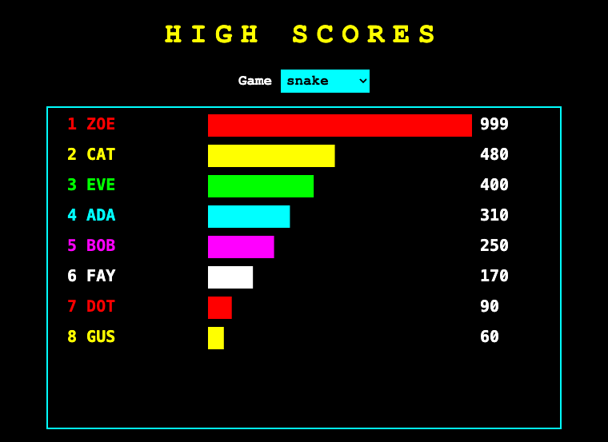
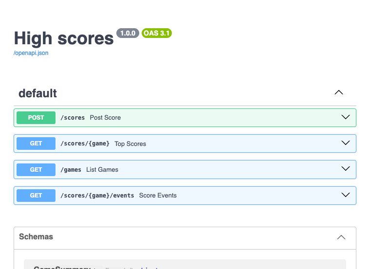

# Project 22 · High Score Server

Every arcade machine had a high-score table, and three letters of glory for whoever was at the top of it. Your games from Part 2 each keep a best score, and forget it when the window closes. In this project they'll report to a server, which keeps a table for every game, and there's a page in the browser that shows the table and redraws it *the moment that a game ends*, without being asked.



The pages in the last four projects were for people. This server is for **programs**. Nobody browses to it. Snake sends it a little JSON, and gets a little JSON back. That's an **API**, and it's how most of the software in the world talks to the rest of it.

It's written with **FastAPI**, which is built on an idea that will seem like a conjuring trick at first. You've been writing type hints for fifteen projects, and you've been told, correctly, that Python ignores them. FastAPI doesn't. It *reads* your function's hints, while the program is running, and uses them to check what arrives, convert it, refuse it politely if it's wrong, and write the API's documentation. The hints stop being commentary, and become the program.

| | |
|---|---|
| **You'll learn** | Type hints at run time: pydantic models, `Annotated`, validation; FastAPI: routers, path, query and body parameters, dependencies, response models, the automatic documentation; `TypedDict`, and three ways of describing a record; a first `async def`, and server-sent events; a `<canvas>`, in passing |
| **New tool skills** | Testing an API; tagging a version, and making a release on GitHub |
| **Time** | 5 to 6 hours |
| **Before you start** | [Project 20](p20-pyfax-live.md), for SQLite and httpx. Your Snake from [Project 9](../part-2-pygame/p09-snake.md) |

## Predict

!!! question "Predict"
    ```python
    from pydantic import BaseModel, Field, ValidationError


    class NewScore(BaseModel):
        player: str
        score: int = Field(ge=0)


    print(NewScore(player="ADA", score="120"))
    try:
        NewScore(player="ADA", score=-5)
    except ValidationError as error:
        print(error.error_count(), "error:", error.errors()[0]["msg"])
    ```

??? success "Answer"
    ```text
    player='ADA' score=120
    1 error: Input should be greater than or equal to 0
    ```

    It looks like a dataclass, and it's written like one. The difference is that a pydantic model **enforces its hints**, when an object is made. The string `"120"` was converted to the integer 120, since that's what the hint asked for and it could be done. The −5 was refused, because of the `ge=0`, "greater than or equal to nought". A dataclass would have accepted both without a murmur. Stage 1.

!!! question "Predict"
    ```python
    from typing import Annotated, get_type_hints

    Limit = Annotated[int, "between 1 and 100"]


    def top(limit: Limit = 10): ...


    print(get_type_hints(top))
    print(get_type_hints(top, include_extras=True))
    ```

??? success "Answer"
    ```text
    {'limit': <class 'int'>}
    {'limit': typing.Annotated[int, 'between 1 and 100']}
    ```

    Two things. **Type hints are kept**, on the function, where any program can read them while it runs, and that's the whole secret of FastAPI. And `Annotated[int, something]` is "an `int`, with a note attached". A type checker sees an `int`, and ignores the note. A library that knows what to look for can read the note, and act on it. Stage 1.

!!! question "Predict"
    ```python
    from typing import TypedDict


    class ScoreRow(TypedDict):
        player: str
        score: int


    row: ScoreRow = {"player": "ADA", "score": "lots"}
    print(type(row).__name__, row["score"])
    ```

??? success "Answer"
    ```text
    dict lots
    ```

    A `TypedDict` is at the other extreme from pydantic. At run time, it's **a plain `dict`, and nothing at all is checked**. It exists only for type checkers: Pylance has underlined `"lots"` in your editor, and Python doesn't care. It's for describing dictionaries that you've been handed, such as JSON from somebody's API. Stage 6.

!!! question "Predict"
    ```python
    import asyncio
    import time


    async def fetch(name):
        await asyncio.sleep(1)
        return name


    async def main():
        started = time.perf_counter()
        results = await asyncio.gather(fetch("a"), fetch("b"), fetch("c"))
        print(results, round(time.perf_counter() - started))


    asyncio.run(main())
    ```

??? success "Answer"
    ```text
    ['a', 'b', 'c'] 1
    ```

    Three one-second waits, and the whole thing took one second. An `async def` function can *pause*, at each `await`, and while it's paused, something else can run. All three were waiting at once. Nothing here happens in parallel: there's one thread, doing one thing at a time. But waiting isn't doing, and a server spends nearly all of its life waiting. Project 25 is about this. Stage 4 is a first look.

## Build

```console
$ cd making
$ uv init high-scores
$ cd high-scores
$ uv add "fastapi[standard]"
$ uv add --dev pytest ruff pyright httpx2
$ code .
```

`fastapi[standard]` is FastAPI with its usual companions: **uvicorn**, which is the server that runs it, the `fastapi` command, and pydantic. (`httpx2` is the successor to the httpx that you used in Project 20, with the same interface, and FastAPI's test client has begun to ask for it.) Add Project 17's `[tool.pyright]` table, with `strict`. After two projects of `standard`, you can have strict mode back: FastAPI and pydantic are built out of type hints, and the checker is at home.

### Stage 1: Models: type hints that mean it

What does a game send? Three things: which game, who played, and what they scored. Create `src/high_scores/models.py`:

<!-- listing: projects/22-high-score-server/src/high_scores/models.py -->
```python title="src/high_scores/models.py"
"""The shapes of the data that comes in, and the data that goes out."""

from datetime import datetime
from typing import Annotated

from pydantic import BaseModel, Field, StringConstraints

# A type, with a note attached to say what's allowed.
GameName = Annotated[str, StringConstraints(pattern=r"^[a-z0-9-]{1,20}$")]
PlayerName = Annotated[
    str, StringConstraints(strip_whitespace=True, min_length=1, max_length=12)
]


class NewScore(BaseModel):
    """What a game sends when somebody has finished playing."""

    game: GameName
    player: PlayerName
    score: int = Field(ge=0, le=1_000_000_000)


class Score(NewScore):
    """A score that's been kept: it has a number, a time, and a place in the table."""

    id: int
    when: datetime
    rank: int


class GameSummary(BaseModel):
    game: GameName
    plays: int
    best: int
```

**A `BaseModel` is a dataclass that checks.** That was the first Predict. Every field has a type, and when an object is made, whether by your code or out of JSON from the internet, each value is checked against its type, converted if that can be done safely, and refused if not, with a `ValidationError` that lists *every* problem, and says where each is.

**The rules live in the types.** `Field(ge=0, le=1_000_000_000)` is a score that can't be negative, or absurd. `GameName` and `PlayerName` are the second Predict at work: a `str`, with a note attached. `StringConstraints` is a note that pydantic understands. A game's name must match a regular expression, from Project 13: lower-case letters, digits and hyphens, and from one to twenty of them. A player's name has its spaces trimmed, and is then from one to twelve characters long. In Project 20 you wrote `letters.check`, by hand, to do this kind of thing. Here you *declare* it, and it can't be forgotten.

**`Score(NewScore)`** is inheritance, from Project 15: a stored score is a new score, with three more fields. `when` is a `datetime`, and pydantic will turn SQLite's text into one on the way in, and back into text for JSON on the way out.

```pycon
>>> from high_scores.models import NewScore
>>> new = NewScore(game="snake", player="  ADA  ", score="120")
>>> new
NewScore(game='snake', player='ADA', score=120)
>>> new.model_dump()
{'game': 'snake', 'player': 'ADA', 'score': 120}
>>> NewScore(game="Snake!", player="ADA", score=1)
Traceback (most recent call last):
  ...
pydantic_core._pydantic_core.ValidationError: 1 validation error for NewScore
game
  String should match pattern '^[a-z0-9-]{1,20}$' [type=string_pattern_mismatch, ...
```

`model_dump()` turns a model into a dictionary, as `asdict` did for a dataclass.

!!! tip "Pythonic"
    Use pydantic **at the edges** of a program, where data arrives from outside: a request, a file, an environment. That's where checking earns its keep. In the middle of a program, where you made the data yourself and a type checker can see it, a plain dataclass is lighter and quicker. Project 17's syntax tree would gain nothing from being validated a million times a second.

!!! success "Checkpoint"
    ```console
    $ git add .
    $ git commit -m "Describe scores as pydantic models"
    ```

### Stage 2: The table

Create `src/high_scores/store.py`. It's SQLite, as in Project 20, and it knows nothing about the web:

<!-- listing: projects/22-high-score-server/src/high_scores/store.py -->
```python title="src/high_scores/store.py"
"""Keeping the scores, in SQLite. Nothing in here knows about the web."""

import sqlite3
from pathlib import Path

from high_scores.models import GameSummary, NewScore, Score

SCHEMA = """
CREATE TABLE IF NOT EXISTS scores (
    id INTEGER PRIMARY KEY,
    game TEXT NOT NULL,
    player TEXT NOT NULL,
    score INTEGER NOT NULL,
    "when" TEXT NOT NULL DEFAULT CURRENT_TIMESTAMP
);
CREATE INDEX IF NOT EXISTS scores_by_game ON scores (game, score DESC);
"""
RANKED = """
    SELECT id, game, player, score, "when",
           (SELECT COUNT(*) + 1 FROM scores AS better
             WHERE better.game = scores.game AND better.score > scores.score) AS rank
      FROM scores
"""


def connect(database: Path) -> sqlite3.Connection:
    # FastAPI may open a connection in one thread and use it in another. That's
    # safe here, since a connection belongs to one request, and SQLite needs telling.
    db = sqlite3.connect(database, check_same_thread=False)
    db.row_factory = sqlite3.Row
    return db


def init(db: sqlite3.Connection) -> None:
    db.executescript(SCHEMA)


def add(db: sqlite3.Connection, new: NewScore) -> Score:
    with db:
        cursor = db.execute(
            "INSERT INTO scores (game, player, score) VALUES (?, ?, ?)",
            (new.game, new.player, new.score),
        )
    row = db.execute(f"{RANKED} WHERE id = ?", (cursor.lastrowid,)).fetchone()
    return Score(**row)


def top(db: sqlite3.Connection, game: str, limit: int) -> list[Score]:
    rows = db.execute(
        f"{RANKED} WHERE game = ? ORDER BY score DESC, id LIMIT ?", (game, limit)
    )
    return [Score(**row) for row in rows]


def games(db: sqlite3.Connection) -> list[GameSummary]:
    rows = db.execute(
        "SELECT game, COUNT(*) AS plays, MAX(score) AS best FROM scores "
        "GROUP BY game ORDER BY game"
    )
    return [GameSummary(**row) for row in rows]


def newest(db: sqlite3.Connection, game: str) -> int:
    """Return the id of the latest score for a game, or 0 if there aren't any."""
    (found,) = db.execute(
        "SELECT COALESCE(MAX(id), 0) FROM scores WHERE game = ?", (game,)
    ).fetchone()
    return found
```

`when` is in quotation marks because it's a word that means something in SQL. An **index** is what it sounds like: a sorted list that the database keeps on the side, so that "the best ten scores for Snake" can be read off, and the whole table needn't be searched.

`RANKED` works out each score's place with a *subquery*: count the scores for the same game that are better, and add one. So two people with 300 are both first, and whoever's next is third, as in a real competition. The f-strings here are safe, since `RANKED` is a constant of yours, and every *value* still travels by question mark.

`Score(**row)` hands a row from the database to pydantic, which checks it, and turns `when` into a `datetime`.

!!! success "Checkpoint"
    Test it with a database in `tmp_path`, with no web in sight, and commit.

### Stage 3: The API

Create `src/high_scores/app.py`. Here it is without its last third, which is Stage 4's:

<!-- listing: projects/22-high-score-server/src/high_scores/app.py -->
```python title="src/high_scores/app.py"
"""The API: what programs can ask of the server, and what they get back."""

import asyncio
import sqlite3
from collections.abc import AsyncIterator, Iterator
from contextlib import closing
from pathlib import Path
from typing import Annotated

from fastapi import APIRouter, Depends, FastAPI, Query, Request
from fastapi.responses import FileResponse, StreamingResponse
from fastapi.staticfiles import StaticFiles

from high_scores import store
from high_scores.models import GameName, GameSummary, NewScore, Score

STATIC = Path(__file__).parent / "static"
router = APIRouter()


def get_db(request: Request) -> Iterator[sqlite3.Connection]:
    """Open a connection for one request, and close it when the request is over."""
    with closing(store.connect(request.app.state.database)) as db:
        yield db


Db = Annotated[sqlite3.Connection, Depends(get_db)]
Limit = Annotated[int, Query(ge=1, le=100)]


@router.post("/scores", status_code=201)
def post_score(new: NewScore, db: Db) -> Score:
    """Record a score, and say where it came in the table."""
    return store.add(db, new)


@router.get("/scores/{game}")
def top_scores(game: GameName, db: Db, limit: Limit = 10) -> list[Score]:
    """The best scores for one game, highest first."""
    return store.top(db, game, limit)


@router.get("/games")
def list_games(db: Db) -> list[GameSummary]:
    """Every game that has a score, with how often it's been played."""
    return store.games(db)
# ...
def create_app(database: Path = Path("scores.sqlite3")) -> FastAPI:
    app = FastAPI(title="High scores", version="1.0.0")
    app.state.database = database
    with closing(store.connect(database)) as db:
        store.init(db)
    app.include_router(router)
    app.mount("/static", StaticFiles(directory=STATIC), name="static")
    return app
```

An `APIRouter` is a Flask blueprint under another name, and `create_app` is the factory that you know.

Now read `post_score` slowly, since **its signature is the whole of its specification**:

```python
@router.post("/scores", status_code=201)
def post_score(new: NewScore, db: Db) -> Score:
```

FastAPI reads those hints as the application starts, and works out the following.

- **`new: NewScore`** is a pydantic model, and so it must come from the **body** of the request, as JSON. FastAPI parses the JSON, and makes a `NewScore` from it. If that fails, your function is never called. The client gets a **422**, "unprocessable", and a list of what was wrong:

    ```json
    {
      "detail": [
        {
          "type": "int_parsing",
          "loc": ["body", "score"],
          "msg": "Input should be a valid integer, unable to parse string as an integer",
          "input": "lots"
        }
      ]
    }
    ```

- **`-> Score`** is what goes back. FastAPI turns the `Score` into JSON, and *filters* it through the model, so that nothing can leak out that the model doesn't mention.
- **`status_code=201`** is "created", which is the proper reply to a POST that made something.

In `top_scores`, **`game`** is in the path, `/scores/{game}`, and so it's taken from the address, and checked against `GameName`. **`limit: Limit = 10`** isn't in the path, and isn't a model, and so it's a **query parameter**, as in `/scores/snake?limit=3`. `Annotated[int, Query(ge=1, le=100)]` is an `int`, with a note for FastAPI: from 1 to 100. Ask for `limit=0`, or `limit=lots`, and it's a 422, and your function never hears of it.

By the time that your code runs, everything in its parameters is known to be of the right type, and within its limits. The bodies of these functions are one line long, since there's nothing left for them to check.

#### Dependencies

**`db: Db`** is the third kind of parameter. `Db` is `Annotated[sqlite3.Connection, Depends(get_db)]`: a connection, with a note that says "to get one of these, call `get_db`". FastAPI calls it for you, for each request, and hands the result in. It's **dependency injection**, which you've been doing by hand since Project 9, built into the framework.

`get_db` has a `yield` in it, and you've met that shape twice: it's a pytest fixture, and it's Project 17's `@contextmanager`. Whatever's before the `yield` sets things up, the value is handed over, and whatever's after it clears up, when the request is finished. `closing`, from `contextlib`, is a ready-made context manager that calls `close()` on the way out.

A dependency can ask for things itself: `get_db` takes the `Request`, to find out which database this application is using. In the tests, that's a temporary one.

!!! note "Under the bonnet"
    `check_same_thread=False`, in `store.connect`, is there because of how FastAPI runs an ordinary `def`. So as not to hold up the server, it runs each one in a *thread*, from a pool. The dependency and the view that uses it may run in different threads, and `sqlite3`, out of caution, refuses to let a connection be used in a thread that didn't make it. Here each request has a connection to itself, and uses it for one thing at a time, which is safe, and so SQLite is told not to worry.

`fastapi dev` wants a file with an `app` in it. Create `main.py`, beside `pyproject.toml`:

<!-- listing: projects/22-high-score-server/main.py -->
```python title="main.py"
"""Where `fastapi dev` and `fastapi run` look for the application."""

from high_scores import create_app

app = create_app()
```

!!! example "Run it"
    ```console
    $ uv run fastapi dev main.py
    ```

    Post a score or two from another terminal, with `curl`, and ask for the table:

    ```console
    $ curl -X POST http://127.0.0.1:8000/scores -H "Content-Type: application/json" -d '{"game": "snake", "player": "ADA", "score": 120}'
    {"game":"snake","player":"ADA","score":120,"id":1,"when":"2026-09-20T17:43:14","rank":1}
    $ curl "http://127.0.0.1:8000/scores/snake?limit=3"
    ```

    Now go to **`http://127.0.0.1:8000/docs`**.

    

    You didn't write that page. It's every address, with its parameters and their limits, the shape of what goes in and of what comes out, and your docstrings. Open **POST /scores**, press **Try it out**, and send a score from the browser. Send a bad one. It's all made from the type hints, by way of a description of the API in a standard format called **OpenAPI**, which is at `/openapi.json`, and from which other tools can generate client libraries in any language you care to name.

    **The documentation can't be out of date, since it's made from the code.** That's the best argument for the whole approach.

#### Testing an API

FastAPI's `TestClient` is httpx, connected straight to your application, with no network. `tests/conftest.py`:

<!-- listing: projects/22-high-score-server/tests/conftest.py -->
```python title="tests/conftest.py"
from pathlib import Path

import pytest
from fastapi.testclient import TestClient

from high_scores import create_app


@pytest.fixture
def database(tmp_path: Path) -> Path:
    return tmp_path / "test.sqlite3"


@pytest.fixture
def client(database: Path) -> TestClient:
    return TestClient(create_app(database))


def play(client: TestClient, game: str, player: str, score: int) -> dict:
    response = client.post(
        "/scores", json={"game": game, "player": player, "score": score}
    )
    assert response.status_code == 201, response.text
    return response.json()
```

Testing an API is pleasanter than testing pages. There's no HTML to pick through: what goes in is a dictionary, and what comes out is a dictionary. `tests/test_api.py`:

<!-- listing: projects/22-high-score-server/tests/test_api.py -->
```python title="tests/test_api.py"
def test_the_table_is_in_order_and_has_the_ranks(client: TestClient):
    for player, score in [("ADA", 120), ("BOB", 300), ("CAT", 200), ("DOT", 300)]:
        play(client, "snake", player, score)
    table = client.get("/scores/snake").json()
    assert [(row["rank"], row["player"], row["score"]) for row in table] == [
        (1, "BOB", 300),
        (1, "DOT", 300),
        (3, "CAT", 200),
        (4, "ADA", 120),
    ]
# ...
@pytest.mark.parametrize(
    ("body", "where", "complaint"),
    [
        ({"game": "snake", "player": "ADA"}, "score", "Field required"),
        (
            {"game": "snake", "player": "ADA", "score": -1},
            "score",
            "greater than or equal",
        ),
        ({"game": "snake", "player": "ADA", "score": "lots"}, "score", "valid integer"),
        ({"game": "snake", "player": "ADA", "score": 9.5}, "score", "valid integer"),
        (
            {"game": "Snake!", "player": "ADA", "score": 1},
            "game",
            "should match pattern",
        ),
        (
            {"game": "snake", "player": "   ", "score": 1},
            "player",
            "at least 1 character",
        ),
        ({"game": "snake", "player": "A" * 13, "score": 1}, "player", "at most 12"),
    ],
)
def test_scores_that_will_not_do(client: TestClient, body, where, complaint):
    response = client.post("/scores", json=body)
    assert response.status_code == 422
    (problem,) = response.json()["detail"]
    assert problem["loc"] == ["body", where]
    assert complaint in problem["msg"]
    assert client.get("/scores/snake").json() == []
# ...
def test_the_api_describes_itself(client: TestClient):
    schema = client.get("/openapi.json").json()
    assert schema["info"]["title"] == "High scores"
    assert set(schema["paths"]) == {
        "/scores",
        "/scores/{game}",
        "/games",
        "/scores/{game}/events",
    }
    new_score = schema["components"]["schemas"]["NewScore"]
    assert new_score["properties"]["score"]["maximum"] == 1_000_000_000
    assert client.get("/docs").status_code == 200
```

The parametrised test sends seven bad scores, and checks *where* the server says each problem is, and what it says about it. You didn't write a line of the code that it's testing, and that's a reason to test it, since those messages are now part of your API, and other people's programs will read them.

`test_the_api_describes_itself` pins down the list of addresses. An API is a promise to other programs, and a test that fails when the promise changes is worth having. Stage 7 comes back to that.

!!! success "Checkpoint"
    ```console
    $ uv run pyright
    $ git add .
    $ git commit -m "Add the API: post a score, and get a table"
    ```

### Stage 4: A first `async def`

The page that shows the table ought to change when a new score arrives. The page could ask the server again every second. It's better for the *server* to tell the *page*. There's a simple, old, standard way for a server to do that, called **server-sent events**: the browser makes one request, and the server never finishes replying. It keeps the connection open, and whenever it has something to say, it sends a line that begins `data:`.

So for each person who's watching the table, there's a request that goes on for as long as they're watching. With Flask's development server, which deals with one request at a time, the second visitor would wait for ever. Even with a pool of threads, a hundred watchers would tie up a hundred threads, all doing nothing.

This is what `async` is for. Add the last part of `app.py`, above `create_app`:

<!-- listing: projects/22-high-score-server/src/high_scores/app.py -->
```python title="src/high_scores/app.py"
async def changes(database: Path, game: str, pause: float = 1.0) -> AsyncIterator[str]:
    """Yield a message whenever there's a new score for a game. It never finishes."""
    seen = -1
    while True:
        with closing(store.connect(database)) as db:
            latest = store.newest(db, game)
        if latest != seen:
            seen = latest
            yield f"data: {latest}\n\n"
        await asyncio.sleep(pause)


@router.get("/scores/{game}/events")
async def score_events(game: GameName, request: Request) -> StreamingResponse:
    """A stream that says something whenever the table changes."""
    stream = changes(request.app.state.database, game)
    return StreamingResponse(stream, media_type="text/event-stream")


@router.get("/", include_in_schema=False)
async def board() -> FileResponse:
    return FileResponse(STATIC / "index.html")
```

`changes` is a generator, with a `yield`, and it's `async`, with an `await`. It looks for the newest score. If that's changed since it last looked, it yields a message. Then comes **`await asyncio.sleep(pause)`**, and that's the line that matters. An ordinary `time.sleep(1)` would hold up the thread, and everybody behind it. `await asyncio.sleep(1)` says: *I've nothing to do for a second, so go and look after somebody else, and come back to me.* That was the fourth Predict. A thousand of these generators can be "running" at once, and at any moment nearly all of them are paused at that line, costing nothing.

Here's the little that you need for now. Project 25 has the rest.

- **`async def`** makes a function that can pause. Calling it doesn't run it. It gives you an object that something else has to drive, and that something is an **event loop**. uvicorn runs one, and `asyncio.run` starts one.
- **`await`** is where it may pause. You can only `await` inside an `async def`.
- In FastAPI, **use plain `def` for a view that calls ordinary, blocking code**, such as `sqlite3`. FastAPI runs it in a thread, out of the way. Use **`async def` for a view that awaits**. The thing never to do is to call something slow and blocking from inside an `async def`, since that stops the loop, and *everybody* waits.

(`changes` does bend that last rule: it makes a quick query, which is blocking. It takes a fraction of a millisecond, once a second, and that's a fair trade for simplicity. If it were slow, `await asyncio.to_thread(…)` would send it off to a thread.)

An async generator can be tested without a server, and without any plug-in for pytest. `asyncio.run` runs one `async` function to the end, and `anext` is `next`, for async iterators. `tests/test_events.py`:

<!-- listing: projects/22-high-score-server/tests/test_events.py -->
```python title="tests/test_events.py"
def test_the_stream_speaks_at_once_and_then_only_when_something_changes(database: Path):
    create_app(database)

    def post(score: int) -> None:
        with closing(store.connect(database)) as db:
            store.add(db, NewScore(game="snake", player="ADA", score=score))

    async def listen() -> list[str]:
        heard: list[str] = []
        stream = changes(database, "snake", pause=0.01)
        heard.append(await anext(stream))
        post(100)
        heard.append(await anext(stream))
        post(50)
        post(75)
        heard.append(await anext(stream))
        await stream.aclose()
        return heard

    assert asyncio.run(listen()) == ["data: 0\n\n", "data: 1\n\n", "data: 3\n\n"]


def test_many_listeners_cost_almost_nothing_while_they_wait(database: Path):
    create_app(database)

    async def listen_briefly() -> str:
        stream = changes(database, "snake", pause=0.2)
        first = await anext(stream)
        await stream.aclose()
        return first

    async def crowd() -> list[str]:
        return await asyncio.gather(*(listen_briefly() for _ in range(200)))

    assert asyncio.run(crowd()) == ["data: 0\n\n"] * 200
```

The second test starts **two hundred** listeners at once, in one thread, and the whole test takes a fifth of a second.

!!! success "Checkpoint"
    ```console
    $ git add .
    $ git commit -m "Add a stream of events, with a first async def"
    ```

### Stage 5: The board

The page is three files, in `src/high_scores/static/`. The HTML is ten lines, with a `<select>` and a `<canvas>`, and the stylesheet is black, with a cyan border. They're in the tutorial's repository, and you could write them yourself by now. The interesting one is the script, and it's the last JavaScript in the tutorial. Save it as `board.js`:

<!-- listing: projects/22-high-score-server/src/high_scores/static/board.js -->
```javascript title="src/high_scores/static/board.js"
// Draws the table of scores on a <canvas>, and draws it again whenever the
// server says that there's a new score.
const COLOURS = ["#f00", "#ff0", "#0f0", "#0ff", "#f0f", "#fff"];
const canvas = document.querySelector("#board");
const pen = canvas.getContext("2d");
const chooser = document.querySelector("#game");
let events = null;

async function draw(game) {
  const scores = await (await fetch(`scores/${game}?limit=10`)).json();
  const best = Math.max(1, ...scores.map((row) => row.score));
  pen.fillStyle = "#000";
  pen.fillRect(0, 0, canvas.width, canvas.height);
  pen.font = "bold 20px monospace";
  pen.textBaseline = "middle";
  scores.forEach((row, place) => {
    const y = 22 + place * 38;
    pen.fillStyle = COLOURS[place % COLOURS.length];
    pen.fillRect(200, y - 14, (row.score / best) * 330, 28);
    pen.fillText(`${String(row.rank).padStart(2)} ${row.player}`, 12, y);
    pen.fillStyle = "#fff";
    pen.fillText(row.score, 540, y);
  });
}

function watch(game) {
  if (events) events.close();
  events = new EventSource(`scores/${game}/events`);
  events.onmessage = () => draw(game);
}

async function start() {
  const games = await (await fetch("games")).json();
  for (const { game } of games) chooser.add(new Option(game));
  const wanted = new URLSearchParams(location.search).get("game");
  if (wanted) chooser.value = wanted;
  chooser.onchange = () => watch(chooser.value);
  if (chooser.value) watch(chooser.value);
}

start();
```

Read it as a Python programmer, and it holds few surprises.

A **`<canvas>`** is a rectangle of pixels that a script can draw on, and its "2d" context has a `fillStyle`, a `fillRect` and a `fillText`. It's `pygame.draw`, in a browser, and `draw` is a `View.draw` from Part 2: wipe it, and draw everything again.

**`fetch`** is the browser's httpx. It's asynchronous, and JavaScript's `async` and `await` mean just what Python's do, which is no accident, since both languages took the idea from the same place.

**`EventSource`** is the other end of Stage 4. It opens the stream, and calls `onmessage` whenever a line of `data:` arrives. If the connection drops, it reconnects by itself.

Three of your four API addresses are used here, from a different language. That's the point of an API.

!!! example "Run it"
    Go to `http://127.0.0.1:8000/`. Then, from another terminal, post a score with `curl`, and watch the page. Open it in two windows, and on your phone. They all change within a second.

### Stage 6: The games report in

Now for the other end. Open your **Snake** project, from Project 9, and add httpx to it:

```console
$ cd ../snake
$ uv add httpx
```

Create `src/snake/scores.py`. There's nothing about Snake in it, and it'll do for any game:

<!-- listing: projects/22-high-score-server/snake-online/src/snake_online/scores.py -->
```python title="src/snake/scores.py"
"""Telling the high-score server how a game went. It's the same for any game."""

import getpass
import logging
import os
from typing import TypedDict

import httpx

log = logging.getLogger(__name__)

SERVER = os.environ.get("SCORES_SERVER", "http://127.0.0.1:8000")
PLAYER = os.environ.get("PLAYER", getpass.getuser())[:12].upper()


class ScoreRow(TypedDict):
    """The shape of what the server sends back. It's a dict, and this describes it."""

    id: int
    game: str
    player: str
    score: int
    when: str
    rank: int


def post_score(
    game: str, score: int, client: httpx.Client | None = None
) -> ScoreRow | None:
    """Send a score. If the server can't be reached, say so in the log, and carry on."""
    sender = client or httpx.Client()
    body = {"game": game, "player": PLAYER, "score": score}
    try:
        response = sender.post(f"{SERVER}/scores", json=body, timeout=2)
        response.raise_for_status()
    except httpx.HTTPError as error:
        log.warning("The score wasn't recorded: %s", error)
        return None
    return response.json()


def ordinal(number: int) -> str:
    """Return 1st, 2nd, 3rd, 4th, 11th, 21st and so on."""
    if number % 100 in (11, 12, 13):
        return f"{number}th"
    return f"{number}{ {1: 'st', 2: 'nd', 3: 'rd'}.get(number % 10, 'th') }"
```

**A game must never break because a server's away.** `post_score` has a time-out of two seconds, catches everything that httpx can raise, logs a warning, and returns `None`. The game carries on, as it did before there was a server. It's Project 20's rule, seen from the other side.

**`ScoreRow` is a `TypedDict`**, which was the third Predict. `response.json()` returns a dictionary, of who knows what. `ScoreRow` tells Pylance, and whoever reads the code, what's expected in it, so that `row["rank"]` is known to be an `int`, and `row["rnak"]` is underlined. It checks nothing at run time. If the server sent something else, you'd find out with a `KeyError`, later on.

You now have three ways of describing a record, and they differ in *when* the description is enforced:

| | It's checked | Reach for it when |
|---|---|---|
| `@dataclass` | by the type checker, where it's used | it's your own data, inside your own program. This is the default |
| `TypedDict` | by the type checker only. At run time it's a plain `dict` | somebody has handed you a dictionary, such as JSON, and you'd like the checker's help without converting it |
| pydantic's `BaseModel` | **at run time**, when it's made | the data comes from outside, and can't be trusted |

Should the game validate the server's reply with pydantic? It could. It's *your* server, though, and a game wants to be light. Knowing where you can afford to trust is part of the skill.

`SERVER` and `PLAYER` come from the environment, as in Project 20. `getpass.getuser()` is the name that you're logged in under, which makes a fair default.

Then the game has to notice that it's ended. In `src/snake/app.py`, import `httpx`, `State` from the model, and `ordinal` and `post_score` from your new module, and add a small class, above `main`:

<!-- listing: projects/22-high-score-server/snake-online/src/snake_online/app.py -->
```python title="src/snake/app.py"
class Reporter:
    """Watches a game, and sends its score at the moment that it ends."""

    def __init__(self, client: httpx.Client | None = None) -> None:
        self.client = client
        self.was_over = False
        self.caption = "Snake"

    def watch(self, game: Game) -> None:
        over = game.state is State.GAME_OVER
        if over and not self.was_over:
            row = post_score("snake", game.score, self.client)
            place = f"you came {ordinal(row['rank'])}" if row else "the server is away"
            self.caption = f"Snake: {game.score}, and {place}"
        self.was_over = over
```

`watch` is called once in every frame, and a game stays in `GAME_OVER` for hundreds of frames. `was_over` makes sure that the score is sent on the *first* of them only. Spotting the moment that something *becomes* true, and not the whole time that it *is* true, is called **edge detection**, and it's the same idea as `btnp` against `btn`, and `KEYDOWN` against `get_pressed`.

In `main`, make a `Reporter` before the loop, and add two lines inside it, after `game.update(…)`:

```python
        reporter.watch(game)
        pygame.display.set_caption(reporter.caption)
```

!!! example "Run it"
    Start the server in one terminal, and leave the board open in a browser beside it. In another terminal:

    ```console
    $ PLAYER=ADA uv run snake
    ```

    On Windows, that's `$env:PLAYER = "ADA"`, and then `uv run snake`. Play, and die, with one eye on the browser. **The bar appears as the snake hits the wall**, and the title bar of the game says where you came. Then stop the server, and play again: the game doesn't mind.

    The post happens in the frame that the game ends, and the game is frozen while it does. With the server on your own machine, that's a millisecond. With a slow server, it could be the whole two-second time-out. The remedy is to send it from a *thread*, which Project 25 explains.

The `Reporter` can be tested with no Pygame window and no server: the game is a stand-in with two attributes, and the server is last project's `MockTransport`. (In the tutorial's repository, the modified Snake is a small project of its own, `snake-online`, inside this one, so that Project 9 stays as it was.)

<!-- listing: projects/22-high-score-server/snake-online/tests/test_scores.py -->
```python title="tests/test_scores.py"
def test_the_reporter_sends_each_game_once_at_the_moment_it_ends():
    server = FakeServer()
    reporter = Reporter(server.client)
    game = SimpleNamespace(state=State.PLAYING, score=70)
    for _ in range(3):
        reporter.watch(game)
    assert server.received == []

    game.state = State.GAME_OVER
    for _ in range(100):
        reporter.watch(game)
    assert len(server.received) == 1
    assert reporter.caption == "Snake: 70, and you came 3rd"

    game.state, game.score = State.PLAYING, 0
    reporter.watch(game)
    game.state, game.score = State.GAME_OVER, 20
    reporter.watch(game)
    assert [body["score"] for body in server.received] == [70, 20]
```

`SimpleNamespace` is an object that you can hang any attributes on. It's handy for a stand-in, since Python only cares that `game.state` and `game.score` exist. That's duck typing.

Breakout and Asteroids are waiting. Each has a `score`, and a state that says when it's over, and `scores.py` goes across unchanged.

!!! success "Checkpoint"
    Commit in both projects.

### Stage 7: Version 1.0.0

Until now, nobody but you has depended on your code. **An API is different: other programs are written against it.** If you rename `player` to `name` next month, every copy of every game that's out there stops reporting, and their authors, who may well be you, find out the hard way. So an API has a **version**, and a published API changes *carefully*.

The convention for version numbers is **semantic versioning**: `MAJOR.MINOR.PATCH`.

| You changed | Bump | From 1.0.0 to |
|---|---|---|
| Nothing that a client could notice: a bug fixed, something made faster | PATCH | 1.0.1 |
| You **added** something, and everything that worked still works: a new address, a new optional field | MINOR | 1.1.0 |
| You **broke** something: renamed or removed a field, or changed what something means | MAJOR | 2.0.0 |

A version below 1.0.0 means "this may change at any moment". 1.0.0 is a promise. The version is in three places, and they ought to agree: `version="1.0.0"` in `create_app`, which shows in `/docs`; `version` in `pyproject.toml`; and a **tag** in Git.

A tag is a name for one commit, which never moves. Project 13's practice repository had one, `v0.1`.

```console
$ git tag -a v1.0.0 -m "The first version that games can rely on"
$ git push origin v1.0.0
$ gh release create v1.0.0 --generate-notes
```

`-a` makes an *annotated* tag, which has a message, an author and a date, as a commit has. Tags aren't pushed unless you say so. **`gh release create`** makes a *release* on GitHub: a page for that tag, with notes, and a download of the code as it was at that moment. `--generate-notes` writes the notes from the titles of the pull requests that were merged since the last release, which is one more reason to give pull requests sensible titles.

| | |
|---|---|
| `git tag` | list the tags |
| `git show v1.0.0` | what, who and when |
| `git switch --detach v1.0.0` | look at the code as it was |
| `git diff v1.0.0` | what's changed since |
| `gh release list`, `gh release view v1.0.0 --web` | the releases |

Project 27 takes this a step further, and publishes a package that other people can install.

!!! success "Checkpoint"
    ```console
    $ git push
    ```

## Type-in listing

Here's a complete API in twenty-five lines. It's a good deal shorter than the Flask application that would do the same, since there's no checking in it. Save it as `dice.py`, run it with `uv run fastapi dev dice.py`, and go to `/docs`.

<!-- listing: projects/22-high-score-server/dice.py -->
```python title="dice.py" linenums="1"
"""An API for rolling dice. Run it with: uv run fastapi dev dice.py"""

import random
from typing import Annotated

from fastapi import FastAPI, Query
from pydantic import BaseModel

app = FastAPI(title="Dice")


class Roll(BaseModel):
    dice: list[int]
    total: int
    lucky: bool


@app.get("/roll")
def roll(
    dice: Annotated[int, Query(ge=1, le=20)] = 2,
    sides: Annotated[int, Query(ge=2, le=100)] = 6,
) -> Roll:
    """Roll some dice. The limits are in the type hints, and nowhere else."""
    thrown = [random.randint(1, sides) for _ in range(dice)]
    return Roll(dice=thrown, total=sum(thrown), lucky=len(set(thrown)) == 1)
```

1. Try `/roll`, and `/roll?dice=5&sides=20`, and `/roll?dice=0`, and `/roll?sides=six`. Where is the code that refuses the last two?
2. Lines 20 and 21 have a default after the `Annotated[…]`. What does `/docs` make of that?
3. Change the return hint to `-> dict`, and return a dictionary. What's different in `/docs`? What have you lost?
4. When is `lucky` true? Why does `len(set(thrown)) == 1` say so?
5. Make the view `async def`. Does anything change? Should it be? (What does it wait for?)

## Bug hunt

A colleague has added an address for the five latest scores, from any game. "It doesn't crash," they say. "It just never finds anything. But the scores are *there*. Look at `/scores/snake`." It's in the tutorial's repository, as `projects/22-high-score-server/bughunt/recent.py`.

```console
$ uv run fastapi dev bughunt/recent.py
$ curl http://127.0.0.1:8000/scores/snake
[{"game":"snake","player":"ADA","score":120,"id":1,"when":"…","rank":1}]
$ curl http://127.0.0.1:8000/scores/recent
[]
```

1. **Reproduce it.** Then put a `print` in `recent_scores`, and ask again. What does that tell you?
2. **Look at `/docs`.** Try both addresses from there. Which *function* answers `/scores/recent`?
3. **Write a failing test, and fix it.**

??? success "Solution"
    The `print` never prints. `recent_scores` is never called.

    `/scores/recent` fits the pattern **`/scores/{game}`**, with a game called `recent`. That route was put on the list first, by `include_router`, inside `create_app`, and **the first route that matches wins**. "recent" is even a well-formed name for a game, and so there's no 422 to give the game away. There's a polite, empty list of the scores for a game that nobody has ever played.

    The fix is to put the specific address on the list *before* the general one:

    ```python
    app = FastAPI()
    app.state.database = database

    @app.get("/scores/recent")
    def recent_scores(db: Db) -> list[Score]: ...

    app.include_router(router)
    ```

    Or choose an address that can't collide, such as `/recent`.

    **What to take from it.** Routes are tried in order, in FastAPI and in Flask and in most things like them, and a pattern with a hole in it will swallow anything that fits the hole. The quiet failure was the dangerous part. An error would have been found in a minute, and a plausible, empty answer can sit there for a year. When something "doesn't crash, but never finds anything", the first question is: **is my code being run at all?**

## Challenges

Make a branch for each, and merge it with a pull request.

**Tweak**

1. Have Breakout and Asteroids report their scores. How much of `scores.py` did you change?
2. Show the *date* of each score on the board, as "today", "yesterday" or "3 days ago". The JSON has `when` in it. Should the server work that out, or the page?
3. `GET /scores/{game}?player=ADA` shows one player's scores only. It's one more optional parameter, and one more clause of SQL. Which part of the version number goes up?

**Extend**

1. **A personal best.** The board fills up with one keen player's scores. Add `?best_only=true`, which shows each player's best only. SQL's `GROUP BY` and `MAX` will do it.
2. **Delete.** `DELETE /scores/{id}`, for removing a rude name, which needs a key, sent in a header, and compared with `secrets.compare_digest`. A dependency can check the header, and raise `HTTPException(401)`, and then any view can ask for that dependency.
3. **Don't freeze the game.** Send the score from a thread: `threading.Thread(target=…, daemon=True).start()`. The `Reporter` now can't know the rank at once. How will the caption find out? (Come back to this after Project 25.)

**Invent**

1. **Cheating.** Anybody can post any score, with `curl`. *You can't fully prevent that*, since the game runs on the cheat's own machine. You can make it harder. Give the game and the server a shared secret key, and have the game send a *signature* with each score, made by `hmac`, from the standard library, out of the score and the key. The server makes the same signature, and compares. What happens when somebody reads the key out of the game's source? What would a real game company do?
2. **One board, many servers.** Let a game post to a friend's server, on another machine. What has to change in `uvicorn`'s settings, and what should you think about before doing it?
3. **A tournament.** Scores count only if they were posted between two times. You'll want Project 23's `datetime`.

A solution to the first Invent, and the bug hunt's tests, are in the project's `solutions/` folder.

## Recap

You can now:

- [x] explain how a library can read type hints at run time, and what `Annotated` is for
- [x] write pydantic models, with constraints, and say where in a program they belong
- [x] choose between a dataclass, a `TypedDict` and a pydantic model
- [x] write a FastAPI application: path, query and body parameters, response models, status codes, a router and a factory
- [x] write a dependency with `Depends`, and one that clears up after itself with `yield`
- [x] read the automatic documentation, and say why it can't go out of date
- [x] test an API with `TestClient`, including the ways in which it says no
- [x] say what `async def` and `await` mean, and when a FastAPI view should be `async`
- [x] write an async generator, and test it with `asyncio.run` and `anext`
- [x] push events from a server to a page
- [x] make a program that depends on a server survive without it, and detect the moment that something changes
- [x] version an API with semantic versioning, tag it, and publish a release
- [x] remember that routes are tried in order

**Read more:** [FastAPI's tutorial](https://fastapi.tiangolo.com/tutorial/), which is long, and very good · [pydantic](https://docs.pydantic.dev/latest/) · [`typing.TypedDict`](https://docs.python.org/3/library/typing.html#typing.TypedDict) and [`Annotated`](https://docs.python.org/3/library/typing.html#typing.Annotated) · [MDN: server-sent events](https://developer.mozilla.org/en-US/docs/Web/API/Server-sent_events/Using_server-sent_events) and [the canvas tutorial](https://developer.mozilla.org/en-US/docs/Web/API/Canvas_API/Tutorial) · [Semantic Versioning](https://semver.org/), which is one page · [`hmac`](https://docs.python.org/3/library/hmac.html)

That's the end of Part 4. You've written pictures as text, a generator of static sites, two web applications and an API, and a game that talks to a server. There's [one short, optional chapter](bonus-share-it.md) left in this part, for anybody who'd like to see their Python running *inside* the browser, with no server at all.

Then [Part 5](../part-5-tui/p23-rich-dashboard.md) goes back to where the tutorial began, to the terminal, which turns out to be capable of a good deal more than `print` and `input`.
