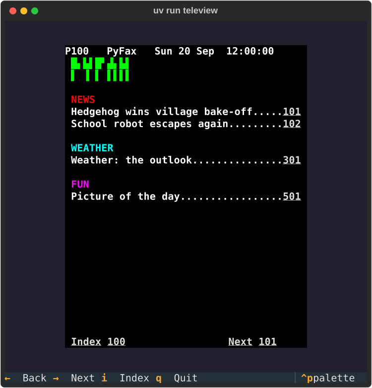

# Project 24 · Teletext Viewer

Rich can draw nearly anything in a terminal, once. It can't take a key, or a click, or keep a clock ticking in one corner while you read a page in another. For that you need an *application*, with widgets, layout, events and a main loop, and the people who wrote Rich wrote one of those too. It's called **Textual**, and it's to the terminal what a browser's page is to a window. It even has stylesheets.


That's PyFax, from Project 19, in a terminal. You type a three-figure number, as on a television's remote control, and the page changes. The arrows turn the pages, the page numbers can be clicked with a mouse, and the clock in the corner keeps time. The pages, and the code that lays them out, are Project 19's, used as they stand, for the third time.

Textual's most characteristic feature is the **reactive attribute**: an ordinary-looking attribute which, when you assign to it, makes things happen. It looks like magic, and it's a good excuse to open up the last big piece of Python's object model that you haven't seen, the **descriptor**, which turns out to have been underneath methods and properties all along.

| | |
|---|---|
| **You'll learn** | Textual: apps, widgets, `compose`, stylesheets, key bindings and actions, messages, timers, reactive attributes; **descriptors**: `__get__`, `__set__`, `__set_name__`, and what they explain; Unicode's teletext characters |
| **New tool skills** | `textual run --dev` and the Textual console; testing an app with a pilot; snapshot tests |
| **Time** | 5 to 6 hours |
| **Before you start** | [Project 23](p23-rich-dashboard.md), and your `pyfax` project from [Project 19](../part-4-web/p19-pyfax.md) |

## Predict

!!! question "Predict"
    ```python
    class Loud:
        def __get__(self, instance, owner=None):
            print("Somebody's looking")
            return 42

        def __set__(self, instance, value):
            print("Somebody's changing it to", value)


    class Thing:
        size = Loud()


    thing = Thing()
    print(thing.size)
    thing.size = 7
    print(thing.size)
    ```

??? success "Answer"
    ```text
    Somebody's looking
    42
    Somebody's changing it to 7
    Somebody's looking
    42
    ```

    `size` is a class attribute, and what's in it is an object with a `__get__` and a `__set__`. That makes it a **descriptor**, and Python treats it specially: reading `thing.size` *calls* `__get__`, and assigning to it *calls* `__set__`. The 7 went nowhere, since this `__set__` didn't keep it. An attribute has become two method calls, and whoever wrote the descriptor decides what they do. Stage 4.

!!! question "Predict"
    ```python
    class Trail:
        def __init__(self):
            self._visited = [100]
            self.changes = 0

        @property
        def visited(self):
            return self._visited

        @visited.setter
        def visited(self, value):
            self._visited = value
            self.changes += 1


    trail = Trail()
    trail.visited.append(101)
    trail.visited = [*trail.visited, 301]
    print(trail.visited, trail.changes)
    ```

??? success "Answer"
    ```text
    [100, 101, 301] 1
    ```

    Both lines changed the list, and only one of them counted. `trail.visited.append(101)` *reads* the attribute, and then changes the list that it was handed, behind the setter's back. Only an assignment, with an `=`, goes through the setter. Anything that watches an attribute for changes has this blind spot, and Textual's reactive attributes have it too. It's the bug hunt. Stage 4.

!!! question "Predict"
    ```python
    class Greeter:
        def hello(self):
            return "hello"


    greeter = Greeter()
    function = Greeter.__dict__["hello"]
    print(function.__get__(greeter, Greeter)())
    print(greeter.hello == greeter.hello, greeter.hello is greeter.hello)
    ```

??? success "Answer"
    ```text
    hello
    True False
    ```

    Here's where `self` comes from, which you've taken on trust since Project 9. **A function is a descriptor.** When you write `greeter.hello`, Python finds a function in the class, and calls its `__get__`, which hands back a *bound method*: a small object that remembers both the function and the instance. It makes a new one every time that you ask, and that's why the two are equal, and aren't the same object. Stage 4.

## Build

```console
$ cd making
$ uv init teleview
$ cd teleview
$ uv add "textual>=8,<9"
$ uv add --editable ../pyfax
$ uv add --dev pytest ruff pyright textual-dev pytest-textual-snapshot
$ code .
```

Textual is pinned to version 8, since it's the kind of library whose major versions change things. Copy your `content` folder across from Project 19, and add the strict `[tool.pyright]` table.

### Stage 1: Sixty characters that were waiting for you

A terminal shows characters. Project 19's graphics were six squares to a cell, which a browser could paint with backgrounds. What's a terminal to do?

It happens that in 2020 Unicode gained a block of characters called *Symbols for Legacy Computing*, put there for the sake of people who preserve old computer systems, and the first sixty of them are **teletext's graphics characters**, under the name of *sextants*. There's one for every pattern of six squares, but for the four that Unicode had already: nothing at all, everything, the left half, and the right half. They're in the order of their binary numbers, with squares numbered exactly as Project 19 numbered them. Create `src/teleview/glyphs.py`:

<!-- listing: projects/24-teletext-viewer/src/teleview/glyphs.py -->
```python title="src/teleview/glyphs.py"
"""One character for each of teletext's 64 graphics characters."""

FIRST_SEXTANT = 0x1FB00
LEFT_HALF, RIGHT_HALF, FULL = 0b010101, 0b101010, 0b111111

# Braille has two columns of four dots. These are the bits for the dots that
# stand in for each of our six squares: the middle pair of rows both do for the middle.
BRAILLE = 0x2800
BRAILLE_DOTS = [0x01, 0x08, 0x02 | 0x04, 0x10 | 0x20, 0x40, 0x80]


def sextant(dots: int) -> str:
    """Return the Unicode "sextant" for a pattern of six squares.

    Unicode 13 added these for the sake of teletext. There are 60 of them, since
    four of the 64 patterns were in Unicode already: nothing, everything, and
    the left and right halves.
    """
    ready_made = {0: " ", LEFT_HALF: "▌", RIGHT_HALF: "▐", FULL: "█"}
    if dots in ready_made:
        return ready_made[dots]
    skipped = (dots > LEFT_HALF) + (dots > RIGHT_HALF)
    return chr(FIRST_SEXTANT + dots - 1 - skipped)


def braille(dots: int) -> str:
    """Return a Braille pattern that looks something like it, for older fonts."""
    pattern = sum(BRAILLE_DOTS[n] for n in range(6) if dots >> n & 1)
    return chr(BRAILLE + pattern)


QUADRANTS = " ▘▝▀▖▌▞▛▗▚▐▜▄▙▟█"


def quadrant(dots: int) -> str:
    """Return a character of four squares, which every font has, as near as can be had.

    The top row of squares stays as it is. The middle and the bottom rows have to
    share the lower half of the character, and so a square there is lit if either is.
    """
    top = dots & 0b11
    lower = (dots >> 2 | dots >> 4) & 0b11
    return QUADRANTS[top | lower << 2]


# The ways of drawing a graphics character, by name, for the command line.
GLYPHS = {"sextant": sextant, "quadrant": quadrant, "braille": braille}
```

**`sextant`** is arithmetic on code points. Pattern 1 is at U+1FB00, and they go up from there, except that two patterns on the way, 21 and 42, aren't in the block, since they're the half blocks, and so everything after each of them is one place earlier than you'd expect. `(dots > LEFT_HALF) + (dots > RIGHT_HALF)` adds up two `bool`s, to give 0, 1 or 2.

How would you test sixty-four characters that you can't tell apart by eye? **Unicode names them after their squares.** `unicodedata.name("🬔")` is `'BLOCK SEXTANT-235'`, which is squares 2, 3 and 5. So the test works out the name that each character ought to have, from its bits, and asks Python's copy of the Unicode database:

<!-- listing: projects/24-teletext-viewer/tests/test_render.py -->
```python title="tests/test_render.py"
@pytest.mark.parametrize("dots", range(64))
def test_every_sextant_is_the_one_that_its_name_says(dots):
    """Unicode calls them BLOCK SEXTANT-135, and so on, after the squares that are lit."""
    lit = "".join(str(square + 1) for square in range(6) if dots >> square & 1)
    expected = {
        "": "SPACE",
        "135": "LEFT HALF BLOCK",
        "246": "RIGHT HALF BLOCK",
        "123456": "FULL BLOCK",
    }.get(lit, f"BLOCK SEXTANT-{lit}")
    assert unicodedata.name(sextant(dots)) == expected
```

There's a snag, and it's one to know about for the rest of your life in terminals: **a character is only as good as the font**. Many fonts haven't got the sextants yet, and you'll see empty boxes. Some terminals draw them themselves, without asking the font, and then all's well. So there are two fall-backs. **`quadrant`** uses the older characters of four squares, which every font has. It can't be exact: the middle row and the bottom row have to share, which is what `dots >> 2 | dots >> 4` does. **`braille`** is exact, since a Braille cell has eight dots, and it's faint. `GLYPHS` gives the three of them names, for the command line.

### Stage 2: A page, as styled text

Textual shows what Rich can draw, and so a page becomes a Rich `Text`. Create `src/teleview/render.py`:

<!-- listing: projects/24-teletext-viewer/src/teleview/render.py -->
```python title="src/teleview/render.py"
"""Turning a teletext page into something that Rich, and so Textual, can show."""

from collections.abc import Callable

from pyfax import Cell, Colour, Page
from rich.style import Style
from rich.text import Text

from teleview.glyphs import sextant

NAMES = {
    Colour.BLACK: "#000000",
    Colour.RED: "#ff0000",
    Colour.GREEN: "#00ff00",
    Colour.YELLOW: "#ffff00",
    Colour.BLUE: "#0000ff",
    Colour.MAGENTA: "#ff00ff",
    Colour.CYAN: "#00ffff",
    Colour.WHITE: "#ffffff",
}


def style_of(cell: Cell) -> Style:
    """Return a cell's colours, and, if it's a link, what clicking on it does."""
    style = Style(color=NAMES[cell.ink], bgcolor=NAMES[cell.paper], bold=True)
    if cell.link is not None:
        style += Style(underline=True, meta={"@click": f"app.go_to({cell.link})"})
    return style


def page_text(page: Page, glyph: Callable[[int], str] = sextant) -> Text:
    """Return a page as one piece of styled text: 24 lines of 40 characters.

    The page's own top line is left off, since the viewer has a live one.
    """
    text = Text(no_wrap=True)
    for number, row in enumerate(page.rows[1:]):
        if number:
            text.append("\n")
        for cell in row:
            character = glyph(cell.dots) if cell.dots else cell.text
            text.append(character, style_of(cell))
    return text
```

A Rich `Style` can be added to another, and the second wins wherever they disagree. A style can also carry **`meta`**, which is a dictionary of anything you like, and Textual looks in it for one key in particular. **`"@click": "app.go_to(301)"`** makes that stretch of text clickable, and says what to do: run the *action* called `go_to`, on the app, with 301. Project 19's links come across as they are.

The page's own top line is left off, since the viewer is going to have a live one.

!!! success "Checkpoint"
    Test the three kinds of glyph, and `page_text`, and commit.

### Stage 3: An application

Here's the whole of a Textual application, to get the shape of one:

```python
from textual.app import App, ComposeResult
from textual.widgets import Footer, Static


class Hello(App[None]):
    BINDINGS = [("q", "quit", "Quit"), ("b", "bell", "Ring the bell")]

    def compose(self) -> ComposeResult:
        yield Static("Hello, [bold green]Textual[/]!")
        yield Footer()


Hello().run()
```

An **`App`** is the program. **`compose`** is a generator that yields the **widgets** that it's made of, from top to bottom. **`BINDINGS`** connects keys to **actions**, and an action called `bell` is a method called `action_bell`, which `App` happens to have already. `run()` takes over the terminal, starts the loop, and gives the terminal back when you leave. The footer shows the bindings, without being told.

It's Pyxel's bargain, from the side quest: Textual is a *framework*. It has the loop, and it calls you.

Now the two widgets of the viewer. Create `src/teleview/widgets.py`:

<!-- listing: projects/24-teletext-viewer/src/teleview/widgets.py -->
```python title="src/teleview/widgets.py"
"""The two parts of the screen: the line at the top, and the page."""

from collections.abc import Callable
from datetime import datetime

from pyfax import Page
from textual.message import Message
from textual.reactive import reactive
from textual.widgets import Static

from teleview.glyphs import sextant
from teleview.render import page_text


class Keypad(Static):
    """The top line. It shows the page number as it's typed, and the time."""

    typed = reactive("")
    showing = reactive(100)
    now = reactive(datetime.min)  # noqa: DTZ901 - it's replaced before it's ever shown

    class Dialled(Message):
        """Sent when a whole page number has been typed."""

        def __init__(self, number: int) -> None:
            super().__init__()
            self.number = number

    def press(self, digit: str) -> None:
        """Take one digit. After the third, tell whoever is listening, and start again."""
        self.typed += digit
        if len(self.typed) == 3:
            self.post_message(self.Dialled(int(self.typed)))
            self.typed = ""

    def render(self) -> str:
        number = self.typed.ljust(3, "_") if self.typed else f"{self.showing}"
        return f"P{number}   PyFax   {self.now:%a %d %b  %H:%M:%S}"


class PageView(Static):
    """The page itself: forty columns, and the twenty-four rows under the top line."""

    page: reactive[Page | None] = reactive(None)

    def __init__(self, glyph: Callable[[int], str] = sextant) -> None:
        super().__init__()
        self.glyph = glyph

    def watch_page(self, page: Page | None) -> None:
        if page is not None:
            self.update(page_text(page, self.glyph))
```

Both are subclasses of `Static`, which is a widget that shows something. Subclassing widgets is how Textual is meant to be used, as Project 15 said it would be. A widget decides what it looks like in one of two ways. `Keypad` has a **`render`** method, which returns what to show, and is called whenever the widget needs drawing. `PageView` calls **`self.update(…)`** when it has something new.

And the application. Create `src/teleview/app.py`:

<!-- listing: projects/24-teletext-viewer/src/teleview/app.py -->
```python title="src/teleview/app.py"
"""PyFax in the terminal: a teletext viewer, with Textual."""

import argparse
from collections.abc import Callable
from datetime import datetime
from pathlib import Path
from typing import ClassVar

from pyfax import Page
from pyfax.content import ContentError, pages
from textual import events
from textual.app import App, ComposeResult
from textual.binding import Binding, BindingType
from textual.containers import Vertical
from textual.reactive import reactive
from textual.widgets import Footer

from teleview.glyphs import GLYPHS, sextant
from teleview.widgets import Keypad, PageView


def local_time() -> datetime:
    return datetime.now().astimezone()


class Viewer(App[None]):
    CSS_PATH = Path(__file__).with_name("viewer.tcss")
    BINDINGS: ClassVar[list[BindingType]] = [
        Binding("left", "turn(-1)", "Back"),
        Binding("right", "turn(1)", "Next"),
        Binding("i", "go_to(100)", "Index"),
        Binding("q", "quit", "Quit"),
    ]

    number = reactive(100, init=False)

    def __init__(
        self,
        site: list[Page],
        clock: Callable[[], datetime] = local_time,
        glyph: Callable[[int], str] = sextant,
    ) -> None:
        super().__init__()
        self.site = {page.number: page for page in site}
        self.clock = clock
        self.glyph = glyph

    def compose(self) -> ComposeResult:
        with Vertical(id="set"):
            yield Keypad()
            yield PageView(self.glyph)
        yield Footer()

    def on_mount(self) -> None:
        self.tick()
        self.set_interval(1, self.tick)
        self.watch_number(self.number)

    def tick(self) -> None:
        self.query_one(Keypad).now = self.clock()

    def watch_number(self, number: int) -> None:
        """Whenever the number changes, by whatever means, show that page."""
        self.query_one(PageView).page = self.site[number]
        self.query_one(Keypad).showing = number

    def on_key(self, event: events.Key) -> None:
        if event.character and event.character.isdecimal():
            self.query_one(Keypad).press(event.character)

    def on_keypad_dialled(self, message: Keypad.Dialled) -> None:
        self.action_go_to(message.number)

    def action_go_to(self, number: int) -> None:
        if number in self.site:
            self.number = number
        else:
            self.notify(f"There's no page {number}", severity="warning")

    def action_turn(self, step: int) -> None:
        """Go to the page after this one, or the one before, if there is one."""
        page = self.site[self.number]
        wanted = page.after if step > 0 else page.before
        if wanted in self.site:
            self.number = wanted


def main() -> None:
    parser = argparse.ArgumentParser(description=__doc__)
    parser.add_argument("content", nargs="?", type=Path, default=Path("content"))
    parser.add_argument(
        "--glyphs",
        choices=sorted(GLYPHS),
        default="sextant",
        help="how to draw the graphics: try quadrant if you see empty boxes",
    )
    args = parser.parse_args()
    if not args.content.is_dir():
        raise SystemExit(
            f"Can't read the pages: there's no folder called {args.content}"
        )
    try:
        site = pages(args.content, local_time().date())
    except (OSError, ContentError) as error:
        raise SystemExit(f"Can't read the pages: {error}") from error
    Viewer(site, glyph=GLYPHS[args.glyphs]).run()
```

Set the command in `pyproject.toml` to `teleview = "teleview.app:main"`.

**`compose`** uses a container: `with Vertical(id="set"):` puts the two widgets inside a box, one above the other, as the television set. Containers are context managers, which is a neat use of `with`.

**`on_mount`** is called when the app is on the screen. `set_interval(1, self.tick)` asks for `tick` to be called every second, and that's the whole of the clock. The clock itself is a parameter, as it was in Project 23, so that the tests can stop it.

**`on_key`** is an *event handler*. Textual calls a method called `on_` and the event's name, if there is one. Digits go to the keypad. Every other key is left for the bindings.

**`query_one(Keypad)`** finds a widget by its class, as a browser's `querySelector` finds an element. It takes CSS selectors too: `query_one("#set")`.

**`notify`** puts a message in the corner for a few seconds.

**`BINDINGS: ClassVar[…]`** has a type hint that the three-line example hadn't. Ruff's RUF012, which you met in Project 9, objects to a list as a class attribute, since lists can be changed, and a class attribute is shared by every instance. `ClassVar` says "yes, it's shared, and that's the intention".

#### Attributes down, messages up

How should the parts of an application talk to each other? The keypad knows when three digits have been typed. The *app* knows which pages exist. The keypad could reach up and call `self.app.action_go_to(…)`, and then it could never be used in any other program.

Textual's answer is a rule of thumb, and it's a good one for any user interface: **attributes down, messages up**. A parent tells its children what to show by *setting their attributes*: `self.query_one(Keypad).showing = number`. A child tells the world that something has happened by *posting a message*, and doesn't care who's listening.

`Keypad.Dialled` is a message. It's a class inside a class, which is only a way of naming it: outside, it's `Keypad.Dialled`. `post_message` sends one off, and it *bubbles* up through the widget's parents until somebody handles it. The handler's name is made from the two classes' names: **`on_keypad_dialled`**. It's Project 15's callbacks, with the wiring done by name.

#### A stylesheet, for a terminal

Create `src/teleview/viewer.tcss`:

<!-- listing: projects/24-teletext-viewer/src/teleview/viewer.tcss -->
```css title="src/teleview/viewer.tcss"
/* Textual's stylesheets look like CSS, and work on widgets and not on elements. */

Screen {
    align: center middle;
    background: #202030;
}

#set {
    width: 40;
    height: 25;
    background: black;
}

Keypad {
    height: 1;
    color: white;
    background: black;
    text-style: bold;
}

PageView {
    height: 24;
}
```

It's CSS, as near as makes no difference, from Project 19: selectors, which name widget classes and ids, and properties. Sizes are in characters. `align: center middle` on the screen puts the set in the middle of the terminal, however big that is. `CSS_PATH` is given as a full path, worked out from `__file__`, and not as a bare file name, so that a subclass of `Viewer` in some other folder can still find it.

!!! example "Run it"
    ```console
    $ uv run teleview
    ```

    Type 3, 0, 1. Press ++right++ and ++left++. Click on a page number. Type 7, 7, 7. Make the terminal bigger and smaller. ++q++ leaves.

    If the block letters are rows of empty boxes, your font hasn't the sextants, and that's what the fall-back is for:

    ```console
    $ uv run teleview --glyphs quadrant
    ```

    

    (The pictures in this chapter are drawn with quadrants, since they're SVGs that Textual exported, and the font that a browser shows them in has no sextants either.)

!!! success "Checkpoint"
    ```console
    $ git add .
    $ git commit -m "Add the viewer: a keypad, a page, key bindings and clickable numbers"
    ```

### Stage 4: Reactive attributes, and what's underneath

Look again at three lines in the code that you've just written:

```python
class Keypad(Static):
    typed = reactive("")
```

```python
        self.typed += digit
```

Nothing in `press` redraws the keypad. And yet the digit appears, as you type it. **Assigning to a reactive attribute is enough**: Textual notices, and calls `render` again. If there's a method called **`watch_`** and the attribute's name, it calls that too, with the new value. `Viewer.watch_number` is one: whoever changes `self.number`, and however, whether it was the keypad, an arrow key, the index key or a click, the page and the top line are brought up to date, in one place. It's a fine way of building a user interface: you say what depends on what, once, and then you only ever change the *state*.

(`reactive(100, init=False)` stops the watcher from being called when the app is first made, before there are any widgets to update. `on_mount` calls it by hand, when there are.)

How can an assignment run code? `typed` is a class attribute, and yet each keypad has its own value. There's no `__setattr__` in sight. It's the first Predict.

#### Descriptors

When you write `thing.size`, Python looks for `size` in the instance, and then in the class. If what it finds *in the class* is an object with a **`__get__`** method, Python doesn't hand you that object. It calls `__get__(instance, owner)`, and hands you whatever comes back. If the object has a **`__set__`**, then `thing.size = 7` calls *that*, and doesn't put anything in the instance at all. An object like this is called a **descriptor**, and it's an attribute with a mind of its own.

There's a third method, **`__set_name__(owner, name)`**, which Python calls once, as the class is being made, to tell the descriptor what it's been called. That's how `reactive` knows to look for a method called `watch_typed`, without your having to say `"typed"` twice.

`reactive` is a descriptor. Its `__set__` keeps the value on the instance, compares it with the old one, and, if it's changed, calls the watcher and asks for a redraw. The type-in listing, further down, is a working one in eighteen lines, and it's the best explanation that there is.

**And here's the secret: you've been using descriptors since Project 9**, since they're how Python itself does things.

| | is a descriptor whose `__get__` … |
|---|---|
| a function, in a class | returns a **bound method**, with `self` filled in. That was the third Predict, and it's where `self` comes from |
| `@property` | calls your getter. Its `__set__` calls your setter, or raises `AttributeError` if you didn't write one |
| `@classmethod` | returns a method bound to the *class* |
| `@staticmethod` | returns the function, unbound |
| a field with `slots=True` | reads a fixed place in the object. Project 14's `__slots__` makes one of these for each name |

The mechanism that makes `self` work is the same one that makes `property` work, and a library can use it as well as the language can. Most of what looks like magic in Python frameworks is this: Textual's `reactive`, the fields of an ORM's models, and the validators in some configuration libraries.

!!! warning "Gotcha"
    A descriptor sees *assignments*. It can't see anything else. That was the second Predict: `self.visited.append(301)` reads the attribute, and changes the list in place, and no `__set__` is called. With a reactive list or dictionary, either assign a new one, as in `self.visited = [*self.visited, 301]`, or tell Textual what you've done, with `self.mutate_reactive(Viewer.visited)`. It's the bug hunt.

!!! tip "Pythonic"
    You'll rarely need to write a descriptor. When you want one attribute with some behaviour, `@property` is the tool. A descriptor of your own earns its keep when you want the *same* behaviour on many attributes, in many classes: "must be positive", "notify when changed", "comes from the environment". Write the behaviour once, as a class, and use it as `x = Positive()`.

### Stage 5: Testing an application

A Textual app can be run with **no terminal at all**, under the control of a **pilot**, which presses keys and clicks on things. `app.run_test()` is an *async* context manager, since Textual is built on asyncio. Project 25 is about that, and its tool skill is a pytest plug-in for async tests. For now, Project 22's trick will do: wrap the scenario in an `async def`, and hand it to `asyncio.run`. `tests/conftest.py`:

<!-- listing: projects/24-teletext-viewer/tests/conftest.py -->
```python title="tests/conftest.py"
from collections.abc import Callable
from datetime import UTC, date, datetime
from pathlib import Path

import pytest
from pyfax import Page
from pyfax.content import pages

from teleview.app import Viewer

CONTENT = Path(__file__).parent.parent / "content"
NOON = datetime(2026, 9, 20, 12, 0, 0, tzinfo=UTC)


@pytest.fixture(scope="session")
def site() -> list[Page]:
    return pages(CONTENT, date(2026, 9, 20))


@pytest.fixture
def make_viewer(site: list[Page]) -> Callable[[], Viewer]:
    """Return a function that makes a viewer whose clock has stopped.

    An app can only be run once, and so a test that runs two needs to make two.
    """
    return lambda: Viewer(site, clock=lambda: NOON)
```

`make_viewer` is a factory fixture, from Project 23, and for a good reason: **an app can only be run once**. A test that wants to run two has to make two. `scope="session"` reads the content once for the whole run. `tests/test_viewer.py`:

<!-- listing: projects/24-teletext-viewer/tests/test_viewer.py -->
```python title="tests/test_viewer.py"
def drive(viewer: Viewer, *keys: str) -> tuple[int, str, str]:
    """Run the app with no screen, press some keys, and report what it's showing."""

    async def scenario() -> tuple[int, str, str]:
        async with viewer.run_test(size=(60, 30)) as pilot:
            await pilot.press(*keys)
            await pilot.pause()
            top = str(viewer.query_one(Keypad).render())
            page = viewer.query_one(PageView).page
            assert page is not None
            return viewer.number, top, page.title

    return asyncio.run(scenario())


def test_it_starts_at_the_index(make_viewer):
    number, top, title = drive(make_viewer())
    assert (number, title) == (100, "Index")
    assert top == "P100   PyFax   Sun 20 Sep  12:00:00"


def test_typing_three_digits_goes_to_a_page(make_viewer):
    number, top, title = drive(make_viewer(), "3", "0", "1")
    assert (number, title) == (301, "Weather: the outlook")
    assert top.startswith("P301 ")
# ...
def test_a_page_that_is_not_there_leaves_you_where_you_were(make_viewer):
    number, top, _title = drive(make_viewer(), "7", "7", "7")
    assert number == 100
    assert top.startswith("P100 ")


def test_the_arrows_turn_the_pages_and_stop_at_the_ends(make_viewer):
    assert drive(make_viewer(), "left")[0] == 100
    assert drive(make_viewer(), "right", "right")[0] == 102
```

`await pilot.press("3", "0", "1")` presses three keys. `await pilot.pause()` waits until every message that those keys set off has been dealt with. The test then looks at the app's *state*, which is a good deal more robust than looking at the screen.

#### Snapshot tests

Sometimes the screen is what you want to test: the layout, the colours, the graphics. A **snapshot test** takes a picture of the app, and compares it with the picture from last time. The first time, there's no picture, and so it makes one. `tests/test_snapshots.py`:

<!-- listing: projects/24-teletext-viewer/tests/test_snapshots.py -->
```python title="tests/test_snapshots.py"
"""Pictures of the app, kept in tests/__snapshots__, and compared with every run.

If a picture ought to change, look at the report that the failure points to,
and then: uv run pytest --snapshot-update
"""

SIZE = (60, 30)


def test_the_index(snap_compare, make_viewer):
    assert snap_compare(make_viewer(), terminal_size=SIZE)


def test_the_weather_with_its_graphics(snap_compare, make_viewer):
    assert snap_compare(make_viewer(), press=["3", "0", "1"], terminal_size=SIZE)


def test_a_number_half_typed(snap_compare, make_viewer):
    assert snap_compare(make_viewer(), press=["5", "0"], terminal_size=SIZE)


def test_no_such_page(snap_compare, make_viewer):
    assert snap_compare(make_viewer(), press=["7", "7", "7"], terminal_size=SIZE)
```

```console
$ uv run pytest --snapshot-update
4 snapshots generated.
$ uv run pytest
4 snapshots passed.
```

The pictures are SVGs, in `tests/__snapshots__`, and **you commit them**. From then on, if anything about those four screens changes by so much as a character, the test fails, and writes a report, as a web page, with the two pictures side by side. If the change was a mistake, you've caught it. If you meant it, look at the report, satisfy yourself, and run `--snapshot-update` again.

Snapshot tests are cheap to write, and they catch what no other test does. They have two faults. They fail on *any* change, the harmless among them, and a team that grows used to updating them without looking has no tests at all. And they need a screen that's the same every time, which is why the clock can be stopped. Use a few, for the screens that matter, beside tests of behaviour, and not in place of them.

!!! success "Checkpoint"
    ```console
    $ uv run pyright
    $ git add .
    $ git commit -m "Test the viewer with a pilot, and with snapshots"
    ```

### Stage 6: Developing with Textual

A program that's taken over the terminal has nowhere to `print`. `textual-dev`, which you installed at the start, gives you somewhere. Open **two** terminals. In the first:

```console
$ uv run textual console
```

And in the second:

```console
$ uv run textual run --dev -c teleview
```

`-c` runs a *command*, where `textual run` would otherwise want a file. The app runs in the second terminal, and the first fills with everything that's going on inside it: every key, every message and where it bubbled to, and anything that you `print`, or send with `self.log(…)`. Press 3, 0, 1, and watch `Dialled` go up from the keypad to the app. `textual console -x EVENT` leaves out the events, when there are too many.

`--dev` does one more thing, and it's a joy. **Edit `viewer.tcss` while the app is running, and save.** The app restyles itself on the spot. Change the screen's background, and the set's width, and watch.

`uv run textual keys` shows what Textual calls each key that you press, which you'll want when writing bindings, and `uv run textual colors` shows the colours that have names.

!!! bug "Not yet verified first-hand"
    The app, its tests and its snapshots were all run while this chapter was written. The development console is described from Textual's documentation, since it needs two live terminals, which the tutorial's checks haven't got.

## Type-in listing

This is how `reactive` works, in eighteen lines, with nothing imported. Save it as `watched.py`, and run it.

<!-- listing: projects/24-teletext-viewer/watched.py -->
```python title="watched.py" linenums="1"
class Watched:
    def __init__(self, default):
        self.default = default

    def __set_name__(self, owner, name):
        self.name = name

    def __get__(self, instance, owner=None):
        if instance is None:
            return self
        return instance.__dict__.get(self.name, self.default)

    def __set__(self, instance, value):
        old = self.__get__(instance)
        instance.__dict__[self.name] = value
        watcher = getattr(instance, f"watch_{self.name}", None)
        if watcher and value != old:
            watcher(old, value)


class Television:
    channel = Watched(1)

    def watch_channel(self, old, new):
        print(f"Retuning from {old} to {new}")


television = Television()
television.channel = 4
print(television.channel, vars(television), Television.channel)
```

1. What does line 30 print? `vars(television)` is the instance's own dictionary. What's in it, and who put it there? What was in it before line 29?
2. Add `television.channel = 4` a second time. Is the watcher called? Which line decides?
3. The value is kept in the *instance's* `__dict__`, under the same name as the descriptor. Normally, something in the instance hides a class attribute of the same name. Why doesn't it here? (A descriptor with a `__set__` is called a *data descriptor*, and it takes precedence. Delete `__set__`, and try line 30 again.)
4. `Television.channel`, asked of the class, gives the descriptor itself. Which lines arrange that? What would happen without them?
5. Give `Television` a `volume = Watched(5)`, with no watcher. Does anything break? Then put `Watched` to use in one of your old projects: Project 15's editor had a `colour` and a `tool` that the screen depended on.

## Bug hunt

A colleague wants the viewer to show a trail of the pages that you've visited. "I made it reactive," they say, "and it never updates. And there's something stranger: a *new* viewer seems to know where the old one has been." It's in the tutorial's repository, as `projects/24-teletext-viewer/bughunt/breadcrumbs.py`. It uses the type-in's `Watched`, and Textual's `reactive` behaves in the same way.

```console
$ uv run bughunt/breadcrumbs.py
Went to 101.  Trail: 100
Went to 301.  Trail: 100
Went to 500.  Trail: 100

A second viewer, which hasn't been anywhere yet: [100, 101, 301, 500]
```

1. **There are two bugs.** Reproduce each of them by itself, in as few lines as you can.
2. **Write a failing test for each.**
3. **Fix them.** One change will mend both, and it's worth working out why.

??? success "Solution"
    **The first** was the second Predict. `self.visited.append(number)` reads the attribute, which calls `__get__`, and then changes the list in place. `__set__` is never called, and so nor is the watcher.

    **The second** is older than that: it's Project 5's mutable default, in a new disguise. `Watched([100])` makes *one* list, as the class is being defined. `__get__` hands that same list to every instance that hasn't a value of its own, and since nothing is ever assigned, no instance ever gets one. Every trail is the same list.

    ```python
    class Trail:
        visited = Watched((100,))

        def visit(self, number: int) -> None:
            self.visited = (*self.visited, number)
    ```

    Making the default a **tuple** mends both at once. A tuple can't be changed in place, and so there's no `append` to call by mistake: the only way to add to it is to make a new one and assign it, and the assignment is what the watcher sees. And a default that can't be changed is safe to share. It's Project 10's rule, earning its keep again: *sharing is safe when the thing that's shared can't change*.

    Textual itself meets the second problem half-way: `reactive(list)` won't do what you hope, and the documentation tells you to pass a function that makes the default, and to call `mutate_reactive` after changing something in place. A tuple is simpler than either.

## Challenges

Make a branch for each, and merge it with a pull request.

**Tweak**

1. Add ++r++, ++g++, ++y++ and ++b++ as bindings, for the four coloured links along the bottom of a page, as on a real remote control. You'll need to find which cells of the bottom row have links.
2. A real teletext set took a while to find a page, and the number in the corner counted up while it looked. Fake it, with `set_timer`.
3. Put the footer's keys in teletext colours. It's all in the `.tcss`, and `textual run --dev` will let you try things out while it's running.

**Extend**

1. **Retrace.** A key that takes you back the way you came, and another press, further back. It's a stack. Write it as a *subclass* of `Viewer`, in another file, without touching the original, and find out what the `CSS_PATH` remark in Stage 3 was about.
2. **Reveal.** Teletext quizzes hid their answers until you pressed *Reveal*. Add a `concealed` flag to Project 19's `Cell`, and a reactive `revealed` to the page view. What does the HTML version do with a concealed cell?
3. **Live pages.** Project 20's weather page was made on demand. Show it here. Fetching it takes a moment, and a Textual app mustn't be held up. Look up Textual's `@work` decorator, and then come back after Project 25 and understand it.

**Invent**

1. **An editor.** Arrow keys move a cursor. Letters type. A key switches to graphics, where six keys toggle the six squares of the cell under the cursor. Save to Project 19's TOML. It's Project 15 again, in a terminal, with Textual doing the hard parts.
2. **Your dashboard, alive.** Rebuild Project 23 in Textual, with a `DataTable` widget, which sorts when you click on a column's heading, and a panel beside it that shows the chosen project's latest commits.

A solution to the first Extend, and the bug hunt's tests, are in the project's `solutions/` folder.

## Recap

You can now:

- [x] write a Textual app: `compose`, widgets, containers, a stylesheet, bindings and actions, event handlers, timers and notifications
- [x] make text clickable with a style's `meta`
- [x] follow "attributes down, messages up", and define, post and handle a message
- [x] use reactive attributes and watch methods, and say what they can't see
- [x] explain what a descriptor is, with `__get__`, `__set__` and `__set_name__`, and write one
- [x] say where `self` comes from, and what `property`, `classmethod` and slots have in common
- [x] decide between a property and a descriptor
- [x] find a character by its Unicode name, and plan for fonts that haven't got it
- [x] test an app with `run_test` and a pilot, and know that an app runs only once
- [x] write snapshot tests, update them on purpose, and say when they help and when they don't
- [x] use `textual run --dev` and the console

**Read more:** [Textual's tutorial and guide](https://textual.textualize.io/), which are very good · [The descriptor HOWTO](https://docs.python.org/3/howto/descriptor.html), by Raymond Hettinger, which builds `property`, methods and `classmethod` in pure Python · [Symbols for Legacy Computing](https://en.wikipedia.org/wiki/Symbols_for_Legacy_Computing), which has the sextants, and a good deal else from the machines of the 1980s · [`pytest-textual-snapshot`](https://github.com/Textualize/pytest-textual-snapshot)

The viewer's pages are in files. Real teletext was *live*, with pages arriving all the time from different newsrooms. In [Project 25](p25-newsroom.md) the viewer gets a newsroom of its own: a program that fetches a dozen feeds at once, without waiting for any of them, which means that it's time to learn `asyncio` properly.
