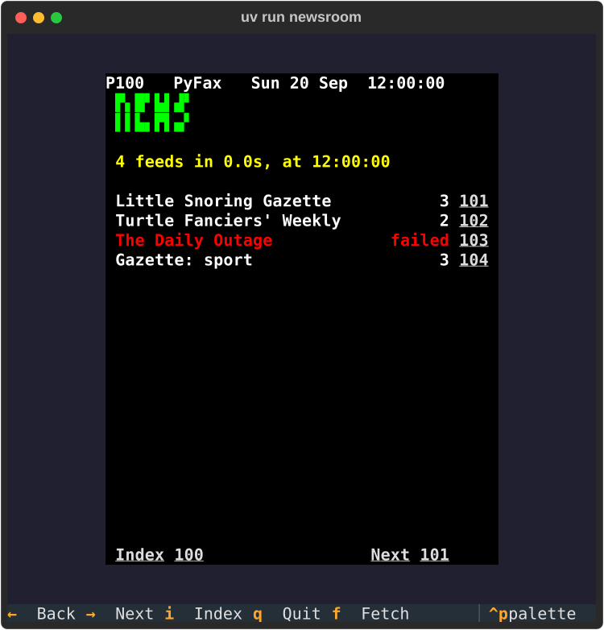
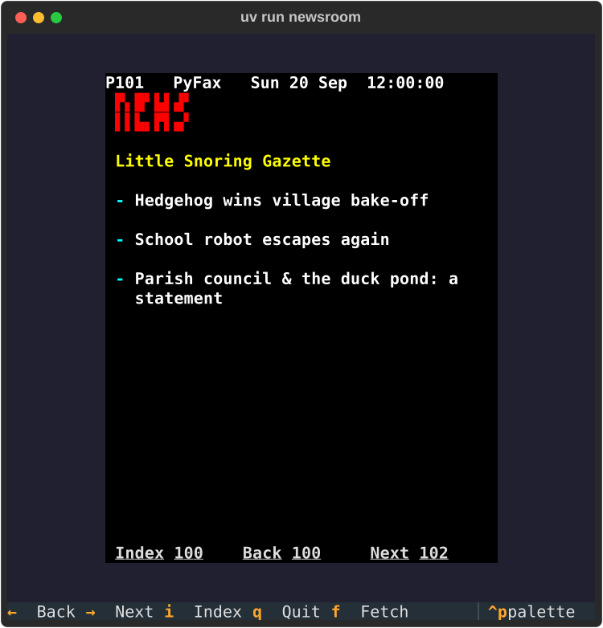

# Project 25 · Newsroom

Ceefax had a newsroom: a floor of journalists, watching the wires, and rewriting the day's events into four paragraphs of thirty-nine characters. Your teletext viewer has a folder of files. In this project it gets the wires.



Nearly every news site, blog and podcast publishes a **feed**: a small file of XML, with its latest headlines in it. The newsroom follows a list of them. It fetches them all, makes a teletext page out of each, and does it again every five minutes, while you go on reading, with the clock ticking in the corner.

Fetching a feed takes a fifth of a second or so, and nearly all of that is *waiting*: for a server on another continent to notice you, and reply. A dozen feeds, one after another, is a dozen waits. **There's no reason to wait for them one at a time.** Ask for them all, and then wait once. That's what `asyncio` is for. You've had two glimpses of it, in Project 22's stream of events, and in the pilot that tested Project 24. This is the proper introduction, and it ends with the question that everybody asks sooner or later: threads, processes or async? And what's this GIL that people complain about?

| | |
|---|---|
| **You'll learn** | asyncio properly: coroutines, the event loop, tasks, `gather`, **`TaskGroup`**, **exception groups** and `except*`, cancellation, time-outs, semaphores, queues; async httpx; Textual's workers; **threads, processes and async**: which is for what; the GIL, and free-threaded Python |
| **New tool skills** | Async tests with pytest-asyncio; asyncio's debug mode |
| **Time** | 6 to 7 hours |
| **Before you start** | [Project 24](p24-teletext-viewer.md), whose viewer this one extends |

## Predict

!!! question "Predict"
    ```python
    import asyncio


    async def headline():
        return "Hedgehog wins"


    async def main():
        forgotten = headline()
        print(type(forgotten).__name__)
        print(await forgotten)


    asyncio.run(main())
    ```

??? success "Answer"
    ```text
    coroutine
    Hedgehog wins
    ```

    Calling an `async def` function **doesn't run it**. It gives you a *coroutine*: an object that stands for the work, not yet begun. It's a generator function's behaviour, from Project 6, and the resemblance isn't a coincidence. `await` is what runs it, and hands you the result. Forget the `await`, and you have a coroutine where you wanted a string, and Python will warn you, as it exits, that it "was never awaited". Stage 2.

!!! question "Predict"
    ```python
    import asyncio


    async def fetch(name, seconds):
        print("asking for", name)
        await asyncio.sleep(seconds)
        print(name, "has arrived")
        return name


    async def main():
        results = await asyncio.gather(fetch("news", 0.2), fetch("sport", 0.1))
        print(results)


    asyncio.run(main())
    ```

??? success "Answer"
    ```text
    asking for news
    asking for sport
    sport has arrived
    news has arrived
    ['news', 'sport']
    ```

    Both are asked for before either arrives. Each `fetch` runs until it reaches an `await` that has to wait, and at that point it *steps aside*, and the other gets a turn. Sport arrives first, since it's quicker. The results, though, come back in the order that you asked, and not the order that they finished, which is nearly always what you want. Stage 2.

!!! question "Predict"
    ```python
    import asyncio


    async def fetch(name, seconds):
        try:
            await asyncio.sleep(seconds)
        except asyncio.CancelledError:
            print(name, "was cancelled")
            raise
        if name == "sport":
            raise ValueError("sport is down")
        print(name, "has arrived")


    async def main():
        try:
            async with asyncio.TaskGroup() as group:
                group.create_task(fetch("news", 0.1))
                group.create_task(fetch("sport", 0.2))
                group.create_task(fetch("weather", 0.3))
        except* ValueError as errors:
            print("Failed:", [str(error) for error in errors.exceptions])


    asyncio.run(main())
    ```

??? success "Answer"
    ```text
    news has arrived
    weather was cancelled
    Failed: ['sport is down']
    ```

    A `TaskGroup` is a family of tasks that stand or fall together. News finished. Sport failed, and so the group **cancelled** weather, which was still waiting, and which was told so by an exception raised *at its `await`*. Then the group raised what went wrong. Since several tasks might have failed at once, what it raises is an **exception group**, and `except*`, with a star, is the syntax for catching one. Stage 2.

## Build

```console
$ cd making
$ uv init newsroom
$ cd newsroom
$ uv add "textual>=8,<9" httpx
$ uv add --editable ../pyfax
$ uv add --editable ../teleview
$ uv add --dev pytest ruff pyright pytest-asyncio
$ code .
```

You know what strict pyright will say about a package that hasn't got a `py.typed` in it, and `teleview` hasn't. Put one in. Then add the strict `[tool.pyright]` table here.

### Stage 1: Feeds

There are two formats of feed, RSS and Atom, which came out of a quarrel in the early 2000s that nobody now remembers the point of. Both are XML, and you met `ElementTree` in Project 18. An RSS feed has `<item>`s, each with a `<title>` and a `<link>`. An Atom feed has `<entry>`s, whose `<link>` keeps its address in an attribute, and every one of its tags is in a *namespace*, which `ElementTree` writes in curly brackets on the front, as it did for SVG. Create `src/newsroom/feeds.py`:

<!-- listing: projects/25-newsroom/src/newsroom/feeds.py -->
```python title="src/newsroom/feeds.py"
"""Reading a news feed. There are two formats in the wild, RSS and Atom, and both are XML."""

import tomllib
import xml.etree.ElementTree as ET
from dataclasses import dataclass
from pathlib import Path

ATOM = "{http://www.w3.org/2005/Atom}"


class FeedError(Exception):
    """A feed that couldn't be fetched, or made no sense when it arrived."""


@dataclass(frozen=True, slots=True)
class Feed:
    name: str
    url: str


@dataclass(frozen=True, slots=True)
class Story:
    title: str
    link: str


def parse(xml: str) -> list[Story]:
    """Return the stories in a feed, newest first, as the feed had them."""
    try:
        root = ET.fromstring(xml)
    except ET.ParseError as error:
        raise FeedError(f"it isn't XML: {error}") from error

    if root.tag == "rss":
        items = root.iter("item")
        return [
            Story(tidy(item.findtext("title")), tidy(item.findtext("link")))
            for item in items
        ]
    if root.tag == f"{ATOM}feed":
        stories: list[Story] = []
        for entry in root.iter(f"{ATOM}entry"):
            link = entry.find(f"{ATOM}link")
            address = link.get("href", "") if link is not None else ""
            stories.append(Story(tidy(entry.findtext(f"{ATOM}title")), address))
        return stories
    raise FeedError(f"it's XML, but it isn't a feed: <{root.tag}>")


def tidy(text: str | None) -> str:
    """Turn any run of white space into one space. A missing title is an empty one."""
    return " ".join((text or "").split())


def load_feeds(path: Path) -> list[Feed]:
    """Read the list of feeds to follow, from a TOML file."""
    with path.open("rb") as file:
        data = tomllib.load(file)
    match data:
        case {"feeds": [*entries]}:
            pass
        case _:
            raise FeedError(f"{path.name} should have some [[feeds]] in it")
    feeds: list[Feed] = []
    for entry in entries:
        match entry:
            case {"name": str(name), "url": str(url)}:
                feeds.append(Feed(name, url))
            case _:
                raise FeedError(
                    f"every feed needs a name and a url, and this has {entry}"
                )
    return feeds
```

There's nothing new in it, and that's worth a moment's notice: parsing two formats of XML, with proper errors, and a configuration file checked with `match`, is now an easy half-page.

The list of feeds is a TOML file. Create `feeds.toml`, beside `pyproject.toml`, with these to start you off, and then add your own.

<!-- listing: projects/25-newsroom/feeds.toml -->
```toml title="feeds.toml"
# The feeds that the newsroom follows. Add your own: most news sites, blogs and
# podcasts have one, and it's usually linked from the bottom of the front page.

[[feeds]]
name = "BBC News"
url = "https://feeds.bbci.co.uk/news/rss.xml"

[[feeds]]
name = "BBC Technology"
url = "https://feeds.bbci.co.uk/news/technology/rss.xml"

[[feeds]]
name = "BBC Science"
url = "https://feeds.bbci.co.uk/news/science_and_environment/rss.xml"

[[feeds]]
name = "NASA"
url = "https://www.nasa.gov/feed/"

[[feeds]]
name = "Python Insider"
url = "https://blog.python.org/feeds/posts/default"

[[feeds]]
name = "PyPI: new projects"
url = "https://pypi.org/rss/packages.xml"

[[feeds]]
name = "xkcd"
url = "https://xkcd.com/atom.xml"

[[feeds]]
name = "The Register"
url = "https://www.theregister.com/headlines.atom"
```

The tests want feeds that never change, and so there are two made-up ones in `tests/feeds/`, one of each kind: the *Little Snoring Gazette*, and *Turtle Fanciers' Weekly*. Write your own, or take them from the tutorial's repository.

!!! success "Checkpoint"
    ```console
    $ git add .
    $ git commit -m "Parse RSS and Atom feeds"
    ```

### Stage 2: All at once

#### What `async` is

An ordinary function runs from its top to its bottom, and nothing else in the program happens until it returns. When it's waiting for a server, the whole program waits with it.

An **`async def`** function, which is called a **coroutine**, may have **`await`**s in it. Each `await` means: *I need this, it may take a while, and I've nothing to do until it comes. Let somebody else run.* There's a scheduler, called the **event loop**, which keeps a list of everybody who's waiting, and for what. When a coroutine steps aside, the loop finds another that's ready, and runs *that* until it steps aside in its turn. When the reply that the first was waiting for arrives, it becomes ready again, and carries on from where it left off, with all its variables as they were.

**One thing runs at a time.** There's one thread, and no parallelism. It's called *cooperative* multitasking, and it's how every home computer's operating system worked, once: each task runs until it *chooses* to give way. The whole benefit is that **waiting overlaps**. If your program spends its life waiting for the network, that's everything. If it spends its life doing arithmetic, it's nothing, and Stage 6 is for you.

That was the second Predict. `asyncio.run(main())` starts an event loop, runs one coroutine to its end, and closes the loop. It's the bridge from ordinary code into async code, and a program has one of them, at the top.

#### Asking for a feed

httpx, from Project 20, has an async client, whose methods are coroutines. Here's a first version of `src/newsroom/fetch.py`:

<!-- listing: projects/25-newsroom/stages/stage2_fetch.py -->
```python title="src/newsroom/fetch.py"
"""Fetching every feed at once. (Stage 2: all or nothing.)"""

import asyncio

import httpx

from newsroom.feeds import Feed, FeedError, Story, parse


async def fetch_one(client: httpx.AsyncClient, feed: Feed) -> list[Story]:
    """Fetch one feed, and parse it. Anything that goes wrong is a FeedError."""
    try:
        response = await client.get(feed.url, follow_redirects=True)
        response.raise_for_status()
    except httpx.HTTPError as error:
        raise FeedError(f"{type(error).__name__}: {error}") from error
    return parse(response.text)


async def fetch_all(client: httpx.AsyncClient, feeds: list[Feed]) -> list[list[Story]]:
    """Fetch all the feeds at once. If any of them fails, the whole thing fails."""
    async with asyncio.TaskGroup() as group:
        tasks = [group.create_task(fetch_one(client, feed)) for feed in feeds]
    return [task.result() for task in tasks]
```

**`await client.get(…)`** is the point. The request is sent, and then this coroutine steps aside until the reply has come. Everything else in `fetch_one` is Project 20's: a status that's turned into an exception, and one kind of error for callers to think about.

**`group.create_task(…)`** wraps a coroutine in a **task**, and hands it to the event loop *to be started as soon as possible*. It doesn't wait. So the comprehension starts a task for every feed, in a moment, and then the `async with` block ends, and **the end of the block is where the waiting is done**: a `TaskGroup` doesn't let go until every task in it has finished. After that, each task has a `result()`.

| | |
|---|---|
| `await coroutine()` | run it, and wait for it, here. Nothing overlaps |
| `asyncio.create_task(coroutine())` | start it in the background, and carry on. Keep hold of the task, since an event loop only keeps a weak grip on it |
| `await asyncio.gather(a(), b(), c())` | start them all, wait for them all, and get a list of results, in order |
| `async with asyncio.TaskGroup() as group:` | the same, with better manners when something goes wrong. **Prefer this** |

#### When something goes wrong

What should happen if the third feed of twelve fails? With `gather`, by default, the exception comes out, and *the other eleven tasks carry on in the background*, with nobody waiting for them, and nobody to hear if they fail too. It's easy to leak tasks in that way.

A `TaskGroup` is strict, and that was the third Predict. **If any task fails, the rest are cancelled, the group waits until they've all stopped, and then it raises.** Nothing is left running. It's called *structured concurrency*: the tasks can't outlive the block that made them, as a local variable can't outlive its function.

What's raised is an **`ExceptionGroup`**, since two tasks might fail in the same instant, and neither ought to be thrown away. **`except*`** catches by type from inside one: `except* FeedError` handles every `FeedError` in the group, as a smaller group, and lets anything else carry on upwards. You can have an `except* FeedError` and an `except* TimeoutError` on one `try`, and both may run.

**Cancellation** is an exception too. When a task is cancelled, `asyncio.CancelledError` is raised inside it, *at whichever `await` it's paused at*. It travels up like any exception, running every `finally` and closing every `with` on its way, which is how a cancelled task clears up after itself. There's one rule: **if you catch it, raise it again.** A task that swallows its cancellation can't be stopped.

!!! note "Under the bonnet"
    `CancelledError` inherits from `BaseException`, and not from `Exception`, precisely so that a careless `except Exception:` won't swallow it. `KeyboardInterrupt` is kept apart in the same way, for the same reason.

### Stage 3: A newsroom can't be all or nothing

Strictness is the right default. It's the wrong behaviour for a newsroom. If one feed in a dozen is down, and on any day one will be, you want the other eleven. A missing feed isn't an error in the *program*. It's an ordinary outcome, and ordinary outcomes should be **values**, and not exceptions. Replace `fetch.py` with its final form:

<!-- listing: projects/25-newsroom/src/newsroom/fetch.py -->
```python title="src/newsroom/fetch.py"
"""Fetching every feed at once, politely, and without letting one failure spoil the rest."""

import asyncio
import logging
import time
from dataclasses import dataclass, field

import httpx

from newsroom.feeds import Feed, FeedError, Story, parse

log = logging.getLogger(__name__)


@dataclass(frozen=True, slots=True)
class Result:
    """How one feed went: its stories, or else what went wrong."""

    feed: Feed
    stories: list[Story] = field(default_factory=list[Story])
    problem: str = ""
    seconds: float = 0.0


async def fetch_one(client: httpx.AsyncClient, feed: Feed) -> list[Story]:
    """Fetch one feed, and parse it. Anything that goes wrong is a FeedError."""
    try:
        response = await client.get(feed.url, follow_redirects=True)
        response.raise_for_status()
    except httpx.HTTPError as error:
        raise FeedError(f"{type(error).__name__}: {error}") from error
    return parse(response.text)


async def attempt(
    client: httpx.AsyncClient, feed: Feed, turnstile: asyncio.Semaphore, patience: float
) -> Result:
    """Fetch one feed, a few at a time, within a time limit, and never raise."""
    async with turnstile:
        started = time.perf_counter()
        try:
            async with asyncio.timeout(patience):
                stories = await fetch_one(client, feed)
        except FeedError as error:
            return Result(
                feed, problem=str(error), seconds=time.perf_counter() - started
            )
        except TimeoutError:
            problem = f"no answer in {patience:g} seconds"
            return Result(feed, problem=problem, seconds=time.perf_counter() - started)
        return Result(feed, stories, seconds=time.perf_counter() - started)


async def fetch_all(
    client: httpx.AsyncClient, feeds: list[Feed], at_once: int = 4, patience: float = 10
) -> list[Result]:
    """Fetch all the feeds, no more than a few at a time. Return a result for each."""
    turnstile = asyncio.Semaphore(at_once)
    async with asyncio.TaskGroup() as group:
        tasks = [
            group.create_task(attempt(client, feed, turnstile, patience))
            for feed in feeds
        ]
    results = [task.result() for task in tasks]
    failed = sum(1 for result in results if result.problem)
    log.info("Fetched %d feeds, of which %d failed", len(results), failed)
    return results
```

**`attempt` never raises.** It returns a `Result`, which holds either the stories or the problem. It's Project 20's weather page, which was a page whether or not there was a forecast. Since no task in the group can fail, the group never cancels anything. The `TaskGroup` is still earning its keep: if `fetch_all` *itself* is cancelled, because the user has left, every request inside it is cancelled too. There's a test for that.

**`async with asyncio.timeout(patience):`** is a time-out for a block. If the block hasn't finished in time, whatever it's waiting for is cancelled, and the block raises `TimeoutError`. The httpx client has time-outs of its own, for each stage of a request. This one covers the whole attempt, however many stages and redirects it took.

**`asyncio.Semaphore(at_once)`** is a turnstile. You could start a thousand requests in the same instant, and you shouldn't: it's rude to a server, and it'll get you blocked. A semaphore that's made with 4 lets four coroutines through its `async with`, and makes the fifth wait until one of them comes out. Every task is *started* at once, and at most four are ever *fetching*.

`time.perf_counter()` brackets each attempt, so that the index can say how long everything took, and the tests can prove that the waiting overlapped.

### Stage 4: Testing async code

A test is a function, and pytest calls it. If the test is an `async def`, calling it produces a coroutine, and nothing else happens, which was the first Predict. **pytest-asyncio** is a plug-in that runs such tests in an event loop. Add one line to `pyproject.toml`, in the `[tool.pytest]` table:

```toml
asyncio_mode = "auto"
```

Now any test that's written as `async def` is run properly, and may `await`. Fixtures can be async too. `tests/conftest.py`:

<!-- listing: projects/25-newsroom/tests/conftest.py -->
```python title="tests/conftest.py"
import asyncio
from pathlib import Path

import httpx
import pytest

from newsroom.feeds import Feed

FEEDS = Path(__file__).parent / "feeds"

GAZETTE = Feed("Gazette", "https://gazette.example/rss")
TURTLES = Feed("Turtles", "https://turtles.example/atom")
BROKEN = Feed("Broken", "https://broken.example/feed")
ASLEEP = Feed("Asleep", "https://asleep.example/feed")


class FakeWeb:
    """Stands in for the internet. Every reply takes a while, as real ones do."""

    def __init__(self, delay: float = 0.05) -> None:
        self.delay = delay
        self.busy = 0
        self.busiest = 0
        self.asked: list[str] = []

    async def __call__(self, request: httpx.Request) -> httpx.Response:
        self.asked.append(request.url.host)
        self.busy += 1
        self.busiest = max(self.busiest, self.busy)
        try:
            return await self.reply(request.url.host)
        finally:
            self.busy -= 1

    async def reply(self, host: str) -> httpx.Response:
        if host == "asleep.example":
            await asyncio.sleep(60)
        await asyncio.sleep(self.delay)
        if host == "gazette.example":
            return httpx.Response(200, text=(FEEDS / "hedgehog.rss").read_text("utf-8"))
        if host == "turtles.example":
            return httpx.Response(200, text=(FEEDS / "turtle.atom").read_text("utf-8"))
        return httpx.Response(503, text="Service unavailable")


@pytest.fixture
def web() -> FakeWeb:
    return FakeWeb()


@pytest.fixture
async def client(web: FakeWeb):
    """An async fixture: it has an `async with` in it, and the test gets what it yields."""
    async with httpx.AsyncClient(transport=httpx.MockTransport(web)) as client:
        yield client
```

**`FakeWeb`** is Project 20's `MockTransport`, grown up. Its handler is an `async def`, and so it can `await asyncio.sleep(…)`, and **take time to reply, as a real server does**, without any real time being wasted, or any network being touched. That's what makes it possible to test the *timing*. It also counts how many requests are in progress at once, which no real server would tell you.

**`client`** is an async fixture: an `async def` with a `yield` in it. It's the fixture with clearing-up that you've known since Project 20, and the clearing-up can now `await`.

`tests/test_fetch.py`:

<!-- listing: projects/25-newsroom/tests/test_fetch.py -->
```python title="tests/test_fetch.py"
async def test_twelve_feeds_take_about_as_long_as_one(client, web: FakeWeb):
    web.delay = 0.1
    feeds = [Feed(f"Gazette {n}", GAZETTE.url) for n in range(12)]
    started = time.perf_counter()
    results = await fetch_all(client, feeds, at_once=12)
    took = time.perf_counter() - started
    assert len(results) == 12
    assert took < 0.5  # and not 12 x 0.1 = 1.2 seconds
    assert sum(result.seconds for result in results) > 1.0


async def test_no_more_than_a_few_at_a_time(client, web: FakeWeb):
    feeds = [Feed(f"Gazette {n}", GAZETTE.url) for n in range(12)]
    await fetch_all(client, feeds, at_once=3)
    assert web.busiest == 3
    assert len(web.asked) == 12


async def test_one_bad_feed_does_not_spoil_the_others(client):
    good, bad, also_good = await fetch_all(client, [GAZETTE, BROKEN, TURTLES])
    assert (len(good.stories), len(also_good.stories)) == (3, 2)
    assert bad.stories == []
    assert "503" in bad.problem


async def test_a_feed_that_never_answers_is_given_up_on(client):
    started = time.perf_counter()
    slow, quick = await fetch_all(client, [ASLEEP, GAZETTE], patience=0.2)
    assert time.perf_counter() - started < 1
    assert slow.problem == "no answer in 0.2 seconds"
    assert len(quick.stories) == 3
# ...
async def test_cancelling_the_whole_fetch_cancels_every_part_of_it(
    client, web: FakeWeb
):
    task = asyncio.create_task(fetch_all(client, [ASLEEP, ASLEEP, ASLEEP], patience=60))
    await asyncio.sleep(0.05)
    assert web.busy == 3
    task.cancel()
    with pytest.raises(asyncio.CancelledError):
        await task
    assert web.busy == 0
```

Read those as the specification of `fetch_all`. Twelve feeds that take a tenth of a second each are all fetched within half a second, and the *sum* of their times is more than a second: the waiting overlapped. With `at_once=3`, the fake web never saw more than three at a time. A broken feed doesn't spoil its neighbours. A feed that never answers is given up on, and costs nobody else anything. And when the whole fetch is cancelled, the number of requests in progress goes to nought.

!!! success "Checkpoint"
    ```console
    $ uv run pytest
    $ git add .
    $ git commit -m "Fetch every feed at once, politely, with time-outs, and test the timing"
    ```

### Stage 5: The newsroom

The results have to become pages. Create `src/newsroom/pages.py`, which is Project 19's craft, and has no `async` in it anywhere:

<!-- listing: projects/25-newsroom/src/newsroom/pages.py -->
```python title="src/newsroom/pages.py"
"""Turning what was fetched into teletext pages."""

import textwrap
from datetime import date

from pyfax import COLUMNS, Colour, Page
from pyfax.content import frame

from newsroom.fetch import Result

INDEX = 100
FIRST = 101
WIDTH = COLUMNS - 4


def feed_page(number: int, result: Result, today: date, last: int) -> Page:
    """Make the page for one feed: as many headlines as there's room for."""
    before = number - 1
    after = number + 1 if number < last else None
    page = Page(number, result.feed.name, "news", before, after)
    frame(page, today, "news", Colour.RED)
    page.write(4, 1, result.feed.name[: COLUMNS - 2], Colour.YELLOW)
    if result.problem:
        page.write(6, 1, "This feed couldn't be fetched:", Colour.WHITE)
        for offset, line in enumerate(textwrap.wrap(result.problem, COLUMNS - 2)[:6]):
            page.write(8 + offset, 1, line, Colour.RED)
        return page

    row = 6
    for story in result.stories:
        lines = textwrap.wrap(story.title, WIDTH)[:3]
        if row + len(lines) > 22:
            break
        page.write(row, 1, "-", Colour.CYAN)
        for offset, line in enumerate(lines):
            page.write(row + offset, 3, line, Colour.WHITE)
        row += len(lines) + 1
    return page


def index_page(results: list[Result], today: date, note: str) -> Page:
    """Make page 100: every feed, with its page number, or with what went wrong."""
    page = Page(INDEX, "Newsroom", after=FIRST if results else None)
    frame(page, today, "news", Colour.GREEN)
    page.write(4, 1, note[: COLUMNS - 2], Colour.YELLOW)
    for offset, result in enumerate(results[:16]):
        number = FIRST + offset
        colour = Colour.RED if result.problem else Colour.WHITE
        name = result.feed.name[: COLUMNS - 12]
        count = "failed" if result.problem else f"{len(result.stories):3}"
        page.write(6 + offset, 1, f"{name:<{COLUMNS - 12}}{count:>6}", colour)
        page.write(6 + offset, COLUMNS - 4, str(number), Colour.CYAN, link=number)
    return page


def site(results: list[Result], today: date, note: str) -> list[Page]:
    """Return every page: the index, and then one for each feed."""
    last = FIRST + len(results) - 1
    pages = [index_page(results, today, note)]
    for offset, result in enumerate(results):
        pages.append(feed_page(FIRST + offset, result, today, last))
    return pages
```

And the application is a subclass of last project's viewer. Create `src/newsroom/app.py`:

<!-- listing: projects/25-newsroom/src/newsroom/app.py -->
```python title="src/newsroom/app.py"
"""A teletext newsroom: a dozen live feeds, fetched at once, with asyncio."""

import argparse
import time
from collections.abc import Callable
from datetime import datetime
from pathlib import Path
from typing import ClassVar

import httpx
from teleview.app import Viewer, local_time
from teleview.glyphs import GLYPHS
from textual import work
from textual.binding import Binding, BindingType

from newsroom.feeds import Feed, FeedError, load_feeds
from newsroom.fetch import fetch_all
from newsroom.pages import site

AGENT = {"User-Agent": "newsroom/0.1 (a tutorial project)"}


class Newsroom(Viewer):
    """Project 24's viewer, whose pages are fetched, and fetched again every so often."""

    BINDINGS: ClassVar[list[BindingType]] = [
        *Viewer.BINDINGS,
        Binding("f", "fetch", "Fetch"),
    ]

    def __init__(
        self,
        feeds: list[Feed],
        client: httpx.AsyncClient,
        every: float = 300,
        clock: Callable[[], datetime] = local_time,
        glyph: Callable[[int], str] = GLYPHS["sextant"],
    ) -> None:
        super().__init__(site([], clock().date(), "Fetching the news..."), clock, glyph)
        self.feeds = feeds
        self.client = client
        self.every = every

    def on_mount(self) -> None:
        super().on_mount()
        self.action_fetch()
        self.set_interval(self.every, self.action_fetch)

    @work(exclusive=True)
    async def action_fetch(self) -> None:
        """Fetch every feed, in the background, and then show what arrived."""
        started = time.perf_counter()
        results = await fetch_all(self.client, self.feeds)
        took = time.perf_counter() - started
        now = self.clock()
        note = f"{len(results)} feeds in {took:.1f}s, at {now:%H:%M:%S}"
        self.site = {page.number: page for page in site(results, now.date(), note)}
        if self.number not in self.site:
            self.number = 100
        self.watch_number(self.number)


def main() -> None:
    parser = argparse.ArgumentParser(description=__doc__)
    parser.add_argument("feeds", nargs="?", type=Path, default=Path("feeds.toml"))
    parser.add_argument("--every", type=float, default=300, metavar="SECONDS")
    parser.add_argument("--glyphs", choices=sorted(GLYPHS), default="sextant")
    args = parser.parse_args()
    try:
        feeds = load_feeds(args.feeds)
    except (OSError, FeedError, ValueError) as error:
        raise SystemExit(f"Can't read the list of feeds: {error}") from error

    client = httpx.AsyncClient(timeout=10, headers=AGENT)
    Newsroom(feeds, client, args.every, glyph=GLYPHS[args.glyphs]).run()
```

Set the command in `pyproject.toml` to `newsroom = "newsroom.app:main"`.

Textual is an asyncio program. Its event loop is the one that you've been reading about, and your handlers and actions may be `async def`. But there's a catch. If `action_fetch` were a plain coroutine, Textual would `await` it, and **while it waited, that handler would be occupied**, and the app would deal with nothing else that was sent to it.

**`@work`** is the answer. It turns the method into one that, when called, starts a **worker**, which is a task that Textual looks after, and returns at once. The fetching goes on in the background. The clock ticks, the keys work, and you can read page 101 while page 108 is on its way. When the results arrive, the worker puts the new pages in place, and asks for the screen to be brought up to date. **`exclusive=True`** means that starting a new fetch cancels one that's still going, so that an impatient finger on ++f++ can't set off ten at once.

`set_interval(self.every, self.action_fetch)` does it again every five minutes, for ever. And that's the whole of the difference between a viewer and a newsroom: forty lines, by inheritance, and the original wasn't touched.

!!! example "Run it"
    ```console
    $ uv run newsroom
    ```

    "Fetching the news…", and, within a second, the index. Type 1, 0, 1. Press ++f++ to fetch again, and watch the time on the index change, while the clock in the corner never misses a beat. If you see empty boxes, there's `--glyphs quadrant`. Try `--every 10`.

    When this chapter was written, eight real feeds came back in 0.61 seconds. Added together, their separate times were 1.52 seconds. Pull out your network cable, press ++f++, and see what a newsroom with no wires looks like: eight red lines, and no crash.

    

Last project's tests drove the app through `asyncio.run`. With pytest-asyncio, they can be what they always wanted to be. `tests/test_app.py`:

<!-- listing: projects/25-newsroom/tests/test_app.py -->
```python title="tests/test_app.py"
async def test_the_news_arrives_while_the_app_is_running(client):
    app = Newsroom([GAZETTE, BROKEN, TURTLES], client, clock=lambda: NOON)
    async with app.run_test(size=(60, 30)) as pilot:
        assert "Fetching the news" in app.site[100].text()
        await app.workers.wait_for_complete()
        await pilot.pause()

        index = app.site[100].text()
        assert "3 feeds in" in index
        assert "Gazette" in index
        assert "failed" in index
        assert sorted(app.site) == [100, 101, 102, 103]

        await pilot.press("1", "0", "1")
        assert app.number == 101
        assert "Hedgehog wins village bake-off" in app.site[101].text()
        assert "This feed couldn't be fetched" in app.site[102].text()
```

`await app.workers.wait_for_complete()` waits for the background work to finish, which is the async version of "and then".

!!! success "Checkpoint"
    ```console
    $ uv run pyright
    $ git add .
    $ git commit -m "Add the newsroom: live pages, fetched by a worker, every five minutes"
    $ git push
    ```

### Stage 6: Threads, processes, async, and the GIL

You now know three ways of doing several things at once, and it's time to set them side by side. There are two questions to ask of any piece of work. **Is it waiting, or is it computing?** And, if it's computing, **how many processor cores have you?**

Save this as `race.py`:

<!-- listing: projects/25-newsroom/race.py -->
```python title="race.py"
"""Threads, processes and asyncio, timed against each other, on two kinds of work.

uv run race.py                    # with the ordinary Python
uv run --python 3.14t race.py     # with the free-threaded one, which has no GIL
"""

import asyncio
import sys
import time
from concurrent.futures import ProcessPoolExecutor, ThreadPoolExecutor

JOBS = 4


def wait(seconds: float) -> float:
    """Work that's all waiting, as a request to a server is."""
    time.sleep(seconds)
    return seconds


def count_primes(limit: int) -> int:
    """Work that's all arithmetic. It never waits for anything."""
    return sum(all(n % d for d in range(2, int(n**0.5) + 1)) for n in range(2, limit))


async def wait_async(seconds: float) -> float:
    await asyncio.sleep(seconds)
    return seconds


async def all_at_once(seconds: float) -> None:
    await asyncio.gather(*(wait_async(seconds) for _ in range(JOBS)))


def timed(label: str, action) -> None:
    started = time.perf_counter()
    action()
    print(f"  {label:<22}{time.perf_counter() - started:5.2f} s")


def main() -> None:
    gil = getattr(sys, "_is_gil_enabled", lambda: True)()
    print(f"Python {sys.version.split()[0]}, {'with' if gil else 'WITHOUT'} the GIL")

    print(f"\n{JOBS} jobs that wait for half a second each:")
    timed("one after another", lambda: [wait(0.5) for _ in range(JOBS)])
    with ThreadPoolExecutor(JOBS) as pool:
        timed("threads", lambda: list(pool.map(wait, [0.5] * JOBS)))
    timed("asyncio", lambda: asyncio.run(all_at_once(0.5)))

    limit = 400_000
    print(f"\n{JOBS} jobs that count the primes below {limit:,}:")
    timed("one after another", lambda: [count_primes(limit) for _ in range(JOBS)])
    with ThreadPoolExecutor(JOBS) as pool:
        timed("threads", lambda: list(pool.map(count_primes, [limit] * JOBS)))
    with ProcessPoolExecutor(JOBS) as pool:
        timed("processes", lambda: list(pool.map(count_primes, [limit] * JOBS)))


if __name__ == "__main__":
    main()
```

`ThreadPoolExecutor` and `ProcessPoolExecutor`, from `concurrent.futures`, are the easy way in to threads and processes: a pool of workers, with a `map` that you use exactly as the built-in one, and which shares the jobs out. Here's what it printed on the laptop on which this chapter was written, which has cores to spare for four jobs:

```console
$ uv run race.py
Python 3.14.7, with the GIL

4 jobs that wait for half a second each:
  one after another      2.02 s
  threads                0.51 s
  asyncio                0.50 s

4 jobs that count the primes below 400,000:
  one after another      1.88 s
  threads                1.81 s
  processes              0.54 s
```

**For waiting, threads and asyncio are equally good**: four waits for the price of one.

**For computing, threads did nothing at all**, and processes were three and a half times faster. That needs explaining, and the explanation has a name.

#### The GIL

A **thread** is a second line of execution inside one program, sharing all of its memory. The operating system will happily run four threads on four cores at once. CPython won't let it. It has a lock, the **global interpreter lock**, and a thread must hold it to run any Python code at all. So however many threads you start, **only one of them is running Python at any moment**. The lock is there because it makes the interpreter's own bookkeeping simple and fast, the counting of references above all, and it's been there since 1992.

A thread *lets go* of the lock whenever it waits: for a file, a socket, a `sleep`. That's why threads work for waiting, and why `asyncio.to_thread`, and Project 23's `ThreadPoolExecutor` round a hundred runs of Git, were worth doing. It doesn't let go in the middle of arithmetic, and so four threads of arithmetic take turns on one core.

A **process** is a whole separate program, with its own interpreter, its own memory and *its own lock*. Four processes really do run on four cores. The price is that they share nothing. The arguments and the results have to be *pickled*, which is Python's way of turning objects into bytes, sent across, and unpickled, and starting a process takes a good deal longer than starting a thread. It's the right tool for big, independent lumps of computing.

#### Python without the GIL

For thirty years that was the whole story. It's changing. Since 3.13 there's been a second build of CPython, called **free-threaded**, which has no GIL, and as of 3.14 it's officially supported. uv will fetch it, and run the same file with it:

```console
$ uv run --no-project --python 3.14t race.py
Python 3.14.7, WITHOUT the GIL
...
4 jobs that count the primes below 400,000:
  one after another      1.87 s
  threads                0.56 s
  processes              0.53 s
```

(`--no-project` is there because `race.py` needs nothing but the standard library, and it saves uv from rebuilding the project's environment for a different Python.)

**Threads, computing in parallel, in Python**, as fast as processes, and with none of the pickling. It's not the default yet. Code that runs in one thread is a few per cent slower on it, and libraries with compiled parts have to be rebuilt for it, and not all of them have been. It's where the language is going. It also takes away a safety net: with real parallel threads, two of them *can* change the same list in the same instant, and the locks and queues that other languages' programmers have always needed become your business too.

#### Which to use

| The work is… | Use | Because |
|---|---|---|
| **Waiting** on many things: requests, sockets, timers | **asyncio** | one thread, no locks, and thousands of tasks cost almost nothing. But every library in the chain has to be async |
| Waiting, in a library that *isn't* async | **threads**: `asyncio.to_thread`, or `ThreadPoolExecutor` | a blocking call in a thread blocks only that thread |
| **Computing**, in big independent pieces | **processes**: `ProcessPoolExecutor` | one GIL each, and so real cores |
| Computing, on free-threaded Python | threads | real cores, and shared memory, and the care that goes with it |
| Computing on big arrays of numbers | **NumPy**, in one thread | its loops are in C, and they let go of the GIL anyway |
| Hardly anything at all | none of them | a plain loop is easier to write, test and debug than any of these. Measure first |

Asyncio has one more advantage, which is less obvious, and which experienced people value most. **A coroutine can only be interrupted at an `await`**, and you can see those. Between two awaits, nothing else can touch your data. A thread can be interrupted *anywhere*, between any two instructions. A whole class of the nastiest bugs in computing can't happen in async code, short of trying.

In Project 22, the game froze while it posted its score, and you were told to come back. `threading.Thread(target=post_score, args=("snake", score), daemon=True).start()` is all that it takes. A Pygame loop isn't async, the post is waiting and not computing, and nobody needs the answer at once. It's the second row of the table.

## Type-in listing

Here's the other classic shape of async program: a **queue** of jobs, and a few **workers** that take from it. It does the same job as the semaphore, from the other direction, and it's better when the jobs turn up over time, or make more jobs of their own, as a web crawler's do. Save it as `workers.py`.

<!-- listing: projects/25-newsroom/workers.py -->
```python title="workers.py" linenums="1"
import asyncio
import random


async def worker(name: str, jobs: asyncio.Queue[int], done: list[str]) -> None:
    while True:
        job = await jobs.get()
        await asyncio.sleep(random.uniform(0.1, 0.4))  # pretend to fetch something
        done.append(f"{name} did job {job}")
        print(done[-1])
        jobs.task_done()


async def main() -> None:
    jobs: asyncio.Queue[int] = asyncio.Queue()
    done: list[str] = []
    for job in range(1, 10):
        jobs.put_nowait(job)

    async with asyncio.TaskGroup() as group:
        staff = [group.create_task(worker(name, jobs, done)) for name in "ABC"]
        await jobs.join()  # wait until every job has been marked as done
        for member in staff:
            member.cancel()
    print(f"{len(done)} jobs, by three workers who never met")


asyncio.run(main())
```

1. Run it a few times. Does the same worker always get job 1? Are the jobs finished in order? Why not?
2. `await jobs.get()` on an empty queue doesn't fail. What does it do? What would the workers do, when the jobs ran out, if nothing stopped them?
3. `jobs.join()` waits for something. What? What's `task_done` for? Comment line 11 out.
4. The workers are cancelled on lines 23 and 24, and yet the `TaskGroup` doesn't raise. Look at the third Predict. What's different?
5. How long would nine jobs take one worker? And nine workers? What's the limit?

## Bug hunt

A colleague's newsroom freezes while it fetches. The clock stops, and the keys do nothing, for three seconds. "But I used `async` everywhere!" It's in the tutorial's repository, as `projects/25-newsroom/bughunt/frozen.py`. A heart beats ten times a second, as the app's clock would, while three feeds are fetched "at once".

```console
$ uv run bughunt/frozen.py
 0.0s  tick
 0.1s  tick
 0.2s  tick
 0.3s  asking for news
 1.3s  news has arrived
 1.3s  asking for weather
 2.3s  weather has arrived
 2.3s  asking for sport
 3.3s  sport has arrived
 3.3s  tick
 3.4s  tick
 3.5s  tick
```

1. **Reproduce it**, and read the times. There are *two* things wrong with that output. What are they?
2. **Ask Python.** asyncio has a debug mode, which complains about anything that holds the event loop for more than a tenth of a second: `uv run python -X dev bughunt/frozen.py`. What does it say, and about which line?
3. **Write a failing test.** A heart that beats in the background, and the longest gap between two beats, will do it.
4. **Fix it**, without rewriting `slow_download`, which you're to imagine belongs to somebody else.

??? success "Solution"
    The heart stops for three seconds, and the three fetches happen *one after another*: 1.3, 2.3, 3.3. Neither is what `gather` promised.

    ```text
    Executing <Task finished name='Task-3' coro=<fetch() done, defined at …/frozen.py:25> …> took 1.006 seconds
    ```

    `fetch` is an `async def`, and there isn't an `await` in it that waits for anything. It calls `slow_download`, which calls `time.sleep(1)`, which is an ordinary, **blocking** call. It doesn't step aside. It holds the one and only thread for a whole second, and the event loop, the heart, and the other two fetches can do nothing but wait for it. **Writing `async def` doesn't make code asynchronous. Only an `await` on something that really waits does.**

    In real life, `slow_download` is `requests.get`, or a database driver, or `subprocess.run`, or reading a big file: any library that was written before asyncio, or without it in mind. There are two cures. Use an async library in its place, as you did with httpx. Or, when you can't, send the blocking call to a thread:

    ```python
    async def fetch(name: str) -> str:
        return await asyncio.to_thread(slow_download, name)
    ```

    `to_thread` runs the function in a thread from a pool, and gives you something to `await`. The thread blocks. The event loop doesn't. It's the second row of Stage 6's table.

    **What to take from it.** In an async program, *every* call between two awaits holds up everybody. Anything slow, whether it's blocking I/O, a long calculation, or a `time.sleep` left in from a test, has to be awaited, or moved to a thread or a process. And `-X dev` is worth running from time to time, since it points straight at the line.

## Challenges

Make a branch for each, and merge it with a pull request.

**Tweak**

1. Add five feeds of your own. Find one that fails, and one that's slow, and see how each looks on the index.
2. Show each feed's time on the index, in place of its count of stories, when you press a key. Which was the slowest? Is it always?
3. Give long feeds a second page. Project 19's `before` and `after` are there to be used.

**Extend**

1. **Try again.** A feed that fails once has often only hiccuped. Write `with_retries(action, attempts=3)`, which calls an async function, and, if it fails, waits and tries again, doubling the wait each time. Make the waits a little random: look up "thundering herd" to see why. It's generic, and so it's a good one to type properly.
2. **Be polite.** A server can say "nothing's changed since you last asked", in three bytes, if you tell it what you had. Keep each feed's `ETag` header, send it back as `If-None-Match`, and deal with a **304**. Most of your fetches will become nearly free, for both of you.
3. **As they arrive.** At present the index appears when the *slowest* feed has finished. `asyncio.as_completed` hands results over as they come in. Show each feed the moment it lands. How will you keep the pages in a steady order?
4. **The weather's back.** Project 20's forecast came from an API, through a cache. Bring it across as page 301, fetched by the same worker. Which parts of `weather.py` have to become async, and which don't care?

??? tip "Hint for trying again"
    ```python
    async def with_retries[T](action: Callable[[], Awaitable[T]], attempts: int = 3) -> T:
    ```

    `Awaitable[T]` is "something that can be awaited, and gives a `T`". It takes a *function* that makes the coroutine, and not the coroutine, since a coroutine can only be awaited once.

**Invent**

1. **A crawler.** Start from one page, fetch it, find its links, and fetch those, to a depth of two, with no more than five requests at once, and never the same address twice. It's the type-in listing's queue, with workers that add to it. Respect `robots.txt`. The standard library can read one.
2. **Two newsrooms.** Run the high-score server from Project 22 and this side by side, and add a page that shows the top scores, live, from the server's stream of events. httpx can read a stream: `async with client.stream("GET", url) as response:`, and then `async for line in response.aiter_lines():`.
3. **Count words, fast.** Download a dozen long books from Project Gutenberg, and count the words in each. The downloading is waiting, and the counting is computing. Use the right tool for each half, measure, and then try it on `3.14t`.

A solution to the first Extend, and the bug hunt's tests, are in the project's `solutions/` folder.

## Recap

You can now:

- [x] explain coroutines, `await`, the event loop and tasks, and why only waiting overlaps
- [x] run things at once with `create_task`, `gather` and `TaskGroup`, and say why to prefer the last
- [x] catch exception groups with `except*`, and explain structured concurrency
- [x] handle cancellation properly, and never swallow `CancelledError`
- [x] put a time limit on a block with `asyncio.timeout`, and limit concurrency with a `Semaphore`
- [x] turn expected failures into values, so that one bad feed doesn't spoil the rest
- [x] use httpx's async client, and fake a slow web to test timing
- [x] write async tests and async fixtures with pytest-asyncio
- [x] run background work in a Textual app with `@work`
- [x] share work between tasks with an `asyncio.Queue`
- [x] choose between asyncio, threads and processes, from whether the work waits or computes
- [x] say what the GIL is, why threads don't speed up arithmetic, and what free-threaded Python changes
- [x] spot a blocking call in async code, find it with `-X dev`, and move it with `asyncio.to_thread`

**Read more:** [The asyncio documentation](https://docs.python.org/3/library/asyncio.html), and its [conceptual overview](https://docs.python.org/3/howto/a-conceptual-overview-of-asyncio.html) · [`concurrent.futures`](https://docs.python.org/3/library/concurrent.futures.html) · [Python support for free threading](https://docs.python.org/3/howto/free-threading-python.html) · [Notes on structured concurrency](https://vorpus.org/blog/notes-on-structured-concurrency-or-go-statement-considered-harmful/), by Nathaniel J. Smith, which is where `TaskGroup` came from, and is one of the best essays on programming of the last ten years · [Textual: workers](https://textual.textualize.io/guide/workers/) · [pytest-asyncio](https://pytest-asyncio.readthedocs.io/)

There's one project left in Part 5, and it's a homecoming. The text adventure from Project 5 has had a terminal, and a web page. In Project 26 it gets a third front end, in Textual, with a map that draws itself as you explore, and you'll look back over all three, and ask what it was about that little engine that made it so easy to move house.
