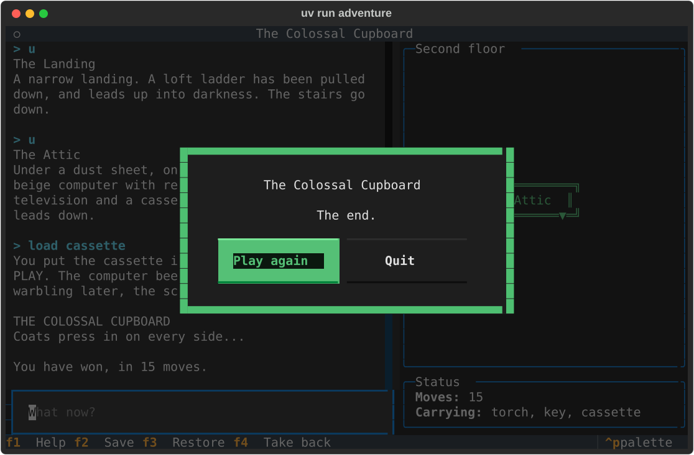

# Project 26 · Adventure, Third Edition

The adventures of the early 1980s came out in editions. There was the text-only one, which fitted in 16K. Then came the one with pictures, for the machines that had the memory. Then the de luxe one, on disc, with a map in the box.

The Colossal Cupboard has had two. Project 5's ran in a terminal, a line at a time. Project 21's ran in a browser. This is the third: a full-screen terminal application, with the story on one side, and on the other **a map that draws itself as you explore**. It has red function keys, as the computer in the attic has. F4 takes a move back.


Here's the remarkable thing. `engine.py`, which holds the rules of the game, was last changed in Project 5, and it isn't going to be changed now. It has been a terminal game, and a web site with several players at once, and it's about to be this, and it has never known the difference.

This project is about **why that worked**. It wasn't luck, and it isn't magic. It comes down to a few decisions about which part of a program is allowed to know about which, and they're the most valuable thing in this tutorial that isn't a feature of Python. Along the way you'll settle a question that's been open since Project 15: when there's an interface to describe, is it a `Protocol`, or an abstract base class?

| | |
|---|---|
| **You'll learn** | What makes code portable; **who owns an interface**: `Protocol` or ABC; `runtime_checkable`, and optional abilities; adapters; **which way dependencies point**, and dependency inversion; undo as a list of values; why `replace` is shallow; Textual's `Input`, `RichLog`, `@on`, modal screens that return an answer, and bindings that come and go |
| **New tool skills** | A test that reads your imports, with `ast`, and guards the architecture |
| **Time** | 5 to 6 hours |
| **Before you start** | [Project 5](../part-1-console/p05-colossal-cupboard.md), whose engine this uses; [Project 24](p24-teletext-viewer.md) and [Project 25](p25-newsroom.md). [Project 21](../part-4-web/p21-adventure-online.md) is referred to, and not needed |

## Predict

!!! question "Predict"
    ```python
    from typing import Protocol, runtime_checkable


    @runtime_checkable
    class Quacks(Protocol):
        def quack(self) -> str: ...


    class Duck:
        def quack(self) -> str:
            return "Quack"


    class Robot:
        quack = "beep"


    print(isinstance(Duck(), Quacks), isinstance(Robot(), Quacks), isinstance("duck", Quacks))
    ```

??? success "Answer"
    ```text
    True True False
    ```

    In Project 16 you were told that `isinstance` and a `Protocol` don't mix, unless the protocol is marked `@runtime_checkable`. With the mark, they do, and `Duck`, which inherits from nothing, passes. But so does `Robot`, whose `quack` isn't even a method. **At run time, the check is only that the names are there.** The arguments and the types are pyright's business, and pyright does them properly. Stage 2.

!!! question "Predict"
    ```python
    from abc import ABC, abstractmethod
    from typing import Protocol


    class Shape(ABC):
        @abstractmethod
        def area(self) -> float: ...


    class Sized(Protocol):
        def area(self) -> float: ...


    class Blob(Shape):
        pass


    class Cloud:
        pass


    def measure(thing: Sized) -> float:
        return thing.area()


    for make in (Blob, Cloud):
        try:
            print(measure(make()))
        except (TypeError, AttributeError) as error:
            print(type(error).__name__)
    ```

??? success "Answer"
    ```text
    TypeError
    AttributeError
    ```

    Neither class has an `area`, and they fail at different moments. `Blob` inherits from an **abstract base class**, which refuses to let an incomplete object be *made*: "Can't instantiate abstract class Blob without an implementation for abstract method 'area'". `Cloud` promised nothing to anybody. It's made without complaint, and it fails later, inside `measure`, when the method is wanted and isn't there. The `Protocol` did nothing at all at run time. It would have done its work earlier than either, in the editor, where pyright would have underlined `measure(Cloud())` before the program was run. Stage 6.

!!! question "Predict"
    ```python
    from dataclasses import dataclass, field, replace


    @dataclass(frozen=True)
    class State:
        room: str = "hall"
        bag: list[str] = field(default_factory=list)


    before = State()
    after = replace(before, room="attic")
    after.bag.append("torch")

    print(before.room, before.bag)
    print(before.bag is after.bag)
    ```

??? success "Answer"
    ```text
    hall ['torch']
    True
    ```

    `replace` made a new `State`, with a new `room`. It didn't make a new list. It's a **shallow** copy, as Project 4's were: both states hold *the same* `bag`, and what's put into one is found in the other. `frozen=True` doesn't help, since it stops you from assigning to `after.bag`, and not from changing the list that `after.bag` is. That's the bug hunt.

## Build

```console
$ cd making
$ uv init adventure
$ cd adventure
$ uv add "textual>=8,<9"
$ uv add --editable ../cupboard
$ uv add --dev pytest ruff pyright pytest-asyncio pytest-textual-snapshot
$ code .
```

In `pyproject.toml`, set the command to `adventure = "adventure.cli:main"`, put `asyncio_mode = "auto"` in `[tool.pytest]`, and make pyright strict.

### Stage 1: Two editions, side by side

Before you write the third front end, look at the first two. Here's the whole of the first edition's, from Project 5:

<!-- listing: projects/05-colossal-cupboard/src/cupboard/__init__.py -->
```python title="cupboard/__init__.py (Project 5)"
def main() -> None:
    state = State()
    show(describe(state))

    while not state.won:
        text = input("\n> ")
        match text.strip().lower():
            case "quit" | "q":
                break
            case "save":
                try:
                    save(state, SAVE_FILE)
                    show("Saved.")
                except SaveError as error:
                    show(str(error))
            case "restore":
                try:
                    state = load(SAVE_FILE)
                    show("Restored.\n" + describe(state))
                except SaveError as error:
                    show(str(error))
            case _:
                state, reply = respond(state, text)
                show(reply)

    show("Bye.")
```

And here's the heart of the second, from Project 21:

<!-- listing: projects/21-adventure-online/src/cupboard_web/views.py -->
```python title="cupboard_web/views.py (Project 21)"
@bp.post("/command")
def command() -> str | Response:
    check_token()
    text = request.form.get("text", "")[:LONGEST_COMMAND]
    state, reply = respond(current_state(), text)
    keep(state)

    if request.headers.get("HX-Request"):
        return render_template("_turn.html", text=text, reply=reply, state=state)
    flash(f"> {text}")
    flash(reply)
    return redirect(url_for("game.play"))
```

They could hardly look less alike, and they do the same five things. **Get some text. Find the state. Call `respond`. Keep the new state. Show the reply.** Everything else in each of them is about its medium.

| | Console | Web | This project |
|---|---|---|---|
| The text arrives | from `input()` | in a form, by POST | in a message, `Input.Submitted` |
| The state is kept | in a local variable | in each player's signed cookie | in a list, on an object |
| The reply is shown | by `print` | by a template, or a fragment for htmx | in a scrolling log |
| Who runs the loop | you: `while not state.won` | nobody. Every request starts from nothing | Textual |
| Several players at once | no | yes | no |

Think how different those are. The console's loop *is* the game, from start to finish. The web has no loop at all, and the server forgets you between one command and the next. Yet `respond` served both, unaltered. It could do that because of what it **doesn't** do, and there are five of those.

1. **It never prints, and never asks.** Text goes in as an argument, and comes out as a return value. A function that calls `input()` can only ever be used in a terminal.
2. **The state is one value, handed in and handed back.** There's no global, and nothing is remembered between calls. A web server *couldn't* have used an engine that kept the game in a module-level variable: Project 21's bug hunt was about a colleague who tried.
3. **It never changes the state that it's given.** It returns a new one. So a front end is free to keep the old one, or to compare them, or to throw the new one away.
4. **The state is plain data**: strings, numbers, a dictionary. `asdict` turns it into something that JSON can hold, and so it goes into a file as easily as into a cookie.
5. **It imports nothing but the standard library.** There's no Flask in it, and no Textual, and so it's at home anywhere that Python is.

None of those is difficult to do. All of them have to be done *on purpose*, and early, since they're the first things to be given up when there's only one front end, and a `print` inside the rules would be so convenient.

!!! example "Run it"
    In the folder of Project 5:

    ```console
    $ git log --oneline -- src/cupboard/engine.py
    ```

    How many commits have touched the rules?

### Stage 2: What does a front end need?

The new front end could import `cupboard`, as the other two did, and call `respond`. This time, aim higher: a front end for **any** text adventure. You'll want to write another game one day, and the map, the log and the red keys shouldn't have to be written again.

So turn the question round. Don't ask what the cupboard offers. Ask **what the front end needs**, and write that down. Create `src/adventure/game.py`:

<!-- listing: projects/26-adventure-third-edition/src/adventure/game.py -->
```python title="src/adventure/game.py"
"""What this front end needs from a game, and nothing more.

This module is the front end's half of a bargain. It imports no game, and no
game has to import it: anything with these methods will do.
"""

from dataclasses import dataclass
from pathlib import Path
from typing import Protocol, runtime_checkable


class Game(Protocol):
    """Something that can be played by typing at it."""

    @property
    def title(self) -> str: ...

    @property
    def over(self) -> bool: ...

    def opening(self) -> str:
        """Return what the player reads first."""
        ...

    def play(self, text: str) -> str:
        """Take one turn, and return the reply."""
        ...

    def status(self) -> dict[str, str]:
        """Return a few facts worth keeping in view, such as the number of moves."""
        ...


@dataclass(frozen=True, slots=True)
class Place:
    """A room on the map. `exits` holds letters from "nsewud"."""

    label: str
    x: int
    y: int
    floor: int = 0
    exits: str = ""


@dataclass(frozen=True, slots=True)
class Chart:
    """As much of the map as the player has seen, and where they are on it."""

    places: tuple[Place, ...]
    here: Place
    caption: str = ""


@runtime_checkable
class Mapped(Protocol):
    """A game that can say where the player has been."""

    def chart(self) -> Chart: ...


@runtime_checkable
class Undoable(Protocol):
    """A game that can take a move back."""

    def undo(self) -> str: ...


@runtime_checkable
class Saveable(Protocol):
    """A game that can be put away in a file, and got out again."""

    def save(self, path: Path) -> str: ...

    def restore(self, path: Path) -> str: ...
```

`Game` is a **`Protocol`**, as Project 16's `Canvas` was. It says: a title, a way to know when it's over, some opening words, a `play` that takes text and gives text, and a few facts for the side panel. Anything with those five is a game, as far as this front end is concerned. It needn't inherit from `Game`, or import it, or have heard of it.

A member that's written as a read-only property, as `title` is, can be provided as a property, or as an ordinary attribute. `title = "Parrot"`, in a class, will do.

**The protocol belongs to the code that *uses* it, and not to the code that provides it.** That's the opposite of how interfaces are usually thought of, and it's the point of this project. `game.py` is the front end's list of needs. It's short because the front end's needs are few, and whatever else a game can do is none of its business.

#### Optional abilities

Not every game will have a map, or be able to take a move back. Those are three more protocols, each with one job, and each marked **`@runtime_checkable`**, so that the app can ask:

```python
if isinstance(self.game, Mapped):
    yield MapPanel()
```

That was the first Predict, with its warning. `isinstance` looks for a `chart`, and doesn't look at what kind of thing it is. Pyright is more careful: inside that `if`, it *knows* that `self.game` has a `chart()` that returns a `Chart`, and checks your use of it. The two work together, one at run time and one before it.

Several small protocols are better than one large one. A game takes on the ones that it can honour, and the front end adapts. One big `Game` with `undo` in it would force every game either to be able to undo, or to pretend.

#### A game to test with

Since a game is anything of the right shape, you can have one at once. Create `tests/conftest.py`:

<!-- listing: projects/26-adventure-third-edition/tests/conftest.py -->
```python title="tests/conftest.py"
"""Things that every test file may want: a game to win, and a game to test with."""

WALKTHROUGH = [
    "s", "e", "take torch", "s", "examine flowerpots", "take key", "n", "w",
    "unlock door", "w", "take cassette", "e", "u", "u", "load cassette",
]  # fmt: skip


class Parrot:
    """The smallest game there could be. It inherits from nothing."""

    title = "Parrot"

    def __init__(self) -> None:
        self.heard: list[str] = []

    @property
    def over(self) -> bool:
        return "bye" in self.heard

    def opening(self) -> str:
        return "Pretty Polly."

    def play(self, text: str) -> str:
        self.heard.append(text)
        return f"Squawk! {text}!"

    def status(self) -> dict[str, str]:
        return {"Heard": str(len(self.heard))}
```

`Parrot` is twenty lines, inherits from nothing, and is all that's needed to build and test the entire front end **before the real game is connected to it**. When a test of the app fails with a parrot in it, you know that the fault isn't in the cupboard. A stand-in of that kind is called a *fake*, and being able to write one in a minute is a sign that an interface is the right size.

### Stage 3: A function, made into an object that remembers

The cupboard doesn't have a `play` method. It has a pure function, `respond(state, text)`, and it's staying that way. So something has to stand between the two, and speak to each in its own language. That's an **adapter**, and it's the only module in this project that knows both sides. Create `src/adventure/colossal.py`:

<!-- listing: projects/26-adventure-third-edition/src/adventure/colossal.py -->
```python title="src/adventure/colossal.py"
"""The Colossal Cupboard, made to fit. This is the only module that knows both sides."""

from collections import deque
from pathlib import Path

from cupboard.engine import State, describe, is_dark, respond, things_at
from cupboard.saves import SaveError, load, save
from cupboard.world import PLAYER, ROOMS, START, Direction, Room

from adventure.game import Chart, Place

STEPS = {
    Direction.NORTH: (0, -1, 0),
    Direction.SOUTH: (0, 1, 0),
    Direction.EAST: (1, 0, 0),
    Direction.WEST: (-1, 0, 0),
    Direction.UP: (0, 0, 1),
    Direction.DOWN: (0, 0, -1),
}
FLOORS = ["Ground floor", "First floor", "Second floor"]


def layout(rooms: dict[str, Room], start: str) -> dict[str, tuple[int, int, int]]:
    """Work out where every room is, by walking outwards from the first."""
    spots = {start: (0, 0, 0)}
    waiting = deque([start])
    while waiting:
        name = waiting.popleft()
        x, y, floor = spots[name]
        for direction, neighbour in rooms[name].exits.items():
            if neighbour not in spots:
                across, down, up = STEPS[direction]
                spots[neighbour] = (x + across, y + down, floor + up)
                waiting.append(neighbour)
    return spots


SPOTS = layout(ROOMS, START)


class Colossal:
    """The game as an object that remembers: its past is a list of states."""

    title = "The Colossal Cupboard"

    def __init__(self) -> None:
        self.history = [State()]

    @property
    def state(self) -> State:
        return self.history[-1]

    @property
    def over(self) -> bool:
        return self.state.won

    def opening(self) -> str:
        return describe(self.state)

    def play(self, text: str) -> str:
        after, reply = respond(self.state, text)
        if after != self.state:
            self.history.append(after)
        return reply

    def status(self) -> dict[str, str]:
        carrying = things_at(self.state, PLAYER)
        return {
            "Moves": str(self.state.moves),
            "Carrying": ", ".join(carrying) or "nothing",
        }

    def undo(self) -> str:
        if len(self.history) == 1:
            return "There's nothing to take back."
        self.history.pop()
        return "Taken back.\n" + describe(self.state)

    def chart(self) -> Chart:
        seen = {state.location for state in self.history if not is_dark(state)}
        places = {name: place(name) for name in seen}
        dark = Place("?", *SPOTS[self.state.location])
        return Chart(
            tuple(places.values()),
            places.get(self.state.location, dark),
            FLOORS[SPOTS[self.state.location][2]],
        )

    def save(self, path: Path) -> str:
        try:
            save(self.state, path)
        except SaveError as error:
            return str(error)
        return "Saved."

    def restore(self, path: Path) -> str:
        try:
            self.history = [load(path)]
        except SaveError as error:
            return str(error)
        return "Restored.\n" + describe(self.state)


def place(name: str) -> Place:
    """Return a room as the map wants it: a short label, a spot, and its exits."""
    exits = "".join(direction.value[0] for direction in ROOMS[name].exits)
    return Place(name.capitalize(), *SPOTS[name], exits)
```

#### The past is a list

`Colossal` keeps a **`history`**: every state that the game has been in. The present is `history[-1]`. A turn appends one. And so:

```python
self.history.pop()
```

is **undo**. All of it. There's no "reverse of take", and no "reverse of unlock", and none will ever need to be written for any command that's added later. It works because of the third of Stage 1's properties: `respond` never changes the state that it's given, and so every old state in the list is still exactly as it was. Undo is notoriously hard to add to a program that changes things in place. Here it's free.

The map falls out of the same list. The rooms you've seen are the `location`s of the states in your history, and when a move is taken back, the room comes off the map with it. Nothing has to keep the two in step, since there's only one of them.

`if after != self.state` uses the `==` that a dataclass writes for you. "Pardon?" doesn't change the state, and so nonsense isn't a move, and can't be taken back.

An object that remembers was easy to build from a pure function. **Going the other way is hard.** Given an engine that was an object full of hidden, changing state, you couldn't have got Project 21's engine-in-a-cookie out of it at any price.

#### Where the rooms are

The engine knows that the kitchen is *east* of the hall. It doesn't know *where* anything is, and a map needs to. `layout` works it out, by walking outwards from the first room, one step at a time: east is one to the right, up is one floor higher. Project 15's flood fill was a walk of this kind, with a list of cells that were waiting to be looked at. That one took the *newest* from the list. This one takes the *oldest*, and so it visits all the rooms that are one step away, then all those at two, and so on. It's called a **breadth-first search**, and Project 9's `deque`, with `append` at one end and `popleft` at the other, is its natural companion. For laying out a house, either order would do. Breadth-first is the habit to have, since it's also how you find the *shortest* way from one room to another, on the day that you add `go to kitchen`. It's run once, when the module is imported, since the house doesn't change.

It works because the house is sensible: go east and then west, and you're back where you were. The great adventures took pleasure in *not* being like that, and the last challenge is for them.

`save` and `restore` are Project 5's, with its errors turned into replies. Notice the file name that the app uses by default: `cupboard-save.json`, which is the first edition's. **Save in one edition, and restore in the other.** They share an engine, and so they share a format, and nobody had to arrange it.

`tests/test_colossal.py`:

<!-- listing: projects/26-adventure-third-edition/tests/test_colossal.py -->
```python title="tests/test_colossal.py"
def test_it_can_do_everything_that_the_front_end_might_ask():
    game: Game = Colossal()  # pyright checks this line, and pytest the next
    assert isinstance(game, Mapped)
    assert isinstance(game, Undoable)
    assert isinstance(game, Saveable)
# ...
def test_a_move_can_be_taken_back():
    game = Colossal()
    game.play("south")
    game.play("east")
    assert "Hall" in game.undo()
    assert game.status()["Moves"] == "1"
# ...
def test_the_map_grows_as_you_explore():
    game = Colossal()
    assert [place.label for place in game.chart().places] == ["Cupboard"]
    game.play("south")
    chart = game.chart()
    assert {place.label for place in chart.places} == {"Cupboard", "Hall"}
    assert chart.here.label == "Hall"
    assert chart.here.exits == "newu"
    assert chart.caption == "Ground floor"


def test_taking_a_move_back_takes_it_off_the_map():
    game = Colossal()
    game.play("south")
    game.undo()
    assert [place.label for place in game.chart().places] == ["Cupboard"]


def test_a_dark_room_is_a_question_mark():
    game = Colossal()
    for command in ["s", "u", "u"]:
        game.play(command)
    chart = game.chart()
    assert chart.here.label == "?"
    assert chart.here.exits == ""
    assert chart.caption == "Second floor"
# ...
def test_a_save_from_the_first_edition_will_do(tmp_path: Path):
    from cupboard.engine import State
    from cupboard.saves import save

    save(State(location="garden", moves=4), tmp_path / "save.json")
    game = Colossal()
    assert "The Garden" in game.restore(tmp_path / "save.json")
```

`game: Game = Colossal()` is a test for pyright, and not for pytest: if `Colossal` ever stops fitting the protocol, that line is underlined.

!!! success "Checkpoint"
    ```console
    $ uv run pytest
    $ uv run pyright
    $ git add .
    $ git commit -m "Describe what a front end needs, and adapt the cupboard to it"
    ```

### Stage 4: Drawing the map

Unicode has a block of **box-drawing characters**, from U+2500, which have been in every terminal font since the IBM PC: `┌ ─ ┐ │ └ ┘`, the junctions `├ ┤ ┬ ┴`, and the same again in double lines, `╔ ═ ╗ ║`, with junctions between the two kinds, `╟ ╢ ╤ ╧`. Unlike Project 24's sextants, these can be relied upon.

A room is ten characters wide and three high. A door is a junction in its wall. The room you're in has double walls. Create `src/adventure/chart.py`:

<!-- listing: projects/26-adventure-third-edition/src/adventure/chart.py -->
```python title="src/adventure/chart.py"
"""Drawing the map, in box-drawing characters. There's no Textual in here."""

from adventure.game import Chart, Place

WIDE = 10  # the width of a room, including its walls
PITCH = WIDE + 1  # from one room's left wall to the next one's
MIDDLE = WIDE // 2

# Corners, walls and doorways: single lines for a room, double for the one you're in.
SINGLE = "┌─┐│└┘┴┬├┤"
DOUBLE = "╔═╗║╚╝╧╤╟╢"


def draw(chart: Chart) -> list[str]:
    """Return the floor that the player is on, as lines of text."""
    rooms = [place for place in chart.places if place.floor == chart.here.floor]
    left = min(place.x for place in rooms)
    top = min(place.y for place in rooms)
    columns = (max(place.x for place in rooms) - left + 1) * PITCH + 1
    rows = (max(place.y for place in rooms) - top + 1) * 3
    grid = [[" "] * columns for _ in range(rows)]

    for place in rooms:
        lines = SINGLE if place != chart.here else DOUBLE
        room(grid, place, 1 + (place.x - left) * PITCH, (place.y - top) * 3, lines)
    return ["".join(row).rstrip() for row in grid]


def room(grid: list[list[str]], place: Place, x: int, y: int, lines: str) -> None:
    """Draw one room, with its top left-hand corner at column x of row y."""
    top_left, flat, top_right, upright, bottom_left, bottom_right, n, s, e, w = lines
    label = f"{place.label[: WIDE - 2]:^{WIDE - 2}}"
    top = top_left + flat * (WIDE - 2) + top_right
    bottom = bottom_left + flat * (WIDE - 2) + bottom_right
    for row, text in enumerate([top, upright + label + upright, bottom]):
        grid[y + row][x : x + WIDE] = text

    marks = {
        "n": (y, x + MIDDLE, n),
        "s": (y + 2, x + MIDDLE, s),
        "w": (y + 1, x, w),
        "e": (y + 1, x + WIDE - 1, e),
        "u": (y, x + WIDE - 3, "▲"),
        "d": (y + 2, x + WIDE - 3, "▼"),
    }
    for exit in place.exits:
        row, column, mark = marks[exit]
        grid[row][column] = mark
    # A passage to the east or west shows in the gap between two rooms.
    if "w" in place.exits:
        grid[y + 1][x - 1] = "─"
    if "e" in place.exits:
        grid[y + 1][x + WIDE] = "─"
```

The `grid` is a list of rows, each of them a list of single characters: a little screen, to be drawn on in any order, and joined up into strings at the end. `grid[y + row][x : x + WIDE] = text` assigns **a string to a slice of a list**: a string is a sequence of characters, and so each of them lands in its own place. `f"{label:^{width}}"` centres, and the width is itself in curly brackets, since a format can be built from values too.

A door to a room that you haven't visited yet is drawn as a loose end, `├─`, leading nowhere. It's what makes you want to go and look.

There's no Textual in this module, and no cupboard. It turns a `Chart` into a list of strings, and so its tests are pictures. `tests/test_chart.py`:

<!-- listing: projects/26-adventure-third-edition/tests/test_chart.py -->
```python title="tests/test_chart.py"
from adventure.chart import draw
from adventure.game import Chart, Place

CUPBOARD = Place("Cupboard", 0, 0, 0, "s")
HALL = Place("Hall", 0, 1, 0, "newu")
KITCHEN = Place("Kitchen", 1, 1, 0, "ws")
LANDING = Place("Landing", 0, 1, 1, "ud")


def test_one_room_with_a_door_to_the_south():
    assert draw(Chart((CUPBOARD,), CUPBOARD)) == [
        " ╔════════╗",
        " ║Cupboard║",
        " ╚════╤═══╝",
    ]


def test_the_room_you_are_in_has_double_walls_and_doors_join_up():
    assert draw(Chart((CUPBOARD, HALL, KITCHEN), HALL)) == [
        " ┌────────┐",
        " │Cupboard│",
        " └────┬───┘",
        " ╔════╧═▲═╗ ┌────────┐",
        "─╢  Hall  ╟─┤Kitchen │",
        " ╚════════╝ └────┬───┘",
    ]
```

!!! success "Checkpoint"
    ```console
    $ uv run pytest
    $ git add .
    $ git commit -m "Draw the map, in box-drawing characters"
    ```

### Stage 5: The app

Two small widgets first, each with one reactive attribute, in Project 24's manner. Give one a new value, and it redraws. Create `src/adventure/widgets.py`:

<!-- listing: projects/26-adventure-third-edition/src/adventure/widgets.py -->
```python title="src/adventure/widgets.py"
"""The panels at the side of the story: the map, and a few facts."""

from rich.text import Text
from textual.reactive import reactive
from textual.widgets import Static

from adventure.chart import draw
from adventure.game import Chart


class MapPanel(Static):
    """The floor that the player is on, redrawn whenever it's given a new chart."""

    chart: reactive[Chart | None] = reactive(None)

    def watch_chart(self, chart: Chart | None) -> None:
        if chart is not None:
            self.border_title = chart.caption or "Map"
            self.update("\n".join(draw(chart)))


class StatusPanel(Static):
    """A short list of names and values."""

    facts: reactive[dict[str, str]] = reactive(dict[str, str])

    def watch_facts(self, facts: dict[str, str]) -> None:
        lines = [
            Text.assemble((f"{name}: ", "bold"), value) for name, value in facts.items()
        ]
        self.update(Text("\n").join(lines))
```

`border_title` is text set into a widget's border, which is where the floor's name goes.

The stylesheet, `src/adventure/adventure.tcss`:

<!-- listing: projects/26-adventure-third-edition/src/adventure/adventure.tcss -->
```css title="src/adventure/adventure.tcss"
/* The story on the left, with the prompt beneath it, and the panels on the right. */

#story {
    width: 1fr;
}

#transcript {
    height: 1fr;
    padding: 0 1;
    scrollbar-size-vertical: 1;
}

#prompt {
    dock: bottom;
}

#side {
    width: 38;
}

MapPanel, StatusPanel {
    border: round $primary;
    border-title-color: $text;
    padding: 0 1;
}

MapPanel {
    height: 1fr;
    color: $success;
    content-align: center middle;
}

StatusPanel {
    height: auto;
}

TheEnd {
    align: center middle;
}

#ending {
    width: 44;
    height: auto;
    border: thick $success;
    background: $surface;
    padding: 1 2;
}

#ending Label {
    width: 100%;
    text-align: center;
    margin-bottom: 1;
}

#buttons {
    height: auto;
    align: center middle;
}

#buttons Button {
    margin: 0 1;
}
```

**`1fr`** is "one share of whatever's left". The side panel is 38 cells wide, and the story has the rest, however wide the terminal is. **`dock: bottom`** fixes the prompt to the bottom of its container. And `$primary`, `$success` and `$surface` are colours from the app's **theme**, and not particular colours. Use them, and your app changes with the theme: press ++ctrl+p++, which opens the command palette that every Textual app has, and type "theme".

And the app, `src/adventure/app.py`:

<!-- listing: projects/26-adventure-third-edition/src/adventure/app.py -->
```python title="src/adventure/app.py"
"""A full-screen front end for a text adventure. Which adventure, it doesn't know."""

from collections.abc import Callable
from pathlib import Path
from typing import ClassVar

from rich.text import Text
from textual import on
from textual.app import App, ComposeResult
from textual.binding import Binding, BindingType
from textual.containers import Horizontal, Vertical
from textual.screen import ModalScreen
from textual.widgets import Button, Footer, Header, Input, Label, RichLog

from adventure.game import Game, Mapped, Saveable, Undoable
from adventure.widgets import MapPanel, StatusPanel

HELP = "The red keys: F1 help, F2 save, F3 restore, F4 take a move back. Ctrl+Q quits."


class TheEnd(ModalScreen[bool]):
    """Shown over the game when it's over. It answers: again?"""

    def __init__(self, title: str) -> None:
        super().__init__()
        self.heading = title

    def compose(self) -> ComposeResult:
        with Vertical(id="ending"):
            yield Label(f"{self.heading}\n\nThe end.")
            with Horizontal(id="buttons"):
                yield Button("Play again", variant="success", id="again")
                yield Button("Quit", id="quit")

    def on_button_pressed(self, event: Button.Pressed) -> None:
        self.dismiss(event.button.id == "again")


class AdventureApp(App[None]):
    CSS_PATH = Path(__file__).with_name("adventure.tcss")
    BINDINGS: ClassVar[list[BindingType]] = [
        Binding("f1", "help", "Help"),
        Binding("f2", "save", "Save"),
        Binding("f3", "restore", "Restore"),
        Binding("f4", "undo", "Take back"),
    ]

    def __init__(
        self, new_game: Callable[[], Game], save_file: Path = Path("cupboard-save.json")
    ) -> None:
        super().__init__()
        self.new_game = new_game
        self.game = new_game()
        self.save_file = save_file

    def compose(self) -> ComposeResult:
        yield Header()
        with Horizontal():
            with Vertical(id="story"):
                yield RichLog(id="transcript", wrap=True, min_width=20)
                yield Input(id="prompt", placeholder="What now?")
            with Vertical(id="side"):
                if isinstance(self.game, Mapped):
                    yield MapPanel()
                yield StatusPanel()
        yield Footer()

    def on_mount(self) -> None:
        self.query_one(StatusPanel).border_title = "Status"
        self.begin()

    def begin(self) -> None:
        self.title = self.game.title
        self.query_one(RichLog).clear()
        self.say(self.game.opening())
        self.query_one(Input).focus()

    def say(self, reply: str) -> None:
        """Add a reply to the story, and bring the panels up to date."""
        self.query_one(RichLog).write(Text(reply + "\n"))
        self.query_one(StatusPanel).facts = self.game.status()
        if isinstance(self.game, Mapped):
            self.query_one(MapPanel).chart = self.game.chart()

    @on(Input.Submitted)
    def take_a_turn(self, event: Input.Submitted) -> None:
        text = event.value.strip()
        event.input.clear()
        self.query_one(RichLog).write(Text(f"> {text}", "bold cyan"))
        match text.lower():
            case "quit" | "q":
                self.exit()
            case "save":
                self.action_save()
            case "restore":
                self.action_restore()
            case "undo":
                self.action_undo()
            case _:
                self.say(self.game.play(text))
        if self.game.over:
            self.push_screen(TheEnd(self.game.title), self.again)

    def again(self, wanted: bool | None) -> None:
        """Called with the answer, when the last screen has been dismissed."""
        if not wanted:
            self.exit()
            return
        self.game = self.new_game()
        self.begin()

    def check_action(self, action: str, parameters: tuple[object, ...]) -> bool | None:
        """Textual asks this before it shows, or runs, any action."""
        match action:
            case "undo":
                return isinstance(self.game, Undoable)
            case "save" | "restore":
                return isinstance(self.game, Saveable)
            case _:
                return True

    def action_help(self) -> None:
        self.say(HELP + "\n" + self.game.play("help"))

    def action_save(self) -> None:
        if isinstance(self.game, Saveable):
            self.say(self.game.save(self.save_file))

    def action_restore(self) -> None:
        if isinstance(self.game, Saveable):
            self.say(self.game.restore(self.save_file))

    def action_undo(self) -> None:
        if isinstance(self.game, Undoable):
            self.say(self.game.undo())
```

There's a good deal that's new, and none of it is long.

**`Input`** is a line editor, with a cursor, a selection and a clipboard. When ++enter++ is pressed, it posts an `Input.Submitted` message, which bubbles up to the app, as your `Keypad.Dialled` did.

**`@on(Input.Submitted)`** is a second way to say which method handles a message. `on_input_submitted` would have worked. The decorator lets the method have a name that says what it *does*, and it can take a selector, as in `@on(Button.Pressed, "#again")`, to handle one button and not another. It's another decorator that registers, as Project 16's `@command` was.

**`RichLog`** is a scrolling log, to which you `write` anything that Rich can draw. It follows the newest line, and stops following if you scroll up to read.

!!! warning "Gotcha"
    `RichLog` has a `min_width`, of **78**, and wraps text to that width or to its own, whichever is *greater*. In a panel 50 cells wide, every long line ran off the right-hand side, under a scroll bar that nobody asked for. It took a screenshot to find, and `min_width=20` to mend, and `test_long_replies_are_wrapped_to_fit` makes sure that it stays mended. When a widget misbehaves, read its constructor's parameters.

**`new_game: Callable[[], Game]`** is a *factory*, and not a game, since "Play again" needs a fresh one. What's passed in is `Colossal`: the class. A class is something that you call with no arguments, and get a `Game` from, and that's all that the hint asks for.

**`check_action`** is a method that Textual calls before it runs an action, and before it shows one in the footer. Return `False`, and the binding vanishes. A parrot can't take a move back, and so with a parrot there's no F4. With several abilities and four lines of `match`, the front end fits itself to the game that it's given.

**`TheEnd`** is a **modal screen**: a screen that's pushed on top of the app, and takes all the keys until it's dismissed. `ModalScreen[bool]` says that it's dismissed *with a `bool`*, as `App[None]` says what an app returns. `self.dismiss(True)` takes the screen away, and delivers the answer to the function that was given to `push_screen`, which here is `self.again`. It's a dialogue box that returns a value, and any "Are you sure?" is made the same way.

The red keys are F1 to F4. On a laptop you may have to hold ++fn++. The words work too: `save`, `restore`, `undo` and `quit` are caught by the front end before the game sees them, as they were in Project 5.

One module is left, and it's the smallest. `src/adventure/cli.py`:

<!-- listing: projects/26-adventure-third-edition/src/adventure/cli.py -->
```python title="src/adventure/cli.py"
"""Where the two halves meet: the one module that chooses a game and a front end."""

from adventure.app import AdventureApp
from adventure.colossal import Colossal


def main() -> None:
    AdventureApp(Colossal).run()
```

!!! example "Run it"
    ```console
    $ uv run adventure
    ```

    Go south, and watch the hall appear on the map, with two loose ends, and a little arrow for the stairs. Explore. Go upstairs, and the map changes to the first floor. Go up again without the torch, and see what the map makes of a room that you can't see. Press F4 a few times, and watch rooms come off the map. Press F2, quit, run Project 5's edition, and type `restore`.

    

The tests of the app all put a command in, and read the story back, and so those two jobs go in a module of their own, `tests/helpers.py`:

<!-- listing: projects/26-adventure-third-edition/tests/helpers.py -->
```python title="tests/helpers.py"
"""What the tests of the app do again and again."""

from textual.pilot import Pilot
from textual.widgets import Input, RichLog

from adventure.app import AdventureApp


async def say(pilot: Pilot[None], text: str) -> None:
    """Put a command in the prompt, and press Return."""
    pilot.app.query_one(Input).value = text
    await pilot.press("enter")


def story(app: AdventureApp) -> str:
    """Return everything in the log, as plain text."""
    return "\n".join(line.text for line in app.query_one(RichLog).lines)
```

`tests/test_app.py` drives the app with a pilot, in Project 25's native async style:

<!-- listing: projects/26-adventure-third-edition/tests/test_app.py -->
```python title="tests/test_app.py"
async def test_a_turn():
    app = AdventureApp(Colossal)
    async with app.run_test() as pilot:
        await say(pilot, "south")
        assert "> south" in story(app)
        assert "brown swirly carpet" in story(app)
        assert app.query_one(Input).value == ""
        assert app.query_one(StatusPanel).facts["Moves"] == "1"
        chart = app.query_one(MapPanel).chart
        assert chart is not None
        assert chart.here.label == "Hall"
# ...
async def test_winning_and_playing_again():
    app = AdventureApp(Colossal)
    async with app.run_test() as pilot:
        for command in WALKTHROUGH:
            await say(pilot, command)
        assert isinstance(app.screen, TheEnd)
        await pilot.click("#again")
        assert not isinstance(app.screen, TheEnd)
        assert app.query_one(StatusPanel).facts["Moves"] == "0"
        assert "You have won" not in story(app)


async def test_any_game_of_the_right_shape_will_do():
    app = AdventureApp(Parrot)
    async with app.run_test() as pilot:
        await say(pilot, "hello")
        assert "Squawk! hello!" in story(app)
        assert not app.query(MapPanel)
        assert app.query_one(StatusPanel).facts == {"Heard": "1"}


async def test_a_game_that_cannot_take_moves_back_is_not_asked_to():
    app = AdventureApp(Parrot)
    async with app.run_test() as pilot:
        await say(pilot, "hello")
        await pilot.press("f4", "f2", "f3")
        assert "Taken back" not in story(app)
        assert app.check_action("undo", ()) is False
        assert app.check_action("help", ()) is True
```

The last two are the parrot's. There's no map panel, F4 does nothing, and the app is content. `tests/test_snapshots.py`, which you can write for yourself now, photographs both.

!!! success "Checkpoint"
    ```console
    $ uv run pytest
    $ uv run pyright
    $ git add .
    $ git commit -m "Add the third edition: a full-screen front end, with a map"
    $ git push
    ```

### Stage 6: Which way the arrows point

Draw every module as a box, and draw an arrow from each to whatever it imports. Here's the whole family:

```text
  cupboard  (Project 5: the console edition) ───┐
  cupboard_web  (Project 21: Flask) ────────────┼──▶  cupboard.engine ──▶ cupboard.world
  adventure.colossal  (the adapter) ────────────┘
        │
        ▼
  adventure.game  (the bargain)  ◀── adventure.app ◀── adventure.cli ──▶ adventure.colossal
        ▲
        └── adventure.chart, adventure.widgets
```

Look at what has arrows *into* it, and what hasn't.

- **Everything points at the rules, and the rules point at nothing.** `engine.py` and `world.py` are the most depended-upon code in the picture, and the least dependent. That's why they haven't changed: nothing that they rely on can change under them. Flask can bring out version 4, and Textual can be abandoned, and the rules won't notice.
- **The things that change most are at the edges, and nothing depends on them.** Frameworks, screens, the layout of a page: you can tear any of them out, as you've now done twice, and nothing else is disturbed.
- **`adventure.app` doesn't point at the cupboard.** It points at `game.py`, and so does the adapter. The front end and the game both depend on the bargain, and neither on the other. Without the protocol, the arrow would go from the app to the game, and the app would be a front end for one game only. This move has a grand name, *dependency inversion*, and that's all it is: **put the interface on the side of the code that uses it.**
- **One small module knows everything**, and it's `cli.py`: eight lines, whose only job is to choose a game, choose a front end, and introduce them. Every program needs such a place. Keep it as small as that, and keep the knowledge out of everywhere else.

The rule, in a sentence: **depend towards what's stable.** Rules are stable, and data is more so. Screens, frameworks and file formats aren't.

#### A test that reads your imports

An architecture that's only a drawing will last until the first busy afternoon, when somebody adds `from cupboard.world import ROOMS` to `app.py`, to save ten minutes. It's easy to say "don't", and better to have a test say it.

In Part 3 you wrote two parsers. Python's own is in the standard library, as **`ast`**. It reads source code, and gives you the tree, *without running anything*. Create `tests/test_architecture.py`:

<!-- listing: projects/26-adventure-third-edition/tests/test_architecture.py -->
```python title="tests/test_architecture.py"
"""Tests of which module may know about which. They read the code, and don't run it."""

import ast
import sys
from pathlib import Path

import cupboard

import adventure

ENGINE = Path(cupboard.__file__).parent
FRONT_END = Path(adventure.__file__).parent


def imports_of(path: Path) -> set[str]:
    """Return the top-level name of everything that a file imports."""
    found: set[str] = set()
    for node in ast.walk(ast.parse(path.read_text(encoding="utf-8"))):
        match node:
            case ast.Import(names=names):
                found |= {alias.name.split(".")[0] for alias in names}
            case ast.ImportFrom(module=str(module), level=0):
                found.add(module.split(".")[0])
            case _:
                pass
    return found


def test_the_engine_knows_nothing_but_python_and_itself():
    for path in ENGINE.glob("*.py"):
        strangers = imports_of(path) - sys.stdlib_module_names - {"cupboard"}
        assert not strangers, f"{path.name} imports {strangers}"


def test_only_two_modules_know_which_game_is_being_played():
    knowing = {
        path.name for path in FRONT_END.glob("*.py") if "cupboard" in imports_of(path)
    }
    assert knowing == {"colossal.py"}
    assert "colossal" in (FRONT_END / "cli.py").read_text(encoding="utf-8")


def test_the_map_and_the_bargain_know_nothing_of_textual():
    for name in ["game.py", "chart.py", "colossal.py"]:
        assert not {"textual", "rich"} & imports_of(FRONT_END / name), name
```

`ast.parse` turns the text of a module into a tree of nodes, whose classes have names such as `ast.Import`, `ast.FunctionDef` and `ast.BinOp`, and would look familiar beside Project 17's `nodes.py`. `ast.walk` visits every node, at any depth. The `match` uses class patterns, as your interpreter's did: `ast.ImportFrom(module=str(module), level=0)` matches a `from … import`, whose module is a string, and which isn't a relative import.

`sys.stdlib_module_names` is the set of every module in the standard library. So the first test says, in code, the fifth thing in Stage 1's list: *the engine imports Python, and itself, and nothing else.* The second says that one module alone knows which game is being played. The third keeps the map, and the bargain, free of Textual, so that your fourth front end can use them.

Try it. Add `import textual` to the top of Project 5's `engine.py`, run the tests, read the message, and take it out again.

!!! tip "Pythonic"
    `ast` is what ruff, pyright, pytest's clever `assert` and every code formatter are built on, in one form or another. When you find yourself wanting to check something about *code*, as opposed to its behaviour, remember that a Python program is data that Python can read. For a bigger project, there's a ready-made tool for this particular job, called import-linter.

#### So: `Protocol`, or abstract base class?

You've now used both in earnest. Project 15's `Tool` and `Command` were abstract base classes. Project 16's `Canvas`, Project 17's `Console` and this project's `Game` are protocols. Here's what `Game` would have been, the other way:

<!-- listing: projects/26-adventure-third-edition/stages/game_abc.py -->
```python title="game_abc.py: the road not taken"
"""The road not taken: the same bargain, as an abstract base class."""

from abc import ABC, abstractmethod


class Game(ABC):
    """Something that can be played by typing at it. Inherit from this."""

    title = "An adventure"

    @property
    @abstractmethod
    def over(self) -> bool: ...

    @abstractmethod
    def opening(self) -> str: ...

    @abstractmethod
    def play(self, text: str) -> str: ...

    def status(self) -> dict[str, str]:
        """Return a few facts worth keeping in view. There are none, unless you say so."""
        return {}

    def play_all(self, commands: list[str]) -> list[str]:
        """Play several turns. Every game gets this one free."""
        return [self.play(command) for command in commands]
```

It would have worked. It even has something that the protocol can't offer: `status` has a sensible default, and `play_all` is given free to every game that inherits. But consider the type-in listing's little game, or your next one. With this, it must begin `from adventure.game import Game`, and `class Lift(Game):`. **The game would have to import the front end.** The arrow would point the wrong way, from something stable to something that isn't, and a game couldn't be written, or tested, or used on the web, without Textual's front end being installed.

| | Abstract base class | `Protocol` |
|---|---|---|
| To take part, a class must | import it, and inherit from it | have the right methods. It needn't know that the protocol exists |
| It's checked | when an object is made: `TypeError` if a method is missing. And by pyright | by pyright, at the place where the object is *used*. At run time, not at all, or by name only |
| It can give code to its family | yes: ordinary methods, defaults, a shared `__init__` | no |
| It fits a class that you didn't write | no, short of wrapping it | yes |
| It naturally belongs to | whoever provides the family | whoever uses the objects |
| You've met it as | `Tool`, `Command`; Textual's `Widget` and `App`; `collections.abc.Mapping` | `Canvas`, `Console`, `Game`; `Iterable`, `Callable`, anything `Sized` |

So here's a rule of thumb, to add to Project 15's table.

- **Are you sharing code among a family of classes that you own?** That's inheritance, and an ABC keeps it honest. Project 15's `ShapeTool` gave `Line` and `Box` their dragging. Textual's `Widget` gives yours ten thousand lines of layout and painting. `collections.abc.Mapping` asks you for three methods, and gives you `get`, `items`, `keys`, `values`, `in` and `==` in return.
- **Are you describing what you need from objects that somebody else will provide?** That's a protocol. Keep it small, and keep it beside the code that needs it.

And if you aren't sure that you need either, you probably don't yet. Project 5 had no protocols, and no adapter. It kept `print` out of the rules, and that was enough for twenty projects.

#### What the structure bought

It's worth adding up, with the evidence, since "good design" is too often a matter of taste.

- **Three front ends**, of 43 lines, about 120, and about 400, for 280 lines of rules that haven't changed since they were written.
- **Tests of the rules that run in a few milliseconds**, with no terminal, browser or pilot, because the rules never needed any of them.
- **Undo, in five lines**, and a map that can't get out of step with it.
- **Saved games that work across editions**, by no effort at all.
- **A front end that could be finished before its game was connected**, with a twenty-line parrot.
- **A second game, in thirty lines**, which you're about to type in.

And it cost something, which should be said too. There are more files. There's an adapter, which does nothing that a player can see. A reader who's new to the code has one more hop to make, from `app.py` to `game.py` to `colossal.py`, to find out what `play` does. For a program with one front end and one game, that's a bad bargain, and you shouldn't strike it. **Let the structure follow the need.** Keeping I/O out of your rules is nearly free, and worth doing from the first day. The protocol could wait until there was a second game to want it.

## Type-in listing

A second game, in thirty lines. It inherits from nothing, and imports nothing from the front end but the front end. Save it as `lift.py`, beside `pyproject.toml`, and run it with `uv run lift.py`.

<!-- listing: projects/26-adventure-third-edition/lift.py -->
```python title="lift.py" linenums="1"
from adventure.app import AdventureApp

FLOORS = ["the car park", "Haberdashery", "Toys", "the roof garden"]


class Lift:
    title = "Going Up"

    def __init__(self) -> None:
        self.floor = 0

    @property
    def over(self) -> bool:
        return self.floor == len(FLOORS) - 1

    def opening(self) -> str:
        return "You're in a lift, in " + FLOORS[self.floor] + ". Try: up, down."

    def play(self, text: str) -> str:
        step = {"up": 1, "down": -1}.get(text.strip().lower(), 0)
        if not step or not 0 <= self.floor + step < len(FLOORS):
            return "The lift doesn't budge."
        self.floor += step
        return f"Ding! The doors open on {FLOORS[self.floor]}."

    def status(self) -> dict[str, str]:
        return {"Floor": FLOORS[self.floor]}


AdventureApp(Lift).run()
```

1. Ride to the top. What's in the footer, and what isn't? Where's the map? Which lines of `app.py` decided that?
2. `title` is an ordinary class attribute, and the protocol asks for a property. Why does pyright accept it?
3. Delete `over`, all three lines of it. What does pyright say about the last line, and how much of the message can you follow? Now run it anyway. *When* does it fail? Compare that with the second Predict.
4. `AdventureApp(Lift)`, and not `AdventureApp(Lift())`. What's being passed? What would go wrong with the other, and when would you find out?
5. Give it an `undo`. How does the app come to know?

## Bug hunt

A colleague has added a command to the third edition: `take all`. It's in the tutorial's repository, as `projects/26-adventure-third-edition/bughunt/take_all.py`, and it's been written with some care. It doesn't touch the engine. It extends the adapter, with a subclass. It even remembers that it's a move.

"It works. But a tester says that F4 is broken, and F4 isn't my code."

```console
$ uv run bughunt/take_all.py
...
> take all
Taken: torch.
> (F4)
Taken back.
The Kitchen
Orange tiles, brown units, and a smell of boiled cabbage that may never leave. The back door, to the south, leads to the garden.
Carrying: torch
```

1. **Reproduce it.** The move was taken back. What wasn't? There are two pieces of evidence in those few lines.
2. **Predict** before you look: is the fault in `undo`, which is where it shows?
3. **Write a failing test.** Project 5 had one of this kind for every command, and the third Predict is a broad hint. It needs no app, and no adapter.
4. **Fix it**, in the manner of the engine's own `take`.

??? success "Solution"
    The kitchen's description no longer mentions the torch, and you're still carrying it. The move came back, and the torch didn't.

    `undo` is innocent. It pops the newest state, and trusts that the one underneath is as it was. It isn't, and this is why:

    ```python
    after = replace(state, moves=state.moves + 1)
    ...
    after.places[name] = PLAYER
    ```

    `replace` made a new `State`, which shares its `places` dictionary with the old one. That was the third Predict. The assignment changed **the one dictionary that both of them hold**, and that every earlier state in the history holds as well. The torch was taken in the present, and in the whole of the past at once.

    ```python
    def test_the_state_that_went_in_is_not_changed():
        before = State(location="kitchen")
        after, reply = take_all(before)
        assert after.places["torch"] == PLAYER
        assert before.places == START_PLACES
    ```

    The cure is what the engine has done all along. Build a new dictionary, and leave the old one alone:

    ```python
    places = state.places | dict.fromkeys(taken, PLAYER)
    return replace(state, places=places, moves=state.moves + 1), f"Taken: {', '.join(taken)}."
    ```

    **What to take from it.** The third property in Stage 1's list, "it never changes the state that it's given", is a *convention*. Python doesn't enforce it. Undo, the map and the web edition all rest on it, and one careless line anywhere can break all three, a long way from where the damage shows. A convention that matters so much deserves a test for every command, which is why Project 5 had them, and it deserves to be written at the top of the class that it protects.

    Could Python enforce it? Partly. `frozen=True` stops assignment to a field, and not changes *inside* one. A tuple of pairs can't be changed, and is clumsy to look things up in. `types.MappingProxyType` is a read-only view of a dictionary.

    !!! info "New in Python 3.15"
        Python 3.15 has a built-in **`frozendict`**: a dictionary that can't be changed, and can therefore be hashed. `state.places | {"torch": PLAYER}` still makes a new one, and `after.places[name] = PLAYER` is a `TypeError`. When 3.15 is the oldest Python that you need to support, it's the right type for `places`, and this bug becomes impossible to write.

## Challenges

Make a branch for each, and merge it with a pull request.

**Tweak**

1. Put the number of moves in the header. An app has a `sub_title`.
2. Start in a different theme. `self.theme = "gruvbox"`, in `on_mount`. The command palette will show you the others.
3. Make the rooms on the map twelve characters wide. How many lines of `chart.py` did you change? Which tests failed, and were they right to?

**Extend**

1. **Recall.** Every shell lets you press ++up++ for the last command. Subclass `Input`, give it bindings for ++up++ and ++down++, and a list of what's been submitted. A widget hears its own messages before they bubble. How little of `app.py` has to change?
2. **Keep the map.** After `restore`, the map has forgotten everything but the room you're in. Save the *whole* history. Do it without touching Project 5, and make sure that a save from the first edition can still be restored. What should happen when the first edition meets one of yours?
3. **The whole house.** When the terminal is wide enough, draw every floor, side by side. A widget has a `size`, and an `on_resize`.
4. **`take all`, done properly.** Where should it live: in the adapter, or in the engine? If it's in the engine, all three editions get it. What's the new version number of `cupboard`, by Project 22's rules? Did any of the three front ends need to change?
5. **Undo, on the web.** Give Project 21 a "take it back" button. The history would have to go in the session, and a cookie holds four thousand bytes. What could you keep in place of the states?

??? tip "Hint for Extend 5"
    The engine is a pure function. So the state is completely determined by the list of commands, and that's a good deal smaller. What does "undo" become? It's how some games record a replay, and how some databases record everything.

**Invent**

1. **Your own adventure**, from Project 5's last challenge, in the third edition. Choose between games on the command line: a dictionary from names to factories will do it, as Project 23's dictionary of sort keys did.
2. **A world in a file.** Rooms, things and exits are data already. Could the *puzzles* be? A locked door is "this exit needs that thing". A dark room is "this room needs that thing". Put a whole adventure in a TOML file, and you have an engine for which a new game needs no Python at all.
3. **A fourth edition.** Pygame, with Project 8's `beeb` and a Mode 7 look? A spoken one? One that plays by e-mail? List the five things that every front end does, from Stage 1, and find your medium's way of doing each.
4. **Twisty little passages.** In the original Adventure, going east and then west didn't always bring you back, and players drew maps by dropping things to mark the rooms. Make a house that won't fit on a grid, and then a map that copes: boxes placed wherever there's space, with labelled lines between them.

A solution to the first Extend, and the bug hunt's tests, are in the project's `solutions/` folder.

## Recap

You can now:

- [x] name the five properties that let one engine serve a terminal, a web site and a full-screen app
- [x] describe what a piece of code needs as a small `Protocol`, kept beside the code that needs it
- [x] offer optional abilities with `@runtime_checkable` protocols and `isinstance`, and say what that check does and doesn't look at
- [x] write an adapter between two pieces of code that mustn't know about each other
- [x] write a fake, and use it to build one side of an interface before the other exists
- [x] get undo from a list of unchanging states
- [x] explain why `replace` and `frozen=True` don't protect a dictionary, and what does
- [x] lay out a graph of rooms with a breadth-first search, and draw it in box-drawing characters
- [x] build a Textual app with an `Input`, a `RichLog`, a modal screen that returns an answer, and bindings that depend on the situation
- [x] draw the arrows between your modules, and say which way they ought to point, and why
- [x] guard an architecture with a test that reads imports, using `ast`
- [x] choose between a `Protocol` and an abstract base class, and know when you need neither

**Read more:** [Protocols, in the typing documentation](https://typing.python.org/en/latest/spec/protocol.html) · [`abc`](https://docs.python.org/3/library/abc.html) and [`collections.abc`](https://docs.python.org/3/library/collections.abc.html) · [`ast`](https://docs.python.org/3/library/ast.html) · [Boundaries](https://www.destroyallsoftware.com/talks/boundaries), a talk by Gary Bernhardt, on a "functional core" inside an "imperative shell", which is what you've built · [Architecture Patterns with Python](https://www.cosmicpython.com/), by Harry Percival and Bob Gregory, which is free to read on line, and calls this arrangement "ports and adapters" · [Textual: screens](https://textual.textualize.io/guide/screens/), [Input](https://textual.textualize.io/widgets/input/) and [RichLog](https://textual.textualize.io/widgets/rich_log/)

That's the end of Part 5, and of the building. You've made games, interpreters, web sites and terminal applications, and nearly all of them are sitting in a folder on your own computer, where nobody else can use them. [Part 6](../part-6-shipping/p27-ship-it.md) is about the last step, which is a craft of its own: versions, changelogs, builds, releases, and a command that anybody in the world can install. It's time to ship.
