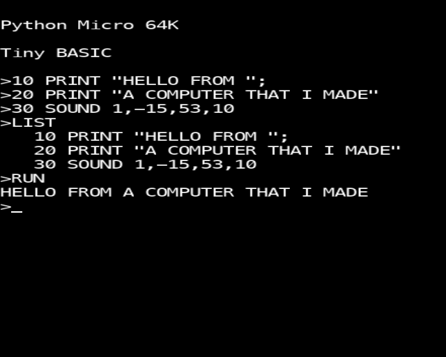
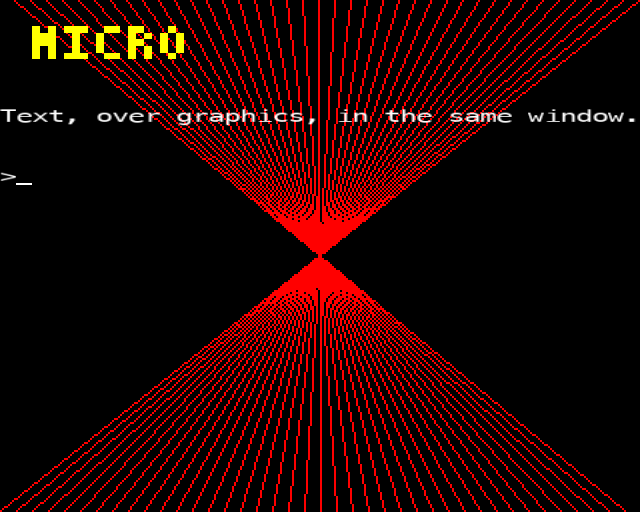
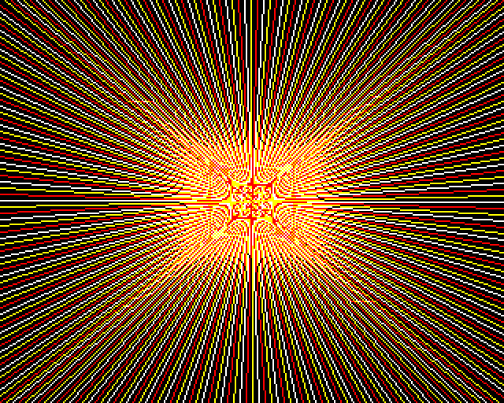
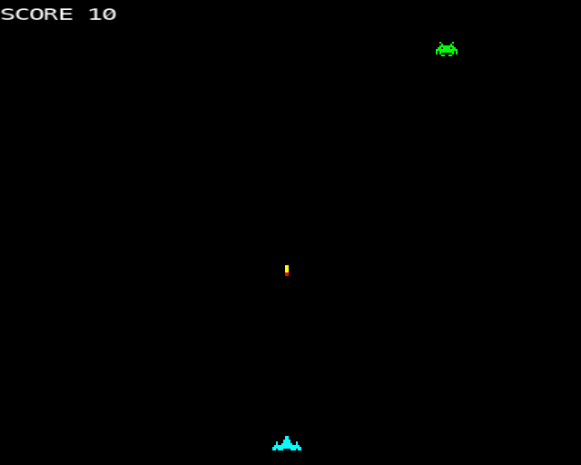

# Project 28 · Boot to BASIC

You switched it on, and it beeped, and two seconds later it was ready:

```text
BBC Computer 32K

BASIC

>_
```

There was no desktop, and nothing to load. The computer *was* a programming language, with a flashing cursor, waiting to be told what to do. Whatever you typed, it did, and if you put a number in front, it remembered. A generation of programmers started there.

In this last project **you'll build that computer.**



It boots to a prompt. The BASIC is the one that you wrote in Project 17, and it's about to learn `MOVE`, `DRAW`, `PLOT` and `GCOL`, which are Project 8's, and `SOUND` and `ENVELOPE`, which are Project 11's. The screen is a teletext page, which is Project 19's, laid over the graphics. It has something that the real machine never had: **hardware sprites**, which float over the picture without disturbing it, and know when they've hit one another. They're loaded from files made with Project 15's sprite editor. And the chapter ends with a game: a listing, to be typed in, in a language that you made, on a computer that you made.

There's very little in this project that's new. That's the point of it. Count the lines when you've finished: about 650 of them are written here, and they stand on some 2,700 that you wrote months ago, for other reasons, and that are about to be used without being changed. Everything that Project 26 said about structure is about to be cashed in.

| | |
|---|---|
| **You'll learn** | How to put a program together out of your own packages; an interpreter inside a game loop, and why neither may hog the other; a modal loop; layers; sprites, and collision by bounding box and then by mask; registering decorators as plain calls, and as closures; data that travels inside a package; making a minor release because you need one |
| **New tool skills** | None. You have them all |
| **Time** | 8 to 10 hours |
| **Before you start** | [Project 17](../part-3-interpreters/p17-tiny-basic.md) and [Project 27](p27-ship-it.md) are essential. [Projects 8](../part-2-pygame/p08-mode2-sketchpad.md), [11](../part-2-pygame/p11-sound-and-envelope.md), [15](../part-2-pygame/p15-sprite-editor.md) and [19](../part-4-web/p19-pyfax.md) made the parts |

## Predict

!!! question "Predict"
    ```python
    WORDS = {}


    def command(name):
        def register(function):
            WORDS[name] = function
            return function

        return register


    def install(computer):
        @command("WHOAMI")
        def who_am_i():
            return computer


    install("Model A")
    install("Model B")
    print(len(WORDS), WORDS["WHOAMI"]())
    ```

??? success "Answer"
    ```text
    1 Model B
    ```

    A `def` is a statement, which runs, and a decorator runs with it. Put both inside a function, and they run *each time that the function is called*. So each call of `install` makes a new `who_am_i`, which is a closure and remembers its own `computer`, and registers it under the same name, in the same dictionary. The second replaces the first. This is how BASIC's new statements will come to know which computer they belong to, and it's why there's one computer to a program. Stage 5.

!!! question "Predict"
    ```python
    import pygame

    a = pygame.Mask((4, 4))
    a.set_at((0, 3))  # one pixel, at the bottom left
    b = pygame.Mask((4, 4))
    b.set_at((3, 0))  # one pixel, at the top right

    print(a.overlap(b, (-3, 3)), a.overlap(b, (3, -3)))
    ```

??? success "Answer"
    ```text
    (0, 3) None
    ```

    A **mask** is a grid of bits, one for each pixel: solid, or not. `a.overlap(b, offset)` slides `b` over `a`, and returns the first place where both are solid, or `None`. The offset is **where `b`'s top left-hand corner is, measured from `a`'s**. Put `b` three to the left and three down, and its one pixel lands on `a`'s. Put it three to the right and three up, and they're six pixels apart. Get the subtraction the wrong way round, and you have this chapter's bug hunt. Stage 4.

!!! question "Predict"
    ```python
    TRUE, FALSE = -1, 0
    fired, edge = 1, 8

    print(TRUE & TRUE, fired & edge, fired and edge)
    ```

??? success "Answer"
    ```text
    -1 0 8
    ```

    Your BASIC's `AND` is Python's `&`: it works on the *bits* of two numbers, as the BBC Micro's did. That's why BASIC's `TRUE` is -1, which is every bit set, and not 1: `-1 AND` anything true is still true. But `1 AND 8` is nought, since 1 and 8 have no bits in common, and so `IF F AND EDGE(3)` doesn't mean what it seems to. The author of this chapter wrote exactly that, in the game at the end, and spent a while watching bolts sail off the top of the screen for ever. Python's `and` isn't arithmetic at all: it hands back one of its operands.

## Build

### Stage 1: The plan, and a release

```text
                          ┌───────────────────────────┐
                          │           micro           │   new: about 650 lines
                          └─┬───────┬───────┬───────┬─┘
             ┌──────────────┘       │       │       └──────────────┐
      ┌──────┴──────┐      ┌────────┴──┐  ┌─┴────────┐    ┌────────┴──────┐
      │ tiny_basic  │      │   beeb    │  │  pyfax   │    │ sprite_editor │
      │ Project 17  │      │  8, 11,27 │  │    19    │    │      15       │
      └─────────────┘      └─────┬─────┘  └──────────┘    └───────┬───────┘
     the language           graphics,      the page of          .sprite files
                             sound         forty by 25
                                 └──────── pygame-ce ─────────────┘
```

Every arrow points downwards, at something older and more settled, as Project 26 said that it should. None of the four knows that the micro exists.

Before anything can be built, one of them needs to change. `beeb.vsync()` shows the picture, and deals with the keyboard, and owns the window. That was right for Breakout. A computer has to show the picture *with sprites and text on top*, and read the keyboard in its own way. It needs to be handed the picture, and left to get on with it.

This is what Project 27 was for. **`beeb` is at 1.0.0, and its interface is a promise.** Can this be done without breaking it? It can: nothing need change, and one thing need be added. That's a **minor** release. In `beeb`, on a branch:

<!-- listing: projects/28-boot-to-basic/beeb/src/beeb/screen.py -->
```python title="src/beeb/screen.py"
def canvas() -> pygame.Surface:
    """Return the surface that's being drawn on, at the mode's own size.

    It's for programs that want to show it themselves, with something of their
    own on top. They mustn't call vsync, which shows it, and owns the window.
    """
    return _need_canvas()
```

Import it in `__init__.py`, and add `"canvas"` to `__all__`, since it's a promise too. Two tests, in `tests/test_screen.py`:

<!-- listing: projects/28-boot-to-basic/beeb/tests/test_screen.py -->
```python title="tests/test_screen.py"
def test_the_canvas_is_the_size_of_the_mode(mode2):
    assert beeb.canvas().get_size() == (160, 256)


def test_what_is_drawn_is_on_the_canvas(mode2):
    beeb.gcol(0, 1)
    beeb.plot(69, 0, 0)
    assert beeb.canvas().get_at_mapped((0, 255)) == 1
```

Then the ritual, which takes two minutes:

```console
$ code CHANGELOG.md                 # under [1.1.0]: Added: `beeb.canvas()`, and what it's for
$ uv version --bump minor
beeb-yourname 1.0.0 => 1.1.0
$ uv run pytest
$ git commit -am "Release 1.1.0"
$ git switch main
$ git merge canvas
$ git tag -a v1.1.0 -m "Version 1.1.0"
$ git push origin main v1.1.0
```

Every program that used 1.0.0 will run on 1.1.0 without being touched, and the number says so.

Now the new project. Strict pyright will want a `py.typed` in each of the four packages, as you know. `pyfax` has had one since Project 20, and `beeb` since Project 27. `tiny_basic` and `sprite_editor` need an empty file apiece.

```console
$ cd making
$ uv init micro
$ cd micro
$ uv add --editable ../beeb ../tiny-basic ../pyfax ../sprite-editor
$ uv add --dev pytest ruff pyright
$ code .
```

In `pyproject.toml`, ask for `beeb-yourname>=1.1.0`, which is an honest floor, set the command to `micro = "micro.app:main"`, make pyright strict, and copy the `[tool.pytest]` table from `beeb`, with its filter for Pygame's grumble.

### Stage 2: A text screen, and a line editor

The screen is forty columns by twenty-five rows of characters, each with a colour. You've made that before: it's a **`pyfax.Page`**. A page is something that's laid out once, and published. A screen is *written to*, by a program, a character at a time, and so it needs what a page hasn't: a **cursor**, and a way to **scroll**. Create `src/micro/textscreen.py`:

<!-- listing: projects/28-boot-to-basic/src/micro/textscreen.py -->
```python title="src/micro/textscreen.py"
"""The text screen: forty columns, twenty-five rows, a cursor, and a scroll.

The page underneath is Project 19's. There's no Pygame in here.
"""

from pyfax import COLUMNS, ROWS, Cell, Colour, Page
from pyfax.page import BLANK

RUB_OUT = "\x7f"


class TextScreen:
    def __init__(self) -> None:
        self.page = Page(0, "The screen")
        self.column = 0
        self.row = 0
        self.ink = Colour.WHITE

    def clear(self) -> None:
        self.page.rows[:] = [[BLANK] * COLUMNS for _ in range(ROWS)]
        self.column = self.row = 0

    def move_to(self, column: int, row: int) -> None:
        """Put the cursor somewhere, as TAB(x, y) does."""
        self.column = max(0, min(COLUMNS - 1, column))
        self.row = max(0, min(ROWS - 1, row))

    def write(self, text: str) -> None:
        for character in text:
            if character == "\n":
                self.new_line()
            elif character == RUB_OUT:
                self.rub_out()
            else:
                self.page.rows[self.row][self.column] = Cell(character, self.ink)
                self.column += 1
                if self.column == COLUMNS:
                    self.new_line()

    def new_line(self) -> None:
        self.column = 0
        if self.row < ROWS - 1:
            self.row += 1
        else:  # at the bottom, everything moves up, and the top line is lost
            del self.page.rows[0]
            self.page.rows.append([BLANK] * COLUMNS)

    def rub_out(self) -> None:
        """Step back one place, and blank it. At the left, go up to the line before."""
        if self.column > 0:
            self.column -= 1
        elif self.row > 0:
            self.row -= 1
            self.column = COLUMNS - 1
        self.page.rows[self.row][self.column] = BLANK

    def text(self) -> str:
        """Return what's on the screen, without the empty lines at the bottom."""
        return self.page.text().rstrip("\n")
```

`TextScreen` *has* a page, and isn't one. It's composition, from Project 15's table, since a screen isn't "a kind of" page: nobody wants a screen with a page number and a title, to be put on a web site.

Scrolling is two lines, and it's the reason for keeping the rows in a list: delete the first, and append a blank one. `self.page.rows[:] = …`, in `clear`, replaces the *contents* of the list of rows, and leaves it the same list, so that anything else that's holding it sees the change.

The line editor is as simple as the original's. The BBC Micro's couldn't move the cursor back into a line. It could add to the end, and take from the end. `src/micro/editor.py`:

<!-- listing: projects/28-boot-to-basic/src/micro/editor.py -->
```python title="src/micro/editor.py"
"""The line editor. Like the original's, it can add to the end, and take from the end."""

from micro.textscreen import RUB_OUT, TextScreen

LONGEST = 238  # as on the BBC Micro, which kept the line in one 256-byte page


class LineEditor:
    def __init__(self, screen: TextScreen) -> None:
        self.screen = screen
        self.line = ""

    def type(self, character: str) -> None:
        if character.isprintable() and len(self.line) < LONGEST:
            self.line += character
            self.screen.write(character)

    def rub_out(self) -> None:
        if self.line:
            self.line = self.line[:-1]
            self.screen.write(RUB_OUT)

    def take(self) -> str:
        """Return is pressed: hand over the line, and start another."""
        line, self.line = self.line, ""
        self.screen.write("\n")
        return line
```

The editor keeps the line, and echoes each character to the screen as it arrives. `a, b = b, ""` in `take` is the swap from Project 1, doing a small job neatly: take the value, and reset it, in one line.

There's no Pygame anywhere in either file, and so the tests are quick and plain. `tests/test_textscreen.py`:

<!-- listing: projects/28-boot-to-basic/tests/test_textscreen.py -->
```python title="tests/test_textscreen.py"
def test_a_long_line_wraps_at_forty_columns():
    screen = TextScreen()
    screen.write("*" * (COLUMNS + 2))
    assert screen.text().splitlines() == ["*" * COLUMNS, "**"]


def test_at_the_bottom_everything_moves_up():
    screen = TextScreen()
    for number in range(ROWS + 2):
        screen.write(f"LINE {number}\n")
    shown = screen.text().splitlines()
    assert shown[0] == "LINE 3"
    assert shown[-1] == f"LINE {ROWS + 1}"
    assert screen.row == ROWS - 1
    assert len(screen.page.rows) == ROWS


def test_rubbing_out():
    screen = TextScreen()
    screen.write("CAT" + RUB_OUT + "N")
    assert screen.text() == "CAN"
# ...
def test_the_editor_echoes_what_is_typed_and_hands_the_line_over():
    screen = TextScreen()
    editor = LineEditor(screen)
    for character in "PRIMT":
        editor.type(character)
    editor.rub_out()
    editor.rub_out()
    editor.type("N")
    editor.type("T")
    assert screen.text() == "PRINT"
    assert editor.take() == "PRINT"
    assert editor.line == ""
    assert screen.row == 1
```

!!! success "Checkpoint"
    ```console
    $ uv run pytest
    $ git add .
    $ git commit -m "Add a text screen, on a PyFax page, and a line editor"
    ```

### Stage 3: Three layers

Every frame, the display is built from the back to the front:

1. **The graphics**: `beeb.canvas()`, which is small, 320 by 256 in MODE 1, and in which everything that BASIC has drawn stays drawn.
2. **The sprites**, laid over a *copy* of it. The canvas never sees them, and that's the whole trick. To move a sprite, draw it somewhere else next time. There's nothing to rub out.
3. That copy, **stretched** to the size of the window, 640 by 512, which gives the fat pixels of the period.
4. **The text**, at the window's full sharpness, in cells 16 wide and 20 high.

Create `src/micro/display.py`:

<!-- listing: projects/28-boot-to-basic/src/micro/display.py -->
```python title="src/micro/display.py"
"""Putting it all on the screen: the graphics, then the sprites, then the text."""

import pygame
from pyfax import Cell, Colour

from micro.sprites import SpriteLayer
from micro.textscreen import TextScreen

CELL_WIDTH, CELL_HEIGHT = 16, 20
TOP = 6  # twenty-five rows of twenty make 500, and the window is 512 high
FONTS = "menlo,consolas,dejavusansmono,liberationmono,couriernew,courier"
# The six squares of a graphics character: two across, and three down.
SIXELS = [
    pygame.Rect(x * 8, y, 8, high)
    for y, high in [(0, 7), (7, 6), (13, 7)]
    for x in (0, 1)
]


def rgb(colour: Colour) -> tuple[int, int, int]:
    """There's a bit each for red, green and blue, as there was in Project 19."""
    return (255 * (colour & 1), 255 * (colour >> 1 & 1), 255 * (colour >> 2 & 1))


class Display:
    def __init__(self) -> None:
        pygame.font.init()
        self.font = pygame.font.Font(pygame.font.match_font(FONTS), 20)
        self.glyphs: dict[tuple[str, Colour], pygame.Surface] = {}

    def glyph(self, character: str, ink: Colour) -> pygame.Surface:
        """Return a character's picture, stretched to fill a cell. Each is made once, and kept."""
        if (character, ink) not in self.glyphs:
            drawn = self.font.render(character, True, rgb(ink))
            size = (CELL_WIDTH, CELL_HEIGHT)
            self.glyphs[character, ink] = pygame.transform.smoothscale(drawn, size)
        return self.glyphs[character, ink]

    def cell(self, window: pygame.Surface, cell: Cell, column: int, row: int) -> None:
        place = pygame.Rect(
            column * CELL_WIDTH, TOP + row * CELL_HEIGHT, CELL_WIDTH, CELL_HEIGHT
        )
        if cell.paper != Colour.BLACK:
            window.fill(rgb(cell.paper), place)
        if cell.dots:
            for bit, square in enumerate(SIXELS):
                if cell.dots & (1 << bit):
                    window.fill(rgb(cell.ink), square.move(place.topleft))
        elif cell.text != " ":
            glyph = self.glyph(cell.text, cell.ink)
            window.blit(glyph, place)

    def show(
        self,
        canvas: pygame.Surface,
        sprites: SpriteLayer,
        screen: TextScreen,
        cursor: bool,
    ) -> None:
        window = pygame.display.get_surface()
        assert window is not None
        picture = pygame.Surface(canvas.get_size())
        picture.blit(canvas, (0, 0))
        sprites.draw(picture)
        pygame.transform.scale(picture, window.get_size(), window)

        for row, cells in enumerate(screen.page.rows):
            for column, cell in enumerate(cells):
                if cell.text != " " or cell.dots or cell.paper != Colour.BLACK:
                    self.cell(window, cell, column, row)
        if cursor:
            left, top = screen.column * CELL_WIDTH, TOP + screen.row * CELL_HEIGHT
            window.fill(rgb(screen.ink), (left, top + CELL_HEIGHT - 3, CELL_WIDTH, 2))
        pygame.display.flip()
```

A cell is drawn in one of three ways. If it has **`dots`**, it's one of Project 19's graphics characters, and its six squares are six rectangles: the bit arithmetic is the same as it was in CSS, and in Unicode, and now it's in Pygame. If it has a character, that's drawn with a font. And if it has neither, and its paper is black, it isn't drawn at all, and **the graphics show through**. That one decision is what lets text and pictures share a screen.

Pygame has no monospaced font of its own, and so `match_font` is given a list of names, and returns the first that the computer has: Menlo on a Mac, Consolas on Windows, DejaVu Sans Mono on most Linuxes. If it finds none, it returns `None`, and `Font(None, 20)` is Pygame's built-in one. Whichever it is, each character is drawn once, stretched to fill its cell, which gives teletext's wide letters, and kept in a dictionary: drawing text is slow, and looking up a picture of it isn't.

`SIXELS` is a list comprehension with two `for`s, as in Project 6, which makes six rectangles from the three rows' tops and heights. `square.move(place.topleft)` returns a copy of a rectangle, shifted.

To see it, before there's a computer behind it, the tutorial's repository has `stages/stage3_screen.py`, which draws some lines with `beeb`, puts a banner and a sentence on a `TextScreen`, and shows both until you press a key.

!!! example "Run it"
    ```console
    $ uv run stages/stage3_screen.py
    ```

    

    The banner is `pyfax.font.banner("MICRO")`, put on the screen's page with `page.picture`, exactly as it was put on a web page in Project 19.

### Stage 4: Sprites

The BBC Micro had no sprites. Its games drew their aliens on the screen, rubbed them out, and drew them again one place along, and the flicker and the damage to the background were the programmer's problem. Richer machines had sprites *in hardware*: the video chip laid a few small pictures over the screen as it was sent to the television, the program said only where, and a chip told it when two had touched. Yours is about to be a richer machine.

Create `src/micro/sprites.py`:

<!-- listing: projects/28-boot-to-basic/src/micro/sprites.py -->
```python title="src/micro/sprites.py"
"""Hardware sprites, which the BBC Micro never had: pictures that float over the screen.

A sprite isn't drawn on the graphics screen. It's laid over it, afresh, in every
frame, and so moving one disturbs nothing underneath.
"""

from dataclasses import dataclass
from enum import IntFlag
from pathlib import Path

import pygame
from beeb.screen import COLOURS, to_pixel
from sprite_editor.sprite import Sprite, SpriteError

SLOTS = 16


class Edge(IntFlag):
    """Which sides of the screen a sprite has crossed. EDGE(n) adds these up."""

    LEFT = 1
    RIGHT = 2
    BOTTOM = 4
    TOP = 8


@dataclass
class Slot:
    image: pygame.Surface
    mask: pygame.Mask
    x: float = 0  # in screen units: the sprite's bottom left-hand corner
    y: float = 0
    showing: bool = False


def picture_of(sprite: Sprite) -> pygame.Surface:
    """Turn one of Project 15's sprites into a surface, see-through where it's clear."""
    image = pygame.Surface((sprite.width, sprite.height), pygame.SRCALPHA)
    for (x, y), colour in sprite.pixels.items():
        image.set_at((x, y), COLOURS[colour])
    return image


class SpriteLayer:
    def __init__(self, size: tuple[int, int]) -> None:
        self.size = (
            size  # of the graphics screen, in its own pixels, which vary with the mode
        )
        self.slots: dict[int, Slot] = {}

    def define(self, number: int, path: Path) -> None:
        if not 0 <= number < SLOTS:
            raise ValueError("Bad sprite")
        try:
            image = picture_of(Sprite.load(path))
        except OSError:
            raise ValueError(f"Sprite not found: {path.stem}") from None
        except SpriteError as error:
            raise ValueError(f"Bad sprite {path.stem}: {error}") from None
        self.slots[number] = Slot(image, pygame.mask.from_surface(image))

    def slot(self, number: int) -> Slot:
        if number not in self.slots:
            raise ValueError("No such sprite")
        return self.slots[number]

    def put(self, number: int, x: float, y: float) -> None:
        slot = self.slot(number)
        slot.x, slot.y, slot.showing = x, y, True

    def hide(self, number: int) -> None:
        self.slot(number).showing = False

    def box(self, number: int) -> pygame.Rect:
        """Return where a sprite is, in the pixels of the graphics screen."""
        slot = self.slot(number)
        left, bottom = to_pixel(slot.x, slot.y, *self.size)
        box = slot.image.get_rect()
        box.bottomleft = (left, bottom + 1)
        return box

    def collide(self, first: int, second: int) -> bool:
        """Are two sprites touching? Boxes first, which is quick. Then pixels."""
        a, b = self.slot(first), self.slot(second)
        if not (a.showing and b.showing):
            return False
        box_a, box_b = self.box(first), self.box(second)
        if not box_a.colliderect(box_b):
            return False
        offset = (box_b.x - box_a.x, box_b.y - box_a.y)
        return a.mask.overlap(b.mask, offset) is not None

    def edge(self, number: int) -> Edge:
        box = self.box(number)
        width, height = self.size
        found = Edge(0)
        if box.left < 0:
            found |= Edge.LEFT
        if box.right > width:
            found |= Edge.RIGHT
        if box.bottom > height:
            found |= Edge.BOTTOM
        if box.top < 0:
            found |= Edge.TOP
        return found

    def draw(self, picture: pygame.Surface) -> None:
        """Lay every sprite that's showing over a picture, lowest number on top."""
        for number in sorted(self.slots, reverse=True):
            if self.slots[number].showing:
                picture.blit(self.slots[number].image, self.box(number))
```

`Sprite.load`, from Project 15, reads the file. `picture_of` turns it into a surface, which is made with **`pygame.SRCALPHA`**, so that every pixel starts out see-through, and only the coloured ones are set. `pygame.mask.from_surface` then makes the mask, from whichever pixels aren't see-through. You met `pygame.mask` in passing, in one of Project 14's tests. Here it earns its keep.

A sprite's position is in **screen units**, 1280 by 1024, from the bottom left, as everything in `beeb` is, and it's the position of the sprite's bottom left-hand corner. `box` turns that into a rectangle in the canvas's pixels, with `to_pixel`, which is `beeb`'s own. The `+ 1` is there because a rectangle's `bottom` is the row *below* its last one, as a slice's end is the index after its last.

#### Boxes first, and then pixels

```text
      ┌────────────┐
      │ ·  ·  ·  · │          The boxes overlap.
      │ ·  ▓▓▓▓  · │
      │ ▓▓▓▓▓▓▓▓▓▓ │     ┌────────┐
      │ ▓▓ ·  · ▓▓ ├─────┤ ·  ▒▒  │      The pixels don't.
      └────────────┘  ·  │ ▒▒▒▒▒▒ │
                   │  ·  └────────┘
                   └──────┘
```

`collide` asks two questions, and the order matters.

**Do the rectangles overlap?** `colliderect` is four comparisons. Nearly always, the answer is no, and that's the end of it.

**If they do, do any solid pixels coincide?** That's `mask.overlap`, which was the second Predict, and it's a great deal more work. It's also what makes a game feel fair. With boxes alone, a bolt that passes the alien's empty corner is a hit, and the player knows that it wasn't.

Cheap test first, to rule out most cases, and the dear one only for the few that are left: it's one of the most useful patterns in programming. In games it has a name, *broad phase and narrow phase*, and a database does the same when it consults an index before it reads any rows.

`Edge` is an `IntFlag`, as Project 19's `Dot` was, since a sprite may be over two edges at once, and BASIC, which has only numbers, can take it as one: `EDGE(2) AND 8` asks about the top. (*That's* what a bitwise `AND` is for.)

`tests/test_sprites.py`:

<!-- listing: projects/28-boot-to-basic/tests/test_sprites.py -->
```python title="tests/test_sprites.py"
from pathlib import Path

import pytest

from micro.sprites import Edge, SpriteLayer

MODE_1 = (320, 256)  # four screen units to a pixel, each way
CORNER = "sprite 4 4\n11..\n11..\n....\n....\n"
SQUARE = "sprite 4 4\n2222\n2222\n2222\n2222\n"


@pytest.fixture
def layer(tmp_path: Path) -> SpriteLayer:
    (tmp_path / "corner.sprite").write_text(CORNER, encoding="utf-8")
    (tmp_path / "square.sprite").write_text(SQUARE, encoding="utf-8")
    layer = SpriteLayer(MODE_1)
    layer.define(1, tmp_path / "corner.sprite")
    layer.define(2, tmp_path / "square.sprite")
    return layer


def test_a_sprite_is_put_by_its_bottom_left_hand_corner(layer: SpriteLayer):
    layer.put(2, 0, 0)
    assert layer.box(2).bottomleft == (0, 256)
    layer.put(2, 400, 512)
    assert layer.box(2).topleft == (100, 124)


def test_sprites_that_are_apart_are_not_touching(layer: SpriteLayer):
    layer.put(1, 0, 0)
    layer.put(2, 400, 400)
    assert not layer.collide(1, 2)


def test_boxes_may_overlap_where_pixels_do_not(layer: SpriteLayer):
    layer.put(1, 100, 100)
    layer.put(
        2, 108, 108
    )  # two pixels right, and two up: over the corner's empty part...
    assert layer.box(1).colliderect(layer.box(2))
    assert not layer.collide(1, 2)
    layer.put(2, 104, 108)  # ...and one pixel back: now the solid parts meet
    assert layer.collide(1, 2)
    assert layer.collide(2, 1)
```

The third test is the specification of "fair": the boxes overlap, and the answer is still no, until the solid parts meet.

!!! success "Checkpoint"
    ```console
    $ uv run pytest
    $ git add .
    $ git commit -m "Add the display, and sprites with collisions"
    ```

### Stage 5: New words for BASIC

In Project 17 you were promised that new statements could be added to your BASIC without touching its parser, by writing a Python function with a decorator on it. It's time to collect. Create `src/micro/basic.py`:

<!-- listing: projects/28-boot-to-basic/src/micro/basic.py -->
```python title="src/micro/basic.py"
"""What this computer adds to Project 17's BASIC: graphics, sound, sprites and keys.

Nothing here touches the parser, or the machine. Every statement is a Python
function with a decorator on it, which puts it on the interpreter's lists.
"""

from collections.abc import Generator
from contextlib import contextmanager
from typing import TYPE_CHECKING

import beeb
import pygame
from pyfax import Colour
from tiny_basic.errors import BasicError
from tiny_basic.machine import Machine
from tiny_basic.registry import command, function
from tiny_basic.values import FALSE, TRUE, number, string

if TYPE_CHECKING:
    from micro.computer import Micro

# INKEY(-99) asks "is the space bar down?" These are the BBC's own numbers.
KEYS = {
    -1: pygame.K_LSHIFT, -2: pygame.K_LCTRL, -99: pygame.K_SPACE, -74: pygame.K_RETURN,
    -98: pygame.K_z, -67: pygame.K_x, -66: pygame.K_a, -82: pygame.K_s,
    -73: pygame.K_SEMICOLON, -105: pygame.K_SLASH,
    -26: pygame.K_LEFT, -122: pygame.K_RIGHT, -58: pygame.K_UP, -42: pygame.K_DOWN,
}  # fmt: skip


@contextmanager
def complaining() -> Generator[None]:
    """Turn Python's complaints into BASIC's, so that they stop the program, and not the computer."""
    try:
        yield
    except (ValueError, NotImplementedError) as error:
        raise BasicError(str(error)) from None


def whole(value: float | str) -> int:
    return int(number(value))


@command("MOVE")
def move(machine: Machine, x: float, y: float) -> None:
    beeb.move(number(x), number(y))


@command("DRAW")
def draw(machine: Machine, x: float, y: float) -> None:
    beeb.draw(number(x), number(y))


@command("PLOT")
def plot(machine: Machine, k: float, x: float, y: float) -> None:
    with complaining():
        beeb.plot(whole(k), number(x), number(y))


@command("GCOL")
def gcol(machine: Machine, action: float, colour: float) -> None:
    with complaining():
        beeb.gcol(whole(action), whole(colour))


@command("CLG")
def clg(machine: Machine) -> None:
    beeb.clg()


@command("SOUND")
def sound(
    machine: Machine, channel: float, amplitude: float, pitch: float, time: float
) -> None:
    with complaining():
        beeb.sound(whole(channel), whole(amplitude), whole(pitch), whole(time))


@command("ENVELOPE")
def envelope(
    machine: Machine, n: float, a: float, d: float, s: float, r: float
) -> None:
    with complaining():
        beeb.envelope(whole(n), number(a), number(d), number(s), number(r))


def install(micro: "Micro") -> None:
    """List the statements that have to know which computer they're running on.

    They're closures: each is made here, and remembers `micro`.
    """

    @command("MODE")
    def mode(machine: Machine, n: float) -> None:  # pyright: ignore[reportUnusedFunction]
        with complaining():
            micro.mode(whole(n))

    @command("CLS")
    def cls(machine: Machine) -> None:  # pyright: ignore[reportUnusedFunction]
        micro.screen.clear()

    @command("COLOUR")
    def colour(machine: Machine, n: float) -> None:  # pyright: ignore[reportUnusedFunction]
        micro.screen.ink = Colour(whole(n) % 8)

    @command("WAIT")
    def wait(machine: Machine) -> None:  # pyright: ignore[reportUnusedFunction]
        micro.waiting = True

    @command("SPRITE")
    def sprite(machine: Machine, n: float, name: str) -> None:  # pyright: ignore[reportUnusedFunction]
        with complaining():
            micro.sprites.define(
                whole(n), (micro.disc / string(name)).with_suffix(".sprite")
            )

    @command("PUT")
    def put(machine: Machine, n: float, x: float, y: float) -> None:  # pyright: ignore[reportUnusedFunction]
        with complaining():
            micro.sprites.put(whole(n), number(x), number(y))

    @command("HIDE")
    def hide(machine: Machine, n: float) -> None:  # pyright: ignore[reportUnusedFunction]
        with complaining():
            micro.sprites.hide(whole(n))

    @function("COLLIDE")
    def collide(a: float, b: float) -> float:  # pyright: ignore[reportUnusedFunction]
        with complaining():
            touching = micro.sprites.collide(whole(a), whole(b))
        return TRUE if touching else FALSE

    @function("EDGE")
    def edge(n: float) -> float:  # pyright: ignore[reportUnusedFunction]
        with complaining():
            return float(micro.sprites.edge(whole(n)))

    @function("TAB")
    def tab(column: float, row: float) -> str:  # pyright: ignore[reportUnusedFunction]
        """PRINT TAB(10, 5); "HELLO" works because this moves the cursor, and prints nothing."""
        micro.screen.move_to(whole(column), whole(row))
        return ""

    @function("INKEY")
    def inkey(n: float) -> float:  # pyright: ignore[reportUnusedFunction]
        """INKEY(-99): is the space bar down? INKEY(0): the next key that was typed, or -1."""
        if number(n) < 0:
            return TRUE if KEYS.get(whole(n)) in micro.held else FALSE
        while micro.typed:
            if character := micro.typed.popleft():
                return float(ord(character))
        return -1.0
```

**The top half is what Project 17 had in mind.** `MOVE` is a function of the machine and two values, and its body is one call to `beeb`. There are seven like it, and with them your BASIC can draw, and sing.

**`complaining`** is a context manager, made from a generator, as Project 17's `timed` was. `beeb` raises `ValueError` for a bad mode, in Python's manner. If that escaped, it would stop *the computer*, with a traceback. It should stop *the program*, with a message and a line number, as `BasicError` does. Every call that might complain is made inside `with complaining():`, and the translation is written once.

**The bottom half needs to know which computer it's running on.** `CLS` clears *a* screen, and `COLLIDE` asks *a* layer of sprites. Project 17's functions aren't even given the machine. So these are defined **inside `install(micro)`**, as closures, and that was the first Predict. Each `def` runs when `install` is called, its decorator puts it on the interpreter's list, and it remembers `micro` for ever after. `# pyright: ignore[reportUnusedFunction]` is for strict mode, which sees a function that's defined and never mentioned again, and can't know that the decorator has kept it.

**`TAB`** is a small cheat, and a satisfying one. On the BBC Micro you wrote `PRINT TAB(10,5);"HELLO"`. Your `PRINT` knows nothing about `TAB`. It doesn't need to. `TAB` is an ordinary function, which *moves the cursor* and returns an empty string, which `PRINT` then dutifully prints.

**`INKEY`** with a negative number asks whether a key is down *now*, which is what a game wants. The numbers are the original's, so that listings from old magazines stand a chance: -98 is ++z++, -67 is ++x++, -74 is ++enter++, -99 is the space bar. With nought, it takes the next character that's been typed, or gives -1.

**`WAIT`** sets a flag, and you're about to see who reads it.

### Stage 6: The computer

Now the piece that holds all the others. Create `src/micro/computer.py`:

<!-- listing: projects/28-boot-to-basic/src/micro/computer.py -->
```python title="src/micro/computer.py"
"""The computer: a screen, a keyboard, some sprites, a disc, and a BASIC to run them."""

import time
from collections import deque
from pathlib import Path

import beeb
import pygame
from pyfax import Colour
from tiny_basic import BasicError, Machine
from tiny_basic.nodes import Statement
from tiny_basic.parser import parse

from micro.basic import install
from micro.display import Display
from micro.editor import LineEditor
from micro.sprites import SpriteLayer
from micro.textscreen import TextScreen

FRAME_RATE = 50
THINKING_TIME = 0.012  # seconds of BASIC in each frame, which leaves some for drawing
BANNER = "\nPython Micro 64K\n\nTiny BASIC\n\n"
UNPRINTABLE = {pygame.K_RETURN: "\r", pygame.K_BACKSPACE: "\b"}


class Micro:
    """It's also BASIC's console: PRINT comes to write(), and INPUT to read()."""

    def __init__(self, disc: Path, frame_rate: int = FRAME_RATE) -> None:
        self.disc = disc
        self.frame_rate = frame_rate
        self.screen = TextScreen()
        self.editor = LineEditor(self.screen)
        self.machine = Machine(self)
        self.display = Display()
        self.clock = pygame.time.Clock()
        self.lines: deque[str] = deque()  # typed, with Return, and not yet dealt with
        self.typed: deque[str] = deque(maxlen=32)  # typed while a program runs
        self.held: set[int] = set()  # the keys that are down at this moment
        self.running = False
        self.reading = False  # an INPUT is waiting for a line
        self.waiting = False  # WAIT: no more BASIC until the next frame
        self.escaped = False
        self.frames = 0
        install(self)
        self.mode(1)
        self.write(BANNER + ">")

    # The console, as the interpreter sees it.

    def write(self, text: str) -> None:
        self.screen.write(text)

    def read(self, prompt: str) -> str:
        """Wait for a line, while the computer goes on around us. It's a loop within the loop."""
        self.write(prompt)
        self.reading = True
        try:
            while self.typed and not self.lines:  # whatever was typed ahead comes first
                self.edit(self.typed.popleft())
            while not self.lines:
                self.frame()
                if self.escaped:
                    raise KeyboardInterrupt
        finally:
            self.reading = False
        return self.lines.popleft()

    # The keyboard.

    def press(self, key: int, character: str = "") -> None:
        self.held.add(key)
        character = character or UNPRINTABLE.get(key, "")
        if key == pygame.K_ESCAPE:
            self.escaped = True
        elif self.running and not self.reading:
            self.typed.append(character)  # kept for INKEY(0), or for the next INPUT
        else:
            self.edit(character)

    def edit(self, character: str) -> None:
        """Give one character to the line editor."""
        if character in ("\r", "\n"):
            self.lines.append(self.editor.take())
        elif character in ("\b", "\x7f"):
            self.editor.rub_out()
        elif character:
            self.editor.type(character)

    def release(self, key: int) -> None:
        self.held.discard(key)

    def type_in(self, text: str) -> None:
        """Press the keys for some text. It's for tests, and for demonstrations."""
        for character in text:
            key = pygame.K_RETURN if character == "\n" else ord(character.lower())
            self.press(key, character)
            self.release(key)
            if character == "\n":
                self.frame()

    # Doing as it's told.

    def mode(self, number: int) -> None:
        """Change mode, which clears everything. MODE 7 is text alone, on a black screen."""
        beeb.mode(1 if number == 7 else number)
        pygame.display.set_caption("Python Micro")
        pygame.key.set_repeat(400, 40)
        self.sprites = SpriteLayer(beeb.canvas().get_size())
        self.screen.clear()
        self.screen.ink = Colour.WHITE

    def obey(self, line: str) -> None:
        """Deal with a line that's been typed at the prompt."""
        word, _, rest = line.strip().partition(" ")
        name = rest.strip(' "')
        try:
            match word.upper():
                case "RUN":
                    self.machine.variables.clear()
                    self.begin()
                case "SAVE" if name:
                    self.machine.save((self.disc / name).with_suffix(".bas"))
                case "LOAD" if name:
                    self.machine.load_file((self.disc / name).with_suffix(".bas"))
                case "CAT":
                    names = sorted(path.name for path in self.disc.iterdir())
                    self.write("\n".join(names) + "\n")
                case "" | "LIST" | "NEW":
                    self.machine.enter(line)
                case _ if word.isdecimal() or line.strip()[0].isdecimal():
                    self.machine.enter(line)
                case _:
                    self.begin(parse(line))
        except BasicError as error:
            self.write(f"\n{error}\n")
        if not self.running:
            self.write(">")

    def begin(self, immediate: tuple[Statement, ...] = ()) -> None:
        self.machine.load(immediate)
        self.running = True
        self.typed.clear()

    def think(self) -> None:
        """Run the program for a little while: until time's up, or WAIT, or the end."""
        self.waiting = False
        enough = time.perf_counter() + THINKING_TIME
        try:
            while not self.waiting and time.perf_counter() < enough:
                if self.escaped:
                    raise BasicError("Escape", self.line_number())
                if not self.machine.step():
                    self.finish()
                    return
        except BasicError as error:
            self.finish(f"{error}\n")

    def line_number(self) -> int | None:
        steps, pc = self.machine.steps, self.machine.pc
        return steps[pc][0] if pc < len(steps) else None

    def finish(self, message: str = "") -> None:
        self.machine.pc = len(self.machine.steps)
        self.running = self.escaped = False
        self.typed.clear()  # or a game's worth of Zs and Xs would arrive at the prompt
        if self.screen.column:
            self.write("\n")
        self.write(message + ">")

    # One fiftieth of a second.

    def frame(self) -> None:
        for event in pygame.event.get():
            if event.type == pygame.QUIT:
                raise SystemExit
            if event.type == pygame.KEYDOWN:
                self.press(event.key, event.unicode)
            elif event.type == pygame.KEYUP:
                self.release(event.key)

        if self.running and not self.reading:
            self.think()
        elif not self.reading:
            self.escaped = False  # there's nothing to escape from
            while self.lines and not self.running:
                self.obey(self.lines.popleft())

        self.frames += 1
        cursor = (not self.running or self.reading) and self.frames % 32 < 16
        self.display.show(beeb.canvas(), self.sprites, self.screen, cursor)
        self.clock.tick(self.frame_rate)

    def run(self) -> None:
        beeb.sound(1, -12, 101, 3)
        while True:
            self.frame()
```

And the command, in `src/micro/app.py`. Leave `stock` out for now: it's Stage 7's.

<!-- listing: projects/28-boot-to-basic/src/micro/app.py -->
```python title="src/micro/app.py"
def main() -> None:
    parser = argparse.ArgumentParser(
        prog="micro", description="A computer that boots to BASIC."
    )
    parser.add_argument(
        "disc", nargs="?", type=Path, default=Path("disc"), help="a folder"
    )
    parser.add_argument(
        "--version", action="version", version=f"micro {version('micro')}"
    )
    args = parser.parse_args()
    stock(args.disc)
    Micro(args.disc).run()
```

#### It's the console

In Project 17, `Machine(console)` was given a `Terminal`, whose `write` was `print`, and whose `read` was `input`. `Console` is a protocol, and so anything with those two methods will do. **`Machine(self)`**: the computer *is* the console. `PRINT` arrives at `write`, and goes to the text screen. The interpreter has no idea that anything has changed, and that's Project 26 again, in one line.

#### A frame

`frame` is one fiftieth of a second, and it's the loop of every game that you've written: **events, update, draw**. The events are keys. The update is one of two things. If a program is running, the computer **thinks**. If not, it **obeys** any lines that have been typed. Then everything is drawn.

#### Thinking, without freezing

Project 17's `run` was `while self.step(): pass`. Put that inside a game loop, and type `10 GOTO 10`, and the window would never be drawn again, nor a key read, Escape included. You met this in Project 25, as a blocking call inside the event loop, and it's the same disease: **two loops, and one of them won't give way.**

The cure was built in Project 17, for this day. **`step()` does one statement, and returns.** So `think` runs steps *for twelve thousandths of a second*, and stops, whether the program has finished or not. The frame gets drawn. The next frame, it thinks again, from where it left off, since the machine's whole state is in its `pc`, its variables and its stacks. Your BASIC programs are being **multitasked**, co-operatively, with the display, by a scheduler that's six lines long.

How fast is it? On the laptop on which this was written, a loop of `X=X+I*2` and `NEXT` ran at about 900,000 statements a second, with the display still going. A BBC Micro managed a thousand or two. You can afford the overhead of having written your interpreter in Python.

**`WAIT`** is how a program gives way *on purpose*. It sets `waiting`, which ends `think` at once, and so a game loop with a `WAIT` in it goes round exactly once in each frame, fifty times a second, on any computer. Without it, a game would run as fast as the computer could go, which was the ruin of many a game when its owner bought a faster machine.

`obey` takes `RUN` away from the interpreter, for the same reason. Project 17's `enter("RUN")` doesn't come back until the program ends. This one calls `load()`, sets `running`, and returns at once. A statement with no line number is treated in the same way, in case somebody types `REPEAT: UNTIL FALSE` at the prompt.

#### A loop within the loop

`INPUT` is harder. The interpreter calls `console.read(prompt)`, in the middle of a step, and **expects a string back**. It can't be told "ask me later". But the string won't exist until somebody has typed it, over many frames.

So `read` **runs the frames itself**: `while not self.lines: self.frame()`. It's a loop inside the loop. `reading` is set, so that those inner frames draw, and take keys for the line editor, and don't think. When ++enter++ is pressed, a line appears, the inner loop ends, and `read` returns it to a `step` that never knew that it had waited two hundred frames. It's called a **modal loop**, and it's how dialogue boxes used to be made. It's safe here only because `frame` is careful not to do the one thing that would go wrong, which is to call `step` again from inside `step`.

Escape, during an `INPUT`, raises `KeyboardInterrupt`, since Project 17's `step` already turns that into "Escape at line 10". It was written for ++ctrl+c++ in a terminal, and serves here without alteration.

Characters that were typed *before* the `INPUT`, while the program was busy, are taken first. That's **type-ahead**, and the original had it, in a buffer of 32 bytes, which is why `typed` is a `deque(maxlen=32)`.

!!! example "Run it"
    ```console
    $ uv run micro
    ```

    It beeps, and there's a prompt. Try these.

    ```text
    >PRINT 2+2
    >MOVE 0,0: DRAW 1279,1023
    >10 FOR I=1 TO 10
    >20 PRINT I, I*I
    >30 NEXT
    >LIST
    >RUN
    >10 GOTO 10
    >RUN
    ```

    The last will run for ever, with the window alive. Press ++esc++. Then `SOUND 1,-15,53,20`, and `MODE 2`, and whatever comes into your head. **It's a computer.** Take a moment.

### Stage 7: Testing a computer

How do you test a thing with a window, a keyboard and a clock in it? By having arranged, all along, that none of them is essential. The window is SDL's dummy one, as in every Pygame test since Project 8. The clock is `frame_rate=0`, which `tick` takes to mean "don't wait". And the keyboard is one method, **`press`**, which the event loop calls, and which a test can call as well. `type_in` presses the keys for a string, and lets a frame go by after each ++enter++. `tests/conftest.py`:

<!-- listing: projects/28-boot-to-basic/tests/conftest.py -->
```python title="tests/conftest.py"
import os
import shutil
from pathlib import Path

# Tell SDL, the library underneath Pygame, not to open real windows or play
# real sound. This has to happen before pygame is imported anywhere.
os.environ.setdefault("SDL_VIDEODRIVER", "dummy")
os.environ.setdefault("SDL_AUDIODRIVER", "dummy")

import pytest

from micro.computer import Micro

DISC = Path(__file__).parent.parent / "src" / "micro" / "welcome"


@pytest.fixture
def micro(tmp_path: Path) -> Micro:
    """A computer with a copy of the disc in it, which runs as fast as it can."""
    disc = tmp_path / "disc"
    shutil.copytree(DISC, disc)
    return Micro(disc, frame_rate=0)


def lines(micro: Micro) -> list[str]:
    """Return what's on the text screen, without the blank lines."""
    return [line for line in micro.screen.text().splitlines() if line.strip()]


def run(micro: Micro, *program: str, frames: int = 50) -> None:
    """Type a program in, RUN it, and give it some frames to finish in."""
    micro.type_in("NEW\n" + "".join(line + "\n" for line in program) + "RUN\n")
    for _ in range(frames):
        if not micro.running:
            break
        micro.frame()
```

(`DISC` is a folder that Stage 8 will make.) With those, a test of the whole computer reads like a session at the keyboard. `tests/test_computer.py`:

<!-- listing: projects/28-boot-to-basic/tests/test_computer.py -->
```python title="tests/test_computer.py"
def test_a_program_that_never_ends_does_not_freeze_the_computer(micro: Micro):
    run(micro, "10 GOTO 10", frames=3)
    assert micro.running
    assert micro.frames >= 3


def test_escape_stops_a_program(micro: Micro):
    run(micro, "10 GOTO 10", frames=3)
    micro.press(pygame.K_ESCAPE)
    micro.frame()
    assert not micro.running
    assert lines(micro)[-2:] == ["Escape at line 10", ">"]


def test_wait_gives_up_the_rest_of_the_frame(micro: Micro):
    run(micro, "10 N=0", "20 N=N+1: WAIT: GOTO 20", frames=2)
    before = micro.machine.variables["N"]
    for _ in range(10):
        micro.frame()
    assert micro.machine.variables["N"] == before + 10


def test_input_takes_what_was_typed_ahead(micro: Micro):
    run(micro, '10 INPUT "NAME? ", N$', '20 PRINT "HELLO ";N$', frames=0)
    micro.type_in("BBC\n")  # typed while the program runs, before it has asked
    assert lines(micro)[-3:] == ["NAME? BBC", "HELLO BBC", ">"]
    assert not micro.reading
# ...
def test_a_bad_value_stops_the_program_and_not_the_computer(micro: Micro):
    run(micro, "10 PLOT 999,0,0")
    assert lines(micro)[-2:] == ["PLOT 999 isn't supported at line 10", ">"]
    run(micro, "10 MODE 9")
    assert lines(micro)[-2:] == ["Bad MODE at line 10", ">"]
# ...
def test_sprites_are_drawn_over_the_picture_and_leave_it_alone(micro: Micro):
    run(micro, '10 SPRITE 1,"alien": PUT 1,600,500')
    window = pygame.display.get_surface()
    assert window is not None
    box = micro.sprites.box(1)
    green = [
        (x, y)
        for x in range(box.left * 2, box.right * 2)
        for y in range(box.top * 2, box.bottom * 2)
        if window.get_at((x, y))[:3] == (0, 255, 0)
    ]
    assert green
    assert all(
        beeb.point(x, y) == 0 for x in range(580, 680, 4) for y in range(480, 580, 4)
    )
```

The first of those is the test of Stage 6's whole argument: a program that never ends, and a computer that goes on counting frames. The last looks at the window's pixels for an alien's green, and then asks `beeb.point` about the canvas underneath, which has none. The sprite is on the screen, and isn't on the picture.

The tutorial's repository has twenty tests of the computer, and you should write at least that many. When something surprising happens at the prompt, and it will, **type what you typed into a test.**

!!! success "Checkpoint"
    ```console
    $ uv run pytest
    $ uv run pyright
    $ git add .
    $ git commit -m "Add the computer: a prompt, BASIC that can't freeze it, and INPUT"
    ```

### Stage 8: A disc, and something on it

`SAVE "name"`, `LOAD "name"` and `CAT` are in `obey` already, and they use the interpreter's own `save` and `load_file`, in a folder: the disc. A new computer should come with something on its disc. The programs and the sprites could sit in a folder beside `pyproject.toml`. Think back to Project 27, and to what *wasn't* in the wheel. Anybody who installed the micro would get an empty disc.

**Data that must travel with a package goes inside the package**, and is read with `importlib.resources`, as Breakout's levels were, and Project 14's ships. Make a folder, `src/micro/welcome/`, and add the rest of `app.py`:

<!-- listing: projects/28-boot-to-basic/src/micro/app.py -->
```python title="src/micro/app.py"
"""The `micro` command."""

import argparse
from importlib import resources
from importlib.metadata import version
from pathlib import Path

from micro.computer import Micro


def stock(disc: Path) -> None:
    """Put the welcome programs on the disc, unless they're there already.

    They travel inside the package, and so they're wherever the package is installed.
    """
    disc.mkdir(parents=True, exist_ok=True)
    for item in resources.files("micro").joinpath("welcome").iterdir():
        if not (disc / item.name).exists():
            (disc / item.name).write_bytes(item.read_bytes())
```

The first time that the computer is switched on in a folder, it makes `disc/`, and copies the welcome programs on to it. After that, the disc is yours, and nothing on it is ever overwritten. There's a test of it in the tutorial's repository, and another, in Project 27's manner, which builds the wheel, opens it, and looks for `micro/welcome/alien.bas`.

Now the sprites. **Draw them, with the sprite editor from Project 15**, and save them into `src/micro/welcome/`: a ship, an alien, and a bolt. Here are the author's, as the text that the editor writes, to show the sizes:

<!-- listing: projects/28-boot-to-basic/src/micro/welcome/ship.sprite -->
```text title="src/micro/welcome/ship.sprite"
# The player's ship. Draw your own in the sprite editor from Project 15.
sprite 16 8
.......66.......
.......66.......
......6666......
..6...6666...6..
..6..666666..6..
.66666666666666.
6666666666666666
66.666....666.66
```

The alien is 16 by 8 as well, and the bolt is 2 by 6. And a first program for the disc, to show that the graphics are all there. Type it at the prompt, and `SAVE "carpet"`. Your file will be in `disc/`, and a copy of it belongs in `welcome/`.

<!-- listing: projects/28-boot-to-basic/src/micro/welcome/carpet.bas -->
```basic title="carpet.bas"
10 REM CARPET. Two fans of lines, and what happens where they cross.
20 MODE 1
30 FOR X=0 TO 1279 STEP 16
40 GCOL 0,1+(X DIV 16) MOD 3
50 MOVE X,0: DRAW 1279-X,1023
60 NEXT
70 FOR Y=0 TO 1023 STEP 16
80 GCOL 0,1+(Y DIV 16) MOD 3
90 MOVE 0,Y: DRAW 1279,1023-Y
100 NEXT
```



A hundred and forty-four lines are drawn in a frame or two. On the original, you could watch each one being drawn.

### Stage 9: Ship it

It's a program like any other, and Project 27's list applies to it: a name of its own, the whole `[project]` table, a `README.md` with a picture at a full address, a `CHANGELOG.md` whose first entry is 0.1.0, a `LICENSE`, the pre-commit hooks, `check.yml` with the two `SDL_` variables, and `release.yml`.

One thing is new. Build it, and look at what it asks for, with Project 27's type-in listing:

```console
$ uv build
$ uv run ../beeb/inside.py dist/micro_yourname-0.1.0-py3-none-any.whl
...
  Requires-Dist:      beeb-yourname>=1.1.0
  Requires-Dist:      pyfax
  Requires-Dist:      sprite-editor
  Requires-Dist:      tiny-basic
```

`[tool.uv.sources]`, with its paths to folders on your computer, **didn't ship**, and couldn't have. It's an arrangement for your own desk. The wheel says only *what* it needs, and it's for the installer to find them, on an index. So before the micro can be installed by anybody else, **its four dependencies have to be published**, each under a name of your own, and each with a floor that you've tested. It's the last lesson of the tutorial, and it's Project 26's arrows once more: you release from the bottom of the diagram upwards.

On your own computer, the paths still work, and this is all it takes to have your micro as a command, anywhere:

```console
$ uv tool install --editable .
$ cd ~
$ micro
```

!!! success "Checkpoint"
    ```console
    $ uv run pytest
    $ git add .
    $ git commit -m "Add a welcome disc, a README, a changelog and a licence"
    $ git tag -a v0.1.0 -m "Version 0.1.0"
    $ gh repo create micro --public --source=. --push
    $ git push origin v0.1.0
    ```

## Type-in listing

This is the last one, and it isn't Python. Switch the computer on, type `NEW`, and type this in, as people did, from a magazine propped against the television. `SAVE "alien"` before you `RUN`: that's period advice, and it's still good. ++z++ and ++x++ move, and ++enter++ fires.

<!-- listing: projects/28-boot-to-basic/src/micro/welcome/alien.bas -->
```basic title="alien.bas"
10 REM ALIEN. Z and X to move, RETURN to fire.
20 MODE 1
30 SPRITE 1,"ship": SPRITE 2,"alien": SPRITE 3,"bolt"
40 X=600: AX=100: AY=900: DX=8: S=0: F=0
50 REPEAT
60 IF INKEY(-98) AND X>0 THEN X=X-16
70 IF INKEY(-67) AND X<1216 THEN X=X+16
80 IF INKEY(-74) AND F=0 THEN F=1: BX=X+28: BY=64: SOUND 1,-10,160,2
90 IF F THEN BY=BY+32: PUT 3,BX,BY ELSE HIDE 3
100 IF EDGE(3) THEN F=0
110 AX=AX+DX: PUT 2,AX,AY: PUT 1,X,32
120 IF EDGE(2) THEN DX=-DX: AY=AY-48: SOUND 2,-8,40,1
130 IF COLLIDE(2,3) THEN S=S+10: F=0: AX=RND(1100): AY=900: DX=DX*1.15: SOUND 0,-15,4,4
140 PRINT TAB(0,0);"SCORE ";S
150 WAIT
160 UNTIL COLLIDE(1,2) OR AY<40
170 SOUND 0,-15,6,20
180 PRINT TAB(15,12);"GAME OVER"
```



1. There isn't a line in it that rubs anything out. Why not? What would lines 90 and 110 have had to do, on a real BBC Micro?
2. Take the `WAIT` out of line 150. What happens, and why? What does it tell you about how fast your interpreter is?
3. Line 100 is `IF EDGE(3) THEN F=0`. The author first wrote `IF F AND EDGE(3) THEN F=0`, and the bolt never came back. Why? The third Predict will help. Which bit is set in `EDGE(3)` when a bolt leaves the top?
4. When line 120 asks about `EDGE(2)`, is it asking about where the alien *was*, or where it's just been put? Swap lines 110 and 120, and play. Less changes than you might expect. Why?
5. `COLLIDE(2,3)` is never true when no bolt is flying, though the bolt's sprite is still *somewhere*. Which line of `sprites.py` sees to that?
6. Follow one press of ++z++ from the keyboard to the ship: through `frame`, `press`, `held`, `INKEY`, the variable `X`, `PUT`, a `Slot`, `box`, `draw`, and the window. Eight of your modules are involved. Can you name the project in which you wrote each?

## Bug hunt

A colleague has "tidied" `collide`. In their game, they say, it mostly works, but some bolts go clean through the alien, and others hit thin air. It's in the tutorial's repository, as `projects/28-boot-to-basic/bughunt/glancing.py`, with two sprites that make it plain: each is four pixels square, and only a quarter of each is solid.

```console
$ uv run bughunt/glancing.py
One right on top of the other. Touching? False
Nowhere near each other.       Touching? True
```

1. **Reproduce it**, and draw the two cases on squared paper: both boxes, and both solid quarters.
2. **Predict:** the bounding boxes overlap in both cases. So which of `collide`'s two questions is giving the wrong answer?
3. **Write two failing tests**, one for each symptom. `tests/test_sprites.py` has a fixture that you can adapt.
4. **Fix it.** It's one line. Then explain why a game with symmetrical sprites, which meet head-on, would "mostly work".

??? success "Solution"
    ```python
    offset = (box_a.x - box_b.x, box_a.y - box_b.y)
    return a.mask.overlap(b.mask, offset) is not None
    ```

    The subtraction is backwards. `a.mask.overlap(b.mask, offset)` wants to know **where `b` is, as seen from `a`**: `b`'s corner, less `a`'s. This gives it where `a` is, as seen from `b`, and so the second mask is tried on the *opposite* side of the first from where it really is. That was the second Predict.

    ```python
    offset = (box_b.x - box_a.x, box_b.y - box_a.y)
    ```

    When two sprites are symmetrical, and meet squarely, the mirror image of the truth looks much like the truth, and so the bug hides. It shows when sprites are lopsided, or meet at a corner, which is when a player is watching most closely.

    **What to take from it.** Whenever there's a "from" and a "to", there's a sign to get wrong, and a test with a symmetrical example can't tell. **Test with lopsided data**: an L, and never a square. And when a library's function takes an offset, a direction or an order, don't reason about it. Try it in the REPL, with the smallest case that could tell the two apart, as the Predict did.

## Challenges

**Tweak**

1. Change the boot message, and the beep. A two-note beep is two `sound` calls, since a channel plays its notes one after another.
2. Write a BASIC program that times a loop of 100,000, with `TIME`. Then change `THINKING_TIME` to 0.002, and to 0.018. What happens to the speed of BASIC, and what happens to the feel of the keyboard?
3. Add ++q++, ++w++ and ++p++ to `KEYS`. The BBC's numbers were -17, -34 and -56.

**Extend**

1. **The last line.** On ++up++, at an empty prompt, bring back the previous line, to be edited and entered again. You did it for Textual in Project 26. Where does the history live here?
2. **`TOUCH(n)`.** Is a sprite over anything that's been *drawn*? It's the ground, in a game of landing, and the walls, in a maze. The canvas can be made into a mask, by telling a copy of it which colour is see-through.
3. **`GET$`.** Wait for one key, and return it. `read` shows how to wait. `INKEY(n)`, for a positive `n`, waits for up to `n` hundredths of a second, and is the same idea with a time limit.
4. **Animation.** `SPRITE 2,"alien1","alien2"` gives a sprite two pictures, and `FRAME 2,1` chooses between them. Each picture needs its own mask.
5. **Teach your BASIC procedures**, or arrays, as Project 17's last challenges asked. With `DIM`, the game could have a whole rank of aliens. It's a change to the *interpreter*, in its own project, with its own tests, and its own minor release, and the micro gets it for nothing.

??? tip "Hint for TOUCH"
    `picture = canvas.copy()`, then `picture.set_colorkey(picture.get_palette_at(0))`, then `pygame.mask.from_surface(picture)`, is a mask of everything that isn't colour 0. `overlap` takes the sprite's mask, and its box's `topleft`.

**Invent**

1. **A cassette interface.** The real one saved programs as *sound*: a 1200 hertz tone for a nought, and 2400 for a one. Project 11 can make those tones, and the `wave` module can write them. `*SAVE` a program as a WAV file that you can listen to. Then, for the brave, `*LOAD` it again, by counting how often the samples cross zero.
2. **Your score, on line.** A new statement, `SCORE "alien", S`, which posts to Project 22's high-score server, without freezing the computer. Project 25 told you how.
3. **A ROM cartridge.** `micro alien.bas` should boot straight into the game. Then: a wheel, with a game inside it, that anybody could run with one `uvx` command.
4. **A proper MODE 7.** Teletext pages had colour codes and graphics codes *in* the text, as characters that took up a space. Give `PRINT` a `CHR$(129)` that turns the rest of the line red, and `CHR$(145)` that turns it into red graphics, and then show one of Project 20's live pages on it.
5. **The machine underneath.** Where next? See the [last chapter](where-next.md), which has a 6502 in it.

A solution to `TOUCH`, and the bug hunt's tests, are in the project's `solutions/` folder.

## Recap

You can now:

- [x] build a program out of several of your own packages, and keep every dependency pointing downwards
- [x] add to a published package without breaking it, and release it as a minor version
- [x] give an existing data model a new job by wrapping it, as `TextScreen` wraps a page
- [x] draw a display in layers, and explain why a sprite that's never drawn on the picture never has to be rubbed out
- [x] detect collisions in two phases, by bounding box and then by mask, and get the offset the right way round
- [x] run an interpreter inside a game loop, a slice of time at a frame, so that neither can freeze the other
- [x] write a modal loop, and say what makes one safe
- [x] extend a language with registered functions: at the top of a module, and as closures that remember an object
- [x] translate one layer's exceptions into another's with a small context manager
- [x] test a whole interactive program by pressing its keys from a test
- [x] ship data inside a package, and copy it out on first run
- [x] explain why a path dependency can't be published, and release a family of packages from the bottom up

**Read more:** [`pygame.mask`](https://pyga.me/docs/ref/mask.html) · [`importlib.resources`](https://docs.python.org/3/library/importlib.resources.html) · The BBC Microcomputer User Guide, which is easy to find on line, and whose chapters on `SOUND`, `ENVELOPE` and `PLOT` you can now read as a specification · [Game Programming Patterns: Game Loop](https://gameprogrammingpatterns.com/game-loop.html), by Robert Nystrom, and the chapter after it, *Update Method* · [Crafting Interpreters](https://craftinginterpreters.com/), by the same author, for when your BASIC wants procedures, and then closures, and then a compiler

## The end of the listing

Twenty-eight projects ago, you typed `print("Hello")`, and were asked to guess what `1 / 2` would be.

Since then you've written a guessing game, a fractal explorer, Snake, Breakout, Asteroids, a synthesiser, a wireframe spaceship, a sprite editor, two programming languages, a plotter, a teletext service, three editions of an adventure, a high-score server, a newsroom and a computer. You've written hundreds of tests. You can use Git without fear, and read a traceback without panic, and you know what `self` is, and where it comes from. You've published a package. You know why the rules of a program shouldn't know what's drawing them, and you've got the computer to prove that it matters.

More than any of that, you know how to **find out**: predict, run, and look. Read the error. Ask the REPL. Write the failing test first. None of those is about Python, and all of them will outlast it.

The people who typed listings into those machines in 1983 didn't stop at the end of the magazine. They changed a number, to see what would happen. Then they changed a line. Then they wrote their own.

[There are some ideas on the next page.](where-next.md)

```text
>_
```
